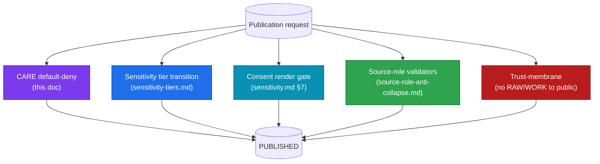
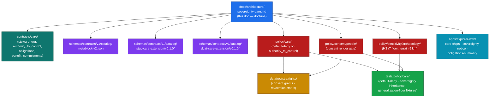

<!-- [KFM_META_BLOCK_V2]
doc_id: kfm://doc/architecture/sovereignty-care
title: Sovereignty & CARE — Architecture
type: standard
version: v1.0
status: draft
owners: TODO-architecture-steward-and-care-steward-and-tribal-liaison
created: 2026-05-25
updated: 2026-05-25
policy_label: public
related:
  - ./sensitivity.md
  - ./sensitivity-tiers.md
  - ./source-roles.md
  - ./source-role-anti-collapse.md
  - ./smoke-atmosphere-hazards.md
  - ./connected-dots-architecture-brief.md
  - ./contract-schema-policy-split.md
  - ./governed-api.md
  - ./maplibre-3d.md
  - ../doctrine/directory-rules.md
  - ../../contracts/care/
  - ../../schemas/contracts/v1/catalog/metablock-v2.json
  - ../../policy/care/README.md
  - ../../policy/consent/people/README.md
  - ../../policy/sensitivity/archaeology/README.md
  - ../../data/registry/rights/
  - ../../KFM_Encyclopedia.md
  - ../../Kansas_Frontier_Matrix_-_Domains_v1_1___Pass_23_32_Consolidated_Atlas.md
tags:
  - kfm
  - architecture
  - sovereignty
  - care
  - fair
  - indigenous-data-governance
  - tribal-sovereignty
  - cultural-heritage
  - archaeology
  - consent
  - default-deny
notes:
  - "Doctrinal anchors: Components Pass 10 §6.15 (Category C15 — FAIR + CARE Reconciliation, cards C15-01 through C15-04); Atlas v1.1 card KFM-P1-PROG-0023 (MetaBlock v2 CARE fields); KFM-P11-PROG-0025 (Tribal sovereignty label inheritance via AIANNH/BIA); KFM-P1-IDEA-0034 (cultural/archaeological/steward review); KFM-P1-IDEA-0031 (deny-by-default for sensitive exact locations); ML-061-158/159/160 (H3 r7-r9 generalization, CARE chips); ai-build-operating-contract.md §23 (sensitive-domain decision matrix)."
  - "KFM is NOT a substitute for community authority. CARE provides the architectural surface for community-authored governance; KFM enforces what authorities-to-control declare. Where this doc speaks of 'how CARE is enforced in KFM', it speaks operationally — not interpretively. Decisions about whether something IS CARE-applicable and what the consent posture should be remain with the relevant community and steward."
  - "FAIR shapes the architecture; CARE shapes the policy. (C15-04 slogan: 'FAIR by Design, CARE in Practice'.)"
  - "Default-deny on CARE-tagged assets is CONFIRMED doctrine (C15-03). The remediation playbook for legitimate-asset denials is named in the Pass 10 high-priority writing track and is NEEDS VERIFICATION as a separate authoring task; this doc names the architectural surface for it."
  - "Authoring session: docs-only. No mounted repository, CI run, workflow, dashboard, runtime log, or release artifact was inspected. Implementation-maturity claims are bounded per the current-session evidence limit."
  - "Sixth doc in the publication-controls architecture family alongside sensitivity.md, sensitivity-tiers.md, source-roles.md, source-role-anti-collapse.md, smoke-atmosphere-hazards.md."
[/KFM_META_BLOCK_V2] -->

<a id="top"></a>

# Sovereignty & CARE — Architecture

> **FAIR shapes the architecture; CARE shapes the policy.** This doc is the architectural treatment of the sovereignty / CARE dimension of KFM publication: the MetaBlock v2 CARE fields, the default-deny rule for CARE-tagged assets, the tribal sovereignty label inheritance pattern, the generalization requirements for sensitive cultural geometry, the DCAT/STAC kfm:care namespace, and the remediation surface for legitimate denials. The rule is simple and not yielding: when an asset names an `authority_to_control`, publication defaults to deny until that authority's consent grant is present, valid, and unrevoked.


[](#)
[](#)

> [!IMPORTANT]
> **KFM is not a substitute for community authority.** CARE provides the architectural surface for community-authored governance; KFM enforces what authorities-to-control declare. Decisions about whether something *is* CARE-applicable and what the consent posture should be remain with the relevant community and steward. This doc speaks operationally — how the architecture encodes those decisions in machine-checkable form — not interpretively. The corpus is explicit: "Determining which assets are CARE-applicable requires judgment that cannot be fully automated; the field population is a curatorial process, not an engineering one."

> [!CAUTION]
> **This is doctrine-rank architecture, not implementation proof.** The FAIR+CARE pairing, MetaBlock v2 fields, default-deny rule, sovereignty label inheritance, generalization thresholds, and UI requirements are CONFIRMED from Components Pass 10 §6.15 (cards C15-01 through C15-04), Atlas v1.1 cards KFM-P1-PROG-0023, KFM-P11-PROG-0025, KFM-P1-IDEA-0034, and MapLibre v2.1 ML-061-158/159/160. Concrete schema homes, policy bundles, validator names, the curatorial-decision SOP, and the remediation playbook are **PROPOSED** until verified in a mounted repository.

---

## Contents

- [1. Purpose & scope](#1-purpose--scope)
- [2. The pairing: FAIR + CARE](#2-the-pairing-fair--care)
- [3. The four CARE principles](#3-the-four-care-principles)
- [4. MetaBlock v2 CARE fields](#4-metablock-v2-care-fields)
- [5. The default-deny rule (C15-03)](#5-the-default-deny-rule-c15-03)
- [6. Tribal sovereignty label inheritance](#6-tribal-sovereignty-label-inheritance)
- [7. Cultural, archaeological, sacred-site review](#7-cultural-archaeological-sacred-site-review)
- [8. Generalization rules for sensitive cultural geometry](#8-generalization-rules-for-sensitive-cultural-geometry)
- [9. The kfm:care DCAT / STAC namespace extension](#9-the-kfmcare-dcat--stac-namespace-extension)
- [10. CARE remediation playbook](#10-care-remediation-playbook)
- [11. Curatorial decisions: when does CARE apply?](#11-curatorial-decisions-when-does-care-apply)
- [12. UI requirements](#12-ui-requirements)
- [13. Composition with sister sub-architectures](#13-composition-with-sister-sub-architectures)
- [14. Per-domain CARE applicability](#14-per-domain-care-applicability)
- [15. Anti-patterns](#15-anti-patterns)
- [16. Where this lives in the repository](#16-where-this-lives-in-the-repository)
- [17. Verification backlog](#17-verification-backlog)
- [18. Related docs](#18-related-docs)
- [Appendix A — CARE applicability questionnaire](#appendix-a--care-applicability-questionnaire)

---

## 1. Purpose & scope

CARE — **Collective benefit, Authority to control, Responsibility, Ethics** — was developed by the Global Indigenous Data Alliance as the data-ethics complement to the technical FAIR principles. The KFM corpus adopts the pairing: **FAIR shapes the architecture so every asset is findable, accessible, interoperable, and reusable; CARE shapes the policy so that whether an asset is actually published, to whom, and on what terms is governed by the relevant community's authority.** Without CARE, FAIR alone produces technically open data that may violate the rights of the communities it describes. Without FAIR, CARE has no machine-checkable substrate.

**In scope.**
- The architectural treatment of CARE in KFM: MetaBlock v2 fields, default-deny rule, namespace extension, generalization requirements, UI surface, remediation surface.
- The tribal sovereignty label inheritance pattern (AIANNH / BIA overlays).
- The cultural / archaeological / sacred-site review requirements.
- Geometry generalization thresholds (H3 r7–r9 for sensitive archaeology; 5 km for archaeological terrain).
- The composition of CARE with the consent render gate, the sensitivity tier scheme, the source-role taxonomy, and the trust membrane.
- Per-domain CARE applicability (which domains are most often CARE-applicable).

**Out of scope.**
- Interpretation of Indigenous data sovereignty itself — see [GIDA's CARE Principles](#11-curatorial-decisions-when-does-care-apply) and the relevant community / steward authority.
- The general sensitivity architecture (see [`./sensitivity.md`](./sensitivity.md)).
- The T0–T4 release tier scheme (see [`./sensitivity-tiers.md`](./sensitivity-tiers.md)).
- The source-role taxonomy (see [`./source-roles.md`](./source-roles.md)) and rule (see [`./source-role-anti-collapse.md`](./source-role-anti-collapse.md)).
- Concrete Rego/OPA modules (live in `policy/care/`, `policy/consent/people/`).
- Per-domain canonical manuals (live at `docs/domains/<domain>/`).

[↑ Back to top](#top)

---

## 2. The pairing: FAIR + CARE

The pairing is **CONFIRMED doctrine** from Components Pass 10 §6.15 and card C15-04. The slogan — *"FAIR by Design, CARE in Practice"* — is not decoration. It is operational:

| Principle set | What it shapes | KFM expression |
|---|---|---|
| **FAIR** (Findable, Accessible, Interoperable, Reusable) | The **architecture**. Every asset has a stable identifier, an open protocol, a shared schema, and a clear license. | `SourceDescriptor`, `EvidenceBundle`, `EvidenceRef`, DCAT distributions, STAC Items, schema contracts. |
| **CARE** (Collective benefit, Authority to control, Responsibility, Ethics) | The **policy**. Whether an asset is actually published, to whom, and on what terms — is governed by the relevant community's authority. | MetaBlock v2 CARE fields; default-deny on `authority_to_control`; sovereignty label inheritance; cultural-review gates. |

```mermaid
flowchart LR
  classDef fair fill:#2ea44f,stroke:#14532d,color:#fff
  classDef care fill:#7c3aed,stroke:#4c1d95,color:#fff
  classDef joint fill:#1f6feb,stroke:#0b3d91,color:#fff
  classDef block fill:#b91c1c,stroke:#7f1d1d,color:#fff

  F["FAIR<br/>Findable · Accessible ·<br/>Interoperable · Reusable"]:::fair
  C["CARE<br/>Collective benefit · Authority to control ·<br/>Responsibility · Ethics"]:::care
  M["MetaBlock v2<br/>(FAIR fields + CARE fields)"]:::joint
  D["DCAT / STAC + kfm:care<br/>(CARE surfaces in catalog)"]:::joint
  O["OPA default-deny<br/>on authority_to_control"]:::block
  Pub[("PUBLISHED")]

  F --> M
  C --> M
  M --> D
  M --> O
  D --> Pub
  O -->|allow when grant present, valid, unrevoked| Pub
  O -.X.-|deny by default| Pub
```

> [!IMPORTANT]
> **FAIR alone is insufficient.** Technically open data that violates community rights is a CARE failure regardless of how findable and interoperable it is. **CARE alone is insufficient.** Principles without operational machinery are aspirational. The pairing — FAIR architecture + CARE policy — is what makes KFM's posture both checkable and ethical.

[↑ Back to top](#top)

---

## 3. The four CARE principles

The CARE principles below are the framework KFM adopts; their authoritative articulation belongs to the Global Indigenous Data Alliance. KFM treats them as the policy lens through which CARE-applicable assets are governed.

| Principle | What it means in CARE doctrine | KFM operational expression |
|---|---|---|
| **C — Collective benefit** | Data should be designed and used to provide benefit to the community, not just to researchers or institutions. | `benefit_commitments` field on MetaBlock v2 records what benefit flows back to the relevant community from publication and reuse. |
| **A — Authority to control** | The relevant community holds authority over decisions about the data — what it is, how it's used, who sees it. | `authority_to_control` field on MetaBlock v2 names the authoring community / body. A non-empty value triggers default-deny until the authority's consent grant is on file. |
| **R — Responsibility** | Those who work with the data have responsibility to support the community's vision and wellbeing. | `steward_org` field on MetaBlock v2 names the institutional steward; `obligations` field records what is required of users of the data. |
| **E — Ethics** | Indigenous rights and wellbeing are the primary concern through the data lifecycle. | The pairing of consent records (the consent render gate, see [`./sensitivity.md`](./sensitivity.md) §7), cultural-review requirements, and the default-deny rule together constitute the ethical floor. |

> [!NOTE]
> **The principles are not a checklist.** A CARE-applicable asset that passes every machine check can still be a CARE failure if the community's authority was not meaningfully respected. The architecture supports good practice; it does not replace it.

[↑ Back to top](#top)

---

## 4. MetaBlock v2 CARE fields

MetaBlock v2 extends the v1 (FAIR-only) shape with five CARE-aligned fields. **CONFIRMED** from Components Pass 10 §C15-01 and Atlas card KFM-P1-PROG-0023.

| Field | Meaning | Required when |
|---|---|---|
| `steward_org` | The institutional steward of the asset. | CARE applies (Indigenous, marginalized-community, sensitive-cultural, sovereignty-implicating). |
| `authority_to_control` | The community or body whose authority governs the asset. | CARE applies. **A non-empty value triggers default-deny per [§5](#5-the-default-deny-rule-c15-03).** |
| `consent` | The consent grant under which the asset is held — structured per the consent objects in [`./sensitivity.md`](./sensitivity.md) §7. | CARE applies. |
| `obligations` | The obligations attached to use of the asset (citation requirements, restrictions on derivative use, embargo periods, etc.). | CARE applies. |
| `benefit_commitments` | What benefit flows back to the relevant community from publication and reuse. | CARE applies. |

### 4.1 Optional-vs-required is itself a CARE decision

The five fields are **required for any asset where CARE applies** and **optional for assets where it does not**. The corpus is explicit (C15-01) that *the optionality is itself a CARE decision*: omitting the fields for a non-applicable asset is acceptable; omitting them for an applicable asset is a violation that the policy gate (C15-03) refuses.

### 4.2 Illustrative MetaBlock v2 (PROPOSED — NEEDS VERIFICATION)

```json
{
  "metablock_version": "2.0",
  "fair": {
    "identifier": "kfm:asset/archaeology/ellsworth-county/2026-q2",
    "license": "kfm:rights/care-restricted",
    "format": "application/geo+json",
    "rights_statement": "Held under named consent from Ellsworth County tribal liaison program."
  },
  "care": {
    "steward_org": "Ellsworth County Cultural Resources Office",
    "authority_to_control": "<tribal-authority-identifier>",
    "consent": {
      "consent_ref": "kfm:consent/<consent-id>",
      "expires_at": "2027-05-25T00:00:00Z",
      "scope": ["generalized-h3-r7", "context-only-story-nodes"],
      "revocation_endpoint": "https://<authority-endpoint>/status"
    },
    "obligations": [
      "Cite steward and authority in all derivative use.",
      "No precise coordinates in any derivative.",
      "Re-confirm consent before each release cycle."
    ],
    "benefit_commitments": [
      "Share generalized findings with the community in plain-language summary.",
      "Provide raw evidence access to the named authority on request."
    ]
  }
}
```

> [!WARNING]
> **CARE fields cannot be fabricated.** A `steward_org` value invented to "pass" the validator is a CARE failure of the highest order. The fields must reflect actual relationships with actual communities and stewards. The curatorial-decision SOP ([§11](#11-curatorial-decisions-when-does-care-apply)) is the architectural surface that prevents fabrication.

[↑ Back to top](#top)

---

## 5. The default-deny rule (C15-03)

> **Any asset whose MetaBlock v2 declares a non-empty `authority_to_control` field is gated by an OPA rule that defaults to deny on publication, with an explicit allow path that requires the named authority's consent grant to be present, valid, and unrevoked.**

That sentence — CONFIRMED doctrine from Components Pass 10 §C15-03 — is the operational hinge between CARE-as-principle and CARE-as-enforced-policy.

### 5.1 The rule logic

```mermaid
flowchart TD
  Start([Publication request<br/>for CARE-tagged asset])
  Q1{authority_to_control<br/>non-empty?}
  Q2{Consent grant<br/>on file?}
  Q3{Grant valid<br/>(not expired)?}
  Q4{Grant unrevoked<br/>(status list)?}
  Allow[ALLOW<br/>publish with obligations]
  Deny[DENY<br/>route to remediation]
  Skip([No CARE gate<br/>(other gates still apply)])

  Start --> Q1
  Q1 -->|No| Skip
  Q1 -->|Yes| Q2
  Q2 -->|No| Deny
  Q2 -->|Yes| Q3
  Q3 -->|No| Deny
  Q3 -->|Yes| Q4
  Q4 -->|No| Deny
  Q4 -->|Yes| Allow

  classDef deny fill:#b91c1c,stroke:#7f1d1d,color:#fff
  classDef allow fill:#2ea44f,stroke:#14532d,color:#fff
  classDef skip fill:#475569,stroke:#1e293b,color:#fff
  class Deny deny
  class Allow allow
  class Skip skip
```

### 5.2 Why default-deny

Per C15-03: **"Default-deny is the only posture that makes CARE robust to drift; default-allow with explicit denials would mean any oversight produces a CARE violation, while default-deny means oversight produces a publication delay that can be remediated."**

The asymmetry is architecturally deliberate. The cost of mistaken denial is operational friction (a delayed publication); the cost of mistaken allowance is a CARE violation (a published asset that should not have been). KFM accepts the friction to avoid the violation.

### 5.3 Gates where the rule runs

The default-deny rule fires at **two** governed transitions, so that a CARE violation is rejected at both build time and runtime:

| Gate | When it fires |
|---|---|
| **Promotion gate** (CATALOG → PUBLISHED) | Before any release advances to PUBLISHED. Build-time check. |
| **Admission webhook** (— → RAW) | When the source first arrives. Runtime check at intake. |

> [!IMPORTANT]
> **The rule is composable with all other gates.** Passing the CARE default-deny does not exempt the asset from the sensitivity-tier transitions, the consent render gate, the source-role validators, or the trust-membrane checks. It is **one** of several gates the asset must clear. See [§13](#13-composition-with-sister-sub-architectures) for composition.

[↑ Back to top](#top)

---

## 6. Tribal sovereignty label inheritance

PROPOSED policy from Atlas card **KFM-P11-PROG-0025**: artifacts whose AOIs (areas of interest) intersect AIANNH / BIA overlays should **inherit** `sovereignty:tribal` and sensitivity labels, or require signed time-boxed waivers before promotion.

### 6.1 The inheritance mechanism

| Step | What happens |
|---|---|
| **Admission** | The asset's AOI is computed and compared against AIANNH (American Indian, Alaska Native, and Native Hawaiian) and BIA (Bureau of Indian Affairs) overlay layers. |
| **Intersection** | If the AOI intersects any AIANNH or BIA polygon, the asset inherits a `sovereignty:tribal` label and the relevant authority identifiers. |
| **MetaBlock v2 update** | The `authority_to_control` field is populated with the intersecting authority identifiers (or held as `pending-consultation` if multiple). |
| **Default-deny applies** | The CARE rule (§5) now applies; publication requires consent grants from each named authority. |
| **Re-evaluation** | When source rights or sovereignty status changes (e.g., overlay updates), affected assets are re-evaluated. |

### 6.2 Signed time-boxed waivers

For assets where the AOI intersection is narrow, incidental, or already governed by a community-issued waiver, a **signed time-boxed waiver** can override the inheritance — but only with explicit cryptographic provenance:

- The waiver must be **signed** by the relevant authority (DSSE envelope).
- The waiver must be **time-boxed** (expiry in the signed payload).
- The waiver must be **revocable** via the same status-list mechanism used for consent (see [`./sensitivity.md`](./sensitivity.md) §7).
- The waiver is **referenced** in the MetaBlock v2 `consent` field with the consent-ref pattern.

> [!CAUTION]
> **Sovereignty label evasion is an anti-pattern.** Stripping the AIANNH intersection from the AOI, fuzzing the AOI to fall below the intersection threshold, or claiming "incidental" intersection without a signed waiver — all of these are CARE failures. The validator must check the *original* AOI, not the published-derivative AOI, to catch evasion.

[↑ Back to top](#top)

---

## 7. Cultural, archaeological, sacred-site review

PROPOSED policy from Atlas card **KFM-P1-IDEA-0034**: cultural, archaeological, tribal, sacred, burial, and steward-governed material requires **review and public-safe transformation** before release.

| Material class | Required review | Allowed transforms |
|---|---|---|
| **Archaeological site locations** | Steward + cultural review | Generalization to H3 r7–r9 cell (see [§8](#8-generalization-rules-for-sensitive-cultural-geometry)); never exact coordinates without review. |
| **Burial sites** | Cultural reviewer + rights-holder representative | Generally **T4 forever** (no public derivative); context-only Story Nodes if any release. |
| **Human remains** | Cultural reviewer + rights-holder + sovereignty review | **T4 forever** at all public surfaces. |
| **Sacred sites** | Cultural reviewer + sovereignty review | **T4 forever** at all public surfaces; Story Nodes use context-only spatial footprints. |
| **Restricted cultural archives** | Steward + cultural review | Held under named consent only; never bulk-published. |
| **Indigenous knowledge / oral history** | Community authority | Held under named consent; obligations preserved through derivative use. |
| **Collection-security locations** (museum holdings, etc.) | Security reviewer | Generalized to institution-level; never per-shelf detail. |
| **Looting-risk detail** | Security reviewer + cultural reviewer | **T4** by default; never public. |

> [!IMPORTANT]
> **The list is open, not closed.** The corpus names the most common cases; per-domain stewards may add to the list. When in doubt, the default is denial pending review. The Atlas Phase 5 / 6 lifecycle rule applies: *"disable sensitive layer if [review state cannot be established]."*

[↑ Back to top](#top)

---

## 8. Generalization rules for sensitive cultural geometry

CONFIRMED rules from MapLibre v2.1 ML-061-158 / ML-061-159 / ML-059-055 and ai-build-operating-contract.md §23.

### 8.1 Geometry generalization

| Geometry class | Generalization requirement | Source |
|---|---|---|
| **Archaeological sites — public layer** | Generalized to **H3 r7–r9** cell footprints. **Any geometry below H3 r7 is prohibited** for sensitive archaeology products without review. | ML-061-159 |
| **Sacred sites — public layer** | **No public derivative** of exact location; context-only Story Nodes only. | ML-061-158 |
| **Restricted cultural archives** | **No exact-coordinate exposure** without review. | ML-061-158 |
| **Cultural corridors, geophysics anomalies, historical alignments** | H3-generalized footprints; 3D scenes accept only generalized geometry. | ML-061-157 |
| **Archaeological terrain layers** | Coordinate generalization of **at least 5 km** when terrain is linked to archaeological locations; all captures require alt text and metadata. | ML-059-055 |
| **Reconstructed historical scenes** | Synthetic content carries Reality Boundary Note + `RepresentationReceipt` per [`./source-roles.md`](./source-roles.md) §6.14. | ML-059-046 |

### 8.2 H3 resolution reference

H3 is the recommended hex-grid system for sensitive-cultural generalization. Cell sizes shown are approximate (cell size varies with latitude).

| H3 resolution | Approximate cell area | Use in CARE generalization |
|---|---|---|
| **r6** | ~36 km² | Too coarse for site-level cultural context — typical lower bound for region-level public layers. |
| **r7** | ~5 km² | **Minimum allowed cell size** for sensitive archaeology products. |
| **r8** | ~0.7 km² | Allowed with steward review. |
| **r9** | ~0.1 km² | Allowed with steward + cultural review; near the upper bound of generalization. |
| **r10 and finer** | < 0.02 km² | **Prohibited** for sensitive archaeology without explicit named authorization (T3 only). |

### 8.3 The "not findable by policy" pattern

The Pass 10 high-priority architecture item names a **"not-findable-by-policy convention for CARE-restricted assets"**. The pattern is:

- The asset *exists* in the canonical store but is **not surfaced in the catalog** for the policy reasons recorded.
- The catalog row exists with a `policy:not-findable` flag and the policy reasons (anonymized as appropriate); searches do not return the asset.
- A steward query (authenticated reviewer surface) can list `not-findable` assets and see why.
- The pattern is the architectural answer to "how do you record an asset's existence without exposing it?"

> [!NOTE]
> The "not-findable-by-policy" convention is **PROPOSED**, named in the Pass 10 expansion agenda, and is NEEDS VERIFICATION as a concrete architecture item. This doc names the pattern; the schema PR and policy bundle that realize it are separate authoring tasks.

[↑ Back to top](#top)

---

## 9. The kfm:care DCAT / STAC namespace extension

CONFIRMED doctrine from Components Pass 10 §C15-02. The `kfm:care` namespace extension surfaces MetaBlock v2 CARE fields in DCAT distributions and STAC Item / Collection properties so that downstream catalog consumers see the fields **without reading the full MetaBlock**.

### 9.1 Why a namespace extension

DCAT and STAC are the catalog vocabularies KFM publishes through. Extending them with `kfm:care` means a downstream consumer that fetches a DCAT distribution or a STAC Item sees `steward_org`, `authority_to_control`, `consent`, `obligations`, and `benefit_commitments` **directly in the catalog representation**.

| Property | Behavior |
|---|---|
| Consumer **understands** `kfm:care` | Can act on the fields — display the steward, surface obligations, check consent expiry. |
| Consumer **does not understand** `kfm:care` | Ignores the fields safely; the consumer is not blocked but does not see CARE context either. |

### 9.2 PROPOSED illustrative STAC Item

```json
{
  "type": "Feature",
  "stac_version": "1.0.0",
  "stac_extensions": [
    "https://kfm.example.org/stac-extensions/care/v0.1.0/schema.json"
  ],
  "id": "kfm:asset/<asset-id>",
  "properties": {
    "datetime": "2026-05-25T00:00:00Z",
    "kfm:care": {
      "steward_org": "Ellsworth County Cultural Resources Office",
      "authority_to_control": "<authority-identifier>",
      "consent_status": "active",
      "consent_expires_at": "2027-05-25T00:00:00Z",
      "obligations_summary": "Cite steward + authority; no exact coords; re-confirm consent before each cycle.",
      "benefit_commitments_summary": "Generalized findings to community; raw access on request."
    }
  }
}
```

> [!NOTE]
> **The namespace URL above is illustrative.** Concrete namespace IRI, versioning policy, and upstream-submission posture (DCAT-AP, STAC-extensions registry) are PROPOSED. The Pass 10 expansion agenda lists "namespace-versioning policy" and "engage with the STAC extensions community" as follow-up items.

[↑ Back to top](#top)

---

## 10. CARE remediation playbook

Default-deny without good remediation paths is operational friction; the corpus is explicit (C15-03) that the rule must be paired with a clear remediation playbook so that legitimate CARE-applicable assets can reach publication when the consent is properly recorded.

> [!IMPORTANT]
> **The remediation playbook is a high-priority writing item in the Pass 10 expansion agenda (item 6, Writing Track, High priority).** This section names the architectural surface for it; the actual playbook is a separate authoring task. The section below is the **architectural shape** the playbook should fill, not the playbook itself.

### 10.1 The remediation surface

When the default-deny rule fires on a publication request, the system emits:

| Field | Content |
|---|---|
| `outcome` | `DENY` |
| `reasons[]` | One or more of: `MISSING_AUTHORITY_TO_CONTROL`, `MISSING_CONSENT_GRANT`, `EXPIRED_CONSENT`, `REVOKED_CONSENT`, `MISSING_STEWARD_ORG`, `OBLIGATIONS_NOT_RECORDED`, `BENEFIT_COMMITMENTS_NOT_RECORDED`, `AOI_INTERSECTS_AIANNH_NO_WAIVER`. |
| `remediation_ref` | URI to the relevant remediation playbook step. |
| `steward_contact` | Contact for the institutional steward (the `steward_org`). |

### 10.2 Open questions the playbook must answer

Per C15-03:

- **How are denied assets surfaced to the steward and the authority?**
- **Is there a feedback channel that does not itself violate CARE?**
- **What is the proposed cadence for re-evaluating denied assets?**
- **How are remediation outcomes logged so they become part of the asset's lineage?**

### 10.3 PROPOSED steward-feedback sidecar

Per C15-03 suggested future work: build the steward-feedback channel as a sidecar to the gate, with **explicit consent on what the channel may transmit**. The sidecar pattern is the only one that preserves CARE during remediation: the feedback channel must be governed by its own consent grant, separate from the asset's publication consent.

[↑ Back to top](#top)

---

## 11. Curatorial decisions: when does CARE apply?

The corpus is realistic (C15-01): **determining which assets are CARE-applicable requires judgment that cannot be fully automated; the field population is a curatorial process, not an engineering one.** The architecture provides the surface; the curatorial-decision SOP fills it.

> [!IMPORTANT]
> **The curatorial-decision SOP is listed in the Pass 10 expansion agenda as an authoring task** ("Author a curatorial-decision SOP for the CARE-applicability question and pilot it on the existing dossier set"). This section names the *architectural inputs* the SOP needs — it is not the SOP itself.

### 11.1 Material categories that almost always trigger CARE

The corpus identifies four categories where CARE applies as a default:

1. **Indigenous data** — data about, from, or affecting Indigenous communities.
2. **Marginalized-community data** — data about communities that have historically been the subject of, rather than the authors of, data collection.
3. **Sensitive-cultural data** — sacred sites, burial locations, cultural-heritage records, oral histories, ethnobotanical knowledge.
4. **Sovereignty-implicating data** — data that intersects tribal lands, treaty rights, or community-controlled territories.

### 11.2 Material categories where CARE may or may not apply

Some KFM material requires curatorial judgment to determine CARE applicability:

- **Historical land-survey data** that crossed Indigenous lands during periods of dispossession.
- **Public archaeological surveys** with mixed steward / community authorship.
- **Place-name records** with origins in multiple cultural traditions.
- **Wildlife / habitat data** that intersects culturally-significant species or landscapes.
- **Climate / weather records** in communities with traditional ecological knowledge systems.

### 11.3 The default-when-unclear rule

> **When CARE applicability is unclear, the default is "applicable pending review."** The asset admits with `authority_to_control = "pending-consultation"`, the default-deny rule fires, and the curatorial process resolves the question before publication.

This is the safest posture and is consistent with the broader KFM deny-by-default doctrine. It also means **the curatorial SOP must be reachable** — there must be an actual process to resolve the question, not just an architectural placeholder.

[↑ Back to top](#top)

---

## 12. UI requirements

CONFIRMED from MapLibre v2.1 ML-059-029, ML-061-160, ML-059-055.

| UI element | Required when | Behavior |
|---|---|---|
| **CARE annotation chip** | Any CARE-tagged asset is visible | Visible CARE status: `public` / `generalized` / `restricted`. Chip is part of the layer's standard trust-state surface. |
| **Sovereignty notice chip** | Asset has `sovereignty:tribal` label or AOI intersects AIANNH / BIA overlay | Visible sovereignty notice naming the authority (or "pending consultation"). |
| **Generalization log** | Asset has been generalized per [§8](#8-generalization-rules-for-sensitive-cultural-geometry) | Visible record of the generalization applied (e.g., "H3 r7 generalization"; "5 km terrain generalization"). |
| **Consent / custodial review indicator** | Asset is held under named consent | Visible indicator of consent status (active / expiring / expired) and steward contact. |
| **Obligations summary** | Any CARE-tagged asset | Summary of `obligations` visible in the Evidence Drawer. |
| **Alt text** | Any cultural / archaeological capture (screenshots, terrain rendering, etc.) | Alt text + metadata mandatory. |
| **Story Node context-only footprint** | Narrative covers sensitive cultural content | Context-only spatial footprint; precise site disclosure is avoided. |

> [!IMPORTANT]
> **CARE chips are not decoration; they are part of the trust membrane.** When the renderer shows a CARE-tagged asset *without* the chip, the surface has drifted out of compliance. UI lint tests must catch missing chips on CARE-tagged layers.

[↑ Back to top](#top)

---

## 13. Composition with sister sub-architectures

CARE composes with — does not replace — the other sub-architectures in the publication-controls family.



### 13.1 Composition rules

| Sister sub-architecture | Composition rule |
|---|---|
| **Sensitivity tiers (T0–T4)** | A CARE-tagged asset can never be **T0**; T1 is the highest tier available, and only after generalization. Sacred sites and burial are **T4 forever** (the existence of a record may be released only as steward review permits). |
| **Consent render gate** | The consent render gate ([`./sensitivity.md`](./sensitivity.md) §7) is the per-render check; the CARE default-deny is the per-publication check. Both must pass for any release. The CARE gate fires at promotion + admission; the consent render gate fires per request. |
| **Source-role taxonomy** | The CARE rule is **role-agnostic**: it applies to observed, regulatory, modeled, aggregate, administrative, candidate, and synthetic alike. A modeled product about a CARE-applicable community is still CARE-tagged. |
| **Source-role anti-collapse** | An AI surface paraphrasing a CARE-tagged asset is doubly governed: the source-role anti-collapse rule prevents role drift, and the CARE rule prevents publication without consent. AI text about CARE-applicable content needs both `AIReceipt` and a valid CARE allow path. |
| **Trust membrane** | CARE-tagged assets share the same trust-membrane invariants as everything else: no public client reads RAW / WORK / QUARANTINE; admin shortcuts are not public paths. |

> [!CAUTION]
> **A pass on one gate is not a pass overall.** A CARE-tagged asset that satisfies the default-deny rule (valid consent grant on file) still has to pass the tier-transition gates, the consent render gate, the source-role validators, and the trust-membrane checks. Each gate is independent; passes compose by intersection.

[↑ Back to top](#top)

---

## 14. Per-domain CARE applicability

The table below names KFM domains by how often CARE applies. **CARE applicability is a curatorial decision per asset**, not a domain-level default — but some domains see CARE applicability often enough that admission validators should expect it.

| Domain | CARE applicability | Notes |
|---|---|---|
| **Archaeology / Cultural Heritage** | **Very high** | Default expectation: CARE applies. Sacred sites and burials are T4 forever; site locations require steward + cultural review + H3 r7 generalization. |
| **People / DNA / Land** | **Very high** | DNA / genomic data is T4; living-person data requires consent; tribal-affiliated land assertions require CARE review. |
| **Fauna (sensitive occurrences)** | **High** | Culturally-significant species (e.g., totemic, ceremonial) require CARE review beyond standard sensitive-occurrence redaction. |
| **Flora (ethnobotanical)** | **High** | Ethnobotanical context, traditional-use plants, ceremonial species. |
| **Settlements / Infrastructure (community-significant)** | **Medium** | Tribal community settlements, ceremonial infrastructure, historical sites of cultural significance. |
| **Hazards** (events affecting tribal lands) | **Medium** | Disasters affecting tribal communities may carry CARE-tagged context. |
| **Hydrology** (sacred waters, fishing rights) | **Medium** | Specific reaches and water bodies may carry CARE tags. |
| **Geology** (sacred landforms) | **Medium** | Geological features of cultural significance. |
| **Roads / Rail / Trade Routes** | **Low** | Historical trails and trade routes may carry CARE tags where they cross or originate in tribal territories. |
| **Atmosphere / Air, Soil, Agriculture, Spatial Foundation** | **Low** | Generally not CARE-applicable, but the AIANNH / BIA intersection check still runs at admission. |

> [!NOTE]
> **"Low" does not mean "never."** Every admission runs the AOI intersection check (§6); a low-applicability domain can still produce CARE-tagged assets when the AOI intersects. The applicability column reflects the *typical case*, not a binary determination.

[↑ Back to top](#top)

---

## 15. Anti-patterns

<details>
<summary><strong>Sovereignty / CARE anti-pattern register</strong> (click to expand)</summary>

| Anti-pattern | Why it violates the rule |
|---|---|
| **Omitting CARE fields for a CARE-applicable asset.** | C15-01 explicit violation. C15-03 default-deny refuses the asset. |
| **Fabricating CARE fields to "pass" the validator.** | Curatorial fraud. CARE fields must reflect actual relationships. |
| **Default-allow with explicit denials for CARE-tagged assets.** | C15-03 explicitly rejects this posture. Default-deny is the only robust stance. |
| **Stripping AIANNH intersection from an AOI to evade label inheritance.** | Sovereignty label evasion. Validator must check original AOI. |
| **Treating "incidental" AIANNH intersection as a free pass.** | Without a signed waiver, no intersection is incidental enough. |
| **Publishing archaeological geometry below H3 r7 without review.** | ML-061-159 explicit prohibition. |
| **Rendering reconstructed historical scenes without Reality Boundary Note.** | Source-role collapse (synthetic → observed). See [`./source-role-anti-collapse.md`](./source-role-anti-collapse.md) §5 pattern #6. |
| **Re-publishing a CARE-tagged asset after consent revocation.** | The status-list check on every render must catch this. Failure is a CARE violation. |
| **Bulk-publishing restricted cultural archives.** | Only named-consent releases permitted; bulk is never authorized. |
| **Treating CARE compliance as a one-time check.** | Consent expires; obligations evolve; revocation can happen at any time. CARE is per-request, not per-admission. |
| **Hiding sensitive cultural geometry behind a style filter only.** | Same as the broader sensitivity anti-pattern (sensitivity.md §6). Tiles still carry the coordinates. |
| **AI surface paraphrasing CARE-tagged content without `AIReceipt`.** | Cite-or-abstain failure compounded by CARE failure. |
| **Stripping `obligations` from derivative artifacts.** | Obligations travel with the data per CARE Responsibility principle. |
| **Renderer omitting CARE chips on CARE-tagged layers.** | UI compliance failure (ML-061-160). |
| **Skipping the curatorial-decision step when CARE applicability is unclear.** | Default-when-unclear is "applicable pending review." Skipping = silent admission as non-applicable. |
| **Maintaining "not-findable-by-policy" assets without a steward query surface.** | Records exist without governance visibility. Stewards must be able to inspect what is denied and why. |
| **Publishing benefit commitments that are not actually fulfilled.** | The `benefit_commitments` field is a commitment, not a placeholder. Unfulfilled commitments are a CARE violation. |

</details>

[↑ Back to top](#top)

---

## 16. Where this lives in the repository

CARE **doctrine** lives in `docs/architecture/`. **Enforcement** is split across responsibility roots per Directory Rules. All paths are **PROPOSED** until verified per Directory Rules §2.5.



| Responsibility | Root | What lives here |
|---|---|---|
| Doctrine — this doc | `docs/architecture/sovereignty-care.md` | FAIR+CARE pairing; default-deny rule; sovereignty label inheritance; UI requirements. |
| Object meaning | `contracts/care/` | What `steward_org`, `authority_to_control`, `obligations`, `benefit_commitments`, `sovereignty:tribal` *mean*. |
| Object shape — MetaBlock v2 | `schemas/contracts/v1/catalog/metablock-v2.json` | JSON Schema for MetaBlock v2 including required-when-applicable CARE fields. |
| Object shape — STAC extension | `schemas/contracts/v1/catalog/stac-care-extension/v0.1.0/` | `kfm:care` STAC extension schema. |
| Object shape — DCAT extension | `schemas/contracts/v1/catalog/dcat-care-extension/v0.1.0/` | `kfm:care` DCAT extension JSON-LD context. |
| Enforcement — CARE | `policy/care/` | Default-deny on `authority_to_control`; sovereignty label inheritance; remediation surface emit. |
| Enforcement — sensitivity (archaeology) | `policy/sensitivity/archaeology/` | H3 r7 floor; 5 km terrain generalization; sacred/burial T4-forever. |
| Enforcement — consent | `policy/consent/people/` | Consent render gate (per-render check). |
| Rights & consent registry | `data/registry/rights/` | Consent grants; revocation status; obligations records. |
| Enforceability proof | `tests/policy/care/` | Default-deny fixtures; sovereignty inheritance fixtures; generalization-floor fixtures. |
| UI surface | `apps/explorer-web/` (PROPOSED) | CARE chips; sovereignty notice chips; obligations summary; generalization log. |

[↑ Back to top](#top)

---

## 17. Verification backlog

| ID | Item | Evidence that would settle it |
|---|---|---|
| **VB-CARE-01** | `schemas/contracts/v1/catalog/metablock-v2.json` exists and defines the five CARE fields per §4 | Schema inspection |
| **VB-CARE-02** | `policy/care/` Rego bundle implements the default-deny rule per §5 (`authority_to_control` non-empty triggers deny unless consent grant present, valid, unrevoked) | Bundle inspection + negative fixtures |
| **VB-CARE-03** | Sovereignty label inheritance against AIANNH / BIA overlays is implemented at admission per §6 | Pipeline inspection + intersection-positive fixtures |
| **VB-CARE-04** | `policy/sensitivity/archaeology/` enforces H3 r7 floor and 5 km terrain generalization per §8 | Bundle inspection + below-floor negative fixtures |
| **VB-CARE-05** | `kfm:care` STAC extension exists with namespace IRI + JSON Schema + JSON-LD context per §9 | Repository inspection + sample STAC Item |
| **VB-CARE-06** | `kfm:care` DCAT extension exists per §9 | JSON-LD context inspection |
| **VB-CARE-07** | Default-deny rule runs at **both** the promotion gate and the admission webhook per §5.3 | Gate inspection + trace logging |
| **VB-CARE-08** | CARE remediation playbook is authored per §10 (Pass 10 high-priority Writing Track item 6) | `docs/runbooks/care/remediation.md` (PROPOSED) or equivalent |
| **VB-CARE-09** | Curatorial-decision SOP for CARE applicability is authored per §11 | `docs/runbooks/care/applicability-sop.md` (PROPOSED) or equivalent |
| **VB-CARE-10** | "Not-findable-by-policy" convention is designed and implemented per §8.3 | Schema + policy + steward-query surface |
| **VB-CARE-11** | UI carries CARE chips, sovereignty notice chips, generalization logs per §12 | Style + component inspection + UI lint fixtures |
| **VB-CARE-12** | Consent grants and revocation status are stored in `data/registry/rights/` and consulted by the default-deny rule | Registry inspection + integration tests |
| **VB-CARE-13** | Signed time-boxed waivers (§6.2) are supported by the validator: DSSE envelope, expiry, status-list revocation | Schema + validator behavior |
| **VB-CARE-14** | Per-domain CARE applicability defaults (§14) are reflected in admission-validator defaults | Validator config inspection |
| **VB-CARE-15** | Owner / `CODEOWNERS` entries name an architecture steward, a CARE steward, and a tribal liaison contact for this file | `.github/CODEOWNERS` inspection |
| **VB-CARE-16** | This doc is registered in `control_plane/document_registry.yaml` | Registry inspection |
| **VB-CARE-17** | An ADR governs the `kfm:care` namespace versioning policy (C15-02 expansion item) | `docs/adr/` listing |
| **VB-CARE-18** | An ADR governs the MetaBlock v2 migration from v1 (C15-01 open question) | `docs/adr/` listing |

[↑ Back to top](#top)

---

## 18. Related docs

| Path | Role |
|---|---|
| [`./sensitivity.md`](./sensitivity.md) | Umbrella sensitivity architecture; sovereignty/CARE is its §8 sub-architecture. |
| [`./sensitivity-tiers.md`](./sensitivity-tiers.md) | T0–T4 release tiers; CARE-tagged assets cap at T1 (after generalization) and bottom at T4 for sacred/burial. |
| [`./source-roles.md`](./source-roles.md) | Source-role taxonomy; the CARE rule is role-agnostic. |
| [`./source-role-anti-collapse.md`](./source-role-anti-collapse.md) | Source-role anti-collapse rule; composes with CARE for AI surfaces. |
| [`./smoke-atmosphere-hazards.md`](./smoke-atmosphere-hazards.md) | Cross-domain worked example; demonstrates how multiple gates compose. |
| `docs/architecture/connected-dots-architecture-brief.md` | System-wide brief; CARE sits in its publication-controls layer. |
| `docs/architecture/contract-schema-policy-split.md` | Why CARE *meaning* lives in `contracts/`, *shape* in `schemas/`, *enforcement* in `policy/`. |
| `docs/architecture/governed-api.md` | The only public surface; emits CARE-aware `PolicyDecision` outcomes. |
| `docs/architecture/maplibre-3d.md` | Renderer doctrine; honors CARE chips, sovereignty notice chips, and generalization logs. |
| `docs/runbooks/care/remediation.md` (PROPOSED) | The CARE remediation playbook for default-deny denials (Pass 10 high-priority writing item). |
| `docs/runbooks/care/applicability-sop.md` (PROPOSED) | The curatorial-decision SOP for CARE applicability. |
| `docs/doctrine/directory-rules.md` | Placement law. |
| `contracts/care/README.md` | PROPOSED per-root README for CARE semantics. |
| `policy/care/README.md` | PROPOSED per-root README for CARE enforcement. |
| `KFM_Encyclopedia.md` §11 (Sensitive / Deny-by-Default Posture) | Doctrinal cross-reference for sensitive-content posture. |
| `Kansas_Frontier_Matrix_-_Domains_v1_1___Pass_23_32_Consolidated_Atlas.md` §24.5 (tier reference) | Tier scheme that CARE composes with. |
| `KFM_Components_Pass_10_Idea_Index_Category_Atlas_and_Expansion_Dossier.pdf` §6.15 (Category C15 — FAIR + CARE Reconciliation) | Primary doctrinal anchor for this doc. |

[↑ Back to top](#top)

---

## Appendix A — CARE applicability questionnaire

The questionnaire below is **PROPOSED** as a starting point for the curatorial-decision SOP ([§11](#11-curatorial-decisions-when-does-care-apply)). It is not the SOP itself; it is the architectural shape the SOP should fill. Authoritative SOP belongs in `docs/runbooks/care/applicability-sop.md`.

<details>
<summary><strong>CARE applicability questionnaire (PROPOSED)</strong> (click to expand)</summary>

### A.1 Initial triage

| # | Question | If "Yes" |
|---|---|---|
| 1 | Does the asset describe, originate from, or affect an Indigenous community? | CARE applies. |
| 2 | Does the asset's AOI intersect AIANNH or BIA overlays? | CARE applies (per §6). |
| 3 | Does the asset describe a sacred site, burial, human remains, or restricted cultural archive? | CARE applies; default tier **T4 forever** for the most sensitive subsets. |
| 4 | Does the asset describe traditional ecological knowledge or ethnobotanical content? | CARE applies. |
| 5 | Does the asset describe a community that has historically been the subject of, rather than the author of, data collection? | CARE applies. |
| 6 | Does the asset's source carry rights-of-use restrictions referring to community authority? | CARE applies. |

If **any** answer is "Yes," the asset is CARE-applicable. Proceed to A.2.

If **all** answers are "No," document the determination in the curatorial log and admit without CARE fields. (Documentation matters: the determination itself should be reviewable.)

### A.2 Field population

For CARE-applicable assets, populate the five MetaBlock v2 CARE fields per §4:

| Field | Source of the value |
|---|---|
| `steward_org` | Institutional steward; named in the source agreement. |
| `authority_to_control` | Community / authority; named by the source agreement or determined through consultation. If unresolved at admission, use `pending-consultation`. |
| `consent` | Reference to consent grant in `data/registry/rights/`. If unresolved at admission, the default-deny rule will refuse publication until the grant is recorded. |
| `obligations` | Listed in the consent grant. May include citation requirements, restrictions on derivative use, embargo periods, re-confirmation cadence. |
| `benefit_commitments` | Listed in the consent grant. What benefit returns to the community? |

### A.3 Edge cases (PROPOSED resolutions)

| Edge case | Resolution |
|---|---|
| The community authority is contested between multiple authorities. | `authority_to_control = "pending-consultation"`; route to QUARANTINE until resolved. |
| The source agreement is silent on CARE applicability. | Default-when-unclear: applicable pending review. |
| The asset is a derivative of another asset that is already CARE-tagged. | Derivative **inherits** the CARE tagging from the parent asset. Strip-and-republish is an anti-pattern. |
| The asset is generalized to a public-safe form (e.g., H3 r6 cell). | Generalization does not automatically remove CARE tagging. The generalized form may release under a different obligation set, but `authority_to_control` typically persists. |
| The consent grant expires while the asset is published. | The status-list check on every render catches this. The asset becomes effectively unpublished until consent is re-confirmed. |

### A.4 Documentation of the decision

Every applicability determination is itself a curatorial artifact and should be recorded:

- Who made the determination (curator identity).
- When (timestamp).
- On what evidence (source agreement reference, community consultation reference, etc.).
- What was decided (CARE-applicable / not applicable / pending-consultation).
- How the determination is reviewable (link to consultation record, audit trail).

</details>

[↑ Back to top](#top)

---

**Related docs:** [sensitivity](./sensitivity.md) · [sensitivity-tiers](./sensitivity-tiers.md) · [source-roles](./source-roles.md) · [source-role-anti-collapse](./source-role-anti-collapse.md) · [smoke-atmosphere-hazards](./smoke-atmosphere-hazards.md) · [directory-rules](../doctrine/directory-rules.md) · [governed-api](./governed-api.md) · [KFM Encyclopedia](../../KFM_Encyclopedia.md)

**Last updated:** 2026-05-25 · **Doc version:** v1.0 · **Meta block:** v2 · [↑ Back to top](#top)
