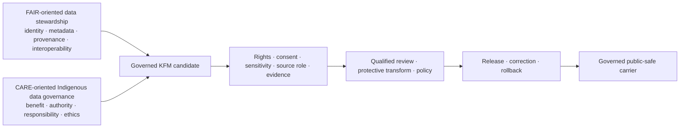
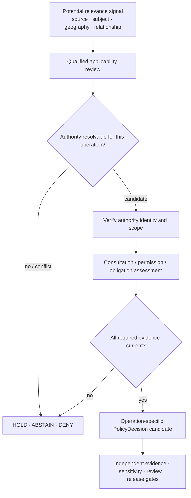

<!-- [KFM_META_BLOCK_V2]
doc_id: kfm://doc/architecture/sovereignty-care
title: Sovereignty & CARE — Current Responsibility and Enforcement Map
type: architecture-reference
version: v2.0-draft
status: draft; repository-grounded; non-authoritative; convergence-hold
owners:
  - "@bartytime4life — CODEOWNERS review route only"
  - "NEEDS VERIFICATION — accountable Indigenous/community data-governance, tribal liaison, rights, consent, sensitivity, policy, review, release, correction, and operations stewardship"
created: 2026-05-25
updated: 2026-08-19
policy_label: public
owning_root: docs/
current_path: docs/architecture/sovereignty-care.md
responsibility: Explain how KFM composes Indigenous data-governance principles, qualified authority, rights, consent, sensitivity, source role, protective transformation, review, release, correction, rollback, and public-surface behavior without becoming doctrine, a CARE standard, semantic contract, machine schema, policy source, registry record, consultation record, release decision, or runtime proof.
truth_posture: CONFIRMED current repository paths and bounded readiness/fixture surfaces at the pinned snapshot / CONFIRMED external CARE and FAIR principle sources / PROPOSED KFM integration target where no accepted contract, schema, policy, authority assignment, or runtime proof exists / CONFLICTED proposal-era CARE metadata, inheritance, tier, geometry, waiver, and catalog claims / HOLD on qualified stewardship, structural split, field vocabulary, authority-resolution protocol, and policy-sensitive graduation
evidence_base: bartytime4life/Kansas-Frontier-Matrix main@45fc45556a007196aa29e725f3a4b9fe9af8294e; prior target blob 5041e65079efd36c53cbfc646725b2001414c7d2; ADR-0029 is the only accepted numbered ADR
related:
  - ./sensitivity.md
  - ./sensitivity-tiers.md
  - ./source-role-anti-collapse.md
  - ./data-classification-framework.md
  - ./document-convergence-plan.md
  - ../doctrine/directory-rules.md
  - ../adr/INDEX.md
  - ../adr/ADR-0010-deny-by-default-for-dna-rare-species-archaeology-infrastructure.md
  - ../adr/ADR-0029-adopt-directory-governance-standard-v2.md
  - ../sources/catalog/CARE-COMPLIANCE.md
  - ../sources/catalog/RIGHTS-AND-SENSITIVITY-MAP.md
  - ../sources/RIGHTS_GUIDANCE.md
  - ../domains/archaeology/CULTURAL_REVIEW.md
  - ../domains/archaeology/SENSITIVITY.md
  - ../../contracts/policy/policy_input_bundle.md
  - ../../contracts/policy/policy_decision.md
  - ../../contracts/policy/sensitivity_label.md
  - ../../contracts/shared/redaction_receipt.md
  - ../../schemas/contracts/v1/policy/policy_input_bundle.schema.json
  - ../../schemas/contracts/v1/policy/policy_decision.schema.json
  - ../../schemas/contracts/v1/receipts/redaction_receipt.schema.json
  - ../../policy/consent/README.md
  - ../../policy/consent/people/README.md
  - ../../policy/sensitivity/README.md
  - ../../policy/sensitivity/archaeology/sovereignty_chip_required.rego
  - ../../data/registry/rights/README.md
  - ../../packages/policy-runtime/README.md
  - ../../apps/governed-api/README.md
  - ../../apps/explorer-web/README.md
  - ../../apps/explorer-web/src/features/domains/archaeology/README.md
  - ../../release/README.md
  - ../../.github/workflows/policy-test.yml
tags:
  - kfm
  - architecture
  - sovereignty
  - care
  - fair
  - indigenous-data-governance
  - qualified-authority
  - consent
  - rights
  - sensitivity
  - cultural-review
  - geoprivacy
  - source-role
  - fail-closed
  - correction
  - rollback
notes:
  - "Same-path architecture modernization only. No doctrine, ADR, contract, schema, policy, registry, fixture, validator, workflow, application, source, release, deployment, publication, or repository-setting state changes."
  - "The architecture convergence plan assigns this page SPLIT because it mixes architecture, doctrine, policy, and domain responsibilities. This revision narrows the current page to explanatory composition but does not perform or authorize that split."
  - "The five proposal-era MetaBlock v2 CARE field names remain visible as lineage only. They are not represented as GIDA-defined fields, an accepted KFM semantic contract, a current machine schema, or an active policy input."
  - "No Indigenous knowledge, sacred-place detail, exact protected location, private authority contact, living-person record, genomic material, oral-history substance, or other restricted content is included."
  - "External sources checked 2026-08-19: Global Indigenous Data Alliance CARE Principles; the peer-reviewed CARE practice paper; the FAIR Guiding Principles paper; U.S. Census AIANNH geography service; U.S. Indian Affairs Tribal Leaders Directory and disclaimer."
[/KFM_META_BLOCK_V2] -->

<a id="top"></a>

# Sovereignty & CARE — Current Responsibility and Enforcement Map

> **Purpose.** Explain how KFM should recognize Indigenous data sovereignty and CARE-aligned obligations without converting geographic overlays, metadata tags, technical openness, signatures, generalized geometry, or repository prose into community authority, consent, policy approval, or release authority.

| Field | Current bounded result |
|---|---|
| **Document role** | Human-readable cross-root architecture under `docs/architecture/`; not doctrine, a CARE standard, semantic contract, machine schema, policy source, registry record, consultation record, evidence, review, release, or runtime authority. |
| **Evidence snapshot** | `main@45fc45556a007196aa29e725f3a4b9fe9af8294e`. |
| **Placement authority** | Accepted [`ADR-0029`](../adr/ADR-0029-adopt-directory-governance-standard-v2.md) adopts the exact Directory Rules v2 bytes at [`docs/doctrine/directory-rules.md`](../doctrine/directory-rules.md). |
| **Numbered ADR posture** | [`ADR-0029`](../adr/ADR-0029-adopt-directory-governance-standard-v2.md) is the only accepted numbered ADR. CARE-adjacent [`ADR-0010`](../adr/ADR-0010-deny-by-default-for-dna-rare-species-archaeology-infrastructure.md) remains proposed. |
| **External principle basis** | CARE means Collective Benefit, Authority to Control, Responsibility, and Ethics in the Indigenous data-governance framework published by the Global Indigenous Data Alliance and its peer-reviewed practice paper. FAIR remains a separate data-management framework. |
| **CARE-specific KFM contract/schema/policy** | No repository path was found for the proposal-era `contracts/care/`, `schemas/contracts/v1/catalog/metablock-v2.json`, or `policy/care/` homes cited by the prior page. Their absence does not authorize replacement paths through this document. |
| **Generic policy objects** | Draft [`PolicyInputBundle`](../../contracts/policy/policy_input_bundle.md) and [`PolicyDecision`](../../contracts/policy/policy_decision.md) contracts and paired proposed schemas exist. The input schema is a permissive placeholder; the decision schema has finite outcomes but does not establish a CARE evaluator. |
| **Rights registry** | [`data/registry/rights/`](../../data/registry/rights/README.md) has a parent README and a Flora child README. Canonical record shape, concrete records, resolver, validators, runtime consumers, and release integration remain unproved. |
| **Consent and sensitivity source** | [`policy/consent/`](../../policy/consent/README.md) and [`policy/sensitivity/`](../../policy/sensitivity/README.md) exist in mixed draft/scaffold maturity. Repository presence does not establish accepted rules, authenticated authority, or production enforcement. |
| **Archaeology sovereignty scaffold** | [`sovereignty_chip_required.rego`](../../policy/sensitivity/archaeology/sovereignty_chip_required.rego) is a three-line proposed scaffold with `default allow := false`; it contains no operative authority-resolution, consent, review, or release rule. |
| **Policy runtime** | [`packages/policy-runtime/`](../../packages/policy-runtime/README.md) remains a `0.0.0` greenfield placeholder with no accepted evaluator, active bundle selector, public API, verified consumers, deployment, or health evidence. |
| **Policy workflow** | [`policy-test.yml`](../../.github/workflows/policy-test.yml) is a read-only readiness/drift guard. It explicitly does not provide repository-wide policy evaluation or emit `PolicyDecision`. |
| **Public UI** | Explorer Web contains documentation for a future archaeology feature boundary, not verified CARE chips, authority notices, consent enforcement, or route/runtime behavior. |
| **Convergence disposition** | The repository-grounded convergence plan assigns this page `SPLIT` into architecture plus doctrine/policy/domain ownership, with qualified stewardship review required. That structural change remains on `HOLD`. |
| **Mutation effect** | Same-path documentation update only. No trust-bearing authority or lifecycle state changes. |
| **Publication effect** | None. A document, commit, workflow, or pull request is not consultation, consent, policy approval, release, deployment, or KFM publication. |

> [!IMPORTANT]
> **KFM cannot infer community authority.** A map intersection, place name, administrative geography, source organization, cultural keyword, badge, or model classification may identify a need for review. None of those establishes who has authority to decide, what scope that authority covers, whether consultation occurred, or whether an operation is permitted.

> [!CAUTION]
> **CARE is not a metadata shortcut.** The CARE Principles are people- and purpose-oriented Indigenous data-governance principles. Reducing them to five fields, a single `authority_to_control` trigger, one OPA rule, or a UI chip would erase the substantive authority, relationships, benefits, responsibilities, and ethics the principles require.

> [!NOTE]
> **Generalization is not clearance.** A generalized map, delayed record, redacted field, aggregate statistic, or public-safe identifier can remain restricted because sovereignty, consent, rights, purpose, benefit, or future-use obligations are unresolved.

**Quick navigation:** [Purpose](#1-purpose--scope) · [FAIR + CARE](#2-the-pairing-fair--care) · [Principles](#3-the-four-care-principles) · [Metadata](#4-metablock-v2-care-fields) · [Fail-safe posture](#5-the-default-deny-rule-c15-03) · [Geography and authority](#6-tribal-sovereignty-label-inheritance) · [Cultural review](#7-cultural-archaeological-sacred-site-review) · [Geometry](#8-generalization-rules-for-sensitive-cultural-geometry) · [Catalogs](#9-the-kfmcare-dcat--stac-namespace-extension) · [Remediation](#10-care-remediation-playbook) · [Applicability](#11-curatorial-decisions-when-does-care-apply) · [UI](#12-ui-requirements) · [Composition](#13-composition-with-sister-sub-architectures) · [Domains](#14-per-domain-care-applicability) · [Anti-patterns](#15-anti-patterns) · [Placement](#16-where-this-lives-in-the-repository) · [Verification](#17-verification-backlog) · [Related](#18-related-docs) · [Questionnaire](#appendix-a--care-applicability-questionnaire)

---

## 1. Purpose & scope

This page owns one responsibility: the human-readable architecture map for sovereignty and CARE concerns that cross KFM responsibility roots and domain lanes.

It explains:

- what the CARE Principles can support as external governance guidance;
- why FAIR, CARE, rights, consent, sensitivity, source role, review, and release remain separate concerns;
- how potential sovereignty relevance should trigger qualified review rather than automatic authority assignment;
- how protective transforms preserve—not extinguish—authority and obligations;
- which current repository surfaces exist and what their bounded evidence proves;
- what public API, map, export, story, search, graph, and AI consumers must not infer; and
- what evidence is required before CARE-sensitive work can graduate from planning to governed operation.

It does **not**:

- decide whether any specific asset, person, place, collection, source, record, or knowledge system is Indigenous data or CARE-applicable;
- identify a Tribe, Nation, community, cultural authority, rightsholder, representative, or reviewer for a particular matter;
- reproduce or interpret Indigenous knowledge, oral-history substance, sacred-place meaning, community categories, or restricted cultural information;
- define an accepted KFM CARE contract, schema, namespace, policy bundle, authority registry, consent token, waiver, review record, reason-code registry, or public UI component;
- accept proposal-era `MetaBlock v2` fields, T0–T4 tiers, fixed H3 resolutions, fixed distance thresholds, DSSE waivers, status-list designs, or automatic geography-based inheritance;
- execute policy, authenticate consent, prove consultation, approve a protective transform, authorize release, or publish an artifact; or
- perform the broader structural `SPLIT` proposed by the convergence plan.

### Responsibility split

| Responsibility | Owning authority or lane | This page's role |
|---|---|---|
| CARE principle meaning | Global Indigenous Data Alliance and cited CARE publication; qualified Indigenous authorities for local practice | Link and summarize at a high level; do not redefine. |
| KFM architecture composition | `docs/architecture/` | Explain boundaries and dependency direction. |
| Normative KFM doctrine | `docs/doctrine/` plus accepted ADRs | Reference only; this page cannot create doctrine. |
| Object semantics | `contracts/` | CARE-specific object meanings remain unaccepted/unimplemented. |
| Machine shape | `schemas/` | No CARE or MetaBlock v2 machine profile is accepted by this page. |
| Allow/deny/abstain rules | `policy/` plus accepted bundle/evaluator bindings | Describe required fail-safe behavior; do not author policy. |
| Authority, rights, source, and dataset control state | Governed registry lanes under `data/registry/` | Explain pointers and non-effects; do not create registry records. |
| Domain-specific review | Qualified domain and cultural/Indigenous stewardship processes | Preserve local authority and scope; do not centralize cultural meaning. |
| Review and consultation records | Separately governed review object family | Require auditable evidence; do not claim review occurred. |
| Release, correction, withdrawal, rollback | `release/` and governed lifecycle artifacts | Preserve separate final authority. |
| Public behavior | Governed API and released public-safe carriers | State consumer obligations and negative states; do not claim implementation. |

The current path is appropriate for this explanatory cross-root map. A future split must retain this architecture anchor or provide a verified replacement and compatibility plan; it must not move normative rules into `docs/architecture/` or use restructuring to weaken restrictions.

[Back to top](#top)

---

## 2. The pairing: FAIR + CARE

The project has used the shorthand **“FAIR by design, CARE in practice.”** It is useful only when read as a reminder that technical data quality and legitimate governance are both necessary. It is not an accepted policy rule and must not imply that FAIR is merely technical while CARE can be reduced to a post-processing gate.

### External source ledger

| Source | Current check | What it supports | What it does not prove for KFM |
|---|---|---|---|
| [Global Indigenous Data Alliance — CARE Principles](https://www.gida-global.org/careprinciples) | Official GIDA page checked 2026-08-19 | CARE is Collective Benefit, Authority to Control, Responsibility, and Ethics; the framework is people- and purpose-oriented and complements FAIR. | KFM fields, policy, review authority, implementation, or applicability to a particular asset. |
| [The CARE Principles for Indigenous Data Governance](https://doi.org/10.5334/dsj-2020-043) | Peer-reviewed practice paper checked 2026-08-19 | CARE's Indigenous data-governance rationale, lifecycle orientation, relationship to FAIR, and need for Indigenous participation and determination of governance protocols. | A universal software schema, one global consent mechanism, or a substitute for local community standards. |
| [The FAIR Guiding Principles](https://doi.org/10.1038/sdata.2016.18) | Formal FAIR publication checked 2026-08-19 | Findable, Accessible, Interoperable, and Reusable characteristics; FAIR principles precede implementation choices and are not themselves a technology specification. | Permission to expose, reuse, or publish sensitive or community-governed data. |
| [U.S. Census TIGERweb AIANNH service](https://tigerweb.geo.census.gov/tigerwebmain/TIGERweb_restmapservice.html) | Official geography service checked 2026-08-19 | A source of American Indian, Alaska Native, and Native Hawaiian legal/statistical geography layers. | The complete identity of a contemporary authority, consent, jurisdiction for a KFM operation, or cultural meaning. |
| [U.S. Indian Affairs Tribal Leaders Directory](https://www.bia.gov/service/tribal-leaders-directory) | Official directory checked 2026-08-19 | A current contact/discovery aid for federally recognized Tribal governments and Indian Affairs offices. | A legal-purpose map, guaranteed real-time contact accuracy, an official recognition list by itself, or authority over every relevant data matter. |

### Architectural pairing


```mermaid
flowchart LR
  A["FAIR-oriented data stewardship\nidentity · metadata · provenance · interoperability"] --> C["Governed KFM candidate"]
  B["CARE-oriented Indigenous data governance\nbenefit · authority · responsibility · ethics"] --> C
  C --> D["Rights · consent · sensitivity · source role · evidence"]
  D --> E["Qualified review · protective transform · policy"]
  E --> F["Release · correction · rollback"]
  F --> G["Governed public-safe carrier"]
```

The diagram is explanatory target architecture. Current repository evidence does not establish the complete flow.

### Non-collapse rules

- FAIRness never creates permission, consent, authority, or public-release status.
- CARE alignment never excuses weak identity, provenance, citation, integrity, correction, or interoperability.
- Technical machine actionability must not automate a decision that belongs to an Indigenous authority or qualified human review.
- The absence of public data or formal metadata does not imply the absence of rights, authority, or obligations.
- A local Indigenous or community standard may be more specific or restrictive than a generic CARE mapping; KFM must not use CARE to override it.
- Applying CARE language to non-Indigenous collective contexts requires care not to erase the framework's Indigenous origin or substitute generic institutional preferences for Indigenous data governance.

[Back to top](#top)

---

## 3. The four CARE principles

The table below paraphrases the external framework and maps it to KFM architecture. It is not a KFM policy bundle or a scoring rubric.

| CARE principle | External governance meaning, bounded | KFM architecture obligation | Unsafe reduction |
|---|---|---|---|
| **Collective Benefit** | Indigenous data ecosystems should enable benefits defined for Indigenous Peoples, including governance, participation, and equitable outcomes. | Record the intended purpose, affected collective, benefit commitments or unresolved benefit question, accountable party, evidence of engagement, and review/correction path where applicable. | “The public may find this useful,” a download count, or a generalized social-benefit claim authored by KFM. |
| **Authority to Control** | Indigenous Peoples' rights and interests in Indigenous data must be recognized, and their authority over governance and use empowered. | Identify the qualified authority through an accountable process; bind decisions to operation, purpose, audience, scope, time, and downstream use; preserve withdrawal or change. | A polygon intersection, a `steward_org` string, public availability, an institutional custodian, or a signed technical object. |
| **Responsibility** | Data users and stewards have responsibilities to maintain respectful relationships, support capacity, and explain how data use advances self-determination and benefit. | Make stewardship duties, attribution, capability/benefit commitments, retention, reporting, contact/escalation, and downstream obligations inspectable without exposing protected details. | A one-time compliance checkbox, passive attribution line, or repository owner acting as community representative. |
| **Ethics** | Indigenous Peoples' rights and wellbeing should guide the data lifecycle, including harms, benefits, justice, representation, and future use. | Evaluate present and foreseeable reuse, joins, inference, model training, public precision, export, retention, and correction with qualified participation and conservative defaults. | Generic institutional ethics approval, absence of a known complaint, or a model's harm score. |

### Architectural consequences

1. **Authority precedes field population.** KFM cannot safely fill an authority field until a qualified process has identified the relevant authority and scope.
2. **Benefit is not self-certified.** KFM cannot declare collective benefit merely because a feature is educational, public, or technically useful.
3. **Responsibility survives transformation.** Aggregation, redaction, derived modeling, translation, and catalog projection do not erase obligations.
4. **Ethics includes future use.** Public tiles, exports, embeddings, model context, screenshots, and copied datasets can enable harms not visible in the original request.
5. **No single score represents CARE.** A numeric rank cannot safely collapse four principles, local governance protocols, rights, consent, sensitivity, and release.

[Back to top](#top)

---

## 4. MetaBlock v2 CARE fields

The prior page described five “canonical” MetaBlock v2 fields:

```text
steward_org
authority_to_control
consent
obligations
benefit_commitments
```

Those names are **proposal-era KFM planning vocabulary**. They are not fields defined by GIDA, not an accepted KFM semantic contract, and not a current machine schema at the previously claimed path. Repository search did not find `contracts/care/` or `schemas/contracts/v1/catalog/metablock-v2.json` at the pinned snapshot.

### Current machine/semantic surface

| Surface | Confirmed state | Safe conclusion |
|---|---|---|
| [`PolicyInputBundle`](../../contracts/policy/policy_input_bundle.md) contract | Draft/proposed rich semantic target | It can describe a future explicit-input boundary, but the paired schema currently requires only `id` and permits arbitrary additional properties. |
| [`PolicyDecision`](../../contracts/policy/policy_decision.md) contract/schema | Draft/proposed closed decision shape | It supports `ANSWER`, `ABSTAIN`, `DENY`, `ERROR` and policy families including `consent` and `sensitivity`; it does not prove an evaluator or CARE policy. |
| [`SensitivityLabel`](../../contracts/policy/sensitivity_label.md) family | Draft/proposed context surface | A label is not authority, consent, rights clearance, review, or release approval. |
| [`RedactionReceipt`](../../schemas/contracts/v1/receipts/redaction_receipt.schema.json) profile | `PROPOSED_INACTIVE`, fixture-only | It proves deterministic fixture validation only; all authority-bearing execution/review/release flags are fixed false. |
| [`data/registry/rights/`](../../data/registry/rights/README.md) | README-level registry boundary | It records proposed rights-review posture and pointers; concrete records and runtime resolution are unproved. |
| CARE-specific semantic contract | Not found at cited proposal path | Remains a governance and design gap. |
| CARE-specific machine schema | Not found at cited proposal path | Remains a governance and design gap. |
| Accepted authority/consultation record | Not established | Do not infer or fabricate one. |

### Field-family target, not schema

A future governed design will likely need information in the following **families**. This table deliberately avoids fixing JSON property names or cardinality.

| Information family | Why it may be needed | Required boundary |
|---|---|---|
| Applicability assessment | Why Indigenous data-governance review is or is not material to the exact operation. | Qualified, evidenced, versioned, and correctable; not automated solely from content or geography. |
| Authority identification | Who may decide which operation, purpose, audience, fields, precision, retention, and future use. | Authority source and scope must be explicit; no public disclosure of protected contacts. |
| Consultation/review state | Whether contact, consultation, review, disagreement, or deferral occurred. | A state record cannot misrepresent engagement; missing evidence remains unresolved. |
| Consent/permission state | Operation-specific permission, conditions, validity, expiry, suspension, or withdrawal where applicable. | Separate from rights, source custody, sensitivity, and release. |
| Obligations | Attribution, access, retention, benefit, reporting, language, provenance, redistribution, deletion, and future-use duties. | Structured enough for enforcement and human review; safe public summary separated from restricted detail. |
| Collective-benefit account | Intended and observed benefit, commitments, accountable parties, and community-defined measures where appropriate. | Community-defined or reviewed; no KFM self-certification. |
| Ethics/harm assessment | Current and future risks, joins, inference, precision, model use, export, and downstream reuse. | Reviewed per operation and audience; not a universal score. |
| Evidence and provenance | Sources, review records, effective policy/bundle, decision, transform, release, and correction lineage. | References resolve under their own authorities; metadata does not become evidence by repetition. |

### Metadata safety

CARE-related metadata can itself be sensitive. Authority names, contact routes, dispute details, sacred/cultural category names, restriction reasons, community membership, exact places, and consultation notes must not be exposed merely to make a record look complete. Public carriers should receive only the minimum reviewed, released summary needed for trust and correct use.

[Back to top](#top)

---

## 5. The default-deny rule (C15-03)

The prior page described an active rule: a non-empty `authority_to_control` field automatically denied publication until a consent grant was valid and unrevoked. Current repository evidence does **not** support that implementation claim.

### Current bounded evidence

- CARE-adjacent [`ADR-0010`](../adr/ADR-0010-deny-by-default-for-dna-rare-species-archaeology-infrastructure.md) is proposed, not accepted.
- No accepted CARE field contract or schema establishes `authority_to_control` as an input.
- No `policy/care/` bundle exists at the cited proposal path.
- The archaeology sovereignty Rego file is a proposed scaffold with only `default allow := false`.
- The general policy runtime is not functional or bound to an evaluator.
- The broad policy workflow deliberately preserves a repository-wide evaluator/bundle `HOLD`.
- The generic `PolicyDecision` schema provides finite outcomes but does not prove that any CARE rule produces them.

### Durable fail-safe architecture

The absence of an active CARE rule does not justify optimistic exposure. Where authority, rights, consent, purpose, sensitivity, review, release, or harmful precision is material and unresolved, the safe design is to stop or narrow the operation through the owning gate.

| Condition | Candidate finite response | Meaning |
|---|---|---|
| Required authority or consultation evidence is absent or cannot be resolved | `ABSTAIN`, `DENY`, or governance `HOLD` | Do not invent authority or proceed as though non-applicability were proven. |
| Authority explicitly disallows the evaluated operation | `DENY` | Preserve the scope and effective time of the decision; do not search for a less restrictive proxy. |
| Authority permits the exact operation with conditions | Policy candidate may become `ANSWER` only after obligations and all other gates close | Consent/permission is necessary where applicable but never sufficient for release. |
| Evidence conflicts about authority, scope, consent, or status | `ABSTAIN` or `DENY`; route to qualified review | Conflict is visible and cannot be resolved by source prestige or majority vote alone. |
| Policy, resolver, registry, signature, or runtime fails | `ERROR` | Never fall back to allow. |
| Request can be safely narrowed without misrepresenting the source or authority | Narrow and re-evaluate | A narrower purpose, audience, field set, time, or precision is a new operation—not retroactive approval. |

`HOLD` and `QUARANTINE` are governance/lifecycle states, not values in the current `PolicyDecision` outcome enum. Callers must normalize state and decision vocabularies explicitly rather than treating every non-allow condition as the same result.

### No consent-only bypass

Even a valid consent or permission record cannot by itself establish:

- source identity or source role;
- rights or license closure;
- evidence sufficiency;
- cultural interpretation authority outside the recorded scope;
- safe geometry, joins, or future reuse;
- authenticated human review;
- release authorization;
- correction propagation; or
- rollback readiness.

[Back to top](#top)

---

## 6. Tribal sovereignty label inheritance

The prior architecture proposed automatic “inheritance” of sovereignty labels from AIANNH/BIA spatial overlays. That pattern is unsafe as an authority decision and is not established by current implementation evidence.

### Geography is a review signal, not authority

U.S. Census AIANNH data combine several legal and statistical geography types. They can help identify possible relevance, but a spatial intersection does not answer:

- which Indigenous Nation, Tribe, community, or other authority is relevant to the exact data and operation;
- whether the geometry represents jurisdiction, residence, cultural connection, historic relation, service area, statistical approximation, or another role;
- whether multiple authorities or rightsholders are involved;
- whether authority extends to a source, object, knowledge category, use, audience, or time period;
- whether consultation, permission, or consent occurred; or
- whether a non-intersection clears CARE or sovereignty obligations.

The U.S. Indian Affairs Tribal Leaders Directory can support contact discovery for federally recognized Tribal governments. Its own disclaimer separates the directory from the official recognition list, warns that leadership/contact data may change, and says map locations are not for legal purposes. It cannot be used as an automated authority resolver.

### Target resolution sequence


```mermaid
flowchart TD
  A["Potential relevance signal\nsource · subject · geography · relationship"] --> B["Qualified applicability review"]
  B --> C{"Authority resolvable for this operation?"}
  C -- "no / conflict" --> D["HOLD · ABSTAIN · DENY"]
  C -- "candidate" --> E["Verify authority identity and scope"]
  E --> F["Consultation / permission / obligation assessment"]
  F --> G{"All required evidence current?"}
  G -- "no" --> D
  G -- "yes" --> H["Operation-specific PolicyDecision candidate"]
  H --> I["Independent evidence · sensitivity · review · release gates"]
```

This is proposed target behavior, not a claim of implemented resolution.

### Separate state that must not be collapsed

| State | Question |
|---|---|
| Geographic relevance | Does a governed source or reviewed relation suggest the matter may intersect an Indigenous place, people, territory, record, or knowledge system? |
| Authority candidate | Which authority may be relevant, and from what source was that possibility derived? |
| Verified authority assignment | Who is qualified to decide the exact operation and scope, and what evidence supports that assignment? |
| Consultation state | Has meaningful contact or consultation occurred, with whom, for what purpose, and with what limitations? |
| Permission/consent state | Is the operation allowed, conditioned, suspended, withdrawn, disputed, or unresolved? |
| Obligations | What duties survive through processing, cataloging, delivery, reuse, correction, or deletion? |
| Public disclosure state | Which parts of the authority and review record may be exposed without creating harm or misrepresentation? |

### Negative rules

- Do not assign authority from nearest polygon, majority overlap, county, watershed, historic map, or model prediction.
- Do not assume a government agency, museum, university, archive, vendor, or data custodian is the Indigenous authority to control.
- Do not interpret lack of an AIANNH intersection as permission.
- Do not treat a current federal-recognition directory as a complete map of all cultural, traditional, historic, local, or data-governance authority relevant to a matter.
- Do not publish private contact information, disagreement detail, or consultation notes as proof of transparency.
- Do not allow AI to choose the authority or summarize contested cultural meaning into a canonical label.

[Back to top](#top)

---

## 7. Cultural, archaeological, sacred-site review

Cultural review is a qualified human and community-governance process. It is not a label-generation feature, an automated content classifier, a substitute for consultation, or a standing approval for all archaeology or cultural-heritage material.

### Current repository boundary

[`docs/domains/archaeology/CULTURAL_REVIEW.md`](../domains/archaeology/CULTURAL_REVIEW.md) is a large draft protocol carrying proposal-era fields, reviewer roles, tier transitions, geometry rules, and automatic inheritance claims. Its repository presence proves documentation only. Current evidence does not establish:

- verified stewardship identities or a standing reviewer roster;
- authenticated authority or rightsholder assignments;
- accepted cultural-review, consent, revocation, or waiver contracts/schemas;
- real review records;
- an active policy bundle or evaluator;
- a release gate consuming those records; or
- a public archaeology carrier approved under that process.

### Required architecture properties

| Property | Requirement |
|---|---|
| Qualified participation | The relevant Indigenous or cultural authority must be able to shape the decision; KFM maintainers cannot appoint themselves as substantive cultural authorities. |
| Operation-specific scope | Review binds purpose, audience, fields, precision, time, derivative, export, model/AI use, retention, and future reuse. |
| No cultural-content appropriation | KFM records decision state and obligations at the minimum safe level; it does not translate sacred or community-controlled meaning into a universal ontology. |
| Multi-authority handling | Conflicting, overlapping, or multiple authorities remain visible and unresolved until an accountable process closes them. |
| Review evidence | A reviewed record should identify who/what role acted, authority basis, scope, outcome, conditions, effective time, and correction/withdrawal path without exposing protected details. |
| Separation of duties | The data producer, technical transformer, reviewer, policy evaluator, and release authority should not be silently collapsed where consequence warrants independent review. |
| No waiver-by-document | An architecture page, staff note, signed blob, “emergency” label, or deadline cannot waive sovereignty, rights, consent, or cultural review. |
| Continuing authority | Permission may be time-bound, conditional, withdrawn, or superseded; KFM must re-evaluate dependent outputs. |

### Review work states

A future review object may need states such as unassessed, awaiting authority resolution, in consultation, conditions proposed, approved for a bounded operation, denied, disputed, suspended, withdrawn, or superseded. This page does not adopt those names or a transition graph. It requires that any accepted vocabulary preserve uncertainty and withdrawal rather than compressing everything into a Boolean `approved` field.

### Oral histories and community knowledge

Oral-history, language, traditional knowledge, sacred knowledge, and community narratives require source- and community-specific governance. Public availability of a transcript, recording, catalog card, old publication, or archival finding aid does not prove KFM may ingest, model, join, summarize, translate, train on, map, or republish its contents.

[Back to top](#top)

---

## 8. Generalization rules for sensitive cultural geometry

Protective transformation is one part of the trust chain. It does not resolve sovereignty, rights, consent, cultural authority, source role, or purpose by itself.

### Proposal-era thresholds are not accepted rules

The prior page and related planning corpus named H3 resolutions, county/region floors, and fixed-distance buffers such as five kilometers. No accepted KFM policy profile, qualified review, contract/schema, active evaluator, or operational validation establishes those as universal thresholds. This revision removes them as current architecture facts.

### Required transform properties

| Property | Required posture |
|---|---|
| Minimize before processing | Do not acquire or retain exact geometry merely because a later transform is planned. Use the least detail needed for the governed purpose. |
| Profiled operation | Transform type and precision are selected for the domain, source, threat, audience, time, downstream use, and authority—not from a universal constant. |
| Distinct identities | Restricted input and public-safe candidate have separate stable identities/digests and explicit lineage. |
| Reproducibility without disclosure | Record transform class/profile/version and verifier-safe evidence while withholding reversal material and exact protected values. |
| Composition testing | Reassess joins, labels, time series, neighboring features, source URLs, metadata, search, graph, exports, screenshots, and AI text. |
| Multi-release inference | Test whether repeated releases, different zooms, or correction history reconstruct protected detail. |
| Review and policy | Qualified review and policy decide whether the candidate is adequate; a transform receipt records process only. |
| Release and correction | Bind the approved derivative to release, invalidate it on withdrawal/correction, and verify cache/index/map/AI propagation. |

### Current bounded fixture surface

The proposed-inactive [`RedactionReceipt`](../../schemas/contracts/v1/receipts/redaction_receipt.schema.json) fixture profile enumerates transform classes and requires deterministic identifiers and references for certain public-candidate fixtures. Its governance block fixes `policy_executed`, `human_review_authenticated`, `restricted_input_opened`, `release_authorized`, and `publication_authorized` to `false`.

That is useful no-network validation evidence. It is not proof that KFM has transformed real restricted cultural data, selected an adequate profile, authenticated review, or produced a safe public carrier.

> [!CAUTION]
> **Client-side hiding is not protection.** Opacity, zoom limits, missing popup fields, style filters, feature-state, disabled buttons, or a CARE badge do not remove coordinates or attributes already delivered to a browser.

[Back to top](#top)

---

## 9. The `kfm:care` DCAT / STAC namespace extension

The prior page presented `kfm:care` as a current DCAT/STAC extension. At the pinned snapshot, that claim is supported only by proposal-era documentation such as [`docs/sources/catalog/CARE-COMPLIANCE.md`](../sources/catalog/CARE-COMPLIANCE.md). No accepted KFM semantic contract, JSON-LD context, STAC extension schema, DCAT profile, validator, fixture family, namespace governance record, or released catalog instance was verified.

### Safe current conclusion

- `kfm:care` is **PROPOSED vocabulary**, not a current interoperability guarantee.
- The five MetaBlock field names are **PROPOSED lineage**, not canonical machine fields.
- A catalog record is a projection and discovery surface, not authority, consent, policy, review, or release.
- A consumer that ignores an extension must not thereby receive a less restricted asset.
- A public catalog must not disclose the protected reason, authority contact, sacred category, precise place, or consultation detail merely to explain that access is constrained.

### Graduation requirements for a future profile

| Requirement | Acceptance evidence |
|---|---|
| Namespace governance | Accepted owner, stable URI, versioning and deprecation rules, source attribution, and conflict policy. |
| Semantic contract | Field/object meaning, scope, optionality, cardinality, authority, public/restricted projections, and non-effects. |
| Machine schemas | Closed or deliberately extensible shapes for STAC/DCAT/JSON-LD carriers with negative fixtures. |
| Obligation propagation | Proof that conditions survive from source/authority records through derivative, catalog, API, export, map, story, and AI surfaces. |
| Consumer behavior | Tests for extension-aware and extension-unaware consumers; unrecognized governance metadata cannot produce unsafe allow. |
| Identity and integrity | Deterministic profile/version binding and catalog-to-release/carrier digest closure. |
| Correction | Withdrawal, supersession, and correction propagation across catalogs, caches, indexes, and copies. |
| Interoperability | Cross-profile tests that preserve source role, rights, authority, release, and correction semantics rather than only JSON validity. |

No catalog extension should be activated before the underlying authority, rights, consent, policy, review, and release object families are settled. Publishing metadata first would create a polished projection over unresolved governance.

[Back to top](#top)

---

## 10. CARE remediation playbook

A denial, abstention, or hold is not a defect to route around. It is an explicit state showing that required authority or evidence is incomplete, conflicting, expired, withdrawn, or disallowed.

### Remediation sequence

1. **Preserve the original outcome.** Do not rewrite or delete a denial to make a later attempt appear continuously allowed.
2. **Expose a safe reason.** Give public callers only a bounded explanation; keep protected authority, contact, location, dispute, and policy detail out of public reasons and logs.
3. **Identify the missing authority-owned evidence.** Separate missing source identity, authority assignment, consultation, consent, rights, sensitivity, review, transform, release, correction, or runtime evidence.
4. **Contact through an approved process.** Do not scrape contact data, infer representation, or use a repository placeholder as the reviewer.
5. **Narrow the operation when legitimate.** Reduce purpose, audience, fields, precision, retention, export, model use, or future reuse only if the resulting operation is independently assessed.
6. **Create a new decision event.** A new input bundle, review, policy decision, transform, and release candidate supersede rather than mutate prior evidence.
7. **Propagate obligations.** Carry attribution, access, benefit, retention, reporting, language, deletion, and future-use requirements through every dependent surface.
8. **Verify correction and rollback.** Invalidate stale tiles, APIs, catalogs, search, graph, exports, stories, screenshots where controlled, and AI retrieval context.

### No emergency waiver is established

The prior page proposed time-boxed, DSSE-signed waivers. Current repository evidence does not establish a CARE waiver contract, qualified issuer, allowed emergency classes, policy rule, signer trust root, audit path, revocation, or release integration. A signature proves control of a key under a verified trust model; it does not prove community authority or ethical legitimacy.

Any exceptional restricted-access process would require a separately accepted policy and operational design with least privilege, purpose limitation, named authority, time bounds, full audit, no public fallback, incident handling, and rollback. This architecture page cannot create it.

### Correction is more than access removal

A complete correction must consider:

- source and rights registries;
- derived data and public carriers;
- catalog and graph projections;
- aliases and “current” pointers;
- CDN/browser/server caches;
- search and vector indexes;
- exports and story packages;
- Evidence Drawer and Focus Mode context;
- model prompts, retrieval corpora, and generated summaries;
- citations and public correction notices; and
- receipts proving propagation at the scope KFM controls.

[Back to top](#top)

---

## 11. Curatorial decisions: when does CARE apply?

Applicability is a governance decision supported by evidence, not a content-classification shortcut.

### Screening signals

The following may justify a **review trigger**, but none independently decides applicability or authority:

- data about Indigenous Peoples, Nations, communities, families, individuals, territories, environments, resources, governance, languages, cultures, heritage, specimens, or knowledge;
- a source, custodian, or collection describing Indigenous provenance or restrictions;
- an Indigenous Nation, Tribal government, community, or rightsholder asserting an interest;
- an operation involving mapping, linking, inference, commercialization, AI/model training, export, public storytelling, repatriation, retention, or future reuse;
- a geography or relation suggesting possible relevance;
- cultural or archaeological material with uncertain provenance, authority, or consultation history;
- downstream use that could affect collective benefit, self-determination, representation, wellbeing, or harm.

### What does not prove non-applicability

- no AIANNH polygon intersection;
- no `authority_to_control` field;
- no current restriction in source metadata;
- an open license or public website;
- old publication or prior institutional use;
- a generalized or aggregate output;
- absence of a known living person;
- inability to find a contact quickly;
- an AI classifier returning “not sensitive”; or
- a deadline, grant requirement, public-interest claim, or technical cost.

### Decision record burden

A mature applicability decision should be able to answer, at the minimum safe level:

- what exact operation was assessed;
- which data, source roles, places, relationships, and time were in scope;
- who was qualified to assess applicability and why;
- which evidence and local/community standards were considered;
- whether authority was resolved, conflicted, or unknown;
- what obligations or prohibitions apply;
- when the decision expires or must be rechecked;
- which downstream artifacts depend on it; and
- how correction, withdrawal, or dispute changes the result.

The current repository has no accepted general applicability contract, schema, policy, fixture family, evaluator, or authenticated record set. Until those exist, consequential CARE-sensitive candidates remain in a restricted review or hold posture rather than receiving an automatically generated public label.

[Back to top](#top)

---

## 12. UI requirements

Public and reviewer interfaces are consumers of governed decisions. They do not identify authority, decide CARE applicability, authenticate consent, or authorize release.

### Public surface requirements

| Requirement | Safe behavior |
|---|---|
| No restricted bytes | Public clients receive only released public-safe derivatives through governed interfaces; they never receive exact protected values and then hide them. |
| Finite state | Show answer, abstention, denial, error, stale, withdrawn, corrected, or restricted state without implying the UI made the decision. |
| Bounded explanation | Explain that governance or permission is unresolved/limited without revealing protected reasons, contacts, locations, or cultural categories. |
| Authority attribution | Display an authority name or statement only when verified, approved for public disclosure, current, and correctly scoped. |
| No badge-as-proof | A CARE or sovereignty chip is a navigation/trust cue only; it is never proof of compliance, consultation, consent, or authority. |
| Obligation visibility | Surface public obligations such as attribution, use limits, no-export, or citation only when supported by the released decision and safe to disclose. |
| Correction visibility | Show current correction, withdrawal, supersession, or stale status and prevent access to invalidated carriers. |
| Accessibility | Do not encode restrictions only in color or map symbology; use text, status semantics, keyboard access, and assistive-technology-compatible controls. |
| No misleading absence | Omitted detail must not be presented as “none exists,” and missing features must not be interpreted as clearance or non-applicability. |

### Reviewer/admin surface requirements

- least privilege and purpose-bound access;
- authenticated identity and role verification;
- separation from the normal public path;
- audit-safe actions and reason codes;
- no sensitive values in URLs, analytics, client logs, crash reports, or screenshots;
- explicit session, export, retention, and revocation controls;
- no model-generated recommendation as final authority; and
- immediate restriction when authority, consent, rights, or review state changes.

### Current proof limit

[`apps/explorer-web/src/features/domains/archaeology/README.md`](../../apps/explorer-web/src/features/domains/archaeology/README.md) documents a proposed archaeology feature boundary and mentions future CARE/sovereignty notices. It explicitly says implementation files, routes, tests, governed envelopes, receipts, review records, release manifests, and runtime behavior remain unverified. Repository search did not surface a `kfm:care` implementation under Explorer Web.

MapLibre is a renderer. A style, source, layer filter, popup, camera, feature-state flag, or plugin cannot evaluate CARE, consent, sovereignty, or release.

[Back to top](#top)

---

## 13. Composition with sister sub-architectures

CARE-sensitive decisions compose with other KFM concerns. None is a substitute for the others.

| Concern | Question | Relationship to sovereignty/CARE |
|---|---|---|
| Sensitivity | Could the requested content or precision enable harm? | CARE may strengthen restrictions, but a low sensitivity label cannot clear authority or consent. |
| Rights and source terms | May KFM acquire, retain, transform, redistribute, or export under source/legal terms? | Passing source rights does not establish Indigenous authority; failing rights can independently block use. |
| Consent/permission | Is the exact operation permitted by the relevant subject, authority, agreement, or policy? | Consent is operation-specific and can be withdrawn; it does not prove collective benefit or ethics. |
| Source role | What may the source actually support? | Cultural authority and source authority are different; a custodian or secondary source cannot be promoted by paraphrase. |
| Evidence | Does the consequential claim resolve to admissible support for the requested scope? | CARE metadata does not become evidence for the underlying domain claim. |
| Geoprivacy/protective transform | What detail must be removed, generalized, delayed, aggregated, or withheld? | Transform reduces exposure but does not extinguish sovereignty or obligations. |
| Review | Who assessed the operation, under what authority, with what independence and limits? | A review record must not impersonate consultation or substantive cultural authority. |
| Release | Is there a current governed decision binding the exact public-safe carrier? | CARE/consent/policy results are inputs, not release authority. |
| Correction/rollback | What happens when authority, consent, evidence, or release changes? | Restrictions must propagate to every dependent derivative and public surface. |

### Composite safe rule

A public operation may proceed only when every material concern is either closed by its owning authority or explicitly represented in a finite safe outcome. The result is not “the least restrictive label wins.” An unresolved authority, right, consent, sensitivity, evidence, review, or release requirement blocks or narrows the operation.

### Source-role preservation

- Indigenous authority over governance does not turn a modeled environmental estimate into an observation.
- An authoritative scientific source does not override Indigenous authority, consent, or purpose restrictions.
- A museum or agency custodian does not automatically hold authority to control Indigenous data.
- A public-safe derivative does not replace the restricted canonical object.
- A CARE-aligned statement does not prove a domain claim unless its EvidenceRef resolves to admissible EvidenceBundle support.

[Back to top](#top)

---

## 14. Per-domain CARE applicability

This table is a **screening and review map**, not a domain-default classifier. Applicability remains object-, source-, relationship-, purpose-, audience-, time-, and authority-specific.

| Domain/context | Why review may be material | Safe architecture posture |
|---|---|---|
| Archaeology and cultural heritage | Sites, collections, burials, sacred places, provenance, oral histories, cultural affiliation, repatriation, and looting risk may involve Indigenous authority and restricted knowledge. | Hold exact or interpretive exposure until qualified authority, rights, sensitivity, review, transform, and release are resolved. |
| People, genealogy, DNA, and land | Collective identity, kinship, genomic data, ancestors, residence, land relationships, and living-person information can implicate both individual and collective rights. | Do not infer group membership, authority, consent, or lineage; apply the strictest relevant people/genomic/land and collective governance controls. |
| Flora, fauna, habitat, ecology | Specimens, species knowledge, stewardship practices, traditional ecological knowledge, biocultural data, and locations may be community-governed even when the base observation is public. | Separate scientific observation from Indigenous knowledge and stewardship authority; restrict joins and knowledge-bearing attributes. |
| Hydrology, soil, geology, atmosphere, hazards | Environmental measurements and models may concern Indigenous territories, resources, impacts, governance, or knowledge systems. | A public agency source does not settle community authority or impact; evaluate purpose, relation, precision, and downstream decisions. |
| Roads, rail, trade, settlements, infrastructure | Historic routes, place names, removals, cultural landscapes, sacred travel, service/infrastructure effects, and critical assets may require review. | Avoid converting historic or administrative maps into present authority or cultural interpretation; restrict harmful precision. |
| Maps, 3D, remote sensing, and reconstruction | Visualizations can imply observation, ownership, cultural meaning, or unrestricted access; detailed terrain and models can expose protected places. | Preserve reality/source boundaries, authority, transform receipts, public-safe derivatives, and explicit limitations. |
| Archives, libraries, museums, universities, and agencies | Institutional custody may coexist with Indigenous rights and interests in records, specimens, images, recordings, and metadata. | Custody and open access are not sufficient authority; review provenance, agreements, community standards, retention, and reuse. |
| AI, search, graph, embeddings, and analytics | Derived relations, summaries, classification, translation, training, and retrieval can reconstruct or repurpose governed data. | Treat indexes/models as downstream carriers; filter before ingestion, prohibit authority inference, and invalidate dependent context on correction. |
| General public administrative data | Many records may have no CARE relevance, but joins, place relations, names, and downstream use can change that. | Use evidence-based screening and document non-applicability only when sufficiently supported; absence of a trigger field is not proof. |

### No universal domain outcome

A domain cannot be marked permanently CARE-applicable or permanently exempt through this page. A single dataset can contain mixed records, fields, sources, authorities, permissions, and audiences. KFM needs operation-specific decisions and safe defaults, not a broad domain badge.

[Back to top](#top)

---

## 15. Anti-patterns

| Anti-pattern | Why it fails |
|---|---|
| Treating the five proposal-era CARE fields as GIDA's canonical schema | The CARE Principles are governance principles, not those property names; KFM has not accepted the field model. |
| Automatic authority assignment from AIANNH/BIA or another polygon | Geographic relevance is not authority, jurisdiction for the operation, consultation, or consent. |
| Treating no polygon intersection as clearance | Cultural, historic, relational, data, and governance authority need not match one current boundary layer. |
| CARE badge or “sovereignty chip” as compliance proof | UI decoration cannot prove authority, consultation, policy, or release. |
| FAIR/open-license/public-source bypass | Technical openness and source terms do not extinguish Indigenous rights or interests. |
| Institution or data custodian treated as authority to control | Custody, funding, publication, collection, or source prestige does not automatically confer Indigenous authority. |
| Generic “tribal liaison” placeholder treated as review | An unverified role label is not a qualified person, Nation, community, mandate, or consultation record. |
| Signature, DSSE envelope, credential, or status list treated as consent | Cryptographic integrity proves bytes/key relations under a trust model; it does not establish legitimate authority or substantive permission. |
| Fixed H3 resolution or distance as universal protection | Risk depends on place, time, source, relation, harm, audience, and community governance; fixed values can underprotect or misrepresent. |
| Generalized geometry treated as unrestricted | Authority, consent, rights, obligations, or cultural restrictions may remain. |
| Client-side hiding | Protected bytes already reached the client and may be recovered. |
| Sensitive reason strings and logs | The control itself discloses authority, location, disagreement, identity, or restriction rationale. |
| Public contact scraping | Contact discovery is not authority verification and can expose or burden individuals. |
| AI classification of CARE applicability or authority | A model can triage candidates but cannot make the substantive governance decision. |
| One-time approval with no expiry/correction | Authority, contact, consent, purpose, use, and community standards can change. |
| Consent-only release | Independent evidence, rights, sensitivity, review, transform, release, correction, and rollback remain required. |
| Architecture prose treated as policy | This page explains responsibilities; accepted policy and observed runtime behavior carry enforcement proof. |
| Catalog extension before authority closure | Produces polished machine-readable metadata over unresolved governance and may encourage unsafe reuse. |
| “Collective benefit” self-certified by KFM | Benefit must be grounded in affected Indigenous Peoples' priorities and accountable relationships, not a project narrative. |

[Back to top](#top)

---

## 16. Where this lives in the repository

Accepted Directory Rules place each artifact by its one authority responsibility. The sovereignty/CARE concern is intentionally distributed; a future structural split must preserve that separation.

| Responsibility | Current path or surface | Current bounded status |
|---|---|---|
| Cross-root architecture map | `docs/architecture/sovereignty-care.md` | This explanatory page; same-path modernization. |
| Convergence plan | [`docs/architecture/document-convergence-plan.md`](./document-convergence-plan.md) | Assigns this page `SPLIT`; no move or split is authorized here. |
| Sensitivity architecture | [`docs/architecture/sensitivity.md`](./sensitivity.md) | Repository-grounded umbrella map; sovereignty/CARE is one concern, not a universal sensitivity rank. |
| Proposal-era catalog register | [`docs/sources/catalog/CARE-COMPLIANCE.md`](../sources/catalog/CARE-COMPLIANCE.md) | Draft explanatory register with unaccepted MetaBlock, namespace, consent, and gate claims; not policy or machine authority. |
| Domain cultural-review plan | [`docs/domains/archaeology/CULTURAL_REVIEW.md`](../domains/archaeology/CULTURAL_REVIEW.md) | Draft/proposal-heavy domain protocol; reviewer identities, records, policy, and release integration unproved. |
| CARE-specific semantic contract | Prior page cited `contracts/care/` | Path not found at the pinned snapshot; exact home and object family require governance/placement review. |
| CARE/MetaBlock machine schema | Prior page cited `schemas/contracts/v1/catalog/metablock-v2.json` | Path not found at the pinned snapshot; no accepted schema or validator established. |
| CARE policy source | Prior page cited `policy/care/` | Path not found at the pinned snapshot; do not create a parallel policy family without accepted placement and semantics. |
| Generic policy input meaning | [`contracts/policy/policy_input_bundle.md`](../../contracts/policy/policy_input_bundle.md) | Draft semantic target; paired schema remains permissive placeholder. |
| Generic policy decision meaning/shape | [`contracts/policy/policy_decision.md`](../../contracts/policy/policy_decision.md) and [schema](../../schemas/contracts/v1/policy/policy_decision.schema.json) | Draft/proposed closed finite decision shape; no CARE evaluator. |
| Consent rule-source boundary | [`policy/consent/`](../../policy/consent/README.md) | Draft and placement/maturity conflicts remain; people lane is README-only for executable behavior. |
| Sensitivity rule-source boundary | [`policy/sensitivity/`](../../policy/sensitivity/README.md) | Proposed scaffold corpus with mixed defaults; no active repository-wide bundle/evaluator. |
| Archaeology sovereignty rule scaffold | [`policy/sensitivity/archaeology/sovereignty_chip_required.rego`](../../policy/sensitivity/archaeology/sovereignty_chip_required.rego) | Proposed three-line scaffold; no operative rule. |
| Rights registry | [`data/registry/rights/`](../../data/registry/rights/README.md) | Parent README and Flora child README; no accepted record shape, concrete records, resolver, or runtime integration. |
| Protective-transform fixture profile | [`RedactionReceipt`](../../schemas/contracts/v1/receipts/redaction_receipt.schema.json) | Proposed-inactive, fixture-only, no policy/review/release/publication authority. |
| Policy runtime | [`packages/policy-runtime/`](../../packages/policy-runtime/README.md) | `0.0.0` placeholder, unbound evaluator, no verified consumers/deployment. |
| Policy readiness workflow | [`.github/workflows/policy-test.yml`](../../.github/workflows/policy-test.yml) | Drift/readiness guard; broad workflow evaluates no policy and emits no decision. |
| Governed API | [`apps/governed-api/`](../../apps/governed-api/README.md) | Intended trust membrane; CARE/authority route-by-route enforcement and deployment require separate proof. |
| Explorer Web | [`apps/explorer-web/`](../../apps/explorer-web/README.md) | Public/semi-public shell; no verified CARE implementation surfaced. |
| Release/correction/rollback | [`release/`](../../release/README.md) | Separate decision plane; CARE metadata, review, consent, or policy cannot replace it. |
| Document registry | [`control_plane/document_registry.yaml`](../../control_plane/document_registry.yaml) | Current file contains only its required-artifact-index entry; this architecture page is not registered there at the pinned snapshot. |

### Directory Rules basis

- `docs/architecture/` owns human-readable cross-root architecture explanation.
- `contracts/` owns semantic meaning.
- `schemas/` owns machine shape.
- `policy/` owns rule source.
- `data/registry/` owns governed control records, not policy or release.
- `packages/` and `apps/` own implementation/runtime surfaces.
- `release/` owns append-only release, correction, withdrawal, and rollback decisions.

The owning-root analysis supports editing this tracked architecture page in place. It does **not** support creating any missing CARE path in this documentation-only slice.

### Structural convergence boundary

Before implementing the provisional `SPLIT`, maintainers must:

1. compare complete unique content across this page, sensitivity architecture, catalog CARE register, cultural-review docs, source/right docs, policy READMEs, and domain pages;
2. obtain qualified Indigenous/community data-governance and affected-domain review;
3. identify the accepted authority owner for principle guidance, KFM semantics, schema, policy, registry, domain protocols, and public behavior;
4. preserve document identity, inbound links, anchors, and useful historical lineage;
5. avoid accepting field names, tiers, thresholds, authority inheritance, or waiver mechanisms through file movement;
6. update every affected reference in one dependency-closed change; and
7. prove rollback and no-loss treatment.

Until then, the page remains at its current path and the split stays on `HOLD`.

[Back to top](#top)

---

## 17. Verification backlog

### P0 — authority and safe-handling prerequisites

| ID | Open verification | Evidence required to close |
|---|---|---|
| **VB-CARE-01** | Who is accountable for Indigenous/community data governance, Tribal/community liaison, rights, consent, sensitivity, policy, review, release, correction, and incident response? | Verified people/teams, mandates, separation of duties, escalation, recusal, and succession records. |
| **VB-CARE-02** | What process identifies the qualified authority for a particular KFM operation? | Reviewed protocol co-developed or accepted with relevant authorities; source hierarchy; conflict/multi-authority handling; synthetic negative tests. |
| **VB-CARE-03** | What KFM object families are actually needed for applicability, authority, consultation, consent/permission, obligations, benefit, ethics, review, dispute, and withdrawal? | Accepted ADR/decision, semantic contracts, non-collapse map, identity/versioning rules, public/restricted projections, migration plan. |
| **VB-CARE-04** | What machine schemas and validators enforce those accepted objects? | Closed or intentionally extensible schemas, valid/invalid no-network fixtures, deterministic validators, focused tests, compatibility/versioning plan. |
| **VB-CARE-05** | Which policy family owns CARE-sensitive gates, and how does it compose with rights, consent, sensitivity, access, render, and release? | Accepted policy ownership/entrypoints, reason/obligation vocabularies, bundle manifest, selector, evaluator binding, normalization, fail-safe tests. |
| **VB-CARE-06** | Which Indigenous/community standards, agreements, research codes, or local protocols govern the first intended source/operation? | Qualified authority review and citable, permissioned evidence; no generic CARE substitution. |
| **VB-CARE-07** | Which real source, rights, and authority records exist, and can they be resolved without exposing protected detail? | Governed registry contracts/schemas, synthetic fixtures, concrete reviewed records in an authorized environment, resolver tests, access/audit evidence. |
| **VB-CARE-08** | How are disputes, suspension, withdrawal, revocation, and authority changes represented? | Accepted state/decision model, temporal semantics, correction/withdrawal contracts, dependency graph, propagation and rollback rehearsal. |
| **VB-CARE-09** | What restricted-data environment is approved for real cultural/Indigenous material? | Security/privacy/sovereignty threat model, least privilege, audit, retention/deletion, key/secret management, incident and breach response, qualified approval. |

### P1 — first governed proof slice

| ID | Open verification | Evidence required to close |
|---|---|---|
| **VB-CARE-10** | Can one wholly synthetic, no-network candidate exercise applicability, unresolved authority, bounded permission, denial, error, correction, and rollback without encoding real cultural knowledge? | Synthetic fixture design reviewed for non-harm; deterministic replay; ANSWER/ABSTAIN/DENY/ERROR cases; no model/network calls. |
| **VB-CARE-11** | Does `PolicyInputBundle` have sufficient machine shape for explicit authority/consent/obligation inputs? | Contract/schema reconciliation, additional-properties decision, validators, fixtures, producer/consumer tests. |
| **VB-CARE-12** | Can an accepted evaluator produce a normalized, auditable `PolicyDecision` without hidden fetches or unsafe reason leakage? | Buildable runtime, pinned evaluator/bundle, explicit inputs, timeout/failure behavior, receipts, negative tests, first bounded consumer. |
| **VB-CARE-13** | Are protective transforms adequate for the specific operation without implying clearance? | Qualified profile review, threat model, input/output identity, transform validation, inference tests, review and release references. |
| **VB-CARE-14** | Do API, map, search, graph, export, story, and AI surfaces receive only the released public-safe projection? | Dependency/data-flow tests, browser/network traces, payload/tile/export inspection, cross-surface lint, public-origin verification. |
| **VB-CARE-15** | Does correction or withdrawal invalidate every controlled derivative and cache? | Synthetic rehearsal across manifests, aliases, catalogs, tiles, APIs, search, graph, exports, stories, and AI context, with parity receipts. |
| **VB-CARE-16** | Can the public UI communicate restriction and correction accessibly without disclosing protected reasons? | Accessibility review, finite-state fixtures, safe reason-code review, screenshots/DOM tests, no-restricted-byte proof. |
| **VB-CARE-17** | Is human review authenticated and meaningfully separate from technical authorship/release? | Verified identities/roles, review records, CODEOWNERS versus substantive authority distinction, separation tests, approval audit. |

### P2 — interoperability and operations

| ID | Open verification | Evidence required to close |
|---|---|---|
| **VB-CARE-18** | Should KFM define a `kfm:care` STAC/DCAT/JSON-LD profile? | Accepted namespace/owner, external interoperability review, schemas, fixtures, catalog closure tests, consumer fallback behavior, deprecation plan. |
| **VB-CARE-19** | How are obligations enforced after export or third-party reuse? | Terms/rights model, downstream packaging, machine/human notices, access controls where possible, monitoring and correction limits honestly documented. |
| **VB-CARE-20** | How are benefit commitments reviewed and measured without KFM self-certification? | Community-defined measures, accountable reporting, review cadence, dispute/correction process, privacy-safe public summary. |
| **VB-CARE-21** | What operational SLOs apply to withdrawal, cache invalidation, registry refresh, authority recheck, and incident response? | Accepted runbooks, measured rehearsals, alerts, dashboards, incident records, correction and rollback targets. |
| **VB-CARE-22** | How should overlapping sovereignty/CARE documents be split or consolidated? | No-loss content ledger, inbound-link/anchor inventory, qualified stewardship and owner decision, identity/supersession plan, validation and rollback. |
| **VB-CARE-23** | What external source currentness checks are required? | Dated source ledger for GIDA/CARE references, Census geography vintage, current federal recognition source, contact discovery, local/community standards, and limitations. |

### Graduation evidence

| Level | Minimum evidence |
|---|---|
| **P0 — safe design** | Accountable authority-resolution process; accepted object/decision boundaries; no-real-data synthetic fixtures; explicit rights/consent/sensitivity/source-role composition; no new public path. |
| **P1 — bounded pilot** | Deterministic evaluator slice; finite outcomes; authenticated synthetic review; transform and release-candidate binding; public-surface negative tests; correction/rollback rehearsal; no live source activation. |
| **P2 — operational use** | Qualified authority participation; real reviewed records in an approved environment; active policy/runtime health; release and withdrawal propagation; interoperability and external-currentness checks; incident/runbook evidence. |

### Repository-native validation for this documentation change

Run against the feature-branch range and record actual outcomes:

```bash
git diff --check

python tools/validators/docs/link-check/check_links.py \
  --repo-root . \
  --git-diff <BASE_SHA>...HEAD \
  --format json

python tools/validators/docs/meta-block/check_meta_blocks.py \
  --repo-root . \
  --profile present \
  --registry control_plane/document_registry.yaml \
  --git-diff <BASE_SHA>...HEAD \
  --format markdown \
  README.md docs tools/validators/docs

python tools/validators/docs/document-graph/check_document_graph.py \
  --repo-root . \
  --entrypoint README.md \
  --entrypoint docs/README.md \
  --registry control_plane/document_registry.yaml \
  --git-diff <BASE_SHA>...HEAD \
  --format markdown \
  README.md docs tools/validators/docs

python tools/validators/directory_governance/validate_repository_topology.py \
  --format text
```

A green documentation check proves only the declared document/link/topology scope. It does not prove CARE applicability, community authority, consultation, consent, policy execution, safe handling, release, or deployed enforcement.

### Rollback

Before merge, close the draft pull request and abandon the feature branch. After an authorized merge, revert the documentation commit through the normal reviewed path. Reverting this page must not mutate registry, policy, review, release, public, or correction state.

[Back to top](#top)

---

## 18. Related docs

### Current KFM architecture and doctrine

- [Sensitivity architecture](./sensitivity.md) — current cross-root sensitivity and enforcement map.
- [Sensitivity tiers](./sensitivity-tiers.md) — proposed T0–T4 release-tier architecture; remains on governance `HOLD`.
- [Source-role anti-collapse](./source-role-anti-collapse.md) — preserves what evidence can support.
- [Data-classification framework](./data-classification-framework.md) — classification composition and enforcement boundaries.
- [Architecture convergence plan](./document-convergence-plan.md) — provisional `SPLIT` disposition and migration controls.
- [Directory Rules v2](../doctrine/directory-rules.md) — accepted exact bytes through ADR-0029 despite the source file's retained pre-adoption status label.
- [ADR index](../adr/INDEX.md) — one accepted numbered ADR and proposed remainder at the pinned snapshot.

### Source, rights, consent, sensitivity, and domain material

- [Source catalog CARE compliance](../sources/catalog/CARE-COMPLIANCE.md) — proposal-era explanatory register; not accepted machine/policy authority.
- [Rights and sensitivity map](../sources/catalog/RIGHTS-AND-SENSITIVITY-MAP.md) — source-catalog planning surface.
- [Rights guidance](../sources/RIGHTS_GUIDANCE.md) — source rights documentation.
- [Rights registry](../../data/registry/rights/README.md) — registry boundary and current maturity limits.
- [Consent policy boundary](../../policy/consent/README.md) and [people consent lane](../../policy/consent/people/README.md) — draft policy-source documentation, not active consent enforcement.
- [Sensitivity policy boundary](../../policy/sensitivity/README.md) — mixed proposed scaffolds and explicit runtime hold.
- [Archaeology cultural review](../domains/archaeology/CULTURAL_REVIEW.md) — draft domain protocol requiring repository and authority reconciliation.
- [Archaeology sensitivity](../domains/archaeology/SENSITIVITY.md) — domain-specific planning and restrictions.

### Contracts, schemas, runtime, and release

- [PolicyInputBundle contract](../../contracts/policy/policy_input_bundle.md) and [schema](../../schemas/contracts/v1/policy/policy_input_bundle.schema.json).
- [PolicyDecision contract](../../contracts/policy/policy_decision.md) and [schema](../../schemas/contracts/v1/policy/policy_decision.schema.json).
- [SensitivityLabel contract](../../contracts/policy/sensitivity_label.md).
- [RedactionReceipt contract](../../contracts/shared/redaction_receipt.md) and [fixture-only schema](../../schemas/contracts/v1/receipts/redaction_receipt.schema.json).
- [Policy runtime placeholder](../../packages/policy-runtime/README.md).
- [Governed API](../../apps/governed-api/README.md) and [Explorer Web](../../apps/explorer-web/README.md) boundaries.
- [Release decision plane](../../release/README.md).
- [Policy readiness workflow](../../.github/workflows/policy-test.yml).

### External authoritative references

- [Global Indigenous Data Alliance — CARE Principles](https://www.gida-global.org/careprinciples).
- [Carroll et al., “The CARE Principles for Indigenous Data Governance”](https://doi.org/10.5334/dsj-2020-043).
- [Wilkinson et al., “The FAIR Guiding Principles”](https://doi.org/10.1038/sdata.2016.18).
- [U.S. Census TIGERweb AIANNH service](https://tigerweb.geo.census.gov/tigerwebmain/TIGERweb_restmapservice.html).
- [U.S. Indian Affairs Tribal Leaders Directory](https://www.bia.gov/service/tribal-leaders-directory).

[Back to top](#top)

---

## Appendix A — CARE applicability questionnaire

> [!IMPORTANT]
> This questionnaire is a **review aid**, not an automated classifier, policy rule, authority resolver, consent form, or approval record. A “no” or “unknown” answer does not prove CARE is inapplicable. A “yes” answer triggers qualified review; it does not identify the authority or authorize use.

### A. Subject and relationship

1. Does the material concern Indigenous Peoples, Nations, communities, families, individuals, territories, environments, resources, governance, cultures, languages, heritage, specimens, or knowledge?
2. Does the source or provenance describe Indigenous origin, custody, collection, contribution, restriction, or community relationship?
3. Could a join, map, graph, model, translation, label, or inference create an Indigenous relationship not explicit in the source?
4. Could the material concern more than one Nation, Tribe, community, rightsholder, family, or authority?
5. Is the absence of a formal label or current boundary being incorrectly treated as evidence of no relationship?

### B. Operation and purpose

6. What exact operation is proposed: acquire, retain, normalize, link, analyze, model, train, summarize, translate, map, export, publish, commercialize, correct, or delete?
7. Who is the audience, and can the output be copied, downloaded, indexed, scraped, embedded, or reused outside KFM?
8. Does the new purpose differ from the purpose for which the material was collected, shared, or previously published?
9. What future uses, joins, or model behaviors could reasonably follow from the proposed operation?
10. Can the purpose be met with less data, lower precision, shorter retention, a different source, or no public output?

### C. Authority and consultation

11. Who may have authority to decide the exact operation and scope, and what evidence supports that possibility?
12. Has that authority been verified through a qualified process rather than geography, source custody, or institutional assumption?
13. Has meaningful consultation occurred for this operation, and is its scope, outcome, condition, disagreement, or deferral recorded safely?
14. Are there local/community standards, research codes, agreements, protocols, or restrictions that are more specific than generic CARE guidance?
15. If authority is disputed, overlapping, unavailable, or unknown, has the operation been held rather than guessed?

### D. Collective benefit and responsibility

16. Who defines the intended collective benefit, and how is KFM accountable to that definition?
17. Are benefit commitments concrete, resourced, time-bound, reviewable, and correctable rather than promotional language?
18. What stewardship, attribution, capability, reporting, language, access, retention, deletion, or return-of-results responsibilities apply?
19. Who receives questions, disputes, corrections, or withdrawal requests, and is that channel approved and safe?
20. Will downstream recipients receive and honor the obligations, or must export/reuse be denied?

### E. Ethics, harm, and precision

21. Could publication or reuse cause stigma, misrepresentation, surveillance, extraction, cultural harm, commercial exploitation, physical harm, looting, harassment, re-identification, or loss of control?
22. Could geometry, time, labels, metadata, source URLs, screenshots, or repeated releases reconstruct protected information?
23. Could AI, search, graph, embeddings, or analytics upcast uncertainty or restore withheld attributes?
24. Does the proposed representation falsely imply observation, ownership, jurisdiction, agreement, homogeneity, or present-day authority?
25. Are public reasons and trust cues free of protected authority, contact, dispute, place, and cultural details?

### F. Consent, rights, review, release, and correction

26. Is any required consent/permission operation-, audience-, purpose-, field-, precision-, retention-, and time-specific?
27. Are rights/source terms, consent, sensitivity, sovereignty, evidence, and release evaluated independently?
28. Is qualified human review authenticated and separate from the producer where consequence warrants it?
29. Is the public-safe derivative separately identified, validated, reviewed, policy-checked, and bound to a release manifest and rollback target?
30. Can suspension, withdrawal, correction, or authority change invalidate every controlled derivative, cache, catalog, search, map, export, story, and AI context?

### Safe questionnaire outcome

| Result | Posture |
|---|---|
| Material relationship or authority is plausible but unresolved | `HOLD`, `ABSTAIN`, `DENY`, or `QUARANTINE`; obtain qualified review. |
| Authority is identified but operation/permission/obligations remain incomplete | Do not proceed; narrow or complete the governed record. |
| Permission appears valid but another gate is unresolved | Do not treat permission as release; complete rights, sensitivity, evidence, review, transform, release, correction, and rollback. |
| All required evidence is closed for one bounded operation | Produce a new operation-specific decision candidate; no standing universal approval is implied. |
| Resolver/evaluator/system fails | `ERROR`; never fall back to allow. |

[Back to top](#top)
