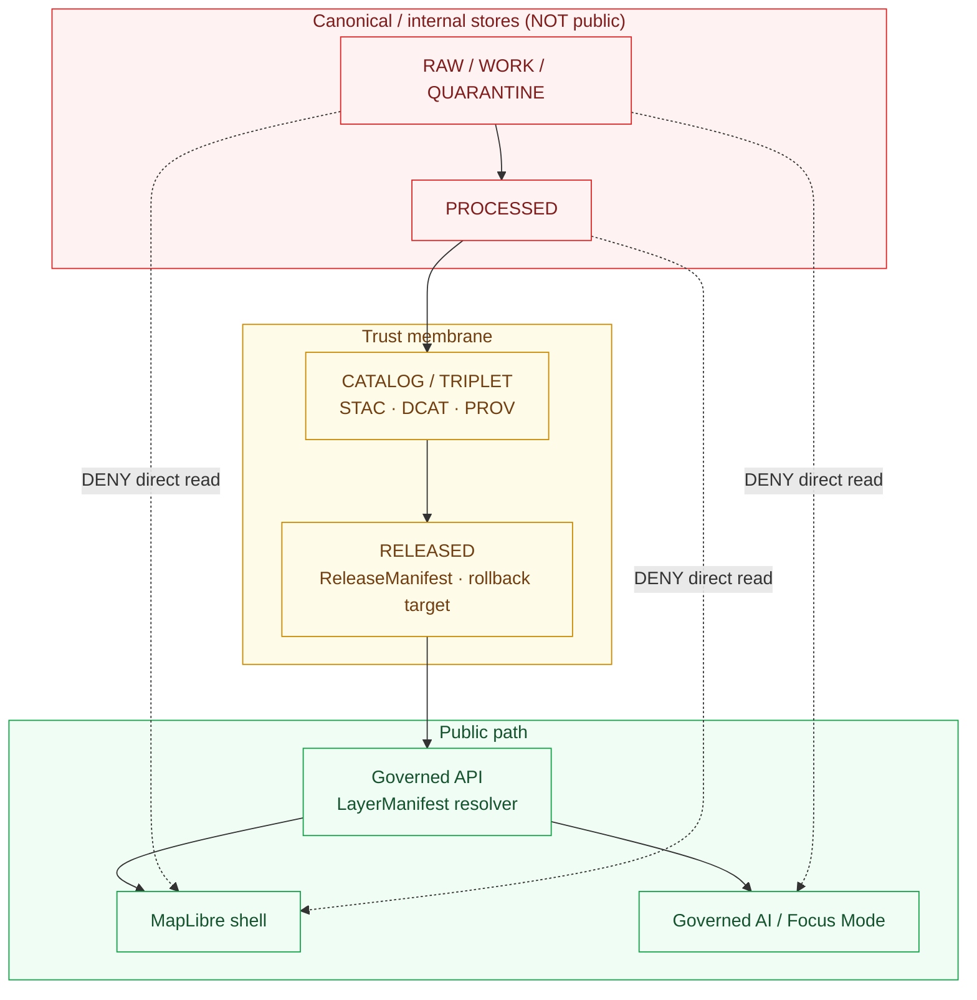

<!--
================================================================================
KFM Meta Block v2
--------------------------------------------------------------------------------
doc_id:             kfm://doc/arch-spatial-foundation
title:              Spatial Foundation — Architecture
class:              architecture / cross-domain doctrine
status:             draft
truth_posture:      cite-or-abstain
governance_layer:   data plane (spatial grammar) · map plane (renderer-bound)
proposed_path:      docs/architecture/spatial-foundation.md   (PROPOSED)
directory_rule:     §6 docs/architecture/<topic>.md — cross-domain doctrine.
                    §10.4 cross-domain topics live here, not under
                    docs/domains/<picked-one>/.
sibling_docs:       docs/architecture/system-context.md
                    docs/architecture/deployment-topology.md
                    docs/architecture/governed-api.md
                    docs/architecture/map-shell.md
                    docs/architecture/maplibre-3d.md
                    docs/architecture/contract-schema-policy-split.md
related_doctrine:   docs/doctrine/authority-ladder.md
                    docs/doctrine/lifecycle-law.md
                    docs/doctrine/trust-membrane.md
                    docs/doctrine/directory-rules.md  (v1.3)
related_atlas:      KFM_Domains_v1_1 §18 (Spatial Foundation, Cartography,
                    Reference Systems) — doctrinal source of object families.
                    Pass 23/32 Consolidated Atlas §24.4.1 — cross-lane edges
                    owned by Spatial Foundation.
related_standards:  docs/standards/PMTILES.md
                    docs/standards/OGC-API-TILES.md
                    docs/standards/ISO-19115.md
                    docs/standards/PROV.md
related_adrs:       ADR-0001 (schema-home) — CONFIRMED authored.
                    ADR-0008 (MapLibre default 2D shell + renderer boundary)
                    — PROPOSED in Build Manual Appendix B.
                    ADR-0009 (PMTiles/COG/GeoParquet artifact policy)
                    — PROPOSED in Build Manual Appendix B.
                    ADR-PROPOSED: MapLibre as Sole Browser-Side Renderer
                    (per maplibre-3d.md Appendix B).
spec_hash:          NEEDS VERIFICATION (generated at release time).
owners:             <PLACEHOLDER — Spatial Foundation steward + map-plane
                    steward; do not invent>
created:            <YYYY-MM-DD — set on PR>
updated:            <YYYY-MM-DD — set on PR>
policy_label:       public
tags:               [kfm, architecture, spatial, crs, projection, geometry,
                    cartography, maplibre, generalization]
notes:              Authored docs-only; no mounted repo, CI run, workflow,
                    runtime log, ADR set, or release artifact inspected.
                    Implementation maturity is bounded per the current-session
                    evidence limit.
================================================================================
-->

<a id="top"></a>

# Spatial Foundation — Architecture


<!-- CI badge URL is left as a placeholder; no mounted workflow was verified this session.

-->

> **One-line purpose.** Define how the **Spatial Foundation** — KFM's cross-cutting grammar for coordinate reference, geometry validity, scale, generalization, uncertainty, basemap context, and cartographic representation — participates in the system architecture, what it owns versus what it does not, how its artifacts flow through the trust membrane to the MapLibre shell and the Governed AI surface, and what gates govern its publication path.

> [!NOTE]
> Spatial Foundation is **doctrinally CONFIRMED** in *KFM Domains v1.1* §18 and *Pass 23/32 Consolidated Atlas* §24.4.1. Every **implementation-layer** claim in this document — paths, schemas, policy files, tests, route names, CI status — is **PROPOSED** until verified against a mounted repository. No mounted repo, ADR set, CI workflow, or runtime was inspected for this draft.

---

## Mini Table of Contents

- [1. Architectural role and posture](#1)
- [2. What Spatial Foundation owns and does not own](#2)
- [3. Object families and identity](#3)
- [4. Source families and rights](#4)
- [5. Cross-lane edges (the heart of this domain)](#5)
- [6. CRS doctrine — analysis vs. web delivery](#6)
- [7. Pipeline shape — RAW → PUBLISHED](#7)
- [8. Trust membrane — how spatial artifacts reach the public](#8)
- [9. Sensitivity transforms and public-safe geometry](#9)
- [10. Repository placement (PROPOSED)](#10)
- [11. Contracts, schemas, and policy surfaces](#11)
- [12. Validation tests](#12)
- [13. Anti-patterns](#13)
- [14. Open questions and verification backlog](#14)
- [15. Glossary tie-in](#15)
- [Related docs · Footer](#related)

---

<a id="1"></a>

## 1. Architectural role and posture

### 1.1 Why Spatial Foundation is an architecture topic, not a domain section

The Spatial Foundation is unusual among KFM lanes: it is a **bounded responsibility** in the DDD sense (it owns its own object families, has its own ubiquitous language, and is governed by the same RAW → PUBLISHED lifecycle as every other lane) **and** it is a **cross-cutting prerequisite** for every domain that has a footprint on the Earth — which is to say, all of them.

> **CONFIRMED doctrine.** *KFM Domains v1.1 §18.A* states Spatial Foundation's purpose is to "provide the shared spatial grammar for coordinate reference systems, geometry validity, scale, spatial support, generalization, uncertainty, basemap context, and cartographic representation." *[ENCY] [MAP-MASTER] [INDEX-18]*

Per *directory-rules.md* §10.4, cross-domain doctrine belongs in `docs/architecture/<topic>.md`, **not** under `docs/domains/<picked-one>/`. This file therefore sits alongside [`system-context.md`](./system-context.md), [`map-shell.md`](./map-shell.md), [`governed-api.md`](./governed-api.md), [`maplibre-3d.md`](./maplibre-3d.md), and [`contract-schema-policy-split.md`](./contract-schema-policy-split.md), and treats Spatial Foundation as an **architectural surface** that other domain documents reference and depend on.

### 1.2 Invariants this document preserves

> [!IMPORTANT]
> The following invariants come from KFM core doctrine (see [`directory-rules.md`](../doctrine/directory-rules.md), [`lifecycle-law.md`](../doctrine/lifecycle-law.md), [`trust-membrane.md`](../doctrine/trust-membrane.md)) and are reproduced here so that any Spatial Foundation change is evaluated against them.

| # | Invariant | Source |
|---|---|---|
| I-SF-1 | **CONFIRMED** — Lifecycle is `RAW → WORK / QUARANTINE → PROCESSED → CATALOG / TRIPLET → PUBLISHED`. Promotion is a governed state transition, not a file move. | [DIRRULES] [ENCY] |
| I-SF-2 | **CONFIRMED** — Public clients and the MapLibre shell consume **released** Spatial Foundation artifacts through a governed API and `LayerManifest` resolver, **not** canonical/internal stores. | [MAP-MASTER] [GAI] |
| I-SF-3 | **CONFIRMED** — `EvidenceRef` must resolve to `EvidenceBundle` before any consequential spatial claim is rendered, exported, or promoted. | [ENCY] |
| I-SF-4 | **CONFIRMED** — Source role is **fixed at admission** for every spatial source (authority, observation, context, model). Promotion never upgrades role. | [ENCY] §3 of Pass-23 supplement |
| I-SF-5 | **CONFIRMED** — Cross-domain joins through Spatial Foundation must preserve ownership, source role, sensitivity, and EvidenceBundle support. *(§18.F constraint.)* | [ENCY] §18.F |
| I-SF-6 | **CONFIRMED** — Style filters are **not** a valid mechanism for protecting sensitive geometry. Sensitive geometry must be transformed, generalized, denied, or quarantined **before** it reaches the renderer. | [MAP-MASTER] ML-Q-082 |
| I-SF-7 | **PROPOSED** — Analysis CRS and web-delivery CRS are kept distinct; mixing them without manifest fields is an anti-pattern. *(See §6.)* | [MAP-MASTER] ML-061-096 |

[↑ Back to top](#top)

---

<a id="2"></a>

## 2. What Spatial Foundation owns and does not own

> [!CAUTION]
> Reading the boundary correctly is the whole point of an architecture doc. Spatial Foundation provides **grammar**, not truth about hydrology, fauna, archaeology, or any other domain. Every other domain produces its own truth on its own geometry; Spatial Foundation defines how that geometry is described, projected, scaled, generalized, and presented.

### 2.1 Owned (CONFIRMED — KFM Domains v1.1 §18.B)

- Coordinate Reference Profiles.
- Geography Versions (named, time-bounded administrative or analytic geographies).
- Projection Transform Receipts.
- Geometry Fingerprints.
- Base Layer Descriptors.
- Map Style Rules.
- Scale Support Profiles.
- Uncertainty Surfaces (the *spatial* uncertainty primitive; domain-specific uncertainty stays with the domain).
- Generalization Transforms.
- LayerManifest *as it pertains to spatial-grammar layers* (admin boundaries, geographies, base layers). *Domain* LayerManifests stay with the domain.

### 2.2 Explicitly **not** owned (CONFIRMED — §18.B)

Hydrology, soil, geology, hazards, transport (roads/rail/trade), settlements/infrastructure, archaeology, people/DNA/land, habitat, fauna, flora, agriculture, and atmosphere truth all stay with their own domain lanes. Spatial Foundation **constrains and supports** them; it does not own them.

### 2.3 The boundary in one diagram


> **PROPOSED diagram caveat.** Edges shown are the strongest ones documented in *KFM Domains v1.1* §18.F and *Pass 23/32 Atlas* §24.4.1; conditional and rarely-used relations are not drawn. *(NEEDS VERIFICATION against mounted-repo cross-domain registry once available.)*

[↑ Back to top](#top)

---

<a id="3"></a>

## 3. Object families and identity

> **CONFIRMED ubiquitous language / PROPOSED field realization.** Each object family below is a bounded vocabulary term in the Spatial Foundation context. Its KFM-specific meaning is constrained by source role, evidence closure, time axes, and release state. *(KFM Domains v1.1 §18.C–E.)*

| Object family | Purpose | Identity rule | Temporal handling |
|---|---|---|---|
| **Coordinate Reference Profile** | Names a CRS plus its KFM-specific binding (datum, units, vertical reference, axis order, accuracy band). | **PROPOSED** deterministic basis: source id + object role + temporal scope + normalized digest. | **CONFIRMED** — source / observed / valid / retrieval / release / correction times stay distinct where material. |
| **GeographyVersion** | A named, time-bounded administrative or analytic geography (e.g., TIGER county vintage, HUC version, treaty boundary edition). | Same. | Same. |
| **Projection Transform Receipt** | Records a CRS-to-CRS transform actually applied to evidence (transform pipeline, tolerances, vertical handling). | Same. | Same. |
| **Geometry Fingerprint** | Stable hash + canonical-form signature for a geometry, used to detect change and to wire EvidenceRefs to specific shapes. | Same. | Same. |
| **Base Layer Descriptor** | Names a basemap or contextual layer (e.g., USGS terrain hillshade, NAIP imagery) with rights, source role, release state. | Same. | Same. |
| **MapStyleRule** | A rule about how a layer must be styled to remain public-safe and evidence-faithful (color ramps, label rules, classification break logic). | Same. | Same. |
| **Scale Support Profile** | Declares the scales / zoom levels at which an artifact is faithful, and where over- or under-zoom is misleading. | Same. | Same. |
| **UncertaintySurface** | Spatial expression of evidence uncertainty (positional accuracy, generalization residual, classification confidence). | Same. | Same. |
| **Generalization Transform** | Records a simplification / aggregation / fuzzing operation applied to geometry, including tolerance and reason. | Same. | Same. |
| **LayerManifest** *(spatial-grammar layers)* | Governs the identity, evidence linkage, time, geometry policy, and trust badges of a spatial-grammar layer (e.g., admin overlay). Domain LayerManifests stay with the domain. | Same. | Same. |

<details>
<summary><strong>Why "identity rule" is PROPOSED in every row</strong></summary>

The deterministic identity basis (`source id + object role + temporal scope + normalized digest`) is **doctrinal**: every Spatial Foundation object should be deterministically reproducible from its inputs. The schema fields and the canonicalization rule that realize this identity in JSON Schema, JCS+SHA-256 hashing, and a registry are **PROPOSED** until a mounted-repo schema (e.g., `schemas/contracts/v1/domains/spatial_foundation/*.schema.json`) is verified.

</details>

[↑ Back to top](#top)

---

<a id="4"></a>

## 4. Source families and rights

> **CONFIRMED categories / NEEDS VERIFICATION on terms.** The source families below are named in *KFM Domains v1.1* §18.D. Their current rights, sensitivity terms, and freshness windows are **NEEDS VERIFICATION** — never quote a source role or license from this document; consult the live `data/registry/source_descriptors/spatial_foundation/` set.

| Source family | Typical role | Rights / sensitivity | Freshness cadence | Status |
|---|---|---|---|---|
| **USGS 3DEP / terrain** (DEM, LiDAR, hillshade) | authority · observation · context · model (depending on artifact) | Generally public-domain; **rights NEEDS VERIFICATION** per artifact; sensitive joins (e.g., archaeology) **fail closed**. | source-vintage specific | [ENCY] [MAP-MASTER] [INDEX-18] |
| **TIGER (US Census)** — administrative geometry | authority · observation · context | Public-domain; **NEEDS VERIFICATION** for current vintage. | annual | [ENCY] [MAP-MASTER] |
| **GNIS** — feature names / places | authority · observation · context | Public-domain; **NEEDS VERIFICATION**; sensitive name joins reviewed. | continuous | [ENCY] [MAP-MASTER] |
| **State and local GIS** (e.g., DASC, county GIS) | authority · observation · context · model | varies per source; rights **NEEDS VERIFICATION**; sensitive infrastructure / parcel joins **fail closed**. | source-specific | [ENCY] |
| **Authoritative basemaps** (USGS, OpenStreetMap, vendor) | context | License-specific; OSM is ODbL-bound; vendor tiles carry per-tile rights. **NEEDS VERIFICATION**. | continuous | [ENCY] [MAP-MASTER] |
| **Imagery / DEM / COG** (NAIP, Sentinel, Landsat, county aerial) | observation · context | mixed; rights and sensitivity vary; cloud-optimized variants are **derived** artifacts. | source-specific | [ENCY] [MAP-MASTER] |
| **Historical maps** (USGS topo, GLO, county atlas, fire-insurance) | authority *for then-current claims only* · context | rights mixed; reproduction terms **NEEDS VERIFICATION**; positional accuracy can be modest and must carry an `UncertaintySurface`. | static (per vintage) | [ENCY] [MAP-MASTER] |

> [!WARNING]
> Source role is **fixed at admission**. Promotion from `WORK` to `PROCESSED` never upgrades a modeled artifact to an observation, and never upgrades an observed artifact to authority. *(Pass-23 §3 supplement.)*

[↑ Back to top](#top)

---

<a id="5"></a>

## 5. Cross-lane edges (the heart of this domain)

> **CONFIRMED doctrine — Pass 23/32 Atlas §24.4.1, *"Edges owned by Spatial Foundation."***

| Relation | Downstream lane | What flows | Constraint |
|---|---|---|---|
| Spatial grammar (canonical) | **All domains** | Coordinate Reference Profile, GeographyVersion, Projection Transform Receipt, scale-support, base-layer descriptors are **sourced here** — no domain redefines them locally. | Relation must preserve ownership, source role, sensitivity, and EvidenceBundle support. |
| Terrain & raster support | **Hydrology · Soil · Geology · Hazards · Atmosphere** | Time-aware overlay primitives (raster-dem, hillshade, COG context) are constrained by SF rules: clipping, projection, generalization tolerance. | Same. |
| Public-safe geometry & sensitivity transforms | **Archaeology · Fauna · Flora · Settlements/Infrastructure · People** | SF supplies the `Generalization Transform`, `RedactionReceipt`-compatible geometry transforms, and minimum-cell rules these domains require to publish. | Same. |
| Renderer & Focus-Mode delivery | **MapLibre shell · Governed AI** | Renderer and Focus surfaces stay **downstream of released evidence**; no map shell may consume a canonical SF store directly. | Same. |
| 3D & planetary anchors | **Planetary / 3D** | Vertical datum, terrain reference, and reality-boundary rendering constraints **originate here**. | Same. *(See [`maplibre-3d.md`](./maplibre-3d.md) §4.)* |

### 5.1 Sequence — how a domain claim becomes a public-safe map layer

```mermaid
sequenceDiagram
    autonumber
    participant SRC as Source (e.g., USGS 3DEP)
    participant SF as Spatial Foundation
    participant DOM as Domain lane (e.g., Hydrology)
    participant CAT as Catalog (STAC/DCAT/PROV)
    participant REL as Release queue
    participant API as Governed API
    participant ML as MapLibre shell

    SRC->>SF: ingest tile / DEM / boundary; admit with source role
    SF->>SF: assign Coordinate Reference Profile, Projection Transform Receipt
    SF->>DOM: provide canonical CRS, GeographyVersion, scale support
    DOM->>DOM: produce evidence-bearing claim with EvidenceRef
    DOM->>SF: request generalization / public-safe transform (if sensitive)
    SF-->>DOM: return generalized geometry + Generalization Transform receipt
    DOM->>CAT: write STAC Item + PROV link + EvidenceBundle
    CAT->>REL: candidate (LayerManifest + TileArtifactManifest + StyleManifest)
    REL->>REL: PolicyDecision · PromotionDecision · rollback target
    REL->>API: ReleaseManifest published
    ML->>API: request layer via LayerManifest resolver
    API-->>ML: signed manifest + tile URL (PMTiles/MVT/COG)
    ML->>ML: render with trust badge, time slider, evidence-drawer hook
```

> [!TIP]
> Read the diagram top-down as a **trust path**. The renderer never reaches back past the Governed API. Any "shortcut" that lets MapLibre fetch a canonical SF tile directly is the anti-pattern [§13](#13) calls out.

[↑ Back to top](#top)

---

<a id="6"></a>

## 6. CRS doctrine — analysis vs. web delivery

> **CONFIRMED doctrine / PROPOSED placement.** The analysis CRS and the web-delivery CRS are kept distinct in KFM. Mixing them without manifest fields is recorded as an anti-pattern in *Master MapLibre v2.1* ML-061-096.

### 6.1 The two-CRS rule

| Purpose | Typical CRS (PROPOSED) | Why |
|---|---|---|
| Analysis / measurement (Kansas + national CONUS) | **EPSG:5070** (NAD83 / CONUS Albers Equal Area) | Equal-area; correct distances and areas for hydrology, agriculture, habitat, soil. |
| Tiled web delivery | **EPSG:3857** (Web Mercator) | Standard for vector tiles, PMTiles, raster XYZ. |
| Lat/long interchange & STAC `geometry` | **EPSG:4326** (WGS84 lat/long) | Required by STAC and most catalog standards. |
| 3D terrain with vertical context | **EPSG:4979** (WGS84 3D) or equivalent | Required when vertical datum is material. *(See [`maplibre-3d.md`](./maplibre-3d.md) §2.1.)* |

> [!NOTE]
> These CRS choices are **PROPOSED defaults** consistent with KFM corpus guidance for Kansas-scope work. The authoritative per-artifact CRS lives in each `LayerManifest` and `TileArtifactManifest`, not in this document. A domain that uses a different analysis CRS for justified reasons should record the choice with a `Projection Transform Receipt`.

### 6.2 What must be recorded with every spatial artifact

Per *Master MapLibre v2.1* ML-061-015 (vertical datum & CRS in terrain artifact manifests) and ML-064-034 (PMTiles `sha256` in STAC):

- **CRS (`proj:code` or equivalent)** — required.
- **Vertical datum and units** — required for terrain, elevation, and any artifact where altitude is material.
- **bbox / geometry / shape / transform** — required STAC Projection extension fields. *(PROPOSED CI lint per Pass 27 KFM-P27-IDEA-0009.)*
- **Tiler / version / flags** — required for PMTiles and MVT artifacts so the build is reproducible.
- **Generalization tolerance** — required when geometry is simplified or aggregated.
- **Source vintage and time window** — required (see [§7](#7)).
- **EvidenceRef** — required; resolves to `EvidenceBundle` at runtime.

### 6.3 Vertical-datum trap

> [!WARNING]
> NFHL (National Flood Hazard Layer) vertical datum and units **must be checked before any engineering claim** is rendered. *(Master MapLibre v2.1 ML-061-022.)* Hazard surfaces that mix NAVD88 with NGVD29 without a recorded `Projection Transform Receipt` produce flood-relevant errors of feet, not inches.

[↑ Back to top](#top)

---

<a id="7"></a>

## 7. Pipeline shape — RAW → PUBLISHED

> **CONFIRMED doctrine / PROPOSED lane application.** Spatial Foundation follows the universal KFM lifecycle. *(DIRRULES · ENCY · MAP-MASTER · INDEX-18.)*

| Stage | Handling | Gate | Status |
|---|---|---|---|
| **RAW** | Capture immutable source payload or reference with source role, rights, sensitivity, citation, time, and hash. | `SourceDescriptor` exists. | PROPOSED |
| **WORK / QUARANTINE** | Normalize schema, geometry, time, identity, evidence, rights, and policy; hold failures. | `ValidationReport` + `PolicyDecision` pass, or `QuarantineReason` recorded. | PROPOSED |
| **PROCESSED** | Emit validated normalized SF objects, receipts, and public-safe candidates. | `EvidenceRef`, `ValidationReport`, and digest closure exist. | PROPOSED |
| **CATALOG / TRIPLET** | Emit STAC/DCAT/PROV records, `EvidenceBundle`, graph projections, and release candidates. | Catalog / proof closure passes. | PROPOSED |
| **PUBLISHED** | Serve released public-safe artifacts (PMTiles, COG, GeoParquet, GeoJSON snapshots, style bundles) through governed APIs and manifests. | `ReleaseManifest`, correction path, rollback target, and review/policy state exist. | PROPOSED |

### 7.1 Eight time axes the artifact must keep distinct

> **CONFIRMED doctrine.** The Build Manual §9.3 names eight axes that KFM never collapses into one timestamp. Spatial Foundation inherits all of them.

| Axis | Meaning (for SF artifacts) |
|---|---|
| `valid_time` | When the geography or boundary is true in the world (e.g., 1880 county boundary edition). |
| `observed_time` | When a measurement (DEM flight, survey) occurred. |
| `source_publication_time` | When the source published the artifact. |
| `retrieval_time` | When KFM acquired it. |
| `processing_time` | When KFM transformed / projected / generalized it. |
| `transaction_time` | When KFM recorded the internal SF fact. |
| `release_time` | When the public-safe SF artifact was released. |
| `correction_time` | When a correction / withdrawal / supersession was recorded. |

> [!TIP]
> "Time slider" UX over historical geographies depends on `valid_time` being correct per `GeographyVersion`. A 1955 county boundary rendered with a 2024 boundary edition is a *temporal source-role collapse* — flag and quarantine.

[↑ Back to top](#top)

---

<a id="8"></a>

## 8. Trust membrane — how spatial artifacts reach the public

> **CONFIRMED doctrine.** Public clients and the MapLibre shell consume released SF artifacts through a governed API and `LayerManifest` resolver, **not** canonical/internal stores. *(MAP-MASTER · GAI · DIRRULES.)*



### 8.1 What the renderer is allowed to see

| Item | Public path | Notes |
|---|---|---|
| PMTiles bundle digest | **Yes** (via `LayerManifest` + `TileArtifactManifest`) | Fetch verification compares against catalog `sha256`. *(ML-064-034.)* |
| Style JSON (released) | **Yes** | Style spec_hash verified at boot. |
| Generalized geometry | **Yes** | Generalization Transform receipt available via Evidence Drawer. |
| Exact archaeology / fauna / flora geometry | **No** *(unless reviewer-tier authenticated)* | T2+ — see [§9](#9). |
| Canonical CRS database | **No** | The renderer receives the *released* CRS profile; it never queries the canonical store. |
| RAW / WORK DEM tile | **No** | Public terrain delivery is always a released, governed derivative. |

### 8.2 Governed AI / Focus Mode bound

> **CONFIRMED doctrine.** Governed AI may **summarize** released Spatial Foundation EvidenceBundles, **compare** evidence across vintages of a `GeographyVersion`, and **explain** uncertainty surfaces; it must **ABSTAIN** when evidence is insufficient and **DENY** when policy / rights / sensitivity / release state blocks the request. *(GAI · ENCY.)* AI never becomes its own truth source for spatial claims.

[↑ Back to top](#top)

---

<a id="9"></a>

## 9. Sensitivity transforms and public-safe geometry

> **CONFIRMED doctrine.** Spatial Foundation owns the **generalization machinery** that other domains use to produce public-safe geometry. The **policy decision** (what to release, to whom, when) stays with the originating domain. *(KFM Domains v1.1 §18.F; Pass-23 §24.5.)*

### 9.1 Tier scheme (extends KFM Atlas §20.5)

| Tier | Name | Default audience | Required gates |
|---|---|---|---|
| **T0** | Open | Any public client via governed API | Standard Promotion Gates. |
| **T1** | Generalized | Any public client via governed API | `RedactionReceipt` or `AggregationReceipt` + `Generalization Transform`. |
| **T2** | Reviewer | Stewards, named research collaborators | + `ReviewRecord`. |
| **T3** | Restricted | Named authorized parties | + named-agreement record. |
| **T4** | Denied | — | not released; existence may be disclosable only with steward review. |

### 9.2 SF transforms by sister-lane sensitivity (PROPOSED defaults)

| Sister-lane sensitive object | SF transform | Receipt produced |
|---|---|---|
| Archaeology — site location (T4 default) | Generalization to coarse cell (e.g., ≥ 5 km buffer; H3 cell at low resolution); see also [`maplibre-3d.md`](./maplibre-3d.md) §8. | `Generalization Transform` + `RedactionReceipt` *(receipt produced by SF; policy decision by Archaeology steward)*. |
| Fauna — sensitive occurrence (T4) | Geoprivacy generalization to coarse cell; nest/den exact denied. | `Generalization Transform` + `RedactionReceipt`. |
| Flora — rare-plant precise location (T4) | Generalization or aggregation to range polygon. | `Generalization Transform` + `RedactionReceipt`. |
| Critical infrastructure (T2) | Public summary geometry; precise asset denied. | `Generalization Transform` + steward sign-off. |
| Living-person residence (T4) | No transform releases identity to public. | DENY. |
| Historic settlement uncertain footprint | `UncertaintySurface` rather than crisp polygon. | `UncertaintySurface` artifact. |

> [!WARNING]
> **Style filters are not protection.** *(Master MapLibre v2.1 ML-Q-082.)* A MapLibre `filter` expression that "hides" a sensitive feature still ships the geometry to the client. Sensitive geometry must be transformed, generalized, denied, or quarantined **before** the renderer sees it. The renderer-side filter is a UX nicety only.

[↑ Back to top](#top)

---

<a id="10"></a>

## 10. Repository placement (PROPOSED)

> [!IMPORTANT]
> All paths below are **PROPOSED** until verified against a mounted repository. They follow *directory-rules.md* v1.3 §6 (`docs/architecture/`), §7.4 (schema home), and §10.4 (cross-domain doctrine). No mounted repo, ADR set, CI workflow, runtime log, or release artifact was inspected for this draft.

```text
docs/
├── architecture/
│   ├── spatial-foundation.md          # this file (PROPOSED)
│   ├── system-context.md              # PROPOSED sibling per directory-rules §6
│   ├── deployment-topology.md         # PROPOSED sibling
│   ├── governed-api.md                # PROPOSED sibling
│   ├── map-shell.md                   # PROPOSED sibling
│   ├── maplibre-3d.md                 # CONFIRMED authored (prior session)
│   └── contract-schema-policy-split.md
│
schemas/
└── contracts/v1/
    └── domains/
        └── spatial_foundation/        # PROPOSED schema home
            ├── coordinate_reference_profile.schema.json
            ├── geography_version.schema.json
            ├── projection_transform_receipt.schema.json
            ├── geometry_fingerprint.schema.json
            ├── base_layer_descriptor.schema.json
            ├── map_style_rule.schema.json
            ├── scale_support_profile.schema.json
            ├── uncertainty_surface.schema.json
            └── generalization_transform.schema.json
│
policy/
├── domains/
│   └── spatial_foundation/            # PROPOSED policy home
│       ├── crs_admission.rego
│       ├── projection_transform_admission.rego
│       └── generalization_admission.rego
└── maplibre/                          # CONFIRMED v1.3 segment per directory-rules
    ├── style_admission.rego
    └── base_layer_admission.rego
│
data/
└── registry/
    └── source_descriptors/
        └── spatial_foundation/        # PROPOSED registry home
            ├── usgs_3dep.yaml
            ├── tiger.yaml
            ├── gnis.yaml
            └── ...
│
tests/
├── domains/
│   └── spatial_foundation/            # PROPOSED test home
│       ├── valid/
│       ├── invalid/
│       └── public_safe/
└── maplibre/                          # CONFIRMED v1.3 segment
│
release/
└── manifests/spatial_foundation/      # PROPOSED release home
```

### 10.1 Placement rules cheat-sheet

| Artifact | Home | Why |
|---|---|---|
| Architecture doc (this file) | `docs/architecture/spatial-foundation.md` | Cross-domain doctrine. *(directory-rules §10.4.)* |
| JSON Schema for an SF object family | `schemas/contracts/v1/domains/spatial_foundation/<object>.schema.json` | Schema home is the **shape** root, not `contracts/`. *(ADR-0001.)* |
| Semantic contract Markdown (object meaning) | `contracts/domains/spatial_foundation/<object>.md` | `contracts/` owns **meaning**, not shape. *(directory-rules §6.3.)* |
| OPA / policy bundle | `policy/domains/spatial_foundation/` | Policy owns **admissibility**. *(directory-rules §6.5.)* |
| Source descriptor | `data/registry/source_descriptors/spatial_foundation/` | Registry root. *(directory-rules §6.7.)* |
| Validator (executable) | `tools/validators/spatial_foundation/` | Tools home for long-lived trust-bearing scripts. |
| Map style for SF base layers | `policy/maplibre/` + `styles/` | Per v1.3 of directory rules. |

> [!NOTE]
> **No parallel schema, policy, source, registry, release, or proof home** is created for Spatial Foundation. The above paths are the same families every other domain uses, simply scoped to `spatial_foundation`. If a future change appears to require a parallel home, an ADR is mandatory. *(directory-rules §2.4.)*

[↑ Back to top](#top)

---

<a id="11"></a>

## 11. Contracts, schemas, and policy surfaces

> **PROPOSED.** The artifact contracts below are derived from KFM Atlas §18.E (object families) and the Build Manual §10 (domain-lane minimum contract). None is claimed to exist in a mounted repository from this session.

| Artifact | Required envelope fields (PROPOSED) | Outcome verbs | Schema home (PROPOSED) |
|---|---|---|---|
| `CoordinateReferenceProfile` | `crs_id`, `source_role`, `axis_order`, `vertical_datum`, `units`, `accuracy_band`, `EvidenceRef`, `valid_time` | n/a (descriptor) | `…/spatial_foundation/coordinate_reference_profile.schema.json` |
| `GeographyVersion` | `geography_id`, `vintage`, `valid_time`, `bbox`, `source_role`, `EvidenceRef` | n/a | `…/geography_version.schema.json` |
| `ProjectionTransformReceipt` | `from_crs`, `to_crs`, `pipeline`, `tolerance`, `input_digest`, `output_digest`, `tool`, `version`, `EvidenceRef` | n/a (receipt) | `…/projection_transform_receipt.schema.json` |
| `GeometryFingerprint` | `geometry_id`, `canonical_form_digest`, `bbox`, `crs`, `simplification_tolerance` | n/a | `…/geometry_fingerprint.schema.json` |
| `BaseLayerDescriptor` | `layer_id`, `source_role`, `rights_statement`, `tile_format` (`pmtiles`/`mvt`/`xyz`/`raster`), `EvidenceRef`, `release_state` | n/a | `…/base_layer_descriptor.schema.json` |
| `MapStyleRule` | `rule_id`, `applies_to_layer`, `style_kind`, `classification_rule`, `accessibility_check`, `EvidenceRef` | n/a | `…/map_style_rule.schema.json` |
| `ScaleSupportProfile` | `profile_id`, `min_zoom`, `max_zoom`, `min_scale`, `max_scale`, `distortion_band` | n/a | `…/scale_support_profile.schema.json` |
| `UncertaintySurface` | `surface_id`, `kind` (positional, classification, generalization residual), `crs`, `value_band`, `EvidenceRef` | n/a | `…/uncertainty_surface.schema.json` |
| `GeneralizationTransform` | `transform_id`, `input_geometry_fingerprint`, `algorithm`, `tolerance`, `reason_code`, `EvidenceRef` | n/a (receipt) | `…/generalization_transform.schema.json` |
| `LayerManifest` *(SF layers)* | `layer_id`, `geometry_label` (`2d` / `2.5d` / `true_3d_evidence`), `crs_ref`, `style_ref`, `tile_artifact_ref`, `EvidenceRef`, `policy_label`, `release_state` | ANSWER / DENY / ERROR | `schemas/contracts/v1/maplibre/layer_manifest.schema.json` *(per directory-rules v1.3)* |
| `TileArtifactManifest` | `artifact_id`, `format` (`pmtiles`/`mvt`/`cog`), `sha256`, `tiler`, `tiler_version`, `flags`, `zooms`, `EvidenceRef` | n/a (manifest) | `schemas/contracts/v1/maplibre/tile_artifact_manifest.schema.json` |
| `MapReleaseManifest` | `release_id`, `layer_refs`, `style_ref`, `tile_artifact_refs`, `rollback_target`, `signatures` | ANSWER / DENY / ERROR | `schemas/contracts/v1/release/map_release_manifest.schema.json` |

[↑ Back to top](#top)

---

<a id="12"></a>

## 12. Validation tests

> **PROPOSED test categories.** None claimed to exist in a mounted repository this session.

<details>
<summary><strong>Contract tests (PROPOSED)</strong></summary>

- Valid `CoordinateReferenceProfile`, `GeographyVersion`, `ProjectionTransformReceipt`, `GeometryFingerprint`, `BaseLayerDescriptor`, `MapStyleRule`, `ScaleSupportProfile`, `UncertaintySurface`, `GeneralizationTransform`, `LayerManifest`, `TileArtifactManifest` round-trip against schemas.
- Invalid fixtures (missing `crs`, missing `vertical_datum` on terrain, missing `EvidenceRef`, missing `spec_hash`, missing tiler version, missing generalization tolerance) **fail closed**.
- STAC Projection front-matter lint (`proj:code`, `bbox`, `geometry`, `shape`, `transform`) passes for processed-stage artifacts. *(Per KFM-P27-IDEA-0009.)*

</details>

<details>
<summary><strong>Policy tests (PROPOSED)</strong></summary>

- Layer with `geometry_label: '2.5D'` and `requested_mode: 'true_3d_evidence'` → **DENY**. *(Cross-ref [`maplibre-3d.md`](./maplibre-3d.md) §10.)*
- Sensitive geometry without `Generalization Transform` and `RedactionReceipt` → **DENY**.
- Layer relying on style `filter` for sensitivity hiding → **DENY**. *(ML-Q-082.)*
- Vertical-datum / units missing on engineering-relevant raster → **DENY**.
- Tiler version drift versus pinned manifest → **DENY**.
- Public client request that bypasses `LayerManifest` resolver → **DENY**.

</details>

<details>
<summary><strong>Integration / smoke tests (PROPOSED)</strong></summary>

- Round-trip: `RAW` USGS 3DEP tile → `Projection Transform Receipt` → `BaseLayerDescriptor` → `LayerManifest` → `TileArtifactManifest` → `MapReleaseManifest` → MapLibre boot, `RenderReceipt` emitted within budget.
- PMTiles range/CORS/cache test against released artifact. *(Master MapLibre v2.1 Category T.)*
- Time-slider regression: a layer rendered at `valid_time = 1880` does **not** show the 2024 boundary edition.
- Cross-renderer integration tests are **doctrinally empty** per *directory-rules.md* v1.3 (single-renderer architecture). Any such test directory is drift.
- Globe-projection toggle inherits 2D admission decisions; no projection-driven loosening. *(See [`maplibre-3d.md`](./maplibre-3d.md) §8.4.)*

</details>

<details>
<summary><strong>Rollback / correction tests (PROPOSED)</strong></summary>

- A `CorrectionNotice` on a base-layer artifact correctly lists invalidated derivatives (downstream domain layers that used the affected `GeographyVersion`).
- `RollbackCard` repoints `release_state` to a prior `MapReleaseManifest` without rewriting history.

</details>

[↑ Back to top](#top)

---

<a id="13"></a>

## 13. Anti-patterns

> **CONFIRMED doctrine — Pass 23/32 Atlas §24.9.** Recorded here so any SF change is evaluated against them.

| Anti-pattern | What goes wrong | Counter-rule |
|---|---|---|
| MapLibre shell consumes a canonical SF store directly. | Renderer becomes the public surface and inherits no governance. | Public path is only `Governed API → LayerManifest resolver → MapLibre`. |
| Domain redefines its own CRS or `GeographyVersion`. | Two truths for the same geography; cross-lane joins drift. | Sole source is `data/registry/source_descriptors/spatial_foundation/`. |
| Sensitive geometry "hidden" by MapLibre `filter`. | Geometry still ships to the client. | Transform / generalize / deny **before** the renderer. |
| Projection done implicitly in a domain pipeline without a `Projection Transform Receipt`. | Provenance gap; reprojection drift across runs. | Every reprojection emits a receipt. |
| Vertical datum omitted on terrain or hazard layer. | Flood / engineering claims become unreliable. | Vertical datum and units are required fields. *(ML-061-015, ML-061-022.)* |
| Source role "upgraded" by promotion (e.g., modeled → observed). | Source-role collapse in cross-lane joins. | Source role is fixed at admission. *(Pass-23 §3.)* |
| `valid_time = today` rendered over a 1880 cadastral overlay. | Temporal source-role collapse. | Time-slider tests; `GeographyVersion.valid_time` lock. |
| Atlas summary cited as evidence. | Atlas / supplements / matrices are reference views, not authority. | `EvidenceBundle` is authoritative. *(§24.9.3.)* |

[↑ Back to top](#top)

---

<a id="14"></a>

## 14. Open questions and verification backlog

| ID | Question | Resolution path |
|---|---|---|
| **OPEN-SF-01** | Are the `spatial_foundation/` schema, policy, registry, and test paths in §10 already present in the mounted repo, partially present, or absent? | Mount repo; inventory paths; record findings in `docs/registers/DRIFT_REGISTER.md`. |
| **OPEN-SF-02** | What CRS is the **default analysis CRS** in any current Kansas-specific pipeline? Does EPSG:5070 match practice, or has a different equal-area CRS been adopted locally? | Inspect any existing pipeline manifests; reconcile against §6.1. |
| **OPEN-SF-03** | Is a `Generalization Transform` schema already drafted? If yes, does it satisfy the sister-lane redaction needs from Archaeology / Fauna / Flora / Settlements? | Search `schemas/contracts/v1/`; verify against the §9.2 transform requirements. |
| **OPEN-SF-04** | Does the existing (if any) `LayerManifest` schema carry `crs_ref`, `geometry_label`, `policy_label`, `release_state`, and `EvidenceRef`? | Inspect `schemas/contracts/v1/maplibre/`; cross-check against [`maplibre-3d.md`](./maplibre-3d.md) §4. |
| **OPEN-SF-05** | Is ADR-0008 (MapLibre default 2D shell + renderer boundary) and ADR-0009 (PMTiles/COG/GeoParquet artifact policy) accepted, or still PROPOSED? | Inspect `docs/adr/`; if numbering conflicts, route through the drift register. |
| **OPEN-SF-06** | Which steward holds **release authority** for Spatial Foundation artifacts? Atlas v1.1 §18 names the domain but does not name a steward in this session's evidence. | Surface in `docs/governance/` once the steward set is verified. |
| **OPEN-SF-07** | Spec-hash strategy: JCS+SHA-256? Different canonicalization? | Per ADR-0004 (deterministic ID and hash policy) — **NEEDS VERIFICATION** of ADR status. |
| **OPEN-SF-08** | Are STAC Projection extension fields lintable in CI? KFM-P27-IDEA-0009 records this as PROPOSED; mounted-repo CI status is **UNKNOWN**. | Inspect `.github/workflows/`. |

[↑ Back to top](#top)

---

<a id="15"></a>

## 15. Glossary tie-in

> **CONFIRMED — KFM Atlas v1.1 Appendix A** and the Build Manual §28. Reproduced here only for the terms most relevant to Spatial Foundation; the canonical glossary is the Atlas.

| Term | Short definition (Atlas-grounded) |
|---|---|
| **Coordinate Reference Profile** | KFM-bound CRS descriptor including datum, units, vertical reference, axis order, accuracy band. |
| **GeographyVersion** | A named, time-bounded administrative or analytic geography. |
| **Projection Transform Receipt** | Reproducible record of a CRS-to-CRS transform actually applied. |
| **Generalization Transform** | Reproducible record of geometric simplification / aggregation / fuzzing. |
| **Geometry Fingerprint** | Stable canonical-form digest of a geometry for change detection and evidence wiring. |
| **UncertaintySurface** | Spatial expression of evidence uncertainty (positional / classification / generalization residual). |
| **LayerManifest** | Governed identity, evidence, time, geometry, and trust state of a map layer. |
| **TileArtifactManifest** | Tiler, version, flags, zooms, format, digest, source links of a tile bundle. |
| **MapReleaseManifest** | Release-state bundle of layers, styles, and tile artifacts with rollback target. |
| **Trust membrane** | The boundary preventing RAW / WORK / QUARANTINE state from becoming public truth. |
| **Governed API** | The interface enforcing evidence, policy, release, finite outcomes, and audit. |
| **Public-safe** | Released, rights-cleared, sensitivity-reviewed, citable, reviewable, rollback-capable. |

---

<a id="related"></a>

## Related docs

- [`docs/architecture/system-context.md`](./system-context.md) — overall KFM system context. *(PROPOSED sibling per directory-rules §6.)*
- [`docs/architecture/map-shell.md`](./map-shell.md) — the MapLibre shell architecture this domain feeds. *(PROPOSED sibling.)*
- [`docs/architecture/maplibre-3d.md`](./maplibre-3d.md) — 3D / planetary surface, downstream of SF. *(CONFIRMED authored prior session.)*
- [`docs/architecture/governed-api.md`](./governed-api.md) — the trust-membrane interface SF artifacts pass through. *(PROPOSED sibling.)*
- [`docs/architecture/contract-schema-policy-split.md`](./contract-schema-policy-split.md) — the meaning / shape / admissibility split SF follows. *(PROPOSED sibling.)*
- [`docs/doctrine/directory-rules.md`](../doctrine/directory-rules.md) — placement authority (v1.3).
- [`docs/doctrine/lifecycle-law.md`](../doctrine/lifecycle-law.md) — RAW → PUBLISHED invariant.
- [`docs/doctrine/trust-membrane.md`](../doctrine/trust-membrane.md) — public path boundary.
- [`docs/standards/PMTILES.md`](../standards/PMTILES.md) — PMTiles v3 conformance profile. *(CONFIRMED authored prior session; repo-presence NEEDS VERIFICATION.)*
- [`docs/standards/OGC-API-TILES.md`](../standards/OGC-API-TILES.md) — OGC API Tiles integration. *(CONFIRMED authored prior session.)*
- [`docs/standards/ISO-19115.md`](../standards/ISO-19115.md) — geographic metadata crosswalk. *(CONFIRMED authored prior session.)*
- [`docs/standards/PROV.md`](../standards/PROV.md) — provenance profile. *(CONFIRMED authored prior session; naming variance vs. corpus `PROVENANCE.md` → directory-rules §18 OPEN-DR-01.)*
- *KFM Domains v1.1* §18 — doctrinal source.
- *Pass 23/32 Consolidated Atlas* §24.4.1 — cross-lane edges owned by Spatial Foundation.
- *Master MapLibre Components-Functions-Features v2.1* Category K (raster/COG/DEM/terrain/hillshade) and Category Q (sensitive geometry / geoprivacy).

---

**Last updated:** `<YYYY-MM-DD — set on PR>`
**Doc version:** `v1 (draft)`
**Spec hash:** *NEEDS VERIFICATION (generated at release time).*

[↑ Back to top](#top)
