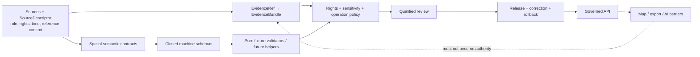

<!-- [KFM_META_BLOCK_V2]
doc_id: kfm://doc/architecture/spatial-foundation
title: Spatial Foundation — Current Architecture and Spatial-Control Boundary
type: architecture-reference
version: v2.0-draft
status: "draft; repository-grounded; cross-cutting; mixed-maturity; no-domain-truth-authority; no-policy-authority; no-release; no-publication"
owners:
  - "@bartytime4life — verified GitHub review route through CODEOWNERS"
  - "NEEDS VERIFICATION — spatial-foundation, geography, geodesy, survey, map, evidence, policy, release, security, and independent-review stewards"
created: "NEEDS VERIFICATION — target predates this repository-grounded revision"
updated: 2026-08-19
policy_label: "public; architecture; spatial-foundation; cross-cutting; representation; geometry-lineage; fail-closed; release-gated"
owning_root: docs/
current_path: docs/architecture/spatial-foundation.md
responsibility: >
  Explain the cross-system architecture for spatial identity, geography versions,
  reference systems, geometry lineage, transformations, scale support, uncertainty,
  spatial joins, and public-safe representation without becoming a domain lane,
  semantic contract, machine schema, policy source, executable transform, source
  registry, lifecycle store, release authority, or implementation proof.
truth_posture: >
  CONFIRMED same-path architecture placement, accepted Directory Rules,
  CODEOWNERS review routing, cross-cutting/non-domain posture in current registers,
  three proposed-inactive machine-backed spatial-foundation profiles, adjacent
  fixture-only geography/crosswalk/admin-boundary and georeference profiles, a
  deterministic fixture-only CSV-to-GeoJSON preflight, a greenfield geo package,
  a fail-closed Governed API scaffold, and several documentation/inventory drifts /
  PROPOSED complete spatial-control architecture, CRS profile closure, geometry
  fingerprinting, scale-support and uncertainty semantics, operational transform
  receipts, policy integration, and governed consumer bindings / CONFLICTED
  Spatial Foundation domain-vs-cross-cutting labeling, source-lifecycle placement
  for 3DEP, map/layer contract homes, and incomplete family indexes / UNKNOWN
  active source intake, real geometry processing, accepted CRS registry, runtime
  transformations, evidence resolution, public-safe enforcement, release
  integration, deployed behavior, and operational effectiveness.
evidence_snapshot:
  repository: bartytime4life/Kansas-Frontier-Matrix
  base_ref: main
  base_commit: 45fc45556a007196aa29e725f3a4b9fe9af8294e
  target_prior_blob: 8e6ec163063d465d47ef1576c54755bc41539915
  directory_rules_blob: fd49a0b83e55cef52c1124281f093e263526898d
  codeowners_blob: dd2a84aa514d8ecd9208bc347f90f9a2ed37dd61
  domain_lane_projection_blob: 1bfc6f91cfa713a5e3d51ece011b63b46310734f
  spatial_domain_scaffold_blob: f0d3a41c2a1474bf804e21c8b328b44356e9b1f6
  spatial_contract_family_blob: c500d6120b9c990c48703247730d6b9efb4f5112
  spatial_schema_family_blob: ec3e15743a90bdc902a43f8aa8b39a91509fbcba
  boundary_derivation_contract_blob: 8ec39e8d2089a7a64229a6b8452e5065abd4943a
  xy_transform_contract_blob: 1618cdaccf65a0e55b1806f753ffb9afbccaad00
  lidar_lineage_contract_blob: 8b82ed6ce81a330a781346d57136b25c7490be53
  geography_version_contract_blob: 35d2886a444af39d68326f6d3aa625b173321147
  geography_version_schema_blob: 09365abedf0469519546b29d1503694674494b24
  geography_version_validator_blob: caf24421868c3858bd1229c29670a051713d83e5
  geography_crosswalk_contract_blob: 683d22abb441edcc6b280f9a74950cc3363a42c5
  admin_boundary_change_contract_blob: 27dd83b9a33c7b6e44397a3f2c2a8e76dbb98e96
  geo_package_readme_blob: 275fd1fb20fc3e843b85feb992e10d22034c3481
  geo_package_manifest_blob: ad9241a73d73d1c47fe2d29e52594b3961e8b588
  geo_core_blob: 228384a7b82327f71f10bf16edc3a399f40c7576
  map_schema_readme_blob: 945118eec8ec9f4c36549fe7a6fbcdf18bc09f41
  map_contract_readme_blob: 4416722f89251682990db51522d9ce8ee00a4369
  map_release_manifest_contract_blob: e2a70bdd659cf432901ee9d5544b8e1418c23e60
  csv_geojson_preflight_blob: b3b6d4eeae5e59e42715b1dc7e43376dddbc8dbd
  governed_api_main_blob: 4eb335c7c0b27f62c7419c478542e8fe40e1ff38
  governed_api_stub_blob: 371e60d9f96c78e31c8a1e6109d19dee5da4213b
related:
  - ./README.md
  - ./SYSTEM_MAP.md
  - ./system-context.md
  - ./contract-schema-policy-split.md
  - ./cross-lane-join-policy.md
  - ./source-role-anti-collapse.md
  - ./data-classification-framework.md
  - ./map-shell.md
  - ./governed-api.md
  - ./sensitive-domain-fail-closed.md
  - ./sensitivity.md
  - ./document-convergence-plan.md
  - ../doctrine/directory-rules.md
  - ../adr/ADR-0029-adopt-directory-governance-standard-v2.md
  - ../registers/DOMAIN_LANE.md
  - ../registers/OBJECT_FAMILY.md
  - ../../control_plane/domain_lane_register.yaml
  - ../../contracts/spatial-foundation/README.md
  - ../../schemas/contracts/v1/spatial-foundation/README.md
  - ../../contracts/common/geography_version.md
  - ../../contracts/crosswalks/geography_crosswalk.md
  - ../../contracts/common/admin_boundary_change.md
  - ../../contracts/map/README.md
  - ../../contracts/release/map_release_manifest.md
  - ../../packages/geo/README.md
  - ../../tools/ingest/csv_geojson_preflight/preflight.py
  - ../../apps/governed-api/src/governed_api/main.py
  - ../../release/README.md
tags: [kfm, architecture, spatial-foundation, geography-version, crs, geometry, transformation, scale, uncertainty, crosswalk, provenance, map, evidence, release]
notes:
  - "Same-path architecture-document modernization only; no contract, schema, source, fixture, validator, package, policy, data, API, release, deployment, or publication mutation."
  - "Spatial Foundation is treated as a cross-cutting capability because the current domain-lane projection excludes spatial and contains no spatial-foundation domain entry."
  - "The legacy document identity and explicit anchors 1 through 15 plus related are preserved for inbound compatibility."
  - "No real coordinates, protected geometry, source payload, operational redaction parameter, or sensitive transform threshold is included."
[/KFM_META_BLOCK_V2] -->

<a id="top"></a>

# Spatial Foundation — Current Architecture and Spatial-Control Boundary

> **Operating rule.** Spatial Foundation makes location, geometry, reference systems, geography versions, transformations, scale support, uncertainty, and spatial lineage explicit and reviewable. It does not create domain truth, decide policy, certify a legal boundary, activate a source, approve a release, or make a rendered map authoritative.

[](#1)
[](#10)
[](#1)
[](#3)
[](#3)
[](#8)
[](#16)

> [!IMPORTANT]
> **Current repository evidence supports several bounded control slices, not an end-to-end spatial foundation.** The repository contains proposed-inactive contracts, closed schemas, synthetic fixtures, deterministic validators, tests, and workflows for selected geography, crosswalk, administrative-boundary, coordinate-creation, LiDAR-lineage, boundary-derivation, and georeference questions. Those slices deliberately avoid real source access, real geometry processing, policy evaluation, evidence resolution, release, and publication.

> [!CAUTION]
> **A CRS token, valid geometry, low residual, passing fixture, digest, or map-ready artifact is not spatial truth.** Every consequential use still needs source role, evidence, temporal scope, intended use, rights, sensitivity, review, release, correction, and rollback support appropriate to the operation.

> [!WARNING]
> **No universal CRS or redaction parameter is approved here.** Analysis, storage, interchange, web delivery, vertical reference, epoch, generalization, and public-safe precision are operation-specific. Public documentation must not expose reversal-enabling or protection-weakening parameters.

**Quick navigation:** [Role](#1) · [Boundary](#2) · [Repository state](#3) · [Sources](#4) · [Cross-lane joins](#5) · [CRS and operations](#6) · [Lifecycle and time](#7) · [Trust membrane](#8) · [Sensitivity](#9) · [Placement](#10) · [Contracts and outcomes](#11) · [Validation](#12) · [Anti-patterns](#13) · [Maturity and backlog](#14) · [Glossary](#15) · [Change and rollback](#16) · [Related](#related)

## Current bounded result

| Field | Current result |
|---|---|
| **Evidence snapshot** | `main@45fc45556a007196aa29e725f3a4b9fe9af8294e` |
| **Directory result** | `PLACE` at `docs/architecture/spatial-foundation.md`; accepted ADR-0029 assigns human-readable cross-system architecture to `docs/architecture/`, and the convergence plan independently records this same-path disposition. |
| **Context result** | Cross-cutting capability, not a registered domain lane. The current machine projection excludes `spatial`; `docs/domains/spatial-foundation/README.md` remains a proposed scaffold. |
| **Machine-backed Spatial Foundation family** | Three proposed-inactive, fixture-first profiles: `BoundaryDerivationRecord`, `XYPointTransformReceiptCandidate`, and `LidarDerivedProductLineageReceipt`. |
| **Adjacent geography family** | Proposed-inactive `GeographyVersion`, `GeographyCrosswalk`, and `AdminBoundaryChange` profiles with deterministic no-network validation. |
| **Adjacent georeference family** | Proposed-inactive GCP identity, GCP-evidence, resource-space distribution, and affine-quality profiles under the map contract/schema family. |
| **Reusable implementation package** | `packages/geo` is a `0.0.0` greenfield placeholder with an empty initializer and comment-only `core.py`; no supported API or operational transform is established. |
| **Runtime/public boundary** | The Governed API exposes three scaffold GET routes and returns `ABSTAIN / NOT_IMPLEMENTED`; unsupported requests return safe `ERROR`. No spatial query, CRS registry, transform, geometry, or map-release `ANSWER` path is established. |
| **Release/public effect** | None. This document, a fixture pass, a workflow, a manifest candidate, or a rendered map does not release or publish anything. |

---

<a id="1"></a>

## 1. Architectural role, authority, and cross-cutting status

Spatial Foundation is the **context map for shared spatial meaning**. It explains how KFM components should talk about location and representation without collapsing distinct models into one universal geometry model.

It covers the architecture-level relationships among:

- geography identity and version;
- coordinate reference systems, datums, epochs, units, and axis order;
- source geometry, observed coordinates, derived geometry, generalized geometry, and synthetic geometry;
- coordinate creation, transformation, georeferencing, resampling, simplification, aggregation, and redaction;
- scale, resolution, support, extent, precision, and uncertainty;
- spatial joins, overlays, crosswalks, and administrative-boundary lineage;
- map-facing artifacts and their release envelopes; and
- correction, supersession, withdrawal, and rollback of spatial derivatives.

### 1.1 Spatial Foundation is not a domain lane

The current repository contains a proposed scaffold at `docs/domains/spatial-foundation/`, but the machine-readable domain-lane projection:

- lists thirteen domain lanes;
- names `spatial` as a cross-cutting exclusion; and
- contains no `spatial-foundation` domain entry.

This page therefore treats Spatial Foundation as a **cross-cutting architecture and contract family**, not as Domain 1 or as an independent source-of-truth lane. Adding it as a domain would require a separately governed domain-lane decision and synchronized register change.

### 1.2 Authority by question

| Question | Owning authority | Role of this page |
|---|---|---|
| Where cross-system spatial architecture is explained | Accepted Directory Rules and this `docs/architecture/` lane | Explain relationships and current evidence |
| What a spatial object means | The accepted semantic contract under `contracts/` | Link and compare; do not redefine |
| What machine shape is valid | The paired schema under `schemas/` | Link and report maturity; do not duplicate |
| Which source is admissible | Source registry, source admission, rights, and policy surfaces | Require closure; do not activate |
| How a pure reusable transform runs | Accepted implementation under `packages/`, `tools/`, or another verified execution root | State boundaries and evidence; do not claim runtime |
| Whether a geometry may be exposed | Policy, sensitivity, rights, review, evidence, and release records | Explain required closure; never allow |
| What a public client receives | Governed API and released public-safe artifacts | Keep public traffic downstream of trust |
| Whether a map or artifact is released | `release/` plus referenced accountability objects | No release authority |
| Whether behavior is effective in deployment | Tests, workflows, artifacts, logs, dashboards, and observed runtime | Record only verified evidence |

### 1.3 Core invariants

1. **Representation is contextual.** A geometry or coordinate is meaningful only with its source role, reference system, time, support, precision, and intended operation.
2. **Identity is version-bounded.** Feature identity across geography versions is not inferred.
3. **Transformation is explicit.** Reprojection, coordinate creation, georeferencing, aggregation, simplification, generalization, redaction, and resampling require a named, versioned, reviewable operation.
4. **Derived stays derived.** A transformed geometry does not become source geometry or legal authority.
5. **Validation is bounded.** Shape validity and numeric quality do not establish source truth, fitness for every use, or public safety.
6. **Policy remains external.** A pure spatial helper does not decide rights, sensitivity, access, release, or publication.
7. **Public delivery is downstream.** Ordinary clients receive released public-safe representations through governed interfaces.
8. **Correction is spatially complete.** Supersession or withdrawal must propagate to affected artifacts, indexes, caches, maps, exports, and AI context.
9. **Missing context fails closed.** The safe result is `ABSTAIN`, `DENY`, `HOLD`, `QUARANTINE`, or `ERROR`, not an inferred default.

[Back to top](#top)

---

<a id="2"></a>

## 2. Responsibility boundary: what belongs and what does not

### 2.1 Architecture responsibilities

This page may explain:

- shared spatial vocabulary and anti-collapse rules;
- the current contract/schema/validator context map;
- required input closure for spatial operations;
- finite operation and validation outcomes;
- scale, uncertainty, temporal, sensitivity, and release handoffs;
- source-role preservation across geometry derivation;
- public-safe representation principles; and
- maturity, validation, correction, and rollback requirements.

### 2.2 Responsibilities owned elsewhere

| Concern | Owning surface | Why it remains separate |
|---|---|---|
| Hydrologic, soil, habitat, fauna, flora, agriculture, geology, atmosphere, hazards, transport, settlement, archaeology, or people truth | Owning domain contracts, evidence, and lifecycle lanes | Spatial Foundation supplies representation grammar, not domain meaning |
| Source descriptors and activation state | Source registry and connector governance | A source path or URL is not spatial authority |
| Real RAW, WORK, QUARANTINE, PROCESSED, catalog, triplet, or published objects | `data/` lifecycle and accountability planes | Architecture prose does not store or promote data |
| Machine shape | `schemas/` | Closed schemas must remain single-authority |
| Admissibility, access, rights, sensitivity, and release policy | `policy/`, review, rights, and release authorities | Pure geometry mechanics cannot grant permission |
| Reusable executable geometry code | Verified package/tool/runtime implementation | Documentation is not an executable transform |
| Map style, rendering, camera, and interaction | Map/UI/runtime owners | Render state is not geometry truth |
| Receipts, proofs, reviews, release manifests, corrections, and rollback records | Their distinct accountability families | One object must not absorb another authority |
| Legal boundary, parcel, title, ownership, or survey certification | Qualified source and legal/survey authority | Analytic derivation must not imply legal effect |
| AI interpretation | Governed AI behind the trust membrane | Generated language is not evidence or spatial authority |

### 2.3 Context-map view


```mermaid
flowchart LR
  Sources["Sources + SourceDescriptor<br/>role, rights, time, reference context"]
  Evidence["EvidenceRef → EvidenceBundle"]
  Contracts["Spatial semantic contracts"]
  Schemas["Closed machine schemas"]
  Pure["Pure fixture validators / future helpers"]
  Policy["Rights + sensitivity + operation policy"]
  Review["Qualified review"]
  Release["Release + correction + rollback"]
  API["Governed API"]
  Map["Map / export / AI carriers"]

  Sources --> Evidence
  Sources --> Contracts
  Contracts --> Schemas
  Schemas --> Pure
  Evidence --> Policy
  Pure --> Policy
  Policy --> Review
  Review --> Release
  Release --> API
  API --> Map

  Map -. "must not become authority" .-> Evidence
```

No arrow authorizes the next state by itself. Each transition has its own evidence and owner.

[Back to top](#top)

---

<a id="3"></a>

## 3. Current repository state and object-family maturity

### 3.1 Machine-backed Spatial Foundation profiles

| Profile | Confirmed repository packet | Current bounded meaning | What it does not prove |
|---|---|---|---|
| `BoundaryDerivationRecord` | Contract, closed schema, synthetic fixtures, validator, tests, workflow, generated authoring receipt | Source-role-aware provenance for analytic geometry derived from survey control and historical material; explicit non-title and non-legal limitations | Real survey accuracy, legal boundary, title, ownership, evidence closure, policy, release, or public use |
| `XYPointTransformReceiptCandidate` | Contract, closed schema, fixture matrix, validator, tests, workflow, generated authoring receipt | Declared table-to-point coordinate creation with field roles, pinned CRS ref/digest, bounds, precision, counts, and output lineage | Source-table inspection, CRS parsing, coordinate transformation, coordinate accuracy, review, lifecycle mutation, or publication |
| `LidarDerivedProductLineageReceipt` | Contract, closed schema, fixture matrix, validator, tests, workflow, generated authoring receipt | Deterministic lineage from one LAZ source capture through COPC/EPT carriers and modeled DEM/terrain derivatives | Artifact-byte verification, source activation, datum/CRS verification, transform execution, evidence, policy, release, or public authority |

All three are **PROPOSED_INACTIVE or fixture-first**. Their existence proves reviewable repository slices, not operational adoption.

### 3.2 Adjacent geography and boundary-lineage profiles

| Profile | Current home | Confirmed behavior | Boundary |
|---|---|---|---|
| `GeographyVersion` | `contracts/common/` + `schemas/contracts/v1/common/` | Closed fixture profile; RFC 8785 JCS + SHA-256 identity; version-local feature identity; crosswalk required for different-version joins | Carries no geometry; resolves no evidence, source, crosswalk, rights, or policy |
| `GeographyCrosswalk` | `contracts/crosswalks/` + paired schema/validator/tests | Direction-specific, version-pinned mapping declaration with integer-millionth weights and deterministic identity | Performs no geometry comparison, overlay, join, reverse mapping, or identity equivalence |
| `AdminBoundaryChange` | `contracts/common/` + paired schema/validator/tests | Deterministic administrative lineage event between pinned geography versions | Proves no legal change, geometry, transferability, crosswalk correctness, or release |
| GCP identity and assessments | `contracts/map/` + `schemas/contracts/v1/map/` | Synthetic control-point identity, evidence posture, resource-space distribution, and affine residual quality | No real imagery, GNSS, CRS transform, historical alignment, policy, or release |

These objects participate in the Spatial Foundation context but retain their present semantic owners. This page does not move them into `contracts/spatial-foundation/`.

### 3.3 Reusable implementation and ingestion surfaces

| Surface | Confirmed state | Safe conclusion |
|---|---|---|
| `packages/geo/pyproject.toml` | `kfm-geo`, version `0.0.0` only | Distribution intent exists; build/install/import support is not established |
| `packages/geo/src/geo/__init__.py` | Empty | No supported exports |
| `packages/geo/src/geo/core.py` | One placeholder comment | No transform behavior |
| CSV-to-GeoJSON preflight | Deterministic, fixture-only, bounded-input normalizer with explicit synthetic point policy and no lifecycle/public authority | A real preflight implementation exists, but only for the admitted synthetic fixture profile |
| Governed API | Three GET routes backed by scaffold envelopes | Public spatial behavior is not implemented; default public posture remains fail-closed |

### 3.4 Unclosed or conflicted families

| Family or seam | Current disposition |
|---|---|
| `CoordinateReferenceProfile` | Recognized in doctrine/register prose, but a machine-backed accepted profile was not established by the bounded exact-base search. `XYPointTransformReceiptCandidate` carries a pinned CRS reference; it is not a general CRS registry. |
| General `ProjectionTransformReceipt` | A broad operational profile is not established. The XY receipt is a narrow coordinate-creation candidate, and georeference profiles cover synthetic affine quality only. |
| `GeometryFingerprint` | Architecture concept remains PROPOSED; no accepted cross-format fingerprint contract and parity suite was verified. |
| `ScaleSupportProfile` | PROPOSED; no accepted machine-backed profile was verified. |
| `UncertaintySurface` | Used in doctrine and domain planning, but no single accepted cross-system semantic/schema authority was verified. |
| `GeneralizationTransform` | PROPOSED as a cross-system concept; current redaction/profile authority and operational parameters remain separate and conflicted. |
| `LayerManifest` | CONFLICTED across map, data, and layers contract/schema families; current map schema README keeps convergence on HOLD. |
| Spatial family indexes | `contracts/spatial-foundation/README.md` and the schema-family README list only `BoundaryDerivationRecord` although two later profiles are present; inventory is stale. |
| Domain labeling | `docs/domains/spatial-foundation/README.md` is a proposed scaffold while current domain registers classify spatial as cross-cutting. |
| 3DEP lifecycle placement | Connector documentation proposes a Spatial Foundation raw lane while an actual RAW README exists under Hydrology; source ownership and placement require a separate decision, not an architecture-doc shortcut. |

[Back to top](#top)

---

<a id="4"></a>

## 4. Source families, source roles, and evidence closure

Spatial Foundation consumes source context; it does not make sources authoritative.

### 4.1 Source-family posture

Candidate source families may provide administrative boundaries, statistical geographies, hydrographic reference geometry, names, survey control, elevation, imagery, or historic map material. For each admitted source or product, KFM must preserve:

- source descriptor identity and digest;
- publisher and source role;
- product/sub-product identity;
- rights, attribution, redistribution, and access posture;
- observed, valid, publication, retrieval, and correction time where material;
- horizontal and vertical reference information;
- units, axis order, epoch, scale, resolution, accuracy, and uncertainty;
- immutable source or snapshot identity;
- transformation and derivation lineage; and
- sensitivity and public-use restrictions.

A source catalog page, connector README, or tracked RAW directory is not activation evidence. Live endpoints, payload presence, terms, currentness, receipts, and runtime behavior require separate verification.

### 4.2 Source-role anti-collapse

| Source or product role | Spatial Foundation rule |
|---|---|
| Observed coordinate or source capture | Preserve as observed input; do not overwrite with a derivative |
| Administrative/statistical boundary | Preserve authority, vintage, legal/statistical scope, and version-local identity |
| Survey control or legal instrument | Preserve source role and limitations; analytic derivation cannot claim title or legal boundary |
| Analytic access carrier | Preserve lineage to source bytes; carrier convenience does not create new observation authority |
| Modeled surface | Keep model method, input lineage, resolution, uncertainty, and intended use explicit |
| Historic map or reconstructed geometry | Keep georeference and interpretation uncertainty visible; never present reconstruction as observation |
| Generalized or redacted derivative | Keep transform, review, policy, and release support; never treat it as exact canonical geometry |
| Synthetic fixture | Keep fixture-only state and authority flags false |

### 4.3 Evidence closure

A spatially consequential claim should not reach `ANSWER` or release merely because coordinates exist. Required closure may include:

1. a digest-bound source and object identity;
2. explicit spatial and temporal support;
3. resolvable `EvidenceRef → EvidenceBundle`;
4. source-role and authority classification;
5. rights and sensitivity evaluation;
6. operation-specific validation;
7. transform and derivation receipts;
8. qualified review where significance requires it;
9. release, correction, and rollback references; and
10. public-safe delivered-byte verification.

When any required support is missing, the system narrows, abstains, holds, quarantines, denies, or errors.

[Back to top](#top)

---

<a id="5"></a>

## 5. Cross-lane relations, joins, and geography versioning

Spatial joins are claims. The fact that two geometries intersect in one software run does not by itself establish semantic compatibility, identity, causation, legal relation, or public safety.

### 5.1 Required join declaration

A governed spatial relation should declare:

- left and right object identities and versions;
- source roles and evidence references;
- geometry roles: source, observed, derived, generalized, or synthetic;
- CRS and coordinate-operation context;
- spatial predicate and dimensional model;
- valid/observed time relationship;
- scale, resolution, tolerance, and boundary semantics;
- crosswalk or lineage reference when geography versions differ;
- uncertainty and ambiguous-edge treatment;
- sensitivity and inference-risk result;
- deterministic or reproducible method identity; and
- output claim, caveats, correction, and rollback linkage.

### 5.2 Version and crosswalk rule

Current `GeographyVersion` behavior is deliberately strict:

```text
same version + compatible declared semantics
  -> a join may be evaluated under its own policy and evidence gates

different version
  -> separately reviewed GeographyCrosswalk required

no crosswalk or unresolved crosswalk
  -> no cross-version identity inference
```

A passing `GeographyCrosswalk` fixture establishes declaration coherence only. It does not execute the mapping or prove that weights or feature relations are correct.

### 5.3 Cross-lane relation examples

| Relation | Minimum spatial control | Additional owning control |
|---|---|---|
| Observation → administrative area | Geography version, point/area support, predicate, boundary semantics, time compatibility | Observation-domain evidence and policy |
| Soil map unit → watershed | Source roles, overlay method, geography versions, sliver/tolerance handling | Soil and Hydrology review |
| Species occurrence → habitat patch | Public-safe occurrence geometry, time/season compatibility, uncertainty | Fauna sensitivity and Habitat model posture |
| Infrastructure → hazard context | Public-safe asset representation, hazard support and time | Critical-asset and hazard policy |
| Historic place → current geography | Historic map/geography version, georeference quality, crosswalk/lineage | Historical evidence and interpretation review |
| Person or parcel → place | Versioned geography and controlled join method | Living-person, consent, land/title, and inference-risk policy |

### 5.4 Join outcomes

| Outcome | Meaning |
|---|---|
| `PASS` / candidate relation | Declared inputs and spatial method are coherent for further governed evaluation |
| `ABSTAIN` | Geometry, crosswalk, evidence, time, or scale support is unresolved |
| `DENY` | Rights, sensitivity, source role, inference risk, or prohibited precision blocks the relation |
| `HOLD` | Qualified review or a required transform remains pending |
| `ERROR` | The operation cannot be evaluated safely or deterministically |

A candidate relation is not a released claim.

[Back to top](#top)

---

<a id="6"></a>

## 6. Coordinate reference systems and coordinate operations

### 6.1 No single universal CRS

KFM should not encode one CRS as universal truth. A suitable reference system depends on:

- source authority and native coordinates;
- operation type;
- location and area of use;
- distance, area, direction, topology, or visualization requirements;
- horizontal and vertical datums;
- coordinate epoch and dynamic-reference concerns;
- available grid resources and transformation method;
- required accuracy and error budget;
- interchange or renderer constraints; and
- public-safe precision.

A common web-delivery projection, geographic interchange coordinates, a Kansas-scale analytical projection, a local engineering CRS, and a vertical elevation reference answer different questions. They must not be silently substituted.

### 6.2 Minimum CRS declaration

A mature `CoordinateReferenceProfile` should bind, at minimum:

| Field family | Required meaning |
|---|---|
| Profile identity | Stable version and digest |
| Authority | Authority name, code, and registry/version where applicable |
| Full definition | Immutable definition or digest-bound reference, not only a short code |
| Coordinate system | Axis names, order, direction, and units |
| Datum/reference frame | Horizontal datum or reference frame |
| Coordinate epoch | Required when the frame or operation is time-dependent |
| Vertical context | Vertical datum, geoid/model reference, units, and height type where relevant |
| Area of use | Declared geographic applicability |
| Intended operations | Analysis, storage, interchange, delivery, georeferencing, or other bounded use |
| Accuracy/limitations | Declared accuracy, known limitations, and unsupported uses |
| Grid/resource dependencies | Digest-bound transformation grids or resources where required |
| Evidence and review | Source and reviewer references |
| Supersession | Prior profile and correction/rollback linkage |

The repository does not yet establish this as an accepted general profile. The narrow XY receipt's CRS reference must not be promoted into a universal registry by implication.

### 6.3 Coordinate-operation declaration

A consequential operation should bind:

- source and target CRS profiles;
- operation method and version;
- axis-order handling;
- datum/epoch and vertical handling;
- required grids/resources and their digests;
- dimensionality and unit conversions;
- antimeridian, wrap, and out-of-area behavior where material;
- precision and rounding policy;
- input/output artifact digests;
- feature count and rejection accounting;
- accuracy or residual evidence;
- software/tool identity and deterministic settings;
- reason codes, limitations, review, and receipt identity.

### 6.4 Operation-specific finite outcomes

| Outcome | Meaning |
|---|---|
| `PASS` | Declared operation and bounded validation close for the candidate |
| `ABSTAIN` | Required CRS, grid, epoch, vertical, source, or evidence context is unresolved |
| `DENY` | Operation is outside area of use, violates policy, loses prohibited precision, or would expose unsafe detail |
| `HOLD` | Numeric checks pass but qualified review or policy closure remains pending |
| `ERROR` | Definition, grid, axis, dimensionality, identity, or execution cannot be evaluated reliably |

Errors never fall back to identity transformation or a guessed default.

### 6.5 Vertical and temporal reference rule

Elevation and 3D uses require more than an XY code. KFM must keep:

- ellipsoidal height;
- orthometric/elevation height;
- vertical datum;
- geoid or conversion model;
- vertical units;
- acquisition or observation epoch; and
- transformation method

explicit where material. A terrain renderer can display a surface without proving that vertical references are compatible with another dataset.

[Back to top](#top)

---

<a id="7"></a>

## 7. Lifecycle, spatial identity, and temporal support

Spatial artifacts follow the KFM lifecycle:

```text
RAW -> WORK / QUARANTINE -> PROCESSED -> CATALOG / TRIPLET -> PUBLISHED
```

This is a governed state sequence. Reprojection, validation, tiling, or schema conformance does not promote an object.

### 7.1 Lifecycle responsibilities

| Stage | Spatial Foundation responsibility | Required caution |
|---|---|---|
| RAW | Preserve source bytes/references, native reference context, source role, times, rights, and digests | Do not normalize away source semantics |
| WORK | Propose coordinate, geometry, crosswalk, georeference, or derivation operations | Candidate outputs remain non-public |
| QUARANTINE | Hold unresolved CRS, datum, units, geometry, source role, rights, sensitivity, or lineage | No silent repair |
| PROCESSED | Record validated candidate geometry and transform lineage | Processed is not released |
| CATALOG / TRIPLET | Project spatial metadata, provenance, relations, and caveats | Derived catalog/graph records do not replace evidence |
| PUBLISHED | Reference only released public-safe artifacts and accountability objects | Release must include correction and rollback |
| Correction / withdrawal / rollback | Invalidate or supersede affected spatial derivatives and public carriers | Preserve prior state and reason |

### 7.2 Spatial identity

Different identity questions require different objects:

| Identity question | Current or proposed answer |
|---|---|
| Which geography vocabulary/vintage is intended? | `GeographyVersion` |
| How may feature IDs map between versions? | `GeographyCrosswalk` |
| What administrative lineage event occurred? | `AdminBoundaryChange` |
| Which source/derived artifacts participate in LiDAR lineage? | `LidarDerivedProductLineageReceipt` |
| Which exact GCP set was declared? | `GeoreferenceControlPointSet` |
| Which geometry bytes or feature set are equivalent? | `GeometryFingerprint` remains PROPOSED |
| Which coordinate-creation operation produced a point candidate? | `XYPointTransformReceiptCandidate` |

A name, feature ID, geometry equality, and administrative continuity are not interchangeable identity proofs.

### 7.3 Time axes

A mature spatial object should separate time dimensions that matter to its claim. Candidate dimensions include:

- source-valid or legal-effective time;
- observation/acquisition time;
- source publication time;
- retrieval time;
- processing time;
- geography-version validity;
- KFM release time;
- correction, supersession, withdrawal, or rollback time.

Not every object needs every field. The contract for each object must state which dimensions are required and must not substitute retrieval time for valid time or release time for observation time.

[Back to top](#top)

---

<a id="8"></a>

## 8. Trust membrane, map delivery, and governed clients

### 8.1 Public-path rule

Ordinary public and semi-public clients must not read:

- RAW, WORK, or QUARANTINE material;
- canonical/internal geometry stores;
- unrestricted source payloads;
- unreleased transform outputs;
- private source registries or policy internals;
- direct model outputs;
- stack traces, filesystem paths, or reversal-enabling parameters.

They consume governed API envelopes and released public-safe artifacts.

### 8.2 Current Governed API evidence

At the pinned base, the Governed API:

- registers `/bootstrap`, `/layers`, and `/evidence`;
- permits only GET for those scaffold routes;
- returns `ABSTAIN / NOT_IMPLEMENTED` from scaffold handlers; and
- returns a safe `ERROR` envelope for unsupported methods or routes.

That behavior is a fail-closed scaffold. It is not a spatial foundation API, CRS registry, feature query, reprojection service, geometry store, or evidence-backed map-answer path.

### 8.3 Public spatial response closure

A future map- or feature-facing `ANSWER` should carry or resolve:

- released object and artifact identity;
- geography version and spatial support;
- public-safe geometry role;
- CRS or delivery-profile context;
- source and EvidenceBundle references;
- policy, rights, sensitivity, and review state;
- release, correction, stale, supersession, withdrawal, and rollback state;
- limitations and fitness for use; and
- citations appropriate to the claim.

A renderer may use a delivery CRS or simplified geometry, but the response must preserve the lineage needed to understand that representation.

### 8.4 MapReleaseManifest boundary

The repository has a fixture-first `MapReleaseManifest` profile that checks synthetic closure among artifacts, layers/styles, catalogs, evidence, policy, rights, sensitivity, review, attestations, correction, cache invalidation, and rollback. Its validator does not fetch artifacts, verify live headers, authenticate review, execute policy, invalidate caches, authorize release, or publish.

Map-release fixture maturity therefore does not establish a public spatial delivery path.

### 8.5 Carriers are not truth

| Carrier | Spatial Foundation obligation |
|---|---|
| PMTiles, MVT, COG, GeoParquet, TileJSON | Bind artifact digest, extent, CRS/tiling profile, source lineage, release state, and limitations |
| Map style or popup | Use released public-safe fields only; never implement protection solely in the client |
| Search or graph projection | Preserve geography version, evidence, source role, correction, and sensitivity boundaries |
| Screenshot, story, report, export | Preserve release ID, spatial/temporal scope, citations, and correction state |
| AI answer | Stay within released geometry precision and cited EvidenceBundle support |

[Back to top](#top)

---

<a id="9"></a>

## 9. Sensitivity, generalization, and public-safe geometry

### 9.1 Sensitivity is operation- and composition-specific

A source object is not automatically safe or unsafe solely because of its domain label. Exposure risk depends on:

- object and attribute content;
- requested operation and audience;
- spatial and temporal precision;
- surrounding layers and joins;
- queryability and bulk export;
- rights, consent, sovereignty, and source terms;
- current review and release state; and
- correction or revocation state.

Exact archaeology, culturally controlled sites, rare-species locations, living-person or private-land joins, genomic associations, and exploit-enabling infrastructure detail require fail-closed handling.

### 9.2 Protective-transform boundary

A protective transform may:

- generalize;
- aggregate;
- suppress;
- mask;
- withhold;
- delay;
- simplify;
- clip; or
- otherwise reduce harmful precision.

It produces a **candidate derivative**, not automatic declassification or release.

The accepted control path should remain:

```text
restricted or sensitive input
  -> explicit policy decision
  -> accepted transform profile
  -> transform execution
  -> validation and residual-risk review
  -> receipt
  -> public-safe derivative candidate
  -> release decision
```

### 9.3 Operational parameters

This architecture page intentionally does not approve:

- exact radii, cells, thresholds, seeds, salts, or noise parameters;
- operational transform recipes;
- reversal or re-identification material;
- rare-site or infrastructure coordinates; or
- a universal mapping from sensitivity labels to one transform.

Parameter authority remains with accepted policy/profile, security/privacy/domain review, and release governance. Public receipts and reason codes must omit material that weakens protection.

### 9.4 Geometry roles

| Role | Meaning | Public posture |
|---|---|---|
| `SOURCE` / authoritative source geometry | Geometry as supplied by its authority | Not automatically public or fit for all uses |
| `OBSERVED` | Directly observed coordinate/geometry support | Subject to evidence, rights, sensitivity, and release |
| `DERIVED` | Produced by an analytic or transform process | Keep method, inputs, uncertainty, and receipt |
| `GENERALIZED` / redacted | Precision intentionally reduced | Candidate public-safe representation only |
| `SYNTHETIC` | Fixture, scenario, reconstruction, or generated geometry | Must be labeled; never observation |
| `WITHHELD` | No public geometry | Public response may disclose only an approved safe fact or denial |

### 9.5 Delivered-byte rule

Public-safety validation must inspect the delivered artifact and composition, not only the source table or style. Tests should cover:

- coordinates and geometry bytes;
- attributes, labels, popups, search fields, and indexes;
- tile bounds, zooms, overviews, metadata, and sidecars;
- cache and CDN variants;
- downloadable exports;
- cross-layer inference; and
- AI prose that might restate protected precision.

[Back to top](#top)

---

<a id="10"></a>

## 10. Repository placement and current authority map

### 10.1 Directory result

Accepted ADR-0029 adopts Directory Rules v2. The architecture convergence plan assigns this document `PLACE` at the current path with one bounded responsibility: explain representation, geometry, CRS, and temporal-spatial boundaries.

This revision creates no new root or lane.

### 10.2 Current placement map

| Responsibility | Confirmed path | Current posture |
|---|---|---|
| Cross-system architecture | `docs/architecture/spatial-foundation.md` | This page; `PLACE` |
| Domain-style landing page | `docs/domains/spatial-foundation/README.md` | Proposed scaffold; conflicts with cross-cutting register posture |
| Spatial semantic contract family | `contracts/spatial-foundation/` | Proposed-inactive, fixture-first family |
| Spatial machine schema family | `schemas/contracts/v1/spatial-foundation/` | Three closed proposed profiles; family README inventory is stale |
| Shared geography version/event meaning | `contracts/common/` | Existing proposed-inactive profiles |
| Geography mapping meaning | `contracts/crosswalks/` | Existing proposed-inactive crosswalk profile |
| Georeference quality meaning | `contracts/map/` | Existing fixture-only map-oriented profiles |
| Reusable geometry package | `packages/geo/` | Greenfield placeholder |
| Deterministic validators | `tools/validators/`, `tools/ingest/` | Selected fixture-backed implementations |
| Executable conformance | `tests/validators/`, `tests/map/` | Test files present; this docs change does not rerun them |
| Source connectors | `connectors/` | Draft source-admission lanes; activation unverified |
| Lifecycle data | `data/<phase>/<domain-or-owner>/` | Current source-lane placement is mixed and requires owner-specific decisions |
| Map/release machine shape | `schemas/contracts/v1/map/` | Mixed maturity; layer-family overlap held |
| Public trust membrane | `apps/governed-api/` | Fail-closed scaffold |
| Release/correction/rollback | `release/` | Separate authority |

### 10.3 Placement rules for future work

Before creating or moving a spatial artifact:

1. identify its **one primary responsibility**;
2. determine whether it is architecture, semantic meaning, machine shape, policy, executable mechanics, a source connector, lifecycle data, a receipt/proof, or a release record;
3. inspect current accepted ADRs and existing family homes;
4. avoid parallel schema, contract, policy, registry, proof, or release authority;
5. preserve consumer and reference closure;
6. add a PathDecisionRecord or ADR when required;
7. validate exact paths and rollback.

A topic name does not justify a root or a domain lane.

### 10.4 Current placement conflicts on HOLD

- `docs/domains/spatial-foundation/` versus current cross-cutting classification;
- incomplete contract/schema family README inventories;
- map/data/layers `LayerManifest` overlap;
- 3DEP RAW placement under Hydrology versus proposal-era Spatial Foundation examples;
- broad CRS/profile object names without an accepted machine-backed family; and
- mixed placement of geography, crosswalk, map, and spatial-foundation contracts.

This page records those tensions. It does not resolve them by rewriting links or moving files.

[Back to top](#top)

---

<a id="11"></a>

## 11. Contracts, schemas, policy, outcomes, and non-collapse

### 11.1 Responsibility split

| Surface | Owns | Does not own |
|---|---|---|
| Architecture page | Cross-system explanation and context map | Object semantics or executable behavior |
| Semantic contract | Meaning, invariants, intended fields, limitations | JSON Schema, policy, runtime, release |
| JSON Schema | Closed machine shape | Truth, source authority, fitness, public safety |
| Validator | Bounded deterministic checks and findings | Evidence resolution, human review, release authority |
| Transform implementation | Explicit-input mechanics | Policy selection or publication |
| Policy decision | Allow, deny, restrict, hold, abstain, or obligations | Transform execution or evidence creation |
| Receipt | What operation was declared/performed | Sufficiency, truth, or release approval |
| EvidenceBundle | Support for claims | Policy or release decision |
| Review record | Qualified review of an exact subject | Source truth or schema authority |
| Release record | Exact approved artifact/state/audience and rollback | Canonical source bytes or contract meaning |
| Renderer/client | Display and interaction | Evidence, policy, or publication authority |

### 11.2 Current profile outcome vocabularies

The current bounded profiles do not yet share one universal outcome enum:

| Profile family | Current outcomes |
|---|---|
| `BoundaryDerivationRecord` review | `ACCEPTED_FOR_ANALYSIS`, `HOLD`, `REJECTED` |
| XY point-transform validator | `PASS`, `ABSTAIN`, `DENY`, `ERROR` |
| LiDAR lineage validator | Bounded fixture conformance; exact validator outcomes require direct validator inspection |
| `GeographyVersion` validator | `PASS`, `DENY`, parser/runtime `ERROR` |
| GCP evidence assessment | `PASS`, `ABSTAIN`, `DENY`, `ERROR` |
| GCP spatial distribution / affine quality | `READY`, `HOLD`, `ERROR` |
| Governed API | `ANSWER`, `ABSTAIN`, `DENY`, `ERROR`; current scaffold emits only `ABSTAIN` or `ERROR` |

These vocabularies answer different questions. A future normalization layer may map them into a governed response envelope, but this document does not silently equate `PASS`, `READY`, `ACCEPTED_FOR_ANALYSIS`, and `ANSWER`.

### 11.3 Identity and hash boundary

Current profiles use more than one local identity projection. For example:

- `GeographyVersion` uses RFC 8785 JCS plus SHA-256 after removing its identity fields;
- Spatial Foundation fixture contracts document profile-specific canonical projections; and
- map/georeference profiles define their own deterministic fixture identities.

A digest proves the declared bytes/projection. It does not prove:

- semantic correctness;
- source authenticity;
- legal authority;
- spatial accuracy;
- evidence admissibility;
- policy approval;
- release; or
- publication.

Repository-wide hash convergence remains a separate object-family governance question.

### 11.4 Policy obligations for spatial operations

Depending on the operation, policy may require:

- `ATTACH_CITATIONS`;
- `GENERALIZE_GEOMETRY`;
- `REDACT_EXACT_LOCATION`;
- `WITHHOLD_EXPORT`;
- `REQUIRE_STEWARD_REVIEW`;
- delayed or staged access;
- rights/attribution notices;
- rollback verification; or
- outright denial.

Obligations are not suggestions. A consumer must enforce all applicable obligations before treating an operation as allowed.

[Back to top](#top)

---

<a id="12"></a>

## 12. Validation, synthetic proof, and graduation

### 12.1 What current bounded validation proves

Repository-present fixture profiles can prove such things as:

- closed JSON Schema conformance;
- duplicate-key and non-finite-number rejection;
- bounded input handling;
- canonical ordering and deterministic identity;
- internal count, time, lineage, and reference consistency;
- version-local identity and crosswalk-required posture;
- source-role anti-collapse;
- synthetic affine residual and control-distribution arithmetic;
- non-authority governance flags; and
- no-network behavior in selected tests.

This documentation update does not execute those suites. File presence and test source are **CONFIRMED**; exact-head pass state remains **NEEDS VERIFICATION** until CI or local execution completes for the new branch.

### 12.2 What validation does not prove

A green fixture does not establish:

- live source accessibility or rights;
- external registry currentness;
- correctness of a CRS definition or grid;
- real coordinate or geometry accuracy;
- source artifact integrity unless bytes are independently verified;
- legal boundary, parcel, title, or ownership;
- georeference truth;
- transform fitness outside the fixture profile;
- policy, consent, sovereignty, or sensitivity closure;
- authenticated review;
- operational scale or performance;
- release, deployment, publication, or public safety.

### 12.3 Minimum negative-state matrix

A mature spatial control path should test at least:

| Class | Required negative cases |
|---|---|
| Input safety | malformed JSON/CSV, duplicate keys/headers, non-finite values, symlinks, oversized files, formula-like cells, unsafe paths |
| CRS/reference | missing definition, wrong axis order, unit mismatch, outside area of use, missing grid, epoch mismatch, vertical-datum mismatch |
| Geometry | invalid topology, empty/degenerate geometry, dimensionality drift, antimeridian/wrap error, precision loss, unexpected bounds |
| Identity | digest mismatch, unstable ordering, duplicate IDs, version drift, cross-version identity inference |
| Crosswalk/join | missing crosswalk, weights inconsistent, reverse-use not authorized, source-role collapse, time incompatibility |
| Transform | output-count drift, unreconciled rejects, nondeterminism, missing receipt, unpinned parameters, unsupported method |
| Sensitivity | exact protected geometry, revealing attributes, cross-layer inference, unsafe export, reversal material |
| Release | candidate artifact served, stale/superseded/withdrawn artifact hidden as current, missing rollback, cache not invalidated |
| Runtime | evaluator unavailable, evidence unresolved, policy error, safe error redaction, no direct internal-store path |

### 12.4 Graduation ladder

| Level | Required evidence |
|---|---|
| 0 — Documentation | Repository-grounded boundaries and explicit unknowns |
| 1 — Inactive profile | Contract, closed schema, synthetic fixtures, deterministic validator, tests, workflow |
| 2 — Pure implementation | Explicit-input no-network helper with resource bounds, stable API, parity/replay tests |
| 3 — Source-bound integration | Admitted source descriptor, immutable snapshot, rights/currentness evidence, real but controlled fixtures |
| 4 — Governed consumer | Policy and EvidenceBundle resolution, finite envelope, authenticated review, obligation enforcement |
| 5 — Release-significant operation | Exact artifacts, proofs/receipts, catalog closure, release/correction/rollback, delivered-byte tests |
| 6 — Operational evidence | Hosted required checks, deployment config, logs/metrics, incident/correction rehearsal, observed effectiveness |

Current maturity is uneven: selected profiles reach Level 1; the CSV preflight is a narrow Level 2-like fixture tool; the general geo package remains Level 0/placeholder; no end-to-end Level 5 or 6 Spatial Foundation path is established here.

[Back to top](#top)

---

<a id="13"></a>

## 13. Anti-pattern register

| Anti-pattern | Why it fails | Required correction |
|---|---|---|
| “Everything spatial belongs to Spatial Foundation” | Collapses domain truth and responsibility roots | Keep domain meaning with the owning lane; share only cross-cutting spatial grammar |
| Treating Spatial Foundation as a registered domain because a scaffold exists | A placeholder path is not domain authority | Preserve cross-cutting posture unless an ADR/register change accepts a domain |
| CRS code only | Omits axis, datum, epoch, units, vertical context, area of use, and operation | Use a versioned full profile or digest-bound definition |
| Silent reprojection | Breaks lineage and auditability | Emit an operation/transform receipt and validate output |
| Defaulting an error to identity/no-op transform | Creates plausible but false geometry | `ERROR` or `ABSTAIN`; no guessed fallback |
| Cross-version feature-ID reuse | Infers identity without evidence | Require a separately reviewed crosswalk |
| “Valid geometry means correct” | Topology validity says nothing about source or fitness | Preserve source role, accuracy, uncertainty, time, and intended use |
| “Low RMS means historically accurate” | Fit to supplied GCPs does not authenticate the GCPs | Require GCP evidence, distribution, review, and source support |
| Derived geometry overwrites source geometry | Erases source truth and correction path | Store derivative separately with input/output digests and lineage |
| Generalization equals declassification | Transform mechanics do not decide residual risk or release | Require policy, review, validation, receipt, and release |
| Style-only hiding | Delivered bytes remain available to clients | Transform or withhold upstream; test delivered artifacts |
| One global analysis CRS | Distorts operations outside its intended use | Select and bind operation-specific reference profiles |
| Horizontal-only 3D handling | Silently mixes vertical datums and units | Bind vertical reference, epoch, units, and conversion method |
| Map artifact as evidence | A carrier cannot support itself | Resolve map-visible claims to EvidenceBundle and source lineage |
| Schema pass as publication | Shape validation lacks rights, policy, review, release, and rollback | Keep promotion/release separate |
| Publishing transform parameters that weaken protection | Enables reversal or inference | Classify parameters and expose only public-safe receipt fields |
| Source README as connector activation proof | Documentation does not establish code, terms, payloads, or runtime | Verify current source, configuration, tests, receipts, and operation |
| Parallel spatial contract/schema homes | Creates conflicting authority | Use PathDecisionRecord/ADR and migrate with consumer closure |
| AI choosing CRS or sensitivity posture from prose alone | Generated language is not authority | Resolve exact profiles, evidence, and policy before action |

[Back to top](#top)

---

<a id="14"></a>

## 14. Maturity matrix and verification backlog

### 14.1 Current maturity

| Capability | Current state | Safe claim |
|---|---|---|
| Cross-system architecture page | Existing and now repository-grounded by this change | Explanation only |
| Spatial domain page | Placeholder scaffold | Not a registered domain or mature lane |
| Spatial contract/schema family | Three proposed-inactive fixture profiles | Bounded machine proof exists |
| Geography version/crosswalk/admin event | Proposed-inactive, machine-backed fixture packets | Declaration and deterministic identity proof only |
| Georeference identity/evidence/quality | Proposed-inactive fixture packets | Synthetic control and arithmetic proof only |
| CSV-to-GeoJSON preflight | Narrow deterministic fixture-only implementation | Candidate normalization only |
| Reusable `kfm-geo` package | `0.0.0` placeholder | No supported runtime API |
| General CRS registry/profile | Not established | HOLD |
| General projection/reprojection engine | Not established | HOLD |
| Geometry fingerprint parity | Not established | HOLD |
| Scale-support and uncertainty profile | Not established as one accepted cross-system family | HOLD |
| Active spatial policy/evaluator | Not established | HOLD |
| Governed public spatial API | API scaffold only | `ABSTAIN` / safe `ERROR` |
| Source activation and real payloads | Unverified | UNKNOWN |
| End-to-end release/correction/rollback | No Spatial Foundation operation proved | UNKNOWN / HOLD |
| Operational metrics and deployment | Not verified | UNKNOWN |

### 14.2 P0 — authority and safety closure

- Reconcile cross-cutting Spatial Foundation posture with the domain scaffold and any remaining “Domain 1” references.
- Refresh `contracts/spatial-foundation/README.md` and `schemas/contracts/v1/spatial-foundation/README.md` to inventory all current profiles without changing authority.
- Resolve the map/data/layers `LayerManifest` authority conflict before new layer schema work.
- Decide source-lifecycle ownership for cross-cutting elevation/reference products such as 3DEP; do not move data from this document.
- Ratify object-family-specific hash and canonicalization rules where profiles must interoperate.
- Define qualified spatial/geodesy/survey review responsibilities and separation-of-duties triggers.
- Preserve fail-closed handling for legal-boundary, title, protected-location, critical-asset, living-person, and sovereignty-sensitive uses.

### 14.3 P1 — first dependency-closed spatial slice

A credible next implementation slice should be small and no-network. One candidate is an inactive `CoordinateReferenceProfile` packet that:

- reuses current digest/reference conventions rather than creating a CRS store;
- binds full definition, axes, units, datum/frame, epoch, vertical context, area of use, and limitations;
- includes positive and negative synthetic cases;
- returns finite outcomes;
- proves no network or hidden registry lookup;
- has deterministic identity and resource bounds;
- is referenced by, but does not silently rewrite, the XY transform profile;
- creates no runtime service, source activation, policy decision, or release.

Placement and compatibility require current Directory Rules and contract-family review before implementation.

### 14.4 P2 — integration and operational proof

- Implement one pure transform helper with cross-engine parity and grid/resource pinning.
- Add geometry fingerprint semantics and cross-format canonicalization tests.
- Add scale-support and uncertainty contracts tied to explicit claim support.
- Bind one admitted public-safe source snapshot through evidence, policy, review, transform, release, correction, and rollback.
- Add governed API spatial responses with `ANSWER / ABSTAIN / DENY / ERROR`.
- Test delivered PMTiles/COG/GeoParquet bytes, headers, metadata, caches, exports, and cross-layer inference.
- Rehearse correction, withdrawal, and rollback propagation.
- Establish performance, observability, incident, and stale-state evidence.

### 14.5 Definition of done for this architecture page

- [x] Existing path retained and Directory Rules basis recorded.
- [x] Cross-cutting/non-domain posture reconciled with current registers.
- [x] Current contracts, schemas, validators, package, preflight, API, and release surfaces classified by evidence.
- [x] Proposal-era paths and implementation claims removed or relabeled.
- [x] Legacy anchors 1–15 and `related` retained.
- [x] Sensitive operational parameters removed.
- [x] Current conflicts and holds made explicit.
- [x] Validation, negative-state, graduation, correction, and rollback burdens documented.
- [ ] Hosted exact-head documentation and repository checks complete.
- [ ] Qualified human review complete.

[Back to top](#top)

---

<a id="15"></a>

## 15. Glossary

| Term | Meaning in this architecture |
|---|---|
| **Spatial Foundation** | Cross-cutting architecture and contract context for spatial representation and control; not a registered domain lane at the current evidence snapshot |
| **Spatial object** | Object whose meaning depends on location, geometry, support, reference system, spatial relation, or extent |
| **Geometry role** | Source, observed, derived, generalized/redacted, synthetic, or withheld representation status |
| **GeographyVersion** | Version-bounded declaration of a geography vocabulary and referenced boundary artifact; feature identity remains version-local |
| **GeographyCrosswalk** | Direction-specific mapping declaration between pinned geography versions; not an executed join |
| **AdminBoundaryChange** | Source-supported administrative lineage event; not legal or geometry truth by itself |
| **CoordinateReferenceProfile** | Proposed versioned declaration of coordinate/reference meaning and intended use |
| **Coordinate operation** | Explicit transformation between reference contexts, including axis/unit/datum/epoch/vertical handling |
| **Projection/transform receipt** | Audit record binding declared inputs, method, resources, outputs, findings, and limitations |
| **Geometry fingerprint** | Proposed stable identity for a geometry or feature set under an accepted canonicalization profile |
| **Spatial support** | The point, line, area, grid cell, raster footprint, volume, or aggregation unit to which a claim applies |
| **Scale support profile** | Proposed declaration of scales/resolutions at which an object or claim remains meaningful |
| **Uncertainty surface** | Spatially varying representation of uncertainty; model output, not observation |
| **Generalization** | Intentional reduction of spatial or attribute precision; candidate protective transform, not automatic declassification |
| **Georeferencing** | Relating resource/image coordinates to a declared target coordinate space using control evidence and a transform |
| **GCP** | Ground control point or control correspondence used by a georeference process |
| **CRS** | Coordinate reference system, including coordinate system and datum/reference-frame context |
| **Datum / reference frame** | Definition that anchors coordinates to the Earth or another declared reference |
| **Coordinate epoch** | Time at which coordinates in a dynamic frame apply |
| **Vertical datum** | Reference for elevation/height values |
| **Area of use** | Geographic area for which a CRS or operation is intended |
| **Derived stays derived** | Transform outputs retain derivative status and do not overwrite or outrank source truth |
| **Public-safe derivative** | Separately identified, validated, reviewed, policy-supported, released representation for a bounded audience and operation |
| **Inspectable claim** | Claim whose evidence, source role, spatial/temporal support, policy, review, release, correction, and rollback can be inspected |
| **Trust membrane** | Governed interface separating public clients from canonical/internal stores and unreviewed runtime components |

[Back to top](#top)

---

<a id="16"></a>

## 16. Change discipline, non-effects, correction, and rollback

### 16.1 Review checklist for material spatial changes

A pull request that changes a trust-bearing spatial contract, schema, transform, source lane, or public behavior should identify:

- exact subject, operation, audience, and intended use;
- owning responsibility root and Directory Rules basis;
- source and target identities/digests;
- affected CRS, datum, epoch, vertical, unit, and grid resources;
- geometry roles and spatial support;
- evidence, source role, rights, sensitivity, and review dependencies;
- deterministic identity and replay impact;
- affected contracts, schemas, fixtures, validators, tests, workflows, artifacts, clients, and documentation;
- negative cases and delivered-byte tests;
- correction, supersession, cache invalidation, and rollback targets; and
- residual unknowns and explicit HOLDs.

### 16.2 Non-effects of this update

This same-path documentation change does **not**:

- register Spatial Foundation as a domain;
- accept a new object family or ADR;
- change a contract, schema, fixture, validator, test, workflow, package, connector, policy, registry, data object, API route, release record, or artifact;
- activate or fetch a source;
- inspect or transform real coordinates or geometry;
- approve a CRS, datum, epoch, grid, transform, scale threshold, or redaction parameter;
- resolve evidence, rights, sensitivity, review, or release state;
- migrate 3DEP or any other lifecycle data;
- establish legal-boundary, parcel, title, ownership, surveying, or engineering authority;
- promote lifecycle state;
- release, deploy, serve, or publish; or
- prove operational spatial safety.

### 16.3 Correction posture

If this page later conflicts with current code or accepted authority:

1. record the conflict and exact evidence;
2. narrow or correct the architecture claim;
3. do not silently rewrite a semantic contract or machine schema from this page;
4. update connected documentation and indexes only within a reviewed change;
5. preserve prior identity and history where material; and
6. link the correction to affected implementation or governance work.

### 16.4 Rollback

Before merge, close the draft pull request and abandon its feature branch.

After an authorized merge, revert the documentation commit or restore prior blob:

```text
8e6ec163063d465d47ef1576c54755bc41539915
```

Because the change is documentation-only, rollback requires no source shutdown, data migration, transform reversal, cache purge, API rollback, release withdrawal, deployment change, or public correction.

[Back to top](#top)

---

<a id="related"></a>

## Related repository evidence

### Architecture and governance

- [`docs/architecture/README.md`](./README.md)
- [`docs/architecture/SYSTEM_MAP.md`](./SYSTEM_MAP.md)
- [`docs/architecture/system-context.md`](./system-context.md)
- [`docs/architecture/contract-schema-policy-split.md`](./contract-schema-policy-split.md)
- [`docs/architecture/cross-lane-join-policy.md`](./cross-lane-join-policy.md)
- [`docs/architecture/source-role-anti-collapse.md`](./source-role-anti-collapse.md)
- [`docs/architecture/map-shell.md`](./map-shell.md)
- [`docs/architecture/governed-api.md`](./governed-api.md)
- [`docs/architecture/sensitive-domain-fail-closed.md`](./sensitive-domain-fail-closed.md)
- [`docs/architecture/document-convergence-plan.md`](./document-convergence-plan.md)
- [`docs/doctrine/directory-rules.md`](../doctrine/directory-rules.md)
- [`docs/adr/ADR-0029-adopt-directory-governance-standard-v2.md`](../adr/ADR-0029-adopt-directory-governance-standard-v2.md)
- [`docs/registers/DOMAIN_LANE.md`](../registers/DOMAIN_LANE.md)
- [`docs/registers/OBJECT_FAMILY.md`](../registers/OBJECT_FAMILY.md)
- [`control_plane/domain_lane_register.yaml`](../../control_plane/domain_lane_register.yaml)

### Spatial and geography contracts

- [`contracts/spatial-foundation/README.md`](../../contracts/spatial-foundation/README.md)
- [`contracts/spatial-foundation/boundary_derivation_record.md`](../../contracts/spatial-foundation/boundary_derivation_record.md)
- [`contracts/spatial-foundation/xy_point_transform_receipt.md`](../../contracts/spatial-foundation/xy_point_transform_receipt.md)
- [`contracts/spatial-foundation/lidar_derived_product_lineage_receipt.md`](../../contracts/spatial-foundation/lidar_derived_product_lineage_receipt.md)
- [`schemas/contracts/v1/spatial-foundation/README.md`](../../schemas/contracts/v1/spatial-foundation/README.md)
- [`contracts/common/geography_version.md`](../../contracts/common/geography_version.md)
- [`contracts/crosswalks/geography_crosswalk.md`](../../contracts/crosswalks/geography_crosswalk.md)
- [`contracts/common/admin_boundary_change.md`](../../contracts/common/admin_boundary_change.md)
- [`contracts/map/georeference_control_point_set.md`](../../contracts/map/georeference_control_point_set.md)
- [`contracts/map/georeference_control_point_evidence_assessment.md`](../../contracts/map/georeference_control_point_evidence_assessment.md)
- [`contracts/map/georeference_spatial_distribution.md`](../../contracts/map/georeference_spatial_distribution.md)
- [`contracts/map/georeference_transform_quality.md`](../../contracts/map/georeference_transform_quality.md)

### Implementation, delivery, and release

- [`packages/geo/README.md`](../../packages/geo/README.md)
- [`tools/ingest/csv_geojson_preflight/preflight.py`](../../tools/ingest/csv_geojson_preflight/preflight.py)
- [`contracts/map/README.md`](../../contracts/map/README.md)
- [`schemas/contracts/v1/map/README.md`](../../schemas/contracts/v1/map/README.md)
- [`contracts/release/map_release_manifest.md`](../../contracts/release/map_release_manifest.md)
- [`connectors/usgs/3dep/README.md`](../../connectors/usgs/3dep/README.md)
- [`data/raw/hydrology/usgs_3dep/README.md`](../../data/raw/hydrology/usgs_3dep/README.md)
- [`apps/governed-api/src/governed_api/main.py`](../../apps/governed-api/src/governed_api/main.py)
- [`apps/governed-api/src/governed_api/stub.py`](../../apps/governed-api/src/governed_api/stub.py)
- [`release/README.md`](../../release/README.md)

<p align="right"><a href="#top">Back to top</a></p>
