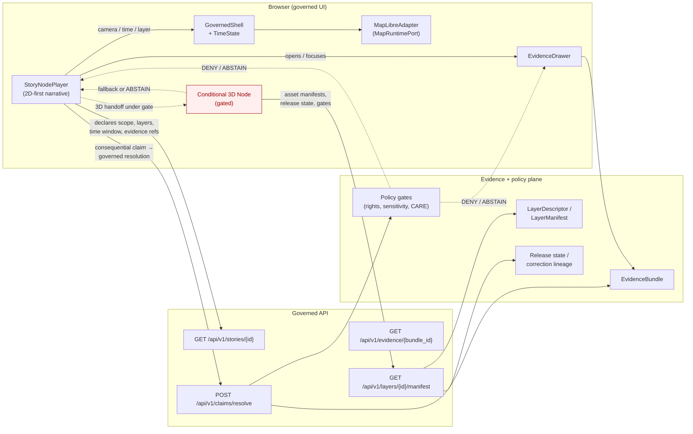

<!-- [KFM_META_BLOCK_V2]
doc_id: kfm://doc/architecture-story-continuity
title: Story Subsystem — Continuity Notes
type: standard
version: v1
status: draft
owners: Docs steward + Story subsystem owner (TODO: confirm CODEOWNERS)
created: 2026-05-14
updated: 2026-05-14
policy_label: public
related:
  - docs/architecture/story/README.md
  - docs/architecture/ui/CONTINUITY_NOTES.md
  - docs/architecture/governed-ai/CONTINUITY_NOTES.md
  - docs/registers/CANONICAL_LINEAGE_EXPLORATORY.md
  - docs/registers/DRIFT_REGISTER.md
  - docs/registers/VERIFICATION_BACKLOG.md
  - docs/adr/ADR-story-node-3d-boundary.md
  - contracts/OBJECT_MAP.md
  - schemas/contracts/v1/story/story_manifest.schema.json
  - schemas/contracts/v1/story/story_node.schema.json
  - tests/fixtures/story/README.md
  - policy/story/README.md
tags: [kfm, architecture, story, continuity, narrative, story-node, story-manifest, 3d, cesium]
notes:
  - All paths are PROPOSED until verified against mounted-repo evidence.
  - Filename CONTINUITY.md follows the user-supplied path; sibling subsystems use CONTINUITY_NOTES.md — reconcile via ADR or DRIFT_REGISTER entry.
[/KFM_META_BLOCK_V2] -->

# Story Subsystem — Continuity Notes

> How prior Story Node doctrine, conditional-3D posture, and PDF lineage are carried forward into the governed Story subsystem without being mistaken for mounted implementation.


| Status | Owners | Last reviewed |
|---|---|---|
| Draft (PROPOSED — repo not mounted in this session) | Docs steward + Story subsystem owner *(TODO: confirm CODEOWNERS)* | 2026-05-14 |

> [!IMPORTANT]
> This document is **lineage and design pressure**, not a description of mounted repo state. Every concrete path, schema name, route, fixture, or test name below is **PROPOSED** until verified against current repository evidence per Directory Rules §2.5 and the Whole-UI + Governed AI Expansion Report §10.

---

## Quick jump

1. [Scope](#1-scope)
2. [Authority and source basis](#2-authority-and-source-basis)
3. [Continuity classifications](#3-continuity-classifications)
4. [Narrative continuity invariants](#4-narrative-continuity-invariants)
5. [3D handoff continuity rule](#5-3d-handoff-continuity-rule)
6. [Prior gains carried forward](#6-prior-gains-carried-forward)
7. [Boundary diagram](#7-boundary-diagram)
8. [Schema, contract, and policy dependencies](#8-schema-contract-and-policy-dependencies)
9. [Update propagation](#9-update-propagation)
10. [Rollback path](#10-rollback-path)
11. [Anti-patterns](#11-anti-patterns)
12. [Verification backlog](#12-verification-backlog)
13. [Related docs](#13-related-docs)
14. [Appendix A — Source lineage](#appendix-a--source-lineage)
15. [Appendix B — PROPOSED file/folder anchors](#appendix-b--proposed-filefolder-anchors)

---

## 1. Scope

This document records the **continuity rules** for the Story Node subsystem: the narrative surface that links datasets, scenes, 2D maps, timeline frames, and AI-generated insights into governed, evidence-bearing narrative units.

It answers four questions:

- What prior Story Node material is **kept** and how is it framed forward?
- What is **deferred** (conditional 3D, Cesium runtime) and under what gate?
- What invariants must a Story Node preserve as it moves the user through camera, time, layers, and panels?
- What is the rollback target if Story routes, the StoryManifest schema, or 3D handoff destabilize evidence continuity?

It is **not** a route map, state-ownership doc, or boundary doc — those live as siblings under `docs/architecture/story/` *(PROPOSED)*. It also is **not** the StoryManifest schema definition; the canonical machine shape lives under `schemas/contracts/v1/story/` *(PROPOSED, per ADR-0001 schema-home convention).*

[↑ Back to top](#story-subsystem--continuity-notes)

---

## 2. Authority and source basis

Per the project's authority order *(KFM core invariants → accepted ADRs → Directory Rules → per-root READMEs → dossiers → mounted-repo convention)*, this document is **doctrine carried forward from indexed lineage**, not a description of current code. Its claims are bounded accordingly.

| Source class | Document | Role here |
|---|---|---|
| Doctrinal baseline | **Whole-UI + Governed AI Expansion Report** | Defines the Story Node design posture, schema-first approach, conditional 3D, and update-propagation matrix that names this continuity-notes file. |
| Doctrinal baseline | **Directory Rules** | Establishes the `docs/architecture/<subsystem>/` placement, the §15 README contract for sibling READMEs, and the schema-home convention `schemas/contracts/v1/<…>` per ADR-0001. |
| Lineage / design pressure | **Master MapLibre Components-Functions-Features (Pass 18, v1.5–v1.9 update packets)** | Provides the Story Node metadata model (spatial, temporal, entity, provenance, governance fields), assets-index discipline, hybrid 2D/3D handoff records, and version-lock semantics. |
| Lineage / design pressure | **Pass 18 Idea Index** | Records Story Nodes and preview renderers as evidence-bearing outputs tied to pinned styles, sources, cameras, renderer versions, and artifact digests. |
| Lineage / design pressure | **Unified Implementation Architecture Build Manual** | Anchors the schema-and-contract plan under which `StoryManifest` and `StoryNode` are PROPOSED. |

> [!NOTE]
> Repository state is **not** verified in this session. The repo is not mounted. Path, package, route, schema, fixture, test, workflow, and enforcement claims remain **PROPOSED / UNKNOWN** until inspected.

[↑ Back to top](#story-subsystem--continuity-notes)

---

## 3. Continuity classifications

Prior gains are not discarded. Each is classified by how it enters the next phase. The classifications mirror the Whole-UI Expansion Report's lineage table and remain PROPOSED design pressure for the Story subsystem until repo evidence ratifies them.

| Prior gain | Classification | Continuity behavior |
|---|---|---|
| Story Node concept (atomic narrative unit linking maps, scenes, timelines, AI insights) | **KEEP AND EXTEND** | Carry forward as governed surface. Define `StoryManifest` and `StoryNode` schemas before any runtime widening. |
| Conditional 3D / Cesium runtime | **DEFER** | 3D is conditional, not default spectacle. Add only after 2D evidence continuity, drawer continuity, release state, and policy gates are proven. |
| Hybrid MapLibre 2D + Cesium 3D Story Node pattern | **KEEP AS LINEAGE, DEFER RUNTIME** | Preserve the handoff design (2D → 3D → 2D) and return-to-timeline behavior; do not treat the prior demo as repo implementation. |
| Story Node metadata fields (spatial footprint, temporal interval, entities, provenance, citations, CARE, lineage, visualization links) | **KEEP AND EXTEND** | Fold into `StoryManifest`/`StoryNode` schema work; keep paths PROPOSED pending Directory Rules and repo verification. |
| Story Node version + lineage fields (`version`, `deprecated`, `predecessor`/`successor`/`latest`) | **KEEP AND EXTEND** | Required for reproducibility and version-locked Focus Mode flows. |
| Preview renderer / screenshot provenance as evidence carriers | **KEEP AND EXTEND** | Bind preview hashes, style digests, camera state, and renderer version into export and Story Node assets. |
| Assets-index discipline (every referenced asset has path, checksum, provenance, citations, CARE status, update timestamp) | **KEEP AS LINEAGE** | Adopt within Story manifest/sidecar validators when the schema lands. |
| Story Node 3D assets under `web/story_nodes/` vs `data/manifests/story/` *(prior conflicted location)* | **CONFLICTED LINEAGE** | Separate UI code/assets from data manifests; 3D runtime integration requires ADR (PROPOSED: `ADR-story-node-3d-boundary`). |
| Prior Story Node demo content and PDF screenshots | **LINEAGE ONLY** | Treat as historical evidence of intent, never as current implementation or release proof. |

[↑ Back to top](#story-subsystem--continuity-notes)

---

## 4. Narrative continuity invariants

A Story Node may move the user through camera, time, layers, and panels — but each transition is governed. The following invariants are **doctrinal** and survive every refactor unless an ADR explicitly bends them.

> [!IMPORTANT]
> A Story Node is a narrative chapter that **resolves to evidence**, not a guided scene. If evidence continuity cannot be preserved at any step, the node ABSTAINs or falls back to 2D rather than continuing.

### 4.1 Evidence continuity

- Every **consequential narrative claim** in a Story Node MUST resolve to an `EvidenceBundle` through one or more `EvidenceRef` entries — surfaced via the Evidence Drawer.
- A Story Node MUST NOT make a claim that depends only on rendered features, popups, screenshots, tile contents, graph projections, or AI-generated text. None of those is sovereign truth.
- A Story Node MAY carry **illustrative** assets (screenshots, captions, sketches), but illustrative content is labeled as such and never displaces drawer evidence.

### 4.2 Layer continuity

- A Story Node MUST declare its required layers as `LayerDescriptor` references with release state, valid-time semantics, sensitivity, rights, and source-role badges visible at point of use.
- Layer loading goes through the `MapRuntimePort` / `MapLibreAdapter` boundary. The Story player does not import MapLibre runtime APIs directly.
- A node MUST NOT silently swap an unreleased or quarantined layer in. If a required release-state layer is missing, the node returns a negative state.

### 4.3 Time continuity

- Each node declares a **time window** (`valid_time`, `observed_time`, and freshness expectations) consistent with the `TimeState` contract.
- Transitions between nodes update `TimeState` through the governed shell, not by directly mutating MapLibre internals.
- A Story Node operating under a **version lock** (per the Focus Mode reproducibility primitive) MUST freeze layer versions, disable auto-updating datasets, and emit a `version_locked` telemetry event when the lock engages.

### 4.4 Panel / drawer continuity

- The Evidence Drawer is the resolution surface. A Story Node may open, focus, or pre-populate the drawer, but it never authors drawer payload bypass paths.
- Drawer payloads conform to `EvidenceDrawerPayload` and surface negative drawer states (`evidence_missing`, `restricted`, `stale`, `conflict`, `invalid_payload`, `policy_denied`) explicitly.
- A Story Node does not re-rank evidence and does not synthesize new claims client-side.

### 4.5 Finite-outcome continuity

- Story Node transitions ride on the same finite outcome envelope as the rest of the governed UI: **ANSWER, ABSTAIN, DENY, ERROR**.
- `ABSTAIN` is used for insufficient evidence; `DENY` for policy; `ERROR` for system faults.
- Cancellation, timeout, stale evidence, restricted material, and invalid citation states render explicitly and are never collapsed into a generic failure or a "spinner that resolves to silence."

[↑ Back to top](#story-subsystem--continuity-notes)

---

## 5. 3D handoff continuity rule

3D is a **burden-bearing mode**, not the default. The 3D handoff exists to serve evidence, not the other way around.

> [!WARNING]
> If the 3D renderer cannot preserve evidence, release, drawer, and policy continuity, the node MUST fall back to 2D or ABSTAIN. There is no exception for cinematic value.

| Concern | Continuity requirement |
|---|---|
| Evidence resolution | EvidenceRef → EvidenceBundle resolution behaves identically in 3D and 2D. Drawer payloads are unchanged. |
| Release state | All 3D assets (terrain tilesets, geometry models, volumetric layers, camera paths, scene metadata) carry release state, checksums, STAC extensions, temporal anchors, and rollback targets. |
| Policy gates | Rights, sensitivity, sovereignty/CARE labels, source roles, and review state apply to 3D scenes exactly as to 2D layers. |
| Return path | A 3D node MUST have a defined return to the 2D MapLibre timeline. The default route is always preserved as the rollback route. |
| Asset standards | 3D Tiles, CZML, GLB/GLTF, and camera-path JSON are admitted only as **governed assets** — never as inline scene definitions sourced from the UI. |
| 3D-specific gates | Generalization, alt text, accessibility metadata, and conditional-3D gates apply before any 3D layer is loaded. |
| Failure posture | If a 3D scene cannot satisfy any of the above, the Story Node renders the 2D fallback or returns `ABSTAIN` with a visible reason code. |

The 3D handoff boundary is an ADR-level concern: PROPOSED home is `docs/adr/ADR-story-node-3d-boundary.md`.

[↑ Back to top](#story-subsystem--continuity-notes)

---

## 6. Prior gains carried forward

The Story subsystem inherits design pressure from several indexed lineage sources. Treat each as **doctrine and proposed design pressure** until repo evidence confirms or contradicts it.

<details>
<summary><strong>Lineage items (click to expand)</strong></summary>

- **Story Nodes unify narrative, spatial, temporal, provenance, and CARE metadata.** Story Nodes are explainable links between datasets, scenes, maps, timeline frames, and AI-generated insights, with spatial footprints, temporal coverage, provenance, citations, and CARE flags. *(Master MapLibre PDF, v1.6 update packet.)*
- **Story Nodes link directly to 2D maps, 3D scenes, and timeline frames.** Node structures include links to `map_2d`, `scene_3d`, and `timeline_frame` assets; Focus Mode may use them as narrative chapters and AI reference units. *(Master MapLibre PDF, v1.6 update packet.)*
- **Story Node schema needs version and lineage fields.** Additions include `version`, `deprecated`, and `predecessor`/`successor`/`latest` lineage references. *(Master MapLibre PDF, v1.6 update packet.)*
- **STAC versioning becomes a Focus Mode reproducibility primitive.** STAC version fields, predecessor/successor/latest links, lineage APIs, diffs, version locks, and telemetry are wired into Story Node and Focus Mode flows.
- **Story Nodes enforce context-only spatial disclosure for sensitive narratives.** Provenance, citations, and lineage are required, while precise site disclosure is avoided through context-only spatial footprints.
- **Story Node examples carry citations and dataset lineage**, reinforcing cite-or-abstain behavior for Focus Mode narrative cards.
- **Story Node assets root requires indexed maps, legends, overlays, 3D scenes, and thumbnails.** Every asset referenced by a Story Node must have an `assets_index` record with path, checksum, provenance, citations, CARE status, and update timestamp.
- **Story Nodes must reference cataloged checksum-inventoried Items.** No Story Node should cite a tile/scene as evidence without catalog/proof closure.
- **Story Nodes and Focus Mode consume preview evidence** — Evidence Drawer can link preview screenshot, style digest, and artifact digest. *(Master MapLibre PDF, v1.9 update packet.)*
- **LiDAR/GLO Story Nodes link STAC/DCAT, Neo4j, and document IDs.** Evidence Drawer payloads should include catalog, graph, and documentation references.
- **Story Node v3 and Focus Mode v3 require derived-layer evidence metadata** (`derived_layer_id`, QA status, PROV, policy notes).
- **Static maps and screenshots remain downstream carriers.** Focus Mode screenshots, static maps, and previews require checksums, provenance, alt text, and citations; they do not substitute for released evidence or citation-preserving exports.
- **Static map resolution minimum is an export quality gate** (e.g., minimum 2048 px width with sibling STAC metadata).
- **Preview renderer and Story Nodes as evidence-bearing outputs** tied to pinned styles, sources, cameras, renderer versions, and artifact digests. *(Pass 18 Idea Index, KFM-P18-INV-049.)*

</details>

[↑ Back to top](#story-subsystem--continuity-notes)

---

## 7. Boundary diagram

The diagram shows what a Story Node is allowed to touch and what it must route through governed surfaces. It reflects **doctrine**, not verified runtime wiring.

> [!NOTE]
> NEEDS VERIFICATION — diagram reflects the doctrinal Story subsystem boundary as described in the Whole-UI + Governed AI Expansion Report (§§17–19) and Master MapLibre PDF (Sections N, O, W). Adjust once the mounted repository's component tree, route map, and StoryManifest schema are verified.



The Story Node surface **never** reads RAW, WORK, QUARANTINE, canonical stores, graph stores, object stores, vector indexes, model runtimes, unpublished candidates, credentials, or internal service handles. *(Doctrine: Whole-UI + Governed AI Expansion Report §25.)*

[↑ Back to top](#story-subsystem--continuity-notes)

---

## 8. Schema, contract, and policy dependencies

Continuity depends on the underlying object families being defined, validated, and fixture-backed.

| Family | PROPOSED home | Role for Story continuity |
|---|---|---|
| `StoryManifest` | `schemas/contracts/v1/story/story_manifest.schema.json` | Story-level sequence, scope, required layers, time windows, drawer refs, optional 3D constraints, version/lineage fields. |
| `StoryNode` | `schemas/contracts/v1/story/story_node.schema.json` | Node-level camera/time/layer/evidence continuity and transition requirements. |
| `EvidenceDrawerPayload` | `schemas/contracts/v1/ui/evidence_drawer_payload.schema.json` | Drawer payload resolved by node-level evidence refs. |
| `EvidenceBundle` | `schemas/contracts/v1/evidence/evidence_bundle.schema.json` | Backing truth object for every consequential narrative claim. |
| `LayerDescriptor` / `LayerManifest` | `schemas/contracts/v1/layers/*.schema.json` | Layer admissibility, release state, integrity, valid-time, rights, sensitivity. |
| `DecisionEnvelope` / `RuntimeResponseEnvelope` | `schemas/contracts/v1/runtime/*.schema.json` | Finite ANSWER/ABSTAIN/DENY/ERROR outcome and governed response wrapper. |
| `CitationValidationReport` | `schemas/contracts/v1/focus/citation_validation_report.schema.json` | Used when Story Node content is consumed by Focus Mode synthesis. |
| Policy bundle | `policy/story/` | DENY / ABSTAIN cases for rights, sensitivity, CARE status, stale or missing evidence, and 3D-gate failures. |
| Story fixtures | `tests/fixtures/story/` | Contract-valid positive cases plus negative-state fixtures (`evidence_missing`, `restricted`, `stale`, `policy_denied`, 3D-fallback). |
| Object map crosswalk | `contracts/OBJECT_MAP.md` | Crosswalk from Story families to schemas, fixtures, policy, and emitted artifacts. |
| ADR | `docs/adr/ADR-story-node-3d-boundary.md` | Records the 3D handoff trust-boundary decision. |

> [!NOTE]
> All paths above are **PROPOSED** per Directory Rules §0. Per ADR-0001, the default schema-home convention is `schemas/contracts/v1/<…>`. If the mounted repo uses `contracts/v1/<…>` or another arrangement, raise a `docs/registers/DRIFT_REGISTER.md` entry and reconcile via ADR rather than silently mirroring.

[↑ Back to top](#story-subsystem--continuity-notes)

---

## 9. Update propagation

Material changes to Story Node behavior, schemas, or 3D handoff propagate per the Whole-UI + Governed AI Expansion Report's update-propagation matrix. This subsystem inherits the **`StoryManifest schema`** row:

| Owning README | Object map | Fixtures / tests | Runbook | Continuity notes | Rollback notes | Verification backlog |
|---|---|---|---|---|---|---|
| `docs/architecture/story/README.md` | `contracts/OBJECT_MAP.md` | `tests/fixtures/story` | `ui_VALIDATION` | **this document** (`docs/architecture/story/CONTINUITY.md`) | Disable story route | Track 3D conditionality |

When a Story-relevant schema, contract, policy bundle, or fixture set changes:

1. Update **this continuity file** with the lineage classification (KEEP / KEEP AND EXTEND / DEFER / CONFLICTED).
2. Update `docs/architecture/story/README.md` and any sibling architecture files affected.
3. Update `contracts/OBJECT_MAP.md` so the family crosswalk reflects the new shape and home.
4. Update or add fixtures under `tests/fixtures/story/`, including negative-state fixtures.
5. Update validators under `tools/validators/story/` *(PROPOSED)*.
6. Update the `ui_VALIDATION` runbook if validation steps change.
7. Open or update an ADR if a §2.4 Directory Rules condition is met (new canonical root, schema-home change, lifecycle phase change, parallel-home creation, invariant bend).
8. Add a `docs/registers/VERIFICATION_BACKLOG.md` entry for any UNKNOWN or NEEDS VERIFICATION item left after the PR.

[↑ Back to top](#story-subsystem--continuity-notes)

---

## 10. Rollback path

The Story subsystem rollback strategy mirrors the Whole-UI + Governed AI Expansion Report §26 doctrine: prefer the smallest reversible step that preserves trust.

```text
Story rollback (in order of preference):

1. Feature-flag the story route off in the governed shell.
2. Keep StoryManifest fixtures and schemas in catalog as DEFERRED;
   do not delete published manifests.
3. If a StoryManifest schema change has shipped, deprecate with a
   versioned successor rather than deleting silently.
4. If the 3D handoff destabilized continuity, disable the conditional-3D
   branch first; the 2D MapLibre fallback remains the default route.
5. Open a correction notice if any released Story Node referenced
   evidence that has since been corrected, redacted, or withdrawn.
6. Record the rollback in docs/registers/DRIFT_REGISTER.md and update
   docs/registers/VERIFICATION_BACKLOG.md with the residual unknowns.
```

> [!CAUTION]
> Do **not** rebuild Story routes around uncited or weakly supported claims as a recovery measure. ABSTAIN with a visible reason is always preferable to a confidently rendered Story Node lacking drawer evidence.

[↑ Back to top](#story-subsystem--continuity-notes)

---

## 11. Anti-patterns

Continuity is violated, not just degraded, when any of the following appear. Each is a drift candidate worthy of a `DRIFT_REGISTER` entry.

- Treating MapLibre features, tiles, screenshots, popups, STAC records, graph projections, or AI text as sovereign truth inside a Story Node.
- Letting a 3D scene become canonical truth or bypass the Evidence Drawer.
- Authoring a Story Node that fetches RAW/WORK/QUARANTINE, calls model runtimes directly, or reads canonical/internal stores from the browser.
- Routing a Story Node's consequential claim through a popup rather than `POST /api/v1/claims/resolve` and the Evidence Drawer.
- Using preview screenshots or generated illustrations as proof rather than as illustrative carriers with checksums, provenance, and citations.
- Loading 3D assets that lack release state, checksums, STAC extensions, temporal anchors, or rollback targets.
- Hiding sensitive geometry with a style filter rather than a policy gate.
- Allowing Focus Mode "version lock" to be silently broken by a Story transition.
- Promoting a Story demo or prior-pass PDF screenshot as if it were a mounted, released subsystem.

[↑ Back to top](#story-subsystem--continuity-notes)

---

## 12. Verification backlog

These items are **explicitly open** and should be tracked in `docs/registers/VERIFICATION_BACKLOG.md` until resolved.

| ID | Item | Label |
|---|---|---|
| STORY-CONT-001 | Verify whether the mounted repo already contains a Story subsystem app surface, route, or fixtures. | UNKNOWN |
| STORY-CONT-002 | Verify the canonical schema-home location for `StoryManifest` and `StoryNode` against ADR-0001 and any divergent repo state. | NEEDS VERIFICATION |
| STORY-CONT-003 | Reconcile the filename `CONTINUITY.md` (used here) with the propagation-matrix label `story/CONTINUITY_NOTES.md` and sibling-subsystem files (`ui/CONTINUITY_NOTES.md`, `governed-ai/CONTINUITY_NOTES.md`). | NEEDS VERIFICATION |
| STORY-CONT-004 | Verify whether `policy/story/` exists as a policy lane or whether Story policy lives inside a broader UI/evidence bundle. | UNKNOWN |
| STORY-CONT-005 | Confirm acceptance of `ADR-story-node-3d-boundary` and that it explicitly governs the 3D conditional-handoff continuity rule. | NEEDS VERIFICATION |
| STORY-CONT-006 | Confirm whether prior Story Node 3D assets actually existed under `web/story_nodes/` (CONFLICTED lineage) or whether this is purely documentary. | UNKNOWN |
| STORY-CONT-007 | Verify Story export paths and screenshot quality gates (e.g., minimum 2048 px width, sibling STAC metadata) against current export tooling. | NEEDS VERIFICATION |
| STORY-CONT-008 | Open a public-story preview-render-receipt decision: should every public Story Node ship with a preview-render receipt? *(See KFM-P18-INV-049.)* | OPEN |

[↑ Back to top](#story-subsystem--continuity-notes)

---

## 13. Related docs

These links are **PROPOSED** relative paths consistent with the Whole-UI + Governed AI Expansion Report's path-by-path change table; they assume the file lives at `docs/architecture/story/CONTINUITY.md`.

- [`../story/README.md`](./README.md) — Story subsystem overview *(PROPOSED).*
- [`../ui/CONTINUITY_NOTES.md`](../ui/CONTINUITY_NOTES.md) — UI subsystem continuity *(PROPOSED).*
- [`../governed-ai/CONTINUITY_NOTES.md`](../governed-ai/CONTINUITY_NOTES.md) — Governed AI continuity *(PROPOSED).*
- [`../review/README.md`](../review/README.md) — Review/steward surface *(PROPOSED).*
- [`../../adr/ADR-story-node-3d-boundary.md`](../../adr/ADR-story-node-3d-boundary.md) — 3D handoff boundary ADR *(PROPOSED).*
- [`../../adr/ADR-0001-schema-home.md`](../../adr/ADR-0001-schema-home.md) — Schema-home convention.
- [`../../doctrine/directory-rules.md`](../../doctrine/directory-rules.md) — Directory Rules (placement law).
- [`../../registers/CANONICAL_LINEAGE_EXPLORATORY.md`](../../registers/CANONICAL_LINEAGE_EXPLORATORY.md) — Canon vs lineage vs exploratory register *(PROPOSED).*
- [`../../registers/DRIFT_REGISTER.md`](../../registers/DRIFT_REGISTER.md) — Drift register *(PROPOSED).*
- [`../../registers/VERIFICATION_BACKLOG.md`](../../registers/VERIFICATION_BACKLOG.md) — Open verification items *(PROPOSED).*

[↑ Back to top](#story-subsystem--continuity-notes)

---

## Appendix A — Source lineage

<details>
<summary><strong>Indexed source documents that anchor this file (click to expand)</strong></summary>

- **KFM Whole-UI + Governed AI Expansion Report** — §§5 (lineage classification table), 7 (whole-UI expansion map), 8 (proposed architecture and increment sequence), 11 (required next files), 17 (routes and component families), 19 (Evidence Drawer / Focus Mode / Story Node / review plan), 24 (update-propagation matrix), 25 (security and governed-AI boundary), 26 (rollback path), 29 (Appendix A file/folder tree), 30 (Appendix B path-by-path change table). **Doctrinal baseline.**
- **Directory Rules** — §0 (status and authority), §2 (authority order and ADR triggers), §3 (root-folder responsibilities), §6 (`docs/` control plane), §7.4 (schema-home convention), §13 (drift patterns), §14 (migration discipline), §15 (README contract for sibling READMEs), §18 (open verification items).
- **Master MapLibre Components-Functions-Features** — Section N (Evidence Drawer payloads and click resolution), Section O (Focus Mode and governed AI map context), Section W (3D / Cesium / Deck.gl / Overlay interoperability), v1.5–v1.6 update packets (Story Node metadata, version/lineage fields, hybrid 2D/3D handoff), v1.9 update packet (preview evidence, derived-layer metadata, export quality gates).
- **KFM Pass 18 Idea Index / Category Atlas** — KFM-P18-INV-049 (preview renderer and Story Nodes as evidence-bearing outputs), KFM-P18-INV-063 (bitemporal claim history) for the Story version-lock posture.
- **KFM Unified Implementation Architecture Build Manual** — §§9–10 (repository architecture plan and schema-and-contract plan), §14 (UI, MapLibre, Evidence Drawer, Focus Mode), §15 (governed AI architecture).

</details>

[↑ Back to top](#story-subsystem--continuity-notes)

---

## Appendix B — PROPOSED file/folder anchors

PROPOSED relative anchors used throughout this file. Treat as design pressure, not as verified repo state.

```text
docs/
  architecture/
    story/
      README.md                # subsystem overview (PROPOSED)
      CONTINUITY.md            # this file
      # sibling subsystems use CONTINUITY_NOTES.md — reconcile via ADR
    ui/
      CONTINUITY_NOTES.md      # PROPOSED
    governed-ai/
      CONTINUITY_NOTES.md      # PROPOSED
    review/
      README.md                # PROPOSED
  adr/
    ADR-story-node-3d-boundary.md   # PROPOSED
    ADR-0001-schema-home.md         # referenced
  registers/
    CANONICAL_LINEAGE_EXPLORATORY.md  # PROPOSED
    DRIFT_REGISTER.md                 # PROPOSED
    VERIFICATION_BACKLOG.md           # PROPOSED
  doctrine/
    directory-rules.md                # canonical doctrine

contracts/
  OBJECT_MAP.md                       # PROPOSED crosswalk

schemas/
  contracts/
    v1/
      story/
        story_manifest.schema.json    # PROPOSED
        story_node.schema.json        # PROPOSED
      ui/
        evidence_drawer_payload.schema.json  # PROPOSED
      runtime/
        decision_envelope.schema.json        # PROPOSED
        runtime_response_envelope.schema.json # PROPOSED
      layers/
        layer_descriptor.schema.json         # PROPOSED
        layer_manifest.schema.json           # PROPOSED
      evidence/
        evidence_bundle.schema.json          # PROPOSED
      focus/
        citation_validation_report.schema.json # PROPOSED

policy/
  story/                                # PROPOSED policy lane

tests/
  fixtures/
    story/                              # PROPOSED, includes negative-state fixtures

tools/
  validators/
    story/                              # PROPOSED
```

[↑ Back to top](#story-subsystem--continuity-notes)

---

**Related docs:** [`README.md`](./README.md) · [`../ui/CONTINUITY_NOTES.md`](../ui/CONTINUITY_NOTES.md) · [`../governed-ai/CONTINUITY_NOTES.md`](../governed-ai/CONTINUITY_NOTES.md) · [`../../doctrine/directory-rules.md`](../../doctrine/directory-rules.md) · [`../../adr/ADR-story-node-3d-boundary.md`](../../adr/ADR-story-node-3d-boundary.md)

**Last updated:** 2026-05-14 · **Authority:** doctrine carried forward (PROPOSED for repo state) · [↑ Back to top](#story-subsystem--continuity-notes)
