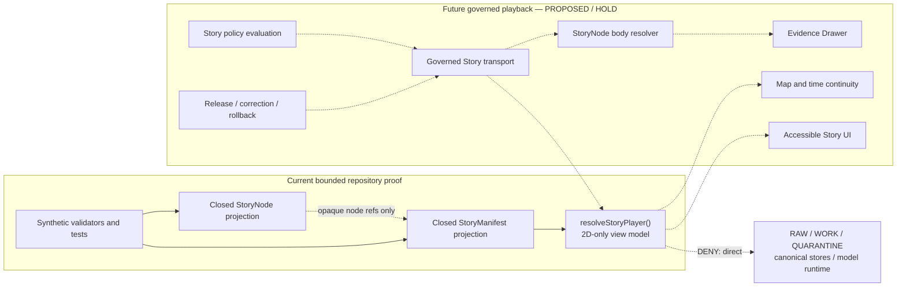

<!-- [KFM_META_BLOCK_V2]
doc_id: kfm://doc/architecture-story-continuity
title: Story Subsystem — Continuity Notes
type: architecture-reference
version: v2.0.0
prior_version: v1
status: draft; repository-grounded; implementation-partial; projection-only; no-live-story-route; no-publication
owners:
  - "@bartytime4life — verified CODEOWNERS review route"
  - "Story, UI, evidence, policy, release, accessibility, security, and independent-review stewardship NEEDS VERIFICATION"
created: 2026-05-14
updated: 2026-08-19
policy_label: public
owning_root: docs/
current_path: docs/architecture/story/CONTINUITY.md
responsibility: >-
  Explain which Story lineage is retained, which repository-present public-safe
  projection and player slices now exist, which continuity obligations remain
  unimplemented, and how Story changes graduate, correct, or roll back without
  creating truth, policy, review, release, deployment, or publication authority.
truth_posture: >-
  CONFIRMED commit-pinned Story contracts, schemas, synthetic fixtures,
  validators, workflows, app-local consumer, policy stub, route absence, and
  active document consumers; PROPOSED future governed playback and integration;
  UNKNOWN deployed behavior and operational release; cite-or-abstain.
evidence_snapshot:
  repository: bartytime4life/Kansas-Frontier-Matrix
  base_ref: main
  base_commit: d639f9ff40288d12244cd7bc84af538652f6dfb1
  target_prior_blob: 37ead349bfe0c0ec77634d8c77197dfe4849362c
  story_readme_blob: e5b22c5ad324dfbbd4482ca4da0c854e1bc46260
  story_player_architecture_blob: 526d4e0500b686f18a05426059471d5f6cc65b69
  ui_continuity_blob: 2bc35905935d289fc4a7c9548ed03f0e10ebb7ab
  directory_rules_blob: fd49a0b83e55cef52c1124281f093e263526898d
  adr_0029_blob: a4de0d7a96b78da59cfc499d1025e1508afd8dd9
  adr_index_blob: 419ebd60db28404edb0d363125c85f6f15deaec0
  codeowners_blob: dd2a84aa514d8ecd9208bc347f90f9a2ed37dd61
  story_manifest_contract_blob: e0365d00a36f1aef57ed7dd1a051b4c70dec09b2
  story_node_contract_blob: 694cbe4833d785f25f55f3def2b8fdfad7b98b78
  story_manifest_schema_blob: 67fa2fae5534ffc7a277fae8adfcb9afb81e9fc0
  story_node_schema_blob: fd2e40bb8a5167bb592dbb9c42e0219565bf4b48
  story_manifest_fixture_blob: 98e1ce24cacae42a19134c45ed3158a724282684
  story_manifest_workflow_blob: 6ef97ac0adb3207d92ed8e421a022e578825ce7d
  story_node_workflow_blob: 8e30f4ceee7dac109a1e53b2aba00281c9721bfd
  story_player_entry_blob: 6c3b3e63b28027e9f21f859beed791e2dd16879d
  story_player_test_blob: 54195d2676ca6f125b8c661c5c52c3adb4c2b16a
  story_player_current_implementation_blob: 7566f69f0a7ff87b461b54098fb00f0c41deed63
  story_policy_readme_blob: 2de5f876fdbd481254d493e967613c4ba2a7647d
  story_policy_stub_blob: 9f3791db0da8a91ef3d10c7152fc738eb53139c3
  noncanonical_story_manifest_lane_blob: d602f7438dd8c3a56d64164962acfe3c33a7841b
  open_pull_requests_touching_target_at_preflight: 0
related:
  - README.md
  - ../ui/STORY_PLAYER.md
  - ../ui/CONTINUITY_NOTES.md
  - ../ui/EVIDENCE_DRAWER.md
  - ../ui/MAP_RUNTIME_BOUNDARY.md
  - ../document-convergence-plan.md
  - ../../adr/ADR-0006-maplibre-boundary--only-maplibreadapter-imports-maplibre.md
  - "docs/adr/ADR-0007 — MapLibre GL JS Is the Sole Browser-Side Renderer.md"
  - ../../adr/ADR-0029-adopt-directory-governance-standard-v2.md
  - ../../adr/INDEX.md
  - ../../doctrine/directory-rules.md
  - ../../../contracts/ui/story_manifest.md
  - ../../../contracts/ui/story_node.md
  - ../../../schemas/contracts/v1/ui/story_manifest.schema.json
  - ../../../schemas/contracts/v1/ui/story_node.schema.json
  - ../../../fixtures/ui/story_manifest/cases.json
  - ../../../tools/validators/ui/validate_story_manifest.py
  - ../../../tools/validators/ui/validate_story_node.py
  - ../../../apps/explorer-web/src/features/story_player/current-implementation.md
  - ../../../apps/explorer-web/src/features/story_player/index.tsx
  - ../../../apps/explorer-web/tests/story-player.test.ts
  - ../../../policy/story/README.md
  - ../../../data/manifests/story/README.md
tags:
  - kfm
  - architecture
  - story
  - continuity
  - story-manifest
  - story-node
  - story-player
  - evidence
  - finite-outcomes
  - correction
  - 2d-only
notes:
  - "Same-path documentation modernization only; no move, rename, alias, contract, schema, policy, code, workflow, data, release, deployment, or publication transition."
  - "The current executable Story surface is a closed synthetic public-safe projection family plus a defensive 2D-only app-local consumer of an already-governed StoryManifest."
  - "No Story API route, StoryNode body dereference, EvidenceBundle resolution, Story policy evaluation, map/time/Drawer composition, renderer execution, 3D handoff, release, deployment, or publication is established."
  - "The former story-specific schema and fixture paths are replaced by confirmed UI-family homes; data/manifests/story remains non-canonical compatibility documentation."
  - "Legacy major-section anchors are preserved."
[/KFM_META_BLOCK_V2] -->

<a id="top"></a>
<a id="story-subsystem--continuity-notes"></a>

# Story Subsystem — Continuity Notes

> **Operating rule.** Story continuity is the survival of evidence, finite outcome,
> public-safe trust posture, correction lineage, and accessibility context across
> narrative ordering. Story order, polished prose, map state, screenshots, motion,
> or a `canPlay` flag never creates authority.

[](#current-repository-checkpoint)
[](#3-continuity-classifications)
[](#4-narrative-continuity-invariants)
[](#7-boundary-diagram)
[](#8-schema-contract-and-policy-dependencies)
[](#5-3d-handoff-continuity-rule)
[](#current-repository-checkpoint)

> [!IMPORTANT]
> **Current implementation is narrower than the prior continuity prose.** KFM
> has closed, synthetic, public-safe `StoryNode` and `StoryManifest` projection
> profiles and a deterministic app-local function that converts one
> already-governed `StoryManifest` into a fail-closed 2D view model. It does not
> fetch a story, dereference node bodies, resolve evidence, execute policy,
> render a map, expose a Story route, release a Story artifact, or publish
> narrative truth.

> [!CAUTION]
> **Continuity cannot upgrade trust.** A composite Story inherits the
> least-permissive constituent posture. Missing, stale, unreleased, restricted,
> superseded, malformed, or errored support withholds playback through
> `ABSTAIN`, `DENY`, or `ERROR`; it is never repaired by narrative fluency.

## Current repository checkpoint

| Field | Current bounded result |
|---|---|
| **Evidence snapshot** | `main@d639f9ff40288d12244cd7bc84af538652f6dfb1` |
| **Tracked path** | `docs/architecture/story/CONTINUITY.md` |
| **Owning root** | `docs/` — human-readable cross-root architecture explanation |
| **Placement authority** | Accepted [`ADR-0029`](../../adr/ADR-0029-adopt-directory-governance-standard-v2.md) and the adopted [`Directory Rules v2`](../../doctrine/directory-rules.md) |
| **Same-path result** | `PLACE` for this update: the path already exists, has five non-self repository consumers, and remains the Story continuity explanation |
| **Structural disposition** | No move or rename. The earlier convergence-plan `HOLD` on possible history-lane migration is not silently resolved by this content update |
| **Current Story object proof** | Closed synthetic UI-family `StoryNode` and `StoryManifest` projections with contracts, schemas, fixtures, validators, tests, and focused no-network workflows |
| **Current app proof** | `resolveStoryPlayer()` defensively consumes one already-governed StoryManifest and emits a non-authoritative, 2D-only `StoryPlayerProjection` |
| **Current live playback** | Not established; no transport, call-site composition beyond focused tests, node-body resolver, browser route, map, time, Drawer, or telemetry integration |
| **Current Story policy** | `policy/story/` exists, but its Rego file is a non-enforcing proposal stub |
| **Current Story API** | No Story route appears in the inspected direct Governed API route directory |
| **Current renderer / 3D** | No renderer or Story-specific 3D decision is accepted; the current consumer is fixed to `mode: "2D"` and its test prohibits renderer imports |
| **Release / publication** | None established |
| **Review route** | `.github/CODEOWNERS` routes review to `@bartytime4life`; specialist stewardship and independent review remain **NEEDS VERIFICATION** |
| **Change effect** | Documentation only |

### Truth labels used here

- **CONFIRMED** — exact repository bytes, accepted ADR-0029, current file or
  directory presence, or bounded executable behavior visible in current code and
  tests.
- **PROPOSED** — future Story transport, playback, integration, policy, release,
  export, renderer, or 3D behavior not established by the current evidence.
- **UNKNOWN** — deployed behavior, external consumers, or operational state not
  observable from the inspected repository surfaces.
- **NEEDS VERIFICATION** — a concrete owner, decision, check, integration test,
  runtime trace, release record, or public probe remains.

## Quick jump

1. [Scope](#1-scope)
2. [Authority and source basis](#2-authority-and-source-basis)
3. [Continuity classifications](#3-continuity-classifications)
4. [Narrative continuity invariants](#4-narrative-continuity-invariants)
5. [3D handoff continuity rule](#5-3d-handoff-continuity-rule)
6. [Prior gains carried forward](#6-prior-gains-carried-forward)
7. [Boundary diagram](#7-boundary-diagram)
8. [Schema, contract, and policy dependencies](#8-schema-contract-and-policy-dependencies)
9. [Update propagation](#9-update-propagation)
10. [Rollback path](#10-rollback-path)
11. [Anti-patterns](#11-anti-patterns)
12. [Verification backlog](#12-verification-backlog)
13. [Related docs](#13-related-docs)
14. [Appendix A — Source lineage](#appendix-a--source-lineage)
15. [Appendix B — Current file and folder anchors](#appendix-b--proposed-filefolder-anchors)
16. [Appendix C — No-loss modernization ledger](#appendix-c--no-loss-modernization-ledger)

---

<a id="1-scope"></a>

## 1. Scope

This document owns the **continuity and lineage explanation** for the Story
subsystem. It answers:

1. Which prior Story design gains remain useful?
2. Which bounded Story profiles and consumer behavior are now present?
3. Which continuity obligations remain unimplemented or held?
4. How must a material Story change propagate, fail closed, correct, and roll
   back?

### In scope

- the current UI-family `StoryNode` and `StoryManifest` projection profiles;
- their least-permissive trust inheritance and finite outcomes;
- the current app-local `resolveStoryPlayer()` consumer;
- evidence, citation, rights, sensitivity, review, release, freshness,
  correction, and supersession continuity;
- lineage from older Story, screenshot, preview, map, timeline, and 3D ideas;
- current placement drift and authority boundaries;
- dependency-ordered graduation and rollback.

### Out of scope

This file does not:

- define a Story contract or JSON Schema;
- execute policy or evidence resolution;
- define a public Story API route;
- implement browser playback, map/time state, the Evidence Drawer, telemetry,
  export, renderer, or 3D behavior;
- accept an ADR or decide renderer/package ownership;
- approve a Story release, correction, withdrawal, rollback, deployment, or
  publication.

### Relationship to sibling pages

| Page | Responsibility |
|---|---|
| [`README.md`](./README.md) | Story subsystem architecture landing page and maturity overview |
| [`../ui/STORY_PLAYER.md`](../ui/STORY_PLAYER.md) | Current Story Player UI architecture and app-consumer boundary |
| [`../ui/CONTINUITY_NOTES.md`](../ui/CONTINUITY_NOTES.md) | Cross-surface UI continuity, including map, Drawer, Focus, Story, export, and release transitions |
| This page | Story-specific lineage, retained invariants, current/future classification, propagation, and rollback |

[Back to top](#top)

---

<a id="2-authority-and-source-basis"></a>

## 2. Authority and source basis

### Authority order

1. KFM trust, lifecycle, evidence, public-boundary, correction, and rollback
   invariants.
2. Accepted, unsuperseded ADRs within their scope.
3. Adopted Directory Rules for placement.
4. Contracts, schemas, policy, current code/configuration, tests/workflows,
   receipts/proofs, and release records for their owned questions.
5. Current commit-pinned repository evidence.
6. This explanatory document.
7. Older manuals, atlases, packets, screenshots, and prior proposals as lineage.

Only `ADR-0029` is accepted in the current numbered ADR index. Renderer,
MapLibre-boundary, schema-home, receipt/catalog separation, and other numbered
ADRs remain proposed unless their source records and index later change.

### Directory Rules basis

The artifact is a human architecture explanation under `docs/`. It defines no
machine shape, policy rule, data instance, release decision, or executable
behavior. The existing path is therefore placement-safe for a same-path content
update.

**Placement outcome for this change: `PLACE`.** The content update does not
resolve the architecture-convergence plan's separate structural `HOLD`; a future
move or retirement would still require identity, inbound-link, no-loss,
consumer, destination, validation, compatibility, and rollback closure.

### Evidence basis

| Evidence family | What it supports | Limit |
|---|---|---|
| Story contracts and schemas | Exact bounded projection meaning and shape | Contract status remains proposed; no ref resolution or runtime authority |
| Synthetic fixtures, validators, tests, workflows | Deterministic local conformance, finite trust inheritance, identity, correction, and anti-bypass expectations | File and workflow presence is not live playback, policy, release, or publication |
| App-local Story source and test | Exact `resolveStoryPlayer()` behavior, 2D-only output, negative states, and prohibited seams | No external call site, transport, route, map, body dereference, or deployment |
| Story policy README and Rego source | Policy boundary exists and currently does not enforce Story evidence continuity | No accepted input/output contract, evaluator, native tests, decision record, or consumer |
| Governed API route inventory | No Story route is present in the direct inspected route directory | Does not prove an external or uninspected deployment has no route |
| Story architecture and UI continuity docs | Current explanatory boundaries and maturity distinctions | Documentation does not prove behavior |
| Historical KFM manuals and atlases | Story, preview, screenshot, map/time, correction, accessibility, and conditional-3D design pressure | Lineage does not create current implementation or authority |

### Current conflict rule

When old Story prose conflicts with current repository bytes, current behavior
claims follow current code, contracts, schemas, and tests. Unique historical
intent remains visible as lineage, but it does not override the current boundary.

[Back to top](#top)

---

<a id="3-continuity-classifications"></a>

## 3. Continuity classifications

| Story surface or prior gain | Current classification | Continuity treatment |
|---|---|---|
| Public-safe `StoryNode` projection | **CONFIRMED bounded implementation / contract status PROPOSED** | Keep. It carries finite state, public-safe text, governed references, trust posture, correction/supersession, and fixed non-authority flags. |
| Public-safe `StoryManifest` composite | **CONFIRMED bounded implementation / contract status PROPOSED** | Keep. It orders bounded node snapshots and reduces every trust dimension to the least-permissive constituent posture. |
| Story Player projection consumer | **CONFIRMED bounded implementation** | Keep and extend only through dependency-closed slices. It converts one already-governed manifest into a non-authoritative 2D view model. |
| Story Player live route and transport | **NOT ESTABLISHED / PROPOSED** | Hold until a governed route, response contract, authorization, safe transport, and negative cases are implemented. |
| StoryNode body dereference | **NOT ESTABLISHED / PROPOSED** | Hold. Current manifest constituents are opaque bounded references; the player does not fetch or expose node bodies. |
| Evidence Drawer, map, and time continuity | **PROPOSED / NEEDS VERIFICATION** | Preserve as graduation obligations. No current Story call site composes these surfaces. |
| Story policy | **CONFIRMED lane / non-enforcing implementation** | Keep the policy boundary, but do not claim evidence-continuity enforcement until a versioned input/output contract, evaluator, tests, and governed consumer exist. |
| 2D posture | **CONFIRMED current consumer behavior** | Keep. `mode` is fixed to `"2D"` and the focused app test rejects MapLibre, Cesium, model-client, transport, internal-store, and mutation seams. |
| Conditional 3D / prior Cesium handoff | **LINEAGE / HOLD** | Preserve the continuity burden, not a runtime promise. No Story-specific 3D ADR exists at the formerly linked path, and renderer ADRs remain proposed. |
| Story schemas under `schemas/contracts/v1/story/` | **STALE CURRENT-PATH CLAIM** | Replace with the confirmed UI-family schema homes. Do not create a mirror or second writable authority. |
| Story fixtures under `tests/fixtures/story/` | **STALE CURRENT-PATH CLAIM** | Current reusable fixture homes are under `fixtures/ui/story_manifest/` and `fixtures/ui/story_node/`; tests live under their current test lanes. |
| `data/manifests/story/` as StoryManifest authority | **NON-CANONICAL COMPATIBILITY** | Do not write new Story projection or release authority there. The lane is a routing and retirement boundary only. |
| Preview renders, screenshots, asset indexes, camera paths, and export receipts | **LINEAGE / PROPOSED** | Retain as future integrity and accessibility obligations; no current public Story export or preview-receipt requirement is established. |
| Prior Story demos and PDF screenshots | **LINEAGE ONLY** | Preserve as historical intent, never as implementation, evidence, review, release, or publication proof. |

### Architecture, projection proof, playback, and release remain distinct

| State | Current result |
|---|---|
| Architecture explanation | **CONFIRMED present** |
| Synthetic projection profiles | **CONFIRMED executable; semantic status remains PROPOSED** |
| App-local manifest consumer | **CONFIRMED executable** |
| Live Story playback | **NOT ESTABLISHED** |
| Governed Story release | **NONE ESTABLISHED** |

[Back to top](#top)

---

<a id="4-narrative-continuity-invariants"></a>

## 4. Narrative continuity invariants

### 4.1 Story order cannot create authority

- `StoryManifest.constituents` defines presentation order only.
- Narrative sequence cannot re-rank evidence or make a weaker node authoritative.
- The effective Story posture is the least-permissive constituent state and
  dimensionwise trust posture.
- Limiting node references and reason codes remain visible.

### 4.2 Evidence and citation continuity

- A `READY / ANSWER` projection requires non-empty evidence-bundle and
  citation-validation references.
- Current validation treats those references as opaque identifiers; it does not
  prove that they resolve or that citations are true.
- Future playback must resolve support through the Governed API and must fail
  closed if a reference is missing, stale, mismatched, restricted, or
  superseded.
- Story prose, a screenshot, map pixel, tile, graph edge, search hit, or model
  answer cannot replace that support.

### 4.3 Rights, sensitivity, policy, review, and release continuity

Playback is eligible only when the current manifest declares:

```text
rights      = CLEARED
sensitivity = PUBLIC
policy      = ALLOW
review      = REVIEWED
release     = RELEASED
freshness   = CURRENT
correction  != SUPERSEDED
```

Generalized, unresolved, restricted, pending, stale, unreleased, withdrawn, or
superseded states cannot become `READY / ANSWER` through client logic.

> [!NOTE]
> These are the current player consumer's declared eligibility checks over an
> already-governed projection. They are not a substitute for authoritative
> policy, review, release, evidence, or correction evaluation.

### 4.4 Finite-outcome continuity

| Input posture | Current consumer output | Playback |
|---|---|---|
| Fully public-safe `READY / ANSWER` | `ANSWER / STORY_READY` | Ordered node refs exposed |
| Stale, unreleased, partial, abstained, or superseded | `ABSTAIN / STORY_ABSTAINED` | Withheld |
| Blocked rights, sensitivity, or explicit denial | `DENY / STORY_DENIED` | Withheld |
| Upstream or malformed profile error | `ERROR / STORY_ERROR` or `INVALID_PAYLOAD` | Withheld |
| No governed projection | `ABSTAIN / NO_GOVERNED_RESPONSE` | Withheld |

The consumer does not silently coerce a negative state into playback.

### 4.5 Closed-profile and non-leakage continuity

- `authoritative` must be `false` and `projection_only` must be `true`.
- Unknown fields, malformed flags, duplicate node references, or unsorted
  constituents fail closed.
- The focused test injects an untrusted-body canary and verifies that invalid
  content is not reflected into the output.
- Blocked and errored postures must not expose protected body or support
  material.

### 4.6 Correction and supersession continuity

- Corrected and superseded postures retain governed correction references where
  the profile requires them.
- A superseded manifest cannot play and may expose only its public-safe
  replacement-manifest reference and note.
- A replacement is validated independently; trust does not transfer silently.
- Future caches, routes, exports, search, maps, and AI surfaces must propagate
  correction and withdrawal state before public use.

### 4.7 Identity and deterministic replay continuity

- Current Story profiles use closed shapes and deterministic identity rules.
- Constituent and governed-reference arrays are duplicate-safe and ordered where
  required.
- A replay mismatch is an error, not a new Story version.
- The client consumer must not recompute authority or rewrite upstream identity.

### 4.8 Accessibility continuity

Current projection fields include public-safe accessibility summaries or labels.
That is necessary but insufficient for playback. Future UI composition must also
prove keyboard operation, focus return, reduced motion, pause/stop controls,
finite-outcome announcement, non-map alternatives, and safe denial/error copy.

- Current code does not establish those interactive behaviors.

### 4.9 Map, time, and Evidence Drawer continuity

These are **graduation obligations**, not current implementation claims:

- a Story transition must preserve released layer identity and time scope;
- evidence inspection must use the governed Evidence Drawer path;
- browser-local camera and panel state must remain distinct from authority;
- missing evidence, policy, release, or correction support must fail closed;
- a Story route must not read canonical or lifecycle stores directly.

[Back to top](#top)

---

<a id="5-3d-handoff-continuity-rule"></a>

## 5. 3D handoff continuity rule

**Current result: HOLD.** The repository proves no Story 3D handoff. The current
consumer emits `mode: "2D"`, and its focused test prohibits MapLibre, Cesium,
model-client, transport, internal-store, and publication seams.

The previous edition linked a proposed
`docs/adr/ADR-story-node-3d-boundary.md`; that path is absent at the current
snapshot. This update removes the broken authority claim rather than inventing
an ADR.

Renderer-related ADR-0006 and ADR-0007 remain proposed. Therefore this page
does not select MapLibre, Cesium, another renderer, a plugin set, a package
home, or a 3D asset profile.

### Minimum future admission burden

A later 3D Story slice must close all of the following before it can move from
`HOLD`:

| Concern | Required evidence |
|---|---|
| Renderer authority | Accepted renderer and adapter decisions with one accountable implementation boundary |
| Evidence parity | The same consequential claim resolves to the same admissible evidence in 2D and 3D |
| Asset identity | Content-addressed, versioned, provenance-linked 3D assets and camera/view state |
| Rights and sensitivity | Redaction, generalization, consent/sovereignty, and harmful-precision policy before delivery |
| Reality boundary | Visible distinction among observation, reconstruction, model, scenario, and illustration |
| Accessibility | Equivalent non-3D route, keyboard controls, reduced motion, descriptions, and alternate content |
| Runtime safety | Plugin/dependency admission, CSP/CORS, resource budgets, safe errors, and no direct internal-store path |
| Release parity | Release, correction, withdrawal, supersession, cache invalidation, and rollback behavior for every asset |
| Negative cases | Missing evidence, denied policy, stale assets, invalid digest, unsupported renderer, and fallback behavior |

A cinematic or technically successful scene does not satisfy these gates.

[Back to top](#top)

---

<a id="6-prior-gains-carried-forward"></a>

## 6. Prior gains carried forward

Historical Story material still supplies useful design pressure when clearly
separated from current implementation.

### Keep and ground in current evidence

- Story is an evidence-dependent ordered projection, not narrative truth.
- StoryNode and StoryManifest need stable identity, finite outcomes, public-safe
  display fields, support references, trust posture, correction, and
  supersession.
- Composite Story trust is limited by its least-permissive constituent.
- Static maps, screenshots, previews, 3D scenes, timelines, and AI summaries are
  downstream carriers.
- Public Story content needs visible caveats and accessibility context.
- Story release and correction must remain separate from playback code.

### Retain as future obligations

- map, time, layer, Evidence Drawer, Focus, and export continuity;
- deterministic preview or export receipts;
- Story assets with identity, checksum, provenance, citations, rights,
  sensitivity, and release linkage;
- version lock and reproducible playback;
- public-safe correction and replacement notices;
- non-map and reduced-motion presentation;
- conditional 3D with evidence and release parity.

### Retire as current claims

| Prior claim | Current correction |
|---|---|
| Repository state is unverified because no repo is mounted | Current repository evidence is available and pinned in this document |
| Story schemas belong under `schemas/contracts/v1/story/` | **Corrected for the current executable profile** to `schemas/contracts/v1/ui/` |
| Story fixtures belong under `tests/fixtures/story/` | Reusable Story projection fixtures currently live under `fixtures/ui/`; validator/app tests remain in their verified test lanes |
| A Story route exists or is named by this document | No Story route appears in the inspected Governed API route directory |
| Story policy enforces evidence continuity | Current Rego source is a non-enforcing proposal stub |
| Cesium is the deferred Story runtime | **Narrowed to historical lineage**; no renderer or Story 3D runtime is accepted |
| A Story-specific 3D ADR governs the boundary | The formerly linked path is absent; no decision is invented |
| `data/manifests/story/` may own StoryManifest authority | It is explicitly non-canonical compatibility and retirement documentation |

### Source-lineage rule

Older manuals, atlases, and Story demos remain source lineage for desired
architecture. Source lineage remains evidence of design history, not proof of
current contracts, implementation, policy, release, deployment, or
publication.

[Back to top](#top)

---

<a id="7-boundary-diagram"></a>

## 7. Boundary diagram


```mermaid
flowchart LR
  subgraph Current["Current bounded repository proof"]
    SM["Closed StoryManifest projection"]
    SN["Closed StoryNode projection"]
    VAL["Synthetic validators and tests"]
    PLAYER["resolveStoryPlayer()<br/>2D-only view model"]
  end

  subgraph Future["Future governed playback — PROPOSED / HOLD"]
    API["Governed Story transport"]
    BODY["StoryNode body resolver"]
    DRAWER["Evidence Drawer"]
    MAP["Map and time continuity"]
    POLICY["Story policy evaluation"]
    RELEASE["Release / correction / rollback"]
    VIEW["Accessible Story UI"]
  end

  SM --> PLAYER
  SN -. "opaque node refs only" .-> SM
  VAL --> SM
  VAL --> SN

  API -.-> PLAYER
  API -.-> BODY
  BODY -.-> DRAWER
  POLICY -.-> API
  RELEASE -.-> API
  PLAYER -.-> VIEW
  PLAYER -.-> MAP

  PLAYER -. "DENY: direct" .-> INTERNAL["RAW / WORK / QUARANTINE<br/>canonical stores / model runtime"]
```

### Reading the diagram

- Solid lines are current bounded code/profile relationships.
- Dashed lines are future composition, not current behavior.
- `StoryManifest` contains bounded constituent snapshots and opaque node
  references; the player does not dereference them.
- `resolveStoryPlayer()` is referenced only by its focused test and current
  architecture documentation; no application call site is established.
- The inspected Governed API route directory contains no Story route.
- No current path in this flow resolves an `EvidenceRef`, executes policy,
  renders a map, calls a model, releases a Story, or publishes.

[Back to top](#top)

---

<a id="8-schema-contract-and-policy-dependencies"></a>

## 8. Schema, contract, and policy dependencies

### Current confirmed homes

| Responsibility | Current path | Current bounded state |
|---|---|---|
| StoryManifest semantic meaning | [`contracts/ui/story_manifest.md`](../../../contracts/ui/story_manifest.md) | Proposed fixture-only public-safe composite contract |
| StoryManifest machine shape | [`schemas/contracts/v1/ui/story_manifest.schema.json`](../../../schemas/contracts/v1/ui/story_manifest.schema.json) | Closed Draft 2020-12 profile |
| StoryManifest synthetic cases | [`fixtures/ui/story_manifest/cases.json`](../../../fixtures/ui/story_manifest/cases.json) | Public-safe base plus positive and negative trust-inheritance cases |
| StoryManifest validation | [`tools/validators/ui/validate_story_manifest.py`](../../../tools/validators/ui/validate_story_manifest.py) | Deterministic no-network schema, semantic, identity, correction, and replay checks |
| StoryManifest focused CI | [`story-manifest-trust-inheritance.yml`](../../../.github/workflows/story-manifest-trust-inheritance.yml) | Read-only focused workflow with `KFM_NO_NETWORK=1`; no authority effect |
| StoryNode semantic meaning | [`contracts/ui/story_node.md`](../../../contracts/ui/story_node.md) | Proposed closed public-safe projection contract |
| StoryNode machine shape | [`schemas/contracts/v1/ui/story_node.schema.json`](../../../schemas/contracts/v1/ui/story_node.schema.json) | Closed profile |
| StoryNode fixtures / validation | [`fixtures/ui/story_node/`](../../../fixtures/ui/story_node/) and [`validate_story_node.py`](../../../tools/validators/ui/validate_story_node.py) | Deterministic synthetic trust-inheritance proof |
| StoryNode focused CI | [`story-node-trust-inheritance.yml`](../../../.github/workflows/story-node-trust-inheritance.yml) | Read-only focused workflow; no policy, release, or publication effect |
| App-local Story consumer | [`index.tsx`](../../../apps/explorer-web/src/features/story_player/index.tsx) | Pure 2D-only `resolveStoryPlayer()` projection consumer |
| App-local proof | [`story-player.test.ts`](../../../apps/explorer-web/tests/story-player.test.ts) | READY and negative-state behavior plus anti-bypass source checks |
| Current implementation note | [`current-implementation.md`](../../../apps/explorer-web/src/features/story_player/current-implementation.md) | Records the bounded consumer and explicit non-effects |
| Story policy boundary | [`policy/story/README.md`](../../../policy/story/README.md) | Current lane documented; policy semantics and evaluator remain unestablished |
| Story Rego source | [`evidence_continuity_required.rego`](../../../policy/story/evidence_continuity_required.rego) | Proposal stub with no operative deny rule |
| Historical manifest lane | [`data/manifests/story/README.md`](../../../data/manifests/story/README.md) | Non-canonical compatibility and retirement boundary |
| Story API | `apps/governed-api/src/governed_api/routes/` | Direct inventory contains no Story route |
| Story release sublane | **NEEDS VERIFICATION** | No release or publication claim is made by this document |

### Authority split

```text
docs/         = human explanation and continuity
contracts/    = semantic meaning
schemas/      = machine-valid shape
policy/       = admissibility rule source
fixtures/     = synthetic reusable cases
tools/        = reusable deterministic validation
tests/        = executable proof
apps/         = app-local consumption and interaction
data/         = lifecycle and accountability records
release/      = release, correction, withdrawal, rollback decisions
```

No Story implementation should create a parallel contract, schema, policy,
source, evidence, manifest, receipt, proof, release, or publication home inside
the player feature or this documentation lane.

### Present conflicts and drift

1. `contracts/ui/` and `contracts/story/` both discuss Story concerns. The
   executable public-safe profiles currently live in the UI family; broader
   semantic convergence remains **NEEDS VERIFICATION**.
2. The Story landing page's repository checkpoint predates the later app-local
   consumer slice and still describes the entrypoint as a placeholder. Current
   code, the implementation note, and UI Story Player architecture provide newer
   evidence; the landing page should be refreshed separately.
3. `data/manifests/story/` uses overloaded manifest terminology but is explicitly
   non-canonical.
4. The prior continuity edition linked an absent Story-specific 3D ADR and
   proposed paths that do not match the current executable profile.
5. The document-convergence plan recorded this file on `HOLD` pending proof of
   active maintenance value. Current inbound references and the executable Story
   slices demonstrate continuing value, but this update does not rewrite that
   separate plan or authorize a move.

[Back to top](#top)

---

<a id="9-update-propagation"></a>

## 9. Update propagation

Story continuity is a dependency-closure responsibility, not a request to edit
every related file on every change. Update the smallest set needed to keep
meaning, machine shape, behavior, proof, and public explanation coherent.

| Change | Required inspection and likely updates |
|---|---|
| StoryManifest meaning or fields | Contract, schema, fixtures, validator, validator tests, focused workflow, generated authoring receipt, Story landing page, UI Story Player architecture, this continuity page, app consumer compatibility |
| StoryNode meaning or fields | Contract, schema, fixtures, validator, tests, workflow, StoryManifest constituent profile, player compatibility, this continuity page |
| `resolveStoryPlayer()` behavior | App source, focused app tests, current implementation note, UI Story Player architecture, Story landing page maturity statement, this page |
| Story transport or API route | Governed API contract/schema, authorization and policy, route tests, response envelope, app transport, negative cases, security review, docs and runbooks |
| Story policy | Versioned input/output contract, policy source, engine-native tests, evaluator binding, decision mapping, receipts/audit, player/API behavior, correction and rollback |
| Map, time, Drawer, Focus, export, or permalink integration | UI contracts, app composition, accessibility, telemetry, anti-bypass tests, correction propagation, release/citation continuity |
| Renderer or 3D admission | Accepted decisions, package/plugin review, asset contracts, policy, accessibility, evidence/release parity, performance/security tests, 2D fallback, rollback |
| Story release or correction profile | Release authority, public carrier, evidence/proof closure, manifests, review, correction/withdrawal, caches, UI/search/AI propagation, rollback drill |

### Finite continuity decision for a material change

| Result | Meaning |
|---|---|
| `KEEP` | Current behavior and authority remain valid; reverify affected evidence |
| `KEEP_AND_EXTEND` | Preserve current behavior and add one bounded compatible capability |
| `DEFER` | Retain the requirement but do not implement until prerequisites close |
| `HOLD` | Ownership, authority, evidence, sensitivity, or migration state is unresolved |
| `CORRECT` | Current documentation or implementation conflicts with stronger evidence and needs a reviewed fix |
| `SUPERSEDE` | Replace through explicit version, correction, consumer, and rollback handling; never silent overwrite |

[Back to top](#top)

---

<a id="10-rollback-path"></a>

## 10. Rollback path

Rollback depends on what changed. A documentation edit, projection contract,
consumer implementation, policy rule, route, released Story, and deployed
surface have different rollback burdens.

### Documentation-only rollback

- Before merge: close the draft pull request.
- After an authorized merge: revert the documentation commit or restore prior
  blob `37ead349bfe0c0ec77634d8c77197dfe4849362c`.
- Rerun documentation metadata, link, graph, topology, accessibility, and
  aggregate checks appropriate to the change.

### Projection or consumer rollback

1. Revert the dependency-closed contract/schema/fixture/validator/test/consumer
   packet that introduced the behavior.
2. Keep historical generated receipts immutable; add a successor receipt for the
   correction rather than rewriting history.
3. Preserve `ABSTAIN`, `DENY`, `ERROR`, and supersession behavior while the
   positive path is disabled.
4. Do not restore an earlier permissive profile or direct-store/browser shortcut.

### Released Story rollback — future obligation

A released Story needs a governed correction or withdrawal path that:

- names the affected Story and release identity;
- preserves prior history;
- identifies the correction, withdrawal, supersession, or rollback target;
- invalidates or updates public caches, search, maps, exports, and AI projections;
- leaves safe public notice where appropriate;
- is independently reviewable for policy-significant releases.

No operational Story rollback is currently claimed because no governed Story
release is established by the inspected evidence.

[Back to top](#top)

---

<a id="11-anti-patterns"></a>

## 11. Anti-patterns

- treating Story order, prose, screenshots, maps, animation, 3D, generated text,
  or `canPlay=true` as evidence or release authority;
- rendering a Story body because a reference string exists without governed
  dereference, policy, citation, and release checks;
- calling the app-local consumer a Story API, player runtime, or public route;
- reading RAW, WORK, QUARANTINE, processed, catalog, triplet, proof, registry,
  published, model, or canonical stores directly from the browser;
- converting stale, pending, generalized, restricted, unresolved, unreleased,
  withdrawn, or superseded state into `READY / ANSWER`;
- leaking protected body, denial reasons, internal identifiers, paths,
  credentials, or precise restricted geometry through a negative state;
- treating `policy/story/` as enforcing because a Rego filename exists;
- placing UI StoryManifest or ReleaseManifest authority under
  `data/manifests/story/`;
- reviving `schemas/contracts/v1/story/` or `tests/fixtures/story/` as parallel
  current homes without a governed migration;
- treating proposed renderer ADRs or historical Cesium prose as accepted Story
  3D authority;
- loading 3D or renderer plugins before evidence, policy, accessibility,
  performance, security, release, parity, fallback, and rollback gates close;
- rewriting generated receipts or release history to hide a correction;
- resolving the convergence plan's structural `HOLD` merely by polishing this
  document;
- turning a passing workflow, generated receipt, merge, or polished document
  into KFM publication.

[Back to top](#top)

---

<a id="12-verification-backlog"></a>

## 12. Verification backlog

| ID | Item | Current label | Closure evidence |
|---|---|---|---|
| `STORY-CONT-001` | Refresh the Story landing page's maturity checkpoint against the implemented 2D consumer slice. | NEEDS VERIFICATION | Same-path documentation update grounded in current source/test evidence |
| `STORY-CONT-002` | Define the first governed Story transport and response envelope without exposing internal stores. | PROPOSED / HOLD | Contract, schema, authorization, route, fixtures, finite outcomes, no-network tests |
| `STORY-CONT-003` | Define and implement governed StoryNode body dereference. | PROPOSED / HOLD | Public-safe body contract, resolver, evidence/citation checks, policy and release binding |
| `STORY-CONT-004` | Prove `EvidenceRef -> EvidenceBundle` and citation resolution for Story claims. | NEEDS VERIFICATION | Resolver evidence, digest/identity binding, positive and fail-closed tests |
| `STORY-CONT-005` | Graduate Story policy from stub to accepted, versioned, testable evaluation. | HOLD | Input/output contract, Rego tests, evaluator binding, finite decision mapping, audit/receipt |
| `STORY-CONT-006` | Compose Story Player with Explorer routing and shell without bypassing the governed API. | PROPOSED / HOLD | Call site, route integration, transport tests, anti-bypass proof |
| `STORY-CONT-007` | Implement map, time, Evidence Drawer, correction, and accessibility continuity. | PROPOSED / HOLD | Integrated tests, keyboard/reduced-motion proof, negative states, correction propagation |
| `STORY-CONT-008` | Define a Story release, correction, withdrawal, supersession, and rollback profile. | PROPOSED / HOLD | Release authority, manifests, review, public-safe carrier, rollback drill |
| `STORY-CONT-009` | Decide whether every released public Story needs a preview/export render receipt. | NEEDS VERIFICATION | Accountable release/evidence decision, receipt contract, deterministic render tests |
| `STORY-CONT-010` | Resolve broader `contracts/ui/` versus `contracts/story/` semantic ownership without parallel authority. | NEEDS VERIFICATION | Accepted decision or bounded migration with consumer and rollback closure |
| `STORY-CONT-011` | Decide Story 3D admission only after renderer, asset, policy, accessibility, parity, and rollback closure. | HOLD | Accepted decisions plus complete dependency-closed proof |
| `STORY-CONT-012` | Reconcile the convergence plan's earlier maintenance/migration HOLD with current active consumers before any structural move. | NEEDS VERIFICATION | Identity, inbound links, no-loss content, consumer closure, destination, validation, rollback |
| `STORY-CONT-013` | Verify exact-head documentation, metadata, links, graph, topology, security, and aggregate checks for this update. | NEEDS VERIFICATION | Hosted run results on the final PR head |

[Back to top](#top)

---

<a id="13-related-docs"></a>

## 13. Related docs

### Story and UI architecture

- [Story subsystem architecture](./README.md)
- [Story Player architecture](../ui/STORY_PLAYER.md)
- [UI continuity notes](../ui/CONTINUITY_NOTES.md)
- [Evidence Drawer architecture](../ui/EVIDENCE_DRAWER.md)
- [Map runtime boundary](../ui/MAP_RUNTIME_BOUNDARY.md)
- [Architecture convergence plan](../document-convergence-plan.md)

### Governance and decisions

- [Accepted ADR-0029](../../adr/ADR-0029-adopt-directory-governance-standard-v2.md)
- [ADR index](../../adr/INDEX.md)
- [Proposed ADR-0006](../../adr/ADR-0006-maplibre-boundary--only-maplibreadapter-imports-maplibre.md)
- [Proposed ADR-0007](<../../adr/ADR-0007 — MapLibre GL JS Is the Sole Browser-Side Renderer.md>)
- [Directory Rules v2](../../doctrine/directory-rules.md)

### Current Story implementation and authority surfaces

- [StoryManifest contract](../../../contracts/ui/story_manifest.md)
- [StoryNode contract](../../../contracts/ui/story_node.md)
- [StoryManifest schema](../../../schemas/contracts/v1/ui/story_manifest.schema.json)
- [StoryNode schema](../../../schemas/contracts/v1/ui/story_node.schema.json)
- [StoryManifest fixtures](../../../fixtures/ui/story_manifest/cases.json)
- [StoryNode fixtures](../../../fixtures/ui/story_node/)
- [StoryManifest validator](../../../tools/validators/ui/validate_story_manifest.py)
- [StoryNode validator](../../../tools/validators/ui/validate_story_node.py)
- [Story Player implementation note](../../../apps/explorer-web/src/features/story_player/current-implementation.md)
- [Story Player consumer](../../../apps/explorer-web/src/features/story_player/index.tsx)
- [Story Player focused test](../../../apps/explorer-web/tests/story-player.test.ts)
- [Story policy boundary](../../../policy/story/README.md)
- [Historical Story manifest compatibility lane](../../../data/manifests/story/README.md)

[Back to top](#top)

---

<a id="appendix-a--source-lineage"></a>

## Appendix A — Source lineage

### Current implementation sources

| Source | Current use |
|---|---|
| UI StoryNode contract, schema, fixtures, validator, tests, workflow | Bounded node projection meaning, finite trust inheritance, correction/supersession, and local enforceability |
| UI StoryManifest contract, schema, cases, validator, tests, workflow | Least-permissive composite trust reduction and deterministic identity |
| Story Player source, test, and current implementation note | Defensive 2D-only consumption and anti-bypass behavior |
| Story policy README and Rego source | Current policy lane and non-enforcement boundary |
| Governed API direct route inventory | Current absence of a Story route in the inspected package |
| Story subsystem and UI Story Player architecture | Current explanatory boundaries, maturity distinctions, and next gates |
| `data/manifests/story/README.md` | Non-canonical compatibility and retirement posture |

### Retained planning lineage

The following older source families remain useful for design history and future
acceptance criteria:

- Whole-UI and Governed-AI expansion reports;
- Master MapLibre components/functions/features editions;
- Pass 18 and Pass 20 Story, preview, export, and continuity ideas;
- whole-system build and implementation manuals;
- domain atlases where Story Nodes are proposed as evidence-bearing narrative
  carriers.

### Lineage limits

- A proposal repeated across multiple PDFs does not become current code or an
  accepted decision.
- Old paths do not outrank current repository homes.
- Old route names do not prove current API behavior.
- Historical screenshot, Cesium, or Story demo material is illustrative lineage,
  not a released KFM Story.
- Current behavior claims must be reverified at the applicable commit.

[Back to top](#top)

---

<a id="appendix-b--proposed-filefolder-anchors"></a>

## Appendix B — Current file and folder anchors

The legacy anchor name is preserved for inbound compatibility. The table now
separates current confirmed homes from future held work.

### Current confirmed homes

```text
docs/architecture/story/
├── README.md
└── CONTINUITY.md

contracts/ui/
├── story_manifest.md
└── story_node.md

schemas/contracts/v1/ui/
├── story_manifest.schema.json
└── story_node.schema.json

fixtures/ui/
├── story_manifest/
└── story_node/

tools/validators/ui/
├── validate_story_manifest.py
└── validate_story_node.py

apps/explorer-web/src/features/story_player/
├── README.md
├── current-implementation.md
└── index.tsx

apps/explorer-web/tests/
└── story-player.test.ts

policy/story/
├── README.md
└── evidence_continuity_required.rego

data/manifests/story/
└── README.md  # non-canonical compatibility/retirement boundary
```

### Future work — do not create from this document

```text
Governed Story transport and route       HOLD
StoryNode body resolver                  HOLD
Operational Story policy input/output    HOLD
Story release/correction profile         HOLD
Map/time/Evidence Drawer integration     HOLD
Story export/preview receipt profile     NEEDS VERIFICATION
Story renderer or 3D handoff             HOLD
Contract-family convergence/migration    NEEDS VERIFICATION
```

[Back to top](#top)

---

<a id="appendix-c--no-loss-modernization-ledger"></a>

## Appendix C — No-loss modernization ledger

| v1 content or posture | v2 disposition |
|---|---|
| Existing path and document identity | Preserved |
| All prior major-section anchors | Preserved through unchanged headings or explicit anchors |
| Story as evidence-dependent narrative | Preserved and grounded in current contracts and code |
| Finite outcomes and fail-closed behavior | Preserved and tied to current Story profiles and player tests |
| Version, correction, supersession, and rollback | Preserved and strengthened |
| 2D-first / conditional-3D burden | Preserved; runtime claim narrowed to current 2D-only consumer and 3D HOLD |
| No-mounted-repository posture | Retired; replaced with commit-pinned current evidence |
| `schemas/contracts/v1/story/` and `tests/fixtures/story/` as current homes | Corrected to current UI-family homes |
| `data/manifests/story/` as a possible authority | Corrected to its tracked non-canonical compatibility posture |
| Proposed concrete Story API routes | Removed as current claims; route absence recorded |
| Story-specific 3D ADR link | Removed because the path is absent; no decision invented |
| Cesium runtime as deferred current plan | Narrowed to historical lineage; no renderer is accepted here |
| Story policy as executable gate | Corrected to non-enforcing stub |
| Full map/time/Drawer/player continuity | Retained as future graduation criteria, not current behavior |
| Prior source-lineage section | Preserved with a clearer implementation-evidence boundary |
| Proposed file-tree appendix | Replaced by confirmed current homes plus explicit future holds |

### Inbound-link and fragment posture

- Repository search found five non-self files that reference this exact path.
- No repository link using `CONTINUITY.md#...` was found during preflight.
- The path and `doc_id` are retained.
- No redirect, alias, filename normalization, move, or retirement occurs.

### Non-effects

This update does not:

- accept, reject, supersede, or amend an ADR;
- change a contract, schema, policy, fixture, validator, test, workflow, app,
  source, route, lifecycle record, receipt, proof, release, correction, or
  rollback object;
- activate a Story route, policy evaluator, renderer, model, source, or 3D path;
- expose internal stores;
- release, deploy, publish, or change repository settings;
- resolve the convergence plan's separate structural HOLD.

### Rollback

Before merge, close the draft pull request. After an authorized merge, revert
the documentation commit or restore prior blob
`37ead349bfe0c0ec77634d8c77197dfe4849362c`. Because this change is
documentation-only, no runtime, source, data, cache, release, deployment, or
public artifact needs operational rollback.

[Back to top](#top)

---

**Last reviewed:** 2026-08-19 · **Evidence base:** `main@d639f9ff40288d12244cd7bc84af538652f6dfb1` · **Authority:** explanatory Story continuity only · **Publication effect:** none · [Back to top](#top)
