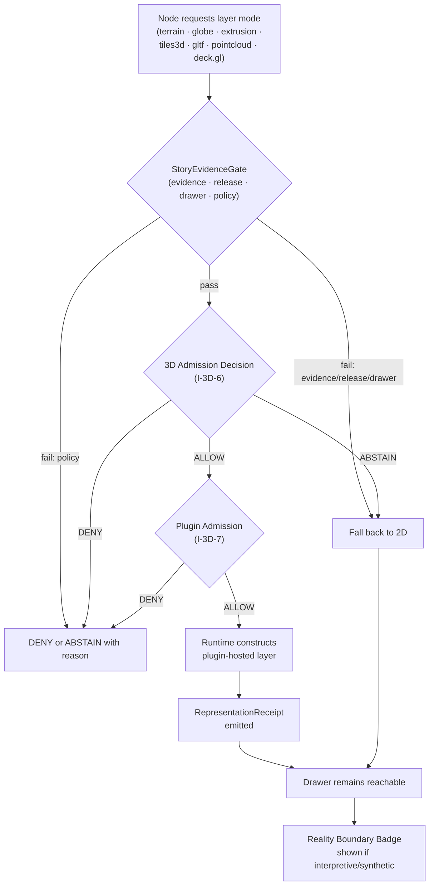

<!-- [KFM_META_BLOCK_V2]
doc_id: kfm://doc/architecture/story/readme
title: Story Subsystem Architecture
type: standard
version: v0.2
status: draft
owners: Story subsystem owner (TBD) · UI subsystem owner (TBD) · Docs steward
created: 2026-05-10
updated: 2026-05-24
policy_label: public
related:
  - docs/architecture/README.md
  - docs/architecture/maplibre-3d.md
  - docs/architecture/ui/README.md
  - docs/architecture/governed-ai/README.md
  - docs/architecture/review/README.md
  - docs/adr/ADR-story-node-3d-admission.md
  - docs/adr/ADR-NNNN-maplibre-sole-renderer-retire-cesium.md
  - schemas/contracts/v1/story/story_manifest.schema.json
  - schemas/contracts/v1/story/story_node.schema.json
  - schemas/contracts/v1/maplibre/scene_manifest.schema.json
  - schemas/contracts/v1/maplibre/view_state.schema.json
  - schemas/contracts/v1/maplibre/camera_path.schema.json
  - schemas/contracts/v1/maplibre/representation_receipt.schema.json
  - schemas/contracts/v1/3d/reality_boundary_note.schema.json
  - schemas/contracts/v1/policy/3d_admission_decision.schema.json
  - schemas/contracts/v1/policy/plugin_admission.schema.json
  - contracts/OBJECT_MAP.md
tags: [kfm, architecture, story, ui, governance, maplibre, 3d]
notes:
  - Repository not mounted in this session; all repo-state claims are PROPOSED / UNKNOWN / NEEDS VERIFICATION.
  - v0.2 aligns with docs/architecture/maplibre-3d.md and the proposed retire-Cesium ADR — 3D is now a layer-level Admission Decision inside the same MapLibre runtime, not a renderer handoff.
  - Stable anchors preserved from v0.1; section #3d-handoff-boundary retained with reframed content for backlink safety.
[/KFM_META_BLOCK_V2] -->

# Story Subsystem Architecture

> **Evidence-bound, MapLibre-first, time-aware narrative playback over the governed map.**
> A Story is a sequence of nodes that move camera, time, layers, and panels — **every consequential claim resolves to drawer evidence or abstains**, and **3D is a governed admission decision on a layer, not a switch to a second renderer.**

<!-- top-of-file impact block -->

[](#status)
[](#status--authority)
[](#status--authority)
[](#repository-preflight)
[](#3d-handoff-boundary)
[](#3d-handoff-boundary)
[](#non-negotiable-invariants)
<!-- TODO: replace with verified CI/coverage shields once workflows are confirmed -->

**Status:** `draft` (v0.2) · **Owners:** Story subsystem owner *(TBD)* · UI subsystem owner *(TBD)* · Docs steward
**Authority of this document:** PROPOSED doctrine · **Authority of any specific path quoted here:** PROPOSED until verified against mounted-repo evidence.

> [!TIP]
> **What changed in v0.2 (high level)** — Cesium is no longer the 3D path. 3D layers render inside the **same MapLibre runtime** via governed plugins (`3d-tiles-renderer` + three.js, `maplibre-three-plugin`, `maplibre-gl-lidar`, deck.gl interleaved). The Story subsystem no longer hands a state off to a second renderer; it requests a layer mode, and a **3D Admission Decision** plus a **Plugin Admission Decision** gate the request inside `packages/maplibre-runtime/`. Per-node and per-claim contracts (drawer continuity, cite-or-abstain, finite outcomes) are unchanged. See [`docs/architecture/maplibre-3d.md`](../maplibre-3d.md) for the renderer doctrine and the proposed retire-Cesium ADR.

---

## Quick jump

- [Status & Authority](#status--authority)
- [Repository Preflight](#repository-preflight)
- [Scope](#scope)
- [Repo fit](#repo-fit)
- [Accepted inputs](#accepted-inputs)
- [What does NOT belong here](#what-does-not-belong-here)
- [Non-negotiable invariants](#non-negotiable-invariants)
- [Architecture overview](#architecture-overview)
- [Schemas](#schemas)
- [Governed API surface](#governed-api-surface)
- [Components](#components)
- [Fixtures, validators, tests](#fixtures-validators-tests)
- [Finite outcomes & negative states](#finite-outcomes--negative-states)
- [3D handoff boundary](#3d-handoff-boundary)
- [Reality Boundary Notes in stories](#reality-boundary-notes-in-stories)
- [Definition of Done — first slice](#definition-of-done--first-slice)
- [Rollback path](#rollback-path)
- [Update-propagation matrix](#update-propagation-matrix)
- [Related folders](#related-folders)
- [ADRs](#adrs)
- [Open questions / NEEDS VERIFICATION](#open-questions--needs-verification)

---

## Status & Authority

| Field | Value |
|---|---|
| Document type | Subsystem architecture overview |
| Version | **v0.2** (revision; supersedes v0.1) |
| Authority level | Subsystem-architecture documentation under `docs/architecture/` (refines, never contradicts, root doctrine) |
| Status of doctrine in this doc | PROPOSED — derived from the Whole-UI + Governed AI Expansion plan, Master MapLibre v2.1, the *MapLibre 3D Capabilities* brief (`docs/architecture/maplibre-3d.md`), and Directory Rules |
| Status of code paths quoted here | UNKNOWN / NEEDS VERIFICATION until mounted-repo inspection |
| Path lineage | Path `docs/architecture/story/README.md` is PROPOSED per *Whole-UI + Governed AI Expansion Report* §11, Appendix A, and §29 file/folder tree |
| Reviewers required for change | Story subsystem owner + UI subsystem owner + Docs steward; ADR for any 3D-admission, plugin-admission, or schema-home change |
| Supersedes | **In-document:** v0.1 of this file. **In doctrine:** the dual-renderer disposition of `KFM-P2-FEAT-0012` is superseded once the retire-Cesium ADR (see [ADRs](#adrs)) is accepted. |
| Related doctrine | Lifecycle law · trust membrane · cite-or-abstain truth posture · finite outcomes (`ANSWER`/`ABSTAIN`/`DENY`/`ERROR`) · I-3D-1…I-3D-7 (see `docs/architecture/maplibre-3d.md` §1) |

> [!IMPORTANT]
> The Story subsystem is **PROPOSED doctrine, UNKNOWN code** at the time of writing. No story player, story manifest schema, scene manifest schema, MapLibre runtime adapter, or 3D admission policy bundle has been verified in a mounted repository in this session. Every path, route, and component name below is **PROPOSED / NEEDS VERIFICATION**.

---

## Repository Preflight

This document was authored without a mounted repository. The following claims therefore carry these labels by default:

- **Schema files** under `schemas/contracts/v1/story/`, `schemas/contracts/v1/maplibre/`, `schemas/contracts/v1/3d/`, and `schemas/contracts/v1/policy/` — PROPOSED.
- **API routes** under `apps/governed-api/src/routes/story.ts` (or its repo-actual equivalent) — PROPOSED / NEEDS VERIFICATION.
- **UI components** under `apps/explorer-web/src/features/story/` (or equivalent) — PROPOSED / NEEDS VERIFICATION.
- **Runtime adapter** under `packages/maplibre-runtime/` — PROPOSED; presence NEEDS VERIFICATION (see `maplibre-3d.md` OQ-3D-03).
- **Fixtures** under `tests/fixtures/story/` and `fixtures/maplibre/valid|invalid/` — PROPOSED.
- **Validators** under `tools/validators/story/` — PROPOSED.

Before any PR proposes, creates, moves, or renames a path covered here, run the **§4 Placement Protocol** of [`directory-rules.md`](../../doctrine/directory-rules.md) and verify the actual app, framework, and route conventions.

---

## Scope

The Story subsystem turns a curated sequence of camera, time, layer, and panel states over the governed map into an **inspectable narrative**: each node carries the layer requirements, time window, evidence references, and (where applicable) the 3D admission posture needed to render — and to refuse to render — its claims.

**In scope**

- Specifying `StoryManifest`, `StoryNode`, `StoryTransition`, and `StoryEvidenceGate` shapes and lifecycle.
- The `GET /api/v1/stories/{story_id}` governed endpoint and its envelope.
- Browser playback boundary (`StoryNodePlayer`) and its coupling to `packages/maplibre-runtime/`, the time owner, the layer catalog, the Evidence Drawer, and `StorySnapshot` receipts.
- **3D layer admission within the same MapLibre runtime** (terrain, fill-extrusion, globe projection, 3D Tiles via three.js, glTF, point clouds, deck.gl interleaved) and the continuity gates that license it.
- Reality Boundary Note surfacing for interpretive vs. captured 3D content in nodes (KFM-P9-FEAT-0014).
- Fixtures, validators, finite outcomes, rollback, and feature-flag posture.

**Out of scope**

- Story authoring UX, scene-build workflows, and content production discipline.
- 3D Tiles production pipelines (the *production* of glTF, 3D Tiles, or LiDAR point clouds; their *rendering* is in scope via `packages/maplibre-runtime/`).
- Renderer-engine selection and plugin admission rules themselves — those live in [`docs/architecture/maplibre-3d.md`](../maplibre-3d.md) and the retire-Cesium ADR; Story consumes the decision.
- Release approval and destructive review actions (see [`docs/architecture/review/README.md`](../review/README.md)).
- Source identity, rights, sensitivity defaults (see [`docs/sources/SOURCE_DESCRIPTOR_STANDARD.md`](../../sources/SOURCE_DESCRIPTOR_STANDARD.md)).

---

## Repo fit

```
docs/
└── architecture/
    ├── README.md                  ← parent: subsystem index
    ├── maplibre-3d.md             ← sibling: renderer / 3D doctrine (REVISED upstream)
    ├── ui/                        ← sibling: shell, state, routing, layering
    ├── governed-ai/               ← sibling: Focus Mode, model adapter
    ├── review/                    ← sibling: read-only steward console
    └── story/
        └── README.md              ← (this file)
```

**Upstream (governs this doc):**

- [`docs/architecture/README.md`](../README.md) — subsystem map and authority surface.
- [`docs/architecture/maplibre-3d.md`](../maplibre-3d.md) — renderer choice, plugin admission, 3D primitives.
- `docs/doctrine/` — lifecycle law, truth posture, trust membrane, authority ladder.
- [`directory-rules.md`](../../doctrine/directory-rules.md) — placement protocol.

**Downstream (refines or implements this doc):**

- [`schemas/contracts/v1/story/story_manifest.schema.json`](../../../schemas/contracts/v1/story/story_manifest.schema.json) — PROPOSED.
- [`schemas/contracts/v1/story/story_node.schema.json`](../../../schemas/contracts/v1/story/story_node.schema.json) — PROPOSED.
- [`schemas/contracts/v1/maplibre/scene_manifest.schema.json`](../../../schemas/contracts/v1/maplibre/scene_manifest.schema.json) — PROPOSED *(consumed; not owned by Story)*.
- [`schemas/contracts/v1/maplibre/view_state.schema.json`](../../../schemas/contracts/v1/maplibre/view_state.schema.json) — PROPOSED.
- [`schemas/contracts/v1/maplibre/camera_path.schema.json`](../../../schemas/contracts/v1/maplibre/camera_path.schema.json) — PROPOSED.
- [`schemas/contracts/v1/maplibre/representation_receipt.schema.json`](../../../schemas/contracts/v1/maplibre/representation_receipt.schema.json) — PROPOSED.
- [`schemas/contracts/v1/3d/reality_boundary_note.schema.json`](../../../schemas/contracts/v1/3d/reality_boundary_note.schema.json) — PROPOSED.
- [`schemas/contracts/v1/policy/3d_admission_decision.schema.json`](../../../schemas/contracts/v1/policy/3d_admission_decision.schema.json) — PROPOSED.
- [`schemas/contracts/v1/policy/plugin_admission.schema.json`](../../../schemas/contracts/v1/policy/plugin_admission.schema.json) — PROPOSED (I-3D-7).
- [`contracts/OBJECT_MAP.md`](../../../contracts/OBJECT_MAP.md) — object-meaning crosswalk; PROPOSED.
- [`policy/story/`](../../../policy/story/) — admissibility gates for story nodes; PROPOSED.
- [`policy/maplibre/`](../../../policy/maplibre/) — 3D admission and plugin admission policy bundles; PROPOSED.
- [`tests/fixtures/story/`](../../../tests/fixtures/story/) — schema-valid story manifests for component and validator tests; PROPOSED.
- [`tools/validators/story/validate_story_manifest.py`](../../../tools/validators/story/validate_story_manifest.py) — PROPOSED.
- `packages/maplibre-runtime/` — PROPOSED; the only path through which Story touches the renderer.
- `apps/governed-api/src/routes/story.ts` — PROPOSED / NEEDS VERIFICATION.
- `apps/explorer-web/src/features/story/StoryNodePlayer.tsx` — PROPOSED / NEEDS VERIFICATION.
- [`docs/adr/ADR-story-node-3d-admission.md`](../../adr/ADR-story-node-3d-admission.md) — PROPOSED (replaces the v0.1 reference to a Cesium-handoff ADR).
- [`docs/adr/ADR-NNNN-maplibre-sole-renderer-retire-cesium.md`](../../adr/ADR-NNNN-maplibre-sole-renderer-retire-cesium.md) — PROPOSED upstream; gating dependency for Story 3D.

---

## Accepted inputs

This subsystem accepts, **only via governed surfaces**:

- Released `LayerDescriptor` / `LayerManifest` payloads (already trust-badged, rights-checked, with `plugin_dependencies` pinned where 3D modes are requested).
- Resolved `EvidenceBundle` references for any consequential claim a node makes.
- Curated `StoryManifest` documents authored against the published schema, served by the Story endpoint.
- `TimeState` snapshots produced by the shell's time owner.
- `ViewState` / `CameraPath` values authored against the MapLibre schemas (consumed; not authored by Story).
- Optional 3D layer modes (`terrain | globe | extrusion | tiles3d | gltf | pointcloud`) — only when the per-layer **3D Admission Decision** and the **Plugin Admission Decision** both ALLOW (see [3D handoff boundary](#3d-handoff-boundary)).
- `RealityBoundaryNote` references for any interpretive or synthetic content cited by a node.

## What does NOT belong here

- ❌ Direct browser reads against `data/raw/`, `data/work/`, `data/quarantine/`, canonical stores, graph stores, object stores, vector indexes, or model runtimes. *(Trust membrane.)*
- ❌ Browser-side calls to Ollama, OpenAI, or any model provider. *(Governed AI boundary.)*
- ❌ Story manifests asserting claims that do not resolve to a released `EvidenceBundle`.
- ❌ **Direct imports** of `maplibre-gl`, `three`, `3d-tiles-renderer`, `deck.gl`, or `maplibre-gl-lidar` from Story feature code. **All renderer access goes through `packages/maplibre-runtime/`** (I-3D-1, I-3D-7).
- ❌ A second-renderer handoff path (Cesium runtime, Cesium-specific manifests, cross-renderer camera sync). The retire-Cesium ADR explicitly removes this surface.
- ❌ 3D layer activation that bypasses the 3D Admission Decision or the Plugin Admission Decision.
- ❌ UI source code, plugin runtimes, or scene assets — those live under `apps/`, `packages/`, and (for assets) `data/published/` per Directory Rules; this folder is `docs/` only.
- ❌ Story manifest *files* themselves — those are emitted artifacts and live under `data/manifests/story/` (PROPOSED home), not in `docs/`.

> [!NOTE]
> **v0.1 had a "conflicted lineage" warning** about `web/story_nodes/` vs `data/manifests/story/`. v0.2 resolves the renderer half of that question via the retire-Cesium ADR; the **manifest-file home** question (`data/manifests/story/`) remains an ADR-class decision and is tracked in [Open questions](#open-questions--needs-verification).

---

## Non-negotiable invariants

> [!IMPORTANT]
> These hold for every Story node, every transition, every release. v0.2 explicitly aligns invariant 4 with the 3D-specific invariants **I-3D-1 … I-3D-7** in [`docs/architecture/maplibre-3d.md`](../maplibre-3d.md) §1.

1. **Cite-or-abstain.** Every consequential story claim must resolve to drawer evidence (`EvidenceRef` → `EvidenceBundle`) or the node renders an `ABSTAIN` state. Visual rendering does not establish evidentiary certainty.
2. **Governed surfaces only.** The browser fetches stories via `GET /api/v1/stories/{story_id}`, evidence via `GET /api/v1/evidence/{bundle_id}`, and feature claims via `POST /api/v1/claims/resolve`. It does **not** read internal stores or call models directly.
3. **2D is the evidence baseline.** A node MUST be playable in 2D over MapLibre. Under MapLibre-only rendering, evidence parity between 2D and 3D modes is **upheld by construction** — same tiles, same client, same `EvidenceBundle` — but the doctrine still applies: a 3D-mode rendering that loses parity with the 2D baseline is a regression. (Per I-3D-3.)
4. **3D is a governed admission, not a UI toggle.** Switching any layer into a 3D mode requires a valid `3D Admission Decision` and a valid `Plugin Admission Decision`. The runtime denies, abstains, or falls back to 2D otherwise. (Per I-3D-6 + I-3D-7.) **2.5D surfaces (fill-extrusion, draped DEMs) cannot stand in as evidence for true vertical geometry** (caves, overhangs, strata, building interiors) — the `LayerManifest.geometry_label` must say which it is. (Per I-3D-4.)
5. **Continuity gates every node.** A node may move camera, time, layers, and panels only if the resulting state preserves **evidence, release, drawer, policy, and (when 3D is requested) plugin-admission and reality-boundary** continuity. Failures fall back to 2D or `ABSTAIN`.
6. **Finite outcomes.** Story responses are typed: `ANSWER` (node renders), `ABSTAIN` (insufficient evidence), `DENY` (policy / restricted node), `ERROR` (system fault). No `partial`, no `pending`, no soft fallback.
7. **Promotion is governed.** Story manifests promote through the lifecycle (RAW → WORK/QUARANTINE → PROCESSED → CATALOG → PUBLISHED) like any other artifact. Publication is a state transition, not a file move. A `StorySnapshot` receipt records the evidence, redactions, and release state at the moment of release.
8. **Derived is not sovereign.** A 3D scene, a tile, a stylized layer, a transition animation, or any AI-drafted node narration is a presentation choice. The `EvidenceBundle` it cites is the truth. Interpretive or synthetic content carries a `RealityBoundaryNote` surfaced in the drawer.
9. **No naked renderer.** Story feature code MUST NOT import `maplibre-gl`, `three`, `3d-tiles-renderer`, `deck.gl`, or `maplibre-gl-lidar` directly. All renderer access is through `packages/maplibre-runtime/`. (Per I-3D-7.)

---

## Architecture overview

```mermaid
flowchart LR
    subgraph Browser["Browser · apps/explorer-web (PROPOSED)"]
        SP["StoryNodePlayer<br/>(MapLibre-first)"]
        ED["Evidence Drawer"]
        RBB["Reality Boundary<br/>Badge"]
    end

    subgraph Runtime["packages/maplibre-runtime (PROPOSED) — sole renderer adapter"]
        MR["MapLibre runtime adapter<br/>(camera · time · layers · receipts)"]
        ADM["3D Admission Evaluator"]
        PLG["Plugin Registry<br/>(pinned versions)"]
        H3D["3D plugin hosts<br/>terrain · globe · fill-extrusion ·<br/>3D Tiles (three.js) · glTF (three.js) ·<br/>point cloud · deck.gl interleaved"]
    end

    subgraph API["Governed API · apps/governed-api (PROPOSED)"]
        SR["GET /api/v1/stories/&#123;id&#125;"]
        EVR["GET /api/v1/evidence/&#123;bundle_id&#125;"]
        CR["POST /api/v1/claims/resolve"]
        LMR["GET /api/v1/layers/&#123;id&#125;/manifest"]
        RCR["POST /api/v1/receipts"]
    end

    subgraph Schemas["schemas/contracts/v1/ (PROPOSED)"]
        SM["story/StoryManifest"]
        SN["story/StoryNode"]
        ST["story/StoryTransition"]
        SG["story/StoryEvidenceGate"]
        SCM["maplibre/SceneManifest"]
        VS["maplibre/ViewState"]
        CP["maplibre/CameraPath"]
        RR["maplibre/RepresentationReceipt"]
        RBN["3d/RealityBoundaryNote"]
        ADD["policy/3DAdmissionDecision"]
        PAD["policy/PluginAdmission"]
    end

    subgraph Trust["Trust membrane · governed only"]
        EB[(EvidenceBundle)]
        LD[(LayerDescriptor /<br/>LayerManifest)]
    end

    SP -->|fetch story| SR
    SR -. validates against .-> SM
    SR -. validates against .-> SN
    SR --> SP

    SP -->|requestLayer mode| MR
    MR --> LMR
    LMR --> MR
    MR --> PLG
    MR --> ADM
    ADM -. evaluates .-> ADD
    PLG -. checks .-> PAD
    MR -->|ALLOW| H3D
    MR -->|DENY/ABSTAIN| SP

    SP -->|on consequential claim| CR
    SP -->|resolve bundle| EVR
    CR --> ED
    EVR --> ED
    ED --> RBB
    RBB -. consumes .-> RBN

    H3D --> RCR
    RCR -. emits .-> RR

    EVR --> EB
    SR --> LD

    classDef proposed stroke-dasharray: 4 3,stroke:#888;
    class SP,ED,RBB,MR,ADM,PLG,H3D,SR,EVR,CR,LMR,RCR,SM,SN,ST,SG,SCM,VS,CP,RR,RBN,ADD,PAD proposed;
```



> [!NOTE]
> Dashed nodes are PROPOSED — neither code nor schema has been verified in a mounted repo this session. **There is no second-renderer box.** What v0.1 drew as a "Cesium adapter" is now the 3D plugin host **inside** `packages/maplibre-runtime/`, fronted by admission and registry gates.

### Player flow (per node)

1. Shell issues `GET /api/v1/stories/{story_id}` → server validates against `StoryManifest` schema → returns the manifest, fixed scope, and a play sequence.
2. For each `StoryNode`:
   1. Apply layer requirements via the **Layer Catalog** + `packages/maplibre-runtime/`. For each layer, the runtime resolves the `LayerManifest` (with `plugin_dependencies` if a 3D mode is requested), then asks the **3D Admission Evaluator** and **Plugin Registry** to authorize the requested mode. If any required layer is unreleased, restricted, or has an unpinned plugin → **`DENY`** or **`ABSTAIN`** with a typed reason.
   2. Apply time window via **TimeState** (`viewport_time`, `valid_time`, `observed_time`, `freshness`).
   3. Apply camera/panel state via the runtime adapter. Camera state is a `ViewState`; a sequence of `ViewState` is a `CameraPath` (a governed asset, spec-hashed and validated).
   4. For each consequential claim attached to the node, **resolve drawer evidence**. The drawer payload is built server-side from `EvidenceDrawerPayload`, not assembled from feature properties.
   5. If a layer is rendered in any 3D mode and the source is interpretive or synthetic, surface its `RealityBoundaryNote` in the drawer and on the reality-boundary badge.
   6. On admit/deny/abstain, the runtime emits a `RepresentationReceipt` recording the scene_manifest_id (if applicable), layer set, projection, ViewState, time slice, CARE-mask transforms, and the plugin versions actually used.
3. Apply `StoryTransition` rules between nodes; cancellable; respects reduced-motion preferences.
4. On exit, return-conditions restore the shell's prior camera, time, and layer state. A `StorySnapshot` may be issued at release time recording the evidence and redactions at that moment.

---

## Schemas

All schemas are PROPOSED. Canonical home is `schemas/contracts/v1/` per ADR-0001 (schema home) referenced in `directory-rules.md` §0.

**Story-owned schemas** (governed by this subsystem):

| Schema | Proposed path | Purpose | Validated by |
|---|---|---|---|
| `StoryManifest` | `schemas/contracts/v1/story/story_manifest.schema.json` | Story-level sequence, scope, required layers, time windows, drawer refs, optional 3D layer-mode requests. | story fixture tests; `tools/validators/story/validate_story_manifest.py` (PROPOSED) |
| `StoryNode` | `schemas/contracts/v1/story/story_node.schema.json` | Node-level camera/time/layer/evidence continuity and transition requirements; optional per-layer requested mode (`terrain | globe | extrusion | tiles3d | gltf | pointcloud`). | story node tests (PROPOSED) |
| `StoryTransition` | *(named in source ledger; path PROPOSED)* | Transition rules between nodes (timing, easing, cancellability, reduced-motion behavior). | transition fixtures (PROPOSED) |
| `StoryEvidenceGate` | *(named in source ledger; path PROPOSED)* | Continuity check at node entry: evidence, release, drawer, policy, plugin-admission, reality-boundary. | gate fixtures (PROPOSED) |

**Consumed schemas** (owned by adjacent subsystems, referenced by Story):

| Schema | Owner | Path (PROPOSED) | Role in Story |
|---|---|---|---|
| `SceneManifest` | MapLibre/3D | `schemas/contracts/v1/maplibre/scene_manifest.schema.json` | Named scene composition a node may reference when activating multi-layer 3D state. |
| `ViewState` | MapLibre/3D | `schemas/contracts/v1/maplibre/view_state.schema.json` | Each node's camera/projection/time state. |
| `CameraPath` | MapLibre/3D | `schemas/contracts/v1/maplibre/camera_path.schema.json` | Sequence of `ViewState`s spanning transitions. |
| `LayerManifest` | MapLibre/3D | (existing) | Layer descriptor including `geometry_label`, `plugin_dependencies`, `evidence_refs`. |
| `RepresentationReceipt` | MapLibre/3D | `schemas/contracts/v1/maplibre/representation_receipt.schema.json` | Receipt emitted by the runtime after each render frame batch. |
| `RealityBoundaryNote` | Planetary/3D | `schemas/contracts/v1/3d/reality_boundary_note.schema.json` | Surfaced in drawer for interpretive/synthetic content. |
| `3DAdmissionDecision` | Policy | `schemas/contracts/v1/policy/3d_admission_decision.schema.json` | Gates per-layer 3D mode activation. |
| `PluginAdmission` | Policy | `schemas/contracts/v1/policy/plugin_admission.schema.json` | Gates the pinned plugin set (I-3D-7). |
| `StorySnapshot` / `ExportReceipt` | Story / Export | (existing receipt catalog) | Records evidence, redactions, release state at the moment of a story / export snapshot. |

> [!NOTE]
> The exact field shapes (e.g., `nodes[]`, `scope`, `required_layers[]`, `time_windows[]`, `drawer_refs[]`, `transition_rules[]`, `return_conditions`, `requested_layer_modes?`) are doctrinal in the Whole-UI report and the *MapLibre 3D Capabilities* brief. Field-level shape is decided in the schema files cited above, not here.

<details>
<summary><strong>Illustrative <code>StoryManifest</code> envelope (not a fixture; not releasable)</strong></summary>

```json
{
  "story_id": "kfm://story/example",
  "scope": { "domain": "atmosphere", "valid_time": "1850-01-01/1900-12-31" },
  "required_layers": ["kfm://layer/example-released"],
  "time_windows": [{ "node_id": "n1", "valid_time": "1854-01/1855-12" }],
  "nodes": [
    {
      "node_id": "n1",
      "camera": { "center": [-98.5, 38.5], "zoom": 6, "pitch": 0, "bearing": 0 },
      "panels": ["evidence_drawer"],
      "drawer_refs": ["kfm://drawer/example"],
      "evidence_refs": ["kfm://evidence/ref/example"],
      "requested_layer_modes": {
        "kfm://layer/example-released": "extrusion"
      },
      "reality_boundary_refs": []
    },
    {
      "node_id": "n2",
      "camera": { "center": [-98.5, 38.5], "zoom": 12, "pitch": 60, "bearing": 30 },
      "panels": ["evidence_drawer"],
      "drawer_refs": ["kfm://drawer/example-3d"],
      "evidence_refs": ["kfm://evidence/ref/example-photogrammetry"],
      "requested_layer_modes": {
        "kfm://layer/example-historic-structures": "gltf"
      },
      "reality_boundary_refs": ["kfm://reality-boundary/example-photogrammetry"]
    }
  ],
  "transition_rules": [{ "from": "n1", "to": "n2", "kind": "ease", "cancellable": true }],
  "return_conditions": { "restore_prior_state": true },
  "_mock_only": true
}
```

</details>

---

## Governed API surface

The browser MUST NOT bypass the governed API. All paths PROPOSED.

| Surface | Method · Path | Purpose | Negative states |
|---|---|---|---|
| Story | `GET /api/v1/stories/{story_id}` | Story manifest and evidence continuity. | `DENY` restricted nodes; `ABSTAIN` missing evidence; `ERROR` invalid manifest |
| Evidence (drawer) | `GET /api/v1/evidence/{bundle_id}` | Resolve `EvidenceBundle` for a node's drawer payload. | `DENY` restricted; `ABSTAIN` unresolved; `ERROR` invalid bundle |
| Claim resolve | `POST /api/v1/claims/resolve` | Resolve a consequential story claim to a drawer payload. | `ABSTAIN` no evidence; `DENY` sensitivity; `ERROR` malformed |
| Layer manifest | `GET /api/v1/layers/{id}/manifest` | Per-layer `LayerManifest` with `plugin_dependencies` for 3D-mode requests. | `DENY` restricted; `ABSTAIN` unreleased; `ERROR` invalid |
| Receipts | `POST /api/v1/receipts` | Runtime posts `RepresentationReceipt` and `RenderReceipt` after admission decisions and render batches. | `ERROR` malformed; idempotent on retry |

The story endpoint returns content wrapped in a `RuntimeResponseEnvelope` with a `DecisionEnvelope` carrying `outcome`, `reason_codes`, `obligations`, `audit_ref`, `evidence_bundle_refs`, and `freshness`. The browser renders the outcome explicitly; cancellation, timeout, stale evidence, restricted material, invalid citation, **3D admission deny, plugin admission deny, and reality-boundary required** are **first-class** states, not generic failures.

---

## Components

All component paths are PROPOSED / NEEDS VERIFICATION; adjust to the actual app path, package manager, and framework once the repo is inspected. If the repo uses something other than `apps/explorer-web/`, an ADR records the placement decision per `directory-rules.md` §2.4.

| Component | Proposed path | Responsibility |
|---|---|---|
| `StoryNodePlayer.tsx` | `apps/explorer-web/src/features/story/StoryNodePlayer.tsx` | MapLibre-first node playback driving the runtime adapter, time state, and Evidence Drawer; renders finite outcomes; surfaces Reality Boundary Badge when applicable. |
| Story route entry | `apps/explorer-web/src/app/routes/story.tsx` *(naming PROPOSED)* | Feature-flagged shell route; binds the player to the governed client. |
| **Runtime adapter** | `packages/maplibre-runtime/` | **Sole renderer-facing surface for Story.** Hosts the 3D admission evaluator, plugin registry, terrain/globe/fill-extrusion/3D-Tiles/glTF/point-cloud hosts, and receipt emission. (See `maplibre-3d.md` §7.) |
| Story API route | `apps/governed-api/src/routes/story.ts` | Validates manifests against schema; emits envelopes; never streams unreleased candidates. |
| Manifest validator | `tools/validators/story/validate_story_manifest.py` | Validates story manifest, drawer continuity, and (if `requested_layer_modes` is present) that referenced layers' `geometry_label` and `plugin_dependencies` are admissible. |
| Reality Boundary Badge | `apps/explorer-web/src/map/reality-boundary-badge.tsx` *(naming PROPOSED)* | UI affordance making interpretive/synthetic context visible at glance. *(KFM-P9-FEAT-0014.)* |

> [!TIP]
> Component code MUST speak to `packages/maplibre-runtime/` and the typed governed client — **never** to `maplibre-gl`, `three`, `3d-tiles-renderer`, `deck.gl`, or `maplibre-gl-lidar` directly, never to a raw `fetch`, and never to a model provider.

> [!CAUTION]
> **The v0.1 "3D handoff adapter" under `packages/cesium/...` is removed in v0.2.** Under the retire-Cesium ADR, that path does not exist. 3D layer hosts live inside `packages/maplibre-runtime/`, behind admission gates.

---

## Fixtures, validators, tests

All paths PROPOSED.

| Asset | Proposed path | Purpose |
|---|---|---|
| Valid manifest | `tests/fixtures/story/story_manifest.valid.json` | Schema-valid mock; carries an obvious `_mock_only` marker; not releasable. |
| Invalid manifest | `tests/fixtures/story/story_manifest.invalid.json` | Negative fixture — exercises validator failure modes. |
| 3D-admit valid node | `tests/fixtures/story/story_manifest.3d_admit_valid.json` | Node requesting a 3D mode where admission ALLOWs; positive path. |
| 3D-admit deny node | `tests/fixtures/story/story_manifest.3d_admit_deny_care.json` | Node requesting a 3D mode where CARE/sensitivity DENIES; verifies fallback to 2D or `ABSTAIN`. |
| 2.5D-vs-3D mislabel | `tests/fixtures/story/story_manifest.geometry_label_mismatch.json` | Node declares `requested_mode: 'true_3d_evidence'` against a layer with `geometry_label: '2.5D'` → DENY (per I-3D-4). |
| Plugin unpinned | `tests/fixtures/story/story_manifest.plugin_unpinned.json` | Layer's `plugin_dependencies` carries an unpinned version → DENY (per I-3D-7). |
| Reality boundary required | `tests/fixtures/story/story_manifest.reality_boundary_required.json` | Interpretive glTF asset cited without a `RealityBoundaryNote` → DENY. |
| Drawer-continuity case | `tests/fixtures/story/story_manifest.deny_restricted_node.valid.json` | DENY path with restricted node and reason codes. |
| Player component test | `tests/ui/StoryNodePlayer.test.tsx` | Verifies finite-outcome rendering, cancellation, reduced-motion, reality-boundary badge surfacing. |
| Manifest validator | `tools/validators/story/validate_story_manifest.py` | Schema validation + drawer-continuity check + 3D admission cross-check. |
| CI summary tool | `tools/ci/render_ui_validation_summary.py` | Renders reviewer summary without exposing restricted payloads. |

> [!CAUTION]
> Fixtures are **not publication artifacts**. Every mock payload must include a visible mock marker, must be schema-valid, and must never be confused with released evidence.

---

## Finite outcomes & negative states

The Story subsystem inherits the finite-outcome grammar shared by Map click, Focus, Review, Export, and Promotion.

| Outcome | When | What the user sees |
|---|---|---|
| `ANSWER` | Node renders with full continuity. | Node plays; Evidence Drawer reachable; trust badges visible; Reality Boundary Badge if applicable. |
| `ABSTAIN` | Required `EvidenceRef` cannot resolve, or `StoryEvidenceGate` fails (including 3D Admission ABSTAIN or unresolved plugin admission). | Explicit "evidence chain incomplete" state; structured next steps; node does not render speculatively. The runtime falls back to 2D where feasible. |
| `DENY` | Policy denies node (rights, sensitivity, restricted source-role, exact geometry, CARE-masked archaeology, 3D Admission DENY, Plugin Admission DENY for unpinned/drifted plugin). | Explicit policy state with reason codes; no fallback render of the denied claim. |
| `ERROR` | Schema mismatch, invalid envelope, system fault. | Typed error; no leaked prompt, secret, or internal context. |

> [!NOTE]
> Cancellation, timeout, stale evidence, restricted material, invalid citation, **3D admission denial**, **plugin admission denial**, and **missing reality boundary** are rendered explicitly and are **not** hidden as generic failures.

---

## 3D handoff boundary

> [!NOTE]
> **Reframed in v0.2.** What v0.1 called a "handoff" between MapLibre and Cesium is no longer the architecture. KFM uses **one renderer** (MapLibre GL JS 5.x) with a **governed plugin ecosystem** hosted inside `packages/maplibre-runtime/`. A node's request to enter a 3D mode is a **layer-level admission decision** evaluated *before* `setTerrain`, `setProjection({type:'globe'})`, or any plugin-hosted custom layer is constructed. (Per `docs/architecture/maplibre-3d.md` §7 and I-3D-6.) The anchor `#3d-handoff-boundary` is preserved for backlink compatibility.

3D is **a burden-bearing mode, not default spectacle.** A node MAY request 3D only when the `StoryEvidenceGate` and the runtime's combined **3D Admission Decision × Plugin Admission Decision** prove continuity.



**Gate criteria — all MUST hold:**

1. **Evidence continuity** — every claim made in the requested mode resolves to the same `EvidenceBundle` it would resolve to in 2D. *(Upheld by construction under one renderer; the gate is the auditor.)*
2. **Release continuity** — every layer used is in `release_state: published`.
3. **Drawer continuity** — the Evidence Drawer remains reachable from any rendered state.
4. **Policy continuity** — rights, sensitivity, CARE/geoprivacy, and source-role checks pass identically in the requested mode. *(Per I-3D-5: CARE-masked archaeology requires ≥5 km generalization on terrain-linked layers.)*
5. **3D Admission Decision = ALLOW** — the layer's `geometry_label` matches the requested mode (no 2.5D layer claiming true-3D evidence; per I-3D-4) and per-layer policy authorizes the mode.
6. **Plugin Admission = ALLOW** — every `plugin_dependencies` entry on the layer is pinned, supply-chain-attested, and present in the runtime's registry. *(Per I-3D-7.)*
7. **Reality Boundary continuity** — if any active layer is interpretive or synthetic (e.g., a photogrammetric reconstruction or a `Synthetic Surface`), a `RealityBoundaryNote` reference is present and the badge surfaces in the drawer. *(KFM-P9-FEAT-0014.)*

> [!WARNING]
> 2.5D ≠ 3D. **`fill-extrusion` and draped DEMs cannot stand in as evidence for true vertical geometry** (caves, overhangs, strata, building interiors). The renderer choice does not loosen this rule. (Per I-3D-4.)

> [!IMPORTANT]
> **ADR required** before any 3D admission rule is shipped: [`docs/adr/ADR-story-node-3d-admission.md`](../../adr/ADR-story-node-3d-admission.md) (PROPOSED — replaces v0.1's `ADR-story-node-3d-boundary.md`). And: shipping any 3D plugin is gated by the renderer-decision ADR [`ADR-NNNN-maplibre-sole-renderer-retire-cesium.md`](../../adr/ADR-NNNN-maplibre-sole-renderer-retire-cesium.md) (PROPOSED upstream).

---

## Reality Boundary Notes in stories

Story nodes that activate interpretive or synthetic 3D content (photogrammetric building models, archaeological reconstructions, modeled surfaces) MUST cite a `RealityBoundaryNote` and surface it in the drawer + on a reality-boundary badge.

| Scenario | Render path | Reality Boundary Note required? |
|---|---|---|
| Hillshade context layer | `hillshade` native | No (context, not evidence). |
| `fill-extrusion` of historic structures with **evidence-bearing** height attributes | `fill-extrusion` native, `geometry_label: '2.5D'` | No, **unless** the heights are modeled rather than recorded. |
| Photogrammetric building glTF reconstruction | three.js custom layer via `maplibre-three-plugin`, `geometry_label: '3D'` | **Yes** (per KFM-P9-FEAT-0014: "distinguish reality-based capture from interpretive reconstruction before publication or Story Node use"). |
| Archaeological 3D reconstruction (interpretive) | 3D Tiles via `3d-tiles-renderer` + three.js, `geometry_label: '3D'`, **CARE-masked ≥5 km** | **Yes** — both Reality Boundary Note and CARE generalization. |
| Synthetic Surface (modeled / interpolated raster) | `raster-dem` with `provenance.role = 'model'` | **Yes** (`Synthetic Surface` always carries one). |
| LiDAR point-cloud streaming | `maplibre-gl-lidar` (deck.gl) | **Yes** if the cloud is derivative; classifications must be evidence-bearing. |

---

## Definition of Done — first slice

The first slice is **2D-only, fixture-driven, feature-flagged off**. The 3D admission path is **schema- and policy-ready** so it can be enabled in a subsequent slice without contract changes. Items are PROPOSED.

- [ ] `StoryManifest` and `StoryNode` schemas published under `schemas/contracts/v1/story/` and crosswalked in `contracts/OBJECT_MAP.md`.
- [ ] Story-side references to the consumed MapLibre/3D schemas (`ViewState`, `CameraPath`, `RepresentationReceipt`, `RealityBoundaryNote`, `3DAdmissionDecision`, `PluginAdmission`) added to `contracts/OBJECT_MAP.md` as `consumes:` edges.
- [ ] At least one positive and one negative fixture under `tests/fixtures/story/`.
- [ ] `tools/validators/story/validate_story_manifest.py` runs on fixtures and PRs that touch story paths.
- [ ] Governed `GET /api/v1/stories/{story_id}` route returns a `RuntimeResponseEnvelope` validated against schema; route gated behind a feature flag.
- [ ] `StoryNodePlayer` consumes `packages/maplibre-runtime/` only; renders all four finite outcomes; respects reduced-motion.
- [ ] Evidence Drawer reachable from every node; Reality Boundary Badge wired (even if no node activates it in the first slice).
- [ ] Component test, accessibility smoke (keyboard, focus, screen-reader, reduced-motion), and an e2e smoke covering one happy path and one `ABSTAIN`/`DENY` path.
- [ ] Rollback path documented and disable-flag exercised in CI.
- [ ] No 3D plugin runtime, no model provider, no direct internal store access introduced by the slice.
- [ ] [`docs/adr/ADR-story-node-3d-admission.md`](../../adr/ADR-story-node-3d-admission.md) accepted before any 3D mode is enabled.
- [ ] [`docs/adr/ADR-NNNN-maplibre-sole-renderer-retire-cesium.md`](../../adr/ADR-NNNN-maplibre-sole-renderer-retire-cesium.md) accepted before any 3D mode is enabled (upstream gate).

---

## Rollback path

| Layer | Rollback action | Default fail-safe |
|---|---|---|
| Schemas | Keep prior version; add `v2` for breaking changes; never silently break fixtures. | Validation failure → `ERROR`/`HOLD`. |
| API route | Disable `GET /api/v1/stories/{story_id}` via feature flag; envelopes remain compatible. | Route unavailable → `ERROR`. |
| UI player | Disable story shell route; keep manifests in catalog as `DEFERRED` if not public. | Player off → other UI surfaces unaffected. |
| 3D layer modes | Disable per-layer 3D admission via `policy/maplibre/3d-admission.rego`; nodes fall back to 2D unconditionally. | Continuity gate failure → 2D fallback or `ABSTAIN`. |
| Plugin set | Pin a known-good plugin version manifest; revert lockfile; admission gate fails closed on drift. | Drifted/unpinned plugin → DENY (I-3D-7). |
| Fixtures | Delete/revert added fixtures; no published effect. | Missing fixture → CI fails closed. |
| Policy | Revert policy bundle version; gates default to `DENY`/`ERROR`. | No allow-by-default. |
| Published manifest | Immutable; rollback by new pointer/release, not overwrite. Issue `CorrectionNotice` + `StorySnapshot` correction. | Current alias disabled if unsafe. |

---

## Update-propagation matrix

When a material change touches the Story subsystem, propagate updates to **all** of:

| Material change | Owning README | Object map | Fixtures / tests | Runbook | Continuity notes | Rollback notes |
|---|---|---|---|---|---|---|
| `StoryManifest` schema | `docs/architecture/story/README.md` *(this file)* | `contracts/OBJECT_MAP.md` | `tests/fixtures/story/` | `docs/runbooks/ui_VALIDATION.md` | `docs/architecture/story/CONTINUITY_NOTES.md` *(PROPOSED)* | Disable story route; freeze 3D admission |
| Story API route | this file + `docs/architecture/ui/BOUNDARIES.md` *(PROPOSED)* | `contracts/OBJECT_MAP.md` | `tests/api/story/` *(PROPOSED)* | `docs/runbooks/ui_VALIDATION.md` *(PROPOSED)* | this file | Route flag off |
| 3D admission rules (per-layer) | this file + `docs/architecture/maplibre-3d.md` + ADR | n/a | `tests/policy/maplibre/3d_admission.test.ts` *(PROPOSED)* | `docs/runbooks/ui_LOCAL_DEV.md` *(PROPOSED)* | this file + `maplibre-3d.md` | Disable 3D mode per layer |
| Plugin admission / pinned plugin set | `docs/architecture/maplibre-3d.md` (primary) + this file | n/a | `tests/policy/maplibre/plugin_admission.test.ts` *(PROPOSED)* | `docs/runbooks/supply_chain.md` *(PROPOSED)* | `maplibre-3d.md` | Revert lockfile; fail closed on drift |
| Reality Boundary Note coupling | this file + `docs/architecture/maplibre-3d.md` | `contracts/OBJECT_MAP.md` | `tests/fixtures/story/story_manifest.reality_boundary_required.json` *(PROPOSED)* | `docs/runbooks/ui_VALIDATION.md` | this file | Surface as `ABSTAIN` if note missing |

> Source: *Whole-UI + Governed AI Expansion Report*, §24 (update-propagation matrix); v0.2 adds the 3D-admission, plugin-admission, and reality-boundary rows.

---

## Related folders

| Direction | Path | Authority |
|---|---|---|
| Up | [`docs/architecture/README.md`](../README.md) | Subsystem index (PROPOSED) |
| Sibling | [`docs/architecture/maplibre-3d.md`](../maplibre-3d.md) | **Renderer doctrine and 3D primitives — the upstream this file consumes** |
| Sibling | [`docs/architecture/ui/`](../ui/) | UI shell, state, routing, layering, telemetry (PROPOSED) |
| Sibling | [`docs/architecture/governed-ai/`](../governed-ai/) | Focus Mode, model adapter, citation validation (PROPOSED) |
| Sibling | [`docs/architecture/review/`](../review/) | Read-only review/steward console (PROPOSED) |
| Schemas | [`schemas/contracts/v1/story/`](../../../schemas/contracts/v1/story/) | Story-owned field-level shapes |
| Schemas (consumed) | [`schemas/contracts/v1/maplibre/`](../../../schemas/contracts/v1/maplibre/), [`schemas/contracts/v1/3d/`](../../../schemas/contracts/v1/3d/), [`schemas/contracts/v1/policy/`](../../../schemas/contracts/v1/policy/) | MapLibre/3D/policy schemas Story consumes |
| Contracts | [`contracts/OBJECT_MAP.md`](../../../contracts/OBJECT_MAP.md) | Object meaning crosswalk |
| Policy | [`policy/story/`](../../../policy/story/), [`policy/maplibre/`](../../../policy/maplibre/) | Admissibility gates (story + 3D + plugin admission) |
| Runtime | `packages/maplibre-runtime/` (PROPOSED) | The only path through which Story touches MapLibre or any plugin |
| Fixtures | [`tests/fixtures/story/`](../../../tests/fixtures/story/), `fixtures/maplibre/valid|invalid/` | Schema-valid mocks |
| Validators | [`tools/validators/story/`](../../../tools/validators/story/) | Manifest + continuity checks |
| Runbooks | [`docs/runbooks/ui_VALIDATION.md`](../../runbooks/ui_VALIDATION.md), [`ui_ROLLBACK.md`](../../runbooks/ui_ROLLBACK.md) | Operational discipline |

---

## ADRs

| ADR | Topic | Status |
|---|---|---|
| [`ADR-story-node-3d-admission.md`](../../adr/ADR-story-node-3d-admission.md) | Per-layer 3D Admission Decision criteria for story nodes; supersedes v0.1's `ADR-story-node-3d-boundary.md` (which framed the question as a Cesium handoff) | PROPOSED |
| [`ADR-NNNN-maplibre-sole-renderer-retire-cesium.md`](../../adr/ADR-NNNN-maplibre-sole-renderer-retire-cesium.md) | MapLibre as sole renderer; Cesium retired; supersedes the dual-renderer disposition of `KFM-P2-FEAT-0012` | **PROPOSED — upstream gating dependency** (draft in `maplibre-3d.md` Appendix B; ADR number to be assigned against the live ADR set, since the corpus carries open numbering conflicts on `ADR-0003`) |
| [`ADR-plugin-admission.md`](../../adr/ADR-plugin-admission.md) | Plugin Admission policy DSL, attestation format, lockfile integration (I-3D-7) | PROPOSED |
| [`ADR-ui-schema-home.md`](../../adr/ADR-ui-schema-home.md) | Schema home decision (`schemas/contracts/v1/...`) | PROPOSED |
| [`ADR-maplibre-adapter-boundary.md`](../../adr/ADR-maplibre-adapter-boundary.md) | `packages/maplibre-runtime/` contract that Story rides on | PROPOSED |

> The Story subsystem MUST NOT enable any 3D layer mode before **both** `ADR-story-node-3d-admission` and the renderer-decision ADR are accepted, and before the plugin admission ADR provides a workable rule set.

---

## Open questions / NEEDS VERIFICATION

These items SHOULD be tracked in [`docs/registers/VERIFICATION_BACKLOG.md`](../../registers/VERIFICATION_BACKLOG.md) and resolved by inspection or ADR. Items marked **(carried)** were present in v0.1 and remain open; items marked **(new in v0.2)** are introduced by the renderer revision.

- **NEEDS VERIFICATION (carried)** — Whether the deployable shell is actually `apps/explorer-web/`, or another path. Adapt component paths and record an ADR.
- **NEEDS VERIFICATION (carried)** — Backend framework and route convention (`apps/governed-api/`, `apps/governed_api/`, `packages/api/`, etc.).
- **NEEDS VERIFICATION (carried)** — Whether `schemas/contracts/v1/story/` exists and whether `contracts/` already holds parallel schema content (drift-register candidate).
- **NEEDS VERIFICATION (carried)** — Whether `StoryTransition` and `StoryEvidenceGate` warrant their own schema files or live as `$defs` inside `StoryNode`. Decide in ADR or schema-author note.
- **OPEN (carried)** — Story manifest *file* home: source ledger flags `web/story_nodes/` vs `data/manifests/story/` as conflicted lineage. Resolve via ADR; canonical proposed home is `data/manifests/story/`. *(The renderer half of v0.1's conflicted-lineage warning is resolved upstream by the retire-Cesium ADR; the file-home half remains open here.)*
- **OPEN (carried)** — Offline / pre-loaded-atlas / air-gapped story playback is mentioned but not designed. Defer until first slice is stable.
- **OPEN (carried)** — Whether story route should also expose a list endpoint (`GET /api/v1/stories`) or only by-id retrieval; the source ledger names only the by-id form.
- **RESOLVED upstream (was carried)** — ~~Cesium edition (CesiumJS open-source vs Cesium Ion) and token-rotation discipline.~~ **MOOT** under the retire-Cesium ADR. The Cesium token-rotation discipline is no longer a Story concern.
- **NEW in v0.2** — Does `packages/maplibre-runtime/` exist, or is runtime adapter logic living in `apps/explorer-web/`? *(Mirrors `maplibre-3d.md` OQ-3D-03.)* **NEEDS VERIFICATION.**
- **NEW in v0.2** — Is `policy/maplibre/` the canonical home for 3D admission rules, or do they live under `policy/sensitivity/`? *(Mirrors `maplibre-3d.md` OQ-3D-04.)* **NEEDS VERIFICATION.**
- **NEW in v0.2** — How does `StoryEvidenceGate` cite a `3DAdmissionDecision` and a `PluginAdmission` — by reference (`audit_ref`) or by inline projection? **PROPOSED — decide in `ADR-story-node-3d-admission`.**
- **NEW in v0.2** — Should `RealityBoundaryNote` references on a `StoryNode` be required for any `requested_layer_mode` in `{gltf, tiles3d}` when the underlying layer's source `role` is `model` or `interpretive`? **PROPOSED — yes, by default; specify in schema.**
- **NEW in v0.2** — Should the story manifest's `requested_layer_modes` map be validated at ingest, at render time, or both? **PROPOSED — both; ingest checks `geometry_label` × mode compatibility, render time invokes the admission evaluator.**
- **NEW in v0.2** — Should `StorySnapshot` carry an explicit `renderer_set` field (e.g., `{ renderer: 'maplibre-gl', version, plugin_set: [...] }`) to make a snapshot replayable against a known plugin lockfile? **PROPOSED — yes; coordinate field shape with `RepresentationReceipt`.**

---

<sub>
This document is PROPOSED architecture documentation for the Story subsystem of Kansas Frontier Matrix. Doctrine is grounded in attached project sources (Whole-UI + Governed AI Expansion Report, Master MapLibre v2.1, <code>docs/architecture/maplibre-3d.md</code>, Atlas v1.1 §18, Directory Rules v1.2). Repository state was not mounted in this session; specific paths, routes, and component names remain PROPOSED / NEEDS VERIFICATION until inspected against a mounted repo and accepted by ADR where required.
</sub>

[⬆ Back to top](#story-subsystem-architecture)
