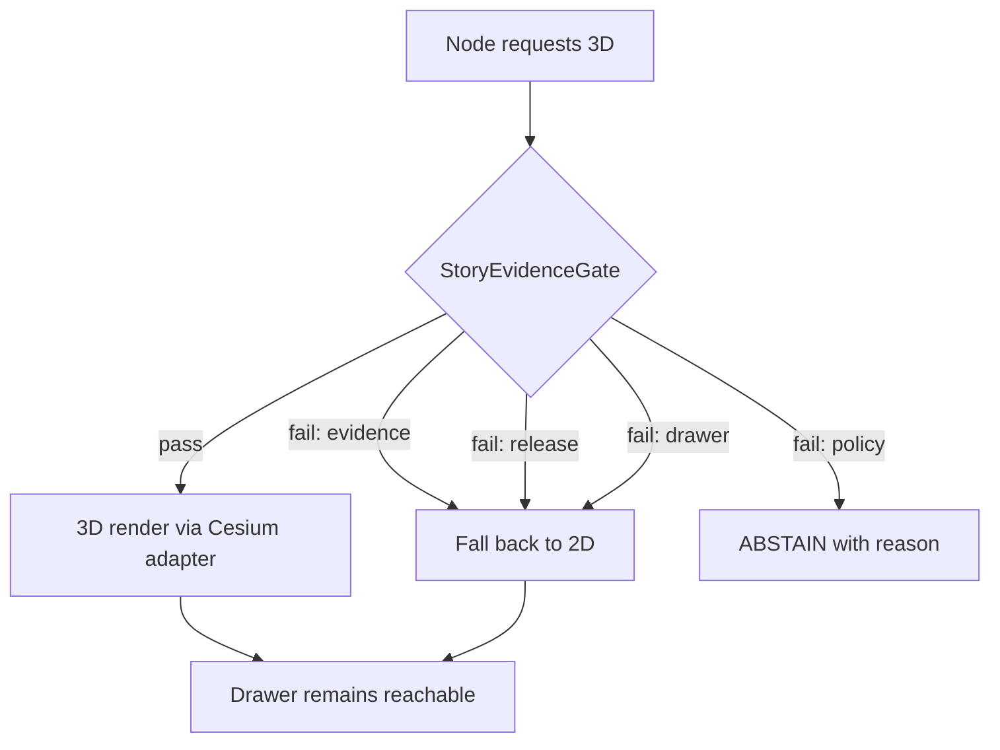

<!-- [KFM_META_BLOCK_V2]
doc_id: kfm://doc/architecture/story/readme
title: Story Subsystem Architecture
type: standard
version: v0.1
status: draft
owners: Story subsystem owner (TBD) · Docs steward
created: 2026-05-10
updated: 2026-05-10
policy_label: public
related:
  - docs/architecture/README.md
  - docs/architecture/ui/README.md
  - docs/architecture/governed-ai/README.md
  - docs/architecture/review/README.md
  - docs/adr/ADR-story-node-3d-boundary.md
  - schemas/contracts/v1/story/story_manifest.schema.json
  - schemas/contracts/v1/story/story_node.schema.json
  - contracts/OBJECT_MAP.md
tags: [kfm, architecture, story, ui, governance]
notes:
  - Repository not mounted in this session; all repo-state claims are PROPOSED / UNKNOWN / NEEDS VERIFICATION.
  - 3D handoff is conditional — see §3D Handoff Boundary.
[/KFM_META_BLOCK_V2] -->

# Story Subsystem Architecture

> **Evidence-bound, 2D-first, time-aware narrative playback over the governed map.**
> A Story is a sequence of nodes that move camera, time, layers, and panels — and **every consequential claim resolves to drawer evidence or abstains.**

<!-- top-of-file impact block -->

[](#status)
[](#status--authority)
[](#repository-preflight)
[](#3d-handoff-boundary)
[](#non-negotiable-invariants)
<!-- TODO: replace with verified CI/coverage shields once workflows are confirmed -->

**Status:** `draft` · **Owners:** Story subsystem owner *(TBD)* · Docs steward · UI subsystem owner *(TBD)*
**Authority of this document:** PROPOSED doctrine · **Authority of any specific path quoted here:** PROPOSED until verified against mounted-repo evidence.

---

## Quick jump

- [Status & Authority](#status--authority)
- [Repository Preflight](#repository-preflight)
- [Scope](#scope)
- [Repo fit](#repo-fit)
- [Accepted inputs](#accepted-inputs)
- [What does NOT belong here](#what-does-not-belong-here)
- [Non-negotiable invariants](#non-negotiable-invariants)
- [Architecture overview](#architecture-overview)
- [Schemas](#schemas)
- [Governed API surface](#governed-api-surface)
- [Components](#components)
- [Fixtures, validators, tests](#fixtures-validators-tests)
- [Finite outcomes & negative states](#finite-outcomes--negative-states)
- [3D handoff boundary](#3d-handoff-boundary)
- [Definition of Done — first slice](#definition-of-done--first-slice)
- [Rollback path](#rollback-path)
- [Update-propagation matrix](#update-propagation-matrix)
- [Related folders](#related-folders)
- [ADRs](#adrs)
- [Open questions / NEEDS VERIFICATION](#open-questions--needs-verification)

---

## Status & Authority

| Field | Value |
|---|---|
| Document type | Subsystem architecture overview |
| Authority level | Subsystem-architecture documentation under `docs/architecture/` (refines, never contradicts, root doctrine) |
| Status of doctrine in this doc | PROPOSED — derived from the Whole-UI + Governed AI Expansion plan and Directory Rules |
| Status of code paths quoted here | UNKNOWN / NEEDS VERIFICATION until mounted-repo inspection |
| Path lineage | Path `docs/architecture/story/README.md` is PROPOSED per *Whole-UI + Governed AI Expansion Report* §11, Appendix A, and §29 file/folder tree |
| Reviewers required for change | Story subsystem owner + Docs steward; UI subsystem owner if shell coupling changes; ADR for any 3D-runtime change |
| Supersedes | No prior in-tree predecessor identified in attached corpus |
| Related doctrine | Lifecycle law · trust membrane · cite-or-abstain truth posture · finite outcomes (`ANSWER`/`ABSTAIN`/`DENY`/`ERROR`) |

> [!IMPORTANT]
> The Story subsystem is **PROPOSED doctrine, UNKNOWN code** at the time of writing. No story player or manifest schema has been verified in a mounted repository in this session. Every path, route, and component name below is **PROPOSED / NEEDS VERIFICATION**.

---

## Repository Preflight

This document was authored without a mounted repository. The following claims therefore carry these labels by default:

- **Schema files** under `schemas/contracts/v1/story/` — PROPOSED.
- **API routes** under `apps/governed-api/src/routes/story.ts` (or its repo-actual equivalent) — PROPOSED / NEEDS VERIFICATION.
- **UI components** under `apps/explorer-web/src/features/story/` (or equivalent) — PROPOSED / NEEDS VERIFICATION.
- **Fixtures** under `tests/fixtures/story/` — PROPOSED.
- **Validators** under `tools/validators/story/` — PROPOSED.

Before any PR proposes, creates, moves, or renames a path covered here, run the **§4 Placement Protocol** of [`directory-rules.md`](../../doctrine/directory-rules.md) and verify the actual app, framework, and route conventions.

---

## Scope

The Story subsystem turns a curated sequence of camera, time, and layer states over the governed map into an **inspectable narrative**: each node carries the layer requirements, time window, and evidence references needed to render — and to refuse to render — its claims.

**In scope**

- Specifying `StoryManifest`, `StoryNode`, `StoryTransition`, and `StoryEvidenceGate` shapes and lifecycle.
- The `GET /api/v1/stories/{story_id}` governed endpoint and its envelope.
- Browser playback boundary (`StoryNodePlayer`) and its coupling to the MapLibre adapter, time state, layer catalog, and Evidence Drawer.
- The conditional 3D handoff (Cesium) and the continuity gates that license it.
- Fixtures, validators, finite outcomes, rollback, and feature-flag posture.

**Out of scope**

- Story authoring UX, scene-build workflows, and content production discipline.
- 3D Tiles production pipelines; Cesium token rotation; raster-cache invalidation.
- Release approval and destructive review actions (see [`docs/architecture/review/README.md`](../review/README.md)).
- Source identity, rights, sensitivity defaults (see [`docs/sources/SOURCE_DESCRIPTOR_STANDARD.md`](../../sources/SOURCE_DESCRIPTOR_STANDARD.md)).

---

## Repo fit

```
docs/
└── architecture/
    ├── README.md                  ← parent: subsystem index
    ├── ui/                        ← sibling: shell, state, routing, layering
    ├── governed-ai/               ← sibling: Focus Mode, model adapter
    ├── review/                    ← sibling: read-only steward console
    └── story/
        └── README.md              ← (this file)
```

**Upstream (governs this doc):**

- [`docs/architecture/README.md`](../README.md) — subsystem map and authority surface.
- `docs/doctrine/` — lifecycle law, truth posture, trust membrane, authority ladder.
- [`directory-rules.md`](../../doctrine/directory-rules.md) — placement protocol.

**Downstream (refines or implements this doc):**

- [`schemas/contracts/v1/story/story_manifest.schema.json`](../../../schemas/contracts/v1/story/story_manifest.schema.json) — PROPOSED.
- [`schemas/contracts/v1/story/story_node.schema.json`](../../../schemas/contracts/v1/story/story_node.schema.json) — PROPOSED.
- [`contracts/OBJECT_MAP.md`](../../../contracts/OBJECT_MAP.md) — object-meaning crosswalk; PROPOSED.
- [`policy/story/`](../../../policy/story/) — admissibility gates for story nodes; PROPOSED.
- [`tests/fixtures/story/`](../../../tests/fixtures/story/) — schema-valid story manifests for component and validator tests; PROPOSED.
- [`tools/validators/story/validate_story_manifest.py`](../../../tools/validators/story/validate_story_manifest.py) — PROPOSED.
- `apps/governed-api/src/routes/story.ts` — PROPOSED / NEEDS VERIFICATION (path adapts to real backend convention).
- `apps/explorer-web/src/features/story/StoryNodePlayer.tsx` — PROPOSED / NEEDS VERIFICATION.
- [`docs/adr/ADR-story-node-3d-boundary.md`](../../adr/ADR-story-node-3d-boundary.md) — PROPOSED.

---

## Accepted inputs

This subsystem accepts, **only via governed surfaces**:

- Released `LayerDescriptor` / `LayerManifest` payloads (already trust-badged and rights-checked).
- Resolved `EvidenceBundle` references for any consequential claim a node makes.
- Curated `StoryManifest` documents authored against the published schema, served by the Story endpoint.
- `TimeState` snapshots produced by the shell's time owner.
- Optional 3D scene descriptors *only* when the [3D handoff boundary](#3d-handoff-boundary) gates pass.

## What does NOT belong here

- ❌ Direct browser reads against `data/raw/`, `data/work/`, `data/quarantine/`, canonical stores, graph stores, object stores, vector indexes, or model runtimes. *(Trust membrane.)*
- ❌ Browser-side calls to Ollama, OpenAI, or any model provider. *(Governed AI boundary.)*
- ❌ Story manifests asserting claims that do not resolve to a released `EvidenceBundle`.
- ❌ 3D scenes that cannot preserve evidence / release / drawer / policy continuity.
- ❌ UI source code, Cesium runtime, or scene assets — those live under `apps/`, `packages/`, and (for assets) `data/published/` per Directory Rules; this folder is `docs/` only.
- ❌ Story manifest *files* themselves — those are emitted artifacts and live under `data/manifests/story/` (PROPOSED home), not in `docs/`.

> [!WARNING]
> The Whole-UI report flags a **conflicted lineage**: prior surfaces placed Story Node 3D assets under `web/story_nodes/` *and* `data/manifests/story/`. The proposed handling separates the **manifest** (`data/manifests/story/`) from **UI code/assets** (`apps/`, `packages/`); 3D runtime integration requires an ADR. See [Open questions](#open-questions--needs-verification).

---

## Non-negotiable invariants

> [!IMPORTANT]
> These hold for every Story node, every transition, every release.

1. **Cite-or-abstain.** Every consequential story claim must resolve to drawer evidence (`EvidenceRef` → `EvidenceBundle`) or the node renders an `ABSTAIN` state. Visual rendering does not establish evidentiary certainty.
2. **Governed surfaces only.** The browser fetches stories via `GET /api/v1/stories/{story_id}`, evidence via `GET /api/v1/evidence/{bundle_id}`, and feature claims via `POST /api/v1/claims/resolve`. It does **not** read internal stores or call models directly.
3. **2D first.** A node MUST be playable in 2D over MapLibre. 3D is opt-in, not default spectacle.
4. **Continuity gates everything.** A node may move camera, time, layers, and panels — but only if the resulting state preserves evidence, release, drawer, and policy continuity. If 3D cannot preserve continuity, the node falls back to 2D or `ABSTAIN`.
5. **Finite outcomes.** Story responses are typed: `ANSWER` (node renders), `ABSTAIN` (insufficient evidence), `DENY` (policy / restricted node), `ERROR` (system fault). No `partial`, no `pending`, no soft fallback.
6. **Promotion is governed.** Story manifests promote through the lifecycle (RAW → WORK/QUARANTINE → PROCESSED → CATALOG → PUBLISHED) like any other artifact. Publication is a state transition, not a file move.
7. **Derived is not sovereign.** A 3D scene, a tile, a stylized layer, or a transition animation is a presentation choice. The `EvidenceBundle` it cites is the truth.

---

## Architecture overview

```mermaid
flowchart LR
    subgraph Browser["Browser · apps/explorer-web (PROPOSED)"]
        SP["StoryNodePlayer<br/>2D-first"]
        ML["MapLibre Adapter<br/>(camera/time/layers)"]
        ED["Evidence Drawer"]
        CE{{"Cesium Adapter<br/>conditional · gated"}}
    end

    subgraph API["Governed API · apps/governed-api (PROPOSED)"]
        SR["GET /api/v1/stories/&#123;id&#125;"]
        EVR["GET /api/v1/evidence/&#123;bundle_id&#125;"]
        CR["POST /api/v1/claims/resolve"]
    end

    subgraph Schemas["schemas/contracts/v1/story/ (PROPOSED)"]
        SM[StoryManifest]
        SN[StoryNode]
        ST[StoryTransition]
        SG[StoryEvidenceGate]
    end

    subgraph Trust["Trust membrane · governed only"]
        EB[(EvidenceBundle)]
        LD[(LayerDescriptor /<br/>LayerManifest)]
    end

    SP -->|fetch story| SR
    SR -. validates against .-> SM
    SR -. validates against .-> SN
    SR --> SP

    SP -->|drive| ML
    SP -->|on consequential claim| CR
    SP -->|resolve bundle| EVR
    CR --> ED
    EVR --> ED

    SP -.optional handoff.-> CE
    CE -->|continuity check| SG
    SG -- pass --> CE
    SG -- fail --> SP

    EVR --> EB
    SR --> LD

    classDef proposed stroke-dasharray: 4 3,stroke:#888;
    class SP,ML,ED,CE,SR,EVR,CR,SM,SN,ST,SG proposed;
```



> [!NOTE]
> Dashed nodes are PROPOSED — neither code nor schema has been verified in a mounted repo this session.

### Player flow (per node)

1. Shell issues `GET /api/v1/stories/{story_id}` → server validates against `StoryManifest` schema → returns the manifest, fixed scope, and a play sequence.
2. For each `StoryNode`:
   1. Apply layer requirements via the **Layer Catalog** + MapLibre adapter; if a required layer is unreleased or restricted → **`DENY`** or **`ABSTAIN`** with a typed reason.
   2. Apply time window via **TimeState** (`viewport_time`, `valid_time`, `observed_time`, `freshness`).
   3. Apply camera/panel state via the MapLibre adapter.
   4. For each consequential claim attached to the node, **resolve drawer evidence**. The drawer payload is built server-side from `EvidenceDrawerPayload`, not assembled from feature properties.
   5. Optional: request 3D handoff. The **`StoryEvidenceGate`** must pass (see [3D handoff boundary](#3d-handoff-boundary)). On failure, fall back to 2D.
3. Apply `StoryTransition` rules between nodes; cancellable; respects reduced-motion preferences.
4. On exit, return-conditions restore the shell's prior camera, time, and layer state.

---

## Schemas

All schemas are PROPOSED. Canonical home is `schemas/contracts/v1/story/` per ADR-0001 (schema home) referenced in `directory-rules.md` §0.

| Schema | Proposed path | Purpose | Validated by |
|---|---|---|---|
| `StoryManifest` | `schemas/contracts/v1/story/story_manifest.schema.json` | Story-level sequence, scope, required layers, time windows, drawer refs, optional 3D constraints. | story fixture tests; `tools/validators/story/validate_story_manifest.py` (PROPOSED) |
| `StoryNode` | `schemas/contracts/v1/story/story_node.schema.json` | Node-level camera/time/layer/evidence continuity and transition requirements. | story node tests (PROPOSED) |
| `StoryTransition` | *(named in source ledger; path PROPOSED)* | Transition rules between nodes (timing, easing, cancellability, reduced-motion behavior). | transition fixtures (PROPOSED) |
| `StoryEvidenceGate` | *(named in source ledger; path PROPOSED)* | Continuity check that licenses 3D handoff or any non-default render mode. | gate fixtures (PROPOSED) |

> [!NOTE]
> The exact field shapes (e.g., `nodes[]`, `scope`, `required_layers[]`, `time_windows[]`, `drawer_refs[]`, `transition_rules[]`, `return_conditions`, `three_d_constraints?`) are doctrinal in the Whole-UI report. Field-level shape is decided in `schemas/contracts/v1/story/`, not here.

<details>
<summary><strong>Illustrative <code>StoryManifest</code> envelope (not a fixture; not releasable)</strong></summary>

```json
{
  "story_id": "kfm://story/example",
  "scope": { "domain": "atmosphere", "valid_time": "1850-01-01/1900-12-31" },
  "required_layers": ["kfm://layer/example-released"],
  "time_windows": [{ "node_id": "n1", "valid_time": "1854-01/1855-12" }],
  "nodes": [
    {
      "node_id": "n1",
      "camera": { "center": [-98.5, 38.5], "zoom": 6 },
      "panels": ["evidence_drawer"],
      "drawer_refs": ["kfm://drawer/example"],
      "evidence_refs": ["kfm://evidence/ref/example"],
      "three_d_constraints": null
    }
  ],
  "transition_rules": [{ "from": "n1", "to": "n2", "kind": "ease", "cancellable": true }],
  "return_conditions": { "restore_prior_state": true },
  "_mock_only": true
}
```

</details>

---

## Governed API surface

The browser MUST NOT bypass the governed API. All paths PROPOSED.

| Surface | Method · Path | Purpose | Negative states |
|---|---|---|---|
| Story | `GET /api/v1/stories/{story_id}` | Story manifest and evidence continuity. | `DENY` restricted nodes; `ABSTAIN` missing evidence; `ERROR` invalid manifest |
| Evidence (drawer) | `GET /api/v1/evidence/{bundle_id}` | Resolve `EvidenceBundle` for a node's drawer payload. | `DENY` restricted; `ABSTAIN` unresolved; `ERROR` invalid bundle |
| Claim resolve | `POST /api/v1/claims/resolve` | Resolve a consequential story claim to a drawer payload. | `ABSTAIN` no evidence; `DENY` sensitivity; `ERROR` malformed |

The story endpoint returns content wrapped in a `RuntimeResponseEnvelope` with a `DecisionEnvelope` carrying `outcome`, `reason_codes`, `obligations`, `audit_ref`, `evidence_bundle_refs`, and `freshness`. The browser renders the outcome explicitly; cancellation, timeout, stale evidence, restricted material, and invalid citation states are **first-class**, not generic failures.

---

## Components

All component paths are PROPOSED / NEEDS VERIFICATION; adjust to the actual app path, package manager, and framework once the repo is inspected. If the repo uses something other than `apps/explorer-web/`, an ADR records the placement decision per `directory-rules.md` §2.4.

| Component | Proposed path | Responsibility |
|---|---|---|
| `StoryNodePlayer.tsx` | `apps/explorer-web/src/features/story/StoryNodePlayer.tsx` | 2D-first node playback driving the MapLibre adapter, time state, and Evidence Drawer; renders finite outcomes. |
| Story route entry | `apps/explorer-web/src/app/routes/story.tsx` *(naming PROPOSED)* | Feature-flagged shell route; binds the player to the governed client. |
| 3D handoff adapter | `packages/cesium/...` *(naming PROPOSED; conditional)* | Receives a 2D-validated state; refuses if `StoryEvidenceGate` fails. |
| Story API route | `apps/governed-api/src/routes/story.ts` | Validates manifests against schema; emits envelopes; never streams unreleased candidates. |
| Manifest validator | `tools/validators/story/validate_story_manifest.py` | Validates story manifest and drawer continuity. |

> [!TIP]
> Component code MUST speak to the `MapRuntimePort` and the typed governed client — never to MapLibre directly, never to a raw `fetch`, and never to a model provider.

---

## Fixtures, validators, tests

All paths PROPOSED.

| Asset | Proposed path | Purpose |
|---|---|---|
| Valid manifest | `tests/fixtures/story/story_manifest.valid.json` | Schema-valid mock; carries an obvious `_mock_only` marker; not releasable. |
| Invalid manifest | `tests/fixtures/story/story_manifest.invalid.json` | Negative fixture — exercises validator failure modes. |
| Drawer-continuity case | `tests/fixtures/story/story_manifest.deny_restricted_node.valid.json` | DENY path with restricted node and reason codes. |
| Player component test | `tests/ui/StoryNodePlayer.test.tsx` | Verifies finite-outcome rendering, cancellation, reduced-motion. |
| Manifest validator | `tools/validators/story/validate_story_manifest.py` | Schema validation + drawer-continuity check. |
| CI summary tool | `tools/ci/render_ui_validation_summary.py` | Renders reviewer summary without exposing restricted payloads. |

> [!CAUTION]
> Fixtures are **not publication artifacts**. Every mock payload must include a visible mock marker, must be schema-valid, and must never be confused with released evidence.

---

## Finite outcomes & negative states

The Story subsystem inherits the finite-outcome grammar shared by Map click, Focus, Review, Export, and Promotion.

| Outcome | When | What the user sees |
|---|---|---|
| `ANSWER` | Node renders with full continuity. | Node plays; Evidence Drawer reachable; trust badges visible. |
| `ABSTAIN` | Required `EvidenceRef` cannot resolve, or `StoryEvidenceGate` fails. | Explicit "evidence chain incomplete" state; structured next steps; node does not render speculatively. |
| `DENY` | Policy denies node (rights, sensitivity, restricted source-role, exact geometry). | Explicit policy state with reason codes; no fallback render. |
| `ERROR` | Schema mismatch, invalid envelope, system fault. | Typed error; no leaked prompt, secret, or internal context. |

> [!NOTE]
> Cancellation, timeout, stale evidence, restricted material, and invalid citation are rendered explicitly and are **not** hidden as generic failures.

---

## 3D handoff boundary

3D is **a burden-bearing mode, not default spectacle.** A node MAY request 3D only when the `StoryEvidenceGate` proves continuity.



**Gate criteria — all MUST hold:**

1. **Evidence continuity** — every claim made in 3D resolves to the same `EvidenceBundle` it would resolve to in 2D.
2. **Release continuity** — every layer used in 3D is in `release_state: published`.
3. **Drawer continuity** — the Evidence Drawer remains reachable from any 3D state.
4. **Policy continuity** — rights, sensitivity, geoprivacy, and source-role checks pass identically in 3D.

> [!WARNING]
> Drift between 2D and 3D views breaks user trust and hides bugs. The shared layer manifest and shared camera/time state — not separate scene authoring — are the connective contracts.

**ADR required** before any 3D runtime is shipped: [`docs/adr/ADR-story-node-3d-boundary.md`](../../adr/ADR-story-node-3d-boundary.md) (PROPOSED).

---

## Definition of Done — first slice

The first slice is **2D-only, fixture-driven, feature-flagged off**. Items are PROPOSED.

- [ ] `StoryManifest` and `StoryNode` schemas published under `schemas/contracts/v1/story/` and crosswalked in `contracts/OBJECT_MAP.md`.
- [ ] At least one positive and one negative fixture under `tests/fixtures/story/`.
- [ ] `tools/validators/story/validate_story_manifest.py` runs on fixtures and PRs that touch story paths.
- [ ] Governed `GET /api/v1/stories/{story_id}` route returns a `RuntimeResponseEnvelope` validated against schema; route gated behind a feature flag.
- [ ] `StoryNodePlayer` consumes the governed client only; renders all four finite outcomes; respects reduced-motion.
- [ ] Evidence Drawer reachable from every node.
- [ ] Component test, accessibility smoke (keyboard, focus, screen-reader, reduced-motion), and an e2e smoke covering one happy path and one `ABSTAIN`/`DENY` path.
- [ ] Rollback path documented and disable-flag exercised in CI.
- [ ] No 3D runtime, no model provider, no direct internal store access introduced by the slice.
- [ ] [`docs/adr/ADR-story-node-3d-boundary.md`](../../adr/ADR-story-node-3d-boundary.md) accepted before the 3D adapter lands.

---

## Rollback path

| Layer | Rollback action | Default fail-safe |
|---|---|---|
| Schemas | Keep prior version; add `v2` for breaking changes; never silently break fixtures. | Validation failure → `ERROR`/`HOLD`. |
| API route | Disable `GET /api/v1/stories/{story_id}` via feature flag; envelopes remain compatible. | Route unavailable → `ERROR`. |
| UI player | Disable story shell route; keep manifests in catalog as `DEFERRED` if not public. | Player off → other UI surfaces unaffected. |
| 3D adapter | Disable Cesium handoff; node falls back to 2D unconditionally. | Continuity gate failure → `ABSTAIN`. |
| Fixtures | Delete/revert added fixtures; no published effect. | Missing fixture → CI fails closed. |
| Policy | Revert policy bundle version; gates default to `DENY`/`ERROR`. | No allow-by-default. |
| Published manifest | Immutable; rollback by new pointer/release, not overwrite. Issue `CorrectionNotice`. | Current alias disabled if unsafe. |

---

## Update-propagation matrix

When a material change touches the Story subsystem, propagate updates to **all** of:

| Material change | Owning README | Object map | Fixtures / tests | Runbook | Continuity notes | Rollback notes |
|---|---|---|---|---|---|---|
| `StoryManifest` schema | `docs/architecture/story/README.md` *(this file)* | `contracts/OBJECT_MAP.md` | `tests/fixtures/story/` | `docs/runbooks/ui_VALIDATION.md` | `docs/architecture/story/CONTINUITY_NOTES.md` *(PROPOSED)* | Disable story route; track 3D conditionality |
| Story API route | this file + `docs/architecture/ui/BOUNDARIES.md` *(PROPOSED)* | `contracts/OBJECT_MAP.md` | `tests/api/story/` *(PROPOSED)* | `docs/runbooks/ui_VALIDATION.md` *(PROPOSED)* | this file | Route flag off |
| 3D handoff | this file + ADR | n/a | `tests/ui/Story3DHandoff.test.tsx` *(PROPOSED)* | `docs/runbooks/ui_LOCAL_DEV.md` *(PROPOSED)* | this file | Disable 3D adapter |

> Source: *Whole-UI + Governed AI Expansion Report*, §24 (update-propagation matrix).

---

## Related folders

| Direction | Path | Authority |
|---|---|---|
| Up | [`docs/architecture/README.md`](../README.md) | Subsystem index (PROPOSED) |
| Sibling | [`docs/architecture/ui/`](../ui/) | UI shell, state, routing, layering, telemetry (PROPOSED) |
| Sibling | [`docs/architecture/governed-ai/`](../governed-ai/) | Focus Mode, model adapter, citation validation (PROPOSED) |
| Sibling | [`docs/architecture/review/`](../review/) | Read-only review/steward console (PROPOSED) |
| Schemas | [`schemas/contracts/v1/story/`](../../../schemas/contracts/v1/story/) | Field-level shapes |
| Contracts | [`contracts/OBJECT_MAP.md`](../../../contracts/OBJECT_MAP.md) | Object meaning crosswalk |
| Policy | [`policy/story/`](../../../policy/story/) | Admissibility gates |
| Fixtures | [`tests/fixtures/story/`](../../../tests/fixtures/story/) | Schema-valid mocks |
| Validators | [`tools/validators/story/`](../../../tools/validators/story/) | Manifest + continuity checks |
| Runbooks | [`docs/runbooks/ui_VALIDATION.md`](../../runbooks/ui_VALIDATION.md), [`ui_ROLLBACK.md`](../../runbooks/ui_ROLLBACK.md) | Operational discipline |

---

## ADRs

| ADR | Topic | Status |
|---|---|---|
| [`ADR-story-node-3d-boundary.md`](../../adr/ADR-story-node-3d-boundary.md) | Conditional Cesium handoff and continuity-gate criteria | PROPOSED |
| [`ADR-ui-schema-home.md`](../../adr/ADR-ui-schema-home.md) | Schema home decision (`schemas/contracts/v1/...`) | PROPOSED |
| [`ADR-maplibre-adapter-boundary.md`](../../adr/ADR-maplibre-adapter-boundary.md) | `MapRuntimePort` / MapLibre adapter contract that Story rides on | PROPOSED |

> The Story subsystem MUST NOT ship a 3D runtime before `ADR-story-node-3d-boundary` is accepted.

---

## Open questions / NEEDS VERIFICATION

These items SHOULD be tracked in [`docs/registers/VERIFICATION_BACKLOG.md`](../../registers/VERIFICATION_BACKLOG.md) and resolved by inspection or ADR.

- **NEEDS VERIFICATION** — Whether the deployable shell is actually `apps/explorer-web/`, or another path. Adapt component paths and record an ADR.
- **NEEDS VERIFICATION** — Backend framework and route convention (`apps/governed-api/`, `apps/governed_api/`, `packages/api/`, etc.).
- **NEEDS VERIFICATION** — Whether `schemas/contracts/v1/story/` exists and whether `contracts/` already holds parallel schema content (drift-register candidate).
- **NEEDS VERIFICATION** — Whether `StoryTransition` and `StoryEvidenceGate` warrant their own schema files or live as `$defs` inside `StoryNode`. Decide in ADR or schema-author note.
- **OPEN** — Story manifest *file* home: source ledger flags `web/story_nodes/` vs `data/manifests/story/` as conflicted lineage. Resolve via ADR; canonical proposed home is `data/manifests/story/`.
- **OPEN** — Cesium edition (CesiumJS open-source vs Cesium Ion) and token-rotation discipline are silent in the corpus. Resolve before any 3D runtime PR.
- **OPEN** — Offline / pre-loaded-atlas / air-gapped story playback is mentioned but not designed. Defer until first slice is stable.
- **OPEN** — Whether story route should also expose a list endpoint (`GET /api/v1/stories`) or only by-id retrieval; the source ledger names only the by-id form.

---

<sub>
This document is PROPOSED architecture documentation for the Story subsystem of Kansas Frontier Matrix. Doctrine is grounded in attached project sources. Repository state was not mounted in this session; specific paths, routes, and component names remain PROPOSED / NEEDS VERIFICATION until inspected against a mounted repo and accepted by ADR where required.
</sub>

[⬆ Back to top](#story-subsystem-architecture)
