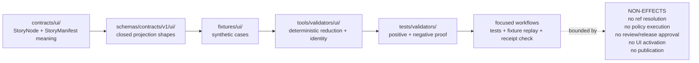
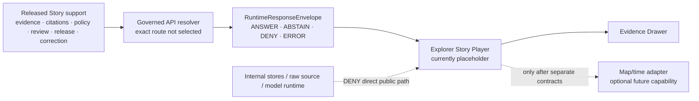

<!-- [KFM_META_BLOCK_V2]
doc_id: kfm://doc/architecture/story/readme
title: Story Subsystem Architecture
type: standard
version: v0.3
status: draft; repository-grounded
owners:
  - "OWNER_TBD — Story subsystem stewardship assignment is not verified"
reviewers_required:
  - Architecture steward
  - Story and UI steward
  - Evidence and citation steward
  - Policy and sensitivity steward
  - Release and correction steward
  - Accessibility reviewer
  - Docs steward
created: 2026-05-10
updated: 2026-08-14
policy_label: public
truth_posture: cite-or-abstain
owning_root: docs/
responsibility: "Explain the current Story subsystem boundary, its bounded executable public-safe projection profiles, the absent playback/runtime surfaces, and the governed path from released support to narrative presentation without creating contract, policy, release, or publication authority."
current_path: docs/architecture/story/README.md
evidence_snapshot:
  repository: bartytime4life/Kansas-Frontier-Matrix
  base_ref: main
  base_commit: 3974da9794fa11bd5355c49243c9193d22b9e81e
  target_prior_blob: a7669fc421d2027aa977743bf215ba7fbd7b0bd0
  directory_rules_blob: fd49a0b83e55cef52c1124281f093e263526898d
  codeowners_blob: dd2a84aa514d8ecd9208bc347f90f9a2ed37dd61
  story_manifest_contract_blob: e0365d00a36f1aef57ed7dd1a051b4c70dec09b2
  story_node_contract_blob: 694cbe4833d785f25f55f3def2b8fdfad7b98b78
  story_manifest_schema_blob: 67fa2fae5534ffc7a277fae8adfcb9afb81e9fc0
  story_node_schema_blob: fd2e40bb8a5167bb592dbb9c42e0219565bf4b48
  story_manifest_fixture_blob: 98e1ce24cacae42a19134c45ed3158a724282684
  story_manifest_test_blob: c8ccdb1fef0b277f759a340b993bf9c8684622e1
  story_manifest_workflow_blob: 6ef97ac0adb3207d92ed8e421a022e578825ce7d
  story_node_workflow_blob: 8e30f4ceee7dac109a1e53b2aba00281c9721bfd
  story_player_entry_blob: 9ded576ec8af3fa2405100b50e4524e312b0ed6c
  story_policy_stub_blob: 9f3791db0da8a91ef3d10c7152fc738eb53139c3
inspection_boundary: >
  Current-session GitHub reads against the exact main commit covering this file,
  the Story architecture directory, accepted Directory Rules authority, ADR and
  CODEOWNERS posture, UI StoryManifest and StoryNode contracts and schemas,
  synthetic fixtures, validators, focused tests and workflows, Story Player feature
  inventory, Story policy stub, Governed API route inventory, MapLibre decision
  lineage, and the non-canonical data/manifests/story compatibility lane. No local
  clone, deployed Story route, browser playback, runtime trace, policy evaluation,
  EvidenceBundle resolution, release, correction drill, or publication was exercised.
related:
  - docs/architecture/README.md
  - docs/architecture/story/CONTINUITY.md
  - docs/architecture/ui/README.md
  - docs/architecture/ui/STORY_PLAYER.md
  - docs/architecture/ui/GOVERNED_SHELL.md
  - docs/architecture/ui/EVIDENCE_DRAWER.md
  - docs/architecture/ui/MAP_RUNTIME_BOUNDARY.md
  - docs/adr/ADR-0001-schema-home--schemas-contracts-v1-is-canonical.md
  - docs/adr/ADR-0006-maplibre-boundary--only-maplibreadapter-imports-maplibre.md
  - "docs/adr/ADR-0007 — MapLibre GL JS Is the Sole Browser-Side Renderer.md"
  - docs/adr/ADR-0029-adopt-directory-governance-standard-v2.md
  - docs/doctrine/directory-rules.md
  - contracts/ui/story_manifest.md
  - contracts/ui/story_node.md
  - contracts/story/README.md
  - schemas/contracts/v1/ui/story_manifest.schema.json
  - schemas/contracts/v1/ui/story_node.schema.json
  - fixtures/ui/story_manifest/cases.json
  - fixtures/ui/story_node/
  - tools/validators/ui/validate_story_manifest.py
  - tools/validators/ui/validate_story_node.py
  - tests/validators/test_validate_story_manifest.py
  - tests/validators/test_validate_story_node.py
  - .github/workflows/story-manifest-trust-inheritance.yml
  - .github/workflows/story-node-trust-inheritance.yml
  - apps/explorer-web/src/features/story_player/README.md
  - apps/explorer-web/src/features/story_player/index.tsx
  - policy/story/README.md
  - policy/story/evidence_continuity_required.rego
  - data/manifests/story/README.md
tags: [kfm, architecture, story, story-manifest, story-node, public-safe-projection, evidence, finite-outcomes, correction, maplibre, ui]
notes:
  - "v0.3 is a same-path, documentation-only, repository-grounded reconciliation. It does not alter contracts, schemas, validators, fixtures, workflows, policy, app code, runtime behavior, release state, or publication."
  - "The current executable Story proof is bounded to synthetic public-safe StoryNode and StoryManifest projection validation; it is not Story playback or narrative truth."
  - "Story Player code remains a one-export greenfield placeholder, Story policy remains a non-enforcing stub, and no Story route exists in the inspected Governed API route inventory."
  - "ADR-0007 remains proposed; this file does not accept a renderer decision, create packages/maplibre-runtime, admit a plugin, or activate 3D."
  - "Stable v0.2 anchors are retained, including #3d-handoff-boundary, but stale no-repo and proposed-path claims are replaced with current repository evidence."
[/KFM_META_BLOCK_V2] -->

<a id="top"></a>

# Story Subsystem Architecture

> **A governed narrative boundary over public-safe Story projections—not a narrative truth engine.** KFM can organize released, cited, policy-safe material into ordered Story surfaces, but every consequential claim remains subordinate to evidence, policy, review, release, correction, and rollback.

[](#status--authority)
[](#fixtures-validators-tests)
[](#components)
[](#repository-preflight)
[](#governed-api-surface)
[](#3d-handoff-boundary)
[](#status--authority)

> [!IMPORTANT]
> **Current executable scope is narrower than the prior architecture prose.** The repository now has closed, deterministic, fixture-first `StoryNode` and `StoryManifest` **public-safe projection** profiles. It does not have a functioning Story Player, a Story route in the inspected Governed API, an enforcing Story policy bundle, a verified Story evidence resolver, or an admitted 3D runtime. A green projection test proves local shape and trust-reduction behavior only.

> [!CAUTION]
> **Story order is not evidence order.** Node sequence, narrative language, camera movement, map state, screenshots, 3D scenes, generated summaries, and polished presentation cannot upgrade evidence, policy, review, release, or correction state. The least-permissive constituent posture controls a composite Story projection.

**Quick navigation:** [Status](#status--authority) · [Evidence](#repository-preflight) · [Scope](#scope) · [Repo fit](#repo-fit) · [Inputs](#accepted-inputs) · [Exclusions](#what-does-not-belong-here) · [Invariants](#non-negotiable-invariants) · [Architecture](#architecture-overview) · [Schemas](#schemas) · [API](#governed-api-surface) · [Components](#components) · [Validation](#fixtures-validators-tests) · [Outcomes](#finite-outcomes--negative-states) · [3D](#3d-handoff-boundary) · [Reality boundary](#reality-boundary-notes-in-stories) · [First runtime slice](#definition-of-done--first-slice) · [Rollback](#rollback-path) · [Propagation](#update-propagation-matrix) · [Related](#related-folders) · [ADRs](#adrs) · [Open work](#open-questions--needs-verification)

---

<a id="status--authority"></a>

## Status & Authority

| Field | Current value |
|---|---|
| **Document edition** | `v0.3` — repository-grounded same-path reconciliation |
| **Tracked path** | `docs/architecture/story/README.md` |
| **Owning root** | `docs/` — explanatory architecture documentation |
| **Placement authority** | Accepted [`ADR-0029`](../../adr/ADR-0029-adopt-directory-governance-standard-v2.md) and the adopted [`Directory Rules v2`](../../doctrine/directory-rules.md) |
| **Document authority** | Explanatory only; this file does not define machine shape, execute policy, approve review/release, or publish |
| **Current executable Story scope** | Closed synthetic `StoryNode` and `StoryManifest` public-safe projection validators, fixtures, tests, and focused workflows |
| **Current player/runtime scope** | Placeholder only; no functioning Story Player established |
| **Current Story API scope** | No Story route in the inspected Governed API route inventory |
| **Current Story policy scope** | Documentation plus a non-enforcing Rego stub |
| **Current 3D scope** | No Story 3D implementation or accepted Story 3D admission decision established |
| **Review route** | `.github/CODEOWNERS` routes repository review to `@bartytime4life`; stewardship assignment and completed independent review remain unverified |
| **Effect of this revision** | Documentation only |
| **Release/publication effect** | None |

### Architecture, projection proof, playback, and release are separate states

1. **Architecture documentation** explains the intended boundary.
2. **Projection proof** validates bounded synthetic public-safe shapes and trust inheritance.
3. **Playback implementation** would resolve and render those projections through governed interfaces.
4. **Governed release** would authorize an exact Story artifact or service for a named audience and rollback target.

No state implies the next. A schema, fixture, validator, workflow, pull request, merge, renderer, or generated narrative is not publication authority.

[Back to top](#top)

---

<a id="repository-preflight"></a>

## Repository Preflight

This revision is grounded in `main@3974da9794fa11bd5355c49243c9193d22b9e81e`.

| Surface | CONFIRMED current state | Safe conclusion |
|---|---|---|
| Story architecture lane | This README and [`CONTINUITY.md`](./CONTINUITY.md) are the direct files under `docs/architecture/story/`. | The lane exists; its prose does not prove runtime behavior. |
| UI StoryManifest contract | [`contracts/ui/story_manifest.md`](../../../contracts/ui/story_manifest.md) defines a proposed fixture-only public-safe composite. | Current executable profile is a bounded projection, not a playback manifest or release object. |
| UI StoryNode contract | [`contracts/ui/story_node.md`](../../../contracts/ui/story_node.md) defines a closed public-safe node projection. | A valid node inherits trust; it does not create evidence or authority. |
| StoryManifest schema | [`schemas/contracts/v1/ui/story_manifest.schema.json`](../../../schemas/contracts/v1/ui/story_manifest.schema.json) exists and is closed. | The old `schemas/contracts/v1/story/` claim is not current repository fact. |
| StoryNode schema | [`schemas/contracts/v1/ui/story_node.schema.json`](../../../schemas/contracts/v1/ui/story_node.schema.json) exists and is closed. | Shape proof is present for the UI projection only. |
| Validators and tests | StoryManifest and StoryNode validators, synthetic fixtures, tests, and focused workflows exist. | Deterministic no-network validation is implemented; ref resolution and runtime behavior are not. |
| Story Player feature | [`apps/explorer-web/src/features/story_player/`](../../../apps/explorer-web/src/features/story_player/README.md) contains a substantive README and a one-export placeholder entry. | No player, route wiring, hooks, transitions, motion, accessibility behavior, or map integration is established. |
| Story policy | [`policy/story/evidence_continuity_required.rego`](../../../policy/story/evidence_continuity_required.rego) says it is a proposed stub with no real rules. | No enforcing Story evidence-continuity policy is established. |
| Governed API routes | The inspected Python route package contains bootstrap, layers, evidence, and registry surfaces; no Story route is present. | Earlier concrete Story endpoint names remain design lineage, not current behavior. |
| Renderer decision | `ADR-0007` exists but remains effectively proposed; current MapLibre code is scaffold-level. | Do not claim a sole-renderer implementation, admitted plugin set, or Story 3D path. |
| Historical manifest lane | [`data/manifests/story/README.md`](../../../data/manifests/story/README.md) marks that lane non-canonical and compatibility-only. | Do not place new StoryManifest or ReleaseManifest authority there. |

### Evidence exclusions

This revision does **not** claim:

- a deployed Story service, public Story route, or browser playback flow;
- evidence, citation, policy, review, release, correction, or rollback reference resolution;
- a production StoryManifest format for camera, time, layers, transitions, or bodies;
- an accepted Story contract-family convergence between `contracts/ui/` and `contracts/story/`;
- a current exact-head green result for every focused Story workflow;
- a functioning MapLibre adapter or any admitted 3D plugin;
- a released or published Story.

[Back to top](#top)

---

<a id="scope"></a>

## Scope

This document explains the boundary between two different Story concerns that prior prose blurred:

### Current bounded concern — public-safe projection

The repository can validate:

- one public-safe `StoryNode` projection with finite state, outcome, reason code, safe display text, governed references, trust posture, caveats, and optional supersession;
- one public-safe `StoryManifest` projection that orders bounded node snapshots and reduces every trust dimension to the least-permissive constituent state;
- deterministic identity and negative cases over synthetic fixtures;
- explicit non-effects: no ref resolution, no policy execution, no release approval, no UI activation, and no publication.

### Future concern — governed playback

A later implementation may:

- retrieve a reviewed Story projection through the Governed API;
- resolve node bodies and supporting objects through governed interfaces;
- render finite states in Explorer Web;
- preserve map, time, Evidence Drawer, correction, and accessibility continuity;
- add motion, camera, layer, or 3D behavior only after separate contracts and gates exist.

**Out of scope for this document revision**

- changing the current Story contracts or schemas;
- implementing a Story API or player;
- accepting a renderer or package-home decision;
- activating Story policy;
- choosing a release-manifest Story sublane;
- migrating or retiring `data/manifests/story/`;
- releasing, deploying, or publishing Story content.

[Back to top](#top)

---

<a id="repo-fit"></a>

## Repo fit

Directory Rules place this file under `docs/architecture/` because its sole responsibility is human explanation. Current and proposed Story responsibilities remain split by owner:

| Responsibility | Current home | Current status |
|---|---|---|
| Cross-root Story architecture explanation | `docs/architecture/story/README.md` | **CONFIRMED** tracked document |
| Story continuity lineage | `docs/architecture/story/CONTINUITY.md` | **CONFIRMED** tracked but stale lineage document |
| UI StoryManifest meaning | `contracts/ui/story_manifest.md` | **CONFIRMED** proposed fixture-only semantic contract |
| UI StoryNode meaning | `contracts/ui/story_node.md` | **CONFIRMED** proposed fixture-first semantic contract |
| General Story semantic lane | `contracts/story/README.md` | **CONFIRMED** proposal-only lane; overlap remains unresolved |
| UI StoryManifest machine shape | `schemas/contracts/v1/ui/story_manifest.schema.json` | **CONFIRMED** closed schema |
| UI StoryNode machine shape | `schemas/contracts/v1/ui/story_node.schema.json` | **CONFIRMED** closed schema |
| Synthetic projection fixtures | `fixtures/ui/story_manifest/`, `fixtures/ui/story_node/` | **CONFIRMED** fixture lanes |
| Reusable projection validation | `tools/validators/ui/` | **CONFIRMED** validators |
| Enforceability tests | `tests/validators/` | **CONFIRMED** focused tests |
| Focused CI | `.github/workflows/story-*-trust-inheritance.yml` | **CONFIRMED** workflow files; exact-head green state not claimed here |
| App-local Story playback | `apps/explorer-web/src/features/story_player/` | **CONFIRMED** README plus placeholder entry only |
| Story policy | `policy/story/` | **CONFIRMED** README and non-enforcing stub |
| Story API implementation | Current Governed API Python route package | **ABSENT in inspected inventory** |
| Historical manifest compatibility | `data/manifests/story/` | **CONFIRMED NON-CANONICAL** routing/retirement boundary |
| Story release objects | `release/` family | **NEEDS VERIFICATION** for an accepted Story sublane and actual records |

> [!WARNING]
> **Do not create a second authority because an old architecture path names it.** In particular, do not add parallel `schemas/contracts/v1/story/`, `packages/maplibre-runtime/`, or a new Story manifest store merely to match this document's prior v0.2 wording. Resolve object meaning and physical package homes against current contracts, ADRs, Directory Rules, consumers, and migration evidence first.

[Back to top](#top)

---

<a id="accepted-inputs"></a>

## Accepted inputs

### Current executable validation inputs

The current validators accept **bounded synthetic projections** only:

- `StoryNode` JSON matching `kfm.ui.story-node.public-safe.v1`;
- `StoryManifest` JSON matching `kfm.ui.story-manifest.public-safe.v1`;
- governed opaque references rather than raw URLs, source payloads, prompts, coordinates, or internal handles;
- explicit trust state for rights, sensitivity, policy, review, release, freshness, and correction;
- fixed authority guards: `authoritative: false` and `projection_only: true`.

The StoryManifest validator consumes **prevalidated constituent snapshots**. It does not fetch or dereference a StoryNode.

### Future playback inputs — PROPOSED

A governed player should accept only:

- a schema-valid public-safe StoryManifest projection returned by the Governed API;
- independently resolved StoryNode projections or governed body references;
- released evidence and citation-validation references;
- public-safe policy, review, release, freshness, correction, and rollback projections;
- map/time context only through accepted shell and adapter contracts;
- optional Focus output only through a finite, cited governed envelope.

[Back to top](#top)

---

<a id="what-does-not-belong-here"></a>

## What does NOT belong here

- Direct browser access to RAW, WORK, QUARANTINE, canonical/internal stores, graph stores, object stores, vector indexes, or model runtimes.
- Narrative claims supported only by prose, pixels, animation, a map layer, a screenshot, a graph edge, a score, or generated text.
- Raw evidence payloads, source snapshots, prompts, chain-of-thought, credentials, PII, or precise restricted geometry inside Story projections.
- Release manifests, promotion decisions, proofs, receipts, or published payloads under `docs/architecture/story/`.
- New StoryManifest or ReleaseManifest instances under the non-canonical `data/manifests/story/` compatibility lane.
- Direct Story feature imports of renderer libraries or model providers.
- A `packages/maplibre-runtime/` peer created beside `packages/maplibre/` without a reviewed physical-home decision and migration plan.
- Concrete Story API paths presented as current behavior before a route, contract, tests, and envelope integration exist.
- 3D plugin activation or synthetic reconstruction presented as evidence.
- A passing projection validator presented as evidence resolution, policy approval, review, release, deployment, or publication.

[Back to top](#top)

---

<a id="non-negotiable-invariants"></a>

## Non-negotiable invariants

1. **Narrative is not truth.** Story surfaces arrange public-safe projections; they never become source or evidence authority.
2. **Cite or abstain.** A future consequential Story claim must resolve through `EvidenceRef → EvidenceBundle` and citation validation, or render a bounded non-answer.
3. **Least-permissive composition.** A StoryManifest cannot be more permissive than any constituent node or any trust dimension.
4. **Finite outward outcomes.** Runtime presentation uses `ANSWER`, `ABSTAIN`, `DENY`, or `ERROR`; local validators use their own `PASS`/`DENY` grammar and must not be confused with runtime authorization.
5. **Governed interfaces only.** Public clients consume public-safe projections and released artifacts through governed adapters.
6. **No support leakage.** Blocked and error projections expose only the public-safe reason surface permitted by their contracts.
7. **Correction is visible.** Corrected, withdrawn, and superseded nodes/manifests preserve governed replacement and correction references.
8. **Projection proof is bounded.** Schema, fixture, validator, and workflow success does not prove refs, policy, review, release, playback, or publication.
9. **Map and AI remain downstream.** Camera state, layers, 3D scenes, Focus text, and generated narration cannot upgrade support.
10. **Promotion is a governed state transition.** A story file, commit, pull request, merge, deployment, route, or screenshot does not create `PUBLISHED` state.
11. **Sensitive material fails closed.** Unknown rights, sovereignty, living-person data, DNA, rare-species locations, archaeology, infrastructure, or harmful precision requires denial, abstention, generalization, or staged access.
12. **Paths do not grant authority.** Every Story artifact remains governed by its object family and lifecycle state, regardless of filename or folder.

[Back to top](#top)

---

<a id="architecture-overview"></a>

## Architecture overview

### CONFIRMED bounded projection lane


```mermaid
flowchart LR
    C["contracts/ui/<br/>StoryNode + StoryManifest meaning"]
    S["schemas/contracts/v1/ui/<br/>closed projection shapes"]
    F["fixtures/ui/<br/>synthetic cases"]
    V["tools/validators/ui/<br/>deterministic reduction + identity"]
    T["tests/validators/<br/>positive + negative proof"]
    W["focused workflows<br/>tests + fixture replay + receipt check"]

    C --> S --> F --> V --> T --> W

    N["NON-EFFECTS<br/>no ref resolution<br/>no policy execution<br/>no review/release approval<br/>no UI activation<br/>no publication"]
    W -. bounded by .-> N
```

The implemented proof asks: **does this synthetic public-safe projection obey its closed profile and fail-closed trust rules?** It does not ask whether a Story is true or playable.

### PROPOSED governed playback lane


```mermaid
flowchart LR
    R["Released Story support<br/>evidence · citations · policy · review · release · correction"]
    API["Governed API resolver<br/>exact route not selected"]
    E["RuntimeResponseEnvelope<br/>ANSWER · ABSTAIN · DENY · ERROR"]
    P["Explorer Story Player<br/>currently placeholder"]
    D["Evidence Drawer"]
    M["Map/time adapter<br/>optional future capability"]

    R --> API --> E --> P
    P --> D
    P -. only after separate contracts .-> M

    I["Internal stores / raw source / model runtime"]
    I -. DENY direct public path .-> P
```

The proposed playback lane must not be inferred from the existence of the projection lane.

[Back to top](#top)

---

<a id="schemas"></a>

## Schemas

### Current machine profiles

| Object | Current schema | What it proves locally | What it does not prove |
|---|---|---|---|
| `StoryNode` | [`schemas/contracts/v1/ui/story_node.schema.json`](../../../schemas/contracts/v1/ui/story_node.schema.json) | Closed public-safe node shape, finite posture fields, governed refs, trust state, correction/supersession shape | Source authority, evidence resolution, citation validity, policy execution, review/release authenticity, UI behavior |
| `StoryManifest` | [`schemas/contracts/v1/ui/story_manifest.schema.json`](../../../schemas/contracts/v1/ui/story_manifest.schema.json) | Closed composite shape, ordered constituent snapshots, least-permissive trust reduction, visible limiting nodes/reasons, correction/supersession shape | StoryNode dereference, narrative body, camera/time/layer playback, policy evaluation, release, UI behavior |

### Contract-family boundary

The executable profiles are paired with `contracts/ui/story_node.md` and `contracts/ui/story_manifest.md`. The separate [`contracts/story/README.md`](../../../contracts/story/README.md) remains a broader proposal lane. Until reviewers choose one semantic relationship, this architecture does not authorize duplicate `StoryNode` or `StoryManifest` contracts under `contracts/story/`.

### Not currently established

The following prior v0.2 shapes are **PROPOSED**, not current files in the inspected canonical Story schema lane:

- a playback-oriented `StoryManifest` carrying camera, layer, time, transition, and return-condition objects;
- separate `StoryTransition` and `StoryEvidenceGate` schemas;
- a Story-owned `SceneManifest`;
- Story-specific 3D admission or plugin-admission schemas;
- a `StorySnapshot` release or receipt schema.

A future design should prefer composition with existing UI, evidence, runtime, policy, release, and correction contracts rather than duplicating them.

[Back to top](#top)

---

<a id="governed-api-surface"></a>

## Governed API surface

**CONFIRMED:** no Story route exists in the inspected `apps/governed-api/src/governed_api/routes/` inventory. The repository's current route implementation is Python, while prior Story prose named TypeScript files and concrete `/api/v1/stories/...` paths. Those names are lineage only.

A first governed Story API design must decide, through current contracts and tests:

| Capability | Required boundary |
|---|---|
| Resolve a StoryManifest projection | Validate the public-safe UI schema and return a finite runtime envelope |
| Resolve a StoryNode or governed body reference | Keep evidence, policy, review, release, and correction resolution server-side |
| Expose a blocked or abstained Story | Return a public-safe reason surface without leaking support or restricted detail |
| Preserve correction/supersession | Return replacement/correction references through governed projections |
| Support idempotency and caching | Bind response identity to accepted contract, schema, release, and correction state |
| Support map/time playback later | Add only after a separate adapter contract and state-ownership decision |

> [!IMPORTANT]
> No endpoint path should become public contract by repetition in this README. Select path, verb, envelope, auth, caching, and versioning through the Governed API's current conventions and focused compatibility tests.

[Back to top](#top)

---

<a id="components"></a>

## Components

### Current repository inventory

| Surface | CONFIRMED current state |
|---|---|
| `apps/explorer-web/src/features/story_player/README.md` | Substantive app-local boundary documentation |
| `apps/explorer-web/src/features/story_player/index.tsx` | Greenfield placeholder exporting `placeholder = true` |
| Story Player component, hooks, state machine, transitions | Not found in the inspected feature directory |
| Story route wiring | Not established |
| Evidence Drawer handoff | Not established for Story playback |
| Accessibility and reduced-motion behavior | Not established for Story playback |
| Story telemetry | Not established |
| Story map/time integration | Not established |
| Story 3D integration | Not established |

### Smallest future component set — PROPOSED

The first playback implementation should remain deliberately smaller than the old architecture:

1. a typed governed Story resolver interface;
2. a finite-state Story card/list renderer for current public-safe projections;
3. visible limiting-node, reason-code, caveat, correction, and supersession UI;
4. an Evidence Drawer handoff only for governed support refs;
5. keyboard, focus, and screen-reader coverage;
6. a feature flag and kill switch;
7. no map motion, camera paths, renderer imports, 3D, model calls, source activation, or publication.

This boundary lets KFM prove projection-to-UI integrity before adding orchestration complexity.

[Back to top](#top)

---

<a id="fixtures-validators-tests"></a>

## Fixtures, validators, tests

| Packet | CONFIRMED coverage | Boundary |
|---|---|---|
| StoryManifest fixtures | Synthetic base plus valid and negative trust-reduction cases under `fixtures/ui/story_manifest/cases.json` | No node dereference or real Story content |
| StoryManifest validator | Closed schema, bounded JSON reader, ordered/unique constituents, least-permissive trust reduction, limiting refs/reasons, correction/supersession, JCS SHA-256 identity | No network, policy execution, evidence/citation verification, review/release approval |
| StoryManifest tests | 17 exact cases: 6 `PASS`, 11 `DENY`; deterministic identity; network denial; no raw body/claim/geometry/source payload | Local enforceability only |
| StoryManifest workflow | Unit tests, fixture replay, generated-authoring-receipt integrity | Workflow file exists; this doc does not claim current exact-head success |
| StoryNode packet | Closed schema, fixtures, validator, tests, generated receipt, focused workflow | Public-safe node projection only |
| Story policy | One non-enforcing Rego stub | No policy proof |

Run the focused projection checks from a repository checkout:

```bash
python -m unittest tests.validators.test_validate_story_manifest -v
python tools/validators/ui/validate_story_manifest.py --fixtures
python -m unittest tests.validators.test_validate_story_node -v
python tools/validators/ui/validate_story_node.py --fixtures
```

A future runtime PR must add its own API, UI, accessibility, integration, denial, correction, and rollback tests. It must not claim that these fixture suites cover playback.

[Back to top](#top)

---

<a id="finite-outcomes--negative-states"></a>

## Finite outcomes & negative states

### Public-safe StoryNode projection

| Node state | Runtime outcome | Meaning |
|---|---|---|
| `READY` | `ANSWER` | Released, reviewed, current, policy-allowed, citation-backed projection may render |
| `PARTIAL` | `ABSTAIN` | Bounded status only; support is incomplete, generalized, pending, stale, or unreleased |
| `ABSTAINED` | `ABSTAIN` | No authoritative node content is available |
| `BLOCKED` | `DENY` | Public-safe denial; no evidence/body/support leakage |
| `ERROR` | `ERROR` | Bounded upstream/system failure |
| `SUPERSEDED` | `ABSTAIN` | Prior node is withdrawn/replaced; replacement and correction posture remain visible |

### StoryManifest composite

The manifest derives its state from the worst effective constituent state and reduces rights, sensitivity, policy, review, release, freshness, and correction independently to the least-permissive value. `limiting_node_refs` and `reason_codes` make the controlling constituents visible.

### Validator versus runtime vocabulary

- Projection validators emit local `PASS` or `DENY`.
- Public/runtime surfaces emit `ANSWER`, `ABSTAIN`, `DENY`, or `ERROR`.
- A validator `PASS` means the synthetic payload conforms to the bounded profile. It is not a runtime `ANSWER`, policy allow, release approval, or publication decision.

[Back to top](#top)

---

<a id="3d-handoff-boundary"></a>

## 3D handoff boundary

> [!NOTE]
> **Anchor retained for compatibility; “handoff” is not current implementation.** The prior v0.2 text treated `packages/maplibre-runtime/`, a plugin registry, and per-layer 3D admission as if they formed the selected upstream architecture. Current evidence does not support that claim.

### Current status

- [`ADR-0007`](../../adr/ADR-0007%20%E2%80%94%20MapLibre%20GL%20JS%20Is%20the%20Sole%20Browser-Side%20Renderer.md) is a numbered **proposed** decision, not accepted authority.
- [`ADR-0006`](../../adr/ADR-0006-maplibre-boundary--only-maplibreadapter-imports-maplibre.md) is the related proposed renderer-import seam.
- The current physical package lane is `packages/maplibre/` and remains scaffold-level.
- `packages/maplibre-runtime/` was absent in the inspected renderer evidence; do not create it as a peer by documentation implication.
- No Story 3D admission schema, policy evaluator, plugin registry, runtime host, browser probe, or Story integration is established.
- No Cesium package was found at the checked path in the ADR evidence, but bounded absence is not a complete repository dependency proof.

### Future 3D rule — PROPOSED

Any future Story 3D capability must:

1. remain downstream of released evidence and policy;
2. preserve a 2D evidence baseline and a non-3D accessible alternative;
3. make 2.5D, captured 3D, modeled 3D, and synthetic reconstruction visibly distinct;
4. perform sensitivity/generalization before rendering, not through style hiding;
5. use one reviewed physical renderer-adapter home;
6. admit every plugin/dependency through pinned supply-chain, license, capability, test, and rollback evidence;
7. emit a public-safe finite outcome when capability or evidence continuity fails;
8. remain feature-flagged and reversible.

**HOLD:** no 3D mode should be enabled for Story until the renderer-family decision, adapter home, plugin admission, evidence parity, accessibility, negative tests, and rollback are reviewed and implemented.

[Back to top](#top)

---

<a id="reality-boundary-notes-in-stories"></a>

## Reality Boundary Notes in stories

A `RealityBoundaryNote` is useful design vocabulary for telling users whether a scene is observed, captured, derived, modeled, reconstructed, or synthetic. It is **not a current Story schema or runtime object in the inspected implementation**.

A future Story scene that uses modeled or reconstructed content should expose, at minimum:

| Concern | Required public-safe disclosure |
|---|---|
| Representation class | observed/captured · derived · modeled · reconstructed · synthetic |
| Source role | what the source can and cannot support |
| Spatial/temporal scope | where and when the representation applies |
| Method and limitations | transform, interpolation, reconstruction, or uncertainty |
| Evidence links | released EvidenceBundle and citation-validation refs |
| Policy transforms | redaction, generalization, delay, or staged-access reason |
| Release/correction state | release ID, correction/supersession, rollback target |
| Accessible alternative | non-3D description or 2D equivalent |

Until a reviewed contract and runtime exist, this document uses “reality boundary” as **PROPOSED presentation guidance**, not as proof that a specific schema, badge, or route exists.

[Back to top](#top)

---

<a id="definition-of-done--first-slice"></a>

## Definition of Done — first slice

The schemas and fixture validators are no longer the first missing slice. The next smallest dependency-closed implementation is a **finite-state, projection-only Story viewer**, not full cinematic playback.

**PROPOSED acceptance boundary**

- [ ] Reuse the current `contracts/ui/` StoryNode and StoryManifest profiles without widening them.
- [ ] Define one governed resolver contract that returns those projections through the current Python Governed API conventions.
- [ ] Add positive `READY/ANSWER` and negative `ABSTAIN`, `DENY`, `ERROR`, and `SUPERSEDED` API fixtures.
- [ ] Implement a feature-flagged Explorer Story surface that renders projection text, caveats, trust state, limiting nodes, reasons, and correction/supersession links.
- [ ] Resolve support refs through governed adapters; never from browser-readable internal stores.
- [ ] Add keyboard, focus, screen-reader, reduced-motion/no-motion, and no-support-leakage tests.
- [ ] Add API/UI contract compatibility and correction/rollback tests.
- [ ] Keep map camera, timeline orchestration, transitions, 3D, plugins, model calls, live sources, release assembly, and publication out of scope.
- [ ] Document the disable path and prove it in the focused test lane.
- [ ] Keep any generated fixture visibly synthetic and non-authoritative.

Only after this slice is reviewed should a separate proposal introduce map/time orchestration or motion.

[Back to top](#top)

---

<a id="rollback-path"></a>

## Rollback path

### This documentation revision

Revert the single commit that changes this file, restoring prior blob `a7669fc421d2027aa977743bf215ba7fbd7b0bd0`. No contract, schema, fixture, validator, workflow, app, policy, data, release, deployment, or published state changes.

### Future Story implementation

| Layer | Fail-safe rollback |
|---|---|
| Contract/schema | Restore the prior versioned profile and fixtures; breaking shape requires a reviewed successor |
| Governed API | Disable the Story resolver/route; return a finite unavailable/error envelope |
| Explorer UI | Disable the Story feature flag; leave the map and other shell surfaces unaffected |
| Evidence/policy resolution | Fail closed to `ABSTAIN`, `DENY`, or `ERROR`; never fall back to raw content |
| Correction/supersession | Preserve prior IDs and public correction links; do not overwrite released history |
| Renderer/3D | Keep off by default; remove or disable the capability without changing Story projection truth |
| Published Story | Issue a new correction/withdrawal/replacement record and move the public pointer; never mutate the prior release in place |

[Back to top](#top)

---

<a id="update-propagation-matrix"></a>

## Update-propagation matrix

| Change | Direct companions that must be reviewed together |
|---|---|
| UI StoryNode meaning or finite posture | Contract · schema · fixtures · validator · tests · workflow · generated authoring receipt · architecture docs |
| UI StoryManifest composite reduction | Contract · schema · fixtures · validator · tests · workflow · generated authoring receipt · Pass 20 source map · architecture docs |
| Governed Story resolver/API | Semantic contract · runtime envelope compatibility · route implementation · fixtures · API tests · docs · rollback |
| Story Player behavior | App-local README · UI implementation · adapter boundary · accessibility tests · telemetry tests · end-to-end negative states |
| Story policy | Policy README/rules · policy fixtures/tests · runtime integration · public-safe reason-code review |
| Correction/supersession | Story contracts/schemas · correction/release contracts · fixtures/tests · UI presentation · cache/pointer behavior |
| Renderer or 3D capability | Accepted ADR(s) · one package home · dependency admission · policy · browser probes · accessibility · rollback · Story docs |
| Story release placement | Release contract and lane decision · manifest/proof/receipt separation · correction/rollback · published payload routing |
| Path move or rename | Directory Rules decision · consumer/link inventory · migration note · compatibility window · rollback |

[Back to top](#top)

---

<a id="related-folders"></a>

## Related folders

| Surface | Relationship |
|---|---|
| [`docs/architecture/README.md`](../README.md) | Parent explanatory architecture boundary |
| [`docs/architecture/story/CONTINUITY.md`](./CONTINUITY.md) | Earlier lineage/continuity record; contains stale no-repo and 3D-handoff assumptions that need a separate reconciliation |
| [`docs/architecture/ui/STORY_PLAYER.md`](../ui/STORY_PLAYER.md) | UI playback doctrine; currently older than the executable projection profiles and still carries proposed Cesium-handoff language |
| [`contracts/ui/story_manifest.md`](../../../contracts/ui/story_manifest.md) | Current bounded StoryManifest projection meaning |
| [`contracts/ui/story_node.md`](../../../contracts/ui/story_node.md) | Current bounded StoryNode projection meaning |
| [`contracts/story/README.md`](../../../contracts/story/README.md) | Broader proposed Story semantic lane; convergence unresolved |
| [`policy/story/README.md`](../../../policy/story/README.md) | Story policy boundary documentation |
| [`apps/explorer-web/src/features/story_player/README.md`](../../../apps/explorer-web/src/features/story_player/README.md) | App-local feature boundary |
| [`data/manifests/story/README.md`](../../../data/manifests/story/README.md) | Non-canonical compatibility/retirement boundary |
| [`examples/story_decks/README.md`](../../../examples/story_decks/README.md) | Non-authoritative Story examples |
| [`docs/intake/exploratory/pass-20-story-manifest-inheritance-source-map.md`](../../intake/exploratory/pass-20-story-manifest-inheritance-source-map.md) | Source-to-repository mapping for the bounded StoryManifest slice |

[Back to top](#top)

---

<a id="adrs"></a>

## ADRs

| ADR | Current status | Story relevance |
|---|---|---|
| [`ADR-0001`](../../adr/ADR-0001-schema-home--schemas-contracts-v1-is-canonical.md) | Proposed | Schema-home direction; does not by itself choose `ui/` versus `story/` object-family placement |
| [`ADR-0006`](../../adr/ADR-0006-maplibre-boundary--only-maplibreadapter-imports-maplibre.md) | Proposed | Renderer import/acquisition seam |
| [`ADR-0007`](../../adr/ADR-0007%20%E2%80%94%20MapLibre%20GL%20JS%20Is%20the%20Sole%20Browser-Side%20Renderer.md) | Proposed | Renderer-family selection and peer-renderer exception boundary |
| [`ADR-0029`](../../adr/ADR-0029-adopt-directory-governance-standard-v2.md) | **Accepted** | Governs placement, one authority owner, parallel-home avoidance, migration, and rollback |

No numbered accepted Story-specific ADR was verified. This README does not invent one, reserve a number, or treat a slug-only scaffold as accepted authority.

[Back to top](#top)

---

<a id="open-questions--needs-verification"></a>

## Open questions / NEEDS VERIFICATION

1. **Contract convergence:** Is `contracts/story/` a future aggregate/domain semantic lane, a compatibility lane, or unnecessary beside the executable `contracts/ui/` projections?
2. **Playback object:** Should a future playback manifest be a new object that references the public-safe StoryManifest projection, or a versioned successor to it?
3. **StoryNode body resolution:** What governed object carries narrative body text, localized content, and editorial review without widening the public-safe projection?
4. **API contract:** Which current Governed API route, authentication, versioning, cache, ETag, correction, and finite-envelope conventions should Story reuse?
5. **Policy enforcement:** Should Story-specific rules live in `policy/story/`, compose existing UI/evidence/release policy, or both?
6. **State ownership:** Which component owns current node, return state, map/time synchronization, cancellation, and feature-flag state?
7. **Path naming:** Should app code remain under `story_player/`, move to `story/`, or use another current feature convention? A move requires consumer and rollback evidence.
8. **Schema composition:** Do `StoryTransition` and `StoryEvidenceGate` need standalone contracts, or should runtime behavior compose existing envelope/evidence/policy objects?
9. **Renderer package home:** Does Story consume `packages/maplibre/`, an app adapter, or a future renamed package? Do not activate both `packages/maplibre/` and `packages/maplibre-runtime/`.
10. **3D admission:** What accepted decision, capability profile, plugin policy, browser proof, accessibility alternative, and reality-boundary contract are required before any 3D Story mode?
11. **Release placement:** Which `release/` sublane owns Story release manifests, and where do released public-safe Story payloads live?
12. **Hosted proof:** What is the latest exact-main result for both Story trust-inheritance workflows, and are either required checks?
13. **Sibling reconciliation:** `CONTINUITY.md`, `docs/architecture/ui/STORY_PLAYER.md`, the app-local README, parent architecture README, and data compatibility README contain different maturity and path claims. Which follow-up sequence closes that drift without broad rewrite?
14. **Owner assignments:** Which verified people or teams hold Story, UI, evidence, policy, accessibility, release, and correction stewardship?
15. **First public value:** Which exact synthetic or released Story scenario is sufficiently low-risk to prove the first resolver/player slice?

Until these are resolved, keep playback, policy, release, and 3D claims bounded and preserve the existing fixture-only proof.

[Back to top](#top)

---

## Appendix A — No-loss reconciliation ledger

| v0.2 material | v0.3 disposition |
|---|---|
| Cite-or-abstain and EvidenceBundle precedence | **Retained** as doctrine |
| Finite outcomes and visible negative states | **Retained** and aligned with current StoryNode/StoryManifest profiles |
| Story sequence, map, time, layer, panel, transition ideas | **Retained as PROPOSED future playback**, not current schema/runtime fact |
| `schemas/contracts/v1/story/` as current Story schema home | **Corrected** to current executable `schemas/contracts/v1/ui/` profiles; future aggregate lane remains open |
| Concrete TypeScript Story route and `/api/v1/stories/...` behavior | **Reclassified** as lineage; no Story route exists in inspected Python route inventory |
| `packages/maplibre-runtime/` as the selected runtime home | **Reclassified** as unresolved; current `packages/maplibre/` scaffold and ADR evidence control |
| Sole MapLibre/retire-Cesium posture | **Bounded** to proposed ADR-0007; not presented as accepted or implemented |
| 3D Admission Decision and Plugin Admission as current objects | **Reclassified** as future requirements; no Story implementation established |
| `data/manifests/story/` as StoryManifest home | **Corrected** to non-canonical compatibility/retirement boundary |
| Story Player implementation claims | **Corrected** to substantive README plus one-export placeholder |
| Story policy maturity | **Corrected** to non-enforcing stub |
| Fixtures and validators as proposed | **Updated** to CONFIRMED bounded executable projection packets |
| First slice centered on creating Story schemas | **Updated** to a finite-state projection viewer/resolver because schemas and validators now exist |
| Stable anchors | **Preserved**, including `#3d-handoff-boundary` |

---

## Appendix B — Revision history

| Version | Date | Summary |
|---|---|---|
| `v0.1` | 2026-05 | Initial Story architecture scaffold/expansion |
| `v0.2` | 2026-05-24 | MapLibre-only/3D-admission rewrite based primarily on planning lineage |
| `v0.3` | 2026-08-14 | Repository-grounded reconciliation of current projection proof, runtime/policy/API gaps, renderer proposal status, placement, validation, and rollback |

---

<sub>
This file explains architecture. Current machine behavior is determined by the cited contracts, schemas, validators, tests, workflows, code, policy, release records, and runtime evidence at a pinned revision. Where those surfaces disagree with this prose, narrow the claim, record drift, and let the owning authority decide.
</sub>

[Back to top](#top)
