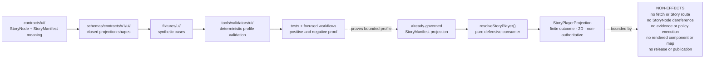
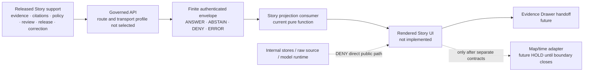

<!-- [KFM_META_BLOCK_V2]
doc_id: kfm://doc/architecture/story/readme
title: Story Subsystem Architecture
type: architecture
version: v0.4
status: draft; repository-grounded; implementation-partial; projection-only; no-publisher
owners:
  - "@bartytime4life — verified CODEOWNERS review route; specialist Story stewardship remains NEEDS VERIFICATION"
reviewers_required:
  - "Story and UI stewardship — assignment NEEDS VERIFICATION"
  - "Evidence and citation stewardship — assignment NEEDS VERIFICATION"
  - "Policy, sensitivity, and rights review — assignment NEEDS VERIFICATION"
  - "Release, correction, and rollback review — assignment NEEDS VERIFICATION"
  - "Accessibility review — assignment NEEDS VERIFICATION"
  - "Independent review — NEEDS VERIFICATION"
  - "Docs stewardship — assignment NEEDS VERIFICATION"
created: 2026-05-10
updated: 2026-08-19
policy_label: public
truth_posture: "CONFIRMED repository evidence / PROPOSED future Story service and rendered playback / UNKNOWN deployed behavior; cite-or-abstain"
owning_root: docs/
responsibility: "Explain the cross-root Story subsystem boundary, the current public-safe StoryNode and StoryManifest projection profiles, the implemented app-local StoryManifest projection consumer, the absent live transport and rendered playback surfaces, and the governed path from released support to narrative presentation without creating contract, policy, release, or publication authority."
current_path: docs/architecture/story/README.md
evidence_snapshot:
  repository: bartytime4life/Kansas-Frontier-Matrix
  base_ref: main
  base_commit: d639f9ff40288d12244cd7bc84af538652f6dfb1
  target_prior_blob: e5b22c5ad324dfbbd4482ca4da0c854e1bc46260
  directory_rules_blob: fd49a0b83e55cef52c1124281f093e263526898d
  codeowners_blob: dd2a84aa514d8ecd9208bc347f90f9a2ed37dd61
  story_manifest_contract_blob: e0365d00a36f1aef57ed7dd1a051b4c70dec09b2
  story_node_contract_blob: 694cbe4833d785f25f55f3def2b8fdfad7b98b78
  story_manifest_schema_blob: 67fa2fae5534ffc7a277fae8adfcb9afb81e9fc0
  story_node_schema_blob: fd2e40bb8a5167bb592dbb9c42e0219565bf4b48
  story_manifest_fixture_blob: 98e1ce24cacae42a19134c45ed3158a724282684
  story_manifest_validator_blob: 4122c5040d71d9098711717466cbb06f7fba2136
  story_manifest_test_blob: c8ccdb1fef0b277f759a340b993bf9c8684622e1
  story_manifest_workflow_blob: 6ef97ac0adb3207d92ed8e421a022e578825ce7d
  story_node_workflow_blob: 8e30f4ceee7dac109a1e53b2aba00281c9721bfd
  story_player_entry_blob: 6c3b3e63b28027e9f21f859beed791e2dd16879d
  story_player_test_blob: 54195d2676ca6f125b8c661c5c52c3adb4c2b16a
  story_player_current_implementation_blob: 7566f69f0a7ff87b461b54098fb00f0c41deed63
  story_player_feature_readme_blob: 4bac3eb49bea7ee9e07d3b3e0466831d96ce2d1b
  story_player_architecture_blob: 526d4e0500b686f18a05426059471d5f6cc65b69
  story_player_receipt_blob: 3d5b6ee9cecdaee803a6bab731f2d7eab11579da
  story_policy_stub_blob: 9f3791db0da8a91ef3d10c7152fc738eb53139c3
  governed_api_routes_readme_blob: 57c6e4b06553cc444a55eb126d0b8e7f42210837
inspection_boundary: >
  Current-session GitHub reads against the exact main commit covering this file,
  the Story architecture directory, accepted Directory Rules authority, ADR and
  CODEOWNERS posture, UI StoryManifest and StoryNode contracts and schemas,
  synthetic fixtures, validators, focused tests and workflows, the implemented
  Explorer Story Player projection consumer and app tests, the current implementation
  note, the modernized UI Story Player architecture page, Story policy boundary,
  Governed API route inventory, renderer-decision lineage, generated authoring receipt,
  and the non-canonical data/manifests/story compatibility lane. Repository search found
  resolveStoryPlayer only in its source, focused app test, and architecture documentation.
  No local clone, local test execution, deployed Story route, browser playback, StoryNode
  body dereference, EvidenceBundle resolution, policy evaluation, accessibility session,
  telemetry stream, release, correction drill, rollback execution, or publication was
  exercised.
related:
  - docs/architecture/README.md
  - docs/architecture/story/CONTINUITY.md
  - docs/architecture/ui/README.md
  - docs/architecture/ui/STORY_PLAYER.md
  - docs/architecture/ui/GOVERNED_SHELL.md
  - docs/architecture/ui/EVIDENCE_DRAWER.md
  - docs/architecture/ui/MAP_RUNTIME_BOUNDARY.md
  - docs/architecture/ui/ACCESSIBILITY.md
  - docs/architecture/ui/TELEMETRY.md
  - docs/adr/ADR-0001-schema-home--schemas-contracts-v1-is-canonical.md
  - docs/adr/ADR-0006-maplibre-boundary--only-maplibreadapter-imports-maplibre.md
  - "docs/adr/ADR-0007 — MapLibre GL JS Is the Sole Browser-Side Renderer.md"
  - docs/adr/ADR-0029-adopt-directory-governance-standard-v2.md
  - docs/doctrine/directory-rules.md
  - contracts/ui/story_manifest.md
  - contracts/ui/story_node.md
  - contracts/story/README.md
  - schemas/contracts/v1/ui/story_manifest.schema.json
  - schemas/contracts/v1/ui/story_node.schema.json
  - fixtures/ui/story_manifest/cases.json
  - fixtures/ui/story_node/
  - tools/validators/ui/validate_story_manifest.py
  - tools/validators/ui/validate_story_node.py
  - tests/validators/test_validate_story_manifest.py
  - tests/validators/test_validate_story_node.py
  - .github/workflows/story-manifest-trust-inheritance.yml
  - .github/workflows/story-node-trust-inheritance.yml
  - apps/explorer-web/src/features/story_player/README.md
  - apps/explorer-web/src/features/story_player/current-implementation.md
  - apps/explorer-web/src/features/story_player/index.tsx
  - apps/explorer-web/tests/story-player.test.ts
  - policy/story/README.md
  - policy/story/evidence_continuity_required.rego
  - data/manifests/story/README.md
  - data/receipts/generated/genrec-story-player-governed-projection-20260814.json
tags: [kfm, architecture, story, story-manifest, story-node, story-player, public-safe-projection, finite-outcomes, evidence, policy, accessibility, correction, map-runtime, no-publisher]
notes:
  - "v0.4 is a same-path, documentation-only reconciliation of merged PR #2868 and the current Story Player architecture evidence."
  - "The executable Story proof now includes closed synthetic StoryNode and StoryManifest projection packets plus a pure 2D-only resolveStoryPlayer view-model consumer."
  - "The consumer does not fetch, route, render, dereference StoryNodes, resolve evidence, execute policy, emit telemetry, release, deploy, or publish."
  - "The app feature README and Story CONTINUITY.md still carry bounded maturity drift and require separate same-path reconciliation."
  - "ADR-0006 and ADR-0007 remain proposed; this file does not accept a renderer decision, create packages/maplibre-runtime, admit a plugin, or activate 3D."
  - "Stable v0.3 anchors are retained, including #3d-handoff-boundary and #definition-of-done--first-slice."
[/KFM_META_BLOCK_V2] -->

<a id="top"></a>

# Story Subsystem Architecture

> **A governed narrative boundary over public-safe Story projections—not a narrative truth engine.** KFM can organize released, cited, policy-safe material into ordered Story surfaces, but every consequential claim remains subordinate to evidence, policy, review, release, correction, and rollback.

[](#status--authority)
[](#fixtures-validators-tests)
[](#components)
[](#governed-api-surface)
[](#repository-preflight)
[](#3d-handoff-boundary)
[](#status--authority)

> [!IMPORTANT]
> **Current executable scope is bounded but no longer a placeholder.** The repository has closed, deterministic, fixture-first `StoryNode` and `StoryManifest` public-safe projection profiles and a pure app-local `resolveStoryPlayer()` consumer. That consumer converts one already-governed `StoryManifest` projection into a fail-closed, non-authoritative, 2D-only view model. It does not provide live transport, node bodies, rendered controls, evidence resolution, policy execution, map playback, release, or publication.

> [!CAUTION]
> **Story order is not evidence order, and `canPlay` is not publication authority.** Node sequence, narrative language, camera movement, map state, screenshots, 3D scenes, generated summaries, tests, receipts, and polished presentation cannot upgrade evidence, policy, review, release, freshness, or correction state.

**Quick navigation:** [Status](#status--authority) · [Evidence](#repository-preflight) · [Scope](#scope) · [Repo fit](#repo-fit) · [Inputs](#accepted-inputs) · [Exclusions](#what-does-not-belong-here) · [Invariants](#non-negotiable-invariants) · [Architecture](#architecture-overview) · [Schemas](#schemas) · [API](#governed-api-surface) · [Components](#components) · [Validation](#fixtures-validators-tests) · [Outcomes](#finite-outcomes--negative-states) · [3D](#3d-handoff-boundary) · [Reality boundary](#reality-boundary-notes-in-stories) · [Next slice](#definition-of-done--first-slice) · [Rollback](#rollback-path) · [Propagation](#update-propagation-matrix) · [Related](#related-folders) · [ADRs](#adrs) · [Open work](#open-questions--needs-verification)

---

<a id="status--authority"></a>

## Status & Authority

| Field | Current value |
|---|---|
| **Document edition** | `v0.4` — repository-grounded, post-#2868 reconciliation |
| **Tracked path** | `docs/architecture/story/README.md` |
| **Owning root** | `docs/` — explanatory architecture documentation |
| **Placement authority** | Accepted [`ADR-0029`](../../adr/ADR-0029-adopt-directory-governance-standard-v2.md) and the adopted [`Directory Rules v2`](../../doctrine/directory-rules.md) |
| **Document authority** | Explanatory only; this file does not define machine shape, execute policy, approve review/release, or publish |
| **Current Story projection scope** | Closed synthetic `StoryNode` and `StoryManifest` contracts, schemas, fixtures, validators, tests, and focused workflows |
| **Current app scope** | Pure `resolveStoryPlayer()` consumer that returns a bounded `StoryPlayerProjection` from one already-governed StoryManifest candidate |
| **Current rendered-playback scope** | Not established; no verified Story component call site, route wiring, controls, node-body rendering, or browser playback |
| **Current Story API scope** | No Story route in the inspected Governed API route inventory |
| **Current Story policy scope** | Documentation plus a non-enforcing Rego stub |
| **Current map/3D scope** | No map rendering; output mode is fixed to `"2D"`; renderer imports and 3D remain on HOLD |
| **Current release/publication scope** | None established |
| **Review route** | `.github/CODEOWNERS` routes review to `@bartytime4life`; specialist stewardship, independent review, and release approval remain unverified |
| **Effect of this revision** | Documentation only |
| **Release/publication effect** | None |

### Five separate maturity states

| State | Current status | Bounded proof | Non-effect |
|---|---|---|---|
| Architecture documentation | **CONFIRMED present** | Story boundaries and dependencies are documented. | Documentation is not machine authority. |
| Public-safe projection profiles | **CONFIRMED executable; contract status PROPOSED** | Closed shapes, finite states, least-permissive inheritance, deterministic identity, and negative cases can be validated offline. | No ref resolution, policy execution, review authentication, or release lookup. |
| App-local projection consumer | **CONFIRMED implemented** | One already-governed projection can become a fail-closed view model. | No transport, rendered player, node bodies, map, or public route. |
| Live governed Story playback | **NOT ESTABLISHED** | — | No deployed/browser playback behavior may be claimed. |
| Governed Story release/publication | **NONE ESTABLISHED** | — | A schema, test, receipt, merge, or `canPlay=true` result is not publication. |

No maturity state implies the next.

[Back to top](#top)

---

<a id="repository-preflight"></a>

## Repository Preflight

This revision is grounded in `main@d639f9ff40288d12244cd7bc84af538652f6dfb1`.

| Surface | CONFIRMED current state | Safe conclusion |
|---|---|---|
| Story architecture lane | This README and [`CONTINUITY.md`](./CONTINUITY.md) are the direct files under `docs/architecture/story/`. | The lane exists; `CONTINUITY.md` remains proposal-era lineage and needs separate reconciliation. |
| UI Story Player architecture | [`docs/architecture/ui/STORY_PLAYER.md`](../ui/STORY_PLAYER.md) now documents the post-#2868 projection consumer and current HOLDs. | It is the detailed UI companion, not runtime or release authority. |
| UI StoryManifest contract | [`contracts/ui/story_manifest.md`](../../../contracts/ui/story_manifest.md) defines a proposed fixture-only public-safe composite. | Current executable profile is a bounded projection, not a production playback or release manifest. |
| UI StoryNode contract | [`contracts/ui/story_node.md`](../../../contracts/ui/story_node.md) defines a closed public-safe node projection. | A valid node inherits trust; it does not create evidence or authority. |
| StoryManifest schema | [`schemas/contracts/v1/ui/story_manifest.schema.json`](../../../schemas/contracts/v1/ui/story_manifest.schema.json) is closed. | Unknown fields such as raw narrative bodies are outside profile. |
| StoryNode schema | [`schemas/contracts/v1/ui/story_node.schema.json`](../../../schemas/contracts/v1/ui/story_node.schema.json) is closed. | Shape proof is present for the UI projection only. |
| Projection validators and tests | StoryManifest and StoryNode validators, synthetic fixtures, tests, and focused workflows exist. | Deterministic no-network profile validation is implemented; reference resolution is not. |
| Story Player source | [`index.tsx`](../../../apps/explorer-web/src/features/story_player/index.tsx) implements `resolveStoryPlayer()`. | The former two-line placeholder claim is stale and corrected here. |
| Story Player app tests | [`story-player.test.ts`](../../../apps/explorer-web/tests/story-player.test.ts) contains 10 focused Vitest cases. | App-local projection eligibility and anti-bypass behavior are tested; rendered playback is not. |
| Current implementation note | [`current-implementation.md`](../../../apps/explorer-web/src/features/story_player/current-implementation.md) records the bounded consumer and explicit non-effects. | It is accurate implementation-boundary documentation, not a release record. |
| App feature README | [`apps/explorer-web/src/features/story_player/README.md`](../../../apps/explorer-web/src/features/story_player/README.md) remains pre-implementation in parts. | Treat its maturity wording as bounded drift pending a separate same-path update. |
| Consumer call sites | Repository search found `resolveStoryPlayer` only in its source, focused test, and architecture documentation. | No verified Explorer navigation or rendered component wiring exists. |
| Story policy | [`policy/story/evidence_continuity_required.rego`](../../../policy/story/evidence_continuity_required.rego) remains a proposed stub with no real rules. | No enforcing Story evidence-continuity policy is established. |
| Governed API routes | The inspected Python route package contains bootstrap, evidence, layers, and registry surfaces; no Story route is present. | Earlier concrete Story endpoint names remain lineage, not current behavior. |
| Generated receipt | [`genrec-story-player-governed-projection-20260814.json`](../../../data/receipts/generated/genrec-story-player-governed-projection-20260814.json) binds the initial consumer artifacts. | Process memory is not human review, policy, proof, release, or publication. |
| Renderer decision | `ADR-0006` and `ADR-0007` remain proposed; current Story code imports no renderer. | Do not claim a renderer implementation, admitted plugin set, or Story 3D path. |
| Historical manifest lane | [`data/manifests/story/README.md`](../../../data/manifests/story/README.md) marks that lane non-canonical and compatibility-only. | Do not place new StoryManifest or ReleaseManifest authority there. |

### Evidence exclusions

This revision does **not** claim:

- a deployed Story service, public Story route, or browser playback flow;
- StoryNode body retrieval or narrative-authoring behavior;
- evidence, citation, policy, review, release, correction, or rollback reference resolution;
- a production StoryManifest format for camera, time, layers, transitions, localization, or bodies;
- accepted contract-family convergence between `contracts/ui/` and `contracts/story/`;
- current exact-head success for every Story, UI, documentation, or aggregate workflow;
- a functioning map adapter, renderer host, or admitted 3D plugin;
- an accessibility interaction audit, telemetry stream, export path, correction drill, release, or published Story.

[Back to top](#top)

---

<a id="scope"></a>

## Scope

This document explains three Story concerns that must remain separate.

### Current concern A — public-safe projection profiles

The repository can validate:

- one `StoryNode` public-safe projection with finite state, outcome, reason code, safe display text, governed references, trust posture, caveats, and optional supersession;
- one `StoryManifest` public-safe projection that orders bounded constituent snapshots and reduces rights, sensitivity, policy, review, release, freshness, and correction to the least-permissive posture;
- deterministic identity and positive/negative behavior over synthetic fixtures;
- explicit non-effects: no ref resolution, no policy execution, no release approval, no UI activation, and no publication.

### Current concern B — app-local projection consumption

`resolveStoryPlayer()` now:

1. accepts one unknown candidate value;
2. requires the exact closed `kfm.ui.story-manifest.public-safe.v1` profile;
3. rejects unknown keys and malformed boundary fields;
4. permits node-list projection only for fully public-safe `READY / ANSWER` support;
5. returns finite `ANSWER`, `ABSTAIN`, `DENY`, or `ERROR` outcomes;
6. remains non-authoritative and fixed to `mode: "2D"`;
7. performs no transport, dereference, policy, release, mutation, renderer, or model operation.

### Future concern — governed rendered playback

A later dependency-closed implementation may:

- retrieve an authenticated Story projection through the Governed API;
- reuse the authoritative EvidenceRef-to-EvidenceBundle resolver;
- resolve permitted StoryNode bodies through governed interfaces;
- execute Story policy and bind review, release, freshness, correction, and rollback state;
- render finite states in Explorer Web with keyboard, focus, screen-reader, and reduced-motion support;
- preserve Evidence Drawer, map, time, export, correction, and cache continuity;
- add renderer or 3D behavior only after separate accepted contracts and gates exist.

**Out of scope for this documentation revision**

- changing Story contracts, schemas, fixtures, validators, workflows, policy, app code, or receipts;
- defining or wiring a Story API route;
- rendering a Story component or resolving StoryNode bodies;
- accepting a renderer, adapter-home, package-home, or plugin decision;
- selecting a Story release-manifest sublane;
- migrating or retiring `data/manifests/story/`;
- releasing, deploying, or publishing Story content.

[Back to top](#top)

---

<a id="repo-fit"></a>

## Repo fit

Accepted Directory Rules place this file under `docs/architecture/` because its sole responsibility is human explanation. Story responsibilities remain split by owner and object family:

| Responsibility | Current home | Current status |
|---|---|---|
| Cross-root Story architecture explanation | `docs/architecture/story/README.md` | **CONFIRMED** tracked document |
| Story continuity lineage | `docs/architecture/story/CONTINUITY.md` | **CONFIRMED** tracked proposal-era lineage; reconciliation pending |
| Detailed Story Player UI architecture | `docs/architecture/ui/STORY_PLAYER.md` | **CONFIRMED** current repository-grounded companion |
| UI StoryManifest meaning | `contracts/ui/story_manifest.md` | **CONFIRMED present; PROPOSED fixture-only semantic contract** |
| UI StoryNode meaning | `contracts/ui/story_node.md` | **CONFIRMED present; PROPOSED fixture-first semantic contract** |
| General Story semantic lane | `contracts/story/README.md` | **CONFIRMED** proposal-only lane; overlap remains unresolved |
| UI StoryManifest machine shape | `schemas/contracts/v1/ui/story_manifest.schema.json` | **CONFIRMED** closed schema |
| UI StoryNode machine shape | `schemas/contracts/v1/ui/story_node.schema.json` | **CONFIRMED** closed schema |
| Synthetic projection fixtures | `fixtures/ui/story_manifest/`, `fixtures/ui/story_node/` | **CONFIRMED** fixture lanes |
| Reusable projection validation | `tools/validators/ui/` | **CONFIRMED** validators |
| Contract/profile enforceability tests | `tests/validators/` | **CONFIRMED** focused tests |
| Focused profile CI | `.github/workflows/story-*-trust-inheritance.yml` | **CONFIRMED** workflow files; exact-head status reported separately |
| App-local projection consumer | `apps/explorer-web/src/features/story_player/index.tsx` | **CONFIRMED** pure bounded consumer |
| App-local consumer tests | `apps/explorer-web/tests/story-player.test.ts` | **CONFIRMED** 10 focused Vitest cases |
| App-local implementation note | `apps/explorer-web/src/features/story_player/current-implementation.md` | **CONFIRMED** bounded implementation record |
| App feature README | `apps/explorer-web/src/features/story_player/README.md` | **CONFIRMED** tracked but partly stale maturity prose |
| Story policy | `policy/story/` | **CONFIRMED** README and non-enforcing stub |
| Story API implementation | Current Governed API Python route package | **ABSENT in inspected inventory** |
| Historical manifest compatibility | `data/manifests/story/` | **CONFIRMED NON-CANONICAL** routing/retirement boundary |
| Story release objects | `release/` family | **NEEDS VERIFICATION** for an accepted Story sublane and actual records |
| Story Player authoring receipt | `data/receipts/generated/` | **CONFIRMED** process-memory record, not approval |

> [!WARNING]
> **Do not create a second authority to make old prose look true.** In particular, do not add parallel `schemas/contracts/v1/story/`, `packages/maplibre-runtime/`, Story-local evidence resolvers, or a new Story manifest store merely because proposal-era documents named them. Resolve meaning, ownership, consumers, compatibility, and rollback first.

[Back to top](#top)

---

<a id="accepted-inputs"></a>

## Accepted inputs

### Current profile-validation inputs

The Story validators accept bounded synthetic projections only:

- `StoryNode` JSON matching `kfm.ui.story-node.public-safe.v1`;
- `StoryManifest` JSON matching `kfm.ui.story-manifest.public-safe.v1`;
- governed opaque references rather than raw URLs, source payloads, prompts, coordinates, or internal handles;
- explicit trust state for rights, sensitivity, policy, review, release, freshness, and correction;
- fixed authority guards: `authoritative: false` and `projection_only: true`.

The StoryManifest validator consumes prevalidated constituent snapshots. It does not fetch or dereference StoryNodes.

### Current app-consumer input

`resolveStoryPlayer(candidate?: unknown)` accepts one candidate and permits `canPlay=true` only when all of the following are declared in the closed projection:

- exact profile `kfm.ui.story-manifest.public-safe.v1`;
- version `1.0.0`;
- valid manifest ID and SHA-256 `spec_hash` form;
- `authoritative: false` and `projection_only: true`;
- unique, strictly ordered constituents;
- `state: READY` and `outcome: ANSWER`;
- rights `CLEARED`;
- sensitivity `PUBLIC`;
- policy `ALLOW`;
- review `REVIEWED`;
- release `RELEASED`;
- freshness `CURRENT`;
- correction not `SUPERSEDED`;
- non-empty evidence-bundle, citation-validation, policy-decision, release, and review reference arrays.

The function does not authenticate those declarations. It defensively consumes an **already-governed** projection and remains subordinate to the contract, schema, authoritative resolvers, policy, review, and release systems.

### Future live-playback inputs — PROPOSED

A governed player should accept only:

- an authenticated finite response envelope from the Governed API;
- a schema-valid, public-safe StoryManifest transport or reviewed successor profile;
- independently resolved public-safe StoryNode bodies or governed body references;
- resolved evidence and citation-validation support;
- enforced policy, rights, sensitivity, review, release, freshness, correction, and rollback projections;
- map/time context only through accepted shell and adapter contracts;
- optional Focus output only through a finite, cited governed envelope.

[Back to top](#top)

---

<a id="what-does-not-belong-here"></a>

## What does NOT belong here

- Direct browser access to RAW, WORK, QUARANTINE, canonical/internal stores, graph stores, object stores, vector indexes, or model runtimes.
- Narrative claims supported only by prose, pixels, animation, a map layer, a screenshot, a graph edge, a score, or generated text.
- Raw evidence payloads, source snapshots, prompts, chain-of-thought, credentials, PII, or precise restricted geometry inside Story projections.
- Release manifests, promotion decisions, proofs, receipts, or published payloads under `docs/architecture/story/`.
- New StoryManifest or ReleaseManifest instances under the non-canonical `data/manifests/story/` compatibility lane.
- Browser-side authentication of evidence, rights, policy, review, or release authority.
- Direct Story feature imports of renderer libraries, model providers, or internal-store clients.
- A `packages/maplibre-runtime/` peer created beside `packages/maplibre/` without a reviewed physical-home decision and migration plan.
- Concrete Story API paths presented as current behavior before route, contract, auth, tests, and envelope integration exist.
- 3D plugin activation or synthetic reconstruction presented as evidence.
- `canPlay=true`, a passing validator, a green test, or a generated receipt presented as evidence resolution, policy approval, review, release, deployment, or publication.

[Back to top](#top)

---

<a id="non-negotiable-invariants"></a>

## Non-negotiable invariants

1. **Narrative is not truth.** Story surfaces arrange public-safe projections; they never become source or evidence authority.
2. **Cite or abstain.** A consequential Story claim must resolve through `EvidenceRef → EvidenceBundle` and citation validation, or render a bounded non-answer.
3. **Least-permissive composition.** A StoryManifest cannot be more permissive than any constituent node or trust dimension.
4. **Finite outward outcomes.** Runtime presentation uses `ANSWER`, `ABSTAIN`, `DENY`, or `ERROR`; local validators use `PASS`/`DENY` and must not be confused with runtime authorization.
5. **Governed interfaces only.** Public clients consume public-safe projections and released artifacts through governed adapters.
6. **Closed-profile defense.** Unknown fields and malformed boundary flags fail closed; the app-local parser does not replace the canonical schema validator.
7. **Node exposure is conditional.** Ordered node references are returned only for a fully eligible `READY / ANSWER` projection.
8. **Negative states remain bounded.** Denied, abstained, error, stale, unreleased, superseded, malformed, or missing inputs cannot become playable.
9. **Correction is visible.** Corrected, withdrawn, and superseded nodes/manifests preserve governed replacement and correction references appropriate to the public profile.
10. **Projection proof is bounded.** Schema, fixture, validator, test, workflow, and consumer success do not prove refs, policy, review, release, rendered playback, or publication.
11. **Map and AI remain downstream.** Camera state, layers, 3D scenes, Focus text, and generated narration cannot upgrade support.
12. **Promotion is a governed state transition.** A story file, commit, pull request, merge, deployment, route, `canPlay` flag, or screenshot does not create `PUBLISHED` state.
13. **Sensitive material fails closed.** Unknown rights, sovereignty, living-person data, DNA, rare-species locations, archaeology, infrastructure, or harmful precision requires denial, abstention, generalization, or staged access.
14. **Paths do not grant authority.** Every Story artifact remains governed by its object family and lifecycle state, regardless of filename or folder.

[Back to top](#top)

---

<a id="architecture-overview"></a>

## Architecture overview

### CONFIRMED executable projection and consumer lane


```mermaid
flowchart LR
    C["contracts/ui/<br/>StoryNode + StoryManifest meaning"]
    S["schemas/contracts/v1/ui/<br/>closed projection shapes"]
    F["fixtures/ui/<br/>synthetic cases"]
    V["tools/validators/ui/<br/>deterministic profile validation"]
    T["tests + focused workflows<br/>positive and negative proof"]
    P["already-governed<br/>StoryManifest projection"]
    R["resolveStoryPlayer()<br/>pure defensive consumer"]
    O["StoryPlayerProjection<br/>finite outcome · 2D · non-authoritative"]

    C --> S --> F --> V --> T
    T -. proves bounded profile .-> P
    P --> R --> O

    N["NON-EFFECTS<br/>no fetch or Story route<br/>no StoryNode dereference<br/>no evidence or policy execution<br/>no rendered component or map<br/>no release or publication"]
    O -. bounded by .-> N
```

The current lane asks two narrow questions:

1. Does a synthetic public-safe projection obey the closed profile and fail-closed trust rules?
2. Can an already-governed projection be reduced to a non-authoritative view model without adding transport, internal-store, mutation, renderer, or model seams?

It does not establish live Story truth or playback.

### PROPOSED governed rendered-playback lane


```mermaid
flowchart LR
    R["Released Story support<br/>evidence · citations · policy · review · release · correction"]
    API["Governed API<br/>route and transport profile not selected"]
    E["Finite authenticated envelope<br/>ANSWER · ABSTAIN · DENY · ERROR"]
    P["Story projection consumer<br/>current pure function"]
    U["Rendered Story UI<br/>not implemented"]
    D["Evidence Drawer handoff<br/>future"]
    M["Map/time adapter<br/>future HOLD until boundary closes"]

    R --> API --> E --> P --> U
    U --> D
    U -. only after separate contracts .-> M

    I["Internal stores / raw source / model runtime"]
    I -. DENY direct public path .-> U
```

The proposed live lane must reuse existing authority rather than create Story-local truth, policy, evidence, or release systems.

[Back to top](#top)

---

<a id="schemas"></a>

## Schemas

### Current machine profiles

| Object | Current schema | What it proves locally | What it does not prove |
|---|---|---|---|
| `StoryNode` | [`schemas/contracts/v1/ui/story_node.schema.json`](../../../schemas/contracts/v1/ui/story_node.schema.json) | Closed public-safe node shape, finite posture fields, governed refs, trust state, correction/supersession shape | Source authority, evidence resolution, citation validity, policy execution, review/release authenticity, UI behavior |
| `StoryManifest` | [`schemas/contracts/v1/ui/story_manifest.schema.json`](../../../schemas/contracts/v1/ui/story_manifest.schema.json) | Closed composite shape, ordered constituent snapshots, least-permissive trust reduction, limiting nodes/reasons, correction/supersession shape | StoryNode dereference, narrative body, camera/time/layer playback, policy evaluation, release, rendered UI |

### App-local defensive parser

`apps/explorer-web/src/features/story_player/index.tsx` duplicates only the bounded checks needed to protect the consumer boundary. It:

- rejects unknown keys;
- pins profile, version, ID/spec-hash forms, authority flags, enum values, and support-array shapes;
- requires unique, strictly ordered constituents;
- returns finite non-authoritative outcomes;
- never claims to replace JSON Schema validation.

The semantic contract and machine schema remain authoritative for the fixture profile. A future transport must validate server-side and at the ingress boundary rather than trusting browser declarations.

### Contract-family boundary

The executable profiles are paired with `contracts/ui/story_node.md` and `contracts/ui/story_manifest.md`. The separate [`contracts/story/README.md`](../../../contracts/story/README.md) remains a broader proposal lane. Until reviewers choose one semantic relationship, this architecture does not authorize duplicate StoryNode or StoryManifest contracts under `contracts/story/`.

### Not currently established

The following remain **PROPOSED**, not current canonical Story schemas:

- a live transport/playback StoryManifest carrying body, localization, camera, layer, time, transition, or return-condition objects;
- separate `StoryTransition` and `StoryEvidenceGate` schemas;
- a Story-owned `SceneManifest`;
- Story-specific 3D or plugin-admission schemas;
- a `StorySnapshot` release or receipt schema.

Prefer composition with existing UI, evidence, runtime, policy, release, correction, and rollback contracts rather than duplication.

[Back to top](#top)

---

<a id="governed-api-surface"></a>

## Governed API surface

**CONFIRMED:** no Story route exists in the inspected `apps/governed-api/src/governed_api/routes/` inventory. The current app consumer has no fetch, XHR, WebSocket, or equivalent transport seam.

A first governed Story transport must decide, through current contracts and tests:

| Capability | Required boundary |
|---|---|
| Resolve a StoryManifest projection | Authenticate the source, validate the public-safe schema or reviewed successor, and return a finite runtime envelope |
| Resolve StoryNode bodies | Keep evidence, rights, policy, review, release, and correction resolution server-side |
| Resolve evidence and citations | Reuse the authoritative EvidenceRef-to-EvidenceBundle and citation-validation surfaces; do not create a Story-local resolver |
| Expose blocked or abstained Story state | Return only the public-safe finite reason surface permitted by the transport contract |
| Preserve correction/supersession | Return replacement/correction references through governed projections and invalidate stale pointers |
| Support identity and caching | Bind response identity to contract/schema, release, freshness, correction, and version state |
| Support rendered UI | Keep the pure consumer downstream of authenticated transport; no direct internal-store fallback |
| Support map/time later | Add only after accepted adapter and state-ownership contracts exist |

> [!IMPORTANT]
> No endpoint path becomes public contract by repetition in this README. Select path, verb, envelope, authentication, authorization, caching, correction, and versioning through the Governed API's current conventions and focused compatibility tests.

[Back to top](#top)

---

<a id="components"></a>

## Components

### Current repository inventory

| Surface | CONFIRMED current state |
|---|---|
| `apps/explorer-web/src/features/story_player/index.tsx` | Pure `resolveStoryPlayer()` projection consumer plus local types and defensive checks |
| `StoryPlayerProjection` | Finite outcome, local code, title/accessibility summary, story/state, ordered node refs when eligible, public-safe refs/caveats, replacement ref, `canPlay`, fixed `mode: "2D"`, `authoritative: false` |
| `apps/explorer-web/tests/story-player.test.ts` | 10 focused Vitest cases covering eligibility, negative states, malformed input, ordering/uniqueness, missing response, and anti-bypass source checks |
| `current-implementation.md` | Accurate bounded implementation and rollback note |
| App feature README | Substantive boundary documentation with pre-implementation maturity drift |
| Rendered Story Player component | Not found in the inspected feature directory |
| `resolveStoryPlayer()` call site outside source/test/docs | Not found by repository search |
| Story route wiring and transport | Not established |
| StoryNode body resolver | Not established |
| Evidence Drawer handoff | Not established for Story playback |
| Accessibility interaction behavior | Not established beyond carrying `accessibility_summary` |
| Story telemetry | Not established; current consumer emits none |
| Story map/time integration | Not established |
| Story export/share integration | Not established |
| Story 3D integration | Not established |

### Current output is a view model, not a rendered player

The code name and `canPlay` flag describe eligibility for a later consumer. They do not prove:

- a mounted React component;
- navigation or route integration;
- automatic advancement, back/forward controls, pause, cancel, or exit;
- StoryNode text or media rendering;
- Evidence Drawer interaction;
- map or timeline orchestration;
- telemetry, export, release lookup, or browser playback.

### Smallest future component set — PROPOSED

After transport and authority closure, the first rendered slice should remain smaller than cinematic playback:

1. a typed governed Story transport adapter;
2. a finite-state, non-map ordered-list component that consumes `StoryPlayerProjection`;
3. visible reason codes, caveats, limiting nodes, freshness, and correction/supersession state;
4. an Evidence Drawer handoff only for permitted governed references;
5. keyboard, focus, screen-reader, narrow-view, and reduced-motion/no-motion coverage;
6. a feature flag, kill switch, and explicit unavailable state;
7. no camera paths, renderer imports, 3D, model calls, live source activation, release assembly, or publication in the first rendered slice.

[Back to top](#top)

---

<a id="fixtures-validators-tests"></a>

## Fixtures, validators, tests

| Packet | CONFIRMED coverage | Boundary |
|---|---|---|
| StoryManifest fixtures | 17 synthetic cases under `fixtures/ui/story_manifest/cases.json`: 6 expected `PASS`, 11 expected `DENY` | No node dereference or real Story content |
| StoryManifest validator | Closed schema, bounded JSON reader, ordered/unique constituents, least-permissive trust reduction, limiting refs/reasons, correction/supersession, JCS SHA-256 identity | No network, policy execution, evidence/citation verification, review/release approval |
| StoryManifest validator tests | 11 focused unit tests covering exact matrix, state coverage, reduction, exclusions, determinism, no-network behavior, bounded reading, CLI replay, and non-authority output | Local enforceability only |
| StoryManifest workflow | Unit tests, fixture replay, generated-authoring-receipt integrity with read-only/no-network posture | Workflow success is not policy, review, release, or publication |
| StoryNode packet | Closed schema, fixtures, validator, tests, generated receipt, focused workflow | Public-safe node projection only |
| Story Player app tests | 10 Vitest cases for READY, stale/unreleased, rights/sensitivity denial, error, supersession, malformed flags, unknown-field non-reflection, duplicate/order drift, missing response, and anti-bypass source checks | Pure consumer boundary only; no rendered/browser Story playback |
| Explorer build/test workflow | Repository-wide app build and test lanes may exercise the changed head | Story-specific behavior is proved only where a Story-specific test actually runs |
| Generated Story Player receipt | Binds the initial source, app test, and current-implementation note | Process memory only; no approval or release effect |
| Story policy | One non-enforcing Rego stub | No policy proof |

Repository-native checks for the existing Story implementation include:

```bash
python -m unittest tests.validators.test_validate_story_manifest -v
python tools/validators/ui/validate_story_manifest.py --fixtures
python -m unittest tests.validators.test_validate_story_node -v
python tools/validators/ui/validate_story_node.py --fixtures

pnpm --filter explorer-web test:unit
pnpm --filter explorer-web build

python tools/validators/validate_generated_receipt.py \
  data/receipts/generated/genrec-story-player-governed-projection-20260814.json \
  --repo-root .
```

This documentation-only change does not alter those implementation surfaces. Hosted exact-head results must be reported separately from authored-document validation.

[Back to top](#top)

---

<a id="finite-outcomes--negative-states"></a>

## Finite outcomes & negative states

### StoryManifest and StoryNode vocabulary

| Story state | Runtime outcome | Meaning |
|---|---|---|
| `READY` | `ANSWER` | Fully public-safe declared support may be eligible for app projection |
| `PARTIAL` | `ABSTAIN` | Support is incomplete, generalized, pending, stale, or unreleased |
| `ABSTAINED` | `ABSTAIN` | No authoritative node or composite content is available |
| `BLOCKED` | `DENY` | Public-safe denial posture applies |
| `ERROR` | `ERROR` | Bounded upstream/system failure |
| `SUPERSEDED` | `ABSTAIN` | Prior projection is withdrawn/replaced; public replacement/correction posture remains visible |

### Current Story Player result grammar

| Input condition | Output outcome | Local code | `canPlay` | Node list |
|---|---|---|---:|---|
| Missing candidate | `ABSTAIN` | `NO_GOVERNED_RESPONSE` | `false` | empty |
| Malformed/unknown-field/invalid closed profile | `ERROR` | `INVALID_PAYLOAD` | `false` | empty |
| Fully eligible `READY / ANSWER` support | `ANSWER` | `STORY_READY` | `true` | ordered constituent refs |
| Declared `DENY` or `BLOCKED` | `DENY` | `STORY_DENIED` | `false` | empty |
| Declared `ERROR` | `ERROR` | `STORY_ERROR` | `false` | empty |
| Stale, unreleased, partial, abstained, superseded, or otherwise non-eligible valid projection | `ABSTAIN` | `STORY_ABSTAINED` | `false` | empty |

For valid non-playable projections, the consumer may carry only fields already admitted by the closed public-safe profile, such as public reason/caveat/replacement information and governed reference identifiers. It does not expose constituent node playback. Unknown fields are rejected, and the focused test proves an untrusted body canary is not reflected into the result.

### Validator versus consumer versus authority

- Projection validators emit local `PASS` or `DENY`.
- `resolveStoryPlayer()` emits a finite app-local projection.
- Public/runtime systems use `ANSWER`, `ABSTAIN`, `DENY`, or `ERROR` within their accepted envelope.
- None of those outcomes alone authenticates evidence, executes policy, proves review, looks up release state, or publishes.

[Back to top](#top)

---

<a id="3d-handoff-boundary"></a>

## 3D handoff boundary

> [!NOTE]
> **Anchor retained for compatibility; “handoff” is not current implementation.** Proposal-era text treated `packages/maplibre-runtime/`, a plugin registry, and per-layer 3D admission as selected architecture. Current evidence does not support that claim.

### Current status

- [`ADR-0007`](../../adr/ADR-0007%20%E2%80%94%20MapLibre%20GL%20JS%20Is%20the%20Sole%20Browser-Side%20Renderer.md) remains a numbered proposed decision, not accepted authority.
- [`ADR-0006`](../../adr/ADR-0006-maplibre-boundary--only-maplibreadapter-imports-maplibre.md) remains the related proposed renderer-import seam.
- The current Story Player source imports no MapLibre, Cesium, Ollama, or equivalent renderer/model client; the focused app test enforces that bounded absence.
- `mode: "2D"` is an output discriminator, not proof that a map is rendered.
- No Story 3D admission schema, policy evaluator, plugin registry, runtime host, browser probe, accessible alternative, or Story integration is established.
- `packages/maplibre-runtime/` must not be created as a peer by documentation implication.

### Future 3D rule — PROPOSED

Any future Story 3D capability must:

1. remain downstream of released evidence and enforced policy;
2. preserve a 2D evidence baseline and non-3D accessible alternative;
3. make 2.5D, captured 3D, modeled 3D, and synthetic reconstruction visibly distinct;
4. perform sensitivity/generalization before rendering, not through style hiding;
5. use one reviewed physical renderer-adapter home;
6. admit every dependency/plugin through pinned supply-chain, license, capability, integrity, performance, accessibility, and rollback evidence;
7. preserve citation, correction, withdrawal, and release continuity;
8. emit a public-safe finite outcome when capability or evidence continuity fails;
9. remain feature-flagged and reversible.

**HOLD:** no 3D mode should be enabled for Story until renderer-family authority, adapter home, dependency admission, evidence parity, accessibility, negative tests, integrity, correction, and rollback are reviewed and implemented.

[Back to top](#top)

---

<a id="reality-boundary-notes-in-stories"></a>

## Reality Boundary Notes in stories

A `RealityBoundaryNote` is useful design vocabulary for telling users whether a scene is observed, captured, derived, modeled, reconstructed, or synthetic. It is **not** a current Story schema or runtime object in the inspected implementation.

A future Story scene using modeled or reconstructed content should expose, at minimum:

| Concern | Required public-safe disclosure |
|---|---|
| Representation class | observed/captured · derived · modeled · reconstructed · synthetic |
| Source role | what the source can and cannot support |
| Spatial/temporal scope | where and when the representation applies |
| Method and limitations | transform, interpolation, reconstruction, or uncertainty |
| Evidence links | released EvidenceBundle and citation-validation refs |
| Policy transforms | redaction, generalization, delay, or staged-access reason |
| Release/correction state | release ID, correction/supersession, rollback target |
| Accessible alternative | non-3D description or 2D equivalent |

Until a reviewed contract and runtime exist, “reality boundary” remains **PROPOSED presentation guidance**, not proof that a specific schema, badge, route, or renderer exists.

[Back to top](#top)

---

<a id="definition-of-done--first-slice"></a>

## Definition of Done — next dependency-closed slices

The first app-local projection consumer is complete as a bounded repository slice. The next work must close authority and transport before broadening presentation.

### P0 — authority and transport closure

- [ ] Reinspect and select the current Governed API response-envelope, authentication, authorization, versioning, cache, and route conventions.
- [ ] Decide whether the fixture-only UI StoryManifest remains separate from, is versioned into, or is wrapped by a live transport/playback profile.
- [ ] Reuse the authoritative EvidenceRef-to-EvidenceBundle and citation-validation surfaces.
- [ ] Define Story policy input, finite native outcomes, reason codes, obligations, bundle identity, evaluator binding, and negative tests.
- [ ] Bind review, release, freshness, correction, withdrawal, and rollback without collapsing object families.
- [ ] Preserve no-network fixtures and fail closed while any authority is absent or ambiguous.

**Stop condition:** no live Story transport while evidence, policy, review, release, correction, or rollback authority is unresolved.

### P1 — first governed rendered Story slice

Using one synthetic, public-safe Story projection:

- [ ] route it through the governed interface;
- [ ] authenticate and validate the response profile;
- [ ] preserve current finite outcomes and node-withholding behavior;
- [ ] render a non-map ordered list first;
- [ ] expose caveats, limiting nodes, public reasons, freshness, and correction/supersession state;
- [ ] open a fixture-backed Evidence Drawer handoff without restricted-payload leakage;
- [ ] add keyboard, focus, screen-reader, state-announcement, narrow-view, and reduced-motion/no-motion tests;
- [ ] add a feature flag, kill switch, and deterministic unavailable state;
- [ ] keep map motion, camera paths, 3D, plugins, model calls, live sources, release assembly, and publication out of scope.

### P2 — map, time, export, and correction continuity

Only after P1:

- [ ] connect through an accepted map-runtime port;
- [ ] preserve camera/layer/time state without direct renderer imports;
- [ ] add correction, withdrawal, replacement, cache, share-link, and export behavior;
- [ ] add measured accessibility, performance, telemetry, and public-safe retention proof;
- [ ] rehearse rollback and prove no internal-store or model-client bypass.

### P3 — conditional 3D

3D remains last and separately reviewable. It requires the conditions in [3D handoff boundary](#3d-handoff-boundary); cinematic value is never an exception to evidence, rights, sensitivity, or accessibility parity.

### Definition of done for live Story playback

A live Story Player is not complete until:

- transport is governed, authenticated, authorized, and versioned;
- every consequential node claim resolves to permitted evidence or returns a finite negative outcome;
- policy, rights, sensitivity, review, release, freshness, correction, and rollback states are enforced;
- no browser path reaches canonical/internal stores;
- keyboard, focus, reduced-motion, screen-reader, zoom/reflow, and non-map alternatives pass automated and human review;
- telemetry is public-safe, minimized, and retention-bound;
- correction, withdrawal, replacement, cache invalidation, and rollback are rehearsed;
- a release decision names the exact artifact/service, audience, evidence, correction path, and rollback target.

[Back to top](#top)

---

<a id="rollback-path"></a>

## Rollback path

### This documentation revision

Revert the focused commit that changes this file or restore prior blob `e5b22c5ad324dfbbd4482ca4da0c854e1bc46260`. No contract, schema, fixture, validator, workflow, app, policy, data, release, deployment, or published state changes.

### Current bounded Story Player implementation

Merged PR #2868 can be reverted as a repository change if its consumer slice must be removed. Its current implementation note records no source activation, external state, release, deployment, publication, cache, or data migration.

### Future Story implementation

| Layer | Fail-safe rollback |
|---|---|
| Contract/schema | Restore the prior versioned profile and fixtures; breaking shape requires a reviewed successor and compatibility plan |
| Governed API | Disable the Story resolver/route; return a finite unavailable/error envelope |
| Explorer UI | Disable the Story feature flag; leave the map and other shell surfaces unaffected |
| Evidence/policy resolution | Fail closed to `ABSTAIN`, `DENY`, or `ERROR`; never fall back to raw content |
| Correction/supersession | Preserve prior IDs and public correction links; do not overwrite released history |
| Renderer/3D | Keep off by default; remove or disable capability without changing Story projection truth |
| Published Story | Issue a new correction/withdrawal/replacement record and move the public pointer; never mutate prior release in place |

[Back to top](#top)

---

<a id="update-propagation-matrix"></a>

## Update-propagation matrix

| Change | Direct companions that must be reviewed together |
|---|---|
| UI StoryNode meaning or finite posture | Contract · schema · fixtures · validator · tests · workflow · generated authoring receipt · architecture docs |
| UI StoryManifest composite reduction | Contract · schema · fixtures · validator · tests · workflow · generated authoring receipt · source map · architecture docs |
| App-local Story Player projection behavior | Source · app tests · current implementation note · app README · UI Story Player architecture · generated receipt as required |
| Governed Story transport/API | Semantic contract · transport schema · runtime envelope compatibility · auth · route · fixtures · API tests · docs · rollback |
| StoryNode body resolution | Body/localization/editorial contract · evidence/citation binding · policy/review/release integration · fixtures/tests · correction behavior |
| Rendered Story Player behavior | App-local README · component/state implementation · adapter boundary · accessibility/browser tests · telemetry tests · end-to-end negative states |
| Story policy | Policy README/rules · policy fixtures/tests · evaluator binding · runtime integration · public-safe reason-code review |
| Correction/supersession | Story contracts/schemas · correction/release contracts · fixtures/tests · UI presentation · cache/pointer behavior |
| Renderer or 3D capability | Accepted ADR(s) · one package home · dependency admission · policy · browser probes · accessibility · rollback · Story docs |
| Story release placement | Release contract and lane decision · manifest/proof/receipt separation · correction/rollback · published-payload routing |
| Path move or rename | Directory Rules decision · consumer/link inventory · migration note · compatibility window · rollback |

[Back to top](#top)

---

<a id="related-folders"></a>

## Related folders

| Surface | Relationship |
|---|---|
| [`docs/architecture/README.md`](../README.md) | Parent explanatory architecture boundary |
| [`docs/architecture/story/CONTINUITY.md`](./CONTINUITY.md) | Earlier lineage/continuity record; still carries proposal-era maturity and 3D-handoff assumptions |
| [`docs/architecture/ui/STORY_PLAYER.md`](../ui/STORY_PLAYER.md) | Detailed current repository-grounded UI architecture companion |
| [`contracts/ui/story_manifest.md`](../../../contracts/ui/story_manifest.md) | Current bounded StoryManifest projection meaning |
| [`contracts/ui/story_node.md`](../../../contracts/ui/story_node.md) | Current bounded StoryNode projection meaning |
| [`contracts/story/README.md`](../../../contracts/story/README.md) | Broader proposed Story semantic lane; convergence unresolved |
| [`apps/explorer-web/src/features/story_player/index.tsx`](../../../apps/explorer-web/src/features/story_player/index.tsx) | Current pure StoryManifest projection consumer |
| [`apps/explorer-web/src/features/story_player/current-implementation.md`](../../../apps/explorer-web/src/features/story_player/current-implementation.md) | Bounded implementation and rollback note |
| [`apps/explorer-web/src/features/story_player/README.md`](../../../apps/explorer-web/src/features/story_player/README.md) | App-local feature boundary with remaining maturity drift |
| [`apps/explorer-web/tests/story-player.test.ts`](../../../apps/explorer-web/tests/story-player.test.ts) | Focused app-local projection and anti-bypass proof |
| [`policy/story/README.md`](../../../policy/story/README.md) | Story policy boundary documentation |
| [`data/manifests/story/README.md`](../../../data/manifests/story/README.md) | Non-canonical compatibility/retirement boundary |
| [`data/receipts/generated/genrec-story-player-governed-projection-20260814.json`](../../../data/receipts/generated/genrec-story-player-governed-projection-20260814.json) | Initial consumer authoring receipt; process memory only |
| [`examples/story_decks/README.md`](../../../examples/story_decks/README.md) | Non-authoritative Story examples |
| [`docs/intake/exploratory/pass-20-story-manifest-inheritance-source-map.md`](../../intake/exploratory/pass-20-story-manifest-inheritance-source-map.md) | Source-to-repository mapping for the bounded StoryManifest slice |

[Back to top](#top)

---

<a id="adrs"></a>

## ADRs

| ADR | Current status | Story relevance |
|---|---|---|
| [`ADR-0001`](../../adr/ADR-0001-schema-home--schemas-contracts-v1-is-canonical.md) | Proposed | Schema-home direction; does not by itself choose `ui/` versus `story/` object-family placement |
| [`ADR-0006`](../../adr/ADR-0006-maplibre-boundary--only-maplibreadapter-imports-maplibre.md) | Proposed | Renderer import/acquisition seam |
| [`ADR-0007`](../../adr/ADR-0007%20%E2%80%94%20MapLibre%20GL%20JS%20Is%20the%20Sole%20Browser-Side%20Renderer.md) | Proposed | Renderer-family selection and peer-renderer exception boundary |
| [`ADR-0029`](../../adr/ADR-0029-adopt-directory-governance-standard-v2.md) | **Accepted** | Governs placement, one authority owner, parallel-home avoidance, migration, and rollback |

No numbered accepted Story-specific ADR was verified. This README does not invent one, reserve a number, or treat a slug-only scaffold as accepted authority.

[Back to top](#top)

---

<a id="open-questions--needs-verification"></a>

## Open questions / NEEDS VERIFICATION

1. **Contract convergence:** Is `contracts/story/` a future aggregate/domain semantic lane, a compatibility lane, or unnecessary beside the executable `contracts/ui/` projections?
2. **Transport profile:** Is the fixture-only UI StoryManifest kept separate from, wrapped by, or versioned into a live transport/playback profile?
3. **StoryNode bodies:** What governed object carries narrative body text, localization, media references, and editorial review without widening the current public-safe projection?
4. **API contract:** Which current Governed API envelope, route, authentication, authorization, versioning, cache, ETag, correction, and finite-outcome conventions should Story reuse?
5. **Evidence resolution:** Which accepted resolver authenticates Story evidence and citation references, and how is no-network fixture proof bound?
6. **Policy enforcement:** Should Story-specific rules live in `policy/story/`, compose existing UI/evidence/release policy, or both? What evaluator identity and reason-code contract apply?
7. **Rendered component ownership:** Which Explorer component, route, and state owner consume `StoryPlayerProjection` and own current node, cancellation, return state, and feature flags?
8. **App README drift:** When will `apps/explorer-web/src/features/story_player/README.md` reconcile merged PR #2868 without upgrading the consumer to live playback?
9. **Continuity drift:** When will `docs/architecture/story/CONTINUITY.md` reconcile current contracts, app consumer, renderer HOLD, and release boundaries?
10. **Evidence Drawer handoff:** How does rendered Story playback open evidence while preserving citation, denial, rights, and sensitivity boundaries?
11. **Map/time ownership:** What state can Story request, and which accepted port restores it on exit, error, supersession, or rollback?
12. **Accessibility:** What automated suite and human-review record are required for keyboard, focus, screen reader, reduced motion, zoom/reflow, and cognitive load?
13. **Telemetry:** Which event family, sink, minimization rule, retention period, and sensitive-data prohibition apply?
14. **Release placement:** Which `release/` sublane owns Story release manifests, and where do released public-safe Story payloads live?
15. **Renderer package home:** Does Story consume `packages/maplibre/`, an app adapter, or a future renamed package? Do not activate parallel homes.
16. **3D admission:** What accepted decision, capability profile, plugin policy, browser proof, accessibility alternative, integrity evidence, and reality-boundary contract are required?
17. **Hosted proof:** What are the latest exact-main and exact-PR results for Story trust-inheritance, Explorer build/tests, documentation, link, metadata, topology, security, and aggregate workflows?
18. **Owner assignments:** Which verified people or teams hold Story, UI, evidence, policy, accessibility, release, correction, and independent-review stewardship?
19. **First public value:** Which exact synthetic or released Story scenario is sufficiently low-risk for the first governed rendered slice?

Until these close, preserve the bounded projection profiles and pure consumer, keep live transport fail-closed, and maintain the map/3D/release/publication HOLDs.

[Back to top](#top)

---

## Appendix A — No-loss reconciliation ledger

| v0.3 material | v0.4 disposition |
|---|---|
| Cite-or-abstain and EvidenceBundle precedence | **Retained** as doctrine |
| Finite outcomes and visible negative states | **Retained** and aligned with current contracts, consumer, and tests |
| Story sequence, map, time, layer, panel, transition ideas | **Retained as PROPOSED later playback**, not current runtime fact |
| Current projection contracts/schemas/fixtures/validators | **Retained** as bounded executable proof |
| Story Player entry described as a one-export placeholder | **Corrected** to the merged pure `resolveStoryPlayer()` consumer |
| No functioning Story Player claim | **Narrowed** to no rendered/live player; the app-local projection consumer is implemented |
| First slice centered on implementing a projection viewer/resolver | **Updated**: pure consumer is complete; authority/transport closure and a non-map rendered slice are next |
| Story Player app tests absent from the architecture | **Added** as 10-case bounded proof |
| Generated Story Player receipt absent from the architecture | **Added** as process-memory evidence with explicit non-effects |
| UI Story Player architecture described as stale | **Corrected** to current repository-grounded companion after merged PR #3102 |
| App feature README described only as substantive | **Refined** to substantive but partly stale maturity prose |
| `schemas/contracts/v1/story/` as current Story schema home | **Remains corrected** to `schemas/contracts/v1/ui/`; future aggregate lane remains open |
| Concrete Story API paths | **Remain lineage only**; no Story route exists in the inspected Python route inventory |
| `packages/maplibre-runtime/` as selected home | **Remains unresolved/denied by implication**; no parallel package home is created |
| Sole-renderer/retire-Cesium posture | **Remains bounded** to proposed ADR-0007 |
| 3D Admission Decision and Plugin Admission as current objects | **Remain future requirements**; no Story implementation is established |
| `data/manifests/story/` as StoryManifest home | **Remains corrected** to non-canonical compatibility/retirement boundary |
| Story policy maturity | **Retained** as non-enforcing stub |
| Stable anchors | **Preserved**, including `#3d-handoff-boundary` and `#definition-of-done--first-slice` |

---

## Appendix B — Revision history

| Version | Date | Summary |
|---|---|---|
| `v0.1` | 2026-05 | Initial Story architecture scaffold/expansion |
| `v0.2` | 2026-05-24 | MapLibre-only/3D-admission rewrite based primarily on planning lineage |
| `v0.3` | 2026-08-14 | Repository-grounded reconciliation of projection proof, runtime/policy/API gaps, renderer proposal status, placement, validation, and rollback |
| `v0.4` | 2026-08-19 | Reconciles merged Story Player projection consumer, app tests, current UI architecture, remaining live-playback gaps, dependency order, and rollback |

---

<sub>
This file explains architecture. Current machine behavior is determined by the cited contracts, schemas, validators, tests, workflows, source code, policy, release records, and runtime evidence at a pinned revision. Where those surfaces disagree with this prose, narrow the claim, record drift, and let the owning authority decide.
</sub>

[Back to top](#top)
