# 🏛️ **Kansas Frontier Matrix — System Architecture Overview (v2.1.1 · Tier-Ω+∞ Certified)**  
`docs/architecture/system-architecture-overview.md`

**Mission:** Define the **end-to-end system design** of the **Kansas Frontier Matrix (KFM)** — connecting raw data ingestion, AI enrichment, semantic knowledge graphs,  
and governance infrastructure under the **Master Coder Protocol (MCP-DL v6.4.3)** for reproducibility, transparency, and FAIR+CARE alignment.

---

## 📚 Overview

The **Kansas Frontier Matrix (KFM)** is a modular, open-science platform integrating geospatial, historical, and AI-powered data to create  
a reproducible **knowledge system for Kansas**.  
It unites **data pipelines**, **AI reasoning**, **semantic knowledge graphs**, and **interactive web visualization** into a FAIR+CARE-aligned ecosystem.

This document outlines the **overall system architecture** and its interconnected components.

---

## 🧱 Core System Layers

| Layer | Description | Standards / Technologies |
|:--|:--|:--|
| **Data Layer** | Ingests, cleans, and normalizes raw data from authoritative sources (NOAA, USGS, FEMA, KGS, archives). | STAC, DCAT, FAIR+CARE |
| **Processing Layer** | ETL pipelines transform data into machine-readable formats (GeoJSON, GeoTIFF, CSV). | Python, GDAL, Pandas |
| **AI Layer** | Performs NLP, entity recognition, summarization, and geospatial reasoning. | spaCy, Transformers, PyTorch |
| **Knowledge Graph** | Links entities, places, events, and datasets semantically. | Neo4j, CIDOC CRM, OWL-Time, GeoSPARQL |
| **API Layer** | Serves structured data to the frontend and external clients. | FastAPI, GraphQL |
| **Web UI Layer** | Visualizes data and AI insights interactively. | React, MapLibre, D3.js |
| **Governance Layer** | Manages provenance, validation, and ethical oversight. | FAIR+CARE, SLSA, SBOM |

---

## 🧩 System Architecture Diagram

```mermaid
flowchart TD
  subgraph Data["Data Platform"]
    D1["Raw Data (NOAA · USGS · FEMA · KGS)"]
    D2["ETL Workspaces (tmp · processed · validation)"]
    D3["STAC/DCAT Catalog"]
    D4["Archive + Ledger + Manifest"]
  end

  subgraph AI["AI & Enrichment"]
    A1["NER · Summaries · Geocoding"]
    A2["Focus Mode AI · Temporal Correlation"]
    A3["Bias / Drift / Explainability"]
  end

  subgraph Graph["Knowledge Graph"]
    G1["Neo4j · CIDOC CRM / OWL-Time"]
    G2["Entity Linking · Semantic Reasoning"]
  end

  subgraph API["APIs"]
    P1["FastAPI (REST)"]
    P2["GraphQL / SPARQL Endpoints"]
  end

  subgraph Web["Frontend"]
    W1["React + MapLibre"]
    W2["Timeline · Dossier Panels"]
    W3["WCAG 2.1 AA Accessible UI"]
  end

  subgraph CI["CI/CD & Governance"]
    C1["Docs-Validate · STAC Validate"]
    C2["Policy-Check · FAIR+CARE Audit"]
    C3["SLSA · SBOM · Ledger"]
  end

  %% Flow
  D1 --> D2 --> D3 --> D4
  D3 --> A1 --> A2 --> A3 --> G1
  G1 --> G2 --> P1 --> W1
  G2 --> P2 --> W2
  A3 --> C2
  C1 --> C2 --> C3 --> D4
```

<!-- END OF MERMAID -->

---

## ⚙️ Technical Architecture Summary

| Component | Description | Toolchain |
|:--|:--|:--|
| **ETL Orchestrator** | Controls ingestion, validation, and metadata generation. | Python, Makefile, DVC |
| **AI Pipeline** | Enriches data with NER, summaries, and correlation models. | spaCy, Transformers, PyTorch |
| **Graph Engine** | Stores linked entities, relations, and provenance chains. | Neo4j 5.x |
| **Web Stack** | Frontend visualization and Focus Mode UI. | React, MapLibre, D3.js |
| **CI/CD Automation** | Validates docs, metadata, and FAIR+CARE compliance. | GitHub Actions |
| **Security & Provenance** | Guarantees SBOM, SLSA, and checksum integrity. | Syft, Grype, OPA |

---

## ⚖️ FAIR + CARE Integration

| Principle | Implementation | Verification |
|:--|:--|:--|
| **Findable** | STAC/DCAT catalog with globally unique IDs. | `data/stac/catalog.json` |
| **Accessible** | All docs and datasets open under CC-BY. | GitHub Pages / Zenodo |
| **Interoperable** | CIDOC CRM + GeoSPARQL ontologies for linked data. | Graph schema |
| **Reusable** | Reproducible ETL + AI metadata pipelines. | `releases/v*/manifest.zip` |
| **Collective Benefit (CARE)** | Transparent, ethical governance logs. | `data/reports/audit/` |

---

## 🔐 Security & Provenance

- **Provenance Ledger:** `data/reports/audit/data_provenance_ledger.json`  
- **Checksums:** `releases/v*/manifest.zip` and `pipeline_checksums.sha256`  
- **SBOM / SLSA Attestations:** Generated for every release via `sbom.yml` and `slsa.yml`  
- **Immutable Governance:** Each CI run validates and signs architectural artifacts.

---

## 🧾 Governance & Validation Workflows

| Workflow | Description | Output |
|:--|:--|:--|
| `docs-validate.yml` | Lint and check architecture Markdown + Mermaid syntax | `reports/validation/docs_validation.json` |
| `policy-check.yml` | Verify front-matter and license metadata | `reports/audit/policy_check.json` |
| `stac-validate.yml` | Schema validation for all metadata | `reports/validation/stac_validation.json` |
| `governance-ledger.yml` | Append cryptographic checksums to ledger | `data/reports/audit/data_provenance_ledger.json` |

---

## 🧠 Related Architecture Documents

| File | Description |
|:--|:--|
| `data-architecture.md` | Data ingestion, validation, and storage architecture |
| `knowledge-graph.md` | Semantic and ontology schema documentation |
| `pipelines.md` | ETL + AI orchestration system |
| `api-architecture.md` | FastAPI + GraphQL schema and governance |
| `web-ui-architecture.md` | MapLibre and timeline interface |
| `ci-cd.md` | Validation and deployment automation |
| `security.md` | Security policy and SBOM/SLSA compliance |

---

## 🕰 Version History

| Version | Date | Author | Summary |
|:--|:--|:--|:--|
| **v2.1.1** | 2025-11-16 | @kfm-architecture | Updated diagrams and integrated FAIR+CARE verification table; aligned with MCP-DL v6.4.3. |
| v2.0.0 | 2025-10-25 | @kfm-data-lab | Added STAC/DCAT alignment and governance-ledger integration. |
| v1.0.0 | 2025-10-04 | @kfm-architecture | Initial architecture overview and system structure diagram. |

---

**Kansas Frontier Matrix © 2025**  
*“Architecture is the Map of Meaning — Every Line Has Provenance.”*  
📍 `docs/architecture/system-architecture-overview.md` — Complete overview of the KFM system architecture.

