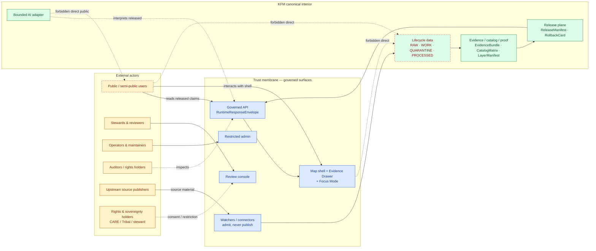
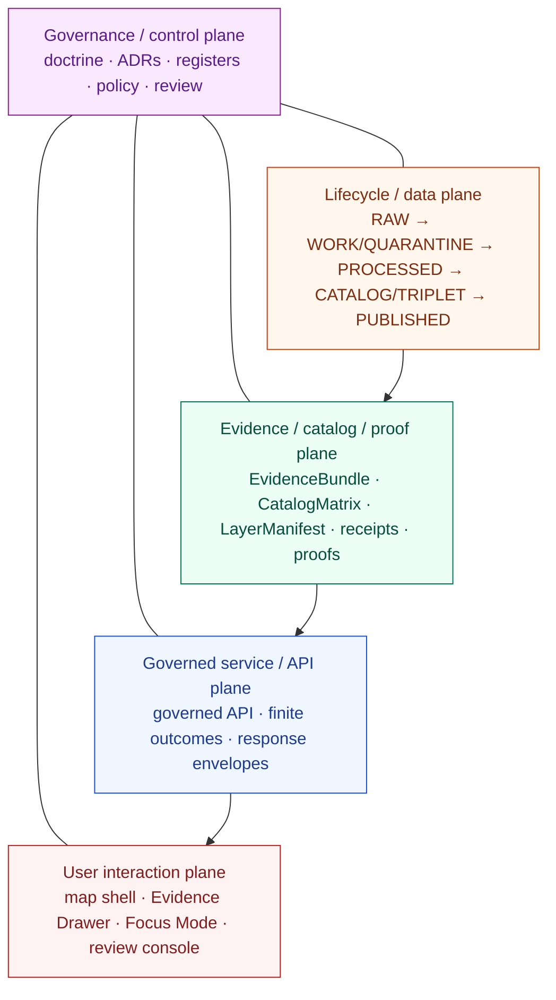
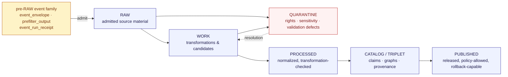

<!-- [KFM_META_BLOCK_V2]
doc_id: kfm://doc/architecture-system-context-v1
title: KFM System Context
type: standard
version: v1
status: draft
owners: Docs steward + Architecture working group
created: 2026-05-14
updated: 2026-05-14
policy_label: public
related:
  - docs/architecture/README.md
  - docs/architecture/deployment-topology.md
  - docs/architecture/governed-api.md
  - docs/architecture/map-shell.md
  - docs/architecture/contract-schema-policy-split.md
  - docs/doctrine/authority-ladder.md
  - docs/doctrine/truth-posture.md
  - docs/doctrine/trust-membrane.md
  - docs/doctrine/lifecycle-law.md
  - docs/doctrine/directory-rules.md
tags: [kfm, architecture, system-context, doctrine, trust-spine, governance]
notes:
  - All specific paths, routes, DTOs, runtimes, and implementation states are PROPOSED per Directory Rules §0 until mounted-repo evidence verifies them.
  - This doc is doctrinal orientation; it does not announce implementation maturity.
[/KFM_META_BLOCK_V2] -->

# KFM System Context

> The orientation layer for Kansas Frontier Matrix: what the system is, who interacts with it, where its trust boundary runs, and how its planes, lifecycle, and object families fit together.

  
  
  
  
  
  

**Status:** Draft · **Owners:** Docs steward + Architecture working group · **Updated:** 2026-05-14

> [!IMPORTANT]
> KFM is a **governed spatial-evidence system**, not a map app with optional citations. Every public surface — map tile, feature popup, AI answer, exported report, dashboard widget — is downstream of source admission, evidence resolution, policy decision, validation, release, and rollback. No carrier is sovereign truth.

---

## Quick links

- [1. Purpose & scope](#1-purpose--scope)
- [2. Authority & status](#2-authority--status)
- [3. What KFM is (and is not)](#3-what-kfm-is-and-is-not)
- [4. External actors & the system boundary](#4-external-actors--the-system-boundary)
- [5. The trust spine](#5-the-trust-spine)
- [6. The five cooperating planes](#6-the-five-cooperating-planes)
- [7. Canonical data lifecycle](#7-canonical-data-lifecycle)
- [8. Canonical object families](#8-canonical-object-families)
- [9. Finite outcomes — the governance grammar](#9-finite-outcomes--the-governance-grammar)
- [10. Trust-membrane invariants](#10-trust-membrane-invariants)
- [11. AI as interpretive layer, not root truth](#11-ai-as-interpretive-layer-not-root-truth)
- [12. Cross-cutting concerns](#12-cross-cutting-concerns)
- [13. What is **not** in scope of this document](#13-what-is-not-in-scope-of-this-document)
- [14. Open questions & verification backlog](#14-open-questions--verification-backlog)
- [15. Related docs](#15-related-docs)
- [Appendix A — Glossary](#appendix-a--glossary)

---

## 1. Purpose & scope

This document is the **orientation layer** of KFM's architecture. It exists so any reader — a new contributor, a reviewer, a steward, a downstream consumer, an auditor — can answer four questions without reading the full doctrine corpus:

1. **What is KFM, as a system?**
2. **Who and what interacts with it across its trust boundary?**
3. **What are the major internal regions (planes), and how do they relate?**
4. **Where does this document *stop*, and which peer docs take over?**

System Context is **doctrinal orientation**, not an implementation specification. It names the planes, lifecycle, object families, finite outcomes, and invariants that bound everything KFM publishes. It deliberately does **not** specify routes, DTOs, package layouts, deployment topology, map-shell internals, or governed-API surface — each of those is owned by a peer document in `docs/architecture/` (see §15).

> [!NOTE]
> **Truth posture.** Where this document states doctrine, the doctrine is **CONFIRMED** from the supplied project corpus. Where it names a specific path, route, package, or implementation depth, the claim is **PROPOSED** until verified against a mounted repository.

[Back to top ↑](#top)

---

## 2. Authority & status

| Field | Value |
|---|---|
| **Document type** | Architecture — system-context overview |
| **Authority of this document** | CONFIRMED orientation; subordinate to KFM core invariants and any accepted ADR |
| **Authority of specific paths quoted here** | PROPOSED until verified against mounted-repo evidence |
| **Canonical home** | `docs/architecture/system-context.md` (per Directory Rules §6.1) |
| **Owners** | Docs steward + Architecture working group |
| **Reviewers required for change** | Docs steward + at least one subsystem owner; ADR required if invariants change |
| **Supersedes** | The "system overview" sections previously embedded in dossiers, where they conflict with this synthesis |
| **Related doctrine** | `docs/doctrine/authority-ladder.md`, `truth-posture.md`, `trust-membrane.md`, `lifecycle-law.md`, `directory-rules.md` |
| **Lifecycle invariant** | RAW → WORK / QUARANTINE → PROCESSED → CATALOG / TRIPLET → PUBLISHED. Promotion is a **governed state transition, not a file move.** |
| **Schema-home convention** | `schemas/contracts/v1/<…>` as default per ADR-0001 (schema home) |

### 2.1 Authority order

When this document and another source disagree about system shape:

1. **KFM core invariants and doctrine** — lifecycle law, truth posture, trust membrane, authority ladder, watcher-as-non-publisher.
2. **Accepted ADRs** that explicitly amend system-level architecture.
3. **This document.**
4. **Peer architecture docs** (`docs/architecture/*`) — refine but do not contradict.
5. **Domain dossiers, prior architecture reports, lineage material** — informational only.
6. **Convention from mounted repo state** — when it conflicts, file a drift entry in `docs/registers/DRIFT_REGISTER.md`, do not promote drift to canon.

[Back to top ↑](#top)

---

## 3. What KFM is (and is not)

### 3.1 What KFM is

KFM is a **governed, evidence-first, map-first, time-aware spatial knowledge system** whose public unit of value is an **inspectable claim**. Every released claim carries — and can be examined for — its source identity, evidence support, spatial scope, temporal scope, rights and sensitivity posture, review state, release state, correction lineage, and rollback target.

> [!TIP]
> The shortest possible KFM definition: **a system that makes the evidence behind a map claim inspectable, the policy decision visible, and the rollback path real.**

### 3.2 What KFM is not

| KFM is **not** | Because |
|---|---|
| A map application with citation as decoration | Citations are not garnish; an uncited claim is not publishable. |
| A live-feed firehose | Every public artifact is a released, manifest-bound, rollback-capable object. |
| A chat product that happens to draw maps | The renderer is downstream; AI is bounded. |
| A search engine over arbitrary data | Search and graph projections are derivative indexes over released or review-authorized evidence. |
| A canonical truth substitute for source authority | Catalogs, triplets, summaries, tiles, scenes, and AI answers are carriers, never roots. |
| An admin console with public read-through | The trust membrane is the public path; admin shortcuts are restricted, audited, justified, and constrained. |

[Back to top ↑](#top)

---

## 4. External actors & the system boundary

The trust boundary — the **trust membrane** — is what separates public/semi-public consumers from KFM's canonical and internal stores. Everything crossing the membrane in either direction is governed: admission going in, release coming out.

### 4.1 Actor roles

| Actor | Role | Allowed surfaces | Forbidden |
|---|---|---|---|
| Public / semi-public user | Consumes released claims, layers, evidence drawers, focus answers, exports | Governed API, map shell, evidence drawer, focus mode | Direct reads of RAW / WORK / QUARANTINE / canonical stores; direct model calls |
| Steward / reviewer | Approves source admission, reviews evidence, releases, corrections, rollbacks | Review console (role-gated, audited) | Bypassing release/correction discipline |
| Operator / maintainer | Runs validation, release dry-runs, rebuild and rollback drills | CLI, workers, restricted admin | Treating admin paths as a normal public route |
| Auditor / rights holder | Inspects provenance, receipts, decisions, release manifests | Governed API + read-only review surfaces | Receiving canonical bytes outside governed envelopes |
| CARE / sovereignty holder | Consent, locality restriction, withdrawal | Review console; obligations attached to PolicyDecision | Discovery via stylistic hiding of restricted geometry |
| Upstream source publisher | Provides source material | Connectors / watchers → pre-RAW event family → RAW | Direct write to PROCESSED / CATALOG / PUBLISHED |

> [!CAUTION]
> **Watchers admit; they do not publish.** Automated watchers, GitOps PR emitters, live feeds, source refreshes, and model-assisted candidate generators emit receipts and candidate decisions only. Publication is a separate, governed transition.

[Back to top ↑](#top)

---

## 5. The trust spine

The **trust spine** is KFM's architectural center: the linear sequence every public-facing claim must pass through. It is named in the Unified Implementation Architecture Build Manual as **CONFIRMED doctrine**; its specific runtime implementation depth is **UNKNOWN** until mounted-repo evidence resolves it.

```mermaid
flowchart LR
    classDef stage fill:#eef2ff,stroke:#3730a3,color:#1e1b4b;
    classDef gate fill:#fef3c7,stroke:#b45309,color:#78350f;

    SRC[Source admission<br/>SourceDescriptor + pre-RAW events]:::stage
    LIF[Lifecycle storage<br/>RAW · WORK · QUARANTINE · PROCESSED]:::stage
    EVR[Evidence resolution<br/>EvidenceRef → EvidenceBundle]:::stage
    VAL[Validation<br/>ValidationReport]:::gate
    POL[Policy decision<br/>DecisionEnvelope]:::gate
    CAT[Catalog / proof closure<br/>CatalogMatrix · LayerManifest]:::stage
    REL[Release<br/>ReleaseManifest + RollbackCard]:::gate
    PUB[Governed service / API<br/>RuntimeResponseEnvelope]:::stage
    SUR[Trust-visible UI<br/>shell · drawer · focus]:::stage
    AIB[Bounded AI interpretation<br/>AIReceipt]:::stage

    SRC --> LIF --> EVR --> VAL --> POL --> CAT --> REL --> PUB --> SUR
    PUB -. evidence-bounded .-> AIB
    AIB -. cites released .-> SUR
```

**Reading rule.** Anything that appears to skip a stage is either (a) a documented derivative carrier (PMTiles, vector indexes, graph projections, scenes, dashboards, summaries) that remains traceable back through the spine, or (b) a violation — a drift candidate, not an architecture variant.

[Back to top ↑](#top)

---

## 6. The five cooperating planes

The smallest sound decomposition of KFM is **five cooperating planes**. This is **PROPOSED architectural cut** from the Unified Implementation Architecture Build Manual §6 — it organizes the trust spine for repository and team purposes; it does **not** introduce new doctrine, new lifecycle phases, new object families, or new authority roots.

### 6.1 Plane responsibilities

| Plane | Owns | Does **not** own | Status |
|---|---|---|---|
| **Governance / control plane** | Doctrine, authority ladder, registers, policy, review, ADRs, drift, verification backlog | Object meaning (`contracts/`), object shape (`schemas/`), runtime behavior | CONFIRMED doctrine / PROPOSED implementation |
| **Lifecycle / data plane** | The phases RAW · WORK · QUARANTINE · PROCESSED · CATALOG · TRIPLET · PUBLISHED, plus emitted receipts, proofs, registry, rollback | What a claim *means*, what a route looks like, how a tile renders | CONFIRMED doctrine / PROPOSED implementation |
| **Evidence / catalog / proof plane** | EvidenceRef → EvidenceBundle resolution; CatalogMatrix, LayerManifest, GeoManifest; RunReceipt, PromotionReceipt, ReleaseManifest, RollbackCard | Public surfaces, AI interpretation | CONFIRMED doctrine / PROPOSED implementation |
| **Governed service / API plane** | The trust membrane in executable form; finite-outcome envelopes; layer/evidence/focus/review endpoints; deny-by-default access | Source admission, raw transformation, model training | CONFIRMED doctrine / PROPOSED implementation |
| **User interaction plane** | Map shell, Evidence Drawer, Focus Mode, review console, story player, exports — all consuming released artifacts via the governed API | Direct reads of canonical stores; direct model calls | CONFIRMED doctrine / PROPOSED implementation |

> [!NOTE]
> **Carriers, not planes.** PMTiles, MVT, COG, 3D Tiles, vector indexes, graph triplets, scenes, dashboards, summaries, and AI answers are **derivative carriers** that ride on the planes above. They never become root truth, and they never replace EvidenceBundle resolution, PolicyDecision, PromotionDecision, ReleaseManifest, or rollback target.

[Back to top ↑](#top)

---

## 7. Canonical data lifecycle

The lifecycle invariant is **CONFIRMED doctrine** and is the single governing chain for material moving through KFM. Promotion between phases is a governed state transition, not a file move.

### 7.1 Phase semantics (CONFIRMED)

| Phase | Holds | Promotion requires |
|---|---|---|
| **pre-RAW event family** (v1.1, PROPOSED) | `event_envelope`, `prefilter_output`, `event_run_receipt` recording attempted intake before admission | An admission decision; a non-silent record of the attempt |
| **RAW** | Admitted source material under source identity; not a public surface | SourceDescriptor exists; admission is recorded |
| **WORK** | Transformation space; candidates not ready for processed or public use | Validation, schema, geometry, time, identity, evidence, rights, policy checks |
| **QUARANTINE** | Material with rights, sensitivity, validation, source-role, evidence, temporal, or policy defects | Resolution back to WORK or explicit denial; never a silent skip |
| **PROCESSED** | Normalized outputs that passed transformation checks | EvidenceRef + ValidationReport + digest closure |
| **CATALOG / TRIPLET** | Claim, layer, graph, provenance, and discovery surfaces | Catalog / proof closure |
| **PUBLISHED** | Released, policy-allowed, reviewable, rollback-capable artifacts | ReleaseManifest, correction path, rollback target, review state where required |

> [!WARNING]
> **No lifecycle skip.** A pipeline that writes from RAW directly to PUBLISHED, or that bypasses QUARANTINE on defect, is not an optimization — it is a trust-spine violation. File a drift entry.

[Back to top ↑](#top)

---

## 8. Canonical object families

KFM's object families exist so that **trust is inspectable as data**. Each family carries a specific governance burden: source identity, evidence closure, policy decision, validation result, release state, correction lineage, or rollback target. The families and their architectural roles are **CONFIRMED doctrine**; their schema homes, route names, DTOs, and implementation depth are **PROPOSED** until mounted-repo evidence verifies them.

| Family | Architectural role | Status |
|---|---|---|
| `SourceDescriptor` | Source identity, role, rights, cadence, access, sensitivity, release posture | CONFIRMED doctrine / PROPOSED implementation |
| `EvidenceRef` | Pointer from a claim / feature / answer / layer / proof item to its evidence support | CONFIRMED doctrine |
| `EvidenceBundle` | Resolved evidence package with source, provenance, scope, citation, review context | CONFIRMED doctrine |
| `SourceActivationDecision` | Gate deciding source use, restriction, quarantine, or denial | PROPOSED implementation |
| `PolicyDecision` / `DecisionEnvelope` | Finite allow / deny / restrict / abstain / error decision | CONFIRMED doctrine / PROPOSED implementation |
| `ValidationReport` | Result of validators across schema, content, geometry, time, rights | CONFIRMED doctrine / PROPOSED implementation |
| `RunReceipt` | Auditable record of intake, transform, validation, catalog, release, or rebuild action | CONFIRMED doctrine / PROPOSED implementation |
| `PromotionReceipt` | Auditable representation of Promotion Gates A–G | CONFIRMED doctrine / PROPOSED implementation |
| `CatalogMatrix` | Catalog closure across released artifacts | CONFIRMED doctrine / PROPOSED implementation |
| `LayerManifest` / `MapReleaseManifest` / `GeoManifest` | Published artifact set, digests, policy posture, rollback target | CONFIRMED doctrine / PROPOSED implementation |
| `ReleaseManifest` | Bind artifacts, validation, policy, review, checksums, rollback | CONFIRMED doctrine / PROPOSED implementation |
| `CorrectionNotice` | Record of error, correction, withdrawal, supersession | CONFIRMED doctrine / PROPOSED implementation |
| `RollbackCard` | Reversible release rollback target and drill | CONFIRMED doctrine / PROPOSED implementation |
| `ReviewRecord` | Reviewer action — auditable | CONFIRMED doctrine / PROPOSED implementation |
| `RuntimeResponseEnvelope` | Governed API response carrying finite outcomes, citations, obligations | CONFIRMED doctrine / PROPOSED implementation |
| `AIReceipt` | Bounded AI request/response accountability with evidence, citations, outcome | PROPOSED implementation |
| `EvidenceDrawerPayload` | Map-feature click → evidence projection for the drawer | CONFIRMED doctrine / PROPOSED implementation |
| `QueryRunRecord` / `CandidateDelta` / `RecompileManifest` | Loop-control objects for query-save-validate-compile-review-promote-recompile | PROPOSED implementation |

> [!IMPORTANT]
> **Anti-collapse rule.** Catalogs, triplets, graph projections, PMTiles, layer manifests, model outputs, summaries, and UI answers are **derivative or publication surfaces** — they do not become root truth. Their claims must remain traceable back through `EvidenceRef`, `EvidenceBundle`, receipts, policy decisions, and release records.

[Back to top ↑](#top)

---

## 9. Finite outcomes — the governance grammar

Every governed API surface, validator, policy gate, and Focus-Mode answer returns an outcome from a **small, well-known set**. Finite outcomes are how KFM keeps fluency from masquerading as authority: an answer that can't be ANSWER must be one of the other names, visibly.

| Outcome | When | Required artifacts | Public-surface effect |
|---|---|---|---|
| **ANSWER** | Evidence sufficient, policy permits, release state allows, review state (if required) recorded | EvidenceBundle resolved; PolicyDecision = allow; ReleaseManifest applies | Substantive answer with Evidence Drawer + citation |
| **ABSTAIN** | Evidence insufficient or incomplete; surface cannot cite; or evidence stale with no released alternative | AIReceipt with reason; no claim emitted | Non-substantive note with reason; never invents |
| **DENY** | Policy, rights, sensitivity, or release state forbids — sensitive lanes default here | PolicyDecision = deny + reason_code; AIReceipt records denial | Denial reason; offers non-restricted alternative where possible |
| **ERROR** | Governed surface cannot evaluate — missing schema, malformed query, contract violation, infrastructure failure | Error envelope with diagnostic code; no claim leakage | Finite, actionable error; never silently falls through to a different lane |
| **HOLD** | Promotion / release / correction is paused pending steward, rights-holder, or policy review | ReviewRecord pending; PolicyDecision = hold | Surface remains in prior state; no silent rollback or replacement |
| **PASS** *(validator)* | Admission or validator check succeeded | ValidationReport pass | Internal only; does not directly emit a public answer |
| **FAIL** *(validator)* | Admission or validator check did not pass | ValidationReport with failure list | Promotion blocked; quarantine where appropriate |

> [!TIP]
> If a surface would otherwise return a fluent popup, undated graph hit, or generic chatbot answer in place of one of these outcomes, that is the failure mode the trust spine exists to prevent.

[Back to top ↑](#top)

---

## 10. Trust-membrane invariants

The **trust membrane** is the boundary that ensures public, UI, and AI surfaces consume governed APIs and released artifacts — never raw or internal stores. The invariants below are **CONFIRMED doctrine**; their enforcement at runtime is **PROPOSED / NEEDS VERIFICATION** until mounted-repo evidence (workers, middleware, policy bundles, CI checks) is inspected.

| Invariant | What it forbids |
|---|---|
| **No public RAW path** | RAW, WORK, QUARANTINE, unpublished candidate data, and canonical/internal stores remain behind governed interfaces. |
| **No direct model client** | Focus Mode is an evidence-bounded adapter behind the governed API; no browser/public path calls a model runtime directly. |
| **No canonical / internal client fetch** | UI clients (incl. MapLibre) consume released artifacts and governed APIs, not source systems or internal data stores. |
| **No unreleased tile load** | PMTiles, MVT, MLT, COG, 3D Tiles, style JSON, sprites, and glyphs must be released and manifest-bound. |
| **No sensitive geometry hidden only by style** | CARE / locality restrictions require masking, generalization, restricted tier, or denial **before** public tile generation — not stylistic concealment. |
| **No popup as Evidence Drawer substitute** | Popups can preview; material claims need `EvidenceDrawerPayload` resolved through `EvidenceBundle`. |
| **No uncited export** | Screenshots, reports, Story Nodes, and Focus answers retain citations and manifest/version references. |
| **Watcher-as-non-publisher** | Watchers, connectors, and workers emit receipts and candidate decisions only. Publication is a separate, governed transition. |
| **Admin is not a public path** | Admin shortcuts must be justified, constrained, documented, audited, and kept out of the normal public route. |

[Back to top ↑](#top)

---

## 11. AI as interpretive layer, not root truth

AI inside KFM is **interpretive**, not foundational. The order of operations is fixed:

1. **Define scope** — what is being asked, against what release state, in what policy context.
2. **Retrieve evidence** — `EvidenceRef` queried; candidates ranked.
3. **Resolve `EvidenceRef` to `EvidenceBundle`** — citations bind to actual released bundles.
4. **Apply policy and sensitivity checks** — pre-check before generation; post-check after.
5. **Validate citations** — every cited `EvidenceRef` must resolve and be admissible in current scope.
6. **Emit a finite outcome** — ANSWER / ABSTAIN / DENY / ERROR, with `AIReceipt` and `RuntimeResponseEnvelope`.

> [!WARNING]
> **Fluency is not evidence.** A well-formed AI sentence is not a substitute for `EvidenceBundle`, `PolicyDecision`, review state, source authority, or release state. If the trust spine cannot produce ANSWER, the surface must visibly produce ABSTAIN, DENY, or ERROR — not invent.

### 11.1 Allowed AI behaviors

- Evidence-bounded summarization over released `EvidenceBundle`s
- Citation-backed explanation, evidence comparison, anomaly explanation
- Steward drafting, schema/validator suggestions

### 11.2 Required AI abstentions

- Missing `EvidenceBundle`
- Citations that cannot be validated
- Conflicting source roles
- Insufficient temporal scope
- Requests for unsupported inference
- Any path that would expose RAW / WORK / QUARANTINE / unpublished / restricted content

[Back to top ↑](#top)

---

## 12. Cross-cutting concerns

System context is shaped by concerns that cross every plane. They are named here so readers know **where** they live, not **how** they're implemented.

### 12.1 Source authority & role

KFM treats **source role** as a first-class identity attribute. Observed readings are not interchangeable with modeled estimates; regulatory determinations are not interchangeable with administrative compilations; aggregates are not candidate evidence; synthetic content is never observed reality. The source-role anti-collapse rule belongs to the **governance plane** and is enforced through `SourceDescriptor`, validators, and review.

### 12.2 Rights, sensitivity, and sovereignty (CARE)

Rights and sensitivity decisions cross all five planes. Unclear rights, unresolved source role, missing evidence, unresolved sensitivity, or absent release state **blocks public promotion**. Sensitive lanes — archaeology, fauna, flora, infrastructure, living-person / DNA, precise location exposure — default to DENY, generalize, or restricted tier; consent (CARE) is a required field bound to metadata digest, not a free-text afterthought.

### 12.3 Time-awareness

KFM is time-aware. Valid time, observed time, freshness, and stale-state are first-class on every released artifact. Time controls in the UI ride atop release-bound layer manifests; the renderer does not invent recency.

### 12.4 Reproducibility & integrity

Reproducible builds make map artifacts reconstructable: environment, materials, process, contents, provenance, and signatures interlock. Unsigned artifacts are invalid data. `spec_hash`, JCS / URDNA2015 canonicalization, DSSE envelopes, and Merkle manifests are the integrity primitives.

### 12.5 Correction & rollback

Every released claim has a correction path and a rollback target. Corrections are visible on public claims (`CorrectionNotice`); rollback is drilled (`RollbackCard`); rollback does not silently delete history.

### 12.6 Documentation as part of the working system

Docs improve truth, usability, governance, and maintainability — they do **not** substitute for tests, schemas, validators, fixtures, policy bundles, or proof objects.

[Back to top ↑](#top)

---

## 13. What is **not** in scope of this document

System Context names the regions; the documents below own the details. This list is **PROPOSED** alongside the architecture index per Directory Rules §6.1.

| Concern | Owning document (PROPOSED) |
|---|---|
| Architecture index, subsystem map, navigation | `docs/architecture/README.md` |
| Deployment topology, host, network, exposure | `docs/architecture/deployment-topology.md` |
| Governed API surface, routes, DTOs, response envelopes | `docs/architecture/governed-api.md` |
| Map shell, MapLibre adapter, Evidence Drawer, Focus Mode wiring | `docs/architecture/map-shell.md` |
| `contracts/` vs `schemas/` vs `policy/` separation | `docs/architecture/contract-schema-policy-split.md` |
| Authority order across all KFM sources | `docs/doctrine/authority-ladder.md` |
| Truth posture (cite-or-abstain) details | `docs/doctrine/truth-posture.md` |
| Trust-membrane enforcement & boundaries | `docs/doctrine/trust-membrane.md` |
| Lifecycle phase law (full semantics) | `docs/doctrine/lifecycle-law.md` |
| Repository placement law | `docs/doctrine/directory-rules.md` |
| Per-domain architecture (hydrology, fauna, flora, hazards, …) | `docs/domains/<domain>/README.md` |
| Standards conformance (STAC, DCAT, PROV-O, JSON Schema, JSON-LD, OPA/Rego, DSSE) | `docs/standards/<standard>.md` |
| Ops runbooks, rollback drills, validation runs | `docs/runbooks/` |
| Threat model, exposure posture, incident response | `docs/security/` |

[Back to top ↑](#top)

---

## 14. Open questions & verification backlog

These items are **explicitly unresolved** by this document. They should be tracked in `docs/registers/VERIFICATION_BACKLOG.md` (PROPOSED) and resolved by mounted-repo inspection, ADR, or peer architecture docs.

- **NEEDS VERIFICATION:** Whether the current repository exposes the planes, lifecycle, object families, and finite outcomes named here at canonical paths.
- **NEEDS VERIFICATION:** Whether `schemas/contracts/v1/...` is the live machine-schema authority. Default per ADR-0001 is `schemas/contracts/v1/`; resolve by inspection.
- **NEEDS VERIFICATION:** Whether `apps/governed-api/`, `apps/explorer-web/`, and `apps/review-console/` are the canonical app homes, or whether legacy `ui/`, `web/`, or other roots are still active. Affects the User Interaction plane.
- **NEEDS VERIFICATION:** Whether `pipeline_specs/watchers/`, `policy/opa/`, `tools/attest/`, `tools/validators/promotion_gate/`, and `data/events/` exist as proposed for the pre-RAW event family, signing pipeline, and promotion gates.
- **UNKNOWN:** Implementation depth of the bounded AI adapter (provider-neutral runtime, citation validation, AIReceipt emission, no direct public model traffic).
- **UNKNOWN:** Operational maturity of release/rollback drills; existence of dashboards, runtime logs, exposure posture documentation.
- **OPEN:** Reconciliation of any earlier public-repo report (e.g., `IMPL-REF` connector inventory) with the current monorepo state — lineage only until reverified.
- **OPEN:** Final disposition of compatibility roots (`ui/`, `web/`, `styles/`, `viewer_templates/`, `jsonschema/`, `policies/`, `artifacts/`) — retained, migrated, retired.

[Back to top ↑](#top)

---

## 15. Related docs

> Paths below are **PROPOSED** per Directory Rules §0 until verified against mounted-repo state.

- [`docs/architecture/README.md`](./README.md) — Architecture index *(PROPOSED)*
- [`docs/architecture/deployment-topology.md`](./deployment-topology.md) — Deployment, host, network, exposure *(PROPOSED)*
- [`docs/architecture/governed-api.md`](./governed-api.md) — Governed API surface and response envelopes *(PROPOSED)*
- [`docs/architecture/map-shell.md`](./map-shell.md) — Map shell, Evidence Drawer, Focus Mode wiring *(PROPOSED)*
- [`docs/architecture/contract-schema-policy-split.md`](./contract-schema-policy-split.md) — Separation of meaning, shape, policy *(PROPOSED)*
- [`docs/doctrine/authority-ladder.md`](../doctrine/authority-ladder.md) — Authority order *(PROPOSED)*
- [`docs/doctrine/truth-posture.md`](../doctrine/truth-posture.md) — Cite-or-abstain *(PROPOSED)*
- [`docs/doctrine/trust-membrane.md`](../doctrine/trust-membrane.md) — Membrane invariants *(PROPOSED)*
- [`docs/doctrine/lifecycle-law.md`](../doctrine/lifecycle-law.md) — Lifecycle phase law *(PROPOSED)*
- [`docs/doctrine/directory-rules.md`](../doctrine/directory-rules.md) — Repository placement law *(CONFIRMED doctrine; canonical home PROPOSED)*
- [`docs/adr/`](../adr/) — Architecture Decision Records *(PROPOSED)*
- [`docs/registers/VERIFICATION_BACKLOG.md`](../registers/VERIFICATION_BACKLOG.md) — Unresolved items *(PROPOSED)*
- [`docs/registers/DRIFT_REGISTER.md`](../registers/DRIFT_REGISTER.md) — Drift entries *(PROPOSED)*

[Back to top ↑](#top)

---

## Appendix A — Glossary

<strong>Click to expand glossary of system-context terms</strong>

| Term | Unified definition |
|---|---|
| **Trust spine** | The architectural center of KFM: source admission → lifecycle storage → evidence resolution → validation → policy decision → catalog/proof closure → release → governed API → trust-visible UI → bounded AI. |
| **Trust membrane** | Boundary ensuring public / UI / AI surfaces consume governed APIs and released artifacts, not raw or internal stores. |
| **Responsibility root** | Repo root whose name encodes a governance responsibility (`docs/`, `schemas/`, `policy/`, `tests/`, `data/`, `release/`, `apps/`, `tools/`, …). |
| **Compatibility root** | Existing or source-reported root retained for compatibility until ADR/migration confirms authority, deprecation, or drift resolution. |
| **Domain lane** | Domain-specific architecture inside responsibility roots; never a new root by topic name. |
| **Pre-RAW event family** | `event_envelope`, `prefilter_output`, `event_run_receipt` schemas governing attempted admission before RAW. |
| **Watcher** | Pipeline that detects material changes and opens a PR rather than committing or publishing directly. |
| **`SourceDescriptor`** | Source identity, role, rights, cadence, access, sensitivity, release posture. |
| **`EvidenceRef`** | Pointer from a claim / feature / answer / layer / proof item to evidence support. |
| **`EvidenceBundle`** | Resolved evidence package with source, provenance, scope, citation, review context. |
| **`PolicyDecision` / `DecisionEnvelope`** | Finite allow / deny / restrict / abstain / error decision. |
| **`RunReceipt`** | Execution record pinning inputs, outputs, hashes, tool versions, timestamps, failures, policy posture, evidence refs. |
| **`PromotionReceipt`** | Governed state-transition record enumerating Promotion Gates A–G. |
| **`ReleaseManifest`** | Record of published artifact set, digests, policy posture, release state, correction path, rollback target. |
| **`CorrectionNotice`** | Record of error, correction, withdrawal, or supersession. |
| **`RollbackCard`** | Reversible release rollback target and drill. |
| **`AIReceipt`** | Bounded AI request/response accountability with evidence, citations, outcome. |
| **`RuntimeResponseEnvelope`** | Governed API response envelope carrying finite outcomes, citations, obligations. |
| **`spec_hash`** | Deterministic identity hash over a canonicalized object (typically JCS or URDNA2015 canonicalization + SHA-256). |
| **DSSE** | Dead Simple Signing Envelope; wrapper used to carry a canonicalized receipt and signature. |
| **Merkle manifest** | Tamper-evident tree of leaf hashes over the canonical release file set. |
| **Finite outcomes** | The closed set of outcomes a governed surface may return: ANSWER, ABSTAIN, DENY, ERROR (plus HOLD, PASS, FAIL for validators / review). |

[Back to top ↑](#top)

---

**Last reviewed:** 2026-05-14 · **Owners:** Docs steward + Architecture working group · **Authority:** CONFIRMED doctrine, PROPOSED implementation depth · [Back to top ↑](#top)
