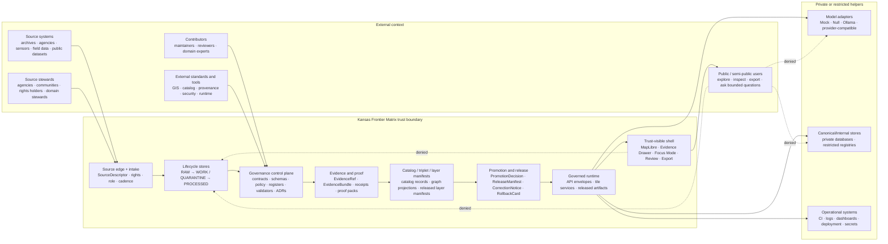
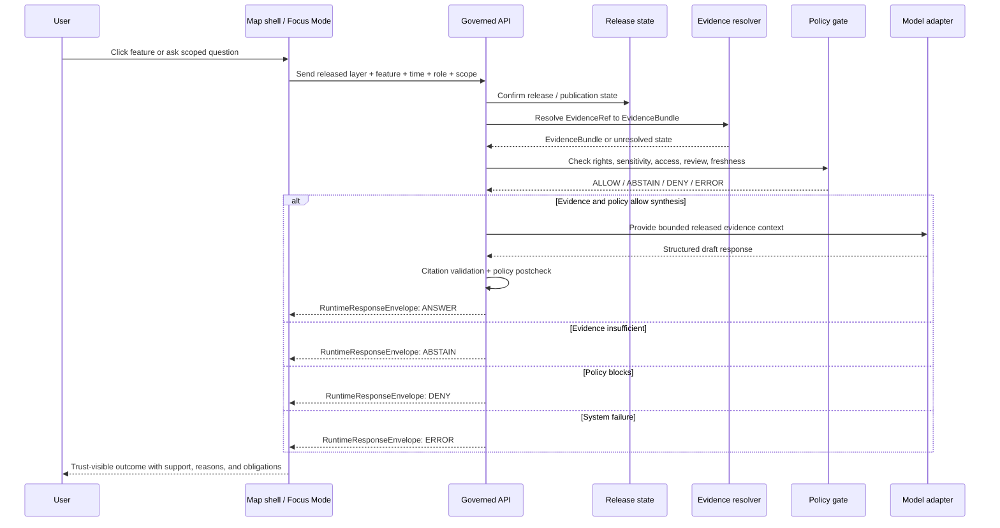

<!-- [KFM_META_BLOCK_V2]
doc_id: kfm://doc/needs-verification/system-context
title: System Context
type: standard
version: v1
status: draft
owners: NEEDS_VERIFICATION
created: NEEDS_VERIFICATION
updated: 2026-05-06
policy_label: NEEDS_VERIFICATION
related: [../../README.md, ./README.md, ./governed-api.md, ./map-shell.md, ./governed-ai/README.md, ../adr/ADR-0014-truth-path.md, ../adr/ADR-0001-schema-home.md, ../adr/ADR-0010-local-exposure-security.md, ../adr/ADR-0206-maplibre-layer-manifest.md, ../adr/ADR-0207-governed-ai-runtime-envelope.md, ../adr/ADR-0304-hydrology-first-proof-lane.md, ../standards/markdown-rules.md]
tags: [kfm, architecture, system-context, trust-membrane, evidence-first, map-first, time-aware, governed-api, governed-ai, publication]
notes: [Owners created date doc_id and policy_label remain NEEDS_VERIFICATION, this document describes governed system context and must not be used as proof of runtime deployment CI enforcement or branch protection, relative links were selected from current repository connector evidence and still need repo-native link checking before promotion]
[/KFM_META_BLOCK_V2] -->

<a id="top"></a>

# System Context

Kansas Frontier Matrix is a governed, evidence-first, map-first, time-aware spatial knowledge and publication system for inspectable Kansas-centered claims.

<p align="left">
  
  
  
  
  
  
</p>

**Quick jumps:** [Purpose](#purpose) · [Repo fit](#repo-fit) · [Evidence boundary](#evidence-boundary) · [System at a glance](#system-at-a-glance) · [Context map](#context-map) · [Actors](#actors-and-external-systems) · [Trust path](#trust-path) · [Runtime surfaces](#runtime-surfaces) · [Inputs and exclusions](#inputs-and-exclusions) · [Denied shortcuts](#denied-shortcuts) · [Validation](#validation) · [Open verification](#open-verification)

> [!IMPORTANT]
> This document defines the **system context and trust boundary** for KFM. It does not claim that every route, schema, validator, workflow, policy gate, dashboard, deployment, proof pack, release manifest, or runtime behavior is currently implemented.

---

## Purpose

`docs/architecture/system-context.md` explains how KFM fits together at the highest architecture boundary: who interacts with the system, what sits inside the trust membrane, which surfaces may publish or interpret evidence, and which shortcuts are denied by default.

The durable public unit is the **inspectable claim**: a public or semi-public statement whose evidence, source role, spatial scope, temporal scope, policy posture, review state, release state, correction lineage, and rollback support can be inspected.

KFM is not only a map viewer, AI assistant, database, dashboard, graph, tile server, report generator, or GIS exercise. Those surfaces are useful carriers. They are not sovereign truth.

[Back to top](#top)

---

## Repo fit

**Path:** `docs/architecture/system-context.md`  
**Owning root:** `docs/`  
**Document type:** standard architecture doc  
**Primary role:** cross-cutting system context, public trust membrane, and runtime-boundary overview

| Relationship | Path | Role |
|---|---|---|
| This document | `docs/architecture/system-context.md` | Human-facing system context and trust-boundary overview |
| Architecture index | [`./README.md`](./README.md) | Local architecture landing page and routing surface |
| Governed API note | [`./governed-api.md`](./governed-api.md) | Public-client boundary and finite response posture |
| Map shell note | [`./map-shell.md`](./map-shell.md) | Renderer boundary and trust-visible shell posture |
| Governed AI architecture | [`./governed-ai/README.md`](./governed-ai/README.md) | Model adapter, Focus Mode, citation, and AI receipt posture |
| Truth path ADR | [`../adr/ADR-0014-truth-path.md`](../adr/ADR-0014-truth-path.md) | Lifecycle and public trust membrane decision record |
| Schema-home ADR | [`../adr/ADR-0001-schema-home.md`](../adr/ADR-0001-schema-home.md) | Contract/schema/policy split and machine-schema home |
| Local exposure ADR | [`../adr/ADR-0010-local-exposure-security.md`](../adr/ADR-0010-local-exposure-security.md) | Deny-by-default local exposure and model-runtime boundary |
| Layer manifest ADR | [`../adr/ADR-0206-maplibre-layer-manifest.md`](../adr/ADR-0206-maplibre-layer-manifest.md) | Governed map-layer contract posture |
| Runtime envelope ADR | [`../adr/ADR-0207-governed-ai-runtime-envelope.md`](../adr/ADR-0207-governed-ai-runtime-envelope.md) | Finite AI-assisted runtime response envelope |
| Hydrology proof-lane ADR | [`../adr/ADR-0304-hydrology-first-proof-lane.md`](../adr/ADR-0304-hydrology-first-proof-lane.md) | Early proof-lane sequencing and burden control |
| Markdown rules | [`../standards/markdown-rules.md`](../standards/markdown-rules.md) | Documentation truth-label and formatting expectations |
| Root orientation | [`../../README.md`](../../README.md) | Project-wide purpose, trust law, object families, and contributor posture |

### Directory Rules basis

`docs/architecture/` is the human-facing home for **cross-domain system architecture**. It is appropriate for system context because it explains boundaries shared by domains, runtime surfaces, publication, AI, and UI trust. It should not become a machine-schema home, policy-as-code home, emitted-proof home, source registry, or root-level domain lane.

Domain-specific architecture belongs under the appropriate responsibility root, such as `docs/domains/<domain>/`, `schemas/contracts/v1/domains/<domain>/`, `policy/domains/<domain>/`, `tests/domains/<domain>/`, `fixtures/domains/<domain>/`, and the relevant `data/<stage>/<domain>/` lifecycle paths.

[Back to top](#top)

---

## Evidence boundary

This revision is evidence-bounded.

| Claim | Truth label | Basis |
|---|---:|---|
| `docs/architecture/system-context.md` exists in the accessible repository and already carries a system-context draft. | `CONFIRMED` | Current repository connector evidence |
| `docs/architecture/README.md`, `governed-api.md`, and `map-shell.md` exist and define adjacent architecture surfaces. | `CONFIRMED` | Current repository connector evidence |
| The root README states KFM’s evidence-first, map-first, time-aware identity and lifecycle law. | `CONFIRMED` | Current repository connector evidence |
| ADRs exist for truth path, schema home, local exposure, MapLibre layer manifest, governed AI runtime envelope, and hydrology proof-lane sequencing. | `CONFIRMED file presence` | Current repository connector evidence |
| The schema-home decision remains draft/proposed until enforcement evidence is verified. | `CONFIRMED draft posture` | Current repository connector evidence |
| Runtime route behavior, test pass state, branch protections, dashboards, deployments, emitted proof packs, and live release gates are complete. | `UNKNOWN` | Not verified by this document |
| This document is suitable as promoted architecture canon. | `NEEDS_VERIFICATION` | Requires owners, policy label, link check, ADR status check, and repo-native validation |

> [!CAUTION]
> File presence and doctrine are not runtime proof. Do not upgrade `PROPOSED`, `UNKNOWN`, or `NEEDS_VERIFICATION` claims unless current repo files, tests, workflows, logs, generated artifacts, release objects, or platform settings directly support the stronger claim.

[Back to top](#top)

---

## System at a glance

| Area | Context decision |
|---|---|
| System identity | KFM is a governed spatial evidence and publication system, not a single app or data product. |
| Public value | The durable public unit is the inspectable claim. |
| Operating posture | Kansas-first, map-first, time-aware, evidence-first, policy-aware, auditable, correctable, and reversible. |
| Truth path | `SOURCE EDGE -> RAW -> WORK / QUARANTINE -> PROCESSED -> CATALOG / TRIPLET -> REVIEW / POLICY / PROOF -> RELEASE -> PUBLISHED`. |
| Public boundary | Public and ordinary UI clients use governed APIs, released artifacts, catalog records, tile services, layer manifests, and EvidenceBundle-backed payloads. |
| Map boundary | MapLibre renders released artifacts and interaction state. It does not decide truth, evidence, rights, sensitivity, review, release, correction, rollback, citation validity, or AI answerability. |
| AI boundary | Focus Mode and model adapters are interpretive only and emit finite `ANSWER`, `ABSTAIN`, `DENY`, or `ERROR` outcomes. |
| Publication law | Promotion is a governed state transition, not a file move, ETL success, tile render, graph edge, dashboard refresh, or generated answer. |
| Failure posture | When evidence, rights, sensitivity, review, release, freshness, correction, or rollback support is insufficient, KFM fails closed through `ABSTAIN`, `DENY`, `ERROR`, quarantine, restriction, generalization, review hold, withdrawal, or rollback. |

---

## Context map



### Reading the map

KFM’s boundary is a **trust membrane**. It admits source material, evaluates it under source role, rights, sensitivity, validation, review, and release obligations, then exposes only governed public-safe outputs.

Derived carriers such as maps, tiles, graphs, dashboards, search indexes, vector stores, summaries, scenes, exports, and AI answers must remain downstream of evidence and release state.

[Back to top](#top)

---

## Actors and external systems

| Actor or system | Primary interaction with KFM | Trust requirement |
|---|---|---|
| Public user | Explores maps, reads stories, opens Evidence Drawer, exports public-safe artifacts, asks bounded Focus Mode questions. | Sees released public-safe material only; unsupported requests return `ABSTAIN`, `DENY`, or `ERROR`. |
| Semi-public or expert user | Inspects richer layer metadata, evidence, uncertainty, temporal scope, and compare views. | Receives only role-appropriate released or review-authorized payloads. |
| Domain contributor | Adds or revises domain docs, source descriptors, fixtures, schemas, validators, or candidate transformations. | Work enters the proper responsibility root and remains truth-labeled until validated. |
| Steward / reviewer | Reviews rights, source role, sensitivity, cultural/ecological/public safety risk, release readiness, corrections, and rollback. | Review records stay separate from generated summaries and release artifacts. |
| Maintainer | Owns repository structure, ADRs, validation, CI, release controls, and rollback discipline. | Does not claim enforcement without inspected tests, workflows, artifacts, logs, or platform evidence. |
| Source steward / upstream provider | Provides or governs source material, source terms, caveats, cadence, or steward-controlled records. | Source authority and limits are represented in source descriptors. |
| Governed API | Mediates runtime requests. | Resolves evidence, applies policy/release state, returns finite envelopes, and preserves audit refs. |
| MapLibre shell | Renders released map artifacts and returns interaction context. | Renderer remains downstream of manifests and governed evidence resolution. |
| Model adapter | Summarizes or interprets resolved, policy-safe evidence. | Cannot decide truth, policy, rights, sensitivity, review, release, citation validity, or rollback. |
| Catalog, graph, tile, search, and index stores | Accelerate discovery, rendering, navigation, or retrieval. | Derived carriers only; must resolve back to evidence and release state where claims depend on support. |

---

## Trust path

KFM’s default truth path is:

```text
SOURCE EDGE
  -> RAW
  -> WORK / QUARANTINE
  -> PROCESSED
  -> CATALOG / TRIPLET
  -> REVIEW / POLICY / PROOF
  -> RELEASE
  -> PUBLISHED
  -> GOVERNED API / TILE SERVICE / EXPORT
  -> MAP SHELL / EVIDENCE DRAWER / FOCUS MODE
```

A consequential claim should be traceable through:

```text
InspectableClaim
  -> EvidenceRef
  -> EvidenceBundle
  -> SourceDescriptor
  -> ValidationReport
  -> PolicyDecision
  -> ReviewRecord
  -> ProofPack
  -> ReleaseManifest
  -> CorrectionNotice / RollbackCard
```



[Back to top](#top)

---

## Runtime surfaces

### Governed API

The governed API is the normal public and semi-public runtime entry point.

It should return finite evidence-aware envelopes rather than raw records, direct store results, direct model output, or fluent prose detached from support.

| Runtime obligation | Required posture |
|---|---|
| Evidence resolution | Resolve `EvidenceRef` to `EvidenceBundle` before consequential public claim emission. |
| Policy checks | Evaluate rights, sensitivity, source role, access role, review state, release state, freshness, and correction state. |
| Outcome grammar | Use `ANSWER`, `ABSTAIN`, `DENY`, or `ERROR` for consequential runtime responses. |
| Auditability | Preserve request ID, evidence refs, policy refs, release refs, correction refs, and receipt refs where applicable. |
| Public safety | Avoid leaking restricted details through reasons, errors, cache state, map payloads, or model summaries. |

### Map shell

The map shell is a trust-visible UI surface. It renders released artifacts through manifests and makes evidence, policy, review, freshness, release, and correction state visible where meaning depends on them.

| Map-shell action | Context rule |
|---|---|
| Click feature | MapLibre identifies a visual candidate; governed API resolves evidence before consequential claim text. |
| Hover feature | Allowed for low-risk affordance; avoid authoritative claims unless already Drawer-validated. |
| Layer toggle | Changes manifest/view state, not publication state. |
| Time brush | Time scope travels to Evidence Drawer and Focus Mode; visual time and evidence time must not silently diverge. |
| Export or share | Trust metadata, citations, release ID, correction state, and generalization context travel with outward content. |

### Evidence Drawer

Evidence Drawer is the inspection surface for “what backs this?”

Minimum payload concerns:

| Drawer concern | Expected content |
|---|---|
| Evidence identity | `EvidenceBundle`, `EvidenceRef`, supported object IDs. |
| Source role | Source authority, role, caveats, terms, cadence. |
| Scope | Place or geometry, time basis, opened-from surface. |
| Policy | Rights, sensitivity, access, redaction, generalization, or denial posture. |
| Review and freshness | Review state, freshness class, promotion/correction state. |
| Provenance | Transform summary, lineage note, receipt, resolver, rule, or audit reference. |

### Focus Mode

Focus Mode is evidence-bounded AI inside the governed shell.

| Outcome | Meaning |
|---|---|
| `ANSWER` | Released, policy-safe evidence is sufficient and citation validation passes. |
| `ABSTAIN` | Evidence is missing, unresolved, stale, conflicted, outside scope, or source-role-inadequate. |
| `DENY` | Policy, rights, sensitivity, access role, release state, or safety blocks the response. |
| `ERROR` | Resolver, adapter, validator, policy engine, schema validation, or envelope assembly failed. |

> [!CAUTION]
> Focus Mode may interpret released evidence. It cannot publish raw model language as truth, pick citations as authority, or read `RAW`, `WORK`, `QUARANTINE`, internal stores, or direct model runtimes on the normal public path.

[Back to top](#top)

---

## Inputs and exclusions

### Accepted context inputs

System-context architecture may reference these input types when they are truth-labeled and linked to stronger homes.

| Input | Accepted here when it explains… | Stronger home |
|---|---|---|
| Doctrine | KFM-wide truth posture, lifecycle, trust membrane, public-safety principles. | `docs/doctrine/`, root README, accepted ADRs |
| ADRs | Architecture decisions that shape system boundaries. | `docs/adr/` |
| Contracts | Object meanings and semantic obligations. | `contracts/` |
| Schemas | Machine-checkable shapes and validation expectations. | `schemas/contracts/v1/` or accepted schema home |
| Policy docs and policy-as-code | Admissibility, denial, restriction, release, rights, sensitivity, and runtime obligations. | `policy/` |
| Tests, fixtures, validators | Evidence that rules can be checked. | `tests/`, `fixtures/`, `tools/` |
| Runtime docs and code | Public API, map shell, model adapter, or worker boundary evidence. | `apps/`, `packages/`, `runtime/` |
| Release artifacts | Promotion, release, correction, rollback, proof, and publication posture. | `release/`, `data/proofs/`, `data/receipts/` |
| Source descriptors and registries | Source role, rights, cadence, authority, and caveats. | `data/registry/`, `control_plane/` |
| External standards | Version-sensitive or interoperability context. | Official standards or source docs, cited and bounded |

### Exclusions

| Does not belong here | Why | Preferred home |
|---|---|---|
| Machine schemas | Architecture prose must not become validation authority. | `schemas/` |
| Semantic object definitions | System context can summarize but must not fork object contracts. | `contracts/` |
| Policy-as-code | Policy decisions must remain executable and testable. | `policy/` |
| Runtime route handlers or UI components | Architecture explains boundaries; code implements behavior. | `apps/`, `packages/` |
| Source-native data or lifecycle payloads | Public architecture docs must not expose or normalize internal-stage material. | `data/raw/`, `data/work/`, `data/quarantine/` |
| Receipts, proof packs, release manifests, rollback cards as live instances | These are emitted evidence-bearing objects, not architecture prose. | `data/receipts/`, `data/proofs/`, `release/` |
| Secrets, tokens, local paths, private endpoints | Public docs must not leak operational credentials or sensitive infrastructure. | Secret manager or ignored local config |
| Exploratory packet content as canon | Exploratory ideas need intake, promotion, and authority decisions. | `docs/intake/`, `docs/archive/`, registers |
| AI-generated conclusions without evidence | Generated language is interpretive, not root truth. | Evidence-bound review, receipts, and cited envelopes |

---

## Boundary rules

| Boundary | Allowed | Denied by default |
|---|---|---|
| Source edge | Source descriptors, rights checks, source role, cadence, retrieval receipts, steward review. | Treating source-native content as public truth without lifecycle and policy gates. |
| Lifecycle stores | Controlled transformation, validation, quarantine, and processing. | Public reads from `RAW`, `WORK`, `QUARANTINE`, unpublished candidates, or direct canonical/internal stores. |
| Governance control plane | Contracts, schemas, policies, registers, validators, ADRs, review records. | Moving machine authority into prose-only summaries. |
| Publication boundary | Promotion decision, release manifest, proof pack, correction path, rollback target. | Treating file movement, tile generation, graph projection, or ETL success as publication. |
| Runtime boundary | Governed API, released artifacts, finite envelopes, EvidenceBundle-backed responses. | Direct browser-to-model, browser-to-database, browser-to-source, or browser-to-internal-store traffic. |
| UI boundary | Map shell, Evidence Drawer, Focus Mode, review, export, diagnostics with trust state. | Map popups, model prose, dashboards, screenshots, or tiles as sovereign truth. |
| AI boundary | Provider-neutral adapters behind policy, evidence, citation, and runtime envelope checks. | Detached chatbot, public model endpoint, AI-only proof, or unreviewed generated publication. |
| Sensitive-public boundary | Redaction, generalization, delayed release, staged access, review hold, or denial. | Exact public exposure where rights, sensitivity, sovereignty, living-person, rare-species, archaeology, infrastructure, or cultural risk is unclear. |

---

## Denied shortcuts

KFM denies shortcuts that make the system look functional while weakening inspectability.

| Shortcut | Outcome | Reason |
|---|---:|---|
| Public UI reads `RAW`, `WORK`, or `QUARANTINE`. | `DENY` | Bypasses lifecycle, policy, release, and rollback. |
| Browser calls model runtime directly. | `DENY` | Bypasses evidence resolution, policy, citations, and audit. |
| MapLibre layer becomes truth authority. | `DENY` | Renderer can draw candidates; it cannot decide truth or publication. |
| Dashboard metric becomes proof. | `DENY` | Dashboards are views over released evidence, not evidence themselves. |
| Graph edge replaces canonical/evidence record. | `DENY` | Graphs are projections and must remain evidence-backed. |
| Vector index or search result becomes source authority. | `DENY` | Retrieval accelerators are rebuildable derivatives. |
| Promotion is treated as a file move. | `DENY` | Publication requires validation, policy, review, proof, correction, and rollback. |
| AI answer supplies uncited public claim. | `ABSTAIN` or `ERROR` | Cite-or-abstain is the default truth posture. |
| Unknown rights or sensitivity are ignored. | `DENY` | KFM fails closed where public harm, rights issues, or false authority are plausible. |
| Domain work becomes a root-level folder by convenience. | `DENY` | Domain lanes belong under responsibility roots. |
| Correction overwrites public history silently. | `ERROR` | Corrections and rollback targets must remain auditable. |

[Back to top](#top)

---

## Validation

Use this checklist before treating this file as promoted architecture canon.

- [ ] Confirm `doc_id`, `owners`, `created`, and `policy_label`.
- [ ] Confirm every relative link resolves from `docs/architecture/system-context.md`.
- [ ] Confirm related ADR numbering, status, and supersession state.
- [ ] Reconcile this metadata block with any accepted Meta Block V2 schema or document registry profile.
- [ ] Confirm whether architecture index, governed API, map shell, and governed AI docs are current.
- [ ] Confirm whether schema-home authority is accepted, enforced, or still proposed.
- [ ] Confirm whether route names, DTOs, OpenAPI contracts, schema files, validators, policy rules, tests, workflows, dashboards, release manifests, and proof packs exist before referencing them as implemented.
- [ ] Add or confirm negative-path tests for `no_public_raw_path`, `no_direct_model_client`, unresolved evidence, unknown rights, sensitive exact geometry, stale source, missing rollback target, and unsupported AI claim.
- [ ] Confirm public UI surfaces display `ANSWER`, `ABSTAIN`, `DENY`, and `ERROR` distinctly.
- [ ] Confirm rollback and correction paths for any released artifacts referenced by public clients.

### Architecture acceptance gates

| Gate | Evidence needed before status upgrade |
|---|---|
| Metadata gate | Verified owner, steward, policy label, and document registry entry. |
| Link gate | Repo-native relative-link check from this file location. |
| ADR gate | Related ADRs indexed with current status and supersession notes. |
| Contract/schema gate | Schema-home decision reflected in contract/schema docs and validators. |
| Policy gate | Public-client restrictions and finite outcomes covered by policy or tests. |
| Runtime gate | Governed API, Evidence Drawer, Focus Mode, and map shell behavior verified by tests or runtime artifacts. |
| Release gate | Release manifests, proof packs, correction notices, and rollback cards exist for promoted public surfaces. |

[Back to top](#top)

---

## Open verification

| Item | Status | Why it matters |
|---|---:|---|
| Document owner | `NEEDS_VERIFICATION` | Architecture ownership affects review and promotion. |
| Policy label | `NEEDS_VERIFICATION` | Determines public/internal handling. |
| Created date | `NEEDS_VERIFICATION` | Existing file history should come from git history or document registry. |
| Meta Block V2 profile | `NEEDS_VERIFICATION` | This file follows the requested authoring block and may need reconciliation with repo-native metadata rules. |
| Architecture directory inventory | `NEEDS_VERIFICATION` | Adjacent docs may have changed after this revision. |
| Schema-home enforcement | `NEEDS_VERIFICATION` | Machine schema authority is draft/proposed until validators and consumers are proven. |
| Governed API implementation | `UNKNOWN` | This document names the boundary, not current route behavior. |
| Map shell implementation | `UNKNOWN` | MapLibre role is documented; actual shell behavior requires UI/source/test evidence. |
| Evidence Drawer implementation | `UNKNOWN` | Drawer contract and runtime behavior need fixtures, tests, and component evidence. |
| Focus Mode implementation | `UNKNOWN` | Runtime envelope and citation validation need tests and API evidence. |
| CI and branch protection | `UNKNOWN` | Workflow files alone do not prove required checks or enforcement. |
| Runtime logs and dashboards | `UNKNOWN` | No runtime evidence is asserted by this document. |
| Source rights and sensitivity posture | `NEEDS_VERIFICATION` | Source-specific publication must fail closed when rights or sensitivity are unclear. |

---

## Maintenance triggers

Update this document when:

- the architecture index changes;
- the truth-path ADR is accepted, superseded, or renumbered;
- schema-home authority is accepted and enforcement lands;
- governed API routes or runtime envelopes become verified implementation;
- MapLibre layer manifest, Evidence Drawer, or Focus Mode contracts change;
- hydrology proof-lane acceptance evidence changes;
- CI or validation gates begin enforcing claims described here;
- public exposure, local model runtime, release, correction, or rollback posture changes;
- a new domain lane introduces cross-domain system-context impact.

Do not update this document to smooth over uncertainty. Use `CONFIRMED`, `PROPOSED`, `UNKNOWN`, and `NEEDS_VERIFICATION` where the distinction affects trust.

[Back to top](#top)

---

<details>
<summary>Appendix A — System-context review card</summary>

Use this card in PR descriptions for substantial system-context changes.

```markdown
## System-context review card

Target file:
- docs/architecture/system-context.md

Goal:

Owning root:
- docs/

Directory Rules basis:

Upstream evidence:
- Root README:
- Architecture docs:
- ADRs:
- Contracts/schemas:
- Policy:
- Tests/fixtures:
- Runtime evidence:
- Release/proof evidence:

Truth labels:
- CONFIRMED:
- PROPOSED:
- UNKNOWN:
- NEEDS_VERIFICATION:

Affected surfaces:
- docs/architecture:
- docs/adr:
- contracts:
- schemas:
- policy:
- tests/fixtures:
- apps/packages:
- data/release/proofs:
- UI/API/AI:
- security:

Public exposure possible?
- [ ] yes
- [ ] no

EvidenceRef/EvidenceBundle impact:

Policy/release/correction/rollback impact:

Validation run:

Rollback or supersession plan:
```

</details>

<details>
<summary>Appendix B — Minimal trust-spine vocabulary</summary>

| Term | Working meaning |
|---|---|
| `SourceDescriptor` | Source identity, role, rights, cadence, authority limits, sensitivity posture, and caveats. |
| `EvidenceRef` | Pointer from claim, artifact, layer, relation, answer, or export to support. |
| `EvidenceBundle` | Resolved support package for inspectable claims and trust-visible runtime surfaces. |
| `PolicyDecision` | Allow, deny, restrict, abstain, review-needed, or error decision with reasons and obligations. |
| `ReviewRecord` | Steward, domain, policy, rights, security, or release review memory. |
| `ValidationReport` | Shape, linkage, spatial, temporal, domain, source-role, and integrity result. |
| `ProofPack` | Release-supporting bundle of validation, evidence, policy, integrity, and review records. |
| `ReleaseManifest` | Released artifact set, hashes, refs, stale rules, correction path, and rollback target. |
| `LayerManifest` | Released map layer metadata, public-safe transform, trust refs, stale state, and correction state. |
| `RuntimeResponseEnvelope` | API/UI/AI finite response wrapper with trust references. |
| `CorrectionNotice` | Public repair, withdrawal, supersession, or amended support. |
| `RollbackCard` | Safe reversion target and operational rollback path. |

</details>

[Back to top](#top)
