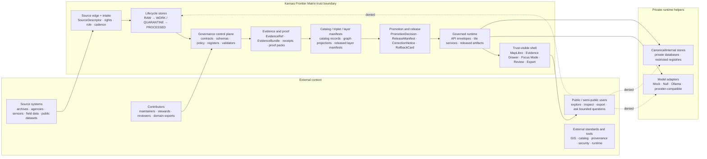
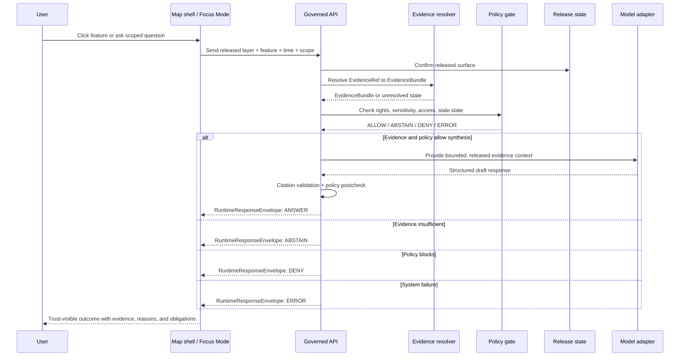

<!-- [KFM_META_BLOCK_V2]
doc_id: kfm://doc/needs-verification/system-context
title: System Context
type: standard
version: v1
status: draft
owners: NEEDS_VERIFICATION
created: NEEDS_VERIFICATION
updated: 2026-05-06
policy_label: NEEDS_VERIFICATION
related: [../../README.md, ./README.md, ./governed-api.md, ./map-shell.md, ../adr/ADR-0014-truth-path.md, ../adr/ADR-0001-schema-home.md, ../adr/ADR-0010-local-exposure-security.md, ../adr/ADR-0206-maplibre-layer-manifest.md, ../adr/ADR-0207-governed-ai-runtime-envelope.md, ../adr/ADR-0304-hydrology-first-proof-lane.md, ../standards/markdown-rules.md]
tags: [kfm, architecture, system-context, evidence-first, map-first, governed-ai, publication]
notes: [Replaces existing one-line system-context stub, owner created date doc_id and policy_label require repository steward verification, reconcile this requested metadata profile with ADR-0017 before promotion, runtime routes tests workflows dashboards deployments and branch protection are not asserted by this document]
[/KFM_META_BLOCK_V2] -->

<a id="top"></a>

# System Context

Kansas Frontier Matrix is a governed, evidence-first, map-first, time-aware spatial knowledge and publication system for inspectable Kansas-centered claims.


**Quick jumps:** [At a glance](#at-a-glance) · [Repo fit](#repo-fit) · [System boundary](#system-boundary) · [Actors and external systems](#actors-and-external-systems) · [Trust path](#trust-path) · [Runtime surfaces](#runtime-surfaces) · [Denied shortcuts](#denied-shortcuts) · [Validation](#validation) · [Open verification](#open-verification)

---

## At a glance

This document defines the KFM system context: who interacts with KFM, what sits inside the trust boundary, which surfaces are allowed to publish or interpret evidence, and which shortcuts are denied by default.

| Area | Context decision |
|---|---|
| System identity | KFM is a governed spatial evidence and publication system, not only a map viewer, GIS data folder, AI assistant, graph, dashboard, or static report generator. |
| Durable public unit | The durable public unit is the **inspectable claim**: a claim whose evidence, source role, spatial scope, temporal scope, policy posture, review state, release state, correction lineage, and rollback target can be inspected. |
| Primary operating surface | Map-first and time-aware. MapLibre may render released artifacts and collect interaction context, but it is downstream of trust. |
| Public boundary | Public and ordinary UI clients use governed APIs, released artifacts, released layer manifests, catalog records, and EvidenceBundle-backed payloads. |
| AI boundary | AI is interpretive only. Focus Mode and other AI-assisted surfaces use finite outcomes: `ANSWER`, `ABSTAIN`, `DENY`, or `ERROR`. |
| Publication law | Promotion is a governed state transition, not a file move, successful ETL run, dashboard refresh, rendered tile, graph edge, search result, or generated answer. |

> [!IMPORTANT]
> This architecture document states the intended and governing KFM context. It does **not** claim that every route, schema, validator, policy gate, workflow, dashboard, deployment, proof pack, or runtime behavior is currently implemented.

---

## Repo fit

| Relationship | Path or surface | Role |
|---|---|---|
| This document | `docs/architecture/system-context.md` | Human-facing system context and trust-boundary overview |
| Architecture index | [`./README.md`](./README.md) | Local architecture landing page |
| Governed API note | [`./governed-api.md`](./governed-api.md) | Public-client boundary reminder |
| Map shell note | [`./map-shell.md`](./map-shell.md) | Renderer and shell-placement reminder |
| Truth path ADR | [`../adr/ADR-0014-truth-path.md`](../adr/ADR-0014-truth-path.md) | Governing lifecycle and public trust membrane |
| Schema-home ADR | [`../adr/ADR-0001-schema-home.md`](../adr/ADR-0001-schema-home.md) | Canonical machine-schema placement proposal |
| Local exposure ADR | [`../adr/ADR-0010-local-exposure-security.md`](../adr/ADR-0010-local-exposure-security.md) | Deny-by-default local exposure and model-runtime boundary |
| Layer manifest ADR | [`../adr/ADR-0206-maplibre-layer-manifest.md`](../adr/ADR-0206-maplibre-layer-manifest.md) | MapLibre layer governance envelope |
| AI runtime envelope ADR | [`../adr/ADR-0207-governed-ai-runtime-envelope.md`](../adr/ADR-0207-governed-ai-runtime-envelope.md) | Finite AI-assisted runtime response contract |
| Hydrology proof lane ADR | [`../adr/ADR-0304-hydrology-first-proof-lane.md`](../adr/ADR-0304-hydrology-first-proof-lane.md) | First proof-bearing domain-lane sequencing decision |
| Markdown rules | [`../standards/markdown-rules.md`](../standards/markdown-rules.md) | Documentation truth-label and formatting expectations |
| Root orientation | [`../../README.md`](../../README.md) | Project-wide purpose, lifecycle, object families, and contributor guidance |

**Owning root:** `docs/`

**Directory basis:** `docs/architecture/` is the human-facing architecture surface. Domain-specific architecture should live under the proper responsibility root, not as new root-level domain folders.

---

## System boundary

KFM’s system boundary is a **trust membrane**. It admits source material, derives governed artifacts, and releases public-safe surfaces only after evidence, policy, review, catalog, proof, release, correction, and rollback obligations are satisfied.



### Boundary rules

| Boundary | Allowed | Denied by default |
|---|---|---|
| Source edge | Intake records, source descriptors, source terms, retrieval receipts, steward review | Treating source-native content as public truth without lifecycle and policy gates |
| Lifecycle stores | Controlled transformation and validation | Public reads from `RAW`, `WORK`, `QUARANTINE`, unpublished candidates, or direct canonical/internal stores |
| Governance control plane | Contracts, schemas, policies, registers, validators, ADRs, review records | Moving machine authority into prose-only summaries |
| Publication boundary | Promotion decision, release manifest, proof pack, correction path, rollback target | Treating file movement, tile generation, graph projection, or ETL success as publication |
| Runtime boundary | Governed API, released artifacts, finite envelopes, EvidenceBundle-backed responses | Direct browser-to-model, browser-to-database, or browser-to-internal-store traffic |
| UI boundary | Map shell, Evidence Drawer, Focus Mode, review, export, diagnostics with trust state | Map popups, model prose, dashboards, screenshots, or tiles as sovereign truth |

[Back to top](#top)

---

## Actors and external systems

| Actor or system | Primary interaction with KFM | Trust requirement |
|---|---|---|
| Public user | Explores maps, opens Evidence Drawer, reads stories, exports public-safe artifacts, asks bounded Focus Mode questions | Sees released public-safe material only; unsupported claims produce `ABSTAIN`, `DENY`, or `ERROR` |
| Domain contributor | Adds or reviews source descriptors, fixtures, domain docs, schemas, validators, or candidate transformations | Work enters proper responsibility roots and remains labeled until validated |
| Steward / reviewer | Reviews rights, source role, sensitivity, cultural or ecological risk, release readiness, correction, and rollback | Review records remain separate from generated summaries and publication artifacts |
| Maintainer | Owns repository structure, ADRs, validation, CI, release controls, and rollback discipline | Does not claim enforcement without inspected files, tests, workflows, logs, or emitted proof |
| Source steward / upstream provider | Provides or governs an input source, public dataset, archival source, service, or steward-controlled record | Source authority, terms, cadence, and caveats are represented in source descriptors |
| Governed API | Mediates public and semi-public runtime requests | Applies evidence resolution, policy, release state, finite outcomes, and audit IDs |
| MapLibre shell | Renders released map artifacts and returns selected feature, camera, viewport, layer, and time context | Renderer remains downstream of released manifests and governed evidence resolution |
| Model adapter | Summarizes or interprets resolved, policy-safe evidence | Cannot decide truth, policy, review, release, or citation validity |
| Catalog / graph / tile stores | Accelerate discovery, spatial rendering, and relationship navigation | Derived carriers only; must resolve back to evidence and release state |

---

## Trust path

KFM’s default truth path is:

```text
SOURCE EDGE
  -> RAW
  -> WORK / QUARANTINE
  -> PROCESSED
  -> CATALOG / TRIPLET
  -> REVIEW / POLICY / PROOF
  -> RELEASE
  -> PUBLISHED
  -> GOVERNED API / TILE SERVICE / EXPORT
  -> MAP SHELL / EVIDENCE DRAWER / FOCUS MODE
```

A consequential public-facing claim should be able to travel this chain:

```text
InspectableClaim
  -> EvidenceRef
  -> EvidenceBundle
  -> SourceDescriptor
  -> ValidationReport
  -> PolicyDecision
  -> ReviewRecord
  -> ProofPack
  -> ReleaseManifest
  -> CorrectionNotice / RollbackCard
```



---

## Runtime surfaces

### Governed API

The governed API is the normal public and semi-public entry point into KFM.

It should return finite, evidence-aware envelopes rather than raw records or fluent prose. The exact route names and DTO implementation remain `NEEDS_VERIFICATION` until active route files, OpenAPI contracts, tests, and runtime evidence are inspected.

| Runtime obligation | Required posture |
|---|---|
| Evidence resolution | Resolve `EvidenceRef` to `EvidenceBundle` before public claim emission |
| Policy checks | Evaluate rights, sensitivity, source role, access role, review state, release state, freshness, and correction state |
| Outcome grammar | Use `ANSWER`, `ABSTAIN`, `DENY`, or `ERROR` for consequential runtime responses |
| Auditability | Preserve request ID, evidence refs, policy decision refs, release refs, and receipt refs where applicable |
| Public safety | Avoid leaking restricted details through reasons, errors, cache state, or model summaries |

### Map shell

The map shell is a trust-visible UI surface. It should render released artifacts through manifests and make evidence, policy, review, freshness, and correction state visible.

| Map shell action | Context rule |
|---|---|
| Click feature | MapLibre identifies a visual candidate; governed API resolves evidence before consequential claim text |
| Hover feature | Allowed for low-risk affordance; avoid authoritative claims unless already Drawer-validated |
| Layer toggle | Changes manifest/view state, not publication state |
| Time brushing | Time scope travels to Evidence Drawer and Focus Mode; visual time and evidence time must not silently diverge |
| Export | Trust metadata, citations, release ID, and correction state travel with exported content |

### Evidence Drawer

Evidence Drawer is the inspection surface for “what backs this?”

Minimum drawer payload concerns:

| Drawer concern | Expected content |
|---|---|
| Evidence identity | `EvidenceBundle`, `EvidenceRef`, supported object IDs |
| Source role | Source authority, role, caveats, terms, cadence |
| Scope | Place or geometry, time basis, opened-from surface |
| Policy | Rights, sensitivity, redaction or generalization posture |
| Review and freshness | Review state, freshness class, promotion/correction state |
| Provenance | Transform summary, lineage note, receipt or audit references |

### Focus Mode

Focus Mode is evidence-bounded AI inside the governed shell.

| Outcome | Meaning |
|---|---|
| `ANSWER` | Released, policy-safe evidence is sufficient and citation validation passes |
| `ABSTAIN` | Evidence is missing, unresolved, stale, conflicting, outside scope, or source-role-inadequate |
| `DENY` | Policy, rights, sensitivity, access role, release state, or safety blocks the response |
| `ERROR` | Resolver, adapter, validator, policy engine, schema validation, or envelope assembly failed |

> [!CAUTION]
> Focus Mode may interpret released evidence. It cannot publish raw model language as truth, pick citations as authority, or read `RAW`, `WORK`, `QUARANTINE`, internal stores, or direct model runtimes on the normal public path.

[Back to top](#top)

---

## Denied shortcuts

KFM denies shortcuts that make the system look functional while weakening inspectability.

| Shortcut | Status | Reason |
|---|---:|---|
| Public UI reads `RAW`, `WORK`, or `QUARANTINE` | `DENY` | Bypasses lifecycle, policy, release, and rollback |
| Browser calls model runtime directly | `DENY` | Bypasses evidence resolution, policy, citations, and audit |
| MapLibre layer becomes truth authority | `DENY` | Renderer can draw candidates; it cannot decide truth or publication |
| Dashboard metric becomes proof | `DENY` | Dashboards are views over released evidence, not evidence themselves |
| Graph edge replaces canonical/evidence record | `DENY` | Graphs are projections and must remain evidence-backed |
| Vector index or search result becomes source authority | `DENY` | Retrieval accelerators are rebuildable derivatives |
| Promotion is treated as a file move | `DENY` | Publication requires validation, policy, review, proof, correction, and rollback |
| AI answer supplies uncited public claim | `ABSTAIN` or `ERROR` | Cite-or-abstain is the default truth posture |
| Unknown rights or sensitivity are ignored | `DENY` | Rights, sovereignty, cultural sensitivity, living-person data, DNA, archaeology, rare species, and infrastructure exposure fail closed |
| Domain work becomes a root-level folder by convenience | `DENY` | Domain lanes belong under responsibility roots |

---

## Evidence posture for this revision

| Claim | Label | Basis |
|---|---:|---|
| `docs/architecture/system-context.md` existed before this revision as a short stub | `CONFIRMED` | GitHub connector evidence |
| Adjacent architecture stubs exist for architecture index, governed API, and map shell | `CONFIRMED` | GitHub connector evidence |
| KFM’s root orientation states the evidence-first, map-first, time-aware system identity and lifecycle law | `CONFIRMED` | Root README evidence |
| The truth path and public trust membrane are documented in an ADR draft | `CONFIRMED` file presence / `PROPOSED` decision maturity | ADR evidence |
| The schema-home decision remains draft/proposed and needs enforcement proof | `CONFIRMED` draft posture | ADR evidence |
| Governed AI runtime envelopes use finite outcomes | `CONFIRMED` draft posture / `PROPOSED` implementation | ADR evidence |
| MapLibre layers should be governed through a `LayerManifest` | `CONFIRMED` draft posture / `PROPOSED` implementation | ADR evidence |
| Hydrology is accepted for proof-lane sequencing | `CONFIRMED` decision posture / implementation remains bounded | ADR evidence |
| CI, branch protections, deployments, live route behavior, dashboards, runtime logs, live source connectors, and release automation are complete | `UNKNOWN` | Not verified here |

---

## Validation

Use this checklist before treating this file as promoted architecture canon.

- [ ] Confirm `doc_id`, `owners`, `created`, and `policy_label`.
- [ ] Reconcile this requested metadata shape with the accepted or current Meta Block V2 ADR/profile before promotion.
- [ ] Confirm every relative link resolves from `docs/architecture/system-context.md`.
- [ ] Confirm whether `docs/architecture/README.md`, `governed-api.md`, and `map-shell.md` remain stubs or have been expanded elsewhere.
- [ ] Confirm ADR numbering and status for truth path, schema home, local exposure, MapLibre layer manifest, governed AI runtime envelope, and hydrology proof lane.
- [ ] Confirm whether route names, DTOs, OpenAPI contracts, schema files, validators, policy rules, tests, workflows, dashboards, release manifests, and proof packs exist before referencing them as implemented.
- [ ] Add or confirm negative-path tests for `no_public_raw_path`, `no_direct_model_client`, unresolved evidence, unknown rights, sensitive exact geometry, stale source, missing rollback target, and unsupported AI claim.
- [ ] Confirm that public UI surfaces display `ANSWER`, `ABSTAIN`, `DENY`, and `ERROR` distinctly.
- [ ] Confirm rollback and correction paths for any released artifacts referenced by public clients.

### Proposed architecture acceptance gates

| Gate | Evidence needed before status upgrade |
|---|---|
| Metadata gate | Verified owner, steward, policy label, and document registry entry |
| Link gate | Relative-link check from this file location |
| ADR gate | Related ADRs indexed with current status and supersession notes |
| Contract/schema gate | Schema-home decision reflected in contract/schema docs and validators |
| Policy gate | Public-client restrictions and finite outcomes covered by policy or tests |
| Runtime gate | Governed API, Evidence Drawer, Focus Mode, and Map shell behavior verified by tests or runtime artifacts |
| Release gate | Release manifests, proof packs, correction notices, and rollback cards exist for promoted public surfaces |

[Back to top](#top)

---

## Open verification

| Item | Status | Why it matters |
|---|---:|---|
| Document owner | `NEEDS_VERIFICATION` | Architecture ownership affects review and promotion |
| Policy label | `NEEDS_VERIFICATION` | Determines public/internal handling |
| Created date | `NEEDS_VERIFICATION` | Existing stub predates this revision; source date should come from git history or document registry |
| Meta Block V2 profile | `NEEDS_VERIFICATION` | Repo ADR-0017 uses a richer V2 profile; this file follows the requested authoring block and needs reconciliation |
| Architecture index maturity | `NEEDS_VERIFICATION` | Adjacent architecture docs may still be stubs |
| Schema-home enforcement | `NEEDS_VERIFICATION` | Machine schema authority is draft/proposed until validators and consumers are proven |
| Governed API implementation | `UNKNOWN` | This doc names the boundary, not current route behavior |
| Map shell implementation | `UNKNOWN` | MapLibre role is documented; actual shell behavior requires UI evidence |
| Evidence Drawer implementation | `UNKNOWN` | Drawer contract and runtime behavior need fixtures/tests/components |
| Focus Mode implementation | `UNKNOWN` | Runtime envelope and citation validation need tests and API evidence |
| CI and branch protection | `UNKNOWN` | Workflow files alone do not prove required checks or enforcement |
| Runtime logs and dashboards | `UNKNOWN` | No runtime evidence was inspected for this revision |
| Source rights and sensitivity posture | `NEEDS_VERIFICATION` | Source-specific publication must fail closed when rights or sensitivity are unclear |

---

## Maintenance notes

Update this document when:

- the architecture index changes;
- the truth-path ADR is accepted, superseded, or renumbered;
- schema-home authority is accepted and enforcement lands;
- governed API routes or runtime envelopes become verified implementation;
- MapLibre layer manifest, Evidence Drawer, or Focus Mode contracts change;
- hydrology proof-lane acceptance evidence changes;
- CI or validation gates begin enforcing any claim described here;
- public exposure, local model runtime, or release/correction posture changes.

Do not update this document to “smooth over” uncertainty. Use `CONFIRMED`, `PROPOSED`, `UNKNOWN`, and `NEEDS_VERIFICATION` where the distinction matters.

[Back to top](#top)
