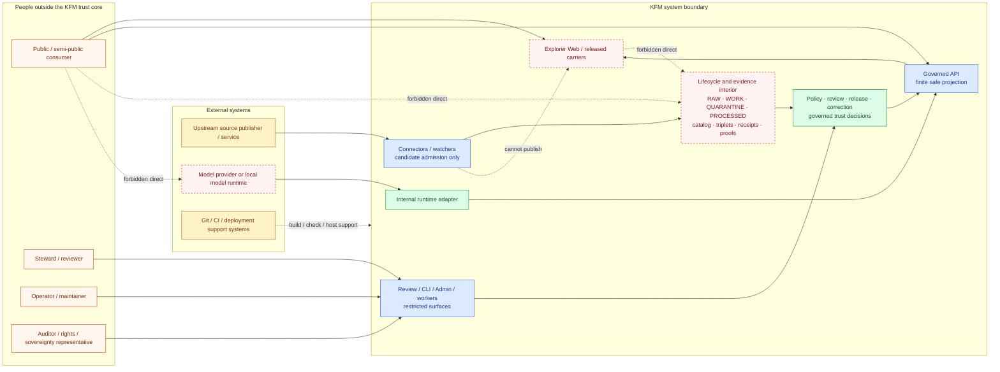

<!-- [KFM_META_BLOCK_V2]
doc_id: kfm://doc/architecture-system-context-v1
title: KFM System Context
type: architecture-context
version: v2
prior_version: v1
status: repository-grounded draft
owners:
  - "@bartytime4life — CODEOWNERS review route only"
  - "NEEDS VERIFICATION — accountable architecture, application, evidence, policy, security, runtime, release, and operations stewardship"
created: 2026-05-14
updated: 2026-08-19
policy_label: public
current_path: docs/architecture/system-context.md
owning_root: docs/
responsibility: >-
  Explain the people and external systems around KFM, the system boundary, allowed and
  forbidden boundary crossings, and the trust evidence required at those crossings without
  becoming doctrine, contract, schema, policy, implementation, release, deployment, or
  publication authority.
truth_posture: >-
  CONFIRMED commit-pinned repository paths, accepted Directory Rules decision, current
  review route, and bounded app/lifecycle surfaces; PROPOSED target interactions and
  complete end-to-end behavior; UNKNOWN deployment, live source activation, public
  availability, identity-provider integration, operational review, and production runtime
  unless separately proved.
evidence_snapshot:
  repository: bartytime4life/Kansas-Frontier-Matrix
  base_ref: main
  base_commit: 4f222c5b7ef852d2f3577b2a27c146d3d3641225
  target_prior_blob: e2d09f6ecb88f2b514d73887d59c501e27658fe4
  architecture_readme_blob: fe50cdda2199ec829a9d2baeeb7f1158cdd02951
  system_map_blob: 03fac64be0aab412ec9aae2ed79a657cd4ff8706
  directory_rules_blob: fd49a0b83e55cef52c1124281f093e263526898d
  directory_rules_decision: ADR-0029 accepted
  codeowners_blob: dd2a84aa514d8ecd9208bc347f90f9a2ed37dd61
  apps_readme_blob: 6cd825905976b2b662e43497203206305cb78827
  governed_api_readme_blob: 4f21150852f133ba919b11f4f8792185fa870dae
  deployment_topology_blob: 8d3a498964628b7bb319910d74a149243e543451
  data_readme_blob: 24cfdd38fd8b1c0c8fc5fa5eda148fe6d5eddaa3
  current_open_prs_touching_target: 0
prepared_under_prompt: KFM Repository Build-Out & Markdown Modernization Implementation Agent v6.0.0
related:
  - README.md
  - SYSTEM_MAP.md
  - deployment-topology.md
  - governed-api/README.md
  - map-shell.md
  - contract-schema-policy-split.md
  - document-convergence-plan.md
  - ../doctrine/authority-ladder.md
  - ../doctrine/truth-posture.md
  - ../doctrine/trust-membrane.md
  - ../doctrine/lifecycle-law.md
  - ../doctrine/directory-rules.md
  - ../adr/ADR-0029-adopt-directory-governance-standard-v2.md
  - ../adr/INDEX.md
  - ../../apps/README.md
  - ../../apps/governed-api/README.md
  - ../../apps/explorer-web/README.md
  - ../../apps/review-console/README.md
  - ../../data/README.md
  - ../../policy/README.md
  - ../../release/README.md
  - ../../runtime/README.md
  - ../../.github/CODEOWNERS
tags:
  - kfm
  - architecture
  - system-context
  - system-boundary
  - trust-membrane
  - external-actors
  - governed-interfaces
notes:
  - "Same-path modernization; no move, rename, alias, root, contract, schema, policy, code, workflow, data, release, deployment, or publication transition."
  - "SYSTEM_MAP.md remains the primary whole-system orientation. This page owns system context, external actors and systems, and boundary interactions."
  - "ADR-0029 is the only accepted numbered ADR at the evidence snapshot; every other numbered ADR remains proposed."
  - "Legacy major-section anchors are preserved even where the section role is narrowed."
[/KFM_META_BLOCK_V2] -->

<a id="top"></a>

# KFM System Context

> **One-line purpose.** Define who and what sits around Kansas Frontier Matrix, which governed surfaces may cross the system boundary, which paths are forbidden, and what evidence must exist before any boundary response is treated as authoritative.

[](#status-and-evidence-boundary)
[](#status-and-evidence-boundary)
[](#2-authority-and-status)
[](#1-purpose-and-scope)
[](#status-and-evidence-boundary)

> [!IMPORTANT]
> **This document is explanatory, not sovereign.** Accepted doctrine and ADRs, semantic contracts, machine schemas, policy, code and configuration, executable tests and workflows, receipts and proofs, append-only release records, and observed runtime evidence outrank this page for the questions they own. Repository presence proves bytes at a pinned commit; it does not prove deployment, authorization, review, release, public safety, or publication.

> [!NOTE]
> [`SYSTEM_MAP.md`](./SYSTEM_MAP.md) is the primary whole-system orientation. This page has a narrower responsibility: **people, external systems, the KFM boundary, and allowed or forbidden interactions across it**. It must not become a competing plane map, lifecycle specification, API contract, or deployment topology.

## Status and evidence boundary

| Field | Current bounded result |
|---|---|
| Document role | Human-readable system-context and external-interface map |
| Repository location | **CONFIRMED:** `docs/architecture/system-context.md` |
| Placement result | **PLACE:** the existing file explains a cross-cutting human architecture concern under `docs/architecture/` |
| Evidence base | **CONFIRMED:** `main@4f222c5b7ef852d2f3577b2a27c146d3d3641225` |
| Placement authority | **CONFIRMED:** Directory Rules v2 adopted by accepted ADR-0029 |
| Numbered ADR posture | **CONFIRMED:** ADR-0029 is accepted; all other numbered ADRs remain proposed at this snapshot |
| Verified GitHub review route | **CONFIRMED:** `@bartytime4life` through `.github/CODEOWNERS`; specialist stewardship remains **NEEDS VERIFICATION** |
| Repository-present boundary surfaces | **CONFIRMED:** `apps/governed-api/`, `apps/explorer-web/`, `apps/review-console/`, `apps/cli/`, `apps/admin/`, `apps/workers/`, `connectors/`, `runtime/`, `data/`, `policy/`, and `release/` exist |
| Bounded executable posture | **MIXED:** Governed API has fail-closed scaffold routes; Explorer has a static fixture-first shell and independently tested trust components; several restricted app lanes remain scaffolded or documentation-led |
| Operational posture | **UNKNOWN:** live authorization, source activation, public endpoints, identity provider, deployed services, production health, audit sinks, and release/publication parity are not established here |
| Change effect | Documentation only; no authority, implementation, lifecycle, release, deployment, or publication transition |

### Truth split used throughout

- **CONFIRMED** — current repository bytes, accepted ADR-0029, current review routing, or bounded executable evidence inspected at the pinned base.
- **PROPOSED** — a target interaction, complete end-to-end trust flow, or future system behavior not yet proved.
- **UNKNOWN** — deployment, live source activation, public availability, operational authorization, or runtime behavior not established by current evidence.
- **NEEDS VERIFICATION** — a concrete repository, CI, ownership, security, runtime, or release check remains before relying on the claim.

**Quick navigation:** [Purpose](#1-purpose-and-scope) · [Authority](#2-authority-and-status) · [System identity](#3-what-kfm-is-and-what-it-is-not) · [Actors and boundary](#4-external-actors-and-the-system-boundary) · [Trust spine](#5-the-trust-spine) · [Boundary zones](#6-boundary-zones-and-relationship-to-the-system-map) · [Lifecycle](#7-canonical-data-lifecycle) · [Trust objects](#8-core-trust-object-families) · [Finite outcomes](#9-finite-outcomes-and-governance-grammar) · [Invariants](#10-trust-membrane-invariants) · [AI boundary](#11-ai-as-an-interpretive-layer) · [Cross-cutting concerns](#12-cross-cutting-concerns) · [Out of scope](#13-what-this-document-does-not-own) · [Verification](#14-open-questions-and-verification-backlog) · [Related](#15-related-documents) · [Glossary](#appendix-a--glossary) · [Change reconciliation](#appendix-b--change-reconciliation-and-rollback)

---

<a id="1-purpose--scope"></a>

## 1. Purpose and scope

This page answers five system-context questions:

1. **Who uses, reviews, operates, audits, supplies, or constrains KFM?**
2. **Which external systems exchange information with KFM?**
3. **Which repository-present surfaces represent the boundary today?**
4. **Which boundary crossings are allowed, role-gated, held, or categorically forbidden?**
5. **Which evidence must exist before a response may be treated as a KFM-grade answer, released carrier, review action, correction, or rollback?**

### What this page owns

- Human and system actors outside the KFM trust core.
- The logical KFM system boundary.
- Allowed, restricted, and forbidden interaction paths.
- Minimum trust questions at each boundary crossing.
- Current repository evidence for boundary-facing surfaces.
- Explicit uncertainty where deployment or operation is not proved.

### What this page does not own

It does not define the full responsibility-plane map, object semantics, schema fields, policy rules, route names, authorization model, source activation, deployment topology, release decision, or runtime behavior. Those responsibilities belong to the narrower sources listed in [§13](#13-what-this-document-does-not-own).

### Reading order

| Question | Read first |
|---|---|
| How does the whole system fit together? | [`SYSTEM_MAP.md`](./SYSTEM_MAP.md) |
| Who or what crosses the KFM boundary? | This page |
| How are hosts, networks, images, environments, and exposure arranged? | [`deployment-topology.md`](./deployment-topology.md) |
| What must public and semi-public traffic pass through? | [`governed-api/README.md`](./governed-api/README.md) and the Governed API app README |
| How does the map shell consume governed responses? | [`map-shell.md`](./map-shell.md) and the Explorer README |
| What do contracts, schemas, policy, tests, receipts, proofs, and release records own? | [`contract-schema-policy-split.md`](./contract-schema-policy-split.md) |
| Which placement rules are effective? | Accepted ADR-0029 plus [`directory-rules.md`](../doctrine/directory-rules.md) |

[Back to top](#top)

---

<a id="2-authority--status"></a>

## 2. Authority and status

### Placement basis

The artifact is a human architecture explanation. Its authority owner is `docs/`; its scope is cross-cutting system context; its exposure is public; and its retention is repository lifetime. Exactly one existing path satisfies that responsibility signature: `docs/architecture/system-context.md`.

**Placement outcome:** `PLACE`. No move, rename, alias, sibling authority, or structural migration is required.

### Authority order for claims on this page

1. KFM trust, evidence, lifecycle, public-boundary, correction, and rollback invariants.
2. Accepted, unsuperseded ADRs within their stated scope.
3. Adopted Directory Rules for placement.
4. Semantic contracts, schemas, policy, current code/configuration, tests/workflows, receipts/proofs, and release records for their owned questions.
5. Current repository evidence for implementation fact.
6. This architecture explanation.
7. Proposed ADRs, domain dossiers, atlases, manuals, and prior plans as design lineage.

> [!CAUTION]
> **Do not infer acceptance from repetition.** Proposed ADR-0004, ADR-0005, ADR-0008, ADR-0019, ADR-0025, and related architecture plans may describe a coherent target, but they remain proposed. This page records current repository surfaces and KFM invariants without silently accepting those decisions.

### Ownership and review

`.github/CODEOWNERS` routes repository review to `@bartytime4life`. That is a verified GitHub review route only. It is not an architecture stewardship assignment, independent review, `ReviewRecord`, `PolicyDecision`, release approval, or evidence that review occurred.

[Back to top](#top)

---

<a id="3-what-kfm-is-and-is-not"></a>

## 3. What KFM is and what it is not

### What KFM is

KFM is a **governed, evidence-first, map-first, time-aware spatial knowledge and publication system**. Its durable public objective is an **inspectable claim**: a statement or map-supported assertion whose source role, evidence, spatial and temporal scope, rights and sensitivity posture, policy and review state, release state, correction lineage, and rollback relationship can be examined at the level appropriate to its consequence.

That statement is an architectural requirement, not proof that every current repository surface already satisfies it end to end.

### What KFM is not

| KFM is not | Boundary consequence |
|---|---|
| A map application with optional citations | Map, tiles, popups, screenshots, and stories are downstream carriers and must not create truth. |
| A general chatbot over internal data | Public clients do not call model runtimes or canonical stores directly. |
| A source authority substitute | KFM preserves source identity and role; it does not replace the agency, steward, archive, publisher, or rights holder that supplied the evidence. |
| A live-feed firehose | Watchers and connectors may detect or admit candidates; they do not publish. |
| An emergency alert or operational command authority | Hazard and advisory surfaces must direct users to official channels and must not imply life-safety authority. |
| A public read-through to internal storage | RAW, WORK, QUARANTINE, candidate, proof, and canonical stores remain behind governed interfaces. |
| An automatic publisher | A successful fetch, transform, test, workflow, build, commit, merge, or deployment does not itself authorize release or publication. |
| A documentation-driven implementation | Architecture prose cannot substitute for contracts, schemas, policy, code, tests, receipts, proofs, review, release, correction, or rollback. |

[Back to top](#top)

---

<a id="4-external-actors--the-system-boundary"></a>

## 4. External actors and the system boundary

The **system boundary** separates KFM-controlled responsibilities from people and systems that supply, consume, review, operate, constrain, or audit them. The **trust membrane** is the governed interaction boundary that prevents external or ordinary client traffic from becoming direct access to internal truth-bearing or restricted state.

### 4.1 Human actors

| Actor | Legitimate purpose | Normal governed surface | Required boundary posture |
|---|---|---|---|
| Public or semi-public consumer | Explore released public-safe claims, layers, evidence, corrections, and exports | Explorer Web, Governed API, released public-safe carriers | No direct internal-store or model access; finite response outcomes |
| Steward or reviewer | Review source admission, evidence, policy obligations, corrections, and release candidates | Review Console or another role-gated governed interface | Authorization, audit, accountable review scope, no silent self-approval |
| Operator or maintainer | Run bounded validation, rebuild, rollback, diagnostic, and maintenance tasks | CLI, Admin, workers, repository tooling, runbooks | Restricted, least-privilege, auditable; never a normal public path |
| Auditor, oversight reviewer, or rights holder | Inspect provenance, decisions, release state, correction, withdrawal, and obligations | Governed read-only evidence/release projection or role-gated review surface | Disclosure limited by policy, rights, sensitivity, and purpose |
| Sovereignty, consent, or affected-community representative | Impose, review, narrow, withdraw, or correct access and representation obligations | Governed review/correction process | Restrictions must be applied before public carrier generation, not hidden only by style |
| Contributor or domain practitioner | Propose source, contract, schema, code, test, documentation, or domain changes | Repository contribution and review workflow | A contribution is a candidate change, not release or publication authority |

Specialist roles are descriptive until a verified assignment exists. This page does not invent a person, team, or separation-of-duty state.

### 4.2 External system actors

| External system | Intended relationship | Current evidence boundary |
|---|---|---|
| Upstream source publisher or data service | Supplies source material or immutable references through a governed connector/admission path | Connector and source lanes exist; live activation and current rights/terms remain source-specific and must be verified |
| External standards, registries, and identifier authorities | Supply vocabularies, identifiers, catalog or format constraints | Standards profiles exist in the repository; current conformance and version pinning remain separately verified |
| Model provider or local model runtime | Receives bounded server-side requests through an internal runtime adapter and returns interpretive candidates | `runtime/` exists; direct public traffic is denied; live provider composition remains unproved here |
| Git hosting and CI platform | Carries proposed repository changes and validation signals | GitHub repository, workflows, and CODEOWNERS are present; a green check is not review, release, deployment, or publication |
| Deployment environment, identity provider, secret store, proxy, and observability service | Supports admitted runtime operation | No complete current environment inventory or operational integration is established by this page |

### 4.3 Context diagram


```mermaid
flowchart LR
    classDef person fill:#fff7ed,stroke:#c2410c,color:#7c2d12;
    classDef external fill:#fef3c7,stroke:#b45309,color:#78350f;
    classDef edge fill:#dbeafe,stroke:#1d4ed8,color:#1e3a8a;
    classDef internal fill:#dcfce7,stroke:#15803d,color:#14532d;
    classDef forbidden fill:#fef2f2,stroke:#b91c1c,color:#7f1d1d,stroke-dasharray:4 4;

    subgraph PEOPLE["People outside the KFM trust core"]
      PUBLIC["Public / semi-public consumer"]:::person
      REVIEWER["Steward / reviewer"]:::person
      OPERATOR["Operator / maintainer"]:::person
      RIGHTS["Auditor / rights / sovereignty representative"]:::person
    end

    subgraph EXT["External systems"]
      SOURCE["Upstream source publisher / service"]:::external
      MODEL["Model provider or local model runtime"]:::external
      PLATFORM["Git / CI / deployment support systems"]:::external
    end

    subgraph KFM["KFM system boundary"]
      CONNECT["Connectors / watchers<br/>candidate admission only"]:::edge
      LIFE["Lifecycle and evidence interior<br/>RAW · WORK · QUARANTINE · PROCESSED<br/>catalog · triplets · receipts · proofs"]:::internal
      TRUST["Policy · review · release · correction<br/>governed trust decisions"]:::internal
      API["Governed API<br/>finite safe projection"]:::edge
      EXPLORER["Explorer Web / released carriers"]:::edge
      REVSURF["Review / CLI / Admin / workers<br/>restricted surfaces"]:::edge
      RUNTIME["Internal runtime adapter"]:::internal
    end

    SOURCE --> CONNECT --> LIFE
    LIFE --> TRUST --> API --> EXPLORER
    PUBLIC --> EXPLORER
    PUBLIC --> API
    REVIEWER --> REVSURF
    OPERATOR --> REVSURF
    RIGHTS --> REVSURF
    REVSURF --> TRUST
    MODEL --> RUNTIME --> API
    PLATFORM -. "build / check / host support" .-> KFM

    PUBLIC -. "forbidden direct" .-> LIFE:::forbidden
    EXPLORER -. "forbidden direct" .-> LIFE:::forbidden
    PUBLIC -. "forbidden direct" .-> MODEL:::forbidden
    CONNECT -. "cannot publish" .-> EXPLORER:::forbidden
```

The diagram is a logical context model. Solid arrows show allowed architectural directions; they do not prove that a live deployment, authorization layer, source connector, or runtime integration currently operates.

### 4.4 Allowed and forbidden crossings

| Crossing | Posture |
|---|---|
| Public client → Governed API or released public-safe carrier | **Allowed when** release, evidence, policy, correction, and sensitivity obligations close |
| Public client → RAW / WORK / QUARANTINE / canonical or proof store | **DENY** |
| Browser → model provider or local model runtime | **DENY** |
| Reviewer → role-gated review projection | **Allowed when** authorization, audit, purpose, and review scope are established |
| Operator → CLI/Admin/worker/tooling surface | **Restricted:** least privilege, auditable, not a public shortcut |
| Source publisher → connector/admission boundary | **Candidate only:** source role, rights, terms, identity, and sensitivity must be known |
| Watcher/connector → PUBLISHED or public carrier | **DENY:** watchers are non-publishers |
| Rights/sovereignty decision → public carrier transform | **Required before exposure** when sensitivity, consent, location, or representation obligations apply |
| Runtime adapter → Governed API | **Internal and bounded:** output remains subordinate to evidence, policy, citation, and finite outcomes |
| CI success → release/publication | **No transition:** validation evidence is necessary but not sufficient |

[Back to top](#top)

---

<a id="5-the-trust-spine"></a>

## 5. The trust spine

Every consequential boundary response should be reconstructable through this sequence:

```text
source identity and admission
    -> lifecycle state
    -> EvidenceRef -> EvidenceBundle resolution
    -> policy, rights, sensitivity, and review decision
    -> validation and proof closure
    -> release decision + correction and rollback references
    -> governed response or released public-safe carrier
    -> trust-visible map/UI/AI interpretation
```

| Boundary checkpoint | Minimum question | Fail-closed result |
|---|---|---|
| Source admission | Is source identity, authority role, rights, terms, cadence, and sensitivity known? | HOLD, QUARANTINE, or DENY |
| Evidence resolution | Can the requested claim resolve to the intended evidence with valid identity, digest, scope, and citation? | ABSTAIN, DENY, or ERROR |
| Policy and review | Is the requested use allowed for this actor, purpose, precision, time, and consequence? | DENY or HOLD |
| Validation | Do machine shape, identity, temporal, spatial, citation, and cross-object checks pass? | ERROR or HOLD |
| Release | Are review, proof, release, correction, withdrawal, and rollback obligations closed? | DENY or HOLD |
| Public projection | Is the result released, public-safe, in scope, citable, and current enough? | ANSWER, ABSTAIN, DENY, or ERROR |

Receipts record process memory. Proofs support closure. Catalogs support discovery. Release records decide state transitions. None substitutes for another.

[Back to top](#top)

---

<a id="6-the-five-cooperating-planes"></a>

## 6. Boundary zones and relationship to the System Map

The previous edition described **five cooperating planes**. That model is retained as lineage through this legacy anchor, but it is no longer maintained here as a competing whole-system decomposition. The current [`SYSTEM_MAP.md`](./SYSTEM_MAP.md) uses seven explanatory responsibility planes so doctrine/decisions, meaning/shape, admissibility, lifecycle/accountability, implementation, release/correction, and runtime/exposure do not collapse.

This page uses four **context zones**, not authority planes:

| Context zone | Contains | Boundary purpose |
|---|---|---|
| External source and constraint zone | Source publishers, standards bodies, rights holders, sovereignty/consent representatives | Supplies evidence, identity, terms, obligations, and correction pressure |
| KFM internal trust zone | Lifecycle data, evidence resolution, policy, review, validation, proofs, receipts, release, correction, rollback | Makes candidate material governable and inspectable |
| Governed delivery zone | Governed API, released carriers, controlled review and operator projections | Crosses the membrane without exposing internal authority directly |
| Consumer and support zone | Public users, reviewers, operators, auditors, external model/runtime and platform support | Consumes or supports bounded interactions according to role |

These zones help read the context diagram. They do not create a new root, lifecycle phase, contract, policy class, or decision authority.

[Back to top](#top)

---

<a id="7-canonical-data-lifecycle"></a>

## 7. Canonical data lifecycle

The governing lifecycle remains:

```text
RAW -> WORK / QUARANTINE -> PROCESSED -> CATALOG / TRIPLET -> PUBLISHED
```

Promotion is a governed state transition, not a file move, commit, pull request, merge, build, deployment, or badge change.

| Lane | Boundary posture |
|---|---|
| `data/raw/` | Internal source capture or immutable reference; no normal public access |
| `data/work/` | Internal candidate normalization and analysis; no normal public access |
| `data/quarantine/` | Internal hold for unresolved rights, sensitivity, quality, identity, evidence, or policy; no public access |
| `data/processed/` | Validated domain product; still not automatically released or public |
| `data/catalog/` | Governed discovery projection; only released/public-safe views may cross the membrane |
| `data/triplets/` | Derived relationship projection; never sovereign truth |
| `data/receipts/` and `data/proofs/` | Process memory and closure support; controlled exposure only |
| `data/published/` | Candidate home for released public-safe carriers; path presence alone does not prove a matching release decision or public availability |

Current repository presence of these lanes is **CONFIRMED** at the pinned base. Their completeness, source activation, promotion parity, operational release, and public serving are not established by path presence.

Source-edge or pre-RAW event patterns may govern attempted intake before RAW, but they do not amend the canonical lifecycle unless an accepted decision and implemented contract establish that effect.

[Back to top](#top)

---

<a id="8-canonical-object-families"></a>

## 8. Core trust-object families

This context page names only the minimum object responsibilities needed to understand boundary crossings. Exact semantics belong in `contracts/`; machine shape belongs in `schemas/`; admissibility belongs in `policy/`; execution belongs in code and tests; release state belongs in `release/`.

| Responsibility | Representative object families | Boundary question |
|---|---|---|
| Source identity | `SourceDescriptor`, source/version/authority records | What source is this, what role may it play, and under which rights or terms? |
| Evidence support | `EvidenceRef`, `EvidenceBundle` | What admissible evidence supports this claim, feature, answer, layer, or decision? |
| Policy and review | `PolicyDecision`, `ReviewRecord`, sensitivity/rights obligations | Is this actor and use allowed, restricted, held, generalized, delayed, or denied? |
| Validation and accountability | `ValidationReport`, receipts, proofs | What checks and transformations ran, with which inputs, outputs, failures, and identities? |
| Release and correction | `ReleaseManifest`, `CorrectionNotice`, withdrawal/supersession record, rollback reference | What state was released, corrected, withdrawn, or made reversible? |
| Runtime projection | `RuntimeResponseEnvelope` or equivalent governed response | Which finite outcome and public-safe payload may cross the membrane? |
| UI projection | Evidence Drawer, trust header, citation, stale/correction, and history payloads | How does the user inspect evidence and state without receiving internal authority directly? |

The repository contains multiple contracts, schemas, fixtures, validators, and documentation for these families, but this page does not claim complete cross-family parity or an end-to-end operational implementation.

[Back to top](#top)

---

<a id="9-finite-outcomes--the-governance-grammar"></a>

## 9. Finite outcomes and governance grammar

Public and semi-public runtime responses should resolve to exactly one of four finite outcomes:

| Runtime outcome | Meaning | Boundary behavior |
|---|---|---|
| `ANSWER` | Evidence, policy, review, release, citation, and scope support the response | Return the bounded public-safe payload with support and limitations |
| `ABSTAIN` | Evidence is missing, stale, weak, conflicting, unsafe to narrow, or out of scope | Explain the reason without fabricating an answer |
| `DENY` | Rights, sensitivity, actor role, source terms, release state, or exposure risk blocks the response | Do not leak the protected material or sensitive denial detail |
| `ERROR` | Schema, resolver, policy, adapter, infrastructure, or runtime failure prevents a reliable response | Return an audit-safe error reference; do not fall through to success |

`HOLD`, `PASS`, and `FAIL` may be valid review, validation, or promotion states, but they are not interchangeable with the four public runtime outcomes.

**Current bounded evidence:** Governed API has scaffold routes that return `ABSTAIN / NOT_IMPLEMENTED`. Complete `ANSWER`, `DENY`, and `ERROR` behavior, live authorization, evidence resolution, release binding, and deployed client transport remain **NEEDS VERIFICATION**.

[Back to top](#top)

---

<a id="10-trust-membrane-invariants"></a>

## 10. Trust-membrane invariants

| Invariant | Forbidden collapse |
|---|---|
| Governed public path | Public and semi-public clients use the Governed API or separately reviewed released public-safe carriers, not internal stores |
| Evidence before consequential answer | Generated or rendered language cannot replace `EvidenceRef -> EvidenceBundle` support |
| No public RAW path | RAW, WORK, QUARANTINE, candidate, canonical, proof, and internal runtime stores are not normal client data sources |
| No direct model path | Browser/public clients do not call model providers or local model runtimes directly |
| No style-only protection | Sensitive geometry or attributes must be removed, generalized, delayed, restricted, or denied before public carrier generation |
| No unreleased carrier | Tiles, COGs, GeoParquet, styles, scenes, exports, screenshots, and stories require applicable release and correction context |
| No popup-as-proof | A popup or tooltip may preview; material claims need inspectable evidence and state |
| Watchers are non-publishers | Connectors, watchers, workers, drift detectors, and AI candidate generators may propose work and emit receipts only |
| Admin is not public | CLI, Admin, Review, and operator shortcuts remain role-gated, least-privilege, audited, and outside the normal public path |
| CI is not release | Passing tests or workflows do not authorize promotion, deployment, publication, or policy approval |
| Correction remains visible | Correction, withdrawal, supersession, and rollback lineage must not be hidden by cache, carrier, UI, or summary state |

Current repository documentation and bounded fixtures express these rules. End-to-end enforcement across deployed traffic, authorization, caches, clients, and operational release remains **NEEDS VERIFICATION**.

[Back to top](#top)

---

<a id="11-ai-as-interpretive-layer-not-root-truth"></a>

## 11. AI as an interpretive layer

AI is a downstream interpretive capability, not a source, evidence, policy, review, or release authority.

### Allowed relationship

```text
client request
    -> Governed API
    -> scope + actor + policy precheck
    -> EvidenceRef -> EvidenceBundle resolution
    -> internal runtime adapter
    -> citation and policy postcheck
    -> finite RuntimeResponseEnvelope
    -> trust-visible client projection
```

### Required behavior

- Model traffic remains server-side or otherwise behind the governed membrane.
- Context is bounded to admissible evidence and released or explicitly review-authorized state.
- Citations resolve to the evidence actually used.
- Sensitive, restricted, stale, conflicted, or unsupported requests fail closed.
- AI output is recorded only at the accountability level the applicable contract requires; generated language is not proof.
- Public clients receive `ANSWER`, `ABSTAIN`, `DENY`, or `ERROR`, not raw provider responses.

### Forbidden behavior

- Browser-to-provider or browser-to-local-model direct calls.
- Model access to RAW, WORK, QUARANTINE, restricted, or unpublished state without an explicitly governed internal purpose.
- AI-only release, correction, sensitivity, rights, or source-authority decisions.
- Hidden prompt or chain-of-thought text used as evidence.
- Fluent fallback when evidence, policy, citation, or runtime evaluation fails.

`runtime/` and governed-AI documentation are repository-present. Live provider composition, prompt authority, model security, audit behavior, and production operation remain **UNKNOWN** unless separately proved.

[Back to top](#top)

---

<a id="12-cross-cutting-concerns"></a>

## 12. Cross-cutting concerns

| Concern | System-context requirement |
|---|---|
| Identity | Every boundary object needs stable identity and version/digest binding appropriate to its consequence |
| Time | Observation, validity, publication, retrieval, release, correction, and stale state remain distinct where material |
| Geography and representation | Map geometry is a representation at a scale and precision, not the territory or source itself |
| Source role | Observed, modeled, forecast, regulatory, administrative, aggregate, contextual, and synthetic material remain non-interchangeable |
| Rights and sensitivity | Unknown or unresolved rights, sovereignty, consent, living-person, genomic, rare-species, archaeology, infrastructure, land/title, or harmful-precision concerns fail closed |
| Accessibility | Trust state, negative outcomes, citations, corrections, and controls must be available without color, hover, or map-only interaction |
| Security and privacy | Least privilege, safe errors, no secret exposure, no internal path leakage, and deny-by-default access apply at every boundary |
| Correction and rollback | Public projections must be able to surface correction, withdrawal, supersession, and rollback state |
| Observability | Logs and metrics must support diagnosis without becoming a sensitive-data exfiltration path |
| Documentation | Docs explain boundaries and evidence; they do not substitute for enforcement or operational proof |

[Back to top](#top)

---

<a id="13-what-is-not-in-scope-of-this-document"></a>

## 13. What this document does not own

| Concern | Owning surface |
|---|---|
| Whole-system responsibility planes, root map, and maturity overview | [`SYSTEM_MAP.md`](./SYSTEM_MAP.md) |
| Architecture-lane navigation and convergence state | [`README.md`](./README.md) and [`document-convergence-plan.md`](./document-convergence-plan.md) |
| Deployment hosts, networks, containers, environments, exposure, and readiness | [`deployment-topology.md`](./deployment-topology.md), `infra/`, and runbooks |
| Governed API route and envelope architecture | [`governed-api/README.md`](./governed-api/README.md) and [`apps/governed-api/README.md`](../../apps/governed-api/README.md) |
| Explorer, MapLibre, Evidence Drawer, and Focus Mode composition | [`map-shell.md`](./map-shell.md) and [`apps/explorer-web/README.md`](../../apps/explorer-web/README.md) |
| Review, CLI, Admin, and worker implementation | App-local READMEs and implementation under `apps/` |
| Object meaning | `contracts/` |
| Machine-valid shape | `schemas/` |
| Allow, deny, restrict, hold, generalize, delay, and abstain rules | `policy/` plus governed review |
| Lifecycle instances, registries, receipts, proofs, catalog, triplets, and published carriers | [`data/README.md`](../../data/README.md) and lane-local controls |
| Release, correction, withdrawal, supersession, and rollback decisions | [`release/README.md`](../../release/README.md) |
| Runtime/provider composition | [`runtime/README.md`](../../runtime/README.md) |
| Trust-membrane doctrine and current case-collision migration state | [`docs/doctrine/trust-membrane.md`](../doctrine/trust-membrane.md) and the architecture [`README.md`](./README.md) |
| Domain-specific actors, sources, risks, and policy obligations | `docs/domains/<domain>/`, domain contracts/schemas/policy, and qualified stewards |
| Threat models, incident response, and security operations | `docs/security/` and `docs/runbooks/` |

[Back to top](#top)

---

<a id="14-open-questions--verification-backlog"></a>

## 14. Open questions and verification backlog

### P0 — before operational or public reliance

- **NEEDS VERIFICATION:** Prove that every public and semi-public client path uses the Governed API or a separately reviewed released-artifact path.
- **NEEDS VERIFICATION:** Prove no browser/client path reads RAW, WORK, QUARANTINE, canonical/internal, proof, or direct runtime/model stores.
- **NEEDS VERIFICATION:** Establish the actual authentication, authorization, purpose, audit, and role model for Review, CLI, Admin, workers, and any semi-public surface.
- **NEEDS VERIFICATION:** Prove `EvidenceRef -> EvidenceBundle` resolution, digest binding, policy/review checks, citation validation, and release-state binding for each claim-bearing response.
- **NEEDS VERIFICATION:** Prove correction, withdrawal, supersession, stale-state, and rollback propagation through API, caches, carriers, Explorer, exports, search, and AI.
- **NEEDS VERIFICATION:** Inventory live sources and verify identity, authority role, rights, terms, cadence, sensitivity, and source-activation decisions.
- **NEEDS VERIFICATION:** Inventory deployed environments, public endpoints, identity providers, proxies, secret stores, audit sinks, monitoring, and incident routes.
- **NEEDS VERIFICATION:** Identify accountable human stewards and independent review requirements rather than treating role names or CODEOWNERS as assignments.
- **HOLD:** Do not treat proposed ADRs as accepted system-boundary decisions without an explicit status transition in the source ADR and index.

### P1 — bounded implementation closure

- **PROPOSED:** Add one deterministic, no-network boundary proof that exercises a public-client fixture through a governed `ABSTAIN` response while negative fixtures prove direct internal-store and direct-model paths are denied.
- **PROPOSED:** Add a role-gated review fixture that proves public, reviewer, operator, and auditor projections are distinct and audit-safe.
- **PROPOSED:** Bind one released synthetic carrier to evidence, policy, review, correction, and rollback references and prove deterministic replay.
- **NEEDS VERIFICATION:** Reconcile the system-context actor vocabulary with contracts and policy without creating a parallel actor or role authority.
- **HOLD:** Resolve the architecture-root `TRUST_MEMBRANE.md` / `trust-membrane.md` case collision only through the separate no-loss migration process recorded in the architecture README.

### Acceptance evidence for a future operational claim

A boundary path should not be described as operational until current evidence includes, as applicable:

- implementation and configuration;
- positive and negative fixtures;
- contract, schema, and policy validation;
- authorization and audit tests;
- exact-head CI;
- release and correction records;
- deployed environment identity;
- health and security observations;
- public-safe response probes;
- rollback or withdrawal drill evidence.

[Back to top](#top)

---

<a id="15-related-docs"></a>

## 15. Related documents

### Architecture and doctrine

- [Architecture lane README](./README.md)
- [Whole-system map](./SYSTEM_MAP.md)
- [Deployment topology](./deployment-topology.md)
- [Governed API architecture](./governed-api/README.md)
- [Map shell architecture](./map-shell.md)
- [Contract / schema / policy split](./contract-schema-policy-split.md)
- [Architecture convergence plan](./document-convergence-plan.md)
- [Authority ladder](../doctrine/authority-ladder.md)
- [Truth posture](../doctrine/truth-posture.md)
- [Trust membrane doctrine](../doctrine/trust-membrane.md)
- [Lifecycle law](../doctrine/lifecycle-law.md)
- [Directory Rules](../doctrine/directory-rules.md)
- [ADR index](../adr/INDEX.md)
- [Accepted ADR-0029](../adr/ADR-0029-adopt-directory-governance-standard-v2.md)

### Repository responsibility roots and surfaces

- [Apps root](../../apps/README.md)
- [Governed API app](../../apps/governed-api/README.md)
- [Explorer Web app](../../apps/explorer-web/README.md)
- [Review Console app](../../apps/review-console/README.md)
- [Data root](../../data/README.md)
- [Policy root](../../policy/README.md)
- [Release root](../../release/README.md)
- [Runtime root](../../runtime/README.md)
- [CODEOWNERS review routing](../../.github/CODEOWNERS)

[Back to top](#top)

---

<a id="appendix-a--glossary"></a>

## Appendix A — Glossary

<details>
<summary><strong>System-context terms</strong></summary>

| Term | Meaning in this page |
|---|---|
| System context | The people, external systems, boundary surfaces, and allowed or forbidden interactions around KFM |
| System boundary | The logical limit of KFM-controlled responsibilities |
| Trust membrane | Governed interaction boundary preventing ordinary clients and external systems from directly becoming internal truth or authority paths |
| External actor | Person or system outside the KFM trust core that supplies, consumes, reviews, operates, constrains, audits, or supports KFM |
| Governed interface | Boundary surface that applies applicable evidence, policy, review, release, correction, and safe-error controls |
| Released carrier | Public-safe downstream artifact such as a tile, dataset, style, export, story, or API projection tied to release and correction state |
| Internal or canonical store | Lifecycle, evidence, proof, policy, runtime, or source state that is not a normal public-client path |
| Inspectable claim | Claim whose evidence, source role, scope, policy/review state, release state, and correction lineage can be examined |
| Finite outcome | One bounded runtime result: `ANSWER`, `ABSTAIN`, `DENY`, or `ERROR` |
| Reviewer | Role-gated actor evaluating evidence, policy, release, correction, or other governed state; role name alone is not an assignment |
| Operator | Restricted actor running maintenance, validation, rebuild, rollback, diagnostics, or administration |
| Runtime adapter | Internal boundary translating governed requests to a provider or model runtime without exposing the provider directly |
| Watcher | Non-publishing process that detects material change and emits candidates or receipts |
| Correction lineage | Visible relationship among an original release, correction, withdrawal, supersession, and rollback target |

</details>

[Back to top](#top)

---

<a id="appendix-b--change-reconciliation-and-rollback"></a>

## Appendix B — Change reconciliation and rollback

### Material corrections from v1

| Prior posture | v2 disposition |
|---|---|
| Presented this page as canonical doctrine and broad whole-system orientation | Corrected to explanatory architecture; `SYSTEM_MAP.md` owns whole-system orientation |
| Treated repository paths and implementation depth as generally proposed because no mounted repo was assumed | Replaced with commit-pinned current repository evidence and bounded maturity claims |
| Named unverified steward roles as owners | Replaced with the verified `@bartytime4life` CODEOWNERS route and explicit stewardship gaps |
| Treated ADR-0001 schema home and other proposed ADR ideas as settled | Records ADR-0029 as the only accepted numbered ADR and keeps all others proposed |
| Maintained a five-plane decomposition | Preserves the legacy anchor but defers plane authority to the seven-plane `SYSTEM_MAP.md` |
| Mixed system context with lifecycle, object-family, API, deployment, and AI implementation detail | Retains boundary-relevant summaries and routes detailed authority to owning documents and roots |
| Listed broad target routes and object families as if one architecture page could establish them | Narrows to representative trust responsibilities and explicit implementation verification |
| Used `HOLD`, `PASS`, and `FAIL` beside public runtime outcomes without a boundary distinction | Separates public `ANSWER / ABSTAIN / DENY / ERROR` from review/validation/promotion states |
| Claimed or implied operational maturity from architecture prose | Adds a current evidence boundary, explicit unknowns, and operational acceptance criteria |

### Preserved identity and compatibility

- Existing path and `doc_id` are retained.
- Every prior major-section fragment is preserved through explicit legacy anchors.
- No inbound repository link with a `system-context.md#...` fragment was found during preflight.
- The broad trust-spine, lifecycle, object-family, finite-outcome, trust-membrane, AI, correction, and rollback concepts remain present or are linked to the current owning document.

### Non-effects

This update does not:

- accept, reject, supersede, or amend an ADR;
- define or change a contract, schema, policy rule, actor role, source, validator, fixture, workflow, route, application, or runtime;
- activate a source or model provider;
- move lifecycle data or create an evidence, receipt, proof, catalog, release, correction, or rollback object;
- expose an internal store;
- release, deploy, publish, or change repository settings;
- resolve the trust-membrane case-collision migration.

### Rollback

Before merge, close the draft pull request and retire the feature branch if appropriate. After an authorized merge, revert the documentation commit or restore prior blob `e2d09f6ecb88f2b514d73887d59c501e27658fe4` through normal review. No application, source, data, cache, policy, release, deployment, or public artifact requires operational rollback because the change is documentation-only.

[Back to top](#top)

---

**Last reviewed:** 2026-08-19 · **Evidence base:** `main@4f222c5b7ef852d2f3577b2a27c146d3d3641225` · **Authority:** explanatory architecture only · **Publication effect:** none · [Back to top](#top)
