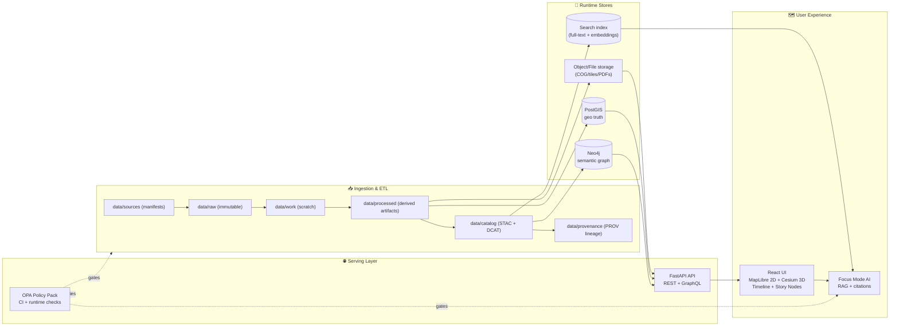
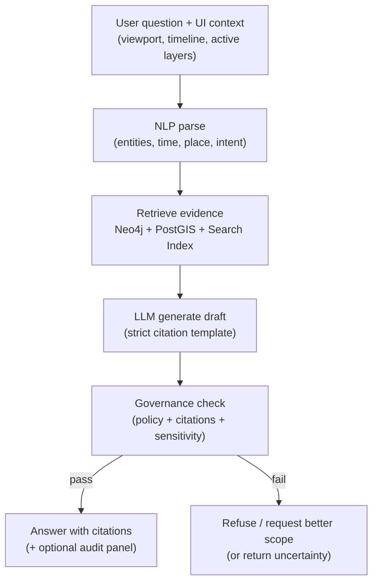

# Kansas Frontier Matrix (KFM) — System Overview 🧭🌾


> [!NOTE]
> **KFM is an evidence-first geospatial knowledge system**: every map layer, chart, story, and AI answer is linkable to its sources (“the map behind the map”) ⛓️🗺️

<details>
<summary>📌 Table of contents</summary>

- [Overview](#overview)
- [Architecture at a glance](#architecture-at-a-glance)
- [Core principles and invariants](#core-principles-and-invariants)
- [System building blocks](#system-building-blocks)
- [Data and metadata lifecycle](#data-and-metadata-lifecycle)
- [Runtime query patterns](#runtime-query-patterns)
- [Focus Mode AI](#focus-mode-ai)
- [Automation agents](#automation-agents)
- [Governance, security, and ethics](#governance-security-and-ethics)
- [Extensibility and future-facing capabilities](#extensibility-and-future-facing-capabilities)
- [Repository layout](#repository-layout)
- [Operational concerns](#operational-concerns)
- [Glossary](#glossary)
- [Definition of Done](#definition-of-done)
- [Version history](#version-history)
- [Appendix: Source documents and reference library](#appendix-source-documents-and-reference-library)

</details>

---

## Overview

KFM (Kansas Frontier Matrix) combines **geospatial data**, **historical narratives**, and **AI-assisted analysis** into a single platform that stays **auditable** and **reproducible** end-to-end.

### What KFM is (in one sentence)
A **provenance-first pipeline + catalog + databases + APIs + web UI + AI assistant** that turns raw files into trustworthy, explorable knowledge. 🧱➡️🧠➡️🗺️

### What KFM is not
- ❌ A “just upload and hope” data portal
- ❌ A black-box AI chatbot
- ❌ A UI that directly queries databases without policy enforcement

---

## Architecture at a glance

### The canonical flow (the KFM “truth path”) ✅



> [!IMPORTANT]
> **No bypassing.** The UI must go through the API, and data must go through the pipeline + catalog + provenance before it becomes “real” in KFM.

---

## Core principles and invariants

### 1) Provenance-first (“nothing is a black box”) ⛓️
- Every published dataset has **STAC + DCAT + PROV**.
- Every AI answer and narrative must remain attached to sources (or it must refuse).

### 2) Canonical pipeline ordering (non-negotiable) 🔒
**Raw → Processed → Catalog → Graph/GIS → API → UI/AI**

If you see an idea that breaks this ordering, treat it as a bug in the idea.

### 3) Separation of concerns (rule-of-three) 🧩
- **PostGIS stores geo truth** (vectors/rasters + spatial queries)
- **Catalogs describe assets** (STAC/DCAT + links to artifacts)
- **Graph links context** (entities, relationships, narratives, lineage)

### 4) “Fail closed” governance ✅🛑
If a rule fails (license missing, provenance incomplete, sensitivity not set), the system blocks publishing.

### 5) Digital humanism + FAIR/CARE by design 🤝
KFM aligns with **FAIR** (Findable, Accessible, Interoperable, Reusable) and **CARE** (Collective Benefit, Authority to control, Responsibility, Ethics) via:
- structured metadata requirements,
- classification and sensitivity handling,
- explicit governance workflows.

---

## System building blocks

### Data plane 🗃️
**Git repo + object storage** hold:
- raw inputs (immutable),
- processed artifacts (COG, GeoParquet, PMTiles, PDFs, images),
- catalogs (STAC/DCAT),
- provenance (PROV),
- checksums/hashes for verification.

### Pipeline plane ⚙️
Pipelines are deterministic transforms that:
- validate schemas + licenses + sensitivity labels,
- produce **analysis-friendly** and **visualization-friendly** artifacts,
- generate and update metadata triplets: **STAC/DCAT/PROV**,
- optionally load runtime stores (PostGIS / Neo4j / search index).

> [!TIP]
> Treat every pipeline run as an *experiment*: capture inputs, environment hash, outputs, metrics, and links back to catalog entries.

### Runtime stores 🧠
- **PostGIS**: spatial truth + tile generation (e.g., MVT via `ST_AsMVT`) + aggregations.
- **Neo4j**: knowledge graph (people/places/events/datasets/stories), multi-hop context.
- **Search index (e.g., Elasticsearch)**: full-text + semantic retrieval for docs and narratives.
- **Object/file storage**: large rasters (COG), tile caches, PDFs, imagery.

### Serving plane 🌐
- **FastAPI** backend with **REST + GraphQL**
- Adapters isolate database details (clean boundaries):
  - inbound: REST/GraphQL handlers
  - outbound: PostGIS, Neo4j, search, object store

### UI plane 🗺️
A React app that provides:
- 2D Map (MapLibre GL)
- 3D Globe/Terrain (Cesium)
- Timeline slider (temporal navigation / “4D” viewing)
- Layer catalog + legends + popups
- Story Nodes (narrative playback, map-sync)
- Focus Mode panel (AI with citations)
- Collaboration + community tooling (moderation, contributions)
- Mobile/offline support (packs, kiosks, classrooms)

### AI plane 🧭🤖
**Focus Mode** is a backend service that:
- parses question + map context,
- retrieves evidence from graph + GIS + text index,
- generates a draft answer,
- runs governance checks,
- returns citations + optional “audit panel” explanations.

### Governance plane ⚖️
- Policy Pack (OPA + Conftest) in CI
- Runtime policy checks (API + AI)
- Immutable governance ledger for key outputs/decisions (append-only, signed logs)

---

## Data and metadata lifecycle

### 1) Intake (raw) 📥
- Add a source manifest (who/where/license/terms).
- Store original files under `data/raw/` (immutable).

### 2) Transform (processed) 🧪
- Produce derived artifacts:
  - **GeoParquet** for analytics
  - **COG** for rasters
  - **PMTiles / cached tiles** for fast visualization
  - cleaned CSV/JSON where appropriate
- Compute checksums/hashes.

### 3) Catalog (STAC + DCAT) 🧾
- STAC: spatial/temporal indexing + assets
- DCAT: dataset-level discovery (publisher, license, distributions)
- Both must link to storage artifacts (and checksums if available)

### 4) Provenance (PROV) ⛓️
- Inputs → transforms → outputs recorded as a lineage chain
- Required for publishing and for AI to cite properly

### 5) Integration into runtime stores 🧠
- Load features/rasters into PostGIS (optimized indexing)
- Populate Neo4j nodes + edges based on catalogs/prov
- Index text + embeddings for retrieval

---

## Runtime query patterns

### Map & layer rendering (UI → API → PostGIS) 🗺️
- UI requests tiles (vector or raster) from API.
- API uses PostGIS indexes + tile SQL templates.
- Results include attribution + linkage to catalog IDs.

### Semantic discovery (UI → API → Neo4j) 🔍
- UI searches datasets, places, stories.
- API queries Neo4j to return structured results:
  - datasets related to a location/time/topic
  - events connected to a place/person
  - story nodes referencing a layer

### Hybrid answers (UI → Focus Mode) 🧠➡️🗺️
- Neo4j provides *what to look at* (entities + relationships).
- PostGIS provides *computed truth* (counts, aggregates, spatial filters).
- Search index provides *supporting text* (docs, narratives).
- The answer is returned with citations and governance flags.

---

## Focus Mode AI

### The Focus Mode pipeline (evidence-backed RAG) 🧭



### Key properties ✅
- **Always cites sources** or refuses.
- **Context-aware**: map extent + timeline + active layers influence retrieval ranking.
- **Explainable-by-design**: optional audit panel shows supporting entities/records and governance notices.
- **Logged**: answers and their evidence set are recorded in an immutable governance ledger.

---

## Automation agents

KFM uses a controlled **Watcher → Planner → Executor** (W‑P‑E) agent architecture for safe automation 🤖🛠️

### Roles
- 👀 **Watcher**: detects triggers (new upstream releases, schema changes, feed updates, policy changes)
- 🧠 **Planner**: proposes an explicit, reviewable change (pipelines, metadata, story updates)
- 🏃 **Executor**: runs validation, produces artifacts, attaches attestations (SBOM/SLSA), opens PR

### Non-negotiables
- Agents must obey the same Policy Pack as humans.
- Agents must provide evidence for changes.
- A kill-switch exists for disabling automated PR production if needed.

---

## Governance, security, and ethics

### Automated policy gates (minimum set) 🧷
At checkpoints (ingestion, AI output, publication), gates enforce:
- schema validation
- STAC/DCAT/PROV completeness
- license presence
- sensitivity classification + correct handling
- provenance completeness
- AI answers must include citations

### FAIR+CARE enforcement 🤝
- CARE-aware flags for culturally sensitive data
- Mechanisms like aggregation/redaction/coordinate rounding for restricted locations
- Approval workflows for sensitive areas and data sovereignty constraints

### Supply chain integrity 🔐
Planned security posture includes:
- SBOMs for releases and automated PRs
- SLSA provenance statements for build artifacts
- Sigstore/Cosign transparency logs for verifiable automation

### Privacy & inference control 🕵️‍♀️
For sensitive analytics (especially aggregated outputs):
- query auditing and inference control patterns can be applied at the API boundary
- differential privacy is an optional technique for public-facing stats (where appropriate)

---

## Extensibility and future-facing capabilities

### “4D” and digital twin direction 🧊⏱️
KFM is designed to evolve toward **4D digital twins**:
- temporal navigation (timeline) is foundational
- scenario visualization and simulation outputs become first-class, cataloged artifacts

### Storytelling as configuration (Story Nodes) 📖🗺️
- Stories are Markdown + JSON configuration (map state + camera + timeline steps)
- Planned: GUI story builder for non-coders
- Story nodes cite datasets and can link to evidence artifacts (run manifests, inputs, outputs)

### Real-time feeds 🌊🚌
- Watchers can poll live feeds (e.g., GTFS‑RT transit, river gauges)
- Each observation can be emitted as a STAC Item with DCAT dataset registration
- Same policies apply: provenance + classification + no bypassing

### Offline packs 📦
- Downloadable bundles for counties/themes:
  - pre-rendered tiles
  - key layers + stories
  - embedded mini-app (PWA/Electron/kiosk mode)
- Designed for classrooms, museums, field sites, rural connectivity

### Federation (multi-region Frontier Matrix) 🌐
KFM’s catalog + standards-first approach enables:
- DCAT cross-links between instances
- schema-consistent GraphQL federation/stitching (optional)
- shared policy baselines + local sovereignty overrides

---

## Repository layout

> [!NOTE]
> This is a **suggested** layout aligned to the project’s pipeline/canonical flow. Adjust names, but preserve meaning.

```text
📦 Kansas-Frontier-Matrix/
├─ 📚 docs/
│  ├─ 🧱 architecture/
│  │  ├─ system_overview.md  👈 you are here
│  │  ├─ KFM_REDESIGN_BLUEPRINT_v13.md
│  │  └─ ...
│  ├─ 🧭 guides/
│  ├─ ⚖️ governance/
│  └─ 📦 standards/
├─ 🗂️ data/
│  ├─ 🧾 sources/          # manifests (publisher/license/terms)
│  ├─ 🧱 raw/              # immutable inputs
│  ├─ 🧪 work/             # scratch + pipeline working dirs
│  ├─ ✅ processed/        # derived artifacts (COG/GeoParquet/PMTiles)
│  ├─ 🧭 catalog/
│  │  ├─ 🛰 stac/
│  │  └─ 🧷 dcat/
│  └─ ⛓ provenance/        # PROV lineage records
├─ 🧠 api/                  # FastAPI REST/GraphQL + adapters
├─ 🗺️ web/                  # React UI (MapLibre + Cesium)
├─ 🧪 schemas/              # JSON schemas for catalog/prov/story/run manifests
├─ 🔐 tools/validation/policy/ # OPA/Conftest policy pack
└─ 🤖 pipelines/            # ingestion + ETL + loaders + watchers
```

---

## Operational concerns

### Performance ⚡
- Prefer COG + HTTP range requests for rasters
- Prefer PMTiles/static tiles or cached tiles for heavy, stable layers
- Use spatial indexing (GiST) and server-side aggregation for scale
- Cache frequent queries and precompute embeddings for common retrieval

### Scalability 🧱
- Object storage + CDN for heavy raster layers
- Task queues (Celery/RQ-style) for long-running jobs:
  - OCR/document ingestion
  - tile generation
  - model runs / simulations
- Consider horizontal scaling of API (stateless) behind a load balancer

### Reliability & rollback 🔁
- Versioned artifacts + “latest” pointers
- Git revert as a core rollback primitive
- Graph rollback via re-import of CSV snapshots or migrations
- Emergency response for sensitive leaks: classification flip + purge + post-mortem

---

## Glossary

- **STAC**: SpatioTemporal Asset Catalog (spatial/temporal indexing + assets)
- **DCAT**: Data Catalog Vocabulary (dataset discovery metadata)
- **PROV**: W3C Provenance model (lineage chain: inputs → steps → outputs)
- **PostGIS**: geospatial database for the “geo truth”
- **Neo4j**: graph database for relationships/context
- **Focus Mode**: AI assistant with governance + citations
- **Story Node**: narrative unit (Markdown + JSON config) that syncs map/time
- **Policy Pack**: OPA/Conftest rules that enforce governance in CI/runtime
- **W‑P‑E**: Watcher → Planner → Executor automation pattern
- **KFM‑MDP**: KFM Metadata Design Profile (schema conventions/extensions)

---

## Definition of Done

**For this doc ✅**
- [x] Front-matter complete and valid
- [x] Architecture diagrams included (Mermaid)
- [x] Canonical pipeline ordering documented
- [x] Subsystems and boundaries explained (data/pipeline/api/ui/ai/governance)
- [ ] Link-check pass (relative links exist in repo)
- [ ] Reviewed by a maintainer
- [ ] Add a small “C4 model” appendix if the team wants stricter architecture notation

---

## Version history

| Version | Date | Notes |
|---:|---|---|
| v13.0.0 | 2026-01-20 | Initial consolidated system overview (pipeline + API + UI + AI + governance). |

---

## Appendix: Source documents and reference library

### Core KFM design docs 🧭
- 📚 Data Intake — Technical & Design Guide (STAC/DCAT/PROV + pipeline law)
- 🧱 Comprehensive Architecture, Features, and Design (policy gates, W‑P‑E, governance)
- 🧠 AI System Overview (Focus Mode RAG, citations, governance ledger)
- 🗺️ UI System Overview (MapLibre/Cesium, timeline, story nodes, offline/AR)
- 🧰 Comprehensive Technical Documentation (storage, remote sensing, ops, scaling)
- 🌟 Latest Ideas & Future Proposals (roadmap: GTFS‑RT watcher, “Kansas From Above”, bulk doc ingestion)

### Innovation & strategy boosters ✨
- 💡 Innovative Concepts to Evolve KFM (4D digital twin, AR/hybrid storytelling, cultural protocols)

### Reference libraries (PDF portfolios) 📦📚
These are curated “knowledge shelves” that inform implementation choices (AI, GIS/WebGL, data architecture, language ecosystems):
- 🤖 AI Concepts & more (LLMs/RAG, evaluation, digital humanism, etc.)
- 🛰 Maps/GoogleMaps/VirtualWorlds/Archaeological/Computer Graphics/Geospatial/WebGL (3D/tiles/visualization)
- 🧑‍💻 Various programming languages & resources (engineering practices + language/tool references)
- 🧮 Data management theories & Bayesian methods (architecture + modeling + data science practices)

> [!TIP]
> When adding new architecture decisions, link them back to this overview and record the rationale in an ADR (Architecture Decision Record) under `docs/architecture/adr/`.

