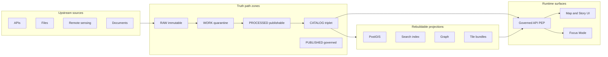
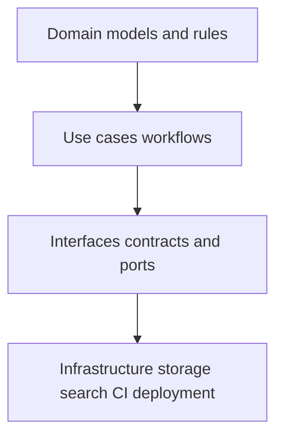

<!-- [KFM_META_BLOCK_V2]
doc_id: kfm://doc/bae0eca7-9889-4d98-a0eb-2c176d997fe0
title: System Overview
type: standard
version: v1
status: draft
owners: KFM Engineering + Governance
created: 2026-03-01
updated: 2026-03-01
policy_label: public
related:
  - docs/architecture/
  - docs/governance/
  - contracts/
tags: [kfm, architecture, system_overview]
notes:
  - This is a high-level overview. Contract details live in /contracts and governed guides.
  - Sections labeled PROPOSED require repo verification before being treated as implemented.
[/KFM_META_BLOCK_V2] -->

# Kansas Frontier Matrix — System Overview

**One-line purpose:** A governed, evidence-first, map-first, time-aware platform that connects **data → pipelines → catalogs and provenance → storage and indexing → governed APIs → Map and Story UI → Focus Mode AI**.

 <!-- TODO: link to doc status policy -->
 <!-- TODO: link to Promotion Contract -->
 <!-- TODO: link to policy pack -->
 <!-- TODO: link to /api/v1/evidence/resolve contract -->
 <!-- TODO: link to Focus Mode contract -->

---

## Navigation

- [What this system is](#what-this-system-is)
- [Non-negotiable invariants](#non-negotiable-invariants)
- [System in one picture](#system-in-one-picture)
- [Architecture reference model](#architecture-reference-model)
- [Data lifecycle zones](#data-lifecycle-zones)
- [Promotion Contract](#promotion-contract)
- [Catalogs, provenance, and evidence](#catalogs-provenance-and-evidence)
- [Trust membrane and policy enforcement](#trust-membrane-and-policy-enforcement)
- [Runtime surfaces](#runtime-surfaces)
- [Repository layout](#repository-layout)
- [Minimum verification steps](#minimum-verification-steps)
- [Risks and mitigations](#risks-and-mitigations)
- [Glossary](#glossary)

---

## What this system is

KFM is a **governed knowledge system** where:

- Datasets are versioned and promoted through **fail-closed validation gates**.
- Every public-facing layer, narrative claim, export, and AI-assisted answer is **traceable to versioned sources**.
- Policy controls are enforced **in CI and at runtime**, not by convention.

### Status tags used in this document

To avoid accidental overreach, this doc uses tags:

- **CONFIRMED** — required by KFM vNext guides (normative intent).
- **PROPOSED** — a recommended design/build plan; treat as *not implemented* until verified in the repo and deployment.
- **UNKNOWN** — not yet verified; do not rely on it for production decisions.

> **WARNING:** Do not treat “PROPOSED” sections as implemented reality. Convert them to CONFIRMED by attaching repo and deployment evidence (tree, CI logs, OpenAPI, run receipts).

[Back to top](#kansas-frontier-matrix--system-overview)

---

## Non-negotiable invariants

These are the invariants that define KFM. If an implementation violates them, it is **not KFM**.

| Invariant | Tag | Meaning in practice | Why it matters |
|---|---:|---|---|
| Truth path lifecycle | CONFIRMED | Upstream → RAW → WORK/QUARANTINE → PROCESSED → CATALOG triplet + run receipts → projections → governed API → UI | Makes reproducibility and auditability enforceable. |
| Trust membrane | CONFIRMED | Clients never access storage/DB directly; all access goes through governed APIs applying policy, redaction, and logging | Without it, policy and provenance cannot be enforced. |
| Evidence-first UX | CONFIRMED concept; implementation PROPOSED | “Trust surfaces” (version, license, policy, provenance) are user-visible, not hidden | Users can verify claims and understand constraints. |
| Cite-or-abstain Focus Mode | CONFIRMED | Focus Mode must not produce unverified claims; hard gate requires citations to resolve | Primary anti-hallucination mechanism. |
| Canonical vs rebuildable stores | CONFIRMED concept | Canonical truth is in artifacts + catalogs + audit ledger; indexes and caches are rebuildable | Enables migration and re-indexing without losing truth. |

[Back to top](#kansas-frontier-matrix--system-overview)

---

## System in one picture

**Interpretation:**

- The **truth path** is about *what becomes publishable* and *why we can trust it*.
- The **trust membrane** is about *where policy is enforced* and *what clients are allowed to touch*.

[Back to top](#kansas-frontier-matrix--system-overview)

---

## Architecture reference model

### Clean layering

KFM follows a strict layering model:

**Rule:** domain logic must not talk directly to infrastructure. It must go through interfaces.

### Component decomposition

**PROPOSED** buildable decomposition for vNext:

1. **Pipeline runner and connectors** — watchers, fetchers, normalizers, validators, artifact writers  
2. **Catalog generator** — produces DCAT, STAC, PROV, run receipts from pipeline outputs  
3. **Policy engine** — shared semantics in CI and runtime via a fixtures-driven policy pack  
4. **Evidence resolver service** — resolves EvidenceRefs to EvidenceBundles and applies obligations  
5. **Governed API gateway** — discovery, query, tiles, story nodes, focus queries  
6. **UI** — Map Explorer + Story Mode + Focus Mode with evidence drawer and policy notices  
7. **Index builders** — PostGIS, graph, search or vector, and tiles as rebuildable projections

### Canonical vs rebuildable stores

**CONFIRMED concept** baseline design decision:

| Store | Category | Examples |
|---|---|---|
| Object storage artifacts | Canonical | RAW, WORK, PROCESSED artifacts by digest |
| Catalog triplet | Canonical | DCAT, STAC, PROV profiles and cross-links |
| Audit ledger | Canonical | Append-only log of promotions, runs, and approvals |
| PostGIS tables | Rebuildable | Derived from processed GeoParquet |
| Search index | Rebuildable | Derived from processed texts and metadata |
| Graph edges | Rebuildable | Derived from catalogs and entity resolution |
| Tile bundles | Rebuildable | Derived from processed features |

[Back to top](#kansas-frontier-matrix--system-overview)

---

## Data lifecycle zones

**CONFIRMED intent:** KFM zones are storage zones with specific rules, not “stages” in a slide deck.

| Zone | Rule | Typical contents |
|---|---|---|
| RAW | Immutable, append-only | Acquisition manifests, raw files/API snapshots, checksums, license snapshot, fetch logs |
| WORK / QUARANTINE | Editable, failure-isolated | Normalization outputs, reprojection, tiling jobs, QA reports, redaction transforms |
| PROCESSED | Publishable by contract | Standardized artifacts (GeoParquet, COG, PMTiles), stable IDs, checksums, final QA |
| CATALOG triplet | Cross-linked metadata and lineage | DCAT, STAC, PROV, link maps, run receipts |
| PUBLISHED | Governed runtime surfaces | Policy-filtered APIs, tiles, stories, Focus Mode answers (each with receipts) |

### Time axes

**PROPOSED** modeling recommendation:

- **Event time** — when something happened  
- **Transaction time** — when KFM acquired or published the record  
- **Valid time** — when a statement is considered true (needed for boundary changes)

Start with event time + transaction time; add valid time where required.

[Back to top](#kansas-frontier-matrix--system-overview)

---

## Promotion Contract

Promotion is the act of moving a dataset version from RAW/WORK into PROCESSED + CATALOG, and therefore into runtime surfaces.

### Fail-closed gates

Promotion to PUBLISHED must be blocked unless these minimum gates are met:

| Gate | What must be present | Example enforcement |
|---|---|---|
| A — Identity and versioning | dataset_id, dataset_version_id, deterministic spec_hash, content digests | Schema validation; spec_hash golden tests; digest verification |
| B — Licensing and rights | License fields and snapshot of upstream terms | Fail if license missing or unknown |
| C — Sensitivity and redaction | policy_label and obligations when needed | OPA tests verify default-deny and obligation compliance |
| D — Catalog triplet validation | DCAT, STAC, PROV validate and cross-link; EvidenceRefs resolve | Validators + link checker; fail on broken links |
| E — QA and thresholds | Dataset-specific checks and thresholds | QA report exists; quarantine on failure |
| F — Run receipt and audit | Run receipt includes inputs, tooling, hashes, policy decision | Receipt schema validation; signature checks if enabled |
| G — Release manifest | Promotion recorded as a manifest referencing artifacts and digests | Manifest exists; references match digests |

### Key artifacts

**CONFIRMED** templates exist in the KFM guides for:

- **Run receipt** — per pipeline run, including environment capture  
- **Promotion manifest** — per dataset version release, referencing artifact digests  
- **Policy decision record** — allow/deny + obligations + reason codes

[Back to top](#kansas-frontier-matrix--system-overview)

---

## Catalogs, provenance, and evidence

### The catalog triplet is a contract surface

KFM uses a cross-linked triplet:

- **DCAT** — dataset-level metadata, license, distributions, coverage  
- **STAC** — asset-level spatiotemporal metadata and links to artifacts  
- **PROV** — lineage: which inputs, tools, and parameters produced which outputs

The triplet is designed so EvidenceRefs resolve without guessing.

### Evidence references

**CONFIRMED minimum schemes:**

- `dcat://...` dataset and distribution metadata  
- `stac://...` collection, item, asset metadata  
- `prov://...` run lineage  
- `doc://...` governed documents and story citations  
- `graph://...` entity relations if enabled

### Evidence resolver

**CONFIRMED:** evidence resolution is central.

- The evidence resolver accepts an EvidenceRef or structured reference.
- It applies policy and obligations.
- It returns an **EvidenceBundle** containing human card fields plus machine metadata, digests, and audit references.

#### Why this replaces “LLM citations”

In KFM, a “citation” is not a URL pasted into text. It is an EvidenceRef that must resolve into a structured bundle. Story publishing and Focus Mode both have a hard gate:

- if citations do not resolve or are not policy-allowed, the system must reduce scope or abstain.

[Back to top](#kansas-frontier-matrix--system-overview)

---

## Trust membrane and policy enforcement

### Trust membrane rule

**CONFIRMED:** clients never access object storage or databases directly.

The Policy Enforcement Point is the **governed API**. Policy semantics must match in two places:

- **CI** — conftest and policy fixtures block merges and promotions  
- **Runtime** — policy adapter applies allow/deny and obligations to requests and responses

### Default-deny policy posture

**CONFIRMED:** policy is deny-by-default, with explicit allow rules and tests. Obligations capture generalization and redaction requirements.

### Threat model checklist excerpt

Use this as a review gate for features:

- Frontend must not fetch directly from storage or DB  
- Public users must not infer restricted dataset existence via error behavior  
- Downloads and exports must be policy-checked  
- Focus Mode must resist prompt injection and restricted data exfiltration  
- Processed artifacts must be immutable by digest  
- Policy rules must be tested in CI with fixtures

[Back to top](#kansas-frontier-matrix--system-overview)

---

## Runtime surfaces

### Governed API

**CONFIRMED intent:** treat OpenAPI as a contract-first artifact.

Illustrative endpoints in the KFM guide include:

- Catalog discovery
- Dataset queries by bbox, time, and filters
- Tile delivery
- Evidence resolution
- Lineage inspection
- Focus Mode ask

### Map and Story UI

**CONFIRMED direction:** the UI is a governed client.

Core UI components include:

- Map canvas, layer panel, and time controls
- Feature inspection with citations
- Shared evidence drawer
- Provenance panel
- Story nodes with map state + citations

**Evidence drawer minimum fields** must include:

- Evidence bundle ID and digest
- Dataset version ID and dataset name
- License and attribution
- Freshness and validation status
- Provenance chain link
- Artifact links when policy allows
- Redactions applied as obligations

### Focus Mode

**CONFIRMED:** a Focus Mode request is treated as a governed run with a receipt.

Key steps in the documented control loop:

1. Policy pre-check
2. Retrieval plan
3. Retrieve evidence
4. Build evidence bundles via resolver
5. Synthesize answer referencing bundle IDs
6. Hard citation verification gate
7. Emit audit receipt including digests, policy, model version, and output hash

**Hard gate:** if citations cannot be verified, Focus Mode must abstain or reduce scope.

[Back to top](#kansas-frontier-matrix--system-overview)

---

## Repository layout

> **CONFIRMED at repo root in the 2026-02-27 briefing.** Deeper module structure is **UNKNOWN until verified**.

| Path | Purpose |
|---|---|
| apps/ | Runnable services (API, UI, workers, CLI) |
| packages/ | Shared libraries and core modules (domain, ingestion, catalogs, policy, evidence) |
| contracts/ | OpenAPI, JSON schemas, controlled vocabularies |
| policy/ | OPA/Rego policies, fixtures, policy tests |
| data/ | Registry entries, example datasets, catalog artifacts, zone manifests |
| infra/ | Deployment and ops (Kubernetes, Terraform, GitOps, dashboards) |
| docs/ | Architecture docs, runbooks, ADRs, templates |
| tools/ | Validators, link checkers, CLI utilities |
| tests/ | Unit, integration, and e2e tests and fixtures |
| configs/ scripts/ migrations/ examples/ | Supporting configs, automation, migrations, and examples |

> **NOTE:** Do not claim that specific subpackages exist (for example `apps/api` or `packages/ingest`) until confirmed by a repo tree and commit hash.

[Back to top](#kansas-frontier-matrix--system-overview)

---

## Minimum verification steps

This converts UNKNOWN → CONFIRMED with the smallest possible checks:

- [ ] Capture repo commit hash and root directory tree  
  - `git rev-parse HEAD`  
  - `tree -L 3`
- [ ] Extract CI gate list from `.github/workflows` and document which checks block merges
- [ ] Confirm presence of key invariants in code and contracts:
  - spec_hash implementation and golden tests
  - catalog validators and link checker
  - policy pack with default-deny fixtures
  - evidence resolver route and EvidenceBundle schema
  - dataset registry schema
- [ ] Choose one MVP dataset and promote it end-to-end with receipts, catalogs, and policy checks
- [ ] Verify UI cannot bypass the PEP:
  - static analysis and network policies
  - no direct storage/DB URLs in client
- [ ] For Focus Mode:
  - run evaluation harness
  - store golden queries and diffs as artifacts
  - verify 100% citation resolvability for allowed roles

[Back to top](#kansas-frontier-matrix--system-overview)

---

## Risks and mitigations

These risks should be tracked as governed artifacts linked to mitigations and ADRs:

| Risk | Why it matters | Mitigation direction |
|---|---|---|
| Policy bypass via direct DB or storage access | Breaks governance | Enforce trust membrane with tests and network policy |
| Licensing violation | Legal and reputational risk | Promotion gate requires rights metadata; quarantine unknown |
| Sensitive location leakage | Real-world harm | Restricted precise datasets plus public generalized derivatives |
| Broken citations | Trust failure | Evidence resolver contract + CI citation linting + publish gate |
| Focus Mode hallucination or leakage | Trust and safety risk | Hard citation verifier + evaluation harness + policy pre-checks |
| Performance collapse on large layers | UX failure | PMTiles, caching, progressive disclosure, benchmarks |

[Back to top](#kansas-frontier-matrix--system-overview)

---

## Glossary

- **Dataset** — a logical identity, such as “NOAA Storm Events”  
- **DatasetVersion** — an immutable promoted version of a dataset  
- **Artifact** — a concrete file or object produced by a run (GeoParquet, PMTiles, COG, PDF, JSON)  
- **spec_hash** — deterministic hash of a pipeline specification used for identity and drift detection  
- **EvidenceRef** — stable reference using explicit schemes (dcat, stac, prov, doc, graph)  
- **EvidenceBundle** — resolved evidence returned by the evidence resolver; includes policy and digests  
- **Run receipt** — record capturing inputs, outputs, environment, validation, policy decisions  
- **Promotion manifest** — release record for a dataset version referencing artifacts and digests  
- **Trust membrane** — architectural boundary: clients never access storage directly; only governed APIs  
- **Policy obligations** — required redaction or generalization steps to make outputs publish-safe

[Back to top](#kansas-frontier-matrix--system-overview)
