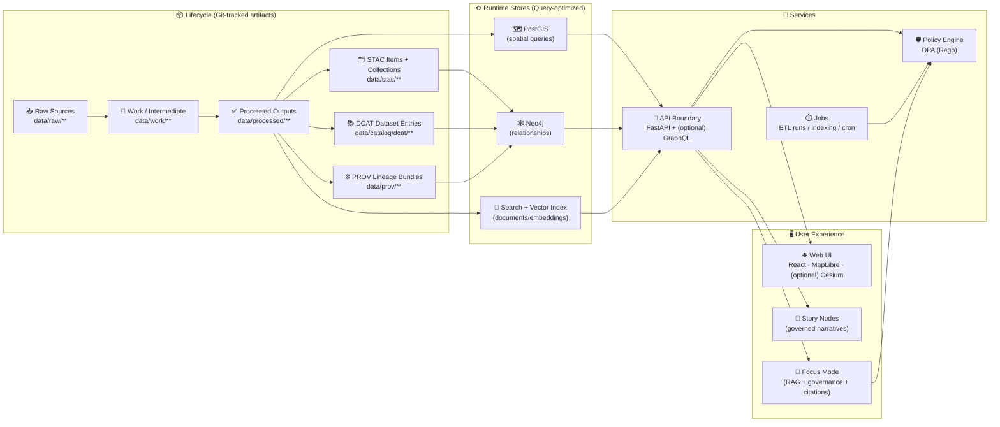
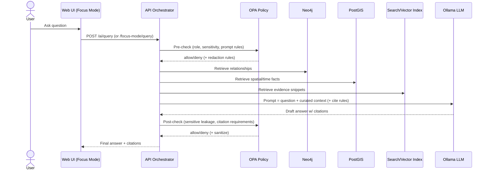

# 🧭 Kansas Frontier Matrix (KFM) — System Overview


> Evidence-first 🌾 geospatial + knowledge-graph platform for Kansas — with strict provenance, governed publication, and an AI assistant that must cite sources.

**Last updated:** 2026-02-03  
**Audience:** engineers, maintainers, contributors, and anyone implementing or extending KFM.

---

## 📌 What this document covers

- The **big picture**: what KFM is and why it’s built the way it is  
- The **canonical “Truth Path”** (data-to-interface pipeline)  
- Core **runtime components** (API, graph, geospatial DB, search)  
- **Focus Mode** (AI) — how it stays grounded + governed  
- Repo **structure** and extension points

> [!TIP]
> If you’re looking for “how to contribute data,” start with the **Truth Path** and **Data & Metadata Contracts** sections below.

---

## 🌟 North Star

KFM exists to unify **Kansas-relevant** data (environment, infrastructure, communities, history, etc.) into a system that is:

- ✅ **Traceable**: every dataset and narrative output has provenance
- ✅ **Discoverable**: metadata-first catalog (spatial + temporal search)
- ✅ **Governed**: policy gates in CI + runtime (fail closed)
- ✅ **Composable**: data, graph, and UI connect through stable contracts
- ✅ **Explainable**: AI answers include citations and can be audited

---

## 🧱 System Invariants (Non‑Negotiables)

These invariants should be treated as “architecture law” for KFM:

1. **🧬 Provenance First**  
   Nothing is considered publishable without metadata + lineage (STAC/DCAT/PROV).

2. **🛣️ Canonical Truth Path**  
   Data flows known stages (see below). Shortcuts are considered a bug unless explicitly justified.

3. **🔐 Fail Closed**  
   Missing metadata, missing license, missing provenance, or policy uncertainty ⇒ block.

4. **🚧 API Boundary is Mandatory**  
   UI and tools do **not** bypass policy by reading DBs directly.

5. **♻️ FAIR + CARE by design**  
   Findable/Accessible/Interoperable/Reusable + ethical controls for sensitive/community-owned data.

---

## 🗺️ Architecture at a Glance



---

## 🛣️ The Canonical “Truth Path”

KFM treats data and derived outputs as **products** that must move through staged gates:

1. **📥 Raw** (`data/raw/**`)  
   Immutable snapshots of sources (exact inputs).

2. **🧪 Work** (`data/work/**`)  
   Intermediate transformations (okay to regenerate; not user-facing).

3. **✅ Processed** (`data/processed/**`)  
   Canonical cleaned outputs (standardized formats + CRS + units).

4. **🗂️ Catalog + Lineage (Boundary Artifacts)**  
   - **STAC** (`data/stac/**`) — spatial/temporal asset metadata  
   - **DCAT** (`data/catalog/dcat/**`) — dataset discovery index  
   - **PROV** (`data/prov/**`) — lineage/audit bundle

5. **⚙️ Runtime Stores** (loaded/indexed from processed + catalogs)  
   - PostGIS for geospatial queries  
   - Neo4j for relationship/context queries  
   - Search/vector index for document retrieval

6. **🧠 API** (policy enforcement + contracts)  
7. **🖥️ UI / Stories / Focus Mode** (strictly via the API boundary)

> [!NOTE]
> If a feature proposal tries to **skip a stage** (e.g., “inject data directly into the UI”), it should be treated as a design flaw until proven otherwise.

---

## 🧰 Core Components

### 1) 📦 Data & Metadata (Artifacts)

**What lives here:**
- Raw inputs, processed outputs, and the catalog/lineage records that make them publishable.

**Standards used:**
- **STAC** for geospatial assets (bbox, geometry, datetime/range, links to assets)
- **DCAT** for dataset-level discoverability (title, description, license, distributions)
- **W3C PROV** for lineage (entities, activities, agents, parameters, timestamps)

**Contract expectation (very important):**
- STAC → points to processed assets (files or stable endpoints)
- DCAT → points to STAC and/or distributions
- PROV → covers the chain raw → work → processed (+ parameters + agents)
- Graph → references catalog IDs (does not duplicate big payloads)

---

### 2) 🗺️ PostGIS (Spatial Source of Query Truth)

PostGIS holds query-optimized tables for:
- bounding box / intersect queries
- time filtering
- tile generation support (vector/raster)

**Key idea:** processed datasets are authoritative; PostGIS is a runtime accelerator loaded from them.

---

### 3) 🕸️ Neo4j (Context + Relationships)

Neo4j is the “meaning layer”:
- connects datasets, places, events, story nodes, entities, citations
- enables multi-hop discovery (e.g., event → location → related policies → datasets)

**Key idea:** the graph stores **references** to catalog entries and identifiers, not full raw content.

---

### 4) 🔎 Search + Vector Index (Documents & Evidence)

Used for:
- full-text retrieval of evidence
- semantic retrieval (embeddings) for RAG

This index complements graph + PostGIS:
- PostGIS answers “where/when”
- Neo4j answers “how is it connected”
- Search answers “what textual evidence supports it”

---

### 5) 🧠 API Boundary (FastAPI + optional GraphQL)

The API layer provides:
- stable contracts for UI, stories, AI, and external tools
- input validation + query orchestration
- **policy enforcement** (OPA) and redaction/sanitization when required

> [!IMPORTANT]
> **No client (UI, scripts, AI) should query databases directly.**  
> The API boundary is where governance and consistency are enforced.

#### Example endpoint families (illustrative)

- **Catalog & datasets**
  - `GET /api/v1/datasets/{id}` → dataset metadata + assets
  - `GET /api/v1/catalog/search` → search by keyword, bbox, time
  - `GET /api/v1/datasets/{id}/data?format=geojson&bbox=...` → stream filtered features

- **Tiles** (pattern-based)
  - `GET /api/tiles/<layer>/{z}/{x}/{y}.pbf` (vector tiles)
  - `GET /api/tiles/<layer>/{z}/{x}/{y}.png` (raster tiles)

- **GraphQL** (if enabled)
  - `POST /graphql` → flexible relationship queries

- **AI / Focus Mode**
  - `POST /ai/query` or `POST /focus-mode/query` (exact route may vary by version)

---

## 🧭 Focus Mode (Governed AI Assistant)

Focus Mode is an AI assistant designed to behave like a **cited analyst**, not an oracle.

### ✅ Focus Mode guarantees

- **Grounded**: answers are based on retrieved evidence (graph + DB + documents)
- **Cited**: output includes citation markers linked to sources
- **Governed**: policy checks run before and after generation
- **Auditable**: queries, sources, model versions, and decisions are logged (append-only)

### 🔁 Pipeline (RAG + governance)



### 🧠 Ollama (Local LLM runtime)

Ollama runs the chosen model(s) locally/on-infrastructure:
- improves privacy (no external model calls)
- supports offline deployments
- allows repeatable evaluation and regression testing

### 📦 Context size & caching

- context window is tuned via model configuration (e.g., `num_ctx`)
- KFM may cache:
  - commonly used retrieval bundles (short-lived)
  - conversation/session context for follow-ups  
  (this reduces repeated heavy retrieval)

### 🧾 Provenance & audit ledger

For each AI interaction, KFM stores:
- user question
- retrieval sources used (IDs/refs)
- model + version
- policy decision + policy version/hash (where available)
- final answer (and optionally structured trace when requested)

> [!NOTE]
> The ledger is designed to be **append-only** and future-compatible with cryptographic signing/timestamping.

---

## 🛡️ Security & Governance

### RBAC (roles as a baseline)

Typical roles:
- **Public Viewer**: read public datasets/stories only
- **Contributor**: propose content (drafts), cannot publish
- **Maintainer**: review/approve contributions, manage content
- **Admin**: manage policies, run pipelines, high-sensitivity access

### OPA policy pack (runtime + CI)

**Runtime:** each API request is evaluated (allow/deny/sanitize).  
**CI:** contributions are blocked if required governance artifacts are missing (license, metadata, lineage, sensitivity tags).

**Fail closed** means: if checks are missing or uncertain, we block.

---

## 🗂️ Repository Layout (Canonical)

> [!TIP]
> The exact top-level names can vary by version, but this layout reflects the canonical structure used by KFM’s governance standards.

```text
📦 repo-root/
├── 📁 data/                          # datasets + boundary artifacts
│   ├── 📁 raw/                       # immutable inputs (by domain)
│   ├── 📁 work/                      # intermediate pipeline outputs
│   ├── 📁 processed/                 # canonical processed outputs
│   ├── 📁 stac/                      # STAC collections/items
│   ├── 📁 catalog/
│   │   └── 📁 dcat/                  # DCAT JSON-LD outputs
│   └── 📁 prov/                      # PROV lineage bundles
│
├── 📁 docs/                          # governed documentation
│   ├── 📁 architecture/              # system designs, ADRs, diagrams
│   ├── 📁 standards/                 # STAC/DCAT/PROV profiles, repo standards
│   ├── 📁 templates/                 # document templates
│   └── 📁 reports/
│       └── 📁 story_nodes/           # draft/published narrative content
│
├── 📁 schemas/                       # JSON Schemas (stac/dcat/prov/story/ui/telemetry)
├── 📁 src/                           # code (pipelines, graph, server)
│   ├── 📁 pipelines/                 # ETL + transformation jobs
│   ├── 📁 graph/                     # graph build/ingest tooling
│   └── 📁 server/                    # API boundary implementation
│
├── 📁 web/                           # frontend app (React/TS, MapLibre, etc.)
├── 📁 tools/                         # validators, utilities, dev tooling
├── 📁 tests/                         # automated tests
├── 📄 docker-compose.yml             # local dev stack
├── 📄 .env.example                   # environment template
└── 📄 README.md
```

---

## 🔌 Extension Points

### ✅ Adding a new dataset (the “correct” way)

1. Put source snapshot into `data/raw/<domain>/...`
2. Implement pipeline job in `src/pipelines/<domain>/...`
3. Write outputs into `data/work/<domain>/...` then `data/processed/<domain>/...`
4. Generate boundary artifacts:
   - STAC record(s) in `data/stac/...`
   - DCAT entry in `data/catalog/dcat/...`
   - PROV bundle in `data/prov/...`
5. Ensure CI gates pass (license, sensitivity label, metadata validation)
6. Load/index into runtime stores (PostGIS / Neo4j / Search) via jobs
7. Expose via API + UI

### 🧩 Adding a new UI feature

- Extend the API contract first (new endpoint or GraphQL field)
- Add UI components that call the API (never DB direct)
- If the feature exposes potentially sensitive data, add/adjust OPA policy rules

### 🛡️ Adding a new policy

- Add or update rules in `policy/*.rego`
- Add CI checks that validate the new constraint (fail closed)
- Ensure runtime policy evaluation includes new rule paths

---

## 📚 Glossary (quick)

<details>
<summary><strong>Click to expand</strong></summary>

- **STAC**: Spatial Temporal Asset Catalog — metadata for assets with spatial/temporal footprints  
- **DCAT**: Data Catalog Vocabulary — dataset discovery and distribution metadata  
- **PROV**: W3C Provenance — lineage model (entities, activities, agents)  
- **OPA**: Open Policy Agent — policy-as-code engine (Rego)  
- **RAG**: Retrieval-Augmented Generation — LLM answers grounded by retrieved evidence  
- **MVT**: Mapbox Vector Tiles — a common vector tile format used by MapLibre-compatible stacks

</details>

---

## 🔗 Related docs to read next

- `docs/MASTER_GUIDE_v13.md` 📘 — canonical repo + pipeline + governance reference
- `docs/standards/` 🧾 — STAC/DCAT/PROV profiles and validation rules
- `docs/architecture/ai/OLLAMA_INTEGRATION.md` 🤖 — Focus Mode + Ollama integration details
- `src/server/` 🧠 — API boundary implementation and contracts
- `docs/reports/story_nodes/` 📖 — governed narrative content structure

---

## ✅ Summary

KFM is a **layered, governed, evidence-first** platform:

- Data becomes publishable only when it has **STAC + DCAT + PROV**
- The graph + spatial DB + search index are **query accelerators** derived from canonical artifacts
- The API is the **mandatory policy boundary**
- Focus Mode uses **RAG + OPA** to produce cited, auditable answers
