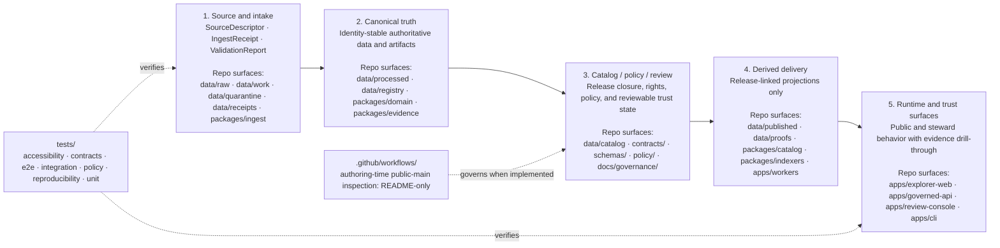

<!-- [KFM_META_BLOCK_V2]
doc_id: kfm://doc/NEEDS_VERIFICATION_UUID
title: System Overview
type: standard
version: v1
status: draft
owners: @bartytime4life
created: YYYY-MM-DD
updated: YYYY-MM-DD
policy_label: public
related: [../../README.md, ../README.md, ./README.md, ./SYSTEM_CONTEXT.md, ./TRUST_MEMBRANE.md, ./TRUTH_PATH_LIFECYCLE.md, ./DEPLOYMENT_TOPOLOGY.md, ./canonical_vs_rebuildable.md, ../../apps/README.md, ../../packages/README.md, ../../data/README.md, ../../contracts/README.md, ../../schemas/README.md, ../../policy/README.md, ../../tests/README.md, ../../infra/README.md, ../../.github/workflows/README.md]
tags: [kfm, architecture, system-overview, truth-path, trust-membrane, map-first]
notes: [doc_id placeholder pending UUID assignment, created/updated placeholders pending git-history verification, built from March 2026 doctrine plus current public-main repo inspection]
[/KFM_META_BLOCK_V2] -->

# System Overview

_High-level architecture bridge for Kansas Frontier Matrix (KFM): truth path, trust membrane, repo lanes, and trust-visible runtime boundaries._

> **Status:** draft  
> **Owners:** `@bartytime4life`  
> **Path:** `docs/architecture/system_overview.md`  
> **Repo fit:** short-form architecture bridge between [repo root][repo-root], [docs index][docs-root], [architecture index][arch-index], and deeper architecture / runtime / policy surfaces.  
> 
> 
> 
> 
> 
> 
> 
> **Quick jumps:** [At a glance](#at-a-glance) · [Repo fit](#repo-fit) · [Accepted inputs](#accepted-inputs) · [Exclusions](#exclusions) · [Current public-main snapshot](#current-public-main-snapshot) · [Governing law](#governing-law) · [Five-plane view](#five-plane-view) · [Repo surface map](#repo-surface-map) · [Quickstart](#quickstart) · [Task list](#task-list--definition-of-done) · [FAQ](#faq) · [Appendix](#appendix)

> [!IMPORTANT]
> This file is **doctrine-grounded and repo-aware**.
>
> It treats March 2026 KFM architecture law as stable, uses the current public `main` tree for path and maturity signals, and keeps deeper mounted-runtime claims explicitly bounded.  
> It should make the system legible **without** turning placeholders, README-only lanes, or uninspected runtime depth into false certainty.

## At a glance

KFM is a **governed spatial evidence system**. Its primary value unit is the **inspectable claim**: a claim that can still be traced across place, time, evidence state, policy state, review state, release state, and correction state.

| Topic | Working rule |
|---|---|
| System identity | Governed, map-first, time-aware spatial evidence system |
| Value unit | The inspectable claim, not merely a layer, dashboard, export, or fluent answer |
| Canonical lifecycle | `Source edge -> RAW -> WORK / QUARANTINE -> PROCESSED -> CATALOG -> PUBLISHED` |
| Trust boundary | Public and steward surfaces cross governed APIs; they do not directly touch canonical stores or model runtimes |
| Runtime answer posture | Cite-or-abstain, fail closed, and keep negative outcomes visible |
| Shell posture | One map-first, time-aware operating shell with evidence drill-through and correction-visible state |
| 3D posture | 2D default; 3D is conditional and burden-bearing |
| Repo posture | Current public `main` shows real lane structure, but several architecture companions remain scaffold-first |

### Truth posture used here

| Marker | Use in this file |
|---|---|
| `CONFIRMED` | Directly supported by current public-repo inspection or repeated March 2026 KFM doctrine |
| `INFERRED` | Strongly suggested by adjacent repo surfaces or repeated doctrine, but not re-opened deeply enough here to claim full implementation maturity |
| `PROPOSED` | Repo-ready organization, next-step guidance, or implementation direction that fits doctrine but is not proven as current mounted reality |
| `UNKNOWN` | Not established strongly enough to present as current fact |
| `NEEDS VERIFICATION` | Exact owner, date, route, workflow, or mounted-runtime detail that should be checked before merge |

[Back to top](#system-overview)

## Repo fit

| Field | Value |
|---|---|
| Path | `docs/architecture/system_overview.md` |
| Primary role | One-page architecture bridge between doctrine and the deeper architecture / runtime / policy surfaces |
| Upstream anchors | [repo root][repo-root] · [docs index][docs-root] · [architecture index][arch-index] |
| Companion architecture docs | [SYSTEM_CONTEXT.md][system-context] · [TRUST_MEMBRANE.md][trust-membrane] · [TRUTH_PATH_LIFECYCLE.md][truth-path] · [DEPLOYMENT_TOPOLOGY.md][deployment-topology] · [canonical_vs_rebuildable.md][canonical-vs-rebuildable] |
| Adjacent machine-facing surfaces | [contracts][contracts-root] · [schemas][schemas-root] · [policy][policy-root] · [tests][tests-root] · [workflows README][workflows-readme] |
| Adjacent runtime surfaces | [apps][apps-root] · [packages][packages-root] · [data][data-root] · [infra][infra-root] |
| Why this file matters | It gives contributors a stable whole-system reading before they descend into a single contract family, runtime lane, policy bundle, or lifecycle zone |

### What this file should do

- Explain **what KFM is**, **how trust state moves**, and **where repo lanes fit**.
- Keep **architecture law** separate from **mounted implementation certainty**.
- Show the shortest path from **source intake** to **trust-visible runtime behavior**.
- Name the repo surfaces that must move together when architecture changes.

### What this file should not do

- Replace machine-readable contracts, policy bundles, or tests.
- Pretend a README-only or scaffold-first lane is already operational.
- Freeze the exact runtime topology if the live checkout later proves a different shape.
- Reintroduce stack claims that the current public tree or doctrine layer does not support.

## Accepted inputs

Content that belongs here includes:

- system identity, non-goals, and whole-system invariants
- truth-path ordering and trust-membrane rules
- five-plane or equivalent architecture summaries
- map-first shell posture and runtime-boundary law
- repo-lane maps that connect `data/`, `packages/`, `apps/`, `contracts/`, `policy/`, `tests/`, `infra/`, and `.github/`
- architecture diagrams that explain responsibility, not just boxes
- current public-main maturity notes when they materially affect safe documentation
- cross-links to deeper architecture files, ADR lanes, threat models, and interface registries

## Exclusions

The following do **not** belong here as the authoritative source of truth:

| Keep out of this file | Keep it instead |
|---|---|
| Policy rule bodies, reason / obligation registries, deny-by-default fixtures | [policy][policy-root] |
| Canonical object schemas, OpenAPI, shared vocabularies | [contracts][contracts-root] and [schemas][schemas-root] |
| Runtime code, worker implementations, UI component logic | [apps][apps-root] and [packages][packages-root] |
| Deployment manifests, ingress details, secrets posture as if verified here | [infra][infra-root] plus mounted runtime evidence |
| Service-local tutorials or route-by-route implementation notes | service-local docs and runbooks |
| Any claim that upgrades README-only or scaffold-only surfaces into “already working” architecture | keep it `PROPOSED`, `UNKNOWN`, or `NEEDS VERIFICATION` until rechecked |

## Current public-main snapshot

> [!NOTE]
> This section records the **public `main` inspection used for this draft**.
>
> Re-check it whenever the tree changes.  
> The point is not to fossilize the current branch. The point is to stop architecture prose from outrunning the evidence.

| Surface | Authoring-time public-main state | How to read it |
|---|---|---|
| `docs/architecture/README.md` | Substantive directory index | Use it as the local boundary map and navigation hub |
| `docs/architecture/system_overview.md` | Scaffold placeholder at authoring time | This revision promotes that path into a substantive architecture leaf |
| `docs/architecture/SYSTEM_CONTEXT.md`, `TRUST_MEMBRANE.md`, `TRUTH_PATH_LIFECYCLE.md`, `DEPLOYMENT_TOPOLOGY.md`, `canonical_vs_rebuildable.md` | Present but scaffold-only | Keep this file high-level; do not pretend deeper companion docs are already filled |
| `apps/` | Named runtime lanes visible: `explorer-web`, `governed-api`, `review-console`, `workers`, `cli` | Directory structure is real; exact framework, routing, and runtime depth still need deeper inspection |
| `packages/` | Named shared-module lanes visible: `catalog`, `domain`, `evidence`, `indexers`, `ingest`, `policy` | Shared-law seam is real; package-local implementation maturity varies |
| `data/` | Lifecycle-aligned directories visible: `registry`, `raw`, `work`, `quarantine`, `processed`, `catalog`, `receipts`, `proofs`, `published` | The repo surface reflects the truth-path model in a concrete way |
| `tests/` | Verification families visible: `accessibility`, `contracts`, `e2e`, `integration`, `policy`, `reproducibility`, `unit` | Verification is a first-class lane, not an afterthought |
| `.github/workflows/` | `README.md` only on authoring-time public `main` inspection | Do **not** document merge-blocking YAML as already present unless rechecked |
| `contracts/` + `schemas/` | Both lanes exist | Keep schema-home authority explicit; avoid creating two competing machine-contract universes |

[Back to top](#system-overview)

## Governing law

### System identity

KFM is a system for moving safely from **place** to **time** to **evidence** to **review state** to **policy state** to **release state** without crossing an epistemic gap.

### Non-goals

KFM is **not**:

- a free-form assistant that may answer without inspectable support
- a direct browser-to-store or browser-to-model path
- a renderer-led map app where style or client state quietly becomes authority
- a publish-by-deployment pipeline
- a spectacle-first 3D shell
- a system where derived search, graph, tile, cache, or summary layers quietly become sovereign truth

### Load-bearing invariants

| Invariant | Practical meaning | What must never happen |
|---|---|---|
| Truth path | Data changes state through governed lifecycle transitions | Ad hoc publication from notebooks, staging zones, or unpublished working state |
| Trust membrane | Public and role-limited surfaces cross governed interfaces | Direct client access to canonical stores, raw zones, or model runtimes |
| Authoritative vs derived | Release-linked authoritative data stays stronger than projections | Tiles, graphs, summaries, scenes, or caches presented as sovereign truth |
| Cite-or-abstain | Claim-bearing surfaces resolve evidence or narrow / refuse | Fluent unsupported output presented as fact |
| Fail closed | Missing evidence, rights ambiguity, or broken policy blocks widening trust state | Graceful-looking fallback that hides broken support |
| Map-first, time-aware shell | Place and chronology remain first-class controls | Detached assistant, dashboard-only view, or review path that severs geography and time |
| 2D default | 2D is the standard operating surface | 3D used as default ornament without added burden and governance justification |
| Docs as production surfaces | Behavior-significant changes move with docs, contracts, policy, tests, and runbooks | Silent drift between implementation and explanation |

## Five-plane view


```mermaid
flowchart LR
    P1["1. Source and intake<br/>SourceDescriptor · IngestReceipt · ValidationReport<br/><br/>Repo surfaces:<br/>data/raw · data/work · data/quarantine · data/receipts · packages/ingest"]
    P2["2. Canonical truth<br/>Identity-stable authoritative data and artifacts<br/><br/>Repo surfaces:<br/>data/processed · data/registry · packages/domain · packages/evidence"]
    P3["3. Catalog / policy / review<br/>Release closure, rights, policy, and reviewable trust state<br/><br/>Repo surfaces:<br/>data/catalog · contracts/ · schemas/ · policy/ · docs/governance/"]
    P4["4. Derived delivery<br/>Release-linked projections only<br/><br/>Repo surfaces:<br/>data/published · data/proofs · packages/catalog · packages/indexers · apps/workers"]
    P5["5. Runtime and trust surfaces<br/>Public and steward behavior with evidence drill-through<br/><br/>Repo surfaces:<br/>apps/explorer-web · apps/governed-api · apps/review-console · apps/cli"]
    T["tests/<br/>accessibility · contracts · e2e · integration · policy · reproducibility · unit"]
    W[".github/workflows/<br/>authoring-time public-main inspection: README-only"]

    P1 --> P2 --> P3 --> P4 --> P5
    T -. verifies .-> P1
    T -. verifies .-> P5
    W -. governs when implemented .-> P3
```

### Plane responsibilities

| Plane | Primary responsibility | Current repo homes to inspect first | Forbidden shortcut |
|---|---|---|---|
| Source and intake | Admit, fetch, validate, quarantine, and receipt source material | `data/raw/`, `data/work/`, `data/quarantine/`, `data/receipts/`, `packages/ingest/` | Silent download or direct write into canonical state |
| Canonical truth | Hold identity-stable, time-aware, authoritative subject data | `data/processed/`, `data/registry/`, `packages/domain/`, `packages/evidence/` | Browser or renderer dependency on canonical storage |
| Catalog / policy / review | Close metadata, rights, policy, review, and release readiness | `data/catalog/`, `contracts/`, `schemas/`, `policy/`, `docs/governance/` | Publish-by-deployment |
| Derived delivery | Build release-linked tiles, exports, indexes, graphs, and other projections | `data/published/`, `data/proofs/`, `packages/catalog/`, `packages/indexers/`, `apps/workers/` | Derived output with no release linkage or freshness basis |
| Runtime and trust surfaces | Deliver public or role-gated behavior with evidence resolution and negative outcomes | `apps/explorer-web/`, `apps/governed-api/`, `apps/review-console/`, `apps/cli/` | Uncited answer, hidden stale state, silent correction, or direct client-to-model call |

### Public request path

A normal outward read should be understood in this order:

1. The shell establishes **place**, **time**, **layer scope**, and **role context**.
2. The request crosses **`apps/governed-api/`**, not canonical stores directly.
3. The API resolves **release-linked data, catalog closure, policy state, and evidence drill-through**.
4. Any derived delivery surface inherits **freshness**, **release linkage**, and **correction behavior**.
5. Any bounded runtime assistance returns finite outcomes such as **answer**, **abstain**, **deny**, or **error** instead of bluffing.

> [!IMPORTANT]
> The renderer is downstream of the chain `source -> delivery -> style -> renderer -> UX`.
>
> That rule matters because it prevents style, tiles, and client state from becoming accidental authority.

[Back to top](#system-overview)

## Repo surface map

| Repo surface | Current visible lanes | System role | Reading rule |
|---|---|---|---|
| [`data/`][data-root] | `registry`, `raw`, `work`, `quarantine`, `processed`, `catalog`, `receipts`, `proofs`, `published` | Governed lifecycle, storage, receipts, and release-artifact surface | Start here when the question is “what changed state?” |
| [`packages/`][packages-root] | `catalog`, `domain`, `evidence`, `indexers`, `ingest`, `policy` | Shared internal module boundary between top-level authority surfaces and deployable runtimes | Shared logic may live here; sovereign truth and public release state should not |
| [`apps/`][apps-root] | `explorer-web`, `governed-api`, `review-console`, `workers`, `cli` | Trust-visible runtime shell, governed API mediation, review surfaces, workers, and narrow operator tooling | Exact stack, routes, and mounted runtime wiring still need deeper inspection |
| [`contracts/`][contracts-root] | README-visible lane | Machine-readable contract backbone | Treat as the home of typed trust objects unless schema authority is explicitly changed |
| [`schemas/`][schemas-root] | README-visible lane | Boundary / authority guide while schema-home ambiguity remains visible | Do not duplicate authoritative object families across `contracts/` and `schemas/` |
| [`policy/`][policy-root] | README-visible lane | Executable governance surface for deny-by-default, reasons, obligations, runtime trust, and correction | UI reflects policy; it does not replace it |
| [`tests/`][tests-root] | `accessibility`, `contracts`, `e2e`, `integration`, `policy`, `reproducibility`, `unit` | Governed verification and proof burdens | A green check is insufficient if it cannot explain trust state |
| [`infra/`][infra-root] | README-visible lane | Bring-up, deployment, restore, rollback, exposure, and observability boundary | Preserve the trust membrane; do not relocate business law here |
| [`docs/`][docs-root] | architecture, governance, standards, runbooks, domains, research, search, security, templates, ADR-related lanes | Human-readable operating layer | Explanation stays downstream of contracts, policy, and release evidence |
| [`/.github/workflows/`][workflows-readme] | README only at authoring-time public-main inspection | CI/CD and release-control lane | Recheck before claiming merge-blocking automation exists in-tree |

## Quickstart

Use a verification-first loop before editing this file again.

```bash
# Re-check the local architecture subtree
find docs/architecture -maxdepth 3 \( -type f -o -type d \) | sort

# Re-check the repo lanes summarized here
find apps packages data tests -maxdepth 2 -type d | sort

# Re-open the boundary docs this overview depends on
sed -n '1,240p' README.md
sed -n '1,240p' docs/README.md
sed -n '1,260p' docs/architecture/README.md
sed -n '1,240p' apps/README.md
sed -n '1,240p' packages/README.md
sed -n '1,240p' data/README.md
sed -n '1,240p' contracts/README.md
sed -n '1,240p' schemas/README.md
sed -n '1,240p' policy/README.md
sed -n '1,240p' tests/README.md
sed -n '1,240p' .github/workflows/README.md
```

```bash
# Pressure-test vocabulary drift before widening certainty
grep -RIn "truth membrane\|EvidenceBundle\|RuntimeResponseEnvelope\|cite-or-abstain\|fail-closed" \
  docs contracts policy tests packages apps 2>/dev/null || true
```

> [!WARNING]
> Do not upgrade a statement from `INFERRED`, `PROPOSED`, `UNKNOWN`, or `NEEDS VERIFICATION` to `CONFIRMED` just because the folder names look plausible.
>
> Re-check the actual branch first.

[Back to top](#system-overview)

## Task list / definition of done

### Highest-value next tasks

- [ ] Replace or reconcile the remaining scaffold-only companion docs under `docs/architecture/`.
- [ ] Resolve the authoritative schema-home split between `contracts/` and `schemas/`.
- [ ] Recheck `.github/workflows/` and record the real workflow catalog once YAML exists.
- [ ] Publish mounted route-family and runtime-envelope evidence for `apps/governed-api/`.
- [ ] Add one positive and one negative end-to-end trace showing evidence resolution and finite runtime outcomes.
- [ ] Reconcile the duplicate trust-membrane leaf paths (`TRUST_MEMBRANE.md` vs `trust_membrane.md`) into one canonical architecture reference.
- [ ] Keep the repo-surface tables here aligned with real lane names on the active branch.

### Definition of done for this file

This file is in good standing when:

- [ ] all path claims are either directly rechecked or explicitly labeled
- [ ] the diagram and tables still match the active repo tree
- [ ] current public-main maturity signals are re-verified before merge
- [ ] architecture claims do not outrun contracts, policy, tests, or workflow evidence
- [ ] cross-links resolve
- [ ] dates, owners, and doc UUID are synchronized with the real repo record

## FAQ

### Is this the final runtime topology?

No. This is the **short-form architecture contract**, not a claim that every mounted service, route, or deployment overlay has been re-inspected. Use it to keep the whole-system order clear, then verify runtime detail in the live tree.

### What is the smallest stable mental model for KFM?

Use three things together:

1. the **truth path**
2. the **trust membrane**
3. the **five-plane reading**

If a proposal breaks one of those, it is probably breaking KFM.

### Is Focus just a chatbot in the map shell?

No. Focus is a **bounded runtime assistance surface**. It stays inside the governed shell, inherits evidence and policy obligations, and should converge on finite outcomes rather than persuasive improvisation.

### Why keep derived layers subordinate?

Because tiles, graphs, search indexes, scenes, caches, and summaries are useful precisely when they remain reconstructable from stronger, release-linked authority. Convenience is not sovereignty.

### Why is 3D not central here?

Because KFM’s doctrine is 2D-first. 3D is allowed when it carries real explanatory or analytic burden, but it adds governance cost and cannot be admitted simply because it looks impressive.

[Back to top](#system-overview)

## Appendix

<details>
<summary><strong>Companion architecture surfaces and authoring-time state</strong></summary>

| Path | Authoring-time state | Intended use |
|---|---|---|
| [`./README.md`][arch-index] | substantive | architecture index and local boundary map |
| [`./SYSTEM_CONTEXT.md`][system-context] | scaffold-only | deeper system-context description |
| [`./TRUST_MEMBRANE.md`][trust-membrane] | scaffold-only | focused trust-boundary law |
| [`./TRUTH_PATH_LIFECYCLE.md`][truth-path] | scaffold-only | lifecycle-specific detail |
| [`./DEPLOYMENT_TOPOLOGY.md`][deployment-topology] | scaffold-only | runtime / environment topology |
| [`./canonical_vs_rebuildable.md`][canonical-vs-rebuildable] | scaffold-only | authoritative-versus-derived detail |
| `./trust_membrane.md` | scaffold-only duplicate path on authoring-time public `main` | reconcile with uppercase canonical path |
| [`./decisions/README.md`](./decisions/README.md) | scaffold-only | local decision-record lane |
| [`./diagrams/README.md`](./diagrams/README.md) | scaffold-only | diagram lane |
| [`./interfaces/README.md`](./interfaces/README.md) | scaffold-only | interface registry lane |
| `./adr/`, `./enforcement/`, `./overview/`, `./registries/`, `./templates/`, `./threat-model/` | present on authoring-time public `main`; contents not re-opened deeply here | recheck before using as current content authority |

</details>

<details>
<summary><strong>Open verification items still relevant to this file</strong></summary>

| Item | Why it matters |
|---|---|
| Mounted route inventory behind `apps/governed-api/` | This file should not invent route families or DTOs that the live tree does not prove |
| Workflow catalog and required checks | Architecture claims about enforcement become misleading if workflow state is guessed |
| Evidence resolver examples | KFM’s runtime trust model depends on real evidence drill-through, not just prose |
| Deployment overlays and runtime manifests | System overview should not hard-code topology that the live checkout disproves |
| Schema-home decision | The `contracts/` / `schemas/` boundary affects where architecture links point |
| Companion architecture leaf completion | This file should remain the bridge, not the only substantive architecture doc |

</details>

<details>
<summary><strong>Link map</strong></summary>

- Upstream: [repo root][repo-root] · [docs index][docs-root] · [architecture index][arch-index]
- Machine surfaces: [contracts][contracts-root] · [schemas][schemas-root] · [policy][policy-root] · [tests][tests-root] · [workflows README][workflows-readme]
- Runtime surfaces: [apps][apps-root] · [packages][packages-root] · [data][data-root] · [infra][infra-root]
- Companion architecture docs: [system context][system-context] · [trust membrane][trust-membrane] · [truth path lifecycle][truth-path] · [deployment topology][deployment-topology] · [canonical vs rebuildable][canonical-vs-rebuildable]

</details>

[repo-root]: ../../README.md
[docs-root]: ../README.md
[arch-index]: ./README.md
[system-context]: ./SYSTEM_CONTEXT.md
[trust-membrane]: ./TRUST_MEMBRANE.md
[truth-path]: ./TRUTH_PATH_LIFECYCLE.md
[deployment-topology]: ./DEPLOYMENT_TOPOLOGY.md
[canonical-vs-rebuildable]: ./canonical_vs_rebuildable.md
[apps-root]: ../../apps/README.md
[packages-root]: ../../packages/README.md
[data-root]: ../../data/README.md
[contracts-root]: ../../contracts/README.md
[schemas-root]: ../../schemas/README.md
[policy-root]: ../../policy/README.md
[tests-root]: ../../tests/README.md
[infra-root]: ../../infra/README.md
[workflows-readme]: ../../.github/workflows/README.md
