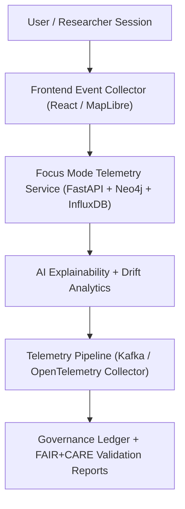

<div align="center">

# 📡 Kansas Frontier Matrix — **Telemetry Architecture & Focus Mode Analytics**
`docs/architecture/telemetry-architecture.md`

**Purpose:**  
Defines the telemetry data pipeline, analytics layer, and governance linkage for Focus Mode and system-wide performance tracking across the Kansas Frontier Matrix (KFM).  
Ensures transparent, ethical, and reproducible data monitoring aligned with FAIR+CARE and MCP-DL v6.3 documentation-first principles.

[](../../docs/standards/faircare-validation.md)
[]()
[]()
[](../../LICENSE)

</div>

---

## 📚 Overview

The **KFM Telemetry Architecture** captures data from Focus Mode interactions, AI explainability pipelines, and ETL process metrics, linking them directly to the project’s governance ledger for full accountability.  
Telemetry ensures that every user action, dataset validation, and AI reasoning event is traceable, ethically reviewed, and performance-optimized under the FAIR+CARE framework.

Telemetry logs provide:
- Real-time **Focus Mode analytics** and session histories.  
- Provenance-linked **AI model explainability records**.  
- **Environmental & energy metrics** for sustainability compliance (ISO 14064).  
- **Validation and governance traces** feeding into blockchain-certified provenance systems.  

---

## 🧠 Architecture Overview



### Core Components
| Layer | Technology | Role |
|--------|-------------|------|
| **Frontend Event Collector** | React Hooks / MapLibre | Captures user interaction, map focus, and timeline activity. |
| **Telemetry Service** | FastAPI / Python | Aggregates structured telemetry events and writes to ledger streams. |
| **Analytics Pipeline** | OpenTelemetry / Kafka | Handles real-time processing and batch ETL for governance validation. |
| **Storage & Indexing** | InfluxDB / Neo4j | Stores numeric telemetry metrics and entity-linked contextual traces. |
| **Governance Integration** | Blockchain Ledger / FAIR+CARE Audit | Certifies telemetry events for ethical oversight. |

---

## ⚙️ Telemetry Data Flow

1. **Capture:**  
   Each Focus Mode or ETL session emits standardized telemetry events (JSON objects) using OpenTelemetry SDK.  
   Events include fields such as `session_id`, `user_action`, `entity_focus`, `ai_model_used`, `response_time_ms`, and `energy_use_wh`.

2. **Normalize:**  
   Data is parsed through schema validators defined in `schemas/telemetry/focus-mode-v3.json`.  
   Errors trigger governance alerts logged in `data/reports/audit/telemetry_validation.json`.

3. **Aggregate:**  
   Metrics are aggregated by domain — e.g., hazards, hydrology, climate — for quarterly FAIR+CARE dashboards.

4. **Correlate:**  
   AI outputs (summaries, reasoning logs) are matched to telemetry sessions for explainability scoring (`ai_explainability_score`).

5. **Govern:**  
   Telemetry records are appended to the immutable **Governance Ledger**, where ethics and performance metrics are reviewed quarterly.

---

## 🧩 Telemetry Schema Highlights

```json
{
  "id": "telemetry_focus_2025Q4_001",
  "type": "focus-mode-session",
  "timestamp": "2025-11-03T18:25:00Z",
  "user_id": "anon-2985",
  "entity_focus": "Fort Larned",
  "actions": ["zoom_map", "timeline_scrub", "ai_summary_view"],
  "ai_model_used": "focus-climate-v4",
  "ai_explainability_score": 0.986,
  "session_duration_sec": 482,
  "energy_use_wh": 9.4,
  "fairstatus": "certified",
  "governance_ref": "data/reports/audit/data_provenance_ledger.json"
}
```

---

## 📊 FAIR+CARE Metrics Integration

| Metric | Description | Source |
|---------|-------------|---------|
| **FAIR Compliance** | Tracks findability, accessibility, interoperability, reusability. | `telemetry_faircare.json` |
| **Ethical Use Compliance** | Reviews user behavior for cultural and ethical integrity. | Governance Ledger |
| **Explainability Score** | Measures transparency of AI reasoning (SHAP/LIME/attention). | AI Model Pipeline |
| **Sustainability Index** | Records carbon and energy impact per action. | Focus Telemetry Collector |
| **System Health** | Tracks latency, uptime, error rates across layers. | Telemetry Dashboard |

These metrics feed into the `releases/v9.6.0/focus-telemetry.json` report for FAIR+CARE Council review.

---

## 🛰 Data Retention & Governance

| Category | Retention | Policy |
|-----------|------------|--------|
| User Interactions | 90 days | Anonymous, aggregated post-session. |
| AI Explainability | 365 days | Stored for reproducibility and ethics audits. |
| ETL Performance Logs | 1 year | Archived in `data/reports/audit/etl_performance.json`. |
| Governance Metrics | Permanent | Stored in blockchain-backed ledger and manifest. |

Data retention policies align with MCP-DL v6.3 and ISO 37000 ethics governance standards.

---

## 🔍 Focus Mode Telemetry Dashboard

Telemetry results populate the Focus Mode analytics dashboard, available via `/focus/telemetry` in the web app.  
The dashboard displays:
- Live governance compliance status.  
- FAIR+CARE progress charts.  
- AI model explainability and energy efficiency visualizations.  
- Session-based summaries highlighting ethical and technical performance.  

---

## ⚖️ Provenance Integration

All telemetry events are cross-registered to the **data provenance ledger** for immutable traceability.  
Each record includes:
- Event UUID and timestamp  
- Linked FAIR+CARE validation report ID  
- Governance cycle  
- PGP signature and checksum registry entry  

This ensures end-to-end reproducibility of data use and AI reasoning.

---

## 🧾 Internal Use Citation

```text
Kansas Frontier Matrix (2025). Telemetry Architecture & Focus Mode Analytics (v9.6.0).
Defines the structure, data flow, and FAIR+CARE governance integration for telemetry tracking in the KFM system.
Ensures transparent, ethical, and reproducible monitoring of Focus Mode and AI-driven user interactions.
```

---

## 🧾 Version Notes

| Version | Date | Notes |
|----------|------|--------|
| v9.6.0 | 2025-11-03 | Added Focus Mode explainability correlation and sustainability metrics. |
| v9.5.0 | 2025-11-02 | Enhanced OpenTelemetry integration and ethics validation hooks. |
| v9.3.2 | 2025-10-28 | Established base telemetry schema and ledger-linked reporting. |

---

<div align="center">

**Kansas Frontier Matrix** · *Telemetry Transparency × FAIR+CARE Governance × Ethical AI Accountability*  
[🔗 Repository](https://github.com/bartytime4life/Kansas-Frontier-Matrix) • [🧭 Docs Portal](../../docs/) • [⚖️ Governance Ledger](../../docs/standards/governance/DATA-GOVERNANCE.md)

</div>