<div align="center">

# 📡 Kansas Frontier Matrix — **Telemetry Architecture & Focus Mode Analytics**
`docs/architecture/telemetry-architecture.md`

**Purpose:**  
Defines the **telemetry data pipeline, analytics layer, and governance linkage** for Focus Mode and system-wide performance tracking across the Kansas Frontier Matrix (KFM).  
Ensures transparent, ethical, and reproducible monitoring aligned with **FAIR+CARE** and **MCP-DL v6.3** documentation-first principles.

[](./README.md)
[](../../LICENSE)
[](../standards/faircare-validation.md)
[]()

</div>

---

## 📘 Overview

The **KFM Telemetry Architecture** captures data from Focus Mode interactions, AI explainability pipelines, and ETL process metrics, linking them to the governance ledger for full accountability.  
Telemetry guarantees that every user action, dataset validation, and AI reasoning event is **traceable, ethically reviewed, and performance-optimized** under the FAIR+CARE framework.

**Telemetry delivers:**
- Real-time **Focus Mode analytics** and anonymized session histories.  
- Provenance-linked **AI explainability records** (local/global attributions, counterfactuals).  
- **Environmental & energy metrics** for ISO 14064/50001 sustainability compliance.  
- **Validation & governance traces** feeding blockchain-certified provenance systems.  

---

## 🧠 Architecture Overview

```mermaid
flowchart TD
    A["User / Researcher Session"] --> B["Frontend Event Collector (React · MapLibre)"]
    B --> C["Focus Mode Telemetry Service (FastAPI · Neo4j · InfluxDB)"]
    C --> D["AI Explainability + Drift Analytics"]
    D --> E["Telemetry Pipeline (OpenTelemetry Collector · Kafka)"]
    E --> F["Governance Ledger + FAIR+CARE Validation Reports"]
```



### Core Components

| Layer | Technology | Role |
|------|------------|-----|
| **Frontend Event Collector** | React Hooks · MapLibre | Captures interaction, map focus, timeline activity, accessibility metrics. |
| **Telemetry Service** | FastAPI · Python | Normalizes events, enforces schema, writes to metrics/index stores. |
| **Analytics Pipeline** | OpenTelemetry · Kafka | Real-time aggregation; batch ETL for quarterly governance reports. |
| **Storage & Indexing** | InfluxDB · Neo4j | Numeric time-series & entity-linked contextual traces for Focus Mode. |
| **Governance Integration** | Ledger · FAIR+CARE Audit | Certifies telemetry events; links ethics & performance to releases. |

---

## ⚙️ Telemetry Data Flow

1. **Capture**  
   Focus Mode and ETL sessions emit standardized telemetry (JSON) via OpenTelemetry SDK.  
   Event fields include: `session_id`, `user_action`, `entity_focus`, `ai_model_used`, `response_time_ms`, `energy_use_wh`, `explainability_score`.

2. **Normalize**  
   Events are validated against `schemas/telemetry/focus-mode-v3.json`.  
   Failures raise alerts and log to `data/reports/audit/telemetry_validation.json`.

3. **Aggregate**  
   Metrics are grouped by domain (**hazards, hydrology, climate, landcover, archive**) for weekly ops and **quarterly FAIR+CARE** dashboards.

4. **Correlate**  
   AI outputs (reasoning logs, SHAP/LIME) join to sessions for **explainability scoring** and **bias surveillance**.

5. **Govern**  
   Certified telemetry snapshots are appended to the **Governance Ledger** and cross-referenced in release manifests/SBOM.

---

## 🧩 Telemetry Schema Highlights

```json
{
  "id": "telemetry_focus_2025Q4_001",
  "type": "focus-mode-session",
  "timestamp": "2025-11-06T18:25:00Z",
  "user_id": "anon-2985",
  "entity_focus": "Fort Larned",
  "actions": ["zoom_map", "timeline_scrub", "ai_summary_view"],
  "ai_model_used": "focus-climate-v5",
  "ai_explainability_score": 0.989,
  "session_duration_sec": 512,
  "response_time_ms": 122,
  "energy_use_wh": 8.9,
  "fairstatus": "certified",
  "governance_ref": "data/reports/audit/data_provenance_ledger.json"
}
```

---

## 📊 FAIR+CARE Metrics Integration

| Metric | Description | Source |
|---|---|---|
| **FAIR Compliance** | Findability, accessibility, interoperability, reusability. | `telemetry_faircare.json` |
| **Ethical Use** | Session reviews for cultural integrity & accessibility. | Governance Ledger |
| **Explainability** | Transparency of AI reasoning (SHAP/LIME/counterfactuals). | AI Pipeline |
| **Sustainability** | Energy & CO₂e impact per action/session. | Focus Telemetry Collector |
| **System Health** | Latency, uptime, error budgets per layer. | Telemetry Dashboard |

Metrics are summarized in `releases/v9.7.0/focus-telemetry.json` for FAIR+CARE Council review.

---

## 🛰 Data Retention & Governance

| Category | Retention | Policy |
|---|---|---|
| User Interactions | 90 days | Anonymous; aggregated post-session. |
| AI Explainability | 365 days | Retained for reproducibility & ethics audits. |
| ETL Performance Logs | 1 year | Archived in `data/reports/audit/etl_performance.json`. |
| Governance Metrics | Permanent | Ledger-backed and checksum-signed. |

**Standards:** MCP-DL v6.3 · ISO 37000 (ethics governance) · ISO 14064/50001 (sustainability)

---

## 🔍 Focus Mode Telemetry Dashboard

Accessible at `/focus/telemetry` in the web app, displaying:
- Live governance compliance status and FAIR+CARE progress.  
- Explainability and bias KPIs per model/domain.  
- Energy/CO₂e efficiency graphs and latency percentiles.  
- Session summaries with anonymized behavior & accessibility signals.

---

## ⚖️ Provenance Integration

All telemetry events are cross-registered to the **data provenance ledger** with:
- Event UUID & timestamp  
- FAIR+CARE validation record IDs  
- Governance cycle & reviewer identities  
- PGP signature and **SHA-256** registry entry

This guarantees end-to-end reproducibility of both **data use** and **AI reasoning**.

---

## 🧪 Reference Implementation (Paths & CI)

- **Schemas:** `schemas/telemetry/focus-mode-v3.json`  
- **Snapshots:** `releases/v9.7.0/focus-telemetry.json`  
- **CI Workflows:** `.github/workflows/telemetry-report.yml`, `.github/workflows/governance-ledger.yml`  
- **Dashboards:** `web/` (MapLibre + timeline + Focus Mode panels)

---

## 🧾 Internal Use Citation

```text
Kansas Frontier Matrix (2025). Telemetry Architecture & Focus Mode Analytics (v9.7.0).
Defines the data flow, analytics, and FAIR+CARE governance integration for telemetry tracking in KFM.
Ensures transparent, ethical, and reproducible monitoring of Focus Mode and AI-driven interactions.
```

---

## 🕰️ Version History

| Version | Date | Author | Summary |
|---|---|---|---|
| v9.7.0 | 2025-11-06 | `@kfm-architecture` | Upgraded to v9.7.0; badge syntax hardened; paths & CI references refreshed; dashboard scope expanded. |
| v9.6.0 | 2025-11-03 | `@kfm-architecture` | Added Focus Mode explainability correlation and sustainability metrics. |
| v9.5.0 | 2025-11-02 | `@kfm-telemetry` | Enhanced OpenTelemetry integration & ethics validation hooks. |
| v9.3.2 | 2025-10-28 | `@kfm-core` | Established base telemetry schema & ledger-linked reporting. |

---

<div align="center">

**Kansas Frontier Matrix**  
*Telemetry Transparency × FAIR+CARE Governance × Ethical AI Accountability*  
© 2025 Kansas Frontier Matrix · Master Coder Protocol v6.3 · FAIR+CARE Certified · Diamond⁹ Ω / Crown∞Ω Ultimate Certified  

[Back to Architecture](./README.md) · [Governance Charter](../../docs/standards/governance/DATA-GOVERNANCE.md)

</div>
