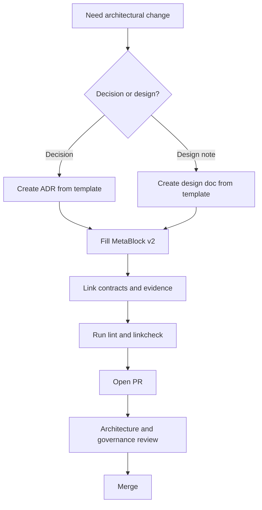
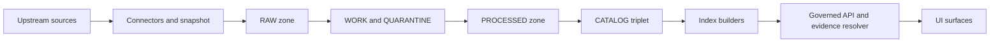

<!-- [KFM_META_BLOCK_V2]
doc_id: kfm://doc/d3d32c3d-6ab2-4b93-8b35-3fb3d40a0027
title: docs/architecture/templates — README
type: standard
version: v1
status: draft
owners: TBD
created: 2026-03-01
updated: 2026-03-01
policy_label: public
related:
  - docs/MASTER_GUIDE_v13.md
  - docs/architecture/
  - docs/templates/
tags: [kfm, architecture, templates]
notes:
  - Directory README describing what belongs in docs/architecture/templates and how to use it.
[/KFM_META_BLOCK_V2] -->

# KFM Architecture Templates
**Purpose:** Governed templates for architecture docs (ADRs, diagrams, and design notes) that must remain compatible with KFM’s **truth path** and **trust membrane** invariants.


---

## Quick navigation
- [Directory contract](#directory-contract)
- [How this fits in the repo](#how-this-fits-in-the-repo)
- [Template registry](#template-registry)
- [How to use a template](#how-to-use-a-template)
- [Non-negotiable authoring rules](#non-negotiable-authoring-rules)
- [Review gates](#review-gates)
- [Add a new template](#add-a-new-template)
- [Appendix](#appendix)

---

## Directory contract

### What lives here (acceptable inputs)
- **Templates only** for architecture documentation:
  - ADR templates (Architectural Decision Records)
  - Design / blueprint doc templates (architecture notes, subsystem designs)
  - Diagram templates (Mermaid-first; optional draw.io exports as assets)
  - Checklists used during architecture review (threat model, trust membrane review, etc.)

### What must NOT live here (exclusions)
- Finished architecture documents (put those in `docs/architecture/…`, *not* in `templates/`)
- Dataset specs, run receipts, STAC/DCAT/PROV profiles, or governance docs (use their canonical homes)
- Code, pipeline configs, or schemas (use `src/`, `schemas/`, `tools/`, etc.)
- “Random notes” without a clear purpose and review path

> **Rule of thumb:** If it’s meant to be *copied*, it belongs here. If it’s meant to be *referenced*, it belongs elsewhere.

---

## How this fits in the repo

KFM treats documentation as a governed, first-class artifact. In the **documented repo layout**:
- `docs/templates/` holds cross-cutting governed templates (universal doc, Story Node, API contract extension).
- `docs/architecture/` holds architecture design docs, blueprints, and ADRs.
- `docs/architecture/templates/` (this folder) holds **architecture-specific** templates to keep architecture work consistent and reviewable.

---

## Directory contents

```text
docs/architecture/
  templates/
    README.md                          # you are here
    TEMPLATE__ADR.md                   # (proposed) ADR template
    TEMPLATE__ARCHITECTURE_NOTE.md     # (proposed) short design note template
    TEMPLATE__ARCHITECTURE_BLUEPRINT.md# (proposed) full blueprint template
    TEMPLATE__DIAGRAM_MERMAID.md       # (proposed) diagram-only template (Mermaid)
    TEMPLATE__THREAT_MODEL_CHECKLIST.md# (proposed) trust membrane + policy checklist
```

> NOTE: The exact filenames above are **proposed** until they exist in-repo. The README is intended to make that target explicit and stable.

---

## Template registry

**Legend**
- **Confirmed** = specified by KFM governance / repo-structure docs (or already present in the repo).
- **Proposed** = recommended starting point; safe to add, but must be reviewed before treating as canonical.

| Template | Type | Intended output location | Status | Notes |
|---|---|---|---|---|
| `TEMPLATE__ADR.md` | `adr` | `docs/architecture/adr/` | Proposed | For durable decisions (interfaces, storage boundaries, policy posture). |
| `TEMPLATE__ARCHITECTURE_NOTE.md` | `standard` | `docs/architecture/` | Proposed | “Small diffs” design notes; use when an ADR is too heavy. |
| `TEMPLATE__ARCHITECTURE_BLUEPRINT.md` | `standard` | `docs/architecture/` | Proposed | For subsystem blueprints; should include diagrams + invariants. |
| `TEMPLATE__DIAGRAM_MERMAID.md` | `standard` | `docs/architecture/diagrams/` | Proposed | Diagram-first doc; avoids one-off formats. |
| `TEMPLATE__THREAT_MODEL_CHECKLIST.md` | `standard` | `docs/architecture/` | Proposed | Review aid for trust membrane + policy bypass risks. |

---

## How to use a template

1) **Pick the smallest artifact that fits**
- If you need to record a **decision** (tradeoffs, chosen option, rationale) → use an **ADR**.
- If you need to communicate a **design** (but not lock a decision) → use a **design note**.
- If you’re proposing a **subsystem boundary** (contracts, ownership, failure modes) → use a **blueprint**.

2) **Copy the template into its canonical home**
```bash
# Example (ADR)
cp docs/architecture/templates/TEMPLATE__ADR.md \
  docs/architecture/adr/ADR-2026-03-01-short-title.md
```

3) **Fill the MetaBlock v2 (required)**
- `doc_id` must be stable.
- `policy_label` must reflect what can safely be shown if docs are served through governed APIs.

4) **Write with evidence + contracts in mind**
- Link to the *relevant contracts* (schemas, API contracts, policy rules, pipeline contracts) when they exist.
- If something cannot be evidenced yet, mark it **Unknown** and list the minimum verification steps.

---

## Non-negotiable authoring rules

### 1) Respect the trust membrane (Confirmed)
Architecture docs **must not** introduce paths that let:
- clients/UI read from databases/object storage directly, or
- backend code bypass repository interfaces to access storage directly.

All access must flow through governed APIs that apply policy decisions, redactions, and logging.

### 2) Preserve the truth path (Confirmed)
When architecture work touches data, it must align with KFM’s lifecycle ordering:
Upstream → RAW → WORK/QUARANTINE → PROCESSED → CATALOG/TRIPLET → PUBLISHED surfaces.

### 3) “Cite or abstain” applies to architecture claims too (Confirmed principle)
If you claim:
- “this is how the system works”, or
- “this is allowed by policy”, or
- “this is safe to expose”  
…you must point to the relevant evidence/contract or explicitly label it **Unknown**.

---

## Reference diagrams

### Architecture doc workflow (this folder’s purpose)


### System reference flow (truth path + trust membrane)


---

## Review gates

Use this checklist when proposing architecture changes (especially anything that touches data access, policy enforcement, or evidence resolution):

- [ ] **Trust membrane preserved:** no direct DB/object-store access paths introduced.
- [ ] **Truth path preserved:** changes do not bypass RAW/WORK/PROCESSED/CATALOG promotion ordering.
- [ ] **Contracts first:** if you changed behavior, you also updated the relevant schema / API contract / policy contract (or opened a tracked follow-up).
- [ ] **Evidence is inspectable:** claims about data, provenance, or policy reference the corresponding artifacts (or are marked Unknown).
- [ ] **Reversible increment:** the change can be rolled back cleanly without corrupting promoted artifacts.

---

## Add a new template

When adding or changing templates, keep the change **small and reversible**:

1) Create the new `TEMPLATE__*.md` file.
2) Update the [Template registry](#template-registry) table.
3) Add a “minimum example” section in the template (copy-paste runnable snippets).
4) Keep Mermaid diagrams portable (no external assets required).
5) If the template introduces a new *required field* or *new invariant*, open an ADR to ratify it.

---

## Appendix

<details>
<summary>MetaBlock v2 refresher (copy/paste)</summary>

```text
<!-- [KFM_META_BLOCK_V2]
doc_id: kfm://doc/<uuid>
title: <Title>
type: <guide|standard|story|dataset_spec|adr|run_receipt>
version: v1
status: draft|review|published
owners: <team or names>
created: YYYY-MM-DD
updated: YYYY-MM-DD
policy_label: public|restricted|...
related:
  - <paths or kfm:// ids>
tags: [kfm]
notes:
  - <short notes>
[/KFM_META_BLOCK_V2] -->
```

</details>

---

<a id="back-to-top"></a>
**Back to top:** [Quick navigation](#quick-navigation)# Templates

Placeholder for architecture documentation.
