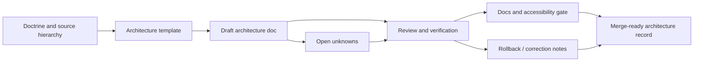
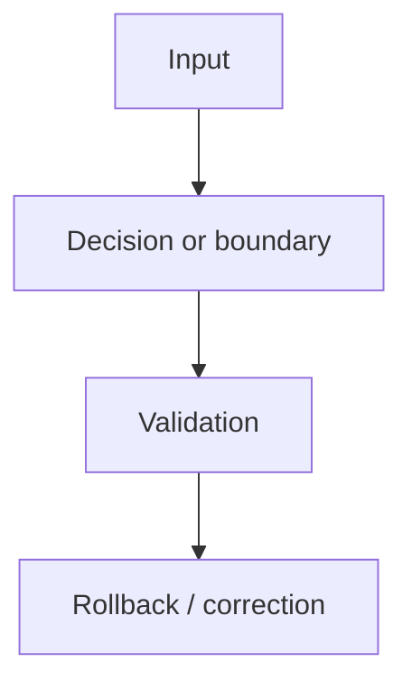

<!-- [KFM_META_BLOCK_V2]
doc_id: kfm://doc/<uuid-NEEDS-VERIFICATION>
title: Architecture Templates
type: standard
version: v1
status: draft
owners: <owners-NEEDS-VERIFICATION>
created: YYYY-MM-DD
updated: YYYY-MM-DD
policy_label: <policy_label-NEEDS-VERIFICATION>
related: [docs/architecture/, docs/templates/, schemas/, .github/]
tags: [kfm]
notes: [doc_id, owners, dates, and policy_label need direct repo verification; target directory role is inferred from the requested path because mounted repo contents were not directly inspectable in this session]
[/KFM_META_BLOCK_V2] -->

# Architecture Templates

_Governed starter patterns for KFM architecture docs, blueprints, and design records._

| Status | Owners | Badges | Quick jumps |
|---|---|---|---|
| `experimental` _(placeholder — NEEDS VERIFICATION)_ | `<owners-NEEDS-VERIFICATION>` | ![Status: experimental][badge-status] ![Scope: architecture docs][badge-scope] ![Truth posture: source bounded][badge-truth] ![Docs gate: required][badge-gate] | [Scope](#scope) · [Repo fit](#repo-fit) · [Quickstart](#quickstart) · [Template matrix](#template-matrix) · [Appendix](#appendix) |

> [!IMPORTANT]
> Current mounted repo contents for this directory were not directly inspectable in this session. This README therefore combines **CONFIRMED** KFM documentation layout and doctrine with **INFERRED** placement for `docs/architecture/templates/` based on the requested target path.

---

## Scope

This directory is the architecture-facing template layer for KFM.

Its job is to make architecture documentation easier to start, easier to review, and harder to let drift into unsupported prose. Templates here should help authors keep the same KFM disciplines visible from the first line of a draft: source hierarchy, truth posture, contract and surface seams, validation burden, rollback path, and open verification work.

Use this directory for reusable Markdown starters and snippets that support:

- system design notes
- architecture blueprints
- ADR-style decision records
- section skeletons for validation, rollback, review, and evidence basis
- diagram starters that explain real structure instead of decorating the page

This directory is **not** the place where finished architecture documents should live. It is the place where their starter shapes, review scaffolds, and reusable documentation patterns belong.

[Back to top](#architecture-templates)

## Repo fit

| Field | Value |
|---|---|
| Path | `docs/architecture/templates/` **INFERRED** from the requested target path |
| Upstream | [`../`](../) — architecture docs, blueprints, and design records |
| Lateral template space | [`../../templates/`](../../templates/) — broader governed document templates |
| Adjacent contract and verification surfaces | [`../../../schemas/`](../../../schemas/) · [`../../../tests/`](../../../tests/) · [`../../../tools/`](../../../tools/) · [`../../../.github/`](../../../.github/) |
| Primary users | Maintainers and contributors drafting or revising KFM architecture documentation |
| Main outcome | A repeatable architecture-doc starting point that preserves trust posture and reviewability |

### Path interpretation

- **CONFIRMED:** `docs/architecture/` is the architecture space for system design docs, blueprints, and ADRs.
- **CONFIRMED:** `docs/templates/` is the broader governed template space.
- **INFERRED:** this directory is the architecture-specific sibling template space under `docs/architecture/`, implied by the requested file path.

[Back to top](#architecture-templates)

## Inputs

Accepted inputs for this directory include:

- architecture-document starter files in Markdown
- reusable summary-table blocks for goal, status, evidence basis, interfaces, validation, rollback, and open verification
- Mermaid starter diagrams for boundaries, flows, and review paths
- review checklists for architecture PRs and docs-gate readiness
- example section scaffolds for truth posture, assumptions, contracts, and unknown retirement

A good template here reduces ambiguity. It should help a reviewer see what is being proposed, what is already supported, what still needs evidence, and what failure or correction path exists if the design changes.

[Back to top](#architecture-templates)

## Exclusions

This directory should **not** contain:

- finished architecture docs, adopted blueprints, or approved ADRs  
  → place those in [`../`](../)
- general-purpose template families that are not architecture-specific  
  → place those in [`../../templates/`](../../templates/)
- canonical schemas, fixtures, or test assets  
  → place those in [`../../../schemas/`](../../../schemas/) and [`../../../tests/`](../../../tests/)
- tooling, render scripts, or CI logic  
  → place those in [`../../../tools/`](../../../tools/) or [`../../../.github/`](../../../.github/)
- unmarked speculative repo paths, routes, manifests, or runtime claims presented as fact

When in doubt, keep this directory narrow: starter patterns only.

[Back to top](#architecture-templates)

## Directory tree

**Current directory contents:** `NEEDS VERIFICATION`  
**Starter shape below:** `PROPOSED` as a clean, minimal pattern if this directory is being established or normalized.

```text
docs/
└── architecture/
    ├── README.md                              # architecture index (NEEDS VERIFICATION)
    ├── templates/
    │   ├── README.md                          # this file
    │   ├── architecture-note.template.md      # PROPOSED
    │   ├── blueprint.template.md              # PROPOSED
    │   ├── adr.template.md                    # PROPOSED
    │   ├── review-checklist.template.md       # PROPOSED
    │   └── snippets/
    │       ├── summary-table.md               # PROPOSED
    │       ├── truth-posture-block.md         # PROPOSED
    │       └── mermaid-starters.md            # PROPOSED
    └── <published-architecture-docs>.md       # actual filenames NEED VERIFICATION
```

[Back to top](#architecture-templates)

## Quickstart

1. Pick the smallest template that fits the job.
2. Copy it out of this directory and into [`../`](../).
3. Fill the KFM meta block and the README/doc impact block immediately.
4. Replace placeholders with grounded values where you have evidence.
5. Mark anything not directly verified as `INFERRED`, `PROPOSED`, `UNKNOWN`, or `NEEDS VERIFICATION`.
6. Add one meaningful Mermaid diagram and at least one compact reference table.
7. Include validation burden, rollback/correction path, and open verification steps before opening a PR.

Illustrative shell flow:

```bash
# from repo root
cp docs/architecture/templates/<template-file>.md docs/architecture/<new-doc>.md
$EDITOR docs/architecture/<new-doc>.md

git add docs/architecture/<new-doc>.md docs/architecture/templates/README.md
git commit -m "docs(architecture): add <new-doc> from template"
```

> [!NOTE]
> No architecture-doc scaffolder script was directly verified in this session. Use manual copy/edit flow unless the mounted repo proves a generator exists.

[Back to top](#architecture-templates)

## Usage

### Choose the smallest template that fits

Use a narrow template first.

- Reach for an **ADR** when one decision needs a durable record.
- Reach for a **blueprint** when multiple seams, contracts, or planes are changing together.
- Reach for an **architecture note** when one boundary, subsystem, or review topic needs explanation without pretending to settle the whole system.
- Reach for a **review checklist** when the main need is merge or release readiness rather than prose.

### Keep truth posture explicit

A template is successful only if it makes unsupported certainty harder.

Good architecture docs in KFM keep these distinctions visible:

- what is directly supported
- what is inferred from repeated doctrine
- what is recommended but not yet implemented
- what remains unknown until the mounted repo, workflows, manifests, or runtime are inspected

### Make seams reviewable

Templates in this directory should push authors to name:

- interfaces and contracts affected
- source or evidence basis
- validation and proof burden
- rollback or correction path
- open verification steps
- whether the document is describing current reality or a starter direction

### Prefer structure over flourish

The most useful template is not the prettiest one. It is the one that makes ownership, timing, translation, trust, and review state easier to inspect.

[Back to top](#architecture-templates)

## Diagram


```mermaid
flowchart LR
    A[Doctrine and source hierarchy] --> B[Architecture template]
    B --> C[Draft architecture doc]
    C --> D[Review and verification]
    D --> E[Docs and accessibility gate]
    E --> F[Merge-ready architecture record]

    C --> G[Open unknowns]
    G --> D

    D --> H[Rollback / correction notes]
    H --> F
```

This directory exists to improve the `B -> C -> D` part of that flow without pretending the review and gate layers are optional.

[Back to top](#architecture-templates)

## Tables

### Template matrix

| Template class | Status | Use when | Must capture | Should not become |
|---|---|---|---|---|
| Blueprint | **CONFIRMED** class | A subsystem or cross-plane design is being proposed or reworked | dependency order, major seams, diagram, interfaces/contracts, validation burden, rollback path | a vague vision memo |
| ADR / decision record | **CONFIRMED** class | One important decision needs durable context and consequences | decision, alternatives, consequences, verification, follow-up ADRs or docs | a hidden design debate |
| Architecture note | **INFERRED** class | One boundary or topic needs explanation without a full blueprint | scope, assumptions, affected surfaces, evidence basis, open unknowns | a stealth master plan |
| Review checklist | **INFERRED** class | A doc needs repeatable pre-merge or pre-release review | docs gate, accessibility, link/diagram sanity, truth posture, owner/reviewer handoff | a substitute for the design itself |

### Required blocks for architecture templates

| Block | Requirement | Why it belongs |
|---|---|---|
| KFM Meta Block v2 | **Required** | gives the doc identity, status, ownership, and related-path metadata |
| Top impact block | **Required for README-like docs** | makes status, owners, badges, and quick jumps immediately visible |
| Summary table | **KFM-aligned default** | keeps goal, status, evidence, interfaces, validation, rollback, and open verification scannable |
| Truth posture note | **Required whenever certainty varies** | prevents drift from evidence-grounded description into persuasive overclaim |
| Mermaid diagram | **Required for directory/README-like docs** | shows actual structure or flow instead of leaving it buried in prose |
| Validation + rollback section | **Strongly expected** | architecture choices in KFM are review-bearing and correction-aware |
| Appendix in `<details>` | **Recommended when long** | keeps the main path readable while preserving reusable detail |

### What every architecture document starter should prompt for

| Prompt | Why it matters |
|---|---|
| What problem or seam is this document addressing? | prevents template cargo-culting |
| What is CONFIRMED vs INFERRED vs PROPOSED vs UNKNOWN? | keeps trust posture visible |
| What contracts, surfaces, or packages change? | makes blast radius legible |
| What proof or validation is needed? | aligns docs with KFM verification doctrine |
| What is the rollback or correction path? | makes change discipline operational |
| What still needs direct repo/runtime verification? | turns uncertainty into a worklist |

[Back to top](#architecture-templates)

## Task list

Definition-of-done checklist for changes in this directory:

- [ ] The selected template class matches the real job.
- [ ] The file keeps `CONFIRMED`, `INFERRED`, `PROPOSED`, `UNKNOWN`, and `NEEDS VERIFICATION` visible where needed.
- [ ] The KFM meta block is present and synchronized with the document title.
- [ ] The top impact block includes status, owners, badges, and quick jumps.
- [ ] Repo-fit paths are correct or explicitly marked as needing verification.
- [ ] At least one meaningful Mermaid diagram is present.
- [ ] A compact matrix, registry, or checklist table is included where it improves scanability.
- [ ] Validation burden is named.
- [ ] Rollback or correction path is named.
- [ ] Open verification steps are named.
- [ ] The template does not harden speculative repo structure into asserted fact.
- [ ] Long reference material is collapsed into `<details>`.

[Back to top](#architecture-templates)

## FAQ

### Why is this separate from `docs/templates/`?

Because `docs/templates/` is the broader governed template layer. This directory exists for architecture-specific starters that need stronger prompts around seams, contracts, review, rollback, and system-boundary explanation.

### Why do architecture templates need rollback or correction language?

Because in KFM, documentation is not decorative. Architecture docs shape review, release readiness, and future change. If a design move fails or narrows later, the doc should already make that path visible.

### When should I use `INFERRED` instead of `PROPOSED`?

Use `INFERRED` only for a small structural completion strongly implied by repeated doctrine and necessary for coherence. Use `PROPOSED` for a recommended design direction that fits KFM but is not shown as current reality.

### Can a template hard-code repo paths, routes, or package names?

Only when those paths are directly verified. Otherwise the template should surface them as placeholders or `NEEDS VERIFICATION`, not harden them into pseudo-facts.

[Back to top](#architecture-templates)

## Appendix

<details>
<summary>Copy-paste architecture document starter</summary>

```md
<!-- [KFM_META_BLOCK_V2]
doc_id: kfm://doc/<uuid-NEEDS-VERIFICATION>
title: <Title>
type: standard
version: v1
status: draft
owners: <owners-NEEDS-VERIFICATION>
created: YYYY-MM-DD
updated: YYYY-MM-DD
policy_label: <policy_label-NEEDS-VERIFICATION>
related: [<paths-or-kfm-ids-NEEDS-VERIFICATION>]
tags: [kfm]
notes: [metadata placeholders require direct repo verification]
[/KFM_META_BLOCK_V2] -->

# <Title>

_<One-line purpose>_

| Goal | Status | Evidence basis | Interfaces / contracts affected |
|---|---|---|---|
| <What this doc is for> | `CONFIRMED` / `INFERRED` / `PROPOSED` / `UNKNOWN` | <docs, artifacts, or repo evidence> | <names or placeholders> |

## Scope

<State what this document covers and what it does not.>

## Truth posture

- **CONFIRMED:** <directly supported facts>
- **INFERRED:** <small structural completions>
- **PROPOSED:** <recommended realization>
- **UNKNOWN / NEEDS VERIFICATION:** <repo/runtime gaps>

## Architecture / decision content

<Main design material here>

## Diagram


```mermaid
flowchart TD
    A[Input] --> B[Decision or boundary]
    B --> C[Validation]
    C --> D[Rollback / correction]
```

## Validation

- <tests, proof objects, review checks>

## Rollback / correction path

- <what happens if this design is narrowed, reversed, or superseded>

## Open verification steps

- <direct repo/runtime checks still needed>
```

</details>

[Back to top](#architecture-templates)

[badge-status]: https://img.shields.io/badge/status-experimental-lightgrey
[badge-scope]: https://img.shields.io/badge/scope-architecture%20templates-1f6feb
[badge-truth]: https://img.shields.io/badge/truth-source--bounded-6f42c1
[badge-gate]: https://img.shields.io/badge/docs%20gate-required-b31d28
