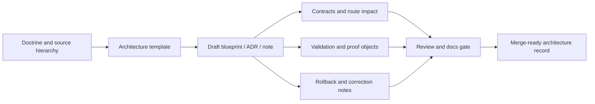
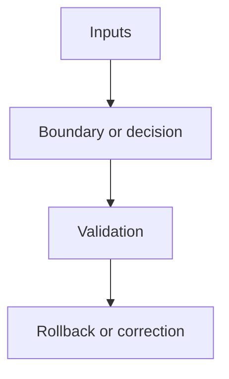

<!-- [KFM_META_BLOCK_V2]
doc_id: kfm://doc/<uuid-NEEDS-VERIFICATION>
title: Architecture Templates
type: standard
version: v1
status: draft
owners: <owners-NEEDS-VERIFICATION>
created: YYYY-MM-DD
updated: YYYY-MM-DD
policy_label: <policy_label-NEEDS-VERIFICATION>
related: [docs/architecture/, docs/templates/, contracts/, schemas/, tests/, .github/]
tags: [kfm]
notes: [Exact doc_id, owners, dates, and policy_label require direct repo verification; docs/architecture/templates/ is inferred from the requested target path and documented repo conventions; current-session workspace evidence was PDF corpus only.]
[/KFM_META_BLOCK_V2] -->

# Architecture Templates

_Governed starter patterns for KFM architecture docs, blueprints, ADRs, and review scaffolds._

| Status | Owners | Badges | Quick jumps |
|---|---|---|---|
| `experimental` _(placeholder — NEEDS VERIFICATION)_ | `<owners-NEEDS-VERIFICATION>` | ![Status: experimental][badge-status] ![Scope: architecture templates][badge-scope] ![Truth posture: source bounded][badge-truth] ![Docs gate: required][badge-gate] | [Scope](#scope) · [Repo fit](#repo-fit) · [Quickstart](#quickstart) · [Template matrix](#template-matrix) · [Appendix](#appendix) |

> [!IMPORTANT]
> This README is **source-grounded but not repo-checkout-verified**. The broader KFM doctrine, documentation conventions, and adjacent repo surfaces are documented in the attached corpus, but the exact live contents of `docs/architecture/templates/` were **not** directly inspected in this session. Path-level claims below are therefore separated into **CONFIRMED**, **INFERRED**, **PROPOSED**, and **NEEDS VERIFICATION** where appropriate.

---

## Scope

This directory is the architecture-facing template layer for KFM.

Its job is to make architecture writing easier to start, easier to review, and harder to let drift into unsupported prose. Templates here should help authors expose the same things KFM treats as load-bearing everywhere else: source hierarchy, truth posture, contract impact, route impact, validation burden, rollback path, and open verification work.

Use this directory for reusable Markdown starters and snippets that support:

- architecture blueprints
- ADR-style decision records
- architecture notes for one boundary, seam, or subsystem
- review checklists and merge-readiness scaffolds
- reusable sections for evidence basis, validation, rollback, and correction
- Mermaid starters that explain real structure rather than decorate the page

This directory is **not** the place for adopted architecture records themselves. It is the place for their starter shapes.

[Back to top](#architecture-templates)

## Repo fit

KFM documentation already distinguishes architecture docs from broader governed templates. This directory sits at that seam.

| Field | Value | Status |
|---|---|---|
| Target path | `docs/architecture/templates/` | **INFERRED** from the requested target path |
| Parent architecture space | [`../`](../) — architecture docs, blueprints, and ADRs | **CONFIRMED** in project documentation |
| Broader template space | [`../../templates/`](../../templates/) — general governed templates | **CONFIRMED** in project documentation |
| Adjacent contract surfaces | [`../../../contracts/`](../../../contracts/) · [`../../../schemas/`](../../../schemas/) · [`../../../tests/`](../../../tests/) · [`../../../.github/`](../../../.github/) | **CONFIRMED** as documented repo surfaces |
| Primary users | Maintainers, architects, contributors, reviewers | **INFERRED** |
| Main outcome | Reusable architecture starters that preserve KFM doctrine and reviewability | **INFERRED** |

### Documented neighboring template family

The broader KFM template layer is already documented as including a universal governed doc template, a Story Node template, and an API contract extension template. This architecture-specific template space should **complement** those files rather than duplicate them.

| Adjacent artifact family | Typical role here |
|---|---|
| General governed document template | Baseline structure when an architecture doc does not need a specialized starter |
| Story Node template | Out of scope for this directory unless an architecture doc is explicitly about story/narrative surfaces |
| API contract extension template | Use alongside architecture templates when the design changes payloads, routes, or contract families |

[Back to top](#architecture-templates)

## Inputs

Accepted inputs for this directory include:

- Markdown template files for architecture use
- reusable summary blocks for goal, status, evidence basis, affected contracts, validation, rollback, and open verification
- checklist templates for architecture PR review or release readiness
- Mermaid diagram starters for boundaries, flows, and governed transitions
- small snippet libraries for truth posture, assumptions, route impact, correction posture, and docs-gate reminders

A good template here should reduce ambiguity, not add ceremony.

[Back to top](#architecture-templates)

## Exclusions

This directory should **not** contain:

- finished blueprints, architecture notes, or adopted ADRs  
  → place those in [`../`](../)
- generic document templates that are not architecture-specific  
  → place those in [`../../templates/`](../../templates/)
- canonical schemas, contract registries, or example fixtures  
  → place those in [`../../../contracts/`](../../../contracts/), [`../../../schemas/`](../../../schemas/), or [`../../../tests/`](../../../tests/)
- CI logic, policy bundles, or merge-gate automation  
  → place those in [`../../../.github/`](../../../.github/) or other documented runtime/policy surfaces
- speculative repo structure presented as current fact

When in doubt, keep this directory narrow: **starter patterns only**.

[Back to top](#architecture-templates)

## Directory tree

**Current local contents:** `NEEDS VERIFICATION`  
**Starter shape below:** `PROPOSED` as a minimal, architecture-specific template layer.

```text
docs/
├── architecture/                                     # documented architecture-doc space
│   ├── README.md                                     # NEEDS VERIFICATION
│   ├── templates/                                    # INFERRED target directory for this file
│   │   ├── README.md                                 # this file
│   │   ├── blueprint.template.md                     # PROPOSED
│   │   ├── adr.template.md                           # PROPOSED
│   │   ├── architecture-note.template.md             # PROPOSED
│   │   ├── review-checklist.template.md              # PROPOSED
│   │   └── snippets/                                 # PROPOSED
│   │       ├── summary-table.md                      # PROPOSED
│   │       ├── truth-posture-block.md                # PROPOSED
│   │       ├── contract-impact-block.md              # PROPOSED
│   │       └── mermaid-starters.md                   # PROPOSED
│   └── <blueprints-and-adrs>.md                      # actual filenames NEEDS VERIFICATION
├── templates/                                        # documented broader template layer
├── contracts/                                        # documented contract surface
├── schemas/                                          # documented schema surface
├── tests/                                            # documented test surface
└── .github/                                          # documented workflow / gate surface
```

> [!NOTE]
> The tree above intentionally separates **documented adjacent surfaces** from **proposed local starter files**. It does **not** assert that every listed file already exists in the live repo.

[Back to top](#architecture-templates)

## Quickstart

1. Choose the smallest template that fits the job.
2. Copy it from this directory into [`../`](../).
3. Fill the KFM meta block first.
4. Replace certainty with the correct label: `CONFIRMED`, `INFERRED`, `PROPOSED`, `UNKNOWN`, or `NEEDS VERIFICATION`.
5. Name the affected contracts, routes, surfaces, validation burden, and rollback path before opening a PR.

Illustrative shell flow:

```bash
# from repo root — example flow; verify actual template filenames first
cp docs/architecture/templates/<template-file>.md docs/architecture/<new-doc>.md
$EDITOR docs/architecture/<new-doc>.md

git add docs/architecture/<new-doc>.md docs/architecture/templates/README.md
git commit -m "docs(architecture): add <new-doc> from architecture template"
```

> [!TIP]
> No architecture-doc generator or scaffolder was directly verified in this session. Manual copy/edit flow is the safest documented assumption.

[Back to top](#architecture-templates)

## Usage

### Choose the smallest template that fits

Use a narrow template first.

- Reach for a **blueprint** when multiple seams, contracts, or planes are changing together.
- Reach for an **ADR** when one decision needs durable context, alternatives, and consequences.
- Reach for an **architecture note** when one boundary or topic needs explanation without pretending to settle the whole system.
- Reach for a **review checklist** when the main need is merge-readiness or promotion-readiness rather than long-form prose.

### Keep truth posture explicit

Templates in this directory should make unsupported certainty harder.

Good KFM architecture docs keep visible:

- what is directly supported
- what is conservative structural completion
- what is design direction only
- what still needs direct repo, workflow, schema, or runtime verification

### Surface contract and route impact early

Architecture in KFM is not only about components. It is also about what becomes inspectable, governable, and testable.

A strong starter should force authors to name:

- affected contract families
- affected route families
- affected product surfaces
- proof objects or receipts expected
- validation burden
- rollback or correction path

### Treat surface changes as evidence changes

When a design touches user-facing behavior, the template should prompt for shell and trust consequences too:

- map / tile / portrayal effects
- Evidence Drawer implications
- Focus Mode / RuntimeResponseEnvelope implications
- review / stewardship consequences
- export / correction / stale-visible consequences

### Keep 3D burden-bearing

If a proposal introduces 3D, twin-like, or volumetric behavior, the template should require a brief burden statement: why 2D is insufficient, what new governance load appears, and how the same evidence and correction rules remain visible.

[Back to top](#architecture-templates)

## Diagram


```mermaid
flowchart LR
    A[Doctrine and source hierarchy] --> B[Architecture template]
    B --> C[Draft blueprint / ADR / note]
    C --> D[Contracts and route impact]
    C --> E[Validation and proof objects]
    C --> F[Rollback and correction notes]
    D --> G[Review and docs gate]
    E --> G
    F --> G
    G --> H[Merge-ready architecture record]
```

This directory exists to improve the `B → C → G` path without pretending the review, validation, and correction layers are optional.

[Back to top](#architecture-templates)

## Tables

### Template matrix

| Template class | Use when | Must surface | Should not become |
|---|---|---|---|
| Blueprint | A subsystem or cross-plane design is changing together | boundaries, major seams, contracts, route impact, validation burden, rollback path | a vague vision memo |
| ADR / decision record | One durable decision needs context and consequences | decision, alternatives, tradeoffs, consequences, follow-up verification | an undocumented argument archive |
| Architecture note | One boundary, subsystem, or design question needs explanation | scope, assumptions, evidence basis, open unknowns, affected surfaces | a stealth master plan |
| Review checklist | The design exists but needs repeatable merge/review criteria | gates, docs alignment, validation proof, correction posture, owner handoff | a substitute for the design itself |

### What every architecture starter should force into the open

| Prompt area | What the template should ask for | Why it matters |
|---|---|---|
| Evidence basis | baseline docs, supporting docs, repo evidence, unresolved gaps | stops pseudo-certainty |
| Truth posture | `CONFIRMED` / `INFERRED` / `PROPOSED` / `UNKNOWN` distinctions | preserves KFM trust discipline |
| Contract impact | schemas, payloads, registries, proof objects, state transitions | architecture becomes executable |
| Route impact | feature read, map/tile, evidence resolution, export, Focus, review | prevents invisible surface drift |
| Validation burden | tests, fixtures, docs gate, accessibility gate, negative-path checks | aligns docs with verification doctrine |
| Rollback / correction | rollback note, correction scope, rebuild implications, stale-visible behavior | preserves correction lineage |

### KFM object families architecture templates should know about

| Family | Typical use in architecture docs |
|---|---|
| `SourceDescriptor` | source onboarding or intake-boundary changes |
| `DatasetVersion` | canonical subject/version shape and semantics |
| `CatalogClosure` | STAC / DCAT / PROV closure implications |
| `DecisionEnvelope` | policy result, reason codes, obligation codes |
| `ReviewRecord` | reviewer action, approval, denial, escalation |
| `ReleaseManifest` / `ReleaseProofPack` | public-safe release assembly and proof |
| `ProjectionBuildReceipt` | derived-layer rebuild and freshness implications |
| `EvidenceBundle` | inspectable support for claims, exports, stories, and answers |
| `RuntimeResponseEnvelope` | Focus Mode or other runtime outcome accountability |
| `CorrectionNotice` | visible supersession, narrowing, or withdrawal |

[Back to top](#architecture-templates)

## Task list

Definition-of-done checklist for changes in this directory:

- [ ] The template class matches the actual job.
- [ ] The KFM meta block is present and synchronized with the document title.
- [ ] The top impact block shows status, owners, badges, and quick jumps.
- [ ] Repo-fit paths are correct or clearly marked `NEEDS VERIFICATION`.
- [ ] The file keeps `CONFIRMED`, `INFERRED`, `PROPOSED`, `UNKNOWN`, and `NEEDS VERIFICATION` visible where needed.
- [ ] At least one meaningful Mermaid diagram is present.
- [ ] At least one compact reference table improves scanability.
- [ ] Validation burden is named.
- [ ] Rollback or correction path is named.
- [ ] Surface or route implications are named when relevant.
- [ ] Long appendix material is wrapped in `<details>`.
- [ ] The template does not harden speculative repo shape into asserted fact.

[Back to top](#architecture-templates)

## FAQ

### Why is this separate from `docs/templates/`?

Because `docs/templates/` is the broader governed template layer. This directory is the architecture-specific layer for blueprints, decision records, and review scaffolds that need stronger prompts around seams, contracts, route families, validation, and rollback.

### Why do architecture templates need rollback and correction language?

Because in KFM, architecture docs are not decorative. They shape review, release readiness, and future correction work. A document that proposes change without naming how that change is corrected later is incomplete.

### When should I use `INFERRED` instead of `PROPOSED`?

Use `INFERRED` only for a small structural completion strongly implied by repeated KFM doctrine and needed for coherence. Use `PROPOSED` for a recommended design move or template addition that fits KFM but is not shown as current reality.

### Can a template hard-code repo paths, routes, or DTO names?

Only when they are directly verified. Otherwise the template should surface them as placeholders or `NEEDS VERIFICATION`, not harden them into pseudo-facts.

### Why keep mentioning contracts and proof objects in a docs directory?

Because KFM is explicitly contract-first and evidence-first. The architecture doc is often where a contract family, proof object, or route obligation becomes visible enough to implement and test correctly.

[Back to top](#architecture-templates)

## Appendix

<details>
<summary>Copy-paste architecture document starter</summary>

```md
<!-- [KFM_META_BLOCK_V2]
doc_id: kfm://doc/<uuid-NEEDS-VERIFICATION>
title: <Title>
type: standard
version: v1
status: draft
owners: <owners-NEEDS-VERIFICATION>
created: YYYY-MM-DD
updated: YYYY-MM-DD
policy_label: <policy_label-NEEDS-VERIFICATION>
related: [<paths-or-kfm-ids-NEEDS-VERIFICATION>]
tags: [kfm]
notes: [metadata placeholders require direct repo verification]
[/KFM_META_BLOCK_V2] -->

# <Title>

_<One-line purpose>_

| Goal | Status | Evidence basis | Affected contracts / routes |
|---|---|---|---|
| <What this doc is for> | `CONFIRMED` / `INFERRED` / `PROPOSED` / `UNKNOWN` | <docs, artifacts, or repo evidence> | <families or placeholders> |

## Scope

<State what this document covers and what it does not.>

## Truth posture

- **CONFIRMED:** <directly supported facts>
- **INFERRED:** <small structural completions>
- **PROPOSED:** <recommended realization>
- **UNKNOWN / NEEDS VERIFICATION:** <repo/runtime gaps>

## Affected surfaces and route families

- <map / tile / portrayal>
- <feature / subject read>
- <Evidence Drawer / evidence resolution>
- <Focus / RuntimeResponseEnvelope>
- <review / stewardship / export>

## Architecture / decision content

<Main design material here>

## Diagram


```mermaid
flowchart TD
    A[Inputs] --> B[Boundary or decision]
    B --> C[Validation]
    C --> D[Rollback or correction]
```

## Validation

- <tests, proof objects, review checks, docs gate>

## Rollback / correction path

- <what happens if this design is narrowed, reversed, or superseded>

## Open verification steps

- <direct repo/runtime checks still needed>
```

</details>

<details>
<summary>Starter prompts for architecture authors</summary>

| Prompt | Why it belongs |
|---|---|
| What problem or seam is this document actually about? | prevents architecture sprawl |
| What is verified vs merely proposed? | keeps trust posture legible |
| What contracts, payloads, or schemas change? | architecture becomes actionable |
| What route families or product surfaces change? | UI/API consequences stay visible |
| What proof objects or tests should exist afterward? | links design to verification |
| What is the rollback or correction path? | makes change discipline operational |
| What still needs direct repo verification? | turns uncertainty into a worklist |

</details>

[Back to top](#architecture-templates)

[badge-status]: https://img.shields.io/badge/status-experimental-lightgrey
[badge-scope]: https://img.shields.io/badge/scope-architecture%20templates-1f6feb
[badge-truth]: https://img.shields.io/badge/truth-source--bounded-6f42c1
[badge-gate]: https://img.shields.io/badge/docs%20gate-required-b31d28
