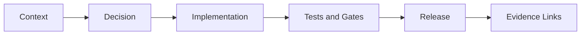

<!-- [KFM_META_BLOCK_V2]
doc_id: kfm://doc/<uuid>
title: ADR-<####>: <Decision title>
type: adr
version: v1
status: draft|review|published|superseded
owners: <team or names>
created: YYYY-MM-DD
updated: YYYY-MM-DD
policy_label: public|restricted|...
related:
  - doc://<sha256-or-doc-id>                 # e.g., a spec, guide, threat model, runbook
  - kfm://dataset/<slug>@<dataset_version>   # if decision impacts a dataset family
  - prov://kfm://run/<run_id>                # if decision tied to a specific run/receipt
tags:
  - kfm
  - adr
notes:
  - <short notes, including “why now”>
[/KFM_META_BLOCK_V2] -->

# ADR-<####>: <Decision title>


**One-line purpose:** Record a single architectural decision (what we decided + why), in a way that is evidence-linked, testable, and reversible.

> **Rule (governance):** If this change alters core invariants (policy, IDs, catalogs, trust membrane), the PR MUST link to this ADR.

**Copy / naming guidance**
- Copy this file to: `docs/architecture/adr/ADR-<####>-<short-slug>.md`
- Keep `doc_id` stable forever. Do **not** regenerate on edits; only update `updated:` on meaningful changes.

---

## Navigation
- [Context](#context)
- [Decision](#decision)
- [Options considered](#options-considered)
- [Evidence](#evidence)
- [Consequences](#consequences)
- [Risks and mitigations](#risks-and-mitigations)
- [Implementation plan](#implementation-plan)
- [Validation and gates](#validation-and-gates)
- [Rollout plan](#rollout-plan)
- [Rollback plan](#rollback-plan)
- [Minimum verification steps](#minimum-verification-steps)
- [References](#references)

---

## Metadata

| Field | Value |
|---|---|
| ADR ID | ADR-<####> |
| Status | draft \| review \| published \| superseded |
| Decision date | YYYY-MM-DD |
| Owners | <team / names> |
| Reviewers / approvers | <names / roles> |
| Decision type | <architecture \| data \| policy \| security \| api \| ui \| infra \| process> |
| Scope | <repo areas, services, datasets, user-facing surfaces> |
| Related | <links to ADRs/specs/issues/PRs> |

---

## Context

### Problem statement
**We need to decide:** <describe the decision to be made in 1–2 sentences>.

### Why now
- <what forced this decision? e.g., gap closure, scaling pain, security finding, milestone gate>

### Constraints
- **Governance / policy:** <policy_label constraints, obligations, rights constraints>
- **Architecture invariants:** <trust membrane, cite-or-abstain, promotion gates, etc.>
- **Operational:** <SLAs, cost limits, timeline, staffing>
- **Compatibility:** <backwards compatibility needs, migration constraints>

### Non-goals
- <explicitly state what this ADR does NOT try to solve>

### Tagging discipline for claims
When writing this ADR, label key statements as one of:
- **CONFIRMED** (backed by source-of-truth docs / artifacts)
- **PROPOSED** (recommended approach; requires adoption)
- **UNKNOWN / DECISION NEEDED** (not verified yet; must be checked/decided)
Each **UNKNOWN** must include a *default path* and a *minimum verification step*.

---

## Decision

### Decision statement
**We will:** <one sentence, unambiguous decision>.

### Decision drivers
- <top 3–7 reasons, ranked if helpful>

### Intended outcomes (measurable)
- <example: “Policy bypass risks reduced via merge-blocking CI rule”>
- <example: “Evidence refs resolve end-to-end in <= 2 calls”>
- <example: “Promotion remains fail-closed”>

---

## Options considered

> Tip: Include “do nothing” / “defer” as an option if it was realistically possible.

| Option | Summary | Pros | Cons | Risks | Why accepted/rejected |
|---|---|---|---|---|---|
| A | <…> | <…> | <…> | <…> | <…> |
| B | <…> | <…> | <…> | <…> | <…> |
| C | <…> | <…> | <…> | <…> | <…> |

---

## Evidence

### EvidenceRefs (preferred)
Use resolvable references wherever possible:

```text
dcat://...   -> dataset/distribution metadata
stac://...   -> collection/item/asset metadata
prov://...   -> run lineage (activities/entities/agents)
doc://...    -> governed docs and story citations
graph://...  -> entity relations (if enabled)
```

List the evidence used to justify the decision:

- doc://<id-or-hash>#<anchor> — <what it supports>
- prov://kfm://run/<run_id> — <what it supports>
- dcat://<dataset>@<version> — <what it supports>
- <issue/PR link> — <what it supports>

### Evidence quality notes
- **Freshness:** <is evidence time-sensitive?>
- **Completeness:** <what’s missing?>
- **Conflicts:** <any sources disagree?>

---

## Architecture sketch



### Before
- <current state description>

### After
- <proposed state description>

---

## Consequences

### Positive
- <what gets better>

### Negative
- <what gets worse / what we give up>

### Tradeoffs
- <explicit tradeoffs: performance vs safety, speed vs correctness, etc.>

### Follow-on work
- <what is now possible / required because of this decision>

---

## Risks and mitigations

| Risk | Likelihood | Impact | Mitigation | Residual risk | Owner |
|---|---:|---:|---|---|---|
| <RISK-###> | Low/Med/High | Low/Med/High | <…> | <…> | <…> |

---

## Implementation plan

### Plan overview
- **Increment 1 (smallest reversible slice):** <…>
- **Increment 2:** <…>
- **Increment 3:** <…>

### Definition of done
- [ ] Docs updated (this ADR + any linked specs)
- [ ] CI checks added/updated (merge-blocking where required)
- [ ] Audit trail updated (run receipts / policy decisions if applicable)
- [ ] Rollback steps tested
- [ ] User-facing trust indicators preserved (version/license/policy visible where relevant)

---

## Validation and gates

### CI / merge-blocking checks impacted
Mark what this ADR changes, and what must be updated:

| Gate area | Impacted? | What must be true after change | Where enforced |
|---|:---:|---|---|
| Identity & versioning | [ ] | dataset/version IDs and digests remain deterministic | CI validators |
| Licensing & rights | [ ] | promotion/publish blocked if license unknown/forbidden | CI + runtime |
| Sensitivity & redaction | [ ] | policy_label + obligations honored; default-deny tests pass | policy tests |
| Catalog triplet | [ ] | DCAT/STAC/PROV validate and cross-link; EvidenceRefs resolve | linkcheck + schema |
| QA & thresholds | [ ] | validation reports exist; failures quarantined | CI gate |
| Run receipt & audit | [ ] | receipts include inputs/tools/hashes/policy decision refs | CI + audit store |
| Release / promotion manifest | [ ] | release records reference artifacts + digests | CI gate |

### Runtime validation
- <contract tests, canary checks, policy simulation, perf baselines>

---

## Rollout plan

### Deployment steps
1. <step>
2. <step>
3. <step>

### Migration notes
- <backfill, dual-read, compatibility windows>

---

## Rollback plan

> WARNING: Rollback must be **explicit** and **safe** (no silent partial state).

### Rollback trigger(s)
- <what signals we should revert>

### Rollback procedure
1. <step-by-step>
2. <data remediation steps>
3. <verification after rollback>

### Data / provenance considerations
- <how rollback affects receipts, manifests, catalogs>

---

## Minimum verification steps

For each UNKNOWN, define the smallest check that turns it into CONFIRMED.

- **UNKNOWN:** <what we don’t know yet>
  - **Default path:** <what we’ll do unless proven otherwise>
  - **Minimum verification:** <command / file / test / artifact to check>
  - **Owner:** <name/role>

---

## References
- Related ADRs: <ADR-####>, <ADR-####>
- Specs / runbooks: <paths>
- PR(s): <links>
- Issues: <links>

---

## Changelog
- YYYY-MM-DD — Created
- YYYY-MM-DD — Updated: <what changed>

---

<details>
<summary>Appendix: decision log / meeting notes</summary>

- <date> — <notes>
- <date> — <notes>

</details>

<p align="right"><a href="#adr-####-decision-title">Back to top</a></p># Adr.Template

Placeholder for architecture documentation.
