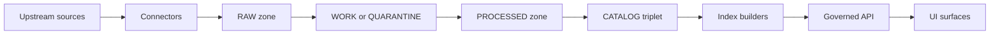

<!-- [KFM_META_BLOCK_V2]
doc_id: kfm://doc/<uuid>
title: "CONTRACT — <Contract Name>"
type: standard
version: v1
status: draft
owners: <team or names>
created: YYYY-MM-DD
updated: YYYY-MM-DD
policy_label: public|restricted|...
related:
  - kfm://dataset/<slug>@<version>
  - kfm://story/<id>@<version>
  - docs/contracts/<path-to-openapi-or-schema>
  - docs/policy/<path-to-policy>
tags:
  - kfm
  - contract
notes:
  - "<1–2 line intent>"
[/KFM_META_BLOCK_V2] -->

# CONTRACT — <Contract Name>

> **One-line purpose:** <What this contract guarantees and for whom>

**Status:** `<draft|review|published>` · **Owners:** `<team>` · **Policy label:** `<public|restricted|...>` · **Contract kind:** `<api|data|policy|pipeline|ui|subsystem>`

   

## Navigation

- [1. Purpose](#1-purpose)
- [2. Scope and non-goals](#2-scope-and-non-goals)
- [3. Contract statement](#3-contract-statement)
- [4. System context](#4-system-context)
- [5. Interfaces and artifacts](#5-interfaces-and-artifacts)
- [6. Policy and governance](#6-policy-and-governance)
- [7. Evidence, provenance, and audit](#7-evidence-provenance-and-audit)
- [8. Versioning and compatibility](#8-versioning-and-compatibility)
- [9. Validation and CI gates](#9-validation-and-ci-gates)
- [10. Observability and operations](#10-observability-and-operations)
- [11. Failure modes and rollback](#11-failure-modes-and-rollback)
- [12. Open questions](#12-open-questions)
- [13. Definition of Done](#13-definition-of-done)
- [14. Change log](#14-change-log)

---

## 1. Purpose

Describe why this contract exists and what problem it prevents.

- **Primary consumers:** <teams/systems/roles>
- **Primary producers:** <teams/systems/roles>
- **Motivating incident or risk:** <link to ADR/issue, or short description>

## 2. Scope and non-goals

### In scope

- <Bullet list of what is covered>

### Explicit non-goals

- <Bullet list of what is NOT covered>

> [!WARNING]
> Contracts are trust surfaces. If you are unsure about licensing, sensitivity, or policy posture, **default-deny** and escalate to governance review.

## 3. Contract statement

Write the contract in testable, normative language.

### 3.1 Guarantees (MUST)

- **MUST**: <Hard guarantee that can be tested>
- **MUST**: <Hard guarantee that can be tested>

### 3.2 Recommendations (SHOULD)

- **SHOULD**: <Strong recommendation>

### 3.3 Options (MAY)

- **MAY**: <Optional capability>

### 3.4 Out of bounds (MUST NOT)

- **MUST NOT**: <Forbidden behavior>

## 4. System context

### 4.1 Where this contract sits in KFM



### 4.2 Trust membrane boundaries

- **Allowed path:** UI/clients → **Governed API** → policy enforcement → storage/index.
- **Disallowed path:** UI/clients → direct database/storage.

Document how this contract prevents policy bypass.

## 5. Interfaces and artifacts

> Fill *only* the sections that apply for this contract kind.

### 5.1 Artifact registry

| Artifact | Path / Identifier | Owner | Notes |
|---|---|---|---|
| OpenAPI / API description | `<contracts/openapi/...>` | `<API team>` | `<versioned>` |
| JSON Schema / data schema | `<contracts/schemas/...>` | `<Data team>` | `<validation>` |
| Policy (OPA/Rego) | `<policy/...>` | `<Policy team>` | `<default-deny>` |
| Dataset spec (spec_hash input) | `<data/registry/...>` | `<Steward>` | `<canonical>` |
| Run receipts / audit | `<data/catalog/prov/...>` | `<Platform>` | `<reproducible>` |

### 5.2 API contract

#### 5.2.1 Endpoints

| Method | Path | Purpose | AuthZ posture | Evidence behavior |
|---|---|---|---|---|
| GET | `/api/v1/<...>` | `<...>` | `<hide restricted; filter by role>` | `<returns EvidenceRefs?>` |
| POST | `/api/v1/evidence/resolve` | Resolve EvidenceRef → EvidenceBundle | **Fail closed** if unauthorized/unresolvable | `<bundle fields>` |

#### 5.2.2 Request/response schemas

- Request schema: `<link/path>`
- Response schema: `<link/path>`

#### 5.2.3 Error model

| HTTP | error_code | Meaning | Client action |
|---|---|---|---|
| 400 | `bad_request` | Invalid params | Fix request |
| 403 | `forbidden` | Policy denies access | Hide UI affordance |
| 404 | `not_found` | Not found or not visible by policy | Treat as missing |
| 409 | `conflict` | Version conflict / optimistic lock | Retry with latest |
| 422 | `unprocessable` | Schema validates but violates contract | Fix payload |
| 500 | `internal` | Unexpected error | Retry w/ backoff |

### 5.3 Data contract

#### 5.3.1 Data products

| Product | Zone | Format | Partitioning | Primary keys | Notes |
|---|---|---|---|---|---|
| `<events.parquet>` | PROCESSED | GeoParquet | `<time, county, ...>` | `<id>` | `<...>` |
| `<tiles.pmtiles>` | PUBLISHED | PMTiles | `<z/x/y>` | `<tile id>` | `<policy-safe>` |

#### 5.3.2 Required metadata surfaces

- DCAT: dataset-level metadata (license, publisher, distributions)
- STAC: asset-level metadata (collections, items, assets)
- PROV: lineage (entities, activities, agents)

### 5.4 Policy contract

#### 5.4.1 Labels and obligations

| policy_label | Meaning | Example obligations |
|---|---|---|
| `public` | Visible to all | attribution |
| `restricted` | Role-gated | redact fields; generalize geometry |

#### 5.4.2 Enforcement points

- **PEP:** governed API routes
- **Evidence resolver:** bundles must reflect decisions + obligations
- **Index builders:** precompute only policy-safe derivatives

### 5.5 Pipeline contract

#### 5.5.1 Determinism

- Canonicalize → hash → diff.
- Identical inputs should yield identical outputs **or** the pipeline records why.

#### 5.5.2 Promotion posture

Promotion to runtime surfaces is blocked unless required artifacts exist and validate.

## 6. Policy and governance

### 6.1 Licensing and rights

- Source license: `<SPDX or terms>`
- Attribution requirements: `<...>`
- Redistribution constraints: `<...>`

### 6.2 Sensitivity and redaction plan

- PII risk: `<none|low|med|high>`
- Sensitive location risk (archaeology/species/etc.): `<none|low|med|high>`
- Redaction/generalization method: `<...>`

> [!NOTE]
> If you cannot justify that an output is safe to publish, keep it in WORK/QUARANTINE and publish only generalized derivatives.

### 6.3 Governance review triggers

- [ ] New dataset family
- [ ] New `policy_label` category
- [ ] Any expansion of access surface (new endpoints, new exports)
- [ ] Any change that could reveal precise sensitive locations

## 7. Evidence, provenance, and audit

### 7.1 Evidence resolver expectations

- Evidence resolution accepts an EvidenceRef (or structured reference), applies policy, and returns an EvidenceBundle.
- UI should be able to display trust context (version, license, policy) with minimal round-trips.

### 7.2 Evidence bundle shape (example)

```json
{
  "bundle_id": "sha256:<bundle>",
  "dataset_version_id": "<dataset_version>",
  "title": "<human title>",
  "policy": {
    "decision": "allow|deny",
    "policy_label": "public|restricted",
    "obligations_applied": []
  },
  "license": {"spdx": "<SPDX>", "attribution": "<text>"},
  "provenance": {"run_id": "kfm://run/<id>"},
  "artifacts": [{"href": "<path>", "digest": "sha256:<...>", "media_type": "<mime>"}],
  "checks": {"catalog_valid": true, "links_ok": true},
  "audit_ref": "kfm://audit/entry/<id>"
}
```

### 7.3 Run receipts and audit ledger

- Run receipts: `<where stored>`
- Provenance exports (PROV): `<where stored>`
- Commit SHAs captured: `<yes/no>`

## 8. Versioning and compatibility

### 8.1 Versioning scheme

- Contract version: `<v1|v2|...>`
- Compatibility promise: `<backward compatible within v1>`

> [!TIP]
> Prefer *additive* changes (new optional fields, new endpoints) over breaking changes.

### 8.2 Breaking change procedure

1. Declare breaking intent + rationale.
2. Provide migration steps and rollback plan.
3. Update contract tests and golden queries.
4. Announce deprecation window.

## 9. Validation and CI gates

### 9.1 Required checks

| Gate | What it blocks | Evidence artifact |
|---|---|---|
| Identity & versioning | Unstable IDs / missing digests | spec_hash + digests |
| Licensing & rights | Unknown/forbidden license | terms snapshot |
| Sensitivity & redaction | Unsafe disclosure | policy label + plan |
| Catalog triplet validation | Broken interoperability | DCAT + STAC + PROV |
| Run receipt & checksums | Non-reproducible runs | run receipt + checksums |
| Policy & contract tests | Policy bypass / drift | policy tests + contract tests |

### 9.2 Minimum verification steps

- [ ] Validate schemas locally (commands):
  - `TODO: add repo command`
- [ ] Run policy tests:
  - `TODO: add repo command`
- [ ] Run contract tests / e2e:
  - `TODO: add repo command`

## 10. Observability and operations

### 10.1 SLOs / performance budgets

| Surface | Target | Measurement |
|---|---|---|
| Evidence resolve latency | `<p95 ms>` | `<metrics>` |
| Tile request latency | `<p95 ms>` | `<metrics>` |
| Pipeline run time | `<...>` | `<receipts>` |

### 10.2 Logging and audit

- Audit events emitted: `<list>`
- Correlation IDs: `<format>`
- Sensitive fields handling: `<redact in logs>`

## 11. Failure modes and rollback

### 11.1 Known failure modes

| Failure | Detection | Blast radius | Mitigation |
|---|---|---|---|
| Policy denies unexpectedly | `<policy test>` | `<...>` | `<fix policy; publish safe fallback>` |
| Non-resolvable citations | `<lint>` | `<story publish blocked>` | `<repair EvidenceRefs>` |
| Catalog validation fails | `<validator>` | `<no promotion>` | `<fix metadata>` |

### 11.2 Rollback

- Rollback unit: `<dataset_version_id / API version / deploy>`
- Rollback trigger: `<...>`
- Rollback steps: `<...>`

## 12. Open questions

- [ ] <Question>
- [ ] <Question>

## 13. Definition of Done

- [ ] MetaBlock complete (doc_id stable; updated refreshed)
- [ ] Contract statement includes MUST/SHOULD/MUST NOT clauses
- [ ] All artifacts linked (schemas, OpenAPI, policy, specs)
- [ ] Validation steps are repeatable
- [ ] Governance/sensitivity handling explicitly stated
- [ ] CI gates identified and (where possible) automated

## 14. Change log

| Date | Version | Change | Author |
|---|---|---|---|
| YYYY-MM-DD | v1 | Initial draft | <name> |
