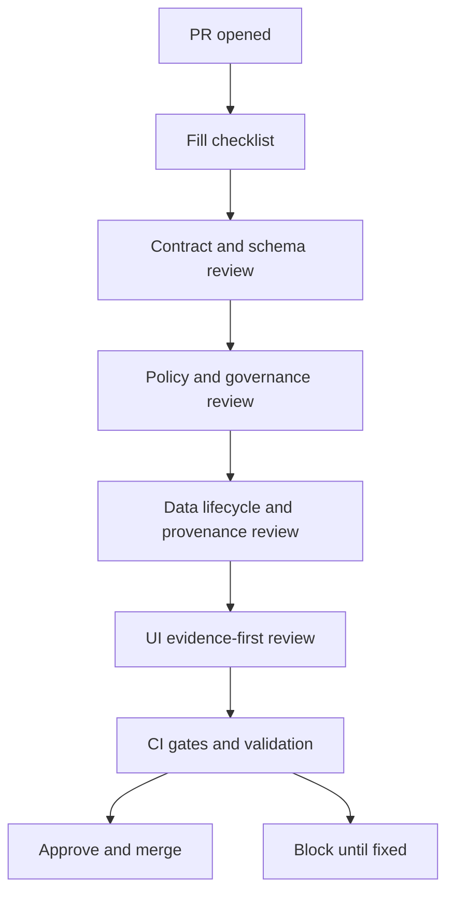

<!-- [KFM_META_BLOCK_V2]
doc_id: kfm://doc/7d36d089-c5fb-4d81-929b-066f3bbd091f
title: Architecture Review Checklist Template
type: standard
version: v1
status: draft
owners: KFM Architecture Maintainers
created: 2026-03-01
updated: 2026-03-01
policy_label: public
related:
  - docs/architecture/
  - docs/governance/REVIEW_GATES.md
tags:
  - kfm
  - architecture
  - governance
  - template
notes:
  - Template intended to be copied into PRs/ADRs and checked into docs/architecture/templates/.
[/KFM_META_BLOCK_V2] -->

# Architecture Review Checklist
One template to review **architecture-impacting** changes against KFM’s non‑negotiables (truth path + trust membrane) and to keep every decision evidence-bound.

   

> **Use this when:** a PR changes data lifecycle, provenance/evidence, policy, APIs/contracts, storage/indexing, or Map/Story/Focus behavior.
>
> **How to use:** copy this file into the PR description (or into an ADR) and check items off. Keep the filled checklist as an auditable artifact.

---

## Navigation
- [Review metadata](#review-metadata)
- [Change summary](#change-summary)
- [Required artifacts](#required-artifacts)
- [Non-negotiable invariants](#non-negotiable-invariants)
- [Architecture correctness](#architecture-correctness)
- [Governance, safety, and sensitivity](#governance-safety-and-sensitivity)
- [Validation and CI gates](#validation-and-ci-gates)
- [Reversibility and rollback](#reversibility-and-rollback)
- [Decision](#decision)
- [Appendix: review flow](#appendix-review-flow)
- [Appendix: evidence reference patterns](#appendix-evidence-reference-patterns)

---

## Review metadata

| Field | Value |
|---|---|
| PR / Change ID | <!-- e.g., #123 or kfm://change/... --> |
| Date (YYYY-MM-DD) |  |
| Review type | ☐ Architecture ☐ Data/Pipeline ☐ API/Contract ☐ Policy ☐ UI/UX ☐ Infra/SRE ☐ Security |
| Risk rating | ☐ Low ☐ Medium ☐ High |
| Reviewers | <!-- name + role --> |
| Approvers required | <!-- see “Approval matrix” below --> |
| Affected subsystems | <!-- e.g., ingest, catalog, evidence, policy, api, ui, indexers --> |
| Rollout strategy | ☐ Behind flag ☐ Progressive ☐ Big-bang (justify) |
| Rollback plan exists | ☐ Yes ☐ No (block) |

---

## Change summary

### What changed (1–5 bullets)
- 
- 
- 

### Why (goal + user impact)
- 

### What did *not* change (explicit non-goals)
- 

### Evidence & traceability (links)
- Design/ADR: 
- Diagrams: 
- Contract diffs (OpenAPI/JSON Schema): 
- Policy diffs (Rego): 
- Data examples / fixtures: 
- Receipts / audit artifacts: 
- Benchmarks / perf notes: 
- Focus Mode eval runs (if applicable): 

---

## Required artifacts

> **Rule:** If a claim affects behavior, governance posture, access control, or user-facing narratives, it must be traceable to evidence or an explicit policy decision.

### Design artifacts
- [ ] Architecture delta is documented (ADR or design note) and linked above.
- [ ] Affected interfaces/contracts are enumerated (API endpoints, schemas, EvidenceRef schemes, etc.).
- [ ] Risk register updated **or** risks/mitigations captured in the PR.

### Data & pipeline artifacts (if data lifecycle touched)
- [ ] Dataset identity and versioning strategy described (what makes a new DatasetVersion?).
- [ ] Promotion gates documented (what must pass to go RAW→WORK→PROCESSED→CATALOG→PUBLISHED?).
- [ ] Receipts (run/audit records) emitted and reproducible from inputs + code version.
- [ ] Catalog outputs updated/validated (DCAT/STAC/PROV as applicable).

### Policy artifacts (if policy touched)
- [ ] Policy label impact is described (public/restricted/etc.).
- [ ] Default-deny behavior confirmed for unknown or ambiguous cases.
- [ ] Obligations (redaction/generalization/logging) are explicit and test-covered.

### UI/UX artifacts (if UI touched)
- [ ] Evidence-first UX still works end-to-end (evidence drawer/panel shows license, version, policy, provenance, checksums).
- [ ] Keyboard navigation + accessibility checks considered (at minimum: tab order, ARIA labels for controls).
- [ ] “Explainability” text updated where users might misinterpret results.

### Focus Mode artifacts (if Focus Mode touched)
- [ ] Cite-or-abstain behavior unchanged or improved (no uncited assertions).
- [ ] Evaluation harness run; “golden queries” show no regressions.
- [ ] Policy pre-checks enforced before evidence selection.

---

## Non-negotiable invariants

> **Blocker:** Any unchecked item below requires a design revision or explicit exception approved by maintainers.

### Trust membrane
- [ ] Frontend and external clients **do not** access databases or object storage directly.
- [ ] Core backend logic **does not** bypass repository interfaces to reach storage directly.
- [ ] All access flows through governed APIs (policy enforcement, redaction, logging consistently applied).
- [ ] Tests (or static analysis) exist to prevent accidental bypass.

### Truth path and promotion gates
- [ ] Data follows the canonical lifecycle ordering (Upstream → RAW → WORK → PROCESSED → CATALOG → PUBLISHED).
- [ ] RAW artifacts are immutable (no in-place mutation; new versions create new artifacts).
- [ ] Promotion requires, at minimum: identity + schema + extents + license/rights + validation results + provenance + checksums + audit record.
- [ ] Canonical stores are treated as source of truth; DB/search indexes are rebuildable projections.

### Evidence-first UX and citations
- [ ] Every user-facing layer/story claim links to resolvable evidence (dataset version + license + provenance + digests).
- [ ] EvidenceRefs resolve deterministically (bounded calls; no “best effort” guessing).
- [ ] Broken or non-resolvable citations are treated as a **hard failure** for publish workflows.

### Deterministic identity and hashing
- [ ] Dataset spec inputs are canonicalized before hashing (avoid “hash drift”).
- [ ] spec_hash changes only when the canonical spec meaningfully changes.
- [ ] Artifact addressing is digest-based (sha256 or equivalent), not mutable filenames.

---

## Architecture correctness

### Layering and boundaries
- [ ] Change respects layering: **Domain → Use cases → Interfaces (contracts/policy/adapters) → Infrastructure**.
- [ ] UI/clients call governed APIs only (no direct DB/storage clients).
- [ ] Core logic uses repositories/ports; infrastructure details are behind adapters.

### Interfaces and contracts
- [ ] OpenAPI/contract diffs are reviewed and versioning rules followed.
- [ ] Error model is consistent (no silent 200 + embedded error blobs).
- [ ] Backward compatibility impact is documented (or breaking change is gated with version bump).

### Data & geospatial correctness (if applicable)
- [ ] CRS choices are explicit; transformations documented; no silent reprojection.
- [ ] Geometry validity and extents checks exist.
- [ ] Derived layers include “data limitations” and methodology references.

### Security and operations
- [ ] AuthN/AuthZ changes reviewed (RBAC, OIDC/OAuth scopes as applicable).
- [ ] Secrets are not stored in repo; secret access paths are documented.
- [ ] Audit logging preserved for governed endpoints and promotion actions.

### Observability
- [ ] Key actions emit structured logs with correlation IDs.
- [ ] Metrics and dashboards updated if SLO/SLA relevant.
- [ ] Alerts updated for new failure modes (policy deny spikes, catalog validator failures, etc.).

---

## Governance, safety, and sensitivity

> **Default-deny:** if sensitivity is unclear, redact/generalize and require governance review.

### Licensing and rights
- [ ] License and rights-holder captured for all new/changed datasets.
- [ ] Promotion is blocked when rights metadata is missing or ambiguous.
- [ ] Derivatives inherit and document upstream obligations.

### Sensitive locations / community constraints
- [ ] If data could enable targeting (archaeology, species, critical infrastructure), exact coordinates are not exposed publicly.
- [ ] Public outputs use generalized derivatives (coarser geometry, aggregation, k-anonymity) where appropriate.
- [ ] Redaction/generalization rules are test-covered.

### Narrative safety (Map/Story)
- [ ] Avoids sensationalization; claims are framed with uncertainty and methodology.
- [ ] “Signals, not verdicts” language used where appropriate.
- [ ] Clear “limitations” text included for decision-support layers.

---

## Validation and CI gates

### Minimum gates (must be green)
- [ ] Unit + integration tests pass.
- [ ] Policy tests pass (OPA/Rego/conftest or equivalent).
- [ ] Schema validators pass (DCAT/STAC/PROV + cross-link integrity).
- [ ] Contract tests pass (OpenAPI diff checks, client SDK compatibility if applicable).
- [ ] Lint/format checks pass (code + docs + markdown).
- [ ] Link checker passes for docs touched.

### Evidence and publishing gates (if publishable outputs touched)
- [ ] Evidence resolver resolves all referenced EvidenceRefs in fixtures.
- [ ] Story publish gate enforced: review_state present + resolvable citations.
- [ ] Dataset promotion gate enforced: receipts + checksums + provenance present.

### Focus Mode gates (if applicable)
- [ ] Evaluation harness run and attached.
- [ ] Golden query diffs reviewed; merge blocked on regressions.
- [ ] Cite-or-abstain enforced in tests.

---

## Reversibility and rollback

- [ ] Change is buildable in small increments (no “all at once” mega-PR).
- [ ] Rollback strategy documented (feature flag, config toggle, revert plan).
- [ ] Migrations are reversible (or have a safe forward-only plan + backups).
- [ ] Data transforms are idempotent; reruns do not mutate prior artifacts.
- [ ] Backfills/rebuilds have cost estimates and safety limits.

---

## Approval matrix

| Change touches… | Required reviewers |
|---|---|
| Policy / redaction / obligations | ☐ Governance steward ☐ Security |
| Dataset registry / spec_hash / promotion gates | ☐ Data steward ☐ Pipeline maintainer |
| STAC/DCAT/PROV schemas or validators | ☐ Catalog maintainer |
| Governed API contracts | ☐ API maintainer ☐ Security |
| UI evidence surfaces (EvidenceDrawer/Story) | ☐ UI maintainer ☐ Governance steward |
| Infra / K8s / networking | ☐ Platform/SRE ☐ Security |
| Focus Mode answer rules / eval harness | ☐ Focus maintainer ☐ Governance steward |

---

## Decision

- Decision: ☐ Approve ☐ Approve with follow-ups ☐ Request changes ☐ Block
- Rationale (short):
  - 
- Required follow-ups (tracked as issues):
  - [ ] 
  - [ ] 

---

## Appendix: review flow

---

## Appendix: evidence reference patterns

> Use explicit evidence schemes so resolution is deterministic and auditable.

- `dcat://...` — dataset metadata (rights, distributions)
- `stac://...` — asset metadata (items/collections, spatial/temporal extents)
- `prov://...` — lineage/run receipts (entities/activities/agents)
- `doc://...` — documentation (ADRs, methodology notes)
- `graph://...` — graph assertions/derived relationships (if applicable)

**Checklist reminder:** if an EvidenceRef cannot be resolved in bounded calls, **abstain** (do not guess).

---

Appendix: reviewer notes (free-form)

- 

<a href="#architecture-review-checklist">Back to top ↑</a>
# Review Checklist
