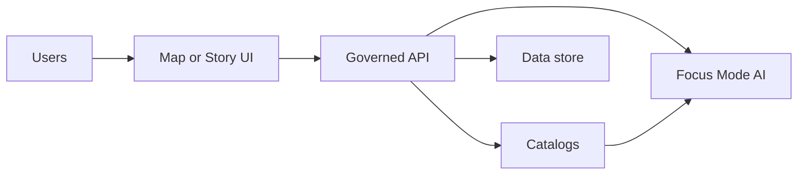
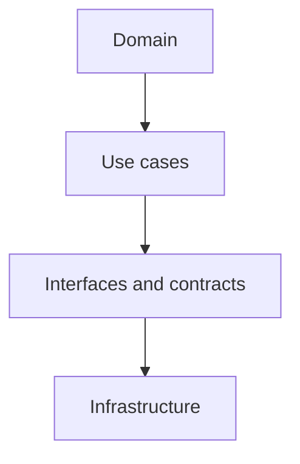
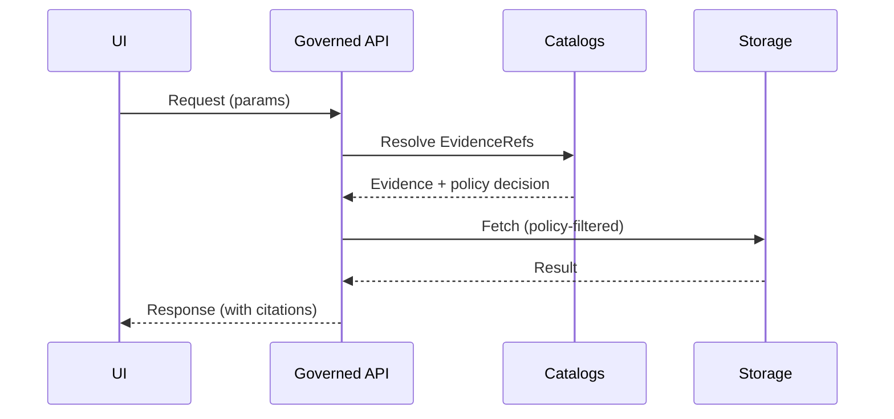

<!-- [KFM_META_BLOCK_V2]
doc_id: kfm://doc/<uuid>
title: TEMPLATE — <Document Title>
type: standard
version: v1
status: draft
owners: <team or names>
created: YYYY-MM-DD
updated: YYYY-MM-DD
policy_label: public|restricted|...
related:
  - <kfm://dataset/<slug>@<version>>
  - <kfm://story/<uuid>@<version>>
tags: [kfm, template, architecture]
notes:
  - Copy this template to create a new Standard doc.
  - doc_id must be stable (do not regenerate); updated should change on meaningful edits.
[/KFM_META_BLOCK_V2] -->

<a id="top"></a>

# <Document Title>

> <One-line purpose statement. Keep this crisp.>


<!--
TEMPLATE NOTES
- Replace all <...> placeholders.
- Keep “Purpose / Scope / DoD” scannable.
- Delete this comment block before publishing.
-->

## Quick navigation

- [Overview](#overview)
- [Directory layout](#directory-layout)
- [Context](#context)
- [Diagrams](#diagrams)
- [Architecture](#architecture)
- [Interfaces and contracts](#interfaces-and-contracts)
- [Data and metadata](#data-and-metadata)
- [Security and policy](#security-and-policy)
- [Evidence and traceability](#evidence-and-traceability)
- [Risks and tradeoffs](#risks-and-tradeoffs)
- [Validation and CI](#validation-and-ci)
- [Operations](#operations)
- [Open questions](#open-questions)
- [Version history](#version-history)

---

## Overview

### Purpose

<Why does this document exist? What decision, design, or operational behavior does it govern?>

### Scope

<What is explicitly in-scope?>

### Non-goals

<What is explicitly out-of-scope?>

### Audience

Primary: <...>  
Secondary: <...>

### Definitions

- Glossary: `docs/glossary.md` (if present)
- Terms used in this doc:
  - **Catalogs**: STAC (assets), DCAT (dataset/distribution discovery), PROV (lineage).
  - **Contract artifact**: Machine-validated interface spec (e.g., JSON Schema, OpenAPI).
  - **Evidence artifact**: Derived data product registered in catalogs before being used in UI/narrative.
  - **Story Node**: Governed narrative artifact that is machine-ingestible and provenance-linked.
  - **Focus Mode**: Story Node experience constrained by evidence (cite-or-abstain).
  - **Contract-first**: Contracts are first-class artifacts; changes require compatibility/version checks.
  - **Deterministic pipeline**: Idempotent, config-driven transforms that produce reproducible outputs.

> TIP: If this doc introduces a new term, add it to the glossary and link it here.

### Key artifacts this doc points to

| Artifact | Path / Identifier | Owner | Notes |
|---|---|---|---|
| <Artifact name> | `<path>` or `kfm://...` | <team> | <why it matters> |
| <Artifact name> | `<path>` or `kfm://...` | <team> | <why it matters> |

### Definition of done

- [ ] MetaBlock v2 header is present, filled, and correct (**doc_id stable; updated current**).
- [ ] Sections follow this template (no missing required sections).
- [ ] Every normative claim has a citation (EvidenceRef) or is explicitly marked **Proposed**/**Unknown**.
- [ ] Links are valid (relative links preferred).
- [ ] At least one architecture diagram is included (and matches the text).
- [ ] Policy / sensitivity considerations are documented (`policy_label` + obligations).
- [ ] Reviewed by <role/team> if `policy_label != public` or if sensitive locations/media are involved.

---

## Directory layout

### This document

- Canonical path: `<docs/architecture/.../<DOC>.md>`
- “Home” subsystem: `<one subsystem only>`
- Related build artifacts: `<schemas/>`, `<contracts/>`, `<data/catalog/>`, `<data/prov/>`

### Related repository paths

| Path | What lives here | Notes |
|---|---|---|
| `docs/architecture/` | Architecture blueprints, subsystem contracts, ADRs | <...> |
| `docs/governance/` | Governance + ethics + sovereignty | <...> |
| `contracts/` | Versioned schemas and API contracts | <...> |
| `data/catalog/` | DCAT / STAC catalog roots | <...> |
| `data/prov/` | PROV run receipts / lineage bundles | <...> |

---

## Context

### Problem statement

<What problem are we solving? Include constraints like policy, rights, time, budget, performance.>

### Drivers

- <driver 1>
- <driver 2>

### Key invariants

List the “must not regress” rules. These should be enforceable by tests.

- [ ] UI/clients never hit databases directly; all access goes through governed APIs + policy boundary.
- [ ] Core logic never bypasses repositories to reach storage.
- [ ] CI gates fail closed.
- [ ] Every user-facing claim is traceable to evidence + policy decisions.

### Assumptions

| Assumption | Why we believe it | Impact if wrong | Minimum verification step |
|---|---|---|---|
| <assumption> | <evidence or rationale> | <impact> | <how to verify> |

---

## Diagrams

### System context



### Architecture layering



> NOTE: Keep diagrams simple and consistent with the text. Prefer one “overview” diagram plus 1–2 “deep dive” diagrams.

---

## Architecture

### Summary

<One paragraph overview of the architecture and the key decisions.>

### Component inventory

| Component | Responsibility | Inputs | Outputs | Contract surface |
|---|---|---|---|---|
| <name> | <...> | <...> | <...> | <schema/openapi/...> |
| <name> | <...> | <...> | <...> | <schema/openapi/...> |

### Key flows

#### Flow: <name>

1. <step>
2. <step>
3. <step>



---

## Interfaces and contracts

### Contract artifacts

| Contract | Location | Versioning rule | Compatibility notes |
|---|---|---|---|
| <OpenAPI spec> | `contracts/api/<...>.yaml` | <semver?> | <...> |
| <JSON schema> | `contracts/schemas/<...>.json` | <...> | <...> |

### Error model

Document a consistent error shape:

```json
{
  "error": {
    "code": "<MACHINE_CODE>",
    "message": "<human-readable>",
    "request_id": "<id>",
    "policy": {
      "decision": "deny|allow",
      "reason_codes": ["..."],
      "obligations": []
    }
  }
}
```

---

## Data and metadata

### Data lifecycle zones

<Describe Raw → Work/Quarantine → Processed → Published for the data touched by this design.>

### Catalogs and provenance

KFM treats catalogs as **contract surfaces**. Minimum expectation:

- **DCAT**: dataset-level metadata and distributions
- **STAC**: spatiotemporal extents and assets
- **PROV**: lineage (inputs, tools, parameters → outputs)

### EvidenceRef scheme

Use these schemes consistently in citations and registers:

| Scheme | Meaning | Example |
|---|---|---|
| `dcat://` | Dataset/distribution metadata | `dcat://<dataset>@<version>` |
| `stac://` | Collection/item/asset metadata | `stac://<collection>/items/<id>` |
| `prov://` | Run lineage | `prov://run/<run_id>` |
| `doc://` | Governed document / span ref | `doc://sha256:<...>#page=12&span=10:80` |
| `graph://` | Entity relations | `graph://<entity>/<id>` |

### Data schema and validation rules

| Rule | Where enforced | Threshold | Evidence |
|---|---|---|---|
| <rule name> | <pipeline step / CI job> | <e.g. 1.0> | `[CITATION: prov://...]` |

---

## Security and policy

### Policy label + obligations

- Document `policy_label` (`public|restricted|...`) and how it affects visibility.
- Enumerate “obligations” that must be applied when returning data (e.g., generalize geometry).

### Threat model (minimal)

| Threat | Example | Mitigation | Residual risk |
|---|---|---|---|
| Prompt injection | <...> | <...> | <...> |
| Data exfiltration | <...> | <...> | <...> |

---

## Evidence and traceability

### Evidence register

| ID | EvidenceRef | What it supports | Policy considerations | Notes |
|---|---|---|---|---|
| E-001 | `dcat://...` | <...> | <...> | <...> |
| E-002 | `prov://...` | <...> | <...> | <...> |

### Claim register

Every claim should be one of: **Confirmed**, **Proposed**, **Unknown**.

| Claim ID | Claim | Status | EvidenceRef(s) | Minimum verification steps |
|---|---|---|---|---|
| C-001 | <claim text> | Confirmed | `prov://...` | <how to reproduce> |
| C-002 | <claim text> | Proposed | <none> | <what to test> |
| C-003 | <claim text> | Unknown | <none> | <what artifact is missing> |

### Citation style

Use inline citations in the body:

- Example (catalog): `<statement> [CITATION: dcat://...]`
- Example (lineage): `<statement> [CITATION: prov://...]`
- Example (doc span): `<statement> [CITATION: doc://sha256:...#page=12&span=10:80]`

---

## Risks and tradeoffs

### Risks

| Risk | Likelihood | Impact | Mitigation | Owner |
|---|---|---|---|---|
| <risk> | <L/M/H> | <L/M/H> | <mitigation> | <team> |

### Tradeoffs

- **We chose <X> over <Y> because…**
- Costs: <...>
- Benefits: <...>
- What gets harder later: <...>

### Alternatives considered

| Option | Pros | Cons | Decision |
|---|---|---|---|
| A | <...> | <...> | rejected |
| B | <...> | <...> | chosen |

---

## Validation and CI

### Checks (automate where possible)

- [ ] Schema validation passes
- [ ] Link checker passes
- [ ] Policy tests pass (default deny; fixtures)
- [ ] Reproducibility: run receipt emitted with **git commit** + **container digest**

### Acceptance tests

| Test | How to run | Expected result | Evidence |
|---|---|---|---|
| <test> | `<command>` | <...> | `prov://...` |

---

## Operations

### Observability

What we measure, log, and alert on:

- Metrics: <...>
- Logs: <...>
- Traces: <...>
- Audit events: <...>

### Rollout and rollback plan

1. <rollout step>
2. <rollback step>

---

## Open questions

- Q1: <...>
- Q2: <...>

---

## Appendix

<details>
<summary>Appendix A — Templates you may want to link</summary>

- Universal doc template: `docs/templates/TEMPLATE__KFM_UNIVERSAL_DOC.md`
- Story Node template: `docs/templates/TEMPLATE__STORY_NODE_V3.md`
- API contract extension template: `docs/templates/TEMPLATE__API_CONTRACT_EXTENSION.md`

</details>

---

## Version history

| Version | Date | Summary of changes | Author |
|---|---|---|---|
| v1 | YYYY-MM-DD | Initial draft | <name> |

[Back to top](#top)
