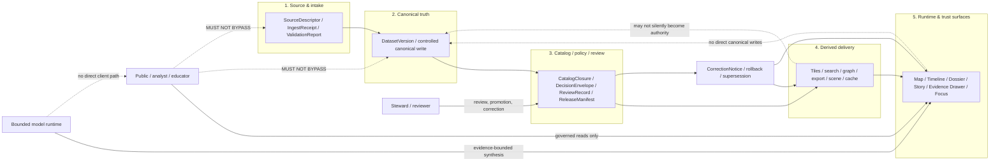

<!-- [KFM_META_BLOCK_V2]
doc_id: kfm://doc/NEEDS-VERIFICATION
title: KFM Threat Model
type: standard
version: v1
status: draft
owners: NEEDS VERIFICATION
created: YYYY-MM-DD
updated: YYYY-MM-DD
policy_label: NEEDS VERIFICATION
related: [../../../README.md, ../../../policy/README.md, ../../../contracts/README.md, ../../../schemas/README.md, ../../../tests/README.md, ../../../tools/README.md, ../../../scripts/README.md, ../../reports/readme-structure-reconciliation.md]
tags: [kfm, architecture, security, threat-model]
notes: [source-bounded draft, current-session repo tree not directly mounted, owners and dates need verification]
[/KFM_META_BLOCK_V2] -->

# KFM Threat Model

Threat-model guidance for Kansas Frontier Matrix as a governed spatial evidence system, where trust, evidence, policy, and correction are treated as first-class security concerns.

| Field | Value |
|---|---|
| **Status** | experimental |
| **Owners** | **NEEDS VERIFICATION** |
| **Path** | `docs/architecture/threat-model/README.md` |
| **Doc posture** | **CONFIRMED doctrine** · **INFERRED review structure** · **PROPOSED implementation guidance** · **UNKNOWN mounted implementation depth** |
| **Baseline** | March 2026 attached KFM corpus; current-session repo/workspace implementation depth remains **NEEDS VERIFICATION** |
| **Quick jumps** | [Scope](#scope) · [Repo fit](#repo-fit) · [Inputs](#inputs) · [Quickstart](#quickstart) · [Usage](#usage) · [Diagram](#diagram) · [Tables](#tables) · [Task list](#task-list) · [FAQ](#faq) · [Appendix](#appendix) |


> [!IMPORTANT]
> This README is intentionally **source-bounded**. It is grounded in the attached March 2026 KFM doctrine and attached project artifacts. Exact repo topology, live schemas, workflow YAML, deployment manifests, dashboards, and runtime behavior remain **UNKNOWN** unless directly reverified.

> [!NOTE]
> In KFM, a **threat** is broader than hostile access. It also includes membrane bypass, authority inversion, uncited runtime output, publication without closure, hidden correction, sensitivity leakage, and broken audit reconstruction.

## Scope

This README defines how to reason about threats in KFM **without collapsing security into infrastructure-only concerns**.

KFM’s public promise is not “always answer” or “always render.” It is “only publish, serve, or synthesize from admissible released support, and fail closed when the trust conditions are not met.”

### What this README is for

Use this file to:

- frame threat reviews for lanes, routes, shells, exports, projection workers, and model-enabled features
- identify trust-bearing assets, boundaries, and failure modes before implementation
- map threats to proof objects, surface behavior, negative-path tests, and review obligations
- keep security review tied to **evidence flow**, **policy results**, **release state**, and **visible correction**

### What this README is not

This file is **not**:

- a substitute for executable policy bundles
- a substitute for contracts, schemas, fixtures, or validators
- proof that the repo already implements the controls described here
- a production runbook
- a complete incident-response manual

[Back to top](#kfm-threat-model)

## Repo fit

**Path:** `docs/architecture/threat-model/README.md`

**Upstream context:**  
[`../../../README.md`](../../../README.md) ·
[`../../../policy/README.md`](../../../policy/README.md) ·
[`../../../contracts/README.md`](../../../contracts/README.md) ·
[`../../../schemas/README.md`](../../../schemas/README.md)

**Downstream and adjacent review surfaces:**  
[`../../../tests/README.md`](../../../tests/README.md) ·
[`../../../tools/README.md`](../../../tools/README.md) ·
[`../../../scripts/README.md`](../../../scripts/README.md) ·
[`../../reports/readme-structure-reconciliation.md`](../../reports/readme-structure-reconciliation.md)

## Inputs

This directory should accept threat-model material tied to:

- KFM doctrine and invariants
- trust boundaries and route-family obligations
- contract families and proof objects
- policy reason/obligation/surface-state grammars
- public-safe versus non-public-safe behavior
- runtime outcomes and trust-visible shell states
- release, correction, rollback, and stale-visible behavior
- verification findings, negative-path tests, and unresolved security unknowns

## Exclusions

The following do **not** belong here as their primary home:

- canonical schema definitions → `contracts/` and `schemas/`
- policy bundle implementation and registries → `policy/`
- executable tests and fixtures → `tests/`
- validators, CLIs, and wrappers → `tools/` and `scripts/`
- broad documentation reconciliation work → `docs/reports/`
- operational runbooks as the sole source of truth → keep them in runbook docs, then link them here

## Directory tree

```text
docs/
└── architecture/
    └── threat-model/
        └── README.md
```

> [!NOTE]
> Adjacent files inside `docs/architecture/threat-model/` were **not directly visible** in the current session. Update this tree only after repo verification.

## Quickstart

1. Start with a **lane**, **surface**, **route family**, or **feature**.
2. Identify which KFM planes it touches and what it must **not** bypass.
3. List the trust-bearing assets and the failure modes that would invalidate outward use.
4. Map each threat to required controls, proof artifacts, and negative-path tests.
5. Keep every implementation statement marked honestly as **CONFIRMED**, **INFERRED**, **PROPOSED**, **UNKNOWN**, or **NEEDS VERIFICATION**.
6. Do not close review until at least one **real proof object** or **negative-path sample** exists.

### Minimal review seed

```yaml
threat_review:
  lane: hydrology
  surface: Focus
  route_family: evidence-resolution
  affected_planes:
    - source-and-intake
    - canonical-truth
    - catalog-policy-review
    - derived-delivery
    - runtime-trust-surfaces
  required_artifacts:
    - SourceDescriptor
    - DatasetVersion
    - CatalogClosure
    - DecisionEnvelope
    - EvidenceBundle
    - RuntimeResponseEnvelope
    - ReleaseManifest
  required_negative_paths:
    - abstain
    - deny
    - stale-visible
    - generalized
    - withdrawn
```

## Usage

Use this README when a proposal could change:

- what a public or steward-facing surface can say
- how evidence is resolved, cited, or withheld
- how a derived layer could drift from promoted scope
- how rights, sensitivity, or exact-location handling is enforced
- how correction, rollback, or stale-state behavior becomes visible
- how a model runtime or automation path is allowed to act

### Threat model at a glance

KFM security posture is not “protect a database and a website.”  
It is “protect a governed path from source intake through published claim, while keeping failure, uncertainty, and correction visible.”

A KFM-safe design therefore preserves all of the following at once:

- the canonical truth path
- the trust membrane
- the authoritative-versus-derived split
- evidence-bounded runtime behavior
- visible negative outcomes
- visible correction lineage
- separation of duty for policy-significant release actions

### How to read the labels

| Label | Meaning here |
|---|---|
| **CONFIRMED** | Directly supported by the attached March 2026 KFM corpus. |
| **INFERRED** | Conservative structural completion strongly implied by repeated corpus patterns. |
| **PROPOSED** | Recommended packaging or implementation guidance not yet proven as mounted repo reality. |
| **UNKNOWN** | Not directly verified in the current session. |
| **NEEDS VERIFICATION** | Explicit placeholder retained until repo or organizational evidence is surfaced. |

[Back to top](#kfm-threat-model)

## Diagram


```mermaid
flowchart LR
    subgraph P1["1. Source & intake"]
        A["SourceDescriptor / IngestReceipt / ValidationReport"]
    end

    subgraph P2["2. Canonical truth"]
        B["DatasetVersion / controlled canonical write"]
    end

    subgraph P3["3. Catalog / policy / review"]
        C["CatalogClosure / DecisionEnvelope / ReviewRecord / ReleaseManifest"]
    end

    subgraph P4["4. Derived delivery"]
        D["Tiles / search / graph / export / scene / cache"]
    end

    subgraph P5["5. Runtime & trust surfaces"]
        E["Map / Timeline / Dossier / Story / Evidence Drawer / Focus"]
    end

    A --> B --> C --> D --> E

    C --> F["CorrectionNotice / rollback / supersession"]
    F --> D
    F --> E

    U["Public / analyst / educator"] -->|governed reads only| E
    S["Steward / reviewer"] -->|review, promotion, correction| C
    M["Bounded model runtime"] -->|evidence-bounded synthesis| E

    U -. MUST NOT BYPASS .-> B
    U -. MUST NOT BYPASS .-> A
    E -. no direct canonical writes .-> B
    D -. may not silently become authority .-> B
    M -. no direct client path .-> U
```

## Tables

### Five-plane threat map

| Plane | Primary security question | Typical failure mode |
|---|---|---|
| **Source & intake** | Can untrusted or malformed input enter without source admission, validation, or quarantine? | Unreviewed or rights-unclear material moves downstream as if already admissible. |
| **Canonical truth** | Can anything mutate authoritative truth without controlled writes, deterministic identity, and support/time discipline? | Silent overwrite, ambiguous versions, unsupported geometry/time semantics. |
| **Catalog / policy / review** | Can release happen without closure, policy result, review record, or rights/sensitivity handling? | Publication without closure, hidden approval, untraceable denial, missing release memory. |
| **Derived delivery** | Can tile/search/graph/export/scene outputs drift from released scope or quietly become authority? | Authority inversion, stale projection, silent rebuild from wrong scope. |
| **Runtime & trust surfaces** | Can outward surfaces answer, render, or export without evidence resolution, citation verification, visible state, or correction linkage? | Fluent but unsupported output, hidden stale state, hidden correction, public-safe bluffing. |

### Core invariants to preserve

| Invariant | Why it matters |
|---|---|
| **Canonical path** `Source edge -> RAW -> WORK/QUARANTINE -> PROCESSED -> CATALOG -> PUBLISHED` | Prevents silent promotion and keeps governance stateful. |
| **Trust membrane** | Prevents clients and normal UI surfaces from bypassing governed APIs, policy, or evidence resolution. |
| **Authoritative vs derived split** | Prevents graph/search/vector/tile/scene/cache/summary layers from quietly becoming sovereign truth. |
| **Evidence Drawer required** | Keeps consequential claims one hop away from inspectable support. |
| **Finite runtime outcomes** | Forces explicit `ANSWER`, `ABSTAIN`, `DENY`, or `ERROR` instead of persuasive improvisation. |
| **Promotion is governed** | Prevents deployment success from masquerading as trusted publication. |
| **Visible correction lineage** | Ensures supersession, withdrawal, narrowing, and replacement remain inspectable. |
| **2D by default** | Prevents spectacle-first reasoning and keeps 3D burden-bearing rather than decorative. |
| **Separation of duty** | Prevents policy-significant release actions from self-approving. |

### Threat-bearing assets

| Asset | Why it is sensitive | Typical failure |
|---|---|---|
| **Canonical truth objects** | Carry authoritative facts, geometry, time semantics, rights posture, and publication state. | Wrong-plane mutation, silent overwrite, direct bypass. |
| **Catalog / review / policy artifacts** | Gate publication, rights, sensitivity, approval, and correction. | Publication without closure, self-approval, rights drift. |
| **EvidenceBundle** | Reconstructs support for a claim, feature, story node, export preview, or answer. | Missing lineage, wrong-scope support, uncitable runtime output. |
| **RuntimeResponseEnvelope** | Makes outward runtime behavior accountable and testable. | Hidden answer logic, missing audit linkage, silent citation failure. |
| **ReleaseManifest / ReleaseProofPack** | Tie outward surfaces to promoted scope and release evidence. | Unprovable release, rollback ambiguity, rhetorical publication. |
| **Decision grammar registries** | Normalize reasons, obligations, rights classes, sensitivity classes, and surface states. | Free-text drift, inconsistent policy behavior, untestable UI chips. |
| **ProjectionBuildReceipt** | Binds derived layers to known release scope and freshness basis. | Stale or mis-scoped tiles/search/scene outputs. |
| **CorrectionNotice** | Preserves visible lineage when something changes after publication. | Silent overwrite, hidden supersession, missing rebuild linkages. |
| **Audit / observability joins** | Explain failures and disputed answers across logs, decisions, releases, and runtime output. | Trace breakage, orphaned events, no end-to-end reconstruction. |

### Roles that matter in threat review

| Role | Security relevance |
|---|---|
| **Source steward / provider** | Defines source meaning, rights, cadence, and publication intent. |
| **Connector / ingest operator** | Can fetch and land material, but must not invent authority. |
| **Canonical builder / repair lane** | Can normalize and version truth, but only through controlled writes. |
| **Policy steward / reviewer** | Decides rights, sensitivity, obligations, and promotion readiness. |
| **Projection / packaging worker** | Can derive delivery products, but must not back-write authority. |
| **Governed API / evidence resolver** | Serves promoted scope, resolves EvidenceRef to EvidenceBundle, emits runtime envelopes. |
| **Model runtime operator** | Manages bounded inference behind the membrane without becoming truth authority. |
| **Public / analyst / educator / steward user** | Reads through governed surfaces with different scope and controls, not direct internals. |

### Boundary map

| Boundary | Disallowed path | Why the boundary exists |
|---|---|---|
| Public/client -> canonical truth | Direct reads or writes | Prevents bypass of policy, evidence resolution, and release state. |
| Public/client -> RAW / WORK / QUARANTINE | Any normal read path | Prevents exposure of unpublished or quarantined material. |
| Runtime / Focus -> uncited answer path | Best-effort prose without reconstructible support | Preserves cite-or-abstain behavior. |
| Derived delivery -> authoritative truth | Silent promotion by convenience | Keeps derived layers rebuildable by default. |
| 3D / twin-like surface -> public-safe publication | Automatic exposure without added review burden | 3D is conditional, not default spectacle. |
| Ops / status surface -> second truth surface | Raw canonical or policy-bearing data leakage | Ops should explain the system, not replace it. |
| Client -> model runtime | Direct traffic | Prevents assistant-first authority channels and membrane bypass. |

### KFM-specific threat classes

These are KFM-first review groupings used by this README. They are designed to preserve KFM doctrine rather than substitute for a generic framework.

| Threat class | KFM failure mode | Affected planes |
|---|---|---|
| **Membrane bypass** | UI or client reaches canonical truth, RAW, or model runtime directly. | 1, 2, 5 |
| **Authority inversion** | A derived surface is treated as truth without governed promotion. | 2, 4, 5 |
| **Publication without closure** | Material appears outwardly without catalog, policy, review, or release proof. | 3, 4, 5 |
| **Evidence failure** | Claim cannot reconstruct to admissible published scope. | 3, 5 |
| **Citation failure** | Runtime retrieved evidence but user-visible claims failed citation verification. | 5 |
| **Rights / sensitivity leak** | Exact-location, oral-history, archaeology, biodiversity, or care-sensitive material leaks to the wrong audience. | 3, 4, 5 |
| **Hidden correction** | Supersession, withdrawal, narrowing, or stale state is not visible at trust surfaces. | 3, 4, 5 |
| **Audit join break** | Logs, traces, decisions, releases, and runtime refs no longer explain one another. | 3, 5 |
| **Role collapse** | One role accumulates incompatible authority, especially around approval and publication. | 3 |
| **3D governance bypass** | 3D/twin-like capability is added because it is compelling, not because 2D is insufficient. | 4, 5 |

### Scenario matrix

| Scenario | What goes wrong | Required control | Minimum proof |
|---|---|---|---|
| **Direct client path to canonical truth** | Public or analyst surface reads beyond promoted scope. | Governed API only; no direct store bypass. | Route review + negative-path test. |
| **Focus answers without valid citations** | Smooth prose leaks through when scope or evidence is partial. | `RuntimeResponseEnvelope` + citation-negative tests + fail-closed outcomes. | Evaluated sample each for `ANSWER`, `ABSTAIN`, `DENY`, `ERROR`. |
| **Derived tile/search/graph layer treated as authority** | Convenience surface becomes the only place meaning survives. | Release linkage + projection receipts + rebuild-from-release discipline. | `ProjectionBuildReceipt` + stale-projection test. |
| **Publication without rights/sensitivity closure** | Public-safe state is assumed instead of proven. | `DecisionEnvelope` + review lane + obligations such as `generalize`, `withhold`, `review_required`. | One generalized-vs-precise comparison flow. |
| **Correction not propagated visibly** | Withdrawn or superseded material still looks current. | `CorrectionNotice` + visible surface state + rebuild obligations. | Correction drill + affected-surface proof. |
| **Docs/policy/contracts drift apart** | Prose passes review but implementation semantics diverge. | Schema validation + registry discipline + fixtures + docs/accessibility gates. | Valid/invalid fixtures + gate evidence. |
| **Model runtime becomes truth authority** | Local inference or retrieval layer implicitly decides what is true. | Provider-neutral adapter behind membrane; no direct client path; evidence resolution first. | Adapter contract + bounded runtime proof. |
| **Ops/status surface becomes second truth surface** | Metrics or health endpoints expose raw truth or unsupported claims. | Ops surfaces stay explanatory and scoped. | Access review + redaction checks. |
| **3D surface ships without added burden review** | Terrain or scene output bypasses the same trust rules as 2D. | Same Evidence Drawer, audit refs, policy chips, release state, and correction model as 2D. | 2D vs 3D parity test + rollback drill. |

### Contract families and proof objects

| Contract family | Threat relevance |
|---|---|
| **SourceDescriptor** | Defines source identity, owner/steward, access mode, rights posture, cadence, validation plan, and publication intent. |
| **IngestReceipt** | Proves a fetch and landing event occurred. |
| **ValidationReport** | Records what passed, failed, or was quarantined. |
| **DatasetVersion** | Prevents silent mutation of authoritative candidate or promoted subject sets. |
| **CatalogClosure** | Proves outward metadata closure and lineage linkage. |
| **DecisionEnvelope** | Records policy result, reasons, obligations, and audit linkage. |
| **ReviewRecord** | Prevents hidden approval, denial, or escalation. |
| **ReleaseManifest / ReleaseProofPack** | Binds publication to inspectable, review-bearing release state. |
| **ProjectionBuildReceipt** | Keeps derived delivery tied to released scope and freshness basis. |
| **EvidenceBundle** | Packages support for a claim, feature, story, export preview, or answer. |
| **RuntimeResponseEnvelope** | Makes outward runtime behavior accountable and testable. |
| **CorrectionNotice** | Preserves visible lineage when releases are superseded, narrowed, or withdrawn. |

### Trust-visible surface obligations

| Surface | Threat-critical requirement |
|---|---|
| **Map Explorer** | Must show visible time scope, layer state, freshness, and route to evidence. |
| **Timeline** | Must preserve valid-time labels, event grain, stale-state cues, and compare rules. |
| **Dossier** | Must retain identity, dependencies, service areas, hazard/water context, gap notes, and evidence links. |
| **Story surface** | Must remain evidence-linked and correction-aware. |
| **Evidence Drawer** | Must expose EvidenceBundle members, quote context, transforms, release state, and preview limits. |
| **Focus Mode** | Must surface scoped retrieval, citation verification, audit reference, and explicit result outcome. |
| **Review / Stewardship** | Must expose diffs, gate results, policy labels, review notes, receipts, and no hidden approvals. |
| **Compare** | Must show shared geography/time anchor, explicit comparison basis, and uncertainty cues. |
| **Export** | Must inherit release scope, evidence linkage, preview policy, and correction linkage. |
| **Controlled 3D** | Must inherit the same Evidence Drawer, audit refs, policy chips, and release/correction state as 2D. |

> [!NOTE]
> The example code strings below are **starter decision-grammar targets**, not proof of mounted JSON registry files in the repo. Treat them as strong doctrinal examples until `policy/*.json` or equivalent registries are directly reverified.

### Illustrative starter decision grammar

| Example code | Typical use |
|---|---|
| `runtime.evidence_missing` | No reconstructible evidence path exists for the outward claim. |
| `runtime.citation_failed` | Evidence was retrieved but user-visible claims failed citation verification. |
| `policy.denied` | Policy explicitly blocks the requested action or surface. |
| `release.docs_gate_failed` | Documentation or accessibility gate did not pass for the release candidate. |
| `projection.stale` | Derived projection is older than its declared freshness basis. |
| `generalize` | Serve only a generalized representation for this audience. |
| `withhold` | Do not publish or render the object on the requested surface. |
| `review_required` | Escalate to steward or reviewer lane before promotion or outward use. |
| `correction_notice` | Publish visible correction state across affected surfaces. |
| `rebuild_projection` | Rebuild tiles/search/vector/scene outputs from corrected release scope. |
| `cite` | Attach inspectable evidence or fail closed. |
| `disclose_partial` | Label partial coverage or incompleteness in-place. |
| `disclose_modeled` | Label modeled/assimilated/forecast status in-place. |
| `log_audit` | Emit audit linkage and decision trace for the action. |

### Minimum proof families

| Proof family | What it should catch |
|---|---|
| **Schema validation** | Invalid contract shapes and missing required fields. |
| **Catalog-closure tests** | Broken STAC / DCAT / PROV outward resolution. |
| **Policy tests** | Inconsistent reason/obligation grammar and deny-by-default drift. |
| **Deterministic identity tests** | Subject/version instability and accidental mutation. |
| **Runtime citation-negative tests** | Answers that sound good but cannot reconstruct evidence. |
| **Surface-state tests** | Missing stale-visible, generalized, denied, abstained, conflicted, or withdrawn cues. |
| **Correction drills** | Failure to propagate supersession, withdrawal, or narrowing. |
| **Docs/accessibility gates** | Drift between public behavior and public explanation. |
| **Audit-join tests** | Missing joins between logs, policy decisions, release refs, and runtime audit refs. |

[Back to top](#kfm-threat-model)

## Task list

### Threat review questions

1. What is the **authoritative asset** here?
2. Which **derived artifacts** depend on it?
3. What is the nearest place a client could **bypass** policy or evidence resolution?
4. What would an **uncited**, **stale**, **out-of-scope**, or **sensitive** response look like?
5. Which proof object would let a reviewer reconstruct what happened?
6. Is the failure mode visible as **ABSTAIN**, **DENY**, **ERROR**, **stale-visible**, **generalized**, or **withdrawn**?
7. What correction path exists if this surface is already published?

### Verification backlog

| Unknown | Why it matters | Direct verification needed |
|---|---|---|
| **Current repo tree and module inventory** | Path-level statements remain speculative without a mounted checkout. | Surface the current repository tree and module list. |
| **Current schema and contract inventory** | This README references contract families, but executable files remain unverified. | Surface schema dirs, valid/invalid fixtures, and validator outputs. |
| **Workflow / CI inventory** | Merge gates, docs gates, policy enforcement, and blocking checks remain unclear. | Export `.github/workflows/*`, gate catalog, and recent run evidence. |
| **Release proof-pack implementation** | Promotion, rollback, and publication proof remain conceptual until a real example exists. | Surface one real release receipt or proof pack. |
| **Runtime response envelope and Focus negative-path behavior** | Cite-or-abstain / deny / error semantics need direct implementation proof. | Surface one contract and one evaluated sample each for `ANSWER`, `ABSTAIN`, `DENY`, and `ERROR`. |
| **Rights / sensitivity workflows** | Oral history, archaeology, biodiversity, and exact-location lanes need operational proof before expansion. | Surface publication classes, steward drawer payloads, and generalized-vs-precise comparison flow. |
| **Audit join contracts** | Threat reconstruction fails if logs, traces, decisions, releases, and runtime refs do not join. | Publish `audit_ref` contract, join keys, and one end-to-end failure trace. |
| **Observed trust-visible states** | Public-safe UI behavior remains rhetorical until surfaced and tested. | Surface screenshots, payloads, or tests for promoted, generalized, partial, stale-visible, withdrawn, denied, and abstained states. |

### Definition of done

A threat review for a KFM feature, lane, or surface is not done until all applicable checks below are satisfied.

- [ ] Scope, lane, route family, and affected planes are explicitly named.
- [ ] Trust-bearing assets are identified.
- [ ] Disallowed bypass paths are stated.
- [ ] Public-safe and non-public-safe behaviors are distinguished.
- [ ] Required contract families and proof objects are listed.
- [ ] Required reason and obligation categories are identified.
- [ ] Runtime outcomes include `ANSWER`, `ABSTAIN`, `DENY`, and `ERROR` where applicable.
- [ ] Surface states include stale, withdrawn, generalized, denied, partial, conflicted, or source-dependent behavior where applicable.
- [ ] Rights and sensitivity handling is explicit.
- [ ] Correction and rollback behavior is visible, not implied.
- [ ] At least one negative-path test exists for each major outward threat.
- [ ] Every statement about mounted implementation is marked honestly as **CONFIRMED**, **INFERRED**, **PROPOSED**, **UNKNOWN**, or **NEEDS VERIFICATION**.

[Back to top](#kfm-threat-model)

## FAQ

### Is this an infrastructure-only threat model?

No. In KFM, trust, evidence, policy, release state, runtime outcomes, and correction visibility are part of the threat surface.

### Does this document prove the repo already implements these controls?

No. This README is deliberately source-bounded. It describes doctrine, review structure, and implementation pressure, not mounted implementation proof.

### Does this replace policy, contracts, schemas, or tests?

No. It is a threat-review map that points to them and keeps their trust consequences visible.

### Is this a generic STRIDE document?

No. This README is KFM-first. Teams may add a secondary STRIDE, ATT&CK, or control-framework mapping during implementation review, but that mapping is not assumed here as repo doctrine.

### Why is hydrology emphasized?

Because current KFM doctrine treats hydrology as the preferred first governed thin slice: public-safe, place/time rich, and operationally legible.

### Why is 3D called out so explicitly?

Because KFM doctrine treats 3D as burden-bearing rather than default spectacle. A 3D surface that weakens evidence, policy, or correction obligations is a threat, not an enhancement.

## Appendix

<details>
<summary><strong>Glossary</strong></summary>

### Trust membrane
The rule that public clients and normal UI surfaces must not bypass governed APIs, policy evaluation, or evidence resolution.

### EvidenceBundle
A request-time package of supporting records, release references, lineage hints, rights/sensitivity state, transform receipts, and preview policy for a claim, feature, story node, export preview, or answer.

### RuntimeResponseEnvelope
The accountability object for outward runtime behavior, including schema version, object type, audit reference, request identifier, evaluated time, surface class, surface state, result, citation check, and decision reference.

### DecisionEnvelope
A machine-readable policy result recording subject, action, lane, result, reason codes, obligation codes, policy basis, and audit linkage.

### ReleaseManifest / ReleaseProofPack
The assembled publication proof linking version refs, catalog refs, decision refs, docs/accessibility gates, rollback/correction posture, and bundle plan.

### CorrectionNotice
The public lineage object for supersession, withdrawal, narrowing, replacement, and rebuild linkage.

### Surface state
The visible trust state of a map, feature, story, export, or Focus response, such as promoted, generalized, partial, stale-visible, source-dependent, denied, abstained, withdrawn, or conflicted.

### Derived projection
A rebuildable delivery or retrieval layer such as graph, search, vector, tile, dashboard, cache, scene, or summary.

### Thin slice
The smallest end-to-end governed implementation that proves the architecture on real evidence instead of only in prose.

</details>

<details>
<summary><strong>Threat review worksheet</strong></summary>

Fill this out before approving a new route family, surface, or lane extension.

| Prompt | Response |
|---|---|
| Lane / feature / surface |  |
| Affected planes |  |
| Route family |  |
| Authoritative assets |  |
| Derived assets |  |
| Required proof objects |  |
| Public-safe outcome(s) |  |
| Negative outcomes expected |  |
| Rights / sensitivity concerns |  |
| Correction path |  |
| Unknowns still open |  |

</details>

<details>
<summary><strong>Known verification limits for this README</strong></summary>

The following remain unverified in the current session and should be updated when repo evidence is surfaced:

- actual contents of `docs/architecture/threat-model/`
- mounted route tree and frontend component model
- machine-readable schema inventory
- fixture inventory and runnable test coverage
- workflow YAML and merge-blocking status in-tree
- deployment manifests and overlays
- `EvidenceRef` -> `EvidenceBundle` resolver implementation depth
- runtime negative-path samples for Focus and related surfaces
- owner assignment, policy label, and final document dates

</details>

[Back to top](#kfm-threat-model)