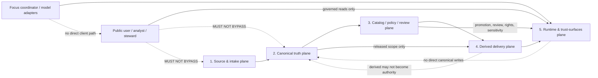

<!-- [KFM_META_BLOCK_V2]
doc_id: kfm://doc/NEEDS-VERIFICATION
title: KFM Threat Model
type: standard
version: v1
status: draft
owners: NEEDS VERIFICATION
created: YYYY-MM-DD
updated: YYYY-MM-DD
policy_label: NEEDS VERIFICATION
related: [../../../README.md, ../../../policy/README.md, ../../../contracts/README.md, ../../../schemas/README.md, ../../../tests/README.md, ../../../tools/README.md, ../../../scripts/README.md, ../../reports/readme-structure-reconciliation.md]
tags: [kfm, architecture, security, threat-model]
notes: [source-bounded draft, current-session repo tree not directly mounted, owners and dates need verification]
[/KFM_META_BLOCK_V2] -->

# KFM Threat Model

Threat-model guidance for Kansas Frontier Matrix as a governed spatial evidence system, with trust, evidence, policy, and correction treated as first-class security concerns.

| Field | Value |
|---|---|
| **Status** | experimental |
| **Owners** | **NEEDS VERIFICATION** |
| **Path** | `docs/architecture/threat-model/README.md` |
| **Doc posture** | **CONFIRMED doctrine** / **INFERRED structure** / **PROPOSED implementation guidance** / **UNKNOWN mounted implementation depth** |
| **Quick jumps** | [Scope](#scope) · [Repo fit](#repo-fit) · [Quickstart](#quickstart) · [Threat model](#threat-model-at-a-glance) · [Threat scenarios](#threat-scenarios) · [Controls & proof](#controls-and-proof-objects) · [Definition of done](#definition-of-done) · [FAQ](#faq) |


> [!IMPORTANT]
> This README is intentionally **source-bounded**. It is grounded in March 2026 KFM doctrine and the limited repo evidence surfaced in the current session. Exact repo topology, live schemas, workflow YAML, manifests, dashboards, and runtime behavior remain **UNKNOWN** unless directly verified.

## Scope

This README defines how to think about threats in KFM **without collapsing security into infrastructure-only concerns**.

In KFM, a threat is not only hostile access. It also includes:

- bypassing the trust membrane
- letting derived layers quietly become authority
- publishing without review or policy closure
- serving uncited or out-of-scope Focus answers
- exposing sensitive or exact-location material on the wrong surface
- hiding correction, withdrawal, or stale state
- breaking audit joins so failures cannot be reconstructed

### What this README is for

Use this file to:

- frame threat reviews for new lanes, routes, shells, exports, and model-enabled features
- identify assets, trust boundaries, failure modes, and required proof objects
- keep security review tied to **evidence flow**, **policy results**, **release state**, and **visible correction**
- define what must be proven before a surface is considered public-safe

### What this README is not

This file is **not**:

- a substitute for executable policy bundles
- a substitute for contract schemas or fixtures
- a production runbook
- proof that the repo already implements the controls described here

[Back to top](#kfm-threat-model)

## Repo fit

**Path:** `docs/architecture/threat-model/README.md`

**Upstream context:**  
[`../../../README.md`](../../../README.md) ·
[`../../../policy/README.md`](../../../policy/README.md) ·
[`../../../contracts/README.md`](../../../contracts/README.md) ·
[`../../../schemas/README.md`](../../../schemas/README.md)

**Downstream and adjacent review surfaces:**  
[`../../../tests/README.md`](../../../tests/README.md) ·
[`../../../tools/README.md`](../../../tools/README.md) ·
[`../../../scripts/README.md`](../../../scripts/README.md) ·
[`../../reports/readme-structure-reconciliation.md`](../../reports/readme-structure-reconciliation.md)

### Accepted inputs

This directory should accept threat-model material tied to:

- KFM doctrine and invariants
- route families and trust obligations
- contract families and proof objects
- policy reason and obligation grammars
- runtime outcomes and visible surface states
- release, correction, rollback, and stale-visible behavior
- trust-surface payload expectations for Map, Dossier, Evidence Drawer, Focus, Review, Compare, and Export
- verification findings, negative-path tests, and unresolved security unknowns

### Exclusions

The following do **not** belong here as their primary home:

- canonical schema definitions → `contracts/` and `schemas/`
- policy bundle implementation and registries → `policy/`
- executable tests and fixtures → `tests/`
- command wrappers / validators → `tools/` and `scripts/`
- general repo structure reconciliation → `docs/reports/`
- operational runbooks as the sole source of truth → maintain in runbook docs, then link here

## Directory tree

```text
docs/
└── architecture/
    └── threat-model/
        └── README.md
```

> [!NOTE]
> Adjacent files inside `docs/architecture/threat-model/` were **not directly visible** in the current session. Add them only after repo verification, and update this tree when they exist.

## Quickstart

1. Start with a **lane**, **surface**, **route family**, or **feature**.
2. Identify which KFM planes it touches and what it must **not** bypass.
3. List the trust-bearing assets and the failure modes that would invalidate outward use.
4. Map each threat to required controls, proof artifacts, and negative-path tests.
5. Record every statement here as **CONFIRMED**, **INFERRED**, **PROPOSED**, or **UNKNOWN**.
6. Do not close review until at least one **real proof object** or **negative-path sample** exists.

### Minimal review seed

```yaml
threat_review:
  lane: hydrology
  surface: Focus
  route_family: evidence-resolution
  affected_planes:
    - source-and-intake
    - canonical-truth
    - catalog-policy-review
    - derived-delivery
    - runtime-trust-surfaces
  required_artifacts:
    - SourceDescriptor
    - DatasetVersion
    - CatalogClosure
    - DecisionEnvelope
    - EvidenceBundle
    - RuntimeResponseEnvelope
    - ReleaseManifest
  required_negative_paths:
    - abstain
    - deny
    - stale-visible
    - withheld/generalized
```

## Threat model at a glance

### KFM security posture

KFM’s security posture is not “protect a database and a website.”  
It is “protect a governed path from source intake through published claim, while making failure, uncertainty, and correction visible.”

### Core invariants to preserve

| Invariant | Why it matters |
|---|---|
| **Canonical path** `Source edge → RAW → WORK/QUARANTINE → PROCESSED → CATALOG → PUBLISHED` | Stops silent promotion and forces stateful governance. |
| **Trust membrane** | Prevents clients and UI surfaces from bypassing governed APIs, policy, or evidence resolution. |
| **Authoritative vs derived split** | Prevents graphs, tiles, search, vector stores, scenes, summaries, and caches from quietly becoming sovereign truth. |
| **2D-by-default** | Prevents spectacle-first escalation; 3D is conditional and burden-bearing. |
| **Fail-closed runtime outcomes** | Forces explicit `ANSWER`, `ABSTAIN`, `DENY`, or `ERROR` instead of persuasive improvisation. |
| **Visible correction** | Ensures supersession, withdrawal, stale state, and narrowing remain inspectable. |

### Threat model diagram


```mermaid
flowchart LR
    A[1. Source & intake plane] --> B[2. Canonical truth plane]
    B --> C[3. Catalog / policy / review plane]
    C --> D[4. Derived delivery plane]
    D --> E[5. Runtime & trust-surfaces plane]

    U[Public user / analyst / steward] -->|governed reads only| E
    M[Focus coordinator / model adapters] --> E

    U -. MUST NOT BYPASS .-> B
    U -. MUST NOT BYPASS .-> A
    E -. no direct canonical writes .-> B
    D -. derived may not become authority .-> B
    M -. no direct client path .-> U

    C -->|promotion, review, rights, sensitivity| E
    B -->|released scope only| D
```

## Assets, actors, and boundaries

### Trust-bearing assets

| Asset | Why it is sensitive | Typical failure |
|---|---|---|
| **Canonical truth objects** | Carry authoritative subjects, versions, and processed truth. | Wrong-plane mutation, silent overwrite, direct read bypass. |
| **Catalog / review / policy artifacts** | Gate publication, rights, sensitivity, approval, and correction. | Publication without closure, self-approval, rights drift. |
| **EvidenceBundle** | Reconstructs outward claims from published scope. | Missing lineage, missing citations, wrong-scope evidence. |
| **RuntimeResponseEnvelope** | Makes Focus and similar runtime outcomes accountable. | Hidden abstain/deny/error logic, uncited answer leakage. |
| **ReleaseManifest / ReleaseProofPack** | Tie outward surfaces to released scope. | Unprovable release, rollback ambiguity, stale projection drift. |
| **Decision grammar registries** | Normalize reasons and obligations. | Free-text drift, policy inconsistency, untestable outcomes. |
| **Trust-visible shell payloads** | Make freshness, policy, and correction visible at point of use. | UI bluffing, hidden stale state, hidden correction state. |
| **Audit and observability joins** | Explain failures and disputed answers. | Trace breakage, orphaned logs, no end-to-end reconstruction. |

### Roles that matter in threat review

| Role | Security relevance |
|---|---|
| **Source steward / provider** | Defines meaning, rights, cadence, and publication intent. |
| **Connector / ingest operator** | Can land raw material and receipts, but must not invent truth. |
| **Canonical builder / repair lane** | Can normalize and version authority, but must stay controlled. |
| **Policy steward / reviewer** | Decides rights, sensitivity, obligations, and approvals. |
| **Release approver** | Owns trust-bearing outward change. |
| **Projection / packaging worker** | Can derive maps, tiles, graphs, exports, and scenes, but must never back-write authority. |
| **Governed API / evidence resolver** | Serves published scope and reconstructs evidence. |
| **Model runtime operator** | Manages bounded inference infrastructure without becoming truth authority. |
| **Public user / analyst / educator** | Reads through surfaces with different capability levels, but on the same governed substrate. |

### Boundary map

| Boundary | Disallowed path | Why the boundary exists |
|---|---|---|
| Public/client → canonical truth | Direct reads or writes | Prevents bypass of evidence resolution, policy, and release state. |
| Public/client → RAW / WORK / QUARANTINE | Any normal read path | Prevents exposure of unreviewed or unpublished material. |
| Runtime / Focus → uncited answer path | Best-effort prose without evidence | Preserves cite-or-abstain behavior. |
| Derived delivery → authoritative truth | Silent promotion by convenience | Keeps tiles, search, graph, vector, scene, cache, and summaries rebuildable by default. |
| 3D / twin-like surface → public-safe publication | Automatic exposure without added review | 3D is burden-bearing, not default spectacle. |
| Ops / status surface → second truth surface | Raw canonical data leakage | Ops must explain the system, not replace it. |

[Back to top](#kfm-threat-model)

## Threat scenarios

### KFM-specific threat classes

This README uses **KFM-first threat classes** rather than assuming a single external framework as repo doctrine.

| Threat class | KFM failure mode | Affected planes |
|---|---|---|
| **Membrane bypass** | UI or client reaches canonical truth, RAW, or model runtime directly. | 1, 2, 5 |
| **Authority inversion** | Derived delivery is treated as truth without promotion. | 2, 4, 5 |
| **Publication without closure** | Material appears outwardly without catalog, policy, review, or release proof. | 3, 4, 5 |
| **Evidence failure** | Claim cannot reconstruct to admissible published scope. | 3, 5 |
| **Citation failure** | Runtime retrieved evidence but user-visible claims failed citation verification. | 5 |
| **Rights / sensitivity leak** | Exact-location, oral-history, archaeology, biodiversity, or care-sensitive material leaks to the wrong audience. | 3, 4, 5 |
| **Hidden correction** | Supersession, withdrawal, narrowing, or stale state is not visible at trust surfaces. | 3, 4, 5 |
| **Audit join break** | Logs, traces, decisions, release refs, and audit refs no longer explain one another. | 3, 5 |
| **Role collapse** | One role accumulates incompatible authority, especially around approval and publication. | 3 |
| **3D governance bypass** | 3D/twin-like capability is added because it is compelling, not because 2D is insufficient. | 4, 5 |

### Scenario matrix

| Scenario | What goes wrong | Required control | Minimum proof |
|---|---|---|---|
| **Direct client path to canonical truth** | Public or analyst surface reads beyond promoted scope. | Governed API only; no direct store bypass. | Route review + negative-path test. |
| **Focus answers without valid citations** | Smooth prose leaks through when scope or evidence is partial. | `RuntimeResponseEnvelope` + citation-negative tests + fail-closed outcomes. | One evaluated sample each for `ANSWER`, `ABSTAIN`, `DENY`, `ERROR`. |
| **Derived tile/search/graph layer treated as authority** | Convenience surface becomes the only place where meaning survives. | Release linkage + projection receipts + rebuild-from-release discipline. | `ProjectionBuildReceipt` + stale-projection test. |
| **Publication without rights/sensitivity closure** | Public-safe state is assumed, not proven. | `DecisionEnvelope` + review lane + obligations such as `generalize` / `withhold`. | One generalized-vs-precise comparison flow. |
| **Correction not propagated visibly** | Withdrawn or superseded material still looks current. | `CorrectionNotice` + visible surface state + rebuild obligations. | Correction drill + affected-surface proof. |
| **Docs/policy/contracts drift apart** | Review passes prose, but implementation semantics diverge. | Docs gate + schema validation + reason/obligation registries + fixtures. | Valid/invalid fixtures + gate evidence. |
| **Model runtime becomes truth authority** | Local inference or retrieval layer implicitly decides what is true. | Replaceable model adapter behind membrane; no direct client path; EvidenceBundle resolution first. | Adapter contract + bounded runtime proof. |
| **Ops/status surface becomes second truth surface** | Metrics/health endpoints expose raw data or unsupported claims. | Ops endpoints stay internal and explanatory only. | Access review + redaction checks. |

## Controls and proof objects

### Contract families this threat model depends on

| Contract family | Threat relevance |
|---|---|
| **SourceDescriptor** | Defines identity, access, rights, cadence, validation plan, and publication intent for a source. |
| **IngestReceipt** | Proves fetch and landing events occurred as expected. |
| **ValidationReport** | Makes failed or quarantined checks visible instead of implicit. |
| **DatasetVersion** | Prevents silent mutation of authoritative subject sets. |
| **CatalogClosure** | Proves outward metadata closure and lineage linkage. |
| **DecisionEnvelope** | Records policy result, reasons, obligations, and audit linkage. |
| **ReviewRecord** | Prevents hidden approval and hidden denial. |
| **ReleaseManifest / ReleaseProofPack** | Binds publication to inspectable, review-bearing release state. |
| **ProjectionBuildReceipt** | Keeps derived delivery tied to released scope and freshness. |
| **EvidenceBundle** | Reconstructs support for a claim, feature, export preview, or answer. |
| **RuntimeResponseEnvelope** | Makes outward runtime behavior accountable and testable. |
| **CorrectionNotice** | Preserves lineage and visible change under supersession, withdrawal, or narrowing. |

### Trust-visible surface obligations

| Surface | Threat-critical requirement |
|---|---|
| **Map Explorer** | Must show visible time scope, layer state, freshness, and route to evidence. |
| **Timeline** | Must preserve valid-time labels, event grain, and stale-state cues. |
| **Dossier** | Must retain identity, dependencies, hazard/water context, gap notes, and evidence links. |
| **Story surface** | Must remain evidence-linked and correction-aware. |
| **Evidence Drawer** | Must expose EvidenceBundle members, quote context, transforms, release state, and preview limits. |
| **Focus Mode** | Must surface scoped retrieval, citation verification, audit reference, and explicit result outcome. |
| **Review / Stewardship** | Must expose diffs, gate results, policy labels, notes, and receipts; no hidden approvals. |
| **Compare** | Must show shared geography/time anchor and explicit comparison basis. |
| **Export** | Must inherit release scope, evidence linkage, preview policy, and correction linkage. |
| **Controlled 3D** | Must inherit the same Evidence Drawer, audit refs, policy chips, and release/correction state as 2D. |

### Decision grammar worth defending

| Code | Why it matters in threat review |
|---|---|
| `runtime.evidence_missing` | Detects unreconstructable outward claims. |
| `runtime.citation_failed` | Detects retrieved-but-uncitable answers. |
| `policy.denied` | Makes blocked action explicit rather than silent. |
| `release.docs_gate_failed` | Prevents release with unsynchronized behavior/docs/accessibility. |
| `projection.stale` | Forces derived freshness to remain visible. |
| `generalize` / `withhold` / `review_required` | Make sensitive handling operational instead of informal. |
| `correction_notice` / `rebuild_projection` | Tie correction to outward artifacts. |
| `cite` / `disclose_partial` / `disclose_modeled` / `log_audit` | Force visible honesty and traceability. |

## Verification and test posture

### Minimum proof families

| Proof family | What it should catch |
|---|---|
| **Schema validation** | Invalid contract shapes and missing required fields. |
| **Catalog-closure tests** | Broken STAC / DCAT / PROV outward resolution. |
| **Policy tests** | Inconsistent reason/obligation grammar and deny-by-default drift. |
| **Deterministic identity tests** | Subject/version instability and accidental mutation. |
| **Runtime citation-negative tests** | Answers that sound good but cannot reconstruct evidence. |
| **Surface-state tests** | Missing stale-visible, generalized, denied, abstained, conflicted, or withdrawn cues. |
| **Correction drills** | Failure to propagate supersession, withdrawal, or narrowing. |
| **Docs/accessibility gates** | Drift between public behavior and public explanation. |

### Review questions

1. What is the **authoritative asset** here?
2. Which **derived artifacts** depend on it?
3. What is the nearest place a client could **bypass** policy or evidence resolution?
4. What would an **uncited**, **stale**, **out-of-scope**, or **sensitive** response look like?
5. Which proof object would let a reviewer reconstruct what happened?
6. Is the failure mode visible as **ABSTAIN**, **DENY**, **ERROR**, **stale-visible**, **generalized**, or **withdrawn**?
7. What correction path exists if this surface is already published?

[Back to top](#kfm-threat-model)

## Definition of done

A threat review for a KFM feature, lane, or surface is not done until all applicable checks below are satisfied.

- [ ] Scope, lane, route family, and affected planes are explicitly named.
- [ ] Trust-bearing assets are identified.
- [ ] Disallowed bypass paths are stated.
- [ ] Public-safe and non-public-safe behaviors are distinguished.
- [ ] Required contract families and proof objects are listed.
- [ ] Required reason and obligation codes are identified.
- [ ] Runtime outcomes include `ANSWER`, `ABSTAIN`, `DENY`, and `ERROR` where applicable.
- [ ] Surface states include stale, withdrawn, denied, generalized, partial, or conflicted behavior where applicable.
- [ ] Rights and sensitivity handling is explicit.
- [ ] Correction and rollback behavior is visible, not implied.
- [ ] At least one negative-path test exists for each major outward threat.
- [ ] Every statement about mounted implementation is marked honestly as **CONFIRMED**, **INFERRED**, **PROPOSED**, or **UNKNOWN**.

## FAQ

### Is this an infrastructure-only threat model?

No. KFM doctrine treats trust, evidence, policy, release state, and visible correction as part of the threat surface.

### Does this document prove the repo already implements these controls?

No. Current-session repo and runtime verification was limited. This README is deliberately source-bounded.

### Does this replace policy, contracts, schemas, or tests?

No. It is a review map that should point to them and keep their trust consequences visible.

### Is this a generic STRIDE document?

No. This README uses KFM-specific threat classes first. Teams may add a secondary mapping to STRIDE or another framework during implementation review, but that mapping is **not assumed here as repo doctrine**.

### Why is hydrology mentioned repeatedly?

Because current KFM doctrine treats hydrology as the preferred first governed thin slice: public-safe, place/time rich, and operationally legible.

## Appendix

<details>
<summary><strong>Glossary</strong></summary>

### Trust membrane
The rule that normal clients and UI surfaces must not bypass governed APIs, policy evaluation, or evidence resolution.

### EvidenceBundle
A request-time package of supporting records, release references, lineage hints, rights/sensitivity state, transform receipts, and preview policy for a claim, feature, story node, export preview, or answer.

### RuntimeResponseEnvelope
The accountability object for outward runtime behavior, including schema version, object type, audit reference, evaluated time, surface class, surface state, result, citation check, and decision reference.

### DecisionEnvelope
A machine-readable policy result recording subject, action, lane, result, reason codes, obligation codes, policy basis, and audit linkage.

### Surface state
The visible trust state of a map, feature, story, export, or Focus response, such as promoted, generalized, partial, stale-visible, denied, abstained, withdrawn, or conflicted.

### ReleaseProofPack
The assembled publication proof linking version refs, catalog refs, decision refs, docs/accessibility gate results, rollback/correction posture, and bundle plan.

### Controlled 3D
A conditional volumetric context used only when 2D is insufficient and only with the same evidence, policy, audit, and correction obligations as the 2D shell.

</details>

<details>
<summary><strong>Threat review worksheet</strong></summary>

Fill this out before approving a new route family, surface, or lane extension.

| Prompt | Response |
|---|---|
| Lane / feature / surface |  |
| Affected planes |  |
| Route family |  |
| Authoritative assets |  |
| Derived assets |  |
| Required proof objects |  |
| Public-safe outcome(s) |  |
| Negative outcomes expected |  |
| Rights / sensitivity concerns |  |
| Correction path |  |
| Unknowns still open |  |

</details>

<details>
<summary><strong>Known verification limits for this README</strong></summary>

The following remain unverified in the current session and should be updated when repo evidence is surfaced:

- actual contents of `docs/architecture/threat-model/`
- mounted route tree and frontend component model
- machine-readable schema inventory
- fixture inventory and runnable test coverage
- workflow YAML and merge-blocking status in-tree
- deployment manifests and overlays
- EvidenceBundle / EvidenceRef resolver implementation depth
- runtime negative-path samples for Focus and related surfaces
- owner assignment, policy label, and final document dates

</details>

[Back to top](#kfm-threat-model)
