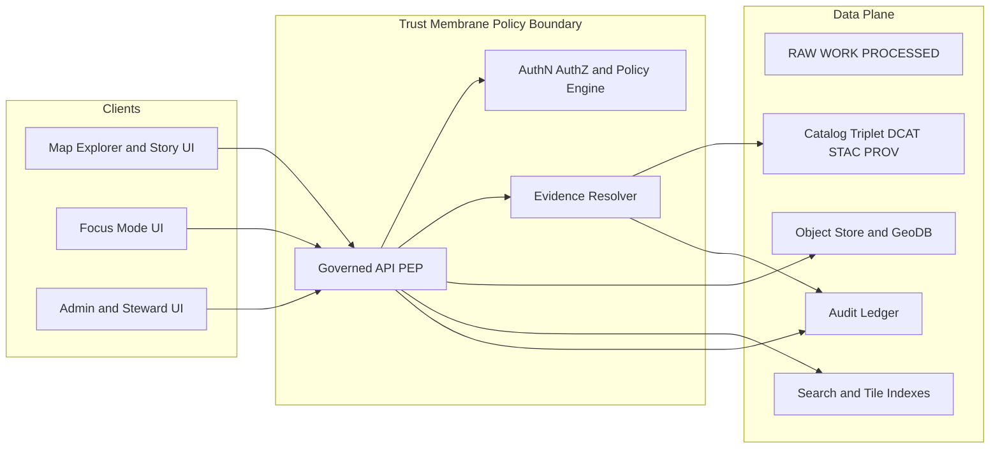

<!-- [KFM_META_BLOCK_V2]
doc_id: kfm://doc/7a96c5d3-2d0b-49bb-9b85-65b5f29d58e2
title: Threat Model — Abuse Cases
type: standard
version: v1
status: draft
owners: [TBD]   # TODO: set CODEOWNERS-aligned owners (Security / Platform / Governance)
created: 2026-03-01
updated: 2026-03-01
policy_label: public
related:
  - docs/architecture/README.md
  - docs/architecture/threat-model/README.md
  - docs/architecture/governance/trust-membrane.md         # TODO: confirm path
  - docs/architecture/governance/promotion-contract.md     # TODO: confirm path
  - docs/architecture/focus-mode/operating-model.md        # TODO: confirm path
  - docs/architecture/evidence/evidence-resolver.md        # TODO: confirm path
tags: [kfm, security, threat-model, abuse-cases, governance, trust-membrane]
notes:
  - Enumerates "abuser stories" and binds each to mitigations + testable gates.
  - Some module names/paths are design targets; verify against the live repo before treating as implemented.
[/KFM_META_BLOCK_V2] -->

# Threat Model: Abuse Cases
**Purpose:** enumerate realistic abuse cases against KFM and map each to *mitigations, detection, and CI/runtime gates*.

 <!-- TODO: wire to repo badge -->
 <!-- TODO: align with policy labels -->
 <!-- TODO -->
 <!-- TODO -->
 <!-- TODO -->

> **NOTE**
> This document is a *living governed artifact*. If an abuse case is plausible, it must have an owner, a mitigation plan, and at least one automated gate (policy/contract/e2e) or runtime control (rate limits, network policies, redaction).

---

## Quick navigation
- [Scope](#scope)
- [System summary and trust boundaries](#system-summary-and-trust-boundaries)
- [Assets and actors](#assets-and-actors)
- [Control surfaces](#control-surfaces)
- [Abuse case registry](#abuse-case-registry)
- [Abuse case details](#abuse-case-details)
- [Gates and required tests](#gates-and-required-tests)
- [Add a new abuse case](#add-a-new-abuse-case)

---

## Scope

### In scope
- **Trust membrane**: clients must access data only through governed APIs (no direct storage/DB access).
- **Evidence resolver**: `EvidenceRef → EvidenceBundle`, policy-aware, fail-closed.
- **Focus Mode**: evidence-led Q&A with *cite-or-abstain*, plus audit receipts.
- **Story publishing**: narrative content with citation gates and map-state sidecar.
- **Pipelines and promotion**: RAW → WORK → PROCESSED → CATALOG/TRIPLET → PUBLISHED with fail-closed gates.
- **Catalog triplet**: DCAT + STAC + PROV as contract surfaces.
- **Tiles and query endpoints**: policy-safe outputs; no restricted leakage via caching.

### Out of scope (for this document)
- Physical security and facility controls
- Deep infra hardening details (K8s baseline, Terraform modules, etc.) beyond abuse-case linkage
- Vendor-specific IAM implementation details (OIDC provider choice, etc.) unless directly relevant to an abuse case

### Assumptions (must be verified)
- Endpoint names and module paths referenced here are **design intent** unless verified in the repo.
- Policy posture is **default-deny** for restricted/sensitive data.
- Audit ledger exists for governed operations (pipeline runs, story publishes, Focus Mode runs).

---

## System summary and trust boundaries

KFM is an **evidence-first** geospatial platform where:
- **PUBLISHED surfaces are governed** (API/PEP, UI, Focus Mode).
- **Every claim is traceable** to resolvable evidence bundles (not “URL pasted citations”).
- **Promotion is fail-closed** unless minimum gates are met (identity, license, sensitivity plan, validated catalogs, QA, receipts, etc.).
- **Focus Mode** must *cite or abstain* and includes a hard citation verification gate.

### Trust boundary map (conceptual)



> **WARNING**
> Any path that allows a client or downstream service to read **Store/Index/Zones** without going through **PEP + policy** is considered a critical architecture violation.

---

## Assets and actors

### High-value assets
- **Restricted datasets** (sensitive locations, partner data, PII-adjacent records)
- **Precise geometries** that can cause harm (e.g., heritage sites, endangered species)
- **Credentials and secrets** (pipeline source keys, DB creds, signing keys)
- **Policy definitions** (OPA/Rego bundles, obligation definitions)
- **Evidence bundles and receipts** (integrity and authenticity)
- **Catalog triplet** (must not be spoofable; must cross-link correctly)

### Threat actors (abuser personas)
- Anonymous public user probing endpoints
- Authenticated user exceeding intended access (IDOR / enumeration)
- Malicious contributor (poisoned PR, story content injection)
- Compromised service account (pipeline runner, indexer)
- Upstream data adversary (poisoned inputs / malicious documents)
- Insider with legitimate access behaving negligently or maliciously

---

## Control surfaces

These are the “places abuse happens”:

1. **API/PEP endpoints** (dataset discovery, bbox/time queries, tiles, story publish, focus ask)
2. **Evidence resolver** (EvidenceRef parsing and artifact resolution)
3. **Focus Mode retrieval layer** (indexes + documents + catalogs → EvidenceRefs)
4. **Tiles & caching** (policy-varying cache correctness is hard)
5. **Promotion pipeline** (integrity, licensing, sensitivity classification, receipts)
6. **UI rendering surfaces** (safe markdown rendering; XSS; export flows)
7. **Audit ledger** (PII leakage, access control, retention)

---

## Abuse case registry

**How to read this table**
- *Impact* and *Likelihood* are qualitative starters. Convert to quantified risk scoring later if needed.
- *Status* should be maintained as the mitigations ship.

| ID | Abuse case | Primary surface | Impact | Likelihood | Status |
|---:|---|---|---|---|---|
| AC-001 | Policy bypass via direct DB/storage access | Infra + service wiring | Critical | Medium | Draft |
| AC-002 | Forged EvidenceRef / IDOR against evidence resolver | Evidence resolver | High | Medium | Draft |
| AC-003 | Broken or misleading citations | Focus + Story publish | High | High | Draft |
| AC-004 | Prompt injection from documents | Focus retrieval | High | Medium | Draft |
| AC-005 | Data exfiltration via Focus Mode enumeration | Focus + catalog | High | Medium | Draft |
| AC-006 | Sensitive location leakage via tiles or reverse engineering | Tiles + derived artifacts | Critical | Medium | Draft |
| AC-007 | Licensing violation (unlicensed media mirrored) | Ingest + promotion | High | Medium | Draft |
| AC-008 | Audit logs leak PII / sensitive query context | Observability | High | Medium | Draft |
| AC-009 | Story content injection (XSS / unsafe markdown) | UI + Story mode | High | Medium | Draft |
| AC-010 | DoS via expensive bbox/time queries and tile bombing | API + tiles | Medium-High | High | Draft |
| AC-011 | Hash drift / version confusion (wrong dataset version served) | Promotion + runtime | High | Medium | Draft |
| AC-012 | Community harm via narrative framing | Story publish | High | Medium | Draft |

---

## Abuse case details

### AC-001 Policy bypass via direct DB/storage access
**Abuser story:** “I find a network path, misconfigured service, or leaked credential that lets me query the GeoDB/object store directly, bypassing policy.”

- **Targets:** GeoDB, object store, indexes, internal services
- **Preconditions:** network path exists; credentials leaked; service accounts over-permissioned; UI or worker has direct DB connectivity
- **Abuse path (high level):**
  1. Identify storage endpoints (DNS, logs, leaked configs)
  2. Query data directly (bypass PEP)
  3. Extract restricted geometry/attributes
- **Detection ideas:**
  - Unexpected DB reads from UI subnets
  - Queries lacking a corresponding PEP audit entry
  - IAM anomaly (new principal, new source IP)
- **Mitigations (design + infra):**
  - Network policies: DB/object store only reachable from PEP + approved workers
  - Service accounts least privilege; rotate secrets; no shared creds
  - Static analysis/architecture tests: “clients never hit DB directly”
  - “Receipt required” for sensitive reads (tie to audit ledger)
- **Required gates/tests:**
  - CI gate: lint for forbidden imports / DB clients in UI packages
  - E2E: verify UI cannot access DB endpoints (negative test)
  - Infra tests: network policy assertions (deny by default)

[Back to top](#quick-navigation)

---

### AC-002 Forged EvidenceRef / IDOR against evidence resolver
**Abuser story:** “I guess or craft an `EvidenceRef` to retrieve an evidence bundle or artifact I’m not authorized to see.”

- **Targets:** Evidence resolver, evidence bundle store, catalog triplet links
- **Preconditions:** predictable IDs, weak authorization checks, or missing obligation enforcement
- **Abuse path (high level):**
  1. Obtain one valid EvidenceRef
  2. Modify identifiers (dataset_version_id, artifact path, bundle_id)
  3. Call `evidence/resolve` repeatedly to enumerate
- **Detection ideas:**
  - High rate of resolve failures from one user/IP
  - Sequential ID patterns in requests
  - Repeated access attempts to restricted labels
- **Mitigations:**
  - EvidenceRefs must be policy-checked and fail closed
  - Avoid guessable IDs; prefer digests or opaque IDs
  - Enforce obligations before returning anything (including metadata)
  - Rate-limit resolve; add per-user quotas
- **Required gates/tests:**
  - Contract tests: unauthorized EvidenceRef always denied
  - Property-based tests: mutated EvidenceRefs never escalate access

[Back to top](#quick-navigation)

---

### AC-003 Broken or misleading citations
**Abuser story:** “I publish a story (or Focus Mode returns an answer) where citations don’t resolve, resolve to the wrong dataset version, or are ‘hand-wavy’.”

- **Targets:** Story publish workflow, Focus Mode output, evidence resolver, catalog triplet integrity
- **Impact:** trust membrane failure (hallucination / unverifiable claims)
- **Mitigations:**
  - **Hard gate:** every citation must resolve *and* be policy-allowed
  - Link checking in CI for catalogs and stories
  - Focus Mode response schema requires citations and audit_ref
- **Required gates/tests:**
  - CI: “citation lint” and resolver checks
  - Story publish gate: reject if any EvidenceRef fails
  - Focus Mode eval harness: golden queries must remain resolvable

[Back to top](#quick-navigation)

---

### AC-004 Prompt injection from documents
**Abuser story:** “I embed instructions in an ingested document (OCR text, metadata, story content) to make Focus Mode reveal secrets or bypass policy.”

- **Targets:** Focus Mode orchestrator, retrieval indexes, document stores
- **Preconditions:** model consumes untrusted text without strict tool/policy controls
- **Mitigations:**
  - Tool allowlist: model cannot call arbitrary tools
  - Policy pre-check before retrieval
  - Redaction obligations applied before model sees restricted text
  - Evidence resolver is the only source of truth for citations
- **Required gates/tests:**
  - Focus harness tests with adversarial prompt-injection fixtures
  - Regression suite: “restricted asks” must refuse correctly
  - Ensure retrieval outputs are mapped to EvidenceRefs only

[Back to top](#quick-navigation)

---

### AC-005 Data exfiltration via Focus Mode enumeration
**Abuser story:** “I ask Focus Mode for restricted dataset lists, raw artifacts, or ‘everything you have’ and try to extract sensitive info via iterative querying.”

- **Targets:** Focus Mode + catalog endpoints + audit logs
- **Mitigations:**
  - Policy pre-check: topic restrictions and role limitations
  - Default-deny for restricted discovery; return policy-safe alternatives
  - Rate limiting + abuse detection; denylist repeated probing
  - Audit every attempt with reason code (for review)
- **Required gates/tests:**
  - Tests for “restricted dataset list” prompts → refusal responses
  - Ensure refusal is policy-safe and doesn’t leak existence via metadata differences

[Back to top](#quick-navigation)

---

### AC-006 Sensitive location leakage via tiles or reverse engineering
**Abuser story:** “Even if restricted data is hidden, I reconstruct precise locations from tiles, derived artifacts, or ‘generalized’ datasets that still contain reversible detail.”

- **Targets:** Tile server, derived layers, exports, caches
- **Mitigations:**
  - Store precise geometry only in restricted datasets
  - Publish **public_generalized** derivatives with irreversibility constraints
  - Enforce policy at tile-serving (no bypass via static hosting)
  - Tests to ensure generalized outputs do not embed hidden precise points
- **Required gates/tests:**
  - Golden tests for geometry generalization thresholds
  - Tile-level policy tests: restricted tiles never served to public
  - Cache vary correctness: auth/policy must be part of cache key

[Back to top](#quick-navigation)

---

### AC-007 Licensing violation (unlicensed media mirrored)
**Abuser story:** “I ingest or publish media (imagery, scans, historical photos) without rights clearance or attribution, creating legal and trust risk.”

- **Targets:** ingestion connectors, processed artifacts, catalogs
- **Mitigations:**
  - Promotion gate requires license/rights metadata + terms snapshot
  - Default to metadata-only mode when rights are unclear
  - Steward review workflow for ambiguous rights
- **Required gates/tests:**
  - CI: fail if license fields missing/unknown
  - Catalog validation requires rights fields and attribution text
  - Export flows include license/attribution

[Back to top](#quick-navigation)

---

### AC-008 Audit logs leak PII / sensitive query context
**Abuser story:** “Logs and traces include sensitive query parameters, user identifiers, or restricted dataset identifiers—creating a secondary leak path.”

- **Targets:** audit ledger, observability stack, dashboards
- **Mitigations:**
  - Log redaction + structured logging allowlist
  - Retention and access policies for audit data
  - Separate “public telemetry” vs “restricted audit”
- **Required gates/tests:**
  - Unit tests for redaction functions
  - CI checks that prevent logging raw request bodies for sensitive routes
  - Periodic audit log review and sampling

[Back to top](#quick-navigation)

---

### AC-009 Story content injection (XSS / unsafe markdown)
**Abuser story:** “I publish a Story Node containing malicious HTML/JS or trick content that executes in other users’ browsers or exfiltrates tokens.”

- **Targets:** Story renderer, markdown pipeline, export-to-html/pdf
- **Mitigations:**
  - Safe markdown rendering + sanitization
  - Content Security Policy (CSP)
  - No privileged credentials in UI; scoped session tokens only
- **Required gates/tests:**
  - E2E tests with XSS payload fixtures
  - Static analysis for dangerous `dangerouslySetInnerHTML` (or equivalents)

[Back to top](#quick-navigation)

---

### AC-010 DoS via expensive bbox/time queries and tile bombing
**Abuser story:** “I issue many large bbox/time queries or request tiles at high zoom to overload the system.”

- **Targets:** query endpoints, tile server, indexes
- **Mitigations:**
  - Rate limits and quotas per user/IP
  - Query cost controls (bbox size, time range caps, max features)
  - Caching and progressive disclosure
  - Backpressure and circuit breakers
- **Required gates/tests:**
  - Load tests for worst-case patterns
  - Perf budgets for tiles/query endpoints
  - Abuse-mode alerting thresholds

[Back to top](#quick-navigation)

---

### AC-011 Hash drift / version confusion
**Abuser story:** “A dataset changes upstream or pipelines drift; users see conflicting results because versions are not pinned or hashes aren’t stable.”

- **Targets:** promotion artifacts, catalogs, evidence bundles
- **Mitigations:**
  - Deterministic `spec_hash` and artifact digests
  - Golden hash tests; canonical hashing for JSON
  - UI must display dataset_version_id and freshness
- **Required gates/tests:**
  - CI: spec_hash stability across environments
  - Promotion gate: content digests verified
  - “What changed?” diffs between versions

[Back to top](#quick-navigation)

---

### AC-012 Community harm via narrative framing
**Abuser story:** “A story is technically accurate but framed in a way that causes community harm, misrepresents uncertainty, or violates community constraints.”

- **Targets:** story publish workflow, public narratives
- **Mitigations:**
  - Review triggers and steward moderation workflows
  - Uncertainty labeling and multiple perspectives where applicable
  - Community governance hooks for culturally restricted knowledge
- **Required gates/tests:**
  - Publication workflow requires review state (not ‘instant publish’)
  - Audit trail for edits and approvals

[Back to top](#quick-navigation)

---

## Gates and required tests

This section binds abuse cases to **enforceable checks**. Treat it as a “security DoD”.

### A. Promotion Contract (fail-closed) — minimum gates
> Implement as CI + steward review gates; block promotion to PUBLISHED if any gate fails.

- **Gate A — Identity and versioning:** dataset_id, dataset_version_id, deterministic spec hash, content digests
- **Gate B — Licensing and rights:** rights fields + snapshot of upstream terms
- **Gate C — Sensitivity and redaction plan:** policy_label + obligations and tests
- **Gate D — Catalog triplet validation:** DCAT/STAC/PROV validate and cross-link; EvidenceRefs resolve
- **Gate E — QA thresholds:** dataset-specific QA rules met (else quarantine)
- **Gate F — Run receipt and audit record:** append-only receipts referencing inputs/tools/hashes/policy decisions
- **Gate G — Release manifest:** promotion recorded and reproducible

### B. Runtime gates (must exist even with CI)
- **Policy enforcement:** deny-by-default; policy varies by role and dataset label
- **Evidence resolution:** any unresolvable citation → fail closed
- **Focus Mode hard gate:** if citations can’t be verified → abstain or narrow scope
- **Tile caching correctness:** cache keys must include policy/auth context

### C. Minimum test suites (starter checklist)
- [ ] Policy pack tests (OPA/Rego): default deny; obligations enforced
- [ ] API contract tests: request/response schemas; auth required where needed
- [ ] Catalog validators + linkcheckers: DCAT/STAC/PROV + EvidenceRefs
- [ ] Story publish E2E: reject unresolved citations; safe markdown
- [ ] Focus Mode evaluation harness: golden queries + adversarial prompt injection fixtures
- [ ] Load/perf tests: bbox/time limits; tile throttling

---

## Add a new abuse case

### When to add one
Add an abuse case whenever you introduce or change:
- a new endpoint
- a new retrieval index
- a new policy label or obligation
- a new export path (download, report, embed)
- a new data source with sensitivity/licensing risk

### Template

```markdown
### AC-XXX Short name
**Abuser story:** “...”

- **Targets:**
- **Assets at risk:**
- **Preconditions:**
- **Abuse path (high level):**
- **Detection ideas:**
- **Mitigations:**
- **Required gates/tests:**
- **Owner:** @team-or-role
- **Linked ADRs / work items:** (links)
```

---

## Changelog
- **2026-03-01:** Initial draft created (seed list derived from KFM governance guidance; verify against repo implementation).
# Abuse Cases

Placeholder for architecture documentation.
