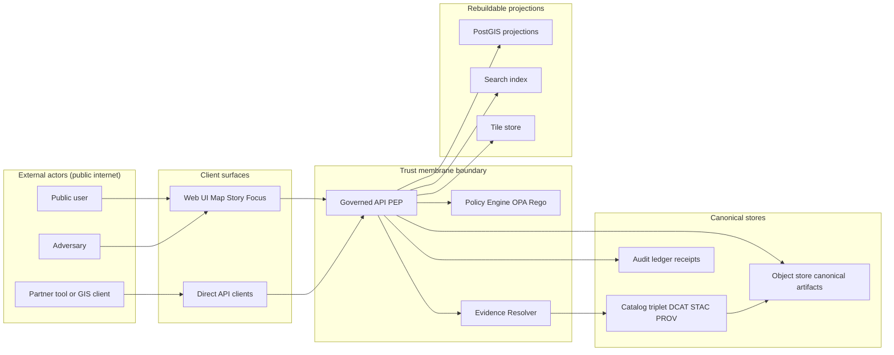

<!-- [KFM_META_BLOCK_V2]
doc_id: kfm://doc/7a7c4d79-45e6-4f9c-a6cc-7d0ec8a14cfb
title: Threat Model — Actors and Entrypoints
type: standard
version: v1
status: draft
owners: TBD
created: 2026-03-01
updated: 2026-03-01
policy_label: restricted
related:
  - docs/architecture/threat-model/README.md
  - docs/architecture/threat-model/risk-register.md
  - docs/architecture/threat-model/controls-and-gates.md
tags: [kfm, security, threat-model, architecture]
notes:
  - This file inventories actors + entrypoints only; it does not fully enumerate threats/mitigations.
  - Default-deny posture: treat all UNKNOWN items as blocked until verified + governed.
[/KFM_META_BLOCK_V2] -->

# Threat Model — Actors and Entrypoints

**Purpose:** Inventory *who* can interact with KFM and *through which interfaces*, so the rest of the threat model (STRIDE, abuse cases, controls, tests) has a stable backbone.

**Quick links:**  
[Scope](#scope) • [Legend](#legend) • [System boundary](#system-boundary) • [Actor inventory](#actor-inventory) • [Entrypoint inventory](#entrypoint-inventory) • [Actor-to-entrypoint matrix](#actor-to-entrypoint-matrix) • [Verification checklist](#verification-checklist) • [Open questions](#open-questions)

---

## Scope

This document covers:

- **Actors**: humans, systems, and adversaries that can interact with KFM.
- **Entrypoints**: concrete interaction surfaces (UI, API, CI, ingestion connectors, admin tools).

This document intentionally does **not** fully detail:

- Threat enumeration (STRIDE), risk scoring, or mitigations-by-control.
- Specific code-level endpoints beyond what’s confirmed or explicitly marked “to verify”.

> NOTE  
> KFM’s posture is governance-driven: the system assumes an adversary is present, and must remain safe under policy bypass, prompt injection, and exfiltration attempts. When uncertain, we default-deny and log.

---

## Legend

KFM docs and planning artifacts include both “what exists now” and “target design.” To preserve the trust membrane:

- ✅ **CONFIRMED** — backed by KFM design/governance documents already available.
- 🟨 **PROPOSED** — design intent / recommended build plan; must be verified in repo + CI before treated as real.
- ❓ **UNKNOWN** — not yet verified; treat as blocked until proven.

---

## System boundary

### Non-negotiable invariants (security-relevant)

✅ **Trust membrane:** clients never access DB/storage directly; all data access goes through governed APIs that apply policy, redaction obligations, and logging.  
✅ **Truth path lifecycle:** Upstream → RAW → WORK/QUARANTINE → PROCESSED → CATALOG (DCAT+STAC+PROV + receipts) → Governed API → UI.  
✅ **Evidence-first UX:** every layer/claim exposes provenance and evidence bundles.  
✅ **Cite-or-abstain Focus Mode:** answers must cite resolvable evidence bundles or abstain; queries emit audit receipts.

> WARNING  
> Any “backdoor” that allows bypassing the governed API (PEP) collapses policy enforcement, provenance guarantees, and the ability to safely publish.

### Boundary diagram

---

## Actor inventory

Actors are organized as **users**, **operators**, **services**, and **adversaries**. “Access level” is the intended posture, not a guarantee.

| Actor ID | Category | Description | Intended access | Typical goals | Key controls (high level) |
|---|---|---|---|---|---|
| ACT-USER-PUBLIC | User | Anonymous visitor using Map/Story UI | Public, least-privilege | Browse public layers, read stories | Rate limiting, policy-safe errors, no privileged creds in UI |
| ACT-USER-REGISTERED | User | Authenticated end-user (if supported) | Scoped to policy | Save views, export reports, use Focus Mode | AuthN/AuthZ, audit receipts, export redaction |
| ACT-USER-RESEARCHER | User | Power user (GIS tooling, API scripts) | Scoped to policy | Query datasets, STAC items, time filters | API auth, quotas, query audit |
| ACT-STEWARD | Operator | Steward/admin reviewing promotions/stories | Restricted | Approve promotion, review citations, manage policy labels | Strong auth, separation of duties, signed approvals |
| ACT-DEV | Operator | Developer/maintainer with repo access | Restricted | Ship code, update contracts/policies | CODEOWNERS, CI gates, signed releases |
| ACT-OPS | Operator | Platform operator (infra, secrets, runtime) | Restricted | Operate K8s, DB, storage, logs | Least privilege, breakglass, audit logging |
| ACT-CI | Service | CI runner executing tests and builds | Restricted (non-human) | Validate contracts/policies, run linters, build artifacts | Ephemeral creds, scoped tokens, provenance of builds |
| ACT-INGEST | Service | Ingestion runner / connector | Restricted (non-human) | Fetch upstream → emit RAW artifacts + manifest + checksums | Egress controls, allowlist sources, integrity checks |
| ACT-INDEXER | Service | Index/tile builder | Restricted (non-human) | Build projections from canonical artifacts | Read-only canonical access, rebuildable outputs |
| ACT-PEP | Service | Governed API (policy enforcement point) | Boundary component | Enforce policy; serve UI/API queries | Policy evaluation, obligation enforcement, audit |
| ACT-POLICY | Service | OPA/Rego policy engine | Boundary component | Evaluate decisions + obligations | Deterministic inputs, test suite, safe defaults |
| ACT-EVIDENCE | Service | Evidence resolver | Boundary component | Resolve EvidenceRefs → EvidenceBundles with redaction | Link checking, policy gating, digest verification |
| ACT-ATTACKER-WEB | Adversary | Opportunistic attacker (XSS/CSRF/SQLi scanning) | None (blocked) | Data exfil, deface, DoS | WAF, CSP, input validation, rate limits |
| ACT-ATTACKER-SCRAPER | Adversary | Systematic scraper / bulk downloader | None (blocked) | Rehost data, infer restricted info | Quotas, anomaly detection, response shaping |
| ACT-ATTACKER-INSIDER | Adversary | Malicious insider or compromised operator | None (should be constrained) | Bypass policy, access raw restricted data | Segmentation, approvals, audit, least privilege |
| ACT-ATTACKER-SUPPLYCHAIN | Adversary | Dependency / CI compromise | None (blocked) | Inject code to bypass policy or leak data | SLSA-ish provenance, locked deps, CI hardening |
| ACT-ATTACKER-PROMPT | Adversary | Prompt injection / tool misuse via Focus Mode | None (blocked) | Exfiltrate restricted info via model behavior | Tool allowlist, citation gate, policy pre-checks |

> TIP  
> Keep this table stable; when a new role is introduced, add it here first, then update control mappings and tests.

---

## Entrypoint inventory

Entrypoints are interaction surfaces. Each entrypoint should eventually have:

- a **contract** (OpenAPI/schema),
- **policy context extraction** (who/what/why),
- **audit semantics** (what gets logged, redacted, retained),
- and a **verification status**.

| Entrypoint ID | Type | Exposure | Auth boundary | Typical data | Primary risks | Required telemetry | Status |
|---|---|---|---|---|---|---|---|
| EP-UI-PUBLIC | Web UI | Public internet | Browser session | Map tiles, public features, story pages | XSS, CSRF, data scraping, policy inference via UI behavior | Frontend security headers, UX-level policy notices, request IDs | ✅ CONFIRMED (concept) |
| EP-UI-FOCUS | Web UI | Public internet | Browser session | Focus Q&A + citations | Prompt injection, leakage via model output | Query receipts, citation verification results, abstention reasons | ✅ CONFIRMED (concept) |
| EP-UI-ADMIN | Web UI | Restricted | Strong auth | Promotion queue, story review | Privilege abuse, mislabeling policy | Admin audit trail, approval signatures | 🟨 PROPOSED |
| EP-API-PEP | HTTP API | Public or edge-gated | Token/session | Dataset queries, features, exports | Auth bypass, injection, mass scraping | Structured audit log, rate limit metrics, decision logs | ✅ CONFIRMED (concept) |
| EP-API-CATALOG | HTTP API | Public | Optional | STAC/DCAT catalogs | Enumeration, inference of restricted datasets | Catalog access logs, response shaping | 🟨 PROPOSED (verify surface) |
| EP-API-EVIDENCE | HTTP API | Public via PEP | Token/session | Evidence bundle resolution | Citation spoofing, link traversal, restricted artifact exposure | Evidence resolution logs + digests | ✅ CONFIRMED (concept) |
| EP-CLI-PROMOTE | CLI | Operator workstation/CI | Operator auth | Promotions, validations | Bypass gates, push unreviewed artifacts | Signed receipts, immutable logs | 🟨 PROPOSED |
| EP-CI-WORKFLOWS | CI | Repo/runner | Runner token | Contract tests, policy tests | Supply-chain injection, token abuse | Build provenance, artifact signing logs | ✅ CONFIRMED (as requirement) |
| EP-INGEST-UPSTREAM | Connector | Outbound from cluster | Allowlisted sources | Files/APIs/feeds | Data poisoning, SSRF, license drift, upstream instability | Fetch logs, source snapshots, checksum manifests | ✅ CONFIRMED (as concept) |
| EP-STORAGE-OBJECT | Storage | Internal only | Service identity | RAW/PROCESSED artifacts | Direct access bypasses policy | Network policy denies, access logs | ✅ CONFIRMED as “must be internal only” |
| EP-STORAGE-DB | DB | Internal only | Service identity | PostGIS projections | Direct DB queries bypass PEP/policy | Network policy denies, query logs | ✅ CONFIRMED as “must be internal only” |
| EP-OBS-AUDIT | Observability | Restricted | Operator auth | Audit ledger + logs | PII leakage in logs, unauthorized inspection | Log redaction + retention, access control | 🟨 PROPOSED |

> WARNING  
> If EP-STORAGE-OBJECT or EP-STORAGE-DB are reachable from clients (directly or indirectly), the trust membrane is broken.

---

## Actor-to-entrypoint matrix

This matrix captures “who should be able to do what” at the boundary. Treat “?” as denied until verified.

| Actor \ Entrypoint | EP-UI-PUBLIC | EP-UI-FOCUS | EP-UI-ADMIN | EP-API-PEP | EP-CLI-PROMOTE | EP-INGEST-UPSTREAM | EP-STORAGE-DB | EP-STORAGE-OBJECT |
|---|---:|---:|---:|---:|---:|---:|---:|---:|
| ACT-USER-PUBLIC | ✔️ | ✔️ (public-safe) | ✖️ | ✔️ (public-safe) | ✖️ | ✖️ | ✖️ | ✖️ |
| ACT-USER-REGISTERED | ✔️ | ✔️ | ✖️ | ✔️ | ✖️ | ✖️ | ✖️ | ✖️ |
| ACT-STEWARD | ✔️ | ✔️ | ✔️ | ✔️ | ✔️ | ✖️ | ✖️ (prefer repositories) | ✖️ (prefer repositories) |
| ACT-DEV | ✔️ | ✔️ | ? | ✔️ | ✔️ | ? | ✖️ (prefer repositories) | ✖️ (prefer repositories) |
| ACT-OPS | ✔️ | ✔️ | ✔️ | ✔️ | ✔️ | ✔️ | ✔️ (ops-only, logged) | ✔️ (ops-only, logged) |
| ACT-CI | ✖️ | ✖️ | ✖️ | ✔️ (tests) | ✔️ | ✔️ | ✖️ | ✖️ |
| ACT-ATTACKER-WEB | ✖️ | ✖️ | ✖️ | ✖️ | ✖️ | ✖️ | ✖️ | ✖️ |

> NOTE  
> “Ops-only direct DB/object access” is a last resort for incident response and must be tightly audited and time-bounded (breakglass). Normal operation should be repository-mediated behind the API boundary.

---

## Verification checklist

Use this checklist to convert 🟨/❓ into ✅ and to prevent “paper security.”

### Repo / contracts reality check

- [ ] Capture repo commit hash + root tree (`git rev-parse HEAD`, `tree -L 3`).
- [ ] Enumerate all network services + ingress rules (K8s Ingress/Service manifests).
- [ ] Extract the actual OpenAPI surface(s) and list routes (including Focus, STAC, datasets).
- [ ] Confirm which admin surfaces exist (UI routes + API endpoints).

### Trust membrane tests (must fail closed)

- [ ] Frontend never fetches directly from storage/DB.
- [ ] Backend never bypasses repository interfaces.
- [ ] Network policies deny direct client traffic to DB/object store.
- [ ] Policy-safe error responses prevent inference via error/timing.

### Evidence and publishing gates

- [ ] Evidence resolver resolves representative EvidenceRefs end-to-end.
- [ ] Story publishing blocks if citations/rights are unclear.
- [ ] Focus Mode cite-or-abstain enforced; evaluation harness blocks regressions.

---

## Open questions

These must be resolved (or explicitly “denied-by-default”) before broad release:

1. **AuthN/AuthZ model:** identity provider? token types? session model? (❓ UNKNOWN)
2. **Role catalog:** steward vs admin vs ops separation; breakglass policy. (❓ UNKNOWN)
3. **Logging/retention policy:** audit log access control + PII redaction rules. (🟨 PROPOSED)
4. **Rate limits + anti-scraping posture:** per-IP, per-token, per-dataset? (🟨 PROPOSED)
5. **Export semantics:** what exports exist; how obligations + attribution are embedded. (🟨 PROPOSED)

---

## Sources

- Kansas Frontier Matrix (KFM) design/governance materials (vNext, 2026-02-20).
- “Tooling the KFM pipeline” architecture and delivery plan materials.
- Threat-model checklist items and UI trust surface requirements from KFM blueprint sources.

> Back to top: [Threat Model — Actors and Entrypoints](#threat-model--actors-and-entrypoints)# Actors And Entrypoints

Placeholder for architecture documentation.
