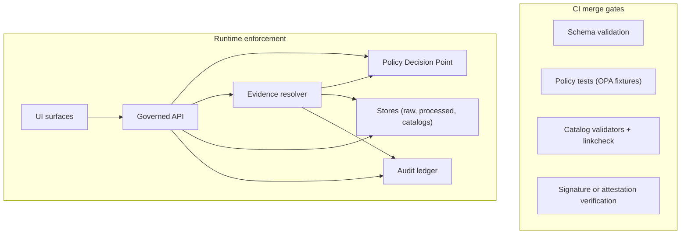

<!-- [KFM_META_BLOCK_V2]
doc_id: kfm://doc/ec962f8b-8f65-4f63-be56-a3693279784b
title: KFM Threat Model Control Mapping
type: standard
version: v1
status: draft
owners: architecture-security
created: 2026-03-01
updated: 2026-03-01
policy_label: internal
related: []
tags: [kfm, security, threat-model, controls]
notes:
  - Control catalog + threat-to-control matrix for KFM trust membrane, promotion contract, and governed surfaces.
  - Keep this doc design-level; do not include secrets, concrete network topology, or exploit recipes.
[/KFM_META_BLOCK_V2] -->

# KFM Threat Model Control Mapping

A governed, end-to-end mapping of **threats → controls → enforcement points → verifiable artifacts** for KFM’s trust membrane, Promotion Contract, governed API, and Focus Mode.

---

## Quick navigation

- [Where this doc fits](#where-this-doc-fits)
- [Scope and non-goals](#scope-and-non-goals)
- [System enforcement model](#system-enforcement-model)
- [Status legend](#status-legend)
- [Control taxonomy](#control-taxonomy)
- [Control catalog](#control-catalog)
- [Threat checklist mapping](#threat-checklist-mapping)
- [Risk register mapping](#risk-register-mapping)
- [Verification checklist](#verification-checklist)
- [Change process](#change-process)
- [Appendix](#appendix)

---

## Where this doc fits

**Path:** `docs/architecture/threat-model/control-mapping.md`

**Purpose in repo:** A “one-stop” control inventory that security reviews, ADRs, CI gates, and stewards can reference to verify that:
- no feature bypasses policy enforcement,
- no dataset is promoted without required governance artifacts,
- Focus Mode and Story publishing remain **cite-or-abstain** with **policy-allowed evidence**,
- the UI makes trust visible without leaking restricted existence.

### Acceptable inputs

- Control IDs (KFM-*-##) with descriptions and enforcement points
- Threat IDs (TM-### checklist items, plus TH-### scenarios if needed)
- “Minimum verification steps” for converting **Unknown → Confirmed**
- References to internal ADRs/runbooks (as links) **without** secrets
- CI check names (generic) and test file references (generic)

### Exclusions

- Secrets, credentials, tokens, internal URLs, cluster topology, IP ranges
- Step-by-step exploitation instructions (“how to break in”)
- Dataset-specific restricted details (e.g., precise sensitive coordinates)
- Environment-specific procedures (put those in restricted runbooks)

[Back to top](#top)

---

## Scope and non-goals

### In scope
- The **Promotion Contract** and lifecycle zones: RAW → WORK/QUARANTINE → PROCESSED → CATALOG/TRIPLET → PUBLISHED
- **Governed API** as the policy enforcement boundary
- Policy-as-code in **CI and runtime** (shared semantics)
- Evidence resolution and “hard citation verification” gates
- UI trust surfaces (evidence drawer, version labels, policy notices)
- Focus Mode safety: policy checks, evidence bundling, cite-or-abstain, audit receipts
- Audit logging and retention posture (classification + redaction)

### Non-goals
- Not a full threat model narrative (see `threat-model.md` if/when added)
- Not a compliance mapping to external frameworks (NIST/ISO) (optional later)
- Not an implementation inventory (implementation must be verified in repo)

[Back to top](#top)

---

## System enforcement model

KFM’s security posture is built around **enforcement points** and **fail-closed gates**.

### Enforcement points (design intent)

- **CI gates (PEP)**: schema validation + policy tests block merges
- **Runtime API (PEP)**: policy checks before serving data
- **Evidence resolver (PEP)**: policy checks before resolving EvidenceRefs / rendering bundles
- **UI**: shows badges/notices; **never makes policy decisions**

[Back to top](#top)

---

## Status legend

This doc uses two “truth lanes”:

- **Design status** (what KFM docs require or propose)
  - **Confirmed**: required/expected in design docs
  - **Proposed**: explicitly proposed / recommended, not mandated
  - **Unknown**: not specified; needs decision or source

- **Implementation status**
  - **Unknown by default** until verified against the live repo + CI config

[Back to top](#top)

---

## Control taxonomy

Control IDs are grouped so threats can map to a small number of durable control families.

| Family | Meaning |
|---|---|
| **KFM-TM** | Trust membrane (no client bypass of policy boundary) |
| **KFM-POL** | Policy-as-code (OPA/Rego), obligations, safe errors |
| **KFM-PROM** | Promotion Contract gates and lifecycle enforcement |
| **KFM-EVID** | Evidence resolver, EvidenceRef→Bundle, citation gates |
| **KFM-LIC** | Licensing/rights enforcement (promotion + export + story) |
| **KFM-SENS** | Sensitivity classification, redaction/generalization rules |
| **KFM-AUD** | Audit logs, receipts, manifests; redaction + retention |
| **KFM-SC** | Supply-chain integrity (digests, signatures, attestations) |
| **KFM-NET** | Network segmentation/policy (in-cluster, boundary hardening) |
| **KFM-UI** | UI trust surfaces + safe rendering + accessibility |
| **KFM-AI** | Focus Mode constraints (cite-or-abstain, prompt-injection mitigations) |
| **KFM-OPS** | Secrets hygiene, rotation, incident readiness, DoS resilience |

[Back to top](#top)

---

## Control catalog

> NOTE: Implementation status is **Unknown** until verified in-repo.

| Control ID | Control summary | Primary enforcement points | Design status | Minimum verification (convert Unknown → Confirmed) |
|---|---|---|---|---|
| **KFM-TM-01** | UI/clients never access DB/object storage directly; all reads go through governed API boundary | Runtime, Net | Confirmed | E2E test: UI cannot fetch protected assets directly; network policy or proxy denies; API routes required |
| **KFM-POL-01** | Same policy semantics in CI and runtime (fixtures/outcomes aligned) | CI, Runtime | Confirmed | Compare CI policy fixtures vs runtime PDP bundle hash; run “deny-by-default” fixture tests in CI |
| **KFM-POL-02** | Policy-safe error model: avoid “ghost metadata”; align 403/404 behavior | Runtime | Confirmed | Integration tests for restricted dataset requests: consistent responses; no existence leakage |
| **KFM-PROM-01** | Gate A: identity & versioning (dataset_version_id, spec hash, digests) | CI | Confirmed | CI checks enforce required fields + deterministic hashing |
| **KFM-PROM-02** | Gate B: licensing/rights metadata + upstream terms snapshot | CI, Review | Confirmed | CI rejects missing license/rights; fixture includes terms snapshot artifact |
| **KFM-PROM-03** | Gate C: policy_label + obligations (redaction/generalization) | CI, Runtime | Confirmed | Policy fixtures prove default-deny; redaction obligations applied and recorded |
| **KFM-PROM-04** | Gate D: triplet validation (DCAT+STAC+PROV) + linkcheck + resolvable EvidenceRefs | CI | Confirmed | Validators + linkcheck are required status checks; EvidenceRefs resolve without guessing |
| **KFM-PROM-05** | Gate E: QA reports + thresholds; quarantine on fail | CI, Pipeline | Confirmed | A failing QA report blocks promotion and routes to quarantine |
| **KFM-PROM-06** | Gate F: run receipt + audit record for governed operations | Runtime, CI | Confirmed | Receipt schema validation; audit entries include inputs/outputs by digest + policy decision IDs |
| **KFM-PROM-07** | Gate G: promotion manifest for reproducible releases | CI, Review | Confirmed | Release manifests exist; artifact digests match storage; steward approval captured |
| **KFM-EVID-01** | EvidenceRef resolves to EvidenceBundle with policy + digests + provenance; fail closed | Runtime | Confirmed | `/evidence/resolve` integration tests deny unauthorized; no restricted leakage |
| **KFM-EVID-02** | Story publish + Focus Mode have hard gate: all citations must resolve + be policy-allowed | Runtime, UI | Confirmed | Attempt story publish with broken citation fails; Focus Mode abstains on unverifiable citations |
| **KFM-LIC-01** | Exports/downloads auto-include attribution + license; block if rights unclear | Runtime, UI | Confirmed | Attempt export with missing rights is denied with policy-safe error |
| **KFM-SENS-01** | Default deny for sensitive/restricted; “public_generalized” derivatives when allowed | CI, Runtime | Proposed | Add fixture tests for “restricted precise → allow generalized”; ensure PROV records transform |
| **KFM-SENS-02** | Never embed precise coords in Story/Focus output unless explicitly allowed | Runtime, UI | Proposed | Add tests scanning story/focus outputs for forbidden precision under restricted labels |
| **KFM-AUD-01** | Every governed op emits audit_ref with who/what/when/why, digests, policy decisions | Runtime | Confirmed | Verify audit payload schema; ensure “audit_ref” present in responses |
| **KFM-AUD-02** | Audit logs/receipts are classified + redacted; access-controlled retention | Runtime, Ops | Confirmed | Verify redaction pipeline; access policy exists; logs do not leak restricted fields |
| **KFM-SC-01** | Artifacts immutable by digest; (optional) signatures/attestations verified before promote | CI, Runtime | Proposed | CI job verifies signatures; rejects unsigned/invalid; promotion blocked |
| **KFM-NET-01** | Network policy segmentation complements perimeter; stage/audit policies before enforce | Net, Ops | Proposed | Network policy exists; preview/staging process documented; change reviewed |
| **KFM-UI-01** | Trust surfaces: evidence drawer, version labels, policy notices, “what changed” diff | UI | Confirmed | UI e2e tests check evidence drawer shows license/version; badges have text labels |
| **KFM-UI-02** | Safe markdown rendering + CSP; prevent XSS; no color-only meaning | UI | Confirmed | Security test: markdown sanitized; CSP in place; accessibility checks pass |
| **KFM-AI-01** | Focus Mode is a governed run: policy pre-check, retrieval, evidence bundling, cite-or-abstain, receipt | Runtime | Confirmed | Evaluation harness: golden queries; responses cite or abstain; receipts stored |
| **KFM-OPS-01** | Pipeline credentials scoped per source and rotated | Ops | Confirmed | Secrets inventory; rotation policy; least privilege review; test for missing scopes |

[Back to top](#top)

---

## Threat checklist mapping

This table maps the **TM-### review checklist** items to control IDs and required proof.

| Checklist ID | Review question (threat) | Expected result | Controls | Required proof |
|---|---|---|---|---|
| **TM-001** | Does the frontend ever fetch data directly from object storage or databases? | **NO** | KFM-TM-01, KFM-NET-01 | E2E test + network deny; docs show API-only access |
| **TM-002** | Can a public user infer restricted dataset existence via error behavior? | **NO** | KFM-POL-02 | Integration tests for 403/404 behavior + message stability |
| **TM-003** | Are all downloads/exports checked against policy labels and rights? | **YES** | KFM-LIC-01, KFM-POL-01 | Export contract tests + rights metadata fixtures |
| **TM-004** | Can Focus Mode be prompt-injected by retrieved documents? | Mitigations in place | KFM-AI-01, KFM-EVID-02, KFM-POL-01 | Tool allowlist policy + citation verifier + policy filters |
| **TM-005** | Are audit logs redacted and access-controlled? | **YES** | KFM-AUD-02 | Log schema + redaction tests + access policy |
| **TM-006** | Are pipeline credentials scoped per source and rotated? | **YES** | KFM-OPS-01 | Secret inventory + rotation evidence |
| **TM-007** | Are processed artifacts immutable by digest? | **YES** | KFM-PROM-01, KFM-SC-01 | Digest checks + immutable storage policy |
| **TM-008** | Are policy rules tested in CI with fixtures? | **YES** | KFM-POL-01 | Conftest/fixture tests required in CI |

[Back to top](#top)

---

## Risk register mapping

This table maps known KFM risks to controls (starter).

| Risk ID | Risk | Impact | Primary controls | Notes |
|---|---|---|---|---|
| **RISK-001** | Policy bypass via direct DB/storage access | High | KFM-TM-01, KFM-NET-01, KFM-POL-01 | “Trust membrane” must be enforceable (not a convention) |
| **RISK-002** | Licensing violation (unlicensed media mirrored) | High | KFM-PROM-02, KFM-LIC-01 | Promotion gate blocks missing/unclear rights; metadata-only allowed |
| **RISK-003** | Sensitive location leakage (archaeology/species) | High | KFM-PROM-03, KFM-SENS-01, KFM-SENS-02, KFM-POL-02 | Default deny; generalized derivatives; safe errors |
| **RISK-004** | Non-resolvable citations (broken evidence links) | High | KFM-PROM-04, KFM-EVID-01, KFM-EVID-02 | “Hard citation gate” blocks Story/Focus publish |
| **RISK-007** | Performance collapse on large layers | Med-High | KFM-PROM-01, KFM-OPS-01 (partial), KFM-UI-01 | Prefer tiles/PMTiles/caching/progressive disclosure |
| **RISK-008** | Focus Mode hallucination or restricted leakage | High | KFM-AI-01, KFM-EVID-02, KFM-POL-01 | Primary anti-hallucination mechanism is “verify citations or abstain” |

[Back to top](#top)

---

## Verification checklist

Convert “Unknown” implementation state into “Confirmed” by attaching these minimum artifacts to the next revision:

- [ ] Capture repo commit hash and root directory tree (`git rev-parse HEAD`, `tree -L 3`)
- [ ] Enumerate CI status checks that block merges (policy tests, validators, linkcheck, etc.)
- [ ] Verify promotion gates are automated and fail closed (A–G)
- [ ] Validate UI cannot bypass the governed API boundary (static + e2e + network)
- [ ] Run Focus Mode evaluation harness (golden queries) and store diffs as governed artifacts
- [ ] Confirm audit logging schema + redaction + retention policy exists and is enforced

[Back to top](#top)

---

## Change process

- Changes to controls or threat mappings require:
  - PR + review by security/architecture owners
  - Update to relevant policy fixtures and/or tests
  - Evidence of verification (links to CI run, receipts, or audit samples)
- Breaking changes:
  - Add an ADR explaining tradeoffs and rollback plan
  - Ensure fail-closed gates remain intact

[Back to top](#top)

---

## Appendix

### A. Template: adding a new endpoint

When adding a governed endpoint, record:

- Endpoint name + purpose
- Data classification inputs (policy_label, rights, sensitivity)
- Controls invoked (KFM-POL-*, KFM-EVID-*, KFM-AUD-*)
- Tests:
  - policy allow/deny fixtures
  - safe error behavior
  - audit_ref presence
  - citation resolution behavior (if narrative/AI surface)

### B. Template: adding a new dataset pipeline

When adding a dataset pipeline, record:

- Promotion gate artifacts (A–G)
- DCAT/STAC/PROV profiles and validators
- Sensitivity + licensing rubrics
- EvidenceRefs strategy (how citations resolve)

---

**TODOs (safe, non-blocking):**
- Add links to the canonical Threat Model narrative doc (if/when present)
- Add references to ADRs for: policy error model, log retention, signature verification, network policy strategy
- Optionally: map KFM control families to NIST CSF or ISO 27001 if governance requires# Control Mapping

Placeholder for architecture documentation.
