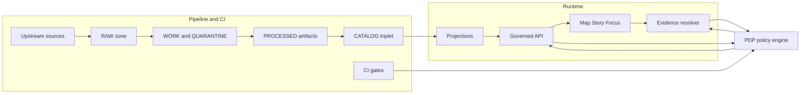

<!-- [KFM_META_BLOCK_V2]
doc_id: kfm://doc/1dba6e90-5605-4272-82ef-19847a6ea4c6
title: Data classification and handling
type: standard
version: v1
status: draft
owners: TBD (Security + Data Stewardship)
created: 2026-03-01
updated: 2026-03-01
policy_label: public
related: []
tags: [kfm, architecture, threat-model, data-classification, governance]
notes:
  - Defines policy_label taxonomy and handling obligations across the truth path and trust membrane.
  - This doc is intentionally "fail closed": when in doubt, classify higher sensitivity and require steward review.
[/KFM_META_BLOCK_V2] -->

# Data classification and handling

**Purpose:** Define how KFM classifies data (via `policy_label`) and how that classification drives handling controls (access, redaction/generalization, logging, publishing) across pipelines, APIs, UI surfaces, and Focus Mode.


---

## Quick navigation

- [Principles that drive handling](#principles-that-drive-handling)
- [Classification vocabulary](#classification-vocabulary)
- [Handling rules](#handling-rules)
- [Threats and mitigations](#threats-and-mitigations)
- [Promotion and CI gates](#promotion-and-ci-gates)
- [Implementation checklist](#implementation-checklist)
- [Appendix: obligation patterns](#appendix-obligation-patterns)

---

## Principles that drive handling

KFM data handling is **governance-driven**: policy labels and obligations are enforced in CI and at runtime, and user-facing experiences must remain policy-safe even under prompt-injection and data-exfiltration attempts.

### Truth path lifecycle

All data moves through zones (acquisition → transforms → publishable artifacts → catalogs/provenance → runtime). Runtime systems (API/UI/Focus Mode) **must only serve promoted artifacts**.

### Trust membrane

Clients and UIs must never read directly from databases/object storage. All access goes through governed APIs and evidence resolution so policy decisions, obligations, and logging are consistently applied.

### Policy is code (shared CI and runtime semantics)

Policy decisions should be computed the same way in CI and runtime:
- **CI** blocks merges/promotions when policy checks fail.
- **Runtime** enforces allow/deny and obligations before returning data.
- **UI** displays policy badges/notices but never makes policy decisions.

### Evidence-first UX + cite-or-abstain

Publishing and Focus Mode depend on resolvable, policy-allowed citations. If evidence can’t be verified or allowed, the system must abstain or narrow scope.

### Enforcement map (where policy is applied)



> **NOTE**
> This doc defines the **classification-and-handling contract**. Concrete enforcement lives in policy bundles (OPA/Rego or equivalent), validators, and the governed API.

[Back to top](#data-classification-and-handling)

---

## Classification vocabulary

### Two orthogonal axes

KFM uses two different but related labels:

1. **`artifact.zone`**: where an artifact lives in the lifecycle (raw/work/processed/catalog/published).
2. **`policy_label`**: the primary sensitivity classification input that drives access decisions and obligations.

> **Rule of thumb**
> `artifact.zone` answers *“how far along the truth path is this artifact?”*  
> `policy_label` answers *“who may see it, and what transformations are required to show it safely?”*

### Controlled vocabulary

#### `policy_label` (starter set)

- `public`
- `public_generalized`
- `internal`
- `restricted`
- `restricted_sensitive_location`
- `embargoed`
- `quarantine`

#### `artifact.zone` (starter set)

- `raw`
- `work`
- `processed`
- `catalog`
- `published`

### What a policy decision returns

A policy decision is more than allow/deny. It should return:
- allow/deny
- reason codes (for audit and UX)
- **obligations** (the redaction/generalization steps required)

[Back to top](#data-classification-and-handling)

---

## Handling rules

This section defines **expected behavior** per `policy_label`. Anything not explicitly allowed is denied by default.

### Cross-cutting defaults (aligned to KFM proposed posture)

- **Default deny when uncertain.** If classification is unclear, treat the dataset as `restricted` (or `quarantine`) until steward review.
- **No restricted metadata leakage.** Authorization failures must be policy-safe (no “ghost metadata” via errors, timing, or 403/404 bodies).
- **Redaction/generalization is a first-class transform.** Obligations must be recorded as provenance (PROV/run receipts) and surfaced in UX.
- **Sensitive locations:** never publish precise geometries publicly; prefer generalized public derivatives (and prevent reverse engineering).

### Handling matrix (policy_label → system behavior)

| `policy_label` | Default access | Publishable surfaces | Typical obligations | Notes |
|---|---|---|---|---|
| `public` | Public read | Map, Story, Focus Mode, Exports | None (unless rights require attribution text injection) | Safe to render precisely **if** rights allow. |
| `public_generalized` | Public read | Map, Story, Focus Mode, Exports | `generalize_geometry`, `remove_attributes`, `show_notice` | Must clearly disclose generalization to users. |
| `internal` | Auth required | Internal Map/Story/Focus, Internal exports | May include mild redactions; still policy-safe errors | For pre-public review, partner coordination, or draft layers. |
| `restricted` | Steward/operator only | Restricted internal tools only | May require field removal, aggregation, export disable | Prefer producing a public derivative (`public_generalized`) when possible. |
| `restricted_sensitive_location` | Steward/operator only | Restricted internal tools only | Strong generalization for any public representation; tile and export safeguards | For archaeology sites, endangered species, sensitive facilities, etc. |
| `embargoed` | Steward/operator only until release | Not public until release condition | deny-by-default until “embargo lifted”; may allow internal preview | Use for time-based or event-based release constraints. |
| `quarantine` | Steward/operator only | **Never published** | N/A (blocked) | Used when QA fails, rights unclear, sensitivity unresolved, or acquisition not reproducible. |

> **WARNING**
> A dataset can be “public” from a sensitivity perspective but still blocked from publishing due to **rights/licensing**. Rights is its own gate; do not treat “online availability” as permission.

---

### Geospatial safety patterns (especially for sensitive locations)

When a dataset is `restricted_sensitive_location` (or `restricted` with sensitive geometry), use these patterns:

**Store precise, publish generalized:**
- Precise geometries live only in restricted datasets.
- Public views must use generalized geometries or metadata-only representations.

**Prevent reverse engineering:**
- Do not include hidden precise points in tiles/exports.
- Ensure derived assets cannot be recombined to reconstruct restricted locations.

**Enforce policy at tile serving:**
- Tiles must be served through the governed API boundary (no static hosting bypass).
- Run tests like:
  - “no restricted bbox leakage” for public tiles
  - “no coordinate fields” for public exports when underlying data is restricted

**PII / re-identification risk:**
- Do not publish individual-level records publicly.
- Aggregate to safe geographies and enforce minimum count thresholds.
- Encode thresholds as policy obligations.

[Back to top](#data-classification-and-handling)

---

## Threats and mitigations

This section connects classification rules to specific threats.

### Core threats (starter)

| Threat | Failure mode | Primary mitigation |
|---|---|---|
| Policy bypass | UI or clients read directly from storage/DB | Trust membrane + network policy + tests |
| Metadata inference | Restricted dataset presence inferred via errors or timing | Policy-safe errors, consistent response shapes, no “ghost metadata” |
| Sensitive location leakage | Precise coordinates appear in tiles, exports, or narratives | Restricted precise datasets + generalized derivatives + obligation tests |
| Rights violation | Unlicensed media mirrored or exported | Gate B (rights) + story publish gate + export attribution injection |
| Prompt injection / data exfiltration via Focus Mode | Model coerced into revealing restricted evidence | Tool allowlist + policy filter + hard citation verification gate |
| Audit log leakage | Logs expose PII or restricted details | Append-only logs, redaction, restricted access, retention policy |

[Back to top](#data-classification-and-handling)

---

## Promotion and CI gates

### Promotion Contract tie-in

Promotion to runtime surfaces must be blocked unless minimum gates succeed. For classification specifically:

- **Gate C — Sensitivity classification and redaction plan**
  - `policy_label` is present
  - required obligations (generalize/remove fields/etc.) are declared
  - CI verifies obligations are actually applied in produced artifacts and serving paths

### CI and runtime must agree

Policy semantics must be shared between CI and runtime (or at least fixture-equivalent), or CI guarantees are meaningless.

### Evidence and Story publishing gates

- Citations must resolve in a test environment.
- Policy checks must confirm citations are allowed for the story’s intended policy label.
- If citations can’t be verified, publishing must be blocked (or the system must abstain / reduce scope).

[Back to top](#data-classification-and-handling)

---

## Implementation checklist

Use this as a concrete “Definition of Done” for classification and handling.

### TM checks (threat-model sanity)

- [ ] Frontend never fetches directly from storage/DB
- [ ] Backend never bypasses repository interfaces to reach storage
- [ ] Restricted dataset inference via errors/timing is mitigated (policy-safe errors)
- [ ] Exports automatically include license + attribution (when export is allowed)
- [ ] Story publishing blocks when rights/citations are unclear
- [ ] Focus Mode prompt-injection defenses exist (tool allowlist + citation gate + policy filters)
- [ ] Audit logs are access-controlled and redacted
- [ ] Deterministic hashing is re-computable in CI

### Dataset onboarding (classification-specific)

- [ ] Source assessment documents sensitivity and access constraints
- [ ] Registry entry includes `policy_label` (and any partner constraints)
- [ ] If restricted/sensitive: generalized public derivative exists **or** dataset is explicitly “metadata-only”
- [ ] Tests exist for “no restricted bbox leakage” and “no coordinate fields” (as applicable)
- [ ] Policy fixtures cover allow/deny + obligations for each policy label in use

[Back to top](#data-classification-and-handling)

---

## Appendix: obligation patterns

These obligation “shapes” are intended as a starter vocabulary for policy outputs and pipeline transforms.

<details>
<summary>Example obligation types (starter)</summary>

- `generalize_geometry`
  - parameters: `min_cell_size_m`, `method` (grid, admin_unit, simplify)
- `remove_attributes`
  - parameters: `fields[]`
- `aggregate`
  - parameters: `group_by[]`, `min_count`, `suppress_below_min`
- `show_notice`
  - parameters: `message`
- `disable_export`
  - parameters: `reason`

</details>

<details>
<summary>Example policy decision object (illustrative)</summary>

```json
{
  "decision_id": "kfm://policy_decision/example",
  "policy_label": "restricted_sensitive_location",
  "decision": "deny",
  "reason_codes": ["SENSITIVE_SITE"],
  "obligations": [
    { "type": "generalize_geometry", "min_cell_size_m": 5000 },
    { "type": "remove_attributes", "fields": ["exact_location", "owner_name"] }
  ],
  "evaluated_at": "2026-03-01T00:00:00Z",
  "rule_id": "deny.restricted_sensitive_location.default"
}
```

</details>

---

### Change log

- 2026-03-01: Initial draft created.

[Back to top](#data-classification-and-handling)# Data Classification And Handling

Placeholder for architecture documentation.
