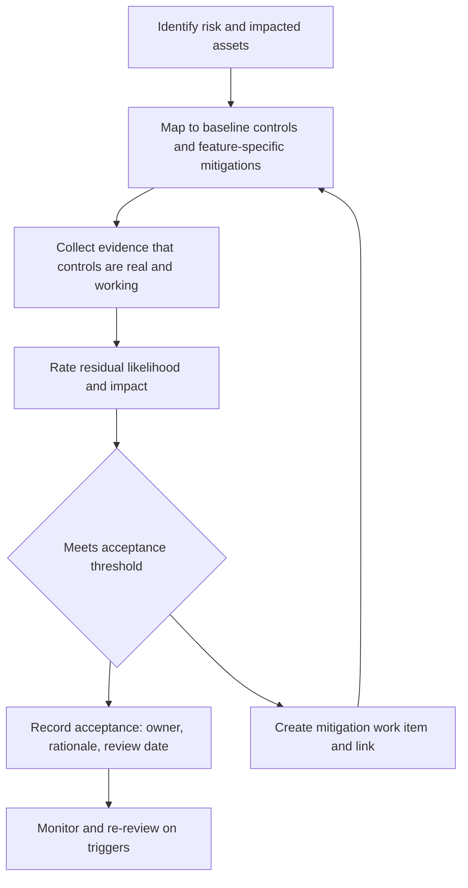

<!-- [KFM_META_BLOCK_V2]
doc_id: kfm://doc/8f0a3c3f-0a3d-4f2e-8c11-9f22b6a0c1d7
title: Residual Risk Register
type: standard
version: v1
status: draft
owners:
  - TBD
created: 2026-03-01
updated: 2026-03-01
policy_label: restricted
related:
  - TBD
tags:
  - kfm
  - security
  - threat-model
  - residual-risk
notes:
  - Tracks residual risk after baseline KFM controls (trust membrane, Promotion Contract gates, policy tests, evidence resolver, cite-or-abstain).
[/KFM_META_BLOCK_V2] -->

# Residual Risk Register
Records what risk remains *after* KFM’s baseline controls and what we will (and will not) accept.


---

## Quick navigation
- [Purpose](#purpose)
- [Scope](#scope)
- [Where this fits](#where-this-fits)
- [Baseline controls](#baseline-controls)
- [Residual risk workflow](#residual-risk-workflow)
- [Scoring rubric](#scoring-rubric)
- [Residual risk register](#residual-risk-register-1)
- [Review & governance](#review--governance)
- [Templates](#templates)

---

## Purpose
This document is the **residual risk register** for KFM: risks that remain *even if* baseline governance controls are implemented and operating correctly.

Residual risk is **expected** in real systems. The goal is not “zero risk,” but:
- to make risk explicit,
- to tie risk decisions to evidence (tests, receipts, policy decisions),
- to ensure risk acceptance is reviewed and reversible.

> **WARNING**
> Do **not** mark a mitigation as “implemented” unless you can link to concrete repo evidence (policy tests, CI jobs, receipts, manifests, or deployed config).
> The KFM briefs explicitly warn against claiming module/feature existence until verified in the live repo.  
> (See “Minimum verification steps” below.)

[Back to top](#residual-risk-register)

---

## Scope
| In scope | Out of scope |
|---|---|
| Residual risks across the KFM truth path and trust surfaces (ingest → catalog → governed API → UI → Focus Mode). | Full STRIDE/LINDDUN-style threat modeling for every component (use threat-model docs for that). |
| Risks tied to governance invariants: **trust membrane**, **Promotion Contract gates**, **policy tests**, **evidence resolver**, **audit receipts**. | Day-to-day incident response playbooks (ops runbooks should cover). |
| Risks introduced by sensitive data handling (licensing, sensitive locations, policy labels). | A complete asset inventory / SBOM (track separately, but link here). |

[Back to top](#residual-risk-register)

---

## Where this fits
This document lives in **`docs/architecture/…`** because it is part of the system design + governance posture.

### Repository context (intended)
| Area | Path | What belongs here |
|---|---|---|
| Architecture docs | `docs/architecture/` | System design docs, blueprints, ADRs, security posture, threat model artifacts |
| Threat model | `docs/architecture/threat-model/` | Threat model checklist, residual risk register, threat/abuse case notes |

> **NOTE**
> If these directories don’t exist yet in the repo, create them as part of the same PR that introduces this file.

[Back to top](#residual-risk-register)

---

## Definitions
- **Risk**: possibility that a threat/vulnerability causes harm.
- **Mitigation / control**: a technical or process measure that reduces likelihood and/or impact.
- **Residual risk**: the remaining risk *after* mitigations are applied.
- **Risk acceptance**: explicit decision that residual risk is tolerable (with owner + review date).
- **Evidence**: artifacts that make a claim inspectable and reproducible (tests, receipts, manifests, validation outputs).

[Back to top](#residual-risk-register)

---

## Baseline controls
This register assumes KFM’s documented baseline controls exist as **enforceable behaviors** (not just intentions). When they don’t, treat related residual risk as **higher** until proven otherwise.

### Baseline invariants (security-relevant)
- **Truth path lifecycle** (zones + promotion gates; fail closed)
- **Trust membrane** (clients never access storage/DB directly; all access via governed APIs; backend logic uses repository interfaces)
- **Policy-safe errors** (prevent inference of restricted data via errors/timing)
- **Evidence-first citations** (EvidenceRefs resolve to EvidenceBundles; hard verification gate)
- **Audit receipts** (every governed run produces a receipt)

### Threat model checklist mapping (baseline review prompts)
Use the numbered checklist items in the **Threat Model Checklist** when reviewing any feature/dataset release (see Appendix: “Threat Model Checklist IDs” below).

[Back to top](#residual-risk-register)

---

## Residual risk workflow



### Required evidence for “mitigation implemented”
A mitigation can only be considered implemented if it has at least one of:
- a **CI gate/test** that fails closed when the mitigation regresses,
- a **policy test fixture** demonstrating allow/deny behavior,
- a **run receipt / manifest** showing the mitigation applied (e.g., redaction/generalization),
- a **deployed config** (e.g., network policy) plus verification evidence.

[Back to top](#residual-risk-register)

---

## Scoring rubric

### Likelihood (L)
| Score | Label | Meaning (practical) |
|---:|---|---|
| 1 | Rare | Requires multiple unlikely failures; no known path. |
| 2 | Unlikely | Feasible but not expected; strong controls. |
| 3 | Possible | Known path exists; could occur under stress/misconfig. |
| 4 | Likely | Expected without continuous controls/monitoring. |
| 5 | Almost certain | Happens regularly or is trivial to trigger. |

### Impact (I)
| Score | Label | Meaning (practical) |
|---:|---|---|
| 1 | Negligible | Minor annoyance; no data/policy impact. |
| 2 | Low | Limited user impact; reversible with minimal effort. |
| 3 | Medium | Meaningful service degradation or limited data leak. |
| 4 | High | Major service compromise, major data/policy violation. |
| 5 | Critical | Severe harm (safety/legal/community), broad compromise, irreversible exposure. |

### Residual risk rating (R)
Default: `R = L × I`  
Recommended bands:
- **Low**: 1–4
- **Moderate**: 5–9
- **High**: 10–16
- **Critical**: 17–25

> **NOTE**
> Bands are defaults. Governance may set stricter thresholds per dataset class or policy label.

[Back to top](#residual-risk-register)

---

## Residual risk register

### Register columns
- **Initial L/I**: starting estimate from the (starter) risk register.
- **Residual L/I**: re-estimated after verifying mitigations in repo and runtime.
- **Decision**: Accept / Mitigate / Transfer / Avoid.
- **Evidence required**: minimum artifacts needed to justify the residual rating.

### Seed entries (from KFM starter risk register)
> These entries are copied as *seed risks*. Residual ratings are **TBD** until mitigations are verified with evidence.

| Risk ID | Risk | Baseline mitigation direction | Initial L/I | Residual L/I | Decision | Evidence required (minimum) | Owner | Next review |
|---|---|---|---|---|---|---|---|---|
| RISK-001 | Policy bypass via direct DB/storage access | Enforce trust membrane; network policies; code reviews; tests | M / H | TBD | TBD | E2E test proving UI cannot bypass API; network policy manifests; static analysis guardrails | TBD | TBD |
| RISK-002 | Licensing violation (unlicensed media mirrored) | Promotion gate requires rights metadata; metadata-only mode; steward review | M / H | TBD | TBD | Gate B CI checks; registry entries contain license/terms snapshot; publish gate blocks missing rights | TBD | TBD |
| RISK-003 | Sensitive location leakage (archaeology, species) | Restricted precise datasets + public generalized derivatives; redaction tests; default-deny | M / H | TBD | TBD | OPA fixtures for policy_label; redaction/generalization pipeline evidence; Focus/UI leakage tests | TBD | TBD |
| RISK-004 | Non-resolvable citations (broken evidence links) | Evidence resolver contract; citation linting in CI; story publish gate | H / H | TBD | TBD | Link checker + evidence resolver tests; publish gates fail closed on broken citations | TBD | TBD |
| RISK-005 | Hash drift and version confusion | Canonical JSON hashing; golden hash tests; store hashed spec | M / H | TBD | TBD | spec_hash library + golden tests; CI blocks drift; manifests carry spec_hash | TBD | TBD |
| RISK-006 | Ontology drift in entity resolution | Separate candidate vs asserted merges; steward-only sameAs; audit trail | M / M-H | TBD | TBD | Steward-only write path; audit records; tests blocking uncontrolled merges | TBD | TBD |
| RISK-007 | Performance collapse on large layers | PMTiles/vector tiles; caching; progressive disclosure; benchmarks | M / M-H | TBD | TBD | Benchmark suite; perf budgets; regression alerts; tile strategy documented | TBD | TBD |
| RISK-008 | Focus Mode hallucination or restricted leakage | Cite-or-abstain with citation verifier; evaluation harness; policy pre-checks | M / H | TBD | TBD | Focus evaluation harness; citation verification hard gate; refusal correctness tests | TBD | TBD |
| RISK-009 | Upstream data changes break ingestion | Snapshot raw; pin queries; monitor drift; quarantine on failures | H / M | TBD | TBD | RAW manifests + checksums; drift detection; quarantine rules; receipts for failures | TBD | TBD |
| RISK-010 | Contributor confusion and inconsistent artifacts | Templates; validators; playbooks; CODEOWNERS; onboarding docs | H / M | TBD | TBD | Templates + validators in CI; doc standards; onboarding checklist; CODEOWNERS | TBD | TBD |
| RISK-011 | Audit logs contain PII | Log redaction; retention policy; restricted access | M / H | TBD | TBD | Log scrubber tests; access controls; retention policy; audit log schema review | TBD | TBD |
| RISK-012 | Community harm from narrative framing | Review triggers; community governance; multiple perspectives; uncertainty labeling | M / H | TBD | TBD | Story publish workflow requires review; sensitive-topic triggers; editorial QA checklist | TBD | TBD |

[Back to top](#residual-risk-register)

---

## Review & governance

### Proposed default acceptance thresholds
> Governance can override these, but defaults should be explicit.

- **Low / Moderate** residual risk: can be accepted with a named owner and a review date.
- **High** residual risk: requires an active mitigation plan *before* broad release.
- **Critical** residual risk: must be avoided or mitigated before release; escalation required.

### Review triggers (minimum)
Re-review relevant risks whenever any of the following changes:
- new dataset version is promoted to **PUBLISHED**
- policy pack changes (OPA/Rego) or obligations change
- new export/download path is introduced
- Focus Mode orchestration changes (retrieval, tools, citation verification)
- new sensitive dataset onboarded (sensitive locations / PII / restricted policy_label)

### Minimum verification steps (to convert “TBD” → evidence-backed)
Use this checklist to avoid “paper mitigations”:

- [ ] Capture repo commit hash and root directory tree.
- [ ] Confirm which work packages already exist (search for spec_hash, policy tests, validators, evidence resolver route).
- [ ] Extract CI gate list from workflows and document which checks block merges.
- [ ] Pick one MVP dataset and verify it can be promoted end-to-end with receipts + catalogs.
- [ ] Validate UI cannot bypass the governed API (static analysis + network policies).
- [ ] For Focus Mode: run the evaluation harness and store golden outputs/diffs as artifacts.

[Back to top](#residual-risk-register)

---

## Templates

### Template: add a new residual risk entry
Copy/paste and fill (do not delete fields; use `TBD` if unknown):

```md
#### RISK-XXX — <short name>

- **Description:** <what can go wrong>
- **Threat actors / failure modes:** <who/what causes it>
- **Impacted assets:** <data, system, community, legal, trust>
- **Baseline controls:** <trust membrane / gates / policy tests / evidence resolver / receipts>
- **Additional mitigations:** <feature-specific controls>
- **Initial L/I:** <from risk register or estimate>
- **Residual L/I:** <after evidence>
- **Decision:** Accept | Mitigate | Transfer | Avoid
- **Acceptance rationale:** <why acceptable, what assumptions>
- **Evidence links:** <CI, tests, receipts, manifests, configs>
- **Owner:** <role/name>
- **Next review date:** YYYY-MM-DD
```

### Template: risk acceptance record (minimal)
```json
{
  "risk_id": "RISK-XXX",
  "accepted_by_role": "steward|security|owner",
  "accepted_by_principal": "TBD",
  "accepted_at": "YYYY-MM-DD",
  "residual_likelihood": "TBD",
  "residual_impact": "TBD",
  "rationale": "TBD",
  "evidence": [
    { "type": "ci_check|policy_test|receipt|manifest|config", "ref": "TBD" }
  ],
  "review_by": "YYYY-MM-DD"
}
```

---

## Appendix: Threat Model Checklist IDs (reference)
Keep this list aligned with the authoritative checklist doc.  
(IDs included here as a convenient mapping index; do not treat as complete threat modeling.)

- TM-001 Trust membrane enforced (no direct storage/DB access from frontend)
- TM-002 No restricted inference via errors/timing
- TM-003 Exports/downloads checked against policy labels + rights
- TM-004 Focus Mode prompt injection defenses present
- TM-005 Audit logs redacted + access controlled
- TM-006 Pipeline credentials scoped + rotated
- TM-007 Processed artifacts immutable by digest
- TM-008 Policy rules tested in CI with fixtures

[Back to top](#residual-risk-register)
