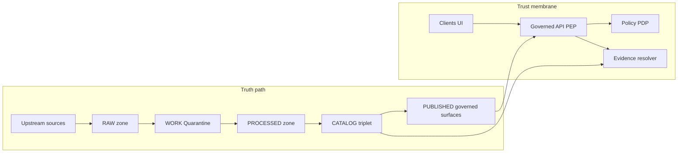

<!-- [KFM_META_BLOCK_V2]
doc_id: kfm://doc/aab705ed-eadb-4fb9-9963-a7c1fe2aa07e
title: KFM Threat Model Risk Register
type: standard
version: v1
status: draft
owners: security, governance-stewards
created: 2026-03-01
updated: 2026-03-01
policy_label: restricted
related:
  - docs/architecture/README.md
  - docs/architecture/threat-model/README.md
  - policy/
  - contracts/
tags: [kfm, security, threat-model, risk-register]
notes:
  - Living register. Update via PR; link each risk to mitigations + tests.
  - Default-deny when uncertain; avoid leaking restricted existence in public docs.
[/KFM_META_BLOCK_V2] -->

# KFM Threat Model Risk Register
**Purpose:** A governed, auditable register of security, privacy, and integrity risks for the Kansas Frontier Matrix (KFM) architecture — linked to mitigations, tests, and decision records.


**Owners:** `security` + `governance-stewards`  
**Reviewers:** `platform-ops`, `data-stewards`, `ui-leads`  
**Update path:** PR required • CODEOWNERS enforced • Review required for **risk acceptance**.

---

## Quick navigation
- [Scope](#scope)
- [System context](#system-context)
- [Scoring](#scoring)
- [Risk register](#risk-register)
- [Risk details](#risk-details)
- [Metrics and monitoring](#metrics-and-monitoring)
- [Workflow](#workflow)
- [Change log](#change-log)

---

## Scope
This register covers the end-to-end KFM system:

- **Truth path** zones: *Upstream → RAW → WORK/Quarantine → PROCESSED → CATALOG (DCAT/STAC/PROV) → PUBLISHED*
- **Trust membrane**: governed API + policy + evidence resolution as the only access path for clients.
- **User surfaces**: Map Explorer, Story Mode, Focus Mode.
- **Operational platform**: CI gates, pipeline execution, deployments, audit logging, and incident response.

**Out of scope (for this file):**
- Low-level vulnerability remediation steps (track those in tickets and security runbooks).
- Vendor-specific guidance (IdP, cloud provider, SIEM) unless adopted and documented elsewhere.
- Non-security product risks (feature prioritization, UX polish) unless they create governance bypass risk.

---

## System context

### Architecture sketch


### Threat-modeling lenses
We tag risks using a lightweight STRIDE-style taxonomy:

- **S**poofing (identity/auth)
- **T**ampering (integrity, provenance)
- **R**epudiation (auditability)
- **I**nformation disclosure (privacy, sensitive locations, rights)
- **D**enial of service (availability)
- **E**levation of privilege (bypass/abuse)

---

## Scoring

### Likelihood (L)
| Level | Meaning |
|---|---|
| Low | Uncommon; requires unlikely preconditions; strong controls exist |
| Medium | Plausible; controls exist but are imperfect or incomplete |
| High | Likely; weak/absent controls or frequent exposure |

### Impact (I)
| Level | Meaning |
|---|---|
| Low | Minor operational impact; limited data exposure; reversible |
| Medium | Material service disruption or policy breach; limited users/data |
| High | Major governance failure, sensitive leakage, legal exposure, or systemic compromise |

### Severity matrix (L × I)
|  | **Impact: Low** | **Impact: Medium** | **Impact: High** |
|---|---:|---:|---:|
| **Likelihood: Low** | Low | Medium | High |
| **Likelihood: Medium** | Medium | High | Critical |
| **Likelihood: High** | High | Critical | Critical |

> **Rule:** Anything that can leak restricted locations, violate licensing, or bypass the trust membrane is treated as **High/Critical** until proven otherwise.

---

## Risk register

Legend: **Origin** = `CONFIRMED` (in KFM governance docs) vs `PROPOSED` (added here; verify in repo).  
Statuses: `open` • `mitigating` • `accepted` • `transferred` • `closed`

| ID | Risk | STRIDE | L | I | Severity | Status | Owner role | Origin |
|---|---|---|---:|---:|---|---|---|---|
| RISK-001 | Policy bypass via direct DB/storage access | E | Med | High | **Critical** | open | platform-ops + security | CONFIRMED |
| RISK-002 | Licensing violation (unlicensed media mirrored) | I | Med | High | **Critical** | open | governance-steward | CONFIRMED |
| RISK-003 | Sensitive location leakage (archaeology, species) | I | Med | High | **Critical** | open | governance-steward + security | CONFIRMED |
| RISK-004 | Non-resolvable citations (broken evidence links) | T/R | High | High | **Critical** | open | platform-ops | CONFIRMED |
| RISK-005 | Hash drift and version confusion | T | Med | High | **Critical** | open | data-engineering | CONFIRMED |
| RISK-006 | Ontology drift in entity resolution | T | Med | Med | **High** | open | governance-steward | CONFIRMED |
| RISK-007 | Performance collapse on large layers | D | Med | Med | **High** | open | platform-ops | CONFIRMED |
| RISK-008 | Focus Mode hallucination or restricted leakage | I | Med | High | **Critical** | open | security + ai-ops | CONFIRMED |
| RISK-009 | Upstream data changes break ingestion | D/T | High | Med | **High** | open | data-engineering | CONFIRMED |
| RISK-010 | Contributor confusion and inconsistent artifacts | R/T | High | Med | **High** | open | platform-ops + docs-owners | CONFIRMED |
| RISK-011 | Audit logs contain PII or restricted content | I | Med | High | **Critical** | open | security + platform-ops | CONFIRMED |
| RISK-012 | Community harm from narrative framing | I | Med | High | **Critical** | open | governance council | CONFIRMED |
| RISK-013 | Supply-chain compromise (deps/images) | T/E | Med | High | **Critical** | open | security + platform-ops | PROPOSED |
| RISK-014 | Secret leakage (CI logs, env, client bundle) | I/E | Med | High | **Critical** | open | security + platform-ops | PROPOSED |
| RISK-015 | Cluster network segmentation gaps | E/I | Med | High | **Critical** | open | platform-ops | PROPOSED |
| RISK-016 | Story content XSS or unsafe markdown rendering | T/I | Med | High | **Critical** | open | ui-leads + security | PROPOSED |
| RISK-017 | API abuse or DoS (expensive bbox/time queries) | D | Med | Med | **High** | open | platform-ops | PROPOSED |
| RISK-018 | Model prompt injection via documents / OCR | T/I | Med | High | **Critical** | open | security + ai-ops | PROPOSED |

> TIP: Keep the table “index-like”. Put implementation details in the [Risk details](#risk-details) section so changes stay reviewable.

---

## Risk details

Use this template for **every** risk. Keep it short, link to deeper artifacts.

### Template
```text
ID:
Title:
Status:
Owner:
STRIDE:
Threat scenario:
Assets impacted:
Controls (current):
Mitigations (planned):
Detection & monitoring:
Acceptance criteria:
Evidence/tests/ADRs:
Minimum verification steps:
Last reviewed:
Next review:
```

---

<details>
<summary><strong>RISK-001 — Policy bypass via direct DB/storage access</strong></summary>

- **Status:** open  
- **Owner:** platform-ops + security  
- **STRIDE:** Elevation of privilege  
- **Threat scenario:** A client, service, or compromised workload accesses canonical storage or rebuildable projections directly (DB/object store/index) without going through the governed API + policy enforcement.  
- **Assets impacted:** Restricted datasets, public dataset integrity, auditability, policy obligations.  
- **Controls (current):** *Unknown in repo* (must verify network policies, IAM boundaries, and code paths).  
- **Mitigations (planned):**
  - Enforce the **trust membrane**: clients talk only to governed APIs.
  - Network segmentation and “default deny” posture for east-west traffic.
  - CI checks / static analysis forbidding direct storage clients in UI code.
  - Contract tests: “policy enforced for every data path.”
- **Detection & monitoring:** Alerts on direct DB connections; audit logs for denied policy decisions; anomaly detection on object-store reads.  
- **Acceptance criteria:** No authenticated or public client can access storage directly; tests exist that fail when bypasses are introduced.  
- **Evidence/tests/ADRs:** TODO: link to ADR on trust membrane; link to network policy manifests; link to contract tests.  
- **Minimum verification steps:**
  - Confirm network policy / firewall rules for DB and object store.
  - Confirm services use repository interfaces (no direct DB from clients).
  - Add a test that fails if UI bundles include privileged endpoints.

</details>

<details>
<summary><strong>RISK-002 — Licensing violation (unlicensed media mirrored)</strong></summary>

- **Status:** open  
- **Owner:** governance-steward  
- **STRIDE:** Information disclosure / compliance  
- **Threat scenario:** KFM ingests or publishes artifacts without rights to redistribute (e.g., archives where “online availability does not equal permission”).  
- **Assets impacted:** Legal/compliance posture, platform reputation, downstream users.  
- **Controls (current):** Promotion gates (expected); steward review (expected).  
- **Mitigations (planned):**
  - Promotion gate requires license + rights holder per distribution.
  - “Metadata-only reference” mode for restricted redistribution cases.
  - Exports auto-attach attribution + license text.
  - Story publishing blocked if rights are unclear for included media.
- **Detection & monitoring:** CI checks for missing license fields; audits on exports/download endpoints.  
- **Acceptance criteria:** 100% of promoted artifacts have explicit rights metadata; violations are blocked before publish.  
- **Evidence/tests/ADRs:** TODO: link to rights rubric; link to promotion gate tests.  
- **Minimum verification steps:** Sample 3 datasets and verify rights metadata exists and is enforced in API and UI.

</details>

<details>
<summary><strong>RISK-003 — Sensitive location leakage (archaeology, species)</strong></summary>

- **Status:** open  
- **Owner:** governance-steward + security  
- **STRIDE:** Information disclosure  
- **Threat scenario:** Precise coordinates or sensitive metadata leak via tiles, Story Nodes, Focus Mode answers, logs, or error-message side-channels.  
- **Assets impacted:** Vulnerable sites/species, community trust, compliance with CARE/ethics constraints.  
- **Controls (current):** Sensitivity labels + obligations (expected).  
- **Mitigations (planned):**
  - Default deny for restricted/sensitive-location datasets.
  - Produce separate **public_generalized** dataset versions where allowed.
  - Never leak restricted existence through 403/404 differences.
  - Record generalization/redaction transforms in provenance.
- **Detection & monitoring:** Regression tests on restricted queries; “leakage” unit tests; log-scrub checks.  
- **Acceptance criteria:** Public users cannot retrieve precise sensitive coordinates; generalized outputs show a policy notice.  
- **Evidence/tests/ADRs:** TODO: link to sensitivity rubric; link to redaction/generalization tests.  
- **Minimum verification steps:** Run Focus Mode evaluation harness against restricted fixtures; confirm coordinates are generalized/withheld.

</details>

<details>
<summary><strong>RISK-004 — Non-resolvable citations (broken evidence links)</strong></summary>

- **Status:** open  
- **Owner:** platform-ops  
- **STRIDE:** Tampering / repudiation  
- **Threat scenario:** EvidenceRefs used in Story Nodes or Focus Mode answers fail to resolve, are stale, or point to non-inspectable artifacts — undermining “cite-or-abstain”.  
- **Assets impacted:** Trust surfaces, reproducibility, governance contract.  
- **Controls (current):** Link-checkers and publish gates (expected).  
- **Mitigations (planned):**
  - Evidence resolver contract tests.
  - CI citation linting and link-checking for any changed catalogs/stories.
  - Story publish gate: *block* if any citation fails to resolve.
- **Detection & monitoring:** CI metrics: “% resolvable citations”; runtime metrics: evidence resolver error rate and latency.  
- **Acceptance criteria:** 100% citations resolve for allowed users; failures cause abstention or block publishing.  
- **Evidence/tests/ADRs:** TODO: link to evidence resolver contract; link to CI gate docs.

</details>

<details>
<summary><strong>RISK-008 — Focus Mode hallucination or restricted leakage</strong></summary>

- **Status:** open  
- **Owner:** security + ai-ops  
- **STRIDE:** Information disclosure / tampering  
- **Threat scenario:** Focus Mode answers without evidence support (“hallucination”) or reveals restricted facts through prompt injection, retrieval mistakes, or synthesis bugs.  
- **Assets impacted:** Data confidentiality, user trust, governance posture.  
- **Controls (current):** “Cite-or-abstain” design; citation verification hard gate (expected).  
- **Mitigations (planned):**
  - Control loop: policy pre-check → retrieval → evidence bundling → synthesis → **citation verification hard gate** → receipt.
  - Tool allowlist; never allow model to call arbitrary tools.
  - Content filtering/redaction obligations applied *before* text reaches synthesis for restricted datasets.
  - Evaluation harness: golden queries, refusal correctness, leakage tests.
- **Detection & monitoring:** CI regression diffs on golden queries; production sampling with human review; alert on citation verification failures.  
- **Acceptance criteria:** For any user role, every factual claim is backed by resolvable evidence bundles or the response abstains.  
- **Evidence/tests/ADRs:** TODO: link to Focus Mode harness; link to refusal policy.

</details>

<details>
<summary><strong>RISK-011 — Audit logs contain PII or restricted content</strong></summary>

- **Status:** open  
- **Owner:** security + platform-ops  
- **STRIDE:** Information disclosure / repudiation  
- **Threat scenario:** Audit receipts/logs capture sensitive user identifiers, restricted dataset identifiers, or precise locations, and are accessible too broadly or retained too long.  
- **Assets impacted:** Users, partners, governance integrity.  
- **Controls (current):** *Unknown in repo* (must verify retention policy + access controls).  
- **Mitigations (planned):**
  - Redact logs by default; treat audit logs as sensitive datasets.
  - Restrict access by role; implement retention windows; immutable storage for required compliance records only.
  - Ensure error messages are policy-safe and do not enumerate restricted objects.
- **Detection & monitoring:** Periodic log sampling; automated scanners for PII patterns; access-audit alerts.  
- **Acceptance criteria:** Logs/receipts are policy-labeled, redacted, and access-controlled; retention policy is enforced.  
- **Evidence/tests/ADRs:** TODO: link to audit retention policy doc; link to log redaction tests.

</details>

<details>
<summary><strong>RISK-005 — Hash drift and version confusion</strong></summary>

- **Status:** open  
- **Owner:** data-engineering  
- **STRIDE:** Tampering  
- **Threat scenario:** Dataset/spec hashes change across OS/tooling or are computed inconsistently, leading to version ambiguity, cache poisoning, or “what changed?” being untrustworthy.  
- **Mitigations (planned):**
  - Canonical JSON hashing (e.g., RFC 8785 / JCS) for specs and identifiers.
  - Golden-hash tests in CI; store hashed spec as an artifact.
  - Treat dataset_id + dataset_version_id as immutable identifiers.
- **Detection & monitoring:** CI failures on hash drift; alert when a “rebuild” changes canonical outputs unexpectedly.  
- **Evidence/tests/ADRs:** TODO: link to spec_hash implementation + tests.

</details>

<details>
<summary><strong>RISK-006 — Ontology drift in entity resolution</strong></summary>

- **Status:** open  
- **Owner:** governance-steward  
- **STRIDE:** Tampering  
- **Threat scenario:** Entity resolution/“sameAs” links drift over time, collapsing distinct entities or producing inconsistent joins that alter story conclusions.  
- **Mitigations (planned):**
  - Separate candidate merges from asserted merges.
  - Restrict “asserted sameAs” to steward-approved actions.
  - Maintain an audit trail for merges and rollbacks.
- **Evidence/tests/ADRs:** TODO: link to entity-resolution policy and tests.

</details>

<details>
<summary><strong>RISK-007 — Performance collapse on large layers</strong></summary>

- **Status:** open  
- **Owner:** platform-ops  
- **STRIDE:** Denial of service  
- **Threat scenario:** Large datasets or unbounded queries cause unacceptable latency or outage for map tiles, search, or evidence resolution.  
- **Mitigations (planned):**
  - Use prebuilt vector tiles (e.g., PMTiles) for large public layers.
  - Caching and progressive disclosure in UI.
  - Benchmarks and P95 SLOs in CI/release gates.
- **Evidence/tests/ADRs:** TODO: link to tile strategy ADR and benchmarks.

</details>

<details>
<summary><strong>RISK-009 — Upstream data changes break ingestion</strong></summary>

- **Status:** open  
- **Owner:** data-engineering  
- **STRIDE:** Denial of service / tampering  
- **Threat scenario:** Upstream providers change schemas, endpoints, or semantics, silently corrupting derived datasets or breaking ingestion runs.  
- **Mitigations (planned):**
  - Snapshot RAW inputs and terms.
  - Pin upstream queries/parameters; monitor drift.
  - Quarantine on failures; require re-validation before promotion.
- **Evidence/tests/ADRs:** TODO: link to connector playbook + drift monitors.

</details>

<details>
<summary><strong>RISK-010 — Contributor confusion and inconsistent artifacts</strong></summary>

- **Status:** open  
- **Owner:** platform-ops + docs-owners  
- **STRIDE:** Repudiation / tampering  
- **Threat scenario:** Contributors produce datasets/stories that “look right” but omit required artifacts (rights metadata, receipts, catalogs), weakening governance and reproducibility.  
- **Mitigations (planned):**
  - Templates + validators + playbooks.
  - CODEOWNERS enforcement.
  - CI gates that fail closed on missing/invalid artifacts.
- **Evidence/tests/ADRs:** TODO: link to onboarding docs and CI gates.

</details>

<details>
<summary><strong>RISK-012 — Community harm from narrative framing</strong></summary>

- **Status:** open  
- **Owner:** governance council  
- **STRIDE:** Information disclosure / harm  
- **Threat scenario:** Story Nodes or Focus Mode outputs create social harm (misrepresentation, stigmatization, culturally restricted knowledge exposure) even if technically “allowed”.  
- **Mitigations (planned):**
  - Review triggers for sensitive topics; community governance.
  - Multiple perspectives; uncertainty labeling.
  - Ability to retract/replace narratives with audit trail.
- **Evidence/tests/ADRs:** TODO: link to story review workflow and community guidelines.

</details>

<details>
<summary><strong>RISK-013 — Supply-chain compromise (deps/images)</strong></summary>

- **Status:** open (PROPOSED)  
- **Owner:** security + platform-ops  
- **STRIDE:** Tampering / elevation of privilege  
- **Threat scenario:** Malicious dependency, compromised container image, or poisoned build artifact leads to code execution or data exfiltration.  
- **Mitigations (planned):**
  - Dependency scanning + SBOM generation in CI.
  - Image digest pinning; signed builds/attestations (where feasible).
  - Least-privilege runtime identities and network controls.
- **Evidence/tests/ADRs:** TODO: link to SBOM and signing strategy.

</details>

<details>
<summary><strong>RISK-014 — Secret leakage (CI logs, env, client bundle)</strong></summary>

- **Status:** open (PROPOSED)  
- **Owner:** security + platform-ops  
- **STRIDE:** Information disclosure / elevation of privilege  
- **Threat scenario:** Credentials or tokens appear in CI logs, crash dumps, story content, or client-side bundles; attacker reuses them.  
- **Mitigations (planned):**
  - Secret scanning; prohibit secrets in client bundles.
  - Redact logs and restrict access; short-lived tokens.
  - Rotate credentials and enforce least privilege.
- **Evidence/tests/ADRs:** TODO: link to secret management/runbook.

</details>

<details>
<summary><strong>RISK-015 — Cluster network segmentation gaps</strong></summary>

- **Status:** open (PROPOSED)  
- **Owner:** platform-ops  
- **STRIDE:** Elevation of privilege / information disclosure  
- **Threat scenario:** Missing or inconsistent network policies allow unintended east-west traffic, including access to databases or policy components.  
- **Mitigations (planned):**
  - Establish “default deny” network policy posture for application namespaces.
  - Labeling strategy for microservices to simplify policy maintenance.
  - Continuous verification for newly created namespaces.
- **Evidence/tests/ADRs:** TODO: link to cluster network policy baseline.

</details>

<details>
<summary><strong>RISK-016 — Story content XSS or unsafe markdown rendering</strong></summary>

- **Status:** open (PROPOSED)  
- **Owner:** ui-leads + security  
- **STRIDE:** Tampering / information disclosure  
- **Threat scenario:** Malicious story markdown or embedded HTML/JS executes in the browser, stealing tokens or altering UI behavior.  
- **Mitigations (planned):**
  - Sanitize markdown rendering; CSP headers.
  - Disallow raw HTML in user-submitted content unless explicitly reviewed.
  - Security tests for injection vectors.
- **Evidence/tests/ADRs:** TODO: link to UI security standards and sanitizer configuration.

</details>

<details>
<summary><strong>RISK-017 — API abuse or DoS (expensive bbox/time queries)</strong></summary>

- **Status:** open (PROPOSED)  
- **Owner:** platform-ops  
- **STRIDE:** Denial of service  
- **Threat scenario:** Attackers or heavy clients issue expensive queries (wide bbox, long time windows) that exhaust CPU/IO, degrading service.  
- **Mitigations (planned):**
  - Rate limiting, query budgets, and pagination defaults.
  - Caching and precomputed tiles for common views.
  - WAF rules for abusive patterns.
- **Evidence/tests/ADRs:** TODO: link to API rate-limit config and load tests.

</details>

<details>
<summary><strong>RISK-018 — Model prompt injection via documents / OCR</strong></summary>

- **Status:** open (PROPOSED)  
- **Owner:** security + ai-ops  
- **STRIDE:** Tampering / information disclosure  
- **Threat scenario:** Malicious text inside documents (OCR, notes, scraped pages) instructs the model to reveal secrets, ignore policy, or fabricate citations.  
- **Mitigations (planned):**
  - Tool allowlist; policy pre-check; evidence resolver as sole citation source.
  - Redaction before synthesis for restricted datasets.
  - Evaluation harness tests specifically for prompt injection strings.
- **Evidence/tests/ADRs:** TODO: link to Focus Mode security tests.

</details>

---

## Metrics and monitoring
Track metrics that reveal governance drift without incentivizing bad behavior:

- **% promoted artifacts with explicit license metadata**
- **% Story Nodes with 100% resolvable citations**
- **Evidence resolver latency (P95)**
- **Tile serving latency (P95) for public layers**
- **Reindex time from processed artifacts**
- **Count of quarantined datasets (by reason code)**
- **Count of policy denials (by reason code)**

> NOTE: Metrics should drive investigation, not scorekeeping. If a metric can be gamed, it will be.

---

## Workflow

### Updating this register
1. Add/edit risks via PR.
2. For each risk:
   - Update the table row
   - Add/refresh the detail card
   - Link to mitigations (tickets) and the test/ADR that enforces it
3. Require reviewer sign-off:
   - **security** for Critical risks
   - **governance-stewards** for anything involving licensing/sensitivity/community constraints
4. Record “accepted” risks with a rationale and expiry date.

### Risk acceptance rules
- Risk may be marked **accepted** only with:
  - a documented rationale,
  - a named owner,
  - an expiration date,
  - compensating controls,
  - and a plan to revisit.

---

## Change log
- **2026-03-01:** Initial risk register created (seeded from KFM governance docs; expanded with proposed platform security risks).# Risk Register

Placeholder for architecture documentation.
