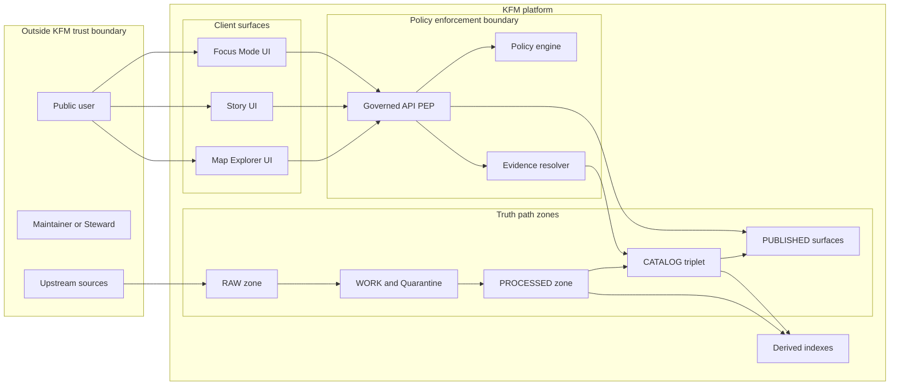

<!-- [KFM_META_BLOCK_V2]
doc_id: kfm://doc/c0b5e8f2-02c9-4c50-9a0b-0b26f6ea1e43
title: Threat Model — Scope and Assets
type: standard
version: v1
status: draft
owners: KFM Architecture & Governance
created: 2026-03-01
updated: 2026-03-01
policy_label: restricted
related:
  - docs/architecture/threat-model/
tags: [kfm, security, threat-model, scope, assets]
notes:
  - Defines what is in/out of scope for the KFM threat model and enumerates assets to protect.
  - Keep this file free of secrets; reference secret management docs instead.
[/KFM_META_BLOCK_V2] -->

# Threat Model — Scope and Assets

**Purpose:** Define what is in scope for KFM security review and enumerate the assets the system must protect across ingestion → catalogs/provenance → governed API (PEP) → Map/Story/Focus UI surfaces.

> [!WARNING]
> This doc should **not** include credentials, secret names, access tokens, IPs, bucket names, or vendor account IDs.
> Treat anything “operationally actionable” as **restricted** and move it to a separate, access-controlled runbook.

---

## Quick navigation

- [Context](#context)
- [Scope](#scope)
- [System boundaries](#system-boundaries)
- [Assets](#assets)
- [Asset classification](#asset-classification)
- [Primary trust boundaries and entry points](#primary-trust-boundaries-and-entry-points)
- [Assumptions](#assumptions)
- [Out of scope](#out-of-scope)
- [Definition of done](#definition-of-done)
- [Unknowns to verify](#unknowns-to-verify)
- [Change log](#change-log)

---

## Context

KFM is a **governed, evidence-first** system where **public-facing outputs (maps, stories, AI answers)** are expected to be traceable to **versioned sources** with **policy controls enforced in CI and at runtime**.

This file is the starting point for threat modeling:
- what we protect (assets),
- where we enforce trust (boundaries),
- and what subsystems are in-scope.

---

## Scope

### In scope

This threat model covers **end-to-end KFM** as a governed system:

1. **Truth path / promotion workflow**
   - upstream acquisition & snapshotting
   - lifecycle zones (RAW → WORK/QUARANTINE → PROCESSED → CATALOG/TRIPLET → PUBLISHED)
   - promotion gates (identity, licensing, sensitivity, catalog validation, run receipts, policy tests)

2. **Trust membrane and runtime surfaces**
   - Map/Story/Focus UIs
   - Governed API / Policy Enforcement Point (PEP)
   - policy engine (policy-as-code)
   - evidence resolver and evidence drawer surfaces
   - downloads/exports behavior and error semantics

3. **Build + governance enforcement**
   - CI checks that block promotion and merge
   - policy tests, schema validation, contract tests
   - provenance artifacts (run receipts, audit records)
   - release/promotion manifests

### What “security” means here

KFM security is not only classical CIA. It also includes:
- **policy correctness** (default-deny when uncertain),
- **evidence integrity** (citations resolve to immutable artifacts),
- **non-inference** (restricted dataset existence cannot be inferred from behavior),
- **prompt-injection resistance** for Focus Mode.

---

## System boundaries

### High-level trust boundaries

### Security invariants (baseline expectations)

These are “scope-defining invariants” — if any are violated, the threat model must be updated and the system should be treated as **unsafe until mitigated**.

- **Trust membrane:** UI/clients must not fetch directly from storage/databases; access flows through the governed API/PEP.
- **Policy-safe errors:** public users should not infer restricted dataset existence or attributes from error messages/timing.
- **Exports and downloads:** must be policy-checked and rights-checked.
- **Focus Mode:** must be hardened against prompt injection and restricted leakage.
- **Audit logs:** must be redacted and access-controlled.
- **Artifacts:** processed assets must be immutable by digest; policy rules must be tested in CI.

---

## Assets

### Asset inventory (starter)

This table is a **starter registry**; expand it whenever a new subsystem, surface, or data flow is added.

| Asset ID | Asset class | Examples | Canonical vs derived | Primary security properties |
|---|---|---|---|---|
| AST-001 | Upstream acquisition records | source URL(s), fetch logs, terms snapshot | **Canonical** | Integrity, non-repudiation, rights compliance |
| AST-002 | RAW zone artifacts | immutable upstream payloads + checksums | **Canonical** | Integrity, availability |
| AST-003 | WORK zone artifacts | normalization outputs, QA reports, redaction candidates | **Canonical (intermediate)** | Integrity; confidentiality when sensitive |
| AST-004 | QUARANTINE holdings | failed validation, unclear license, sensitivity concerns | **Canonical (restricted)** | Confidentiality, integrity |
| AST-005 | PROCESSED artifacts | GeoParquet, PMTiles, COG, text corpora + digests | **Canonical (publishable)** | Integrity, availability; confidentiality if restricted derivative rules apply |
| AST-006 | Catalog triplet | DCAT dataset record, STAC collections/items/assets, PROV bundles | **Canonical** | Integrity (cross-links), availability |
| AST-007 | Run receipts + audit record | inputs/outputs list, tool versions, digests, policy decisions | **Canonical** | Integrity, confidentiality (redacted), accountability |
| AST-008 | Promotion/release manifests | dataset version release record referencing artifacts/catalogs | **Canonical** | Integrity, auditability |
| AST-009 | Policy artifacts | policy_label taxonomy, obligations, policy tests, decisions | **Canonical** | Integrity, correctness, non-bypass |
| AST-010 | Governed API contracts | OpenAPI/GraphQL schemas, error model | **Canonical** | Integrity (contract), non-inference behavior |
| AST-011 | Evidence bundles | EvidenceRef → EvidenceBundle, bundle digest, provenance chain | **Canonical** | Integrity, explainability |
| AST-012 | Story Nodes and narratives | draft/published story content + citations | **Canonical** | Integrity, rights compliance |
| AST-013 | Focus Mode evaluation harness | golden queries, regression diffs, allowlists | **Canonical** | Integrity, leakage prevention |
| AST-014 | Derived indexes | PostGIS projections, search index, tile cache | **Derived** | Integrity, availability (rebuildable) |
| AST-015 | Infra-as-code | Kubernetes manifests, network policies, GitOps config | **Canonical** | Integrity; availability; least privilege |
| AST-016 | CI/CD and build artifacts | workflow definitions, container images, SBOMs/attestations | **Canonical** | Integrity, supply-chain trust |
| AST-017 | Secrets and key material | source credentials, signing keys, service tokens | **Canonical but not stored here** | Confidentiality, rotation, least privilege |
| AST-018 | Identity and access control | accounts, RBAC bindings, session tokens | **Canonical** | Confidentiality, integrity |

> [!NOTE]
> “Canonical” means: loss or tamper materially breaks reproducibility or evidence traceability.
> “Derived” means: can be rebuilt from canonical artifacts, but still must be protected from tampering/injection.

---

## Asset classification

### Sensitivity model (starter)

KFM’s model expects a **policy label** and obligations (e.g., redaction/generalization) to be attached to dataset versions and enforced at promotion and runtime.

| Classification | Typical examples | Exposure rule of thumb |
|---|---|---|
| Public | fully publishable datasets + derived layers | visible in UI and API; exports allowed per license |
| Restricted | precise sensitive locations; embargoed or permissioned data | not discoverable by public users; only policy-permitted surfaces |
| Internal | run logs, some QA artifacts, operational configs | not public; access-controlled |
| Secret | credentials, signing keys, breakglass tokens | never in repo; use secret manager |

---

## Primary trust boundaries and entry points

### Entry points (in scope)

- **Public UI surfaces:** Map Explorer, Story reader, Focus Mode (prompt input).
- **Governed API/PEP:** all reads, searches, tiles, dataset listing, exports/downloads.
- **Story publishing workflow:** creating or promoting narratives.
- **Pipelines & runners:** ingestion connectors, normalization jobs, indexing jobs.
- **CI/CD:** PR builds, promotion gates, policy tests, schema validation.
- **Operator interfaces:** admin tooling, steward approvals, promotion sign-offs.

### Trust boundaries (in scope)

- **Internet → UI**
- **UI → governed API (PEP)**
- **PEP → policy engine**
- **PEP → evidence resolver**
- **Promotion boundaries between lifecycle zones**
- **CI runner boundary (untrusted PR code) → release artifacts**

---

## Assumptions

These assumptions are deliberately explicit so reviewers can invalidate them safely.

1. **Policy enforcement exists as a hard boundary** (PEP) for all runtime data access.
2. **Promotion gates are fail-closed** (no “best effort promotion”).
3. **Processed artifacts are immutable by digest**; catalogs pin stable identifiers/digests.
4. **Audit material is access-controlled and redacted** (no sensitive leakage via logs).
5. **Index stores are rebuildable** from canonical artifacts and catalogs.

If any assumption fails in implementation, update:
- this doc,
- the threat list,
- and the required CI gates.

---

## Out of scope

These topics are not addressed in this file (but may be covered elsewhere):

- physical security of cloud providers / data centers
- end-user device compromise (browser malware, stolen laptops)
- upstream source correctness beyond what is captured via snapshot + QA (we treat upstream as “untrusted input”)
- social engineering / phishing of maintainers (unless it leads to repo/CI compromise)
- organization-level incident response procedures (belongs in ops/security runbooks)

---

## Definition of done

This document is “done enough” for the next threat-model step when:

- [ ] All subsystems for the current release slice are represented in the diagram.
- [ ] Asset inventory is updated for the current release slice (no “mystery” stores).
- [ ] Each asset has an owner role (steward/engineering/security) recorded or referenced.
- [ ] Entry points and trust boundaries are enumerated.
- [ ] Unknowns to verify are either resolved or tracked as issues.
- [ ] Linked follow-on docs exist (threats, mitigations/controls, checklist).

---

## Unknowns to verify

> [!TIP]
> Keep this list short. Each item should be resolvable with a concrete repo or environment check.

- Cloud/runtime specifics (provider, cluster topology, identity provider) — **TBD**
- Actual storage systems used in deployed environments (object store, DBs, registries) — **TBD**
- Exact API surface and error model in current implementation — **TBD**
- Where promotion manifests and audit ledgers are persisted — **TBD**
- Which CI workflows are merge-blocking vs advisory — **TBD**

---

## Change log

| Date | Change | Author |
|---|---|---|
| 2026-03-01 | Initial draft (scope + starter asset inventory) | KFM Architecture & Governance |# Scope And Assets

Placeholder for architecture documentation.
