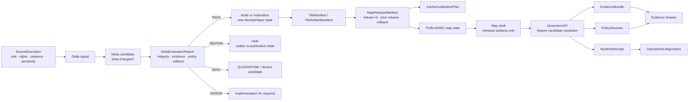
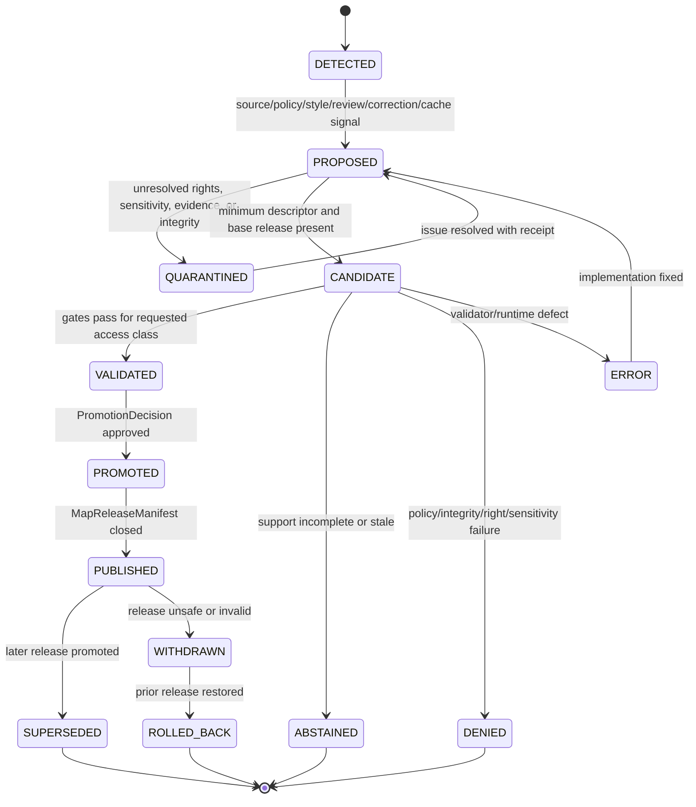

<!-- [KFM_META_BLOCK_V2]
doc_id: kfm://doc/NEEDS-VERIFICATION
title: Tile Delta Update Model
type: standard
version: v1
status: draft
owners: OWNER_TBD
created: CREATED_DATE_TBD_AFTER_REPO_INSPECTION
updated: 2026-05-03
policy_label: POLICY_LABEL_TBD_AFTER_REPO_INSPECTION
related: [docs/architecture/tiles/README.md, docs/architecture/tiles/TILE_MANIFEST_SPEC.md, docs/architecture/tiles/VERIFIABLE_TILE_RENDERING.md]
tags: [kfm, tiles, delta-update, tile-manifest, map-release]
notes: [Local repo unavailable during revision; source-supplied target path and related links need maintainer verification; no runtime implementation is claimed.]
[/KFM_META_BLOCK_V2] -->

# Tile Delta Update Model

Purpose: define how KFM updates tile-backed map surfaces without letting incremental delivery bypass evidence, policy, release state, or rollback.


**Quick navigation:** [Core rule](#core-rule) · [Evidence boundary](#truth-posture-and-evidence-boundary) · [Scope](#scope) · [Repo fit](#repo-fit) · [Lifecycle fit](#lifecycle-fit) · [Delta model](#delta-model) · [State machine](#state-machine) · [Update decisions](#update-decisions) · [Records](#record-families) · [Validation gates](#validation-gates) · [Runtime behavior](#runtime-behavior) · [Rollback](#rollback-and-correction) · [Examples](#illustrative-examples) · [Done](#definition-of-done) · [Backlog](#open-verification-backlog)

---

## Core rule

> [!IMPORTANT]
> A tile delta is an update proposal, not publication. Public users may see only release-bound tile artifacts, styles, layers, and governed API responses whose evidence, policy, integrity, cache, review, correction, and rollback state can be inspected.

Delta delivery can reduce rebuild or transfer cost. It must not reduce KFM’s burden to prove:

- what changed;
- why it changed;
- which sources, processed artifacts, and evidence bundles support the change;
- whether rights, sensitivity, review, source role, and access class permit the intended audience;
- which map release owns the visible result;
- how stale, denied, missing-evidence, generalized, superseded, withdrawn, or corrected states appear;
- how the prior public release can be restored without erasing correction history.

A delta is allowed to be small. The release obligation is not.

[Back to top](#tile-delta-update-model)

---

## Truth posture and evidence boundary

| Claim area | Status | Meaning for this file |
|---|---:|---|
| Document role | `CONFIRMED source material` | The attached Markdown is a draft architecture document titled **Tile Delta Update Model**. |
| Target path | `SOURCE-SUPPLIED / NEEDS VERIFICATION` | Source material names `docs/architecture/tiles/DELTA_UPDATE_MODEL.md`; current local checkout was not mounted during this revision. |
| Adjacent tile docs | `SOURCE-SUPPLIED / NEEDS VERIFICATION` | `README.md`, `TILE_MANIFEST_SPEC.md`, and `VERIFIABLE_TILE_RENDERING.md` are source-supplied related links, not verified from a mounted repo in this session. |
| KFM doctrine | `CONFIRMED corpus doctrine` | KFM doctrine requires evidence-first, map-first, time-aware, governed publication; public outputs remain downstream of evidence, policy, review, and release state. |
| Delta object names | `PROPOSED` | `TileDeltaUpdateRecord`, `DeltaEvaluationReport`, `TileDeltaPackage`, and `CacheInvalidationPlan` are proposed names until repo schema conventions are verified. |
| Runtime implementation | `UNKNOWN` | No route handlers, CI jobs, validator scripts, emitted delta receipts, cache rules, dashboards, logs, or release automation are claimed here. |
| Public release posture | `CONFIRMED doctrine / PROPOSED implementation` | Delta updates must fail closed when evidence, rights, sensitivity, integrity, release, review, or rollback cannot be proven. |

This document uses `MUST`, `SHOULD`, and `MAY` as architecture requirement keywords.

> [!NOTE]
> This file states KFM doctrine and proposes implementation contracts. Current implementation depth remains **UNKNOWN** where repo files, tests, workflows, manifests, dashboards, logs, or emitted artifacts were not inspected.

### Evidence ledger

| Source | Status | Supports | Limits |
|---|---:|---|---|
| `Pasted markdown.md` | `CONFIRMED source material` | Existing tile-delta doctrine, proposed flow, records, gates, runtime rules, rollback language, examples, and backlog. | Does not prove current repo path, owners, schema home, validators, or runtime behavior. |
| `Kansas_Frontier_Matrix_Pipeline_Living_Implementation_Manual_v0.3.pdf` | `CONFIRMED doctrine / PROPOSED realization` | Core lifecycle, governed recompilation, release gates, proof objects, and no-autopublish posture. | Does not prove tile-delta implementation exists. |
| `KFM_MapLibre_Operating_Architecture_Governed_UI_AI_Interaction_Manual_REVISED.pdf` | `CONFIRMED doctrine / PROPOSED realization` | MapLibre as downstream renderer, governed API boundary, Evidence Drawer, Focus Mode, runtime receipts, rollback tests. | Version-sensitive implementation details and repo paths remain unverified here. |
| `KFM_Components_Pass_24_Idea_Index_Category_Atlas_Verification_Dossier_Expansion_Manual.pdf` | `CONFIRMED corpus synthesis` | Inspectable-claim center of gravity and artifact families such as EvidenceBundle, ReleaseManifest, CatalogMatrix, LayerManifest, receipts, proofs, and rollback. | Source synthesis is not direct runtime proof. |
| Current workspace command probe | `CONFIRMED session evidence` | `/mnt/data` was not a Git repository during revision. | Does not speak for the public repository or any unavailable checkout. |

[Back to top](#tile-delta-update-model)

---

## Scope

This file defines the KFM architecture model for incremental updates to tile-backed map surfaces.

It covers:

- source-change, policy, style, review, cache, and correction signals that affect tile releases;
- delta candidates for `PMTiles`, `MVT`, raster tiles, COG-backed tile views, small `GeoJSON`, and server-mediated tile services;
- release identity, artifact integrity, cache invalidation, rollback, correction, and supersession lineage;
- how deltas interact with `SourceDescriptor`, `TileManifest`, `TileArtifactManifest`, `LayerManifest`, `StyleManifest`, `MapReleaseManifest`, `EvidenceBundle`, `PolicyDecision`, and runtime receipts;
- validation gates that decide whether an update may publish, abstain, deny, remain quarantined, or fail as an implementation error.

### Accepted inputs

| Input | Required posture |
|---|---|
| Source refresh or watcher signal | Must resolve to a source descriptor, source role, rights posture, cadence, and receipt. |
| Processed dataset version change | Must carry identity, validation result, source refs, and evidence implications. |
| Tile artifact rebuild | Must carry digest, media type, bounds, zoom range, source refs, build receipt, and stale policy. |
| Style or layer change | Must declare whether visual meaning changes and whether review/accessibility checks are required. |
| Correction or withdrawal signal | Must identify affected release, layer, claim, artifact, and public-facing meaning. |
| Cache or hosting change | Must include invalidation or immutable URL strategy and rollback behavior. |

### Exclusions

| Excluded item | Why excluded | Home |
|---|---|---|
| Canonical domain truth | Tiles and deltas are derived artifacts. | Domain stores, source registries, dataset versions, and EvidenceBundle-producing pipelines. |
| Raw source polling logic | Source activation needs rights, cadence, source-role, and connector discipline. | Source registry, connectors, pipelines, and domain runbooks. |
| Tiler-specific implementation | Tooling must not define truth or publication. | Repo-native tools, validators, and pipeline scripts after verification. |
| Style semantics alone | A visual edit can change meaning but cannot approve itself. | `StyleManifest`, release review, and accessibility checks. |
| AI-generated explanations | Model output is downstream of governed evidence. | Governed AI / Focus Mode contracts. |
| Emergency alerting | KFM is contextual evidence, not life-safety alerting. | Official emergency and alerting systems. |
| Exact restricted geometry | Sensitive public precision fails closed. | Restricted/steward paths with policy, transform receipts, and withheld accounting. |

[Back to top](#tile-delta-update-model)

---

## Repo fit

| Relationship | Path or target | Status | Notes |
|---|---|---:|---|
| Suggested target document | `docs/architecture/tiles/DELTA_UPDATE_MODEL.md` | `SOURCE-SUPPLIED / NEEDS VERIFICATION` | Standard architecture doc for tile-delta semantics. Verify in a mounted checkout before committing. |
| Directory landing page | [`./README.md`](./README.md) | `SOURCE-SUPPLIED / NEEDS VERIFICATION` | Expected to define tile delivery scope, accepted inputs, exclusions, lifecycle, gates, and delivery posture. |
| Manifest spec | [`./TILE_MANIFEST_SPEC.md`](./TILE_MANIFEST_SPEC.md) | `SOURCE-SUPPLIED / NEEDS VERIFICATION` | Expected to define governed sidecar contracts for tile artifacts. |
| Verifiable rendering | [`./VERIFIABLE_TILE_RENDERING.md`](./VERIFIABLE_TILE_RENDERING.md) | `SOURCE-SUPPLIED / NEEDS VERIFICATION` | Expected to define renderability, trust flow, object families, gates, runtime rules, and failure states. |
| Schema home | `schemas/contracts/v1/tiles/` or repo-native equivalent | `NEEDS VERIFICATION` | Do not create a parallel schema dialect without ADR review. |
| Fixtures | `tests/fixtures/tiles/delta_update/` or repo-native equivalent | `PROPOSED` | Should include valid, stale, denied, generalized, rollback, and digest-mismatch examples. |
| Validators | `tools/validators/tiles/` or repo-native equivalent | `PROPOSED` | Should validate delta records, manifest closure, release identity, evidence impact, policy impact, and cache invalidation plans. |
| Release artifacts | `data/published/`, `data/proofs/`, `data/receipts/`, `release/`, or repo-native equivalent | `NEEDS VERIFICATION` | Published homes must never expose RAW, WORK, QUARANTINE, canonical, review-only, or model-runtime paths. |

> [!WARNING]
> If the mounted repository proves different homes for schemas, contracts, fixtures, receipts, proofs, or release bundles, preserve the semantics here and adapt the paths through an ADR. Do not create duplicate tile-delta object families.

[Back to top](#tile-delta-update-model)

---

## Lifecycle fit

Tile deltas live inside the KFM trust membrane. They do not create a parallel publication path.

```mermaid
flowchart LR
  RAW["RAW<br/>source capture"] --> WQ["WORK / QUARANTINE<br/>validation · rights · sensitivity"]
  WQ --> PROC["PROCESSED<br/>dataset version"]
  PROC --> CAT["CATALOG / TRIPLET<br/>evidence · policy · review"]
  CAT --> REL["RELEASE ASSEMBLY<br/>manifest · proof · rollback"]
  REL --> PUB["PUBLISHED<br/>released artifacts only"]
  PUB --> TILES["Tile / style / layer artifacts<br/>derived delivery"]
  TILES --> UI["Map shell<br/>released rendering"]
  UI --> API["Governed API<br/>feature/evidence resolution"]
  API --> EB["EvidenceBundle<br/>PolicyDecision<br/>RuntimeReceipt"]
```



A tile delta may accelerate the move from a processed or release candidate state to a new released delivery artifact. It does not bypass source admission, evidence resolution, rights/sensitivity review, policy decision, release closure, or rollback.

[Back to top](#tile-delta-update-model)

---

## Delta model

KFM treats delta updates as release-aware changes between known map states.

| Term | Meaning |
|---|---|
| **Base release** | Last known release state used as the starting point for comparison, rollback, correction, and cache decisions. |
| **Delta signal** | Source, pipeline, review, correction, style, policy, cache, or release event that may require a tile-visible update. |
| **Delta candidate** | Proposed change set that has not yet passed integrity, evidence, policy, catalog, UI, accessibility, and rollback gates. |
| **Tile delta update record** | `PROPOSED` sidecar describing what changed, which releases/artifacts are affected, and what evidence/policy checks are required. |
| **Delta evaluation report** | `PROPOSED` validation output that classifies the update as `PASS`, `ABSTAIN`, `DENY`, or `ERROR`. |
| **Materialized release** | Complete release-visible state after update. Even when internal build work is incremental, public state must be release-addressable. |
| **Cache invalidation plan** | Explicit plan for removing, bypassing, or retiring stale tile/style/layer bytes without hiding correction lineage. |
| **Correction delta** | Delta that fixes, withdraws, supersedes, or generalizes prior public meaning and must preserve user-visible correction context. |



### Operating interpretation

A delta may be efficient internally, but the public map must still behave as a coherent release. The browser should not need hidden knowledge of unpublished diffs to decide what is true, public, safe, current, cited, generalized, stale, or corrected.

[Back to top](#tile-delta-update-model)

---

## State machine

Delta handling is a governed state transition. It is not a silent file overwrite.



| State | Public behavior |
|---|---|
| `DETECTED` | No public effect. |
| `PROPOSED` | No public effect; reviewers may inspect proposal. |
| `QUARANTINED` | No public rendering; reason must be recorded. |
| `CANDIDATE` | May be tested in controlled fixture/review contexts only. |
| `VALIDATED` | Eligible for promotion, not yet published. |
| `PROMOTED` | Approved transition, awaiting release/materialization closure. |
| `PUBLISHED` | Public/steward surfaces load release-bound artifacts. |
| `ABSTAINED` | UI may show visible no-answer/no-publication state. |
| `DENIED` | UI may show denial reason without leaking restricted details. |
| `WITHDRAWN` | Active use stops; correction or withdrawal state remains visible. |
| `ROLLED_BACK` | Prior release restored; history remains inspectable. |
| `SUPERSEDED` | Older release remains traceable as lineage. |
| `ERROR` | Public effect remains blocked until implementation failure is fixed and revalidated. |

[Back to top](#tile-delta-update-model)

---

## Update decisions

KFM prefers complete, digest-addressed release state for public surfaces. Incremental deltas are allowed only when they improve delivery without weakening verification, review, or rollback.

| Update type | Preferred public posture | Delta may be used when… | Must not happen |
|---|---|---|---|
| `PMTiles` snapshot | Publish a new immutable artifact and release ID. | Internal build can update only affected inputs, then materialize a full release artifact. | In-place mutation of a public PMTiles URI without new digest and release state. |
| `MVT` service | Serve versioned release scope or snapshot descriptor. | Per-tile invalidation and service snapshot identity are manifest-bound. | Browser fetches unmanifested or unreleased tile URLs. |
| Martin/PostGIS-style serving | Server-mediated, release-aware, policy-aware serving. | Freshness, steward access, or dynamic slicing needs backend control. | Dynamic tile output becomes undocumented canonical truth. |
| COG-backed raster view | Keep COG/source artifact stronger than derived tiles. | Tile facade points to verified COG/version and render profile. | Pixel interpretation is upgraded to claim truth without evidence. |
| Raster tile bundle | Publish new release-bound tile set or clear invalidation plan. | Low-latency display needs precomputed pixels. | Style/colormap changes alter meaning without `StyleManifest` and review. |
| Small GeoJSON overlay | Use for fixtures, review overlays, or low-risk debug surfaces. | Stable feature IDs and evidence refs are present. | Large public cartography or sensitive geometry bypasses tile governance. |
| Style-only change | Release-aware `StyleManifest` update. | Change does not alter claim meaning, or meaning impact is reviewed. | Hand-edited style becomes publication approval. |
| Layer metadata change | Release-aware `LayerManifest` update. | Evidence/policy/display contract remains coherent. | Layer toggle silently changes what the public may infer. |
| Correction update | Correction notice plus release transition. | Prior release needs visible correction, withdrawal, supersession, or rollback. | Correction history is hidden by replacing assets. |

> [!TIP]
> Treat “delta” as an optimization inside the governed release process. Treat “release” as the public unit of tile visibility.

[Back to top](#tile-delta-update-model)

---

## Record families

Object names below are `PROPOSED` until schema and contract homes are verified.

| Record | Purpose | Key field groups |
|---|---|---|
| `TileDeltaUpdateRecord` | Describes a proposed tile-visible change against a base release. | Identity, release refs, affected scope, source refs, evidence refs, policy scope, rollback target. |
| `DeltaEvaluationReport` | Records gate results and final validator outcome. | Evaluation identity, check results, outcome, reason codes, evidence summary, policy refs, integrity results, review needs. |
| `TileDeltaPackage` | Optional internal package of changed tile/style/layer assets. | Package identity, base/changed artifacts, tile coordinate scope, digests, media types, generated-by, receipt refs. |
| `CacheInvalidationPlan` | Describes how stale public bytes are bypassed, purged, or retired. | Release refs, changed URLs/cache keys, immutable URL strategy, purge requirement, fallback release, verification steps. |
| `MapRuntimeReceipt` | Records runtime interaction with the updated release. | Trace/session ID, active release, layer/artifact IDs, interaction type, outcome, errors, timing, trust badges shown. |
| `CorrectionNotice` | Explains correction, withdrawal, supersession, or public-facing update significance. | Notice ID, affected releases/claims/layers, correction reason, public summary, review state, rollback/supersession refs. |

### Identity rules

1. `base_release_id` and `target_release_id` MUST be explicit.
2. Public artifacts SHOULD use immutable or digest-addressed URLs where feasible.
3. Mutable public URLs MUST carry release-aware cache behavior and a verifiable invalidation plan.
4. A delta candidate MUST NOT publish if it lacks a rollback target.
5. A changed feature identity MUST either preserve a stable evidence route or emit a visible supersession/correction path.
6. Per-tile changes SHOULD be recorded at the smallest reliable unit the repo can validate.
7. If per-tile integrity is not validated, the release-level artifact digest remains the authority.
8. A record family MUST NOT become canonical domain truth merely because it is easier to query than upstream evidence.

<details>
<summary>Minimum field checklist by proposed record</summary>

### `TileDeltaUpdateRecord`

- `update_id`
- `base_release_id`
- `target_release_id`
- `update_reason`
- `update_kind`
- `affected_layers`
- `affected_artifacts`
- `source_descriptor_refs`
- `dataset_version_refs`
- `evidence_bundle_refs`
- `policy_scope`
- `created_at`
- `created_by_or_process`
- `rollback_target_ref`

### `DeltaEvaluationReport`

- `report_id`
- `update_id`
- `base_release_id`
- `candidate_release_id`
- `checks`
- `outcome`
- `reason_codes`
- `evidence_resolution_summary`
- `policy_decision_refs`
- `integrity_results`
- `review_requirements`

### `TileDeltaPackage`

- `package_id`
- `base_artifact_refs`
- `changed_artifact_refs`
- `tile_coordinate_scope`
- `artifact_digests`
- `manifest_digest`
- `media_types`
- `stale_after`
- `generated_by`
- `receipt_refs`

### `CacheInvalidationPlan`

- `plan_id`
- `release_id`
- `previous_release_id`
- `changed_urls_or_keys`
- `immutable_url_strategy`
- `purge_required`
- `fallback_release_id`
- `expected_public_state`
- `verification_steps`

### `MapRuntimeReceipt`

- `session_or_trace_id`
- `active_release_id`
- `layer_ids`
- `artifact_ids`
- `interaction_type`
- `resolution_outcome`
- `errors`
- `timing`
- `policy_badges_shown`

### `CorrectionNotice`

- `notice_id`
- `affected_release_ids`
- `affected_claims_or_layers`
- `correction_reason`
- `public_summary`
- `review_state`
- `rollback_or_supersession_refs`

</details>

[Back to top](#tile-delta-update-model)

---

## Validation gates

| Gate | Purpose | Blocks when… | Outcome |
|---|---|---|---|
| `D0_REPO_CONTEXT` | Avoid false implementation claims. | Schema home, validator, release storage, adjacent docs, or package runner is unknown. | `ABSTAIN` for implementation claim; continue as design only. |
| `D1_BASE_RELEASE` | Prove starting state. | Base release, prior manifest, active release pointer, or rollback target is missing. | `DENY` publication. |
| `D2_SOURCE_DELTA` | Prove why update exists. | Source descriptors, update signal, dataset version, review action, or receipt is missing. | `ABSTAIN` or `DENY`. |
| `D3_ARTIFACT_INTEGRITY` | Prove changed bytes. | Artifact digest, manifest digest, media type, bounds, zoom range, or package digest mismatches. | `DENY` and quarantine candidate. |
| `D4_EVIDENCE_IMPACT` | Preserve claim support. | Consequential feature cannot resolve to `EvidenceBundle` or visible failure state. | `ABSTAIN`. |
| `D5_POLICY_SENSITIVITY` | Fail closed before exposure. | Rights unknown, exact restricted geometry, stale source, denied role, or unsupported access class. | `DENY` or forced generalization. |
| `D6_LAYER_STYLE_BINDING` | Keep visual meaning governed. | Layer/style changes are unhashed, ad hoc, inaccessible, or detached from release identity. | `ERROR` or `DENY`. |
| `D7_RELEASE_CLOSURE` | Make update publishable. | `MapReleaseManifest`, proof pack, prior release, cache plan, or promotion decision is missing. | No publication. |
| `D8_RUNTIME_BOUNDARY` | Keep browser downstream. | Public client can fetch raw/work/quarantine/canonical/model-runtime/review-only paths. | `DENY`. |
| `D9_ROLLBACK_CORRECTION` | Preserve reversibility. | Rollback cannot restore prior release or correction lineage is erased. | `DENY`. |
| `D10_ACCESSIBILITY_TRUST` | Keep trust visible. | Stale, denied, generalized, missing-evidence, or correction state is color-only, hidden, or keyboard-inaccessible. | Block public release. |

### Finite validator outcomes

| Outcome | Meaning |
|---|---|
| `PASS` | Checks prove the update is safe for the requested access class. |
| `ABSTAIN` | The system cannot prove support, freshness, completeness, review state, or release eligibility. |
| `DENY` | Integrity, policy, rights, sensitivity, or boundary rule blocks the update. |
| `ERROR` | Validator, schema, runtime, environment, or artifact access failed. |

[Back to top](#tile-delta-update-model)

---

## Runtime behavior

### Renderer permissions

MapLibre, or any future renderer, may:

- load released tile, style, sprite, glyph, and layer artifacts;
- expose `release_id`, `layer_id`, `feature_id`, viewport, active time, and interaction state;
- highlight features using safe UI state;
- send candidate selections to governed APIs;
- emit runtime receipts and diagnostics.

It must not:

- fetch RAW, WORK, QUARANTINE, canonical, review-only, steward-only, proof-pack, or model-runtime paths directly;
- decide whether a delta is true, public, reviewed, cited, corrected, or safe;
- hide restricted geometry with client-side filters;
- treat feature properties, pixels, popups, or style visibility as evidence authority;
- silently suppress stale, denied, withdrawn, generalized, digest-mismatch, or citation-failed states.

### Delta-visible failure states

| State | Meaning | Required behavior |
|---|---|---|
| `BASE_RELEASE_MISSING` | Delta cannot identify its starting release. | Block publication; show release diagnostic to maintainers. |
| `DELTA_SIGNAL_UNRESOLVED` | Reason for update cannot be tied to source, review, policy, cache, or correction. | Hold candidate; require receipt or review. |
| `DELTA_DIGEST_MISMATCH` | Changed artifact does not match declared digest. | Block rendering; create incident/review record. |
| `CACHE_STALE_AFTER_UPDATE` | User may still receive prior bytes after update. | Use immutable release URL or execute invalidation plan before public switch. |
| `EVIDENCE_ROUTE_CHANGED` | Feature ID or evidence route changed. | Require supersession mapping or visible missing-evidence state. |
| `POLICY_DENIED_DELTA` | Update would expose denied/right-restricted/sensitive material. | Deny or generalize server-side; do not send exact detail. |
| `GENERALIZED_DELTA` | Public update changed precision for safety. | Show transform badge and withheld accounting. |
| `RELEASE_WITHDRAWN` | Active release is no longer allowed. | Fall back to prior release or show withdrawn state. |
| `ROLLBACK_REQUIRED` | New release is unsafe or broken. | Restore rollback target without deleting correction notice. |

### Accessibility and trust visibility

Delta state must be visible without relying only on color or hover behavior.

Minimum UI obligations:

- trust state text labels for stale, denied, generalized, withdrawn, missing-evidence, digest-mismatch, and correction states;
- keyboard access to feature selection, Evidence Drawer, and error/correction details;
- non-color indicators for generalized or withheld detail;
- screen-reader-readable release and layer state where supported by the UI shell;
- Focus Mode answers only after governed evidence resolution and citation validation.

[Back to top](#tile-delta-update-model)

---

## Rollback and correction

Rollback is a governed state transition, not a cache trick.

| Preserve | Why it matters |
|---|---|
| Prior `MapReleaseManifest` | Defines the exact release state to restore. |
| Withdrawn or superseded manifest | Explains what changed and why it is no longer active. |
| `CacheInvalidationPlan` and execution receipt | Shows how stale bytes were removed or bypassed. |
| `CorrectionNotice` | Prevents history erasure. |
| `DeltaEvaluationReport` | Keeps failed, abstained, or denied update reasoning inspectable. |
| Evidence and policy refs | Allows future reviewers to audit the release decision. |
| Runtime receipts | Shows how the public shell behaved before, during, and after the transition. |

### Rollback rule

A delta update cannot be considered release-ready unless the previous public map state can be restored without deleting evidence, receipts, proof objects, release records, or correction lineage.

### Correction rule

A correction delta differs from a routine source delta. It must identify the public-facing claim, layer, artifact, or release state being corrected and must preserve user-visible correction context where the prior state could have affected interpretation.

### Cache rule

Cache invalidation must not be used to hide a withdrawal, correction, or rollback. If old bytes remain addressable for rollback, their release status must still be inspectable.

[Back to top](#tile-delta-update-model)

---

## Implementation sequence

This is a proposed sequence. Adapt to repo-native conventions after checkout inspection.

| Step | Change | Output |
|---:|---|---|
| 0 | Inspect actual repo path, owners, adjacent tile docs, schema home, validators, release storage, and package runner. | Verification notes; update this doc’s `NEEDS VERIFICATION` placeholders. |
| 1 | Add or reconcile tile-delta schemas/contracts. | `TileDeltaUpdateRecord`, `DeltaEvaluationReport`, `CacheInvalidationPlan`, and fixture examples. |
| 2 | Add no-network fixtures. | Valid, abstain, deny, generalized, withdrawn, rollback, and digest-mismatch cases. |
| 3 | Add validators and policy tests. | Finite outcomes and fail-closed policy gates. |
| 4 | Add manifest/release closure checks. | Base release, target release, rollback target, cache plan, artifact digests. |
| 5 | Add runtime boundary tests. | No public access to raw/work/quarantine/canonical/review/model-runtime paths. |
| 6 | Add UI/Evidence Drawer test fixture. | Click/select -> governed API -> EvidenceBundle/PolicyDecision -> trust-visible UI. |
| 7 | Add rollback drill. | Restore previous release and preserve correction notice. |
| 8 | Update docs and release notes. | Cross-links to related tile docs, validators, fixtures, and ADRs. |

[Back to top](#tile-delta-update-model)

---

## Illustrative examples

The examples below are contract sketches, not production schemas.

<details>
<summary>Example: TileDeltaUpdateRecord</summary>

```json
{
  "schema": "kfm.map.tile_delta_update_record.v1",
  "update_id": "tile_delta_huc12_2026_04_demo_001",
  "status": "candidate",
  "base_release_id": "maprelease_hydrology_huc12_demo_v1",
  "target_release_id": "maprelease_hydrology_huc12_demo_v2",
  "update_kind": "source_refresh",
  "update_reason": "Source descriptor reports new public-safe HUC12 boundary snapshot.",
  "affected_layers": ["hydrology.huc12.public.v1"],
  "affected_artifacts": ["tileartifact_huc12_pmtiles_v1"],
  "source_descriptor_refs": ["source_usgs_wbd_huc12_kansas_v1"],
  "dataset_version_refs": ["dataset_huc12_kansas_snapshot_NEEDS_VERIFICATION"],
  "evidence_bundle_refs": ["bundle_huc12_fixture_001"],
  "policy_scope": {
    "access_class": "public",
    "sensitive_exact_geometry_allowed": false,
    "rights_state": "NEEDS_VERIFICATION"
  },
  "delta_scope": {
    "geometry_changed": true,
    "style_changed": false,
    "evidence_route_changed": "NEEDS_VERIFICATION",
    "tile_coordinate_scope": ["z/x/y NEEDS_VERIFICATION"]
  },
  "evaluation_ref": "data/receipts/NEEDS_VERIFICATION_delta_evaluation.json",
  "rollback_target_ref": "maprelease_hydrology_huc12_demo_v1",
  "created_at": "NEEDS_VERIFICATION",
  "created_by_or_process": "NEEDS_VERIFICATION"
}
```

</details>

<details>
<summary>Example: CacheInvalidationPlan</summary>

```json
{
  "schema": "kfm.map.cache_invalidation_plan.v1",
  "plan_id": "cache_plan_huc12_demo_v2",
  "release_id": "maprelease_hydrology_huc12_demo_v2",
  "previous_release_id": "maprelease_hydrology_huc12_demo_v1",
  "strategy": "immutable_release_urls_preferred",
  "changed_cache_keys": [
    "release_id+artifact_id+content_hash NEEDS_VERIFICATION"
  ],
  "purge_required": false,
  "fallback_release_id": "maprelease_hydrology_huc12_demo_v1",
  "verification_steps": [
    "Verify new TileManifest digest.",
    "Verify MapReleaseManifest points to target artifact.",
    "Verify old release remains addressable for rollback.",
    "Verify public shell cannot request unmanifested tile URLs."
  ],
  "executed_at": "NEEDS_VERIFICATION",
  "execution_receipt_ref": "data/receipts/NEEDS_VERIFICATION_cache_invalidation_receipt.json"
}
```

</details>

<details>
<summary>Example: proposed validation commands</summary>

```bash
# PROPOSED — adapt to repo-native task runner after checkout inspection.

make validate-tile-delta-records
make validate-delta-evaluation-reports
make validate-cache-invalidation-plans
make validate-map-release-manifests
make policy-tiles-delta-public-boundary
make test-tile-delta-rollback
make test-tile-delta-evidence-resolution
make test-no-unreleased-tile-load
```

</details>

[Back to top](#tile-delta-update-model)

---

## Definition of done

A tile delta update model change is not done until every applicable item passes.

- [ ] Target repo checkout, branch, schema home, validator home, release storage, package runner, and adjacent docs have been inspected.
- [ ] Owners and review routing are confirmed.
- [ ] Delta object names are reconciled with repo schema conventions or documented through an ADR.
- [ ] `base_release_id`, `target_release_id`, rollback target, and cache invalidation posture are explicit.
- [ ] Every affected source has a `SourceDescriptor` with role, rights, cadence, citation posture, and sensitivity handling.
- [ ] Every changed tile artifact has digest, bounds, zoom range, media type, source refs, build/transform receipts, and stale policy.
- [ ] Every changed layer has a `LayerManifest` that states what it may show and withhold.
- [ ] Every changed style has a `StyleManifest` when visual meaning, accessibility, sprites, glyphs, or layer bindings change.
- [ ] Every consequential selected feature resolves to `EvidenceBundle` or a visible negative state.
- [ ] Unknown rights, unknown sensitivity, missing evidence, digest mismatch, unmanifested URL, or missing rollback blocks public release.
- [ ] Browser access to raw/work/quarantine/canonical/review-only/model-runtime paths is blocked and tested.
- [ ] Delta release can be withdrawn or rolled back without deleting correction history.
- [ ] Trust states are keyboard-accessible and not color-only.
- [ ] Documentation, fixtures, validators, policy tests, and release notes update in the same PR as behavior changes.

[Back to top](#tile-delta-update-model)

---

## Open verification backlog

| Item | Label | Why it matters |
|---|---:|---|
| Confirm target path and whether the file is currently a placeholder | `NEEDS VERIFICATION` | Prevents replacing a newer in-repo version or misplacing the doc. |
| Confirm owners / CODEOWNERS for `docs/architecture/tiles/*` | `NEEDS VERIFICATION` | Required for review routing. |
| Confirm related tile docs and stable internal links | `NEEDS VERIFICATION` | Keeps docs navigable and avoids broken anchors. |
| Confirm schema home for tile delta objects | `NEEDS VERIFICATION` | Avoids parallel schema dialects. |
| Confirm whether `TileArtifactManifest` and `TileManifest` naming is already standardized | `NEEDS VERIFICATION` | Prevents object-family drift. |
| Confirm release storage and proof/receipt directories | `UNKNOWN` | Delta rollback and cache records depend on repo convention. |
| Confirm current package manager and validator runner | `UNKNOWN` | Commands must be repo-native. |
| Confirm whether PMTiles, Martin/PostGIS, COG, MVT, or MLT tools are installed or planned | `UNKNOWN` | Affects implementation strategy but not governance law. |
| Confirm cache hosting model | `UNKNOWN` | Immutable URLs, purge APIs, and rollback procedures depend on deployment. |
| Confirm source-rights vocabulary | `NEEDS VERIFICATION` | Unknown rights must block public release. |
| Confirm sensitive geometry categories and transform receipts | `NEEDS VERIFICATION` | Public deltas must not leak restricted locations. |
| Confirm runtime receipt vocabulary | `UNKNOWN` | Click/render delta behavior should be observable without becoming truth. |
| Confirm accessibility test convention | `UNKNOWN` | Trust-state visibility must be testable. |

[Back to top](#tile-delta-update-model)

---

<details>
<summary>Appendix A — Glossary</summary>

| Term | KFM meaning |
|---|---|
| **Delta signal** | A change event that may require a map release update. |
| **Delta candidate** | Proposed update that has not yet passed gates. |
| **Tile delta update record** | Proposed sidecar describing changed scope, base release, target release, source refs, policy scope, and rollback target. |
| **Delta evaluation report** | Validation result for an update candidate. |
| **Tile delta package** | Optional internal package of changed delivery bytes; not automatically public. |
| **Materialized release** | Complete release-visible map state after update. |
| **Cache invalidation plan** | Reviewable plan for stale public bytes after release transition. |
| **Rollback target** | Prior known-good release state. |
| **Correction delta** | Update that fixes or withdraws prior public meaning and must preserve correction context. |
| **Release-bound rendering** | Browser loads only artifacts referenced by the active map release. |
| **Evidence route** | Path from selected feature/layer/release to governed `EvidenceBundle`. |
| **Withheld accounting** | Public-safe indication that detail exists but is withheld or generalized under policy. |
| **Runtime receipt** | Diagnostic record showing how the renderer/API handled a release-bound interaction. |

</details>

<details>
<summary>Appendix B — Anti-patterns to reject</summary>

- Updating public tile bytes in place without a new digest, release ID, and rollback target.
- Treating a tile diff as proof that the underlying claim changed.
- Publishing a delta because it is small, fast, or visually harmless.
- Using client-side filters to hide restricted geometry after the browser has already received it.
- Letting `feature_id` changes break Evidence Drawer or Focus Mode resolution silently.
- Letting cache freshness hide release withdrawal or correction status.
- Allowing a style-only change to alter meaning without `StyleManifest` and release review.
- Using Focus Mode to summarize changed tile properties before EvidenceBundle resolution.
- Deleting old manifests to “clean up” rollback history.
- Creating a new delta schema home without checking existing repo convention.
- Treating runtime receipts, tiles, style JSON, screenshots, dashboards, or AI text as root truth.

</details>

[Back to top](#tile-delta-update-model)
