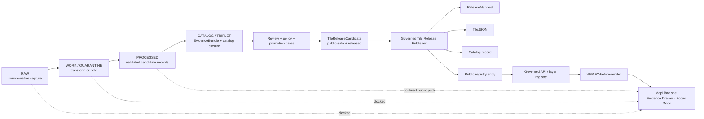
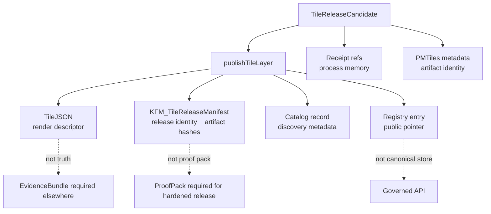

<!-- [KFM_META_BLOCK_V2]
doc_id: kfm://doc/NEEDS-VERIFICATION-governed-tile-release-publisher
title: Governed Tile Release Publisher
type: standard
version: v1
status: draft
owners: OWNER_TBD
created: NEEDS VERIFICATION
updated: 2026-05-06
policy_label: public
related: [./README.md, ../../adr/ADR-0001-schema-home.md, ../../../scripts/publish_kfm_tile_layer.mjs, ../../../apps/web/src/map/pmtiles/tileReleasePublisher.js, ../../../apps/web/src/__tests__/tileReleasePublisher.test.js, ../../../tests/fixtures/tile_release/valid/veg.layer.json, ../../../tests/fixtures/tile_release/valid/veg.pmtiles-metadata.json, ../../../apps/web/package.json]
tags: [kfm, tiles, release, publication, governance, map, tilejson, pmtiles]
notes: [Target path is confirmed in accessible GitHub repository as docs/architecture/tiles/GOVERNED_TILE_RELEASE_PUBLISHER.md; owner and stable document UUID still need registry verification; local mounted checkout, CI run status, branch protections, schema acceptance, signing policy, proof-pack closure, and production release maturity remain unverified.]
[/KFM_META_BLOCK_V2] -->

<a id="top"></a>

# Governed Tile Release Publisher

Deterministic tile-publication guardrail for public-safe KFM layer candidates: validate, fail closed, and emit release references without turning rendered tiles into truth.

<p>
  
  
  
  
  
</p>

> [!IMPORTANT]
> The tile release publisher is a **release-reference generator**, not a truth source. PMTiles, MVT, TileJSON, style JSON, screenshots, rendered pixels, catalog pointers, and registry entries remain downstream carriers. Consequential claims still resolve through governed evidence, policy, release, correction, and rollback surfaces.

**Quick navigation:** [Repo fit](#repo-fit) · [Implementation snapshot](#implementation-snapshot) · [Doctrine lock](#doctrine-lock) · [Trust boundary](#trust-boundary) · [Runtime contract](#runtime-contract) · [Accepted inputs](#accepted-inputs) · [Exclusions](#exclusions) · [Gate matrix](#gate-matrix) · [Dry-run usage](#dry-run-usage) · [Outputs](#outputs) · [Known gaps](#known-gaps) · [Definition of done](#definition-of-done) · [Rollback](#rollback-and-correction)

---

## Repo fit

| Field | Value |
|---|---|
| **Target document path** | `docs/architecture/tiles/GOVERNED_TILE_RELEASE_PUBLISHER.md` |
| **Owning root** | `docs/` — human-facing architecture/control-plane documentation |
| **Adjacent directory doc** | [`./README.md`](./README.md) |
| **Primary implementation hook** | [`../../../scripts/publish_kfm_tile_layer.mjs`](../../../scripts/publish_kfm_tile_layer.mjs) |
| **Publisher module** | [`../../../apps/web/src/map/pmtiles/tileReleasePublisher.js`](../../../apps/web/src/map/pmtiles/tileReleasePublisher.js) |
| **Fixture-backed tests** | [`../../../apps/web/src/__tests__/tileReleasePublisher.test.js`](../../../apps/web/src/__tests__/tileReleasePublisher.test.js) |
| **Valid fixture** | [`../../../tests/fixtures/tile_release/valid/veg.layer.json`](../../../tests/fixtures/tile_release/valid/veg.layer.json) |
| **Metadata fixture** | [`../../../tests/fixtures/tile_release/valid/veg.pmtiles-metadata.json`](../../../tests/fixtures/tile_release/valid/veg.pmtiles-metadata.json) |
| **Package surface** | [`../../../apps/web/package.json`](../../../apps/web/package.json) |
| **Schema-home decision context** | [`../../adr/ADR-0001-schema-home.md`](../../adr/ADR-0001-schema-home.md) |
| **Current status** | `draft` documentation over a confirmed fixture-backed thin slice; production release maturity remains `NEEDS VERIFICATION` |

### Directory Rules basis

This file belongs under `docs/architecture/tiles/` because it explains a cross-cutting publication architecture surface. It does not create a root-level domain folder, and it does not claim schema, policy, release, fixture, or runtime authority by itself.

| Responsibility root | What it owns in this slice |
|---|---|
| `docs/` | Architecture narrative, trust boundary, review guidance, known gaps |
| `scripts/` | CLI wrapper for deterministic no-network publication checks |
| `apps/web/` | Web-shell-adjacent publisher module and Vitest test surface |
| `tests/fixtures/` | Valid/invalid candidate data used to prove behavior |
| `schemas/` | Machine-checkable schemas if/when ADR-0001 is accepted |
| `policy/` | Admissibility rules for rights, sensitivity, release, evidence, and public exposure |
| `release/` / `data/published/` | Production release objects and public-safe materializations after promotion |

[Back to top](#top)

---

## Implementation snapshot

The accessible repository currently contains a small, concrete publisher slice. The claims below are limited to inspected repository files and do not assert CI success, production publication, branch protection, or runtime deployment.

| Surface | Status | What is confirmed |
|---|---:|---|
| Target Markdown file | `CONFIRMED` | This document path exists and is being revised for the repo. |
| Tile architecture README | `CONFIRMED` | `docs/architecture/tiles/README.md` documents tile delivery posture and related architecture. |
| CLI script | `CONFIRMED` | The script accepts `--candidate`, `--out`, and optional `--pmtiles-metadata`; it exits `0` only for `PUBLISHABLE`, `1` for non-publishable outcomes, and `2` for missing required args. |
| Publisher module | `CONFIRMED` | `publishTileLayer()` emits finite outcomes: `PUBLISHABLE`, `BLOCKED`, `NEEDS_RECEIPT`, `ERROR`. |
| Tests | `CONFIRMED` | Vitest covers valid publication, spec-hash mismatches, malformed/missing spec hash, restricted policy, blocked lifecycle paths, draft review, missing receipt, receipt identity mismatch, unsafe fallback, manifest hash stability, and catalog geometry suppression. |
| Valid fixture | `CONFIRMED` | The fixture uses public policy/sensitivity, approved review, released state, `data/published/tiles/...` paths, redaction/generalization receipts, and `geometry_exact: false`. |
| Package command | `CONFIRMED` | `apps/web/package.json` exposes `npm run kfm:publish-tile-layer`, with `npm@10`, Vitest, Vite, MapLibre GL, and PMTiles declared in the web package. |
| Schema acceptance | `NEEDS VERIFICATION` | ADR-0001 proposes `schemas/contracts/v1/` as machine schema home, but acceptance/enforcement still requires evidence. |
| Local execution | `UNKNOWN` | No mounted local checkout was available in this session; commands were not run against a local repo. |
| Release hardening | `NEEDS VERIFICATION` | Signing, proof-pack closure, rollback card generation, branch protection, workflow status, and production release policy were not verified. |

> [!NOTE]
> The current slice is strongest as a **no-network, fixture-backed publication guard**. Treat it as a release-dry-run primitive until schema, policy, proof, signing, rollback, registry, and CI evidence are verified.

[Back to top](#top)

---

## Purpose

The **Governed Tile Release Publisher** validates an already reviewed, already public-safe tile layer candidate and emits the release-facing objects needed for downstream discovery and rendering.

It may generate or return:

- `TileJSON`
- `KFM_TileReleaseManifest`
- STAC-like catalog record
- public layer registry entry
- process result envelope
- reason codes for blocked or incomplete candidates

It must not:

- ingest raw sources;
- decide source authority;
- approve evidence;
- perform steward review;
- publish restricted or unresolved material;
- turn rendered artifacts into canonical truth;
- act as a direct public renderer bypass;
- call an AI/model runtime;
- make a layer public without release-state support.

> [!IMPORTANT]
> A successful tile publication result means “this public-safe render artifact has a deterministic release reference.” It does **not** mean “the tile itself proves the claim.”

---

## Doctrine lock

| KFM doctrine | Publisher rule |
|---|---|
| `RAW -> WORK / QUARANTINE -> PROCESSED -> CATALOG / TRIPLET -> PUBLISHED` | The publisher accepts only candidates already in a released/public-safe posture. It denies raw, work, quarantine, draft, staging, private, restricted, canonical-private, or unreleased paths. |
| Promotion is governed state transition | `release_state` must be `released`; review must be `approved` or `released`; publication is not a file copy. |
| Public clients use governed release surfaces | TileJSON and registry entries must point to public-safe governed artifacts, not internal lifecycle stores. |
| EvidenceBundle outranks generated language and rendered artifacts | Tile attributes, screenshots, PMTiles, MVT, and style JSON are not citation authority. |
| Receipts, proofs, catalogs, manifests, and releases remain separate | The publisher may link these objects, but it must not collapse them into one blob. |
| Deterministic identity where practical | `spec_hash` anchors the candidate; manifest hashing excludes runtime-only `published_at`. |
| Fail closed where risk matters | Unknown or invalid policy, sensitivity, release state, receipts, paths, hashes, geometry exactness, or fallback safety blocks publication. |

[Back to top](#top)

---

## Trust boundary

The publisher is downstream of validation and upstream of public rendering.



The renderer receives released references. It does not decide truth, policy, evidence support, rights, sensitivity, correction lineage, or release readiness.

---

## Runtime contract

### Current outcome vocabulary

| Outcome | Meaning | Exit behavior through CLI |
|---|---|---:|
| `PUBLISHABLE` | Candidate passed publisher checks and generated release-facing objects. | `0` |
| `NEEDS_RECEIPT` | Candidate declares required receipt types that are not present. | `1` |
| `BLOCKED` | Candidate violates policy, identity, release, path, geometry, fallback, or artifact checks. | `1` |
| `ERROR` | Runtime failure or malformed/unreadable input prevented a governed decision. | `1` |
| `missing_args` | CLI was called without required `--candidate` or `--out`. | `2` |

### Current candidate expectations

The implementation uses these fields from the candidate fixture and runtime checks:

| Field family | Current behavior |
|---|---|
| `id`, `title` | Used for layer identity and generated metadata. |
| `spec_hash` | Must match `sha256:<64 lowercase hex chars>`. |
| `policy_label` | Must be `public`. |
| `sensitivity` | Must be `public`. |
| `review_state` | Must be `approved` or `released`. |
| `release_state` | Must be `released`. |
| `role` | Must not include blocked lifecycle/private markers. |
| `source_pmtiles`, `tilejson_path` | Must not include blocked public-path markers. |
| `fallback.public_safe` | Must be `true`. |
| `receipts.required_types` | Every required type must appear in `receipts.items`. |
| `receipts.items[]` | Each receipt must match candidate `id` and `spec_hash`. |
| `tilejson_fixture["kfm:spec_hash"]` | If present, must match candidate `spec_hash`. |
| PMTiles metadata `kfm:spec_hash` | If present, must match candidate `spec_hash`. |
| `catalog.geometry_exact` | If `true`, publication is blocked. |
| `public_safe_geometry` | If `true`, candidate `bounds` and `center` may be copied into TileJSON. |

### Blocked path markers

The implementation currently treats these path markers as public-release blockers:

```text
raw
work
quarantine
canonical-private
private
restricted
draft
staging
unreleased
```

> [!WARNING]
> The current path check is substring-based. That is useful for a first guard, but production hardening should move toward segment-aware path validation to reduce false positives and false negatives.

[Back to top](#top)

---

## Accepted inputs

A candidate belongs in this publisher only when it has already passed upstream source, evidence, rights, sensitivity, review, and release preparation.

| Input | Required posture | Publisher behavior |
|---|---|---|
| Tile release candidate JSON | `released`, public, approved, deterministic `spec_hash` | Parse and validate public-release posture. |
| PMTiles metadata JSON | Optional but recommended | Validate `kfm:spec_hash` and use `artifact_hash` when present. |
| Required receipt list | Required when candidate declares receipt burden | Return `NEEDS_RECEIPT` if any required type is absent. |
| Receipt items | Required for declared receipt burden | Block if `layer_id` or `spec_hash` does not match the candidate. |
| TileJSON fixture metadata | Optional | Block if fixture `kfm:spec_hash` disagrees with candidate. |
| Catalog declaration | Required for catalog output | Block exact geometry when `catalog.geometry_exact` is `true`. |
| Fallback artifact | Required by current implementation | Block unless `fallback.public_safe === true`. |

### Illustrative candidate shape

This sketch reflects the current fixture family. It is not a substitute for an accepted JSON Schema.

```json
{
  "id": "kfm-veg-public-v1",
  "title": "KFM Vegetation Public Layer",
  "role": "published-public",
  "policy_label": "public",
  "sensitivity": "public",
  "review_state": "approved",
  "release_state": "released",
  "spec_hash": "sha256:1111111111111111111111111111111111111111111111111111111111111111",
  "source_pmtiles": "data/published/tiles/kfm-veg-public-v1.pmtiles",
  "tilejson_path": "data/published/tiles/kfm-veg-public-v1.tilejson.json",
  "vector_layers": [
    {
      "id": "veg",
      "fields": {
        "class": "string"
      }
    }
  ],
  "minzoom": 2,
  "maxzoom": 10,
  "fallback": {
    "source": "data/published/tiles/kfm-veg-fallback.pmtiles",
    "public_safe": true
  },
  "receipts": {
    "required_types": ["redaction_receipt", "generalization_receipt"],
    "items": [
      {
        "type": "redaction_receipt",
        "href": "data/receipts/public/redaction/kfm-veg-public-v1.json",
        "layer_id": "kfm-veg-public-v1",
        "spec_hash": "sha256:1111111111111111111111111111111111111111111111111111111111111111"
      }
    ]
  },
  "catalog": {
    "collection": "kfm-map-layers",
    "geometry_exact": false
  },
  "public_safe_geometry": false
}
```

[Back to top](#top)

---

## Exclusions

| Exclusion | Current outcome | Where it belongs instead |
|---|---:|---|
| RAW / WORK / QUARANTINE paths | `BLOCKED` | lifecycle pipeline or quarantine review |
| Draft, staging, unreleased, restricted, private, or canonical-private references | `BLOCKED` | review lane, restricted lane, or promotion gate |
| Non-public policy or sensitivity | `BLOCKED` | policy/sensitivity review |
| Missing or malformed `spec_hash` | `BLOCKED` | candidate validation lane |
| Missing required receipt | `NEEDS_RECEIPT` | receipt generation / validation lane |
| Receipt identity mismatch | `BLOCKED` | correction before publication |
| PMTiles or TileJSON spec-hash mismatch | `BLOCKED` | artifact repair / rebuild |
| Exact sensitive geometry in catalog declaration | `BLOCKED` | generalization/redaction transform with receipt |
| Unsafe fallback artifact | `BLOCKED` | fallback repair or removal |
| AI-generated claims from tile attributes alone | Not part of this publisher | governed AI citation-validation path |
| Production signing / proof-pack closure | Not implemented by current publisher | release hardening and proof pipeline |

---

## Gate matrix

| Gate | Check | Current support | Failure outcome |
|---|---|---:|---:|
| Candidate parse | JSON can be read by CLI | `CONFIRMED` | `ERROR` |
| Spec hash | `sha256:<64 lowercase hex>` | `CONFIRMED` | `BLOCKED` |
| Policy label | `public` | `CONFIRMED` | `BLOCKED` |
| Sensitivity | `public` | `CONFIRMED` | `BLOCKED` |
| Review state | `approved` or `released` | `CONFIRMED` | `BLOCKED` |
| Release state | `released` | `CONFIRMED` | `BLOCKED` |
| Role marker | no blocked lifecycle/private marker | `CONFIRMED` | `BLOCKED` |
| Public path marker | no blocked marker in PMTiles or TileJSON path | `CONFIRMED` | `BLOCKED` |
| Fallback safety | `fallback.public_safe === true` | `CONFIRMED` | `BLOCKED` |
| Required receipts | all required types present | `CONFIRMED` | `NEEDS_RECEIPT` |
| Receipt identity | receipt `layer_id` and `spec_hash` match | `CONFIRMED` | `BLOCKED` |
| TileJSON fixture identity | fixture `kfm:spec_hash` matches when present | `CONFIRMED` | `BLOCKED` |
| PMTiles metadata identity | metadata `kfm:spec_hash` matches when present | `CONFIRMED` | `BLOCKED` |
| Catalog geometry | `geometry_exact !== true` | `CONFIRMED` | `BLOCKED` |
| Manifest determinism | `published_at` excluded from deterministic hash material | `CONFIRMED` | test failure if regressed |
| Production rollback card | rollback target and correction path | `NEEDS IMPLEMENTATION / VERIFICATION` | block production release |
| Proof/signing closure | proof pack, signature, attestation, or equivalent | `NEEDS VERIFICATION` | block production release |

[Back to top](#top)

---

## Dry-run usage

> [!CAUTION]
> These commands are for a verified local checkout. This session did not run them locally because no mounted checkout was available.

From the web package:

```bash
cd apps/web

npm run kfm:publish-tile-layer -- \
  --candidate ../../tests/fixtures/tile_release/valid/veg.layer.json \
  --pmtiles-metadata ../../tests/fixtures/tile_release/valid/veg.pmtiles-metadata.json \
  --out /tmp/kfm-tile-release-demo
```

Expected successful dry-run behavior:

```text
outcome: PUBLISHABLE
writes:
  /tmp/kfm-tile-release-demo/tilejson.json
  /tmp/kfm-tile-release-demo/release_manifest.json
  /tmp/kfm-tile-release-demo/catalog_record.json
  /tmp/kfm-tile-release-demo/registry_entry.json
exit: 0
```

Run the fixture-backed test surface:

```bash
cd apps/web
npm test -- --run tileReleasePublisher
```

Run the broader web package doctor only after dependencies are installed and repo conventions are verified:

```bash
cd apps/web
npm run doctor
```

> [!TIP]
> Keep dry-run outputs outside `PUBLISHED` and production registry homes until release policy, proof closure, signing, rollback, and CI evidence are verified.

[Back to top](#top)

---

## Outputs

When the outcome is `PUBLISHABLE`, the script currently writes four generated files.

| Output file | Current purpose | Release caution |
|---|---|---|
| `tilejson.json` | TileJSON 3.0.0 descriptor with `kfm:spec_hash`, policy label, sensitivity, vector layer metadata, and release manifest pointer. | Render descriptor only; not evidence authority. |
| `release_manifest.json` | `KFM_TileReleaseManifest` containing layer id, spec hash, tile/artifact hashes, receipts, fallback, policy/sensitivity, review/release state, publisher, and deterministic manifest hash. | Production release still needs rollback/proof/signing closure. |
| `catalog_record.json` | STAC-like Feature record with `kfm:spec_hash`, policy/sensitivity, time fields, TileJSON and PMTiles assets, receipt links, and release-manifest link. | Current tests expect no `geometry` field. |
| `registry_entry.json` | Public layer pointer with title, release state, policy/sensitivity, spec hash, tile paths, fallback, and receipt refs. | Must not point to internal lifecycle or canonical-private paths. |

### Current generated-object separation



---

## Determinism

The publisher uses canonical JSON serialization with sorted object keys and SHA-256 hashing. The release manifest hash is computed from `manifestBase` before `published_at` is added.

| Included in deterministic manifest hash | Excluded from deterministic manifest hash |
|---|---|
| `manifest_type` / `manifest_version` | `published_at` |
| `layer_id` | worker hostname |
| `spec_hash` | wall-clock duration |
| artifact hashes | local temporary output path |
| TileJSON path and hash | CLI invocation string |
| source PMTiles path and hash | CI job URL unless separately modeled |
| catalog record pointers | human-only summaries |
| receipt refs | transient logs |
| fallback | environment variables |
| policy/sensitivity/review/release state | runtime-only debug fields |
| publisher identity |  |

> [!NOTE]
> The code currently performs deterministic hashing for JSON-like values; production release may still require a formal canonicalization standard, schema-backed hash material, and collision/encoding review.

[Back to top](#top)

---

## Known gaps

| Gap | Status | Why it matters |
|---|---:|---|
| Stable document UUID | `NEEDS VERIFICATION` | The meta block should use a registry-assigned doc id. |
| Owners | `NEEDS VERIFICATION` | `OWNER_TBD` remains unresolved. |
| Accepted schema for `TileReleaseCandidate` | `NEEDS VERIFICATION` | The implementation is fixture-backed, but formal schema authority depends on ADR-0001 acceptance. |
| Segment-aware path policy | `PROPOSED` | Current substring matching is a first guard, not a complete path policy. |
| Rights object validation | `NEEDS IMPLEMENTATION / VERIFICATION` | Current fixture uses policy/sensitivity fields but no full rights contract. |
| Promotion decision reference | `NEEDS IMPLEMENTATION / VERIFICATION` | Current code checks release/review states but does not require a `PromotionDecision` ref. |
| Policy decision reference | `NEEDS IMPLEMENTATION / VERIFICATION` | Current code checks policy fields but does not link a policy decision object. |
| EvidenceBundle reference | `NEEDS IMPLEMENTATION / VERIFICATION` | Tile release does not yet prove feature-level evidence closure. |
| Rollback card / rollback ref | `NEEDS IMPLEMENTATION / VERIFICATION` | Production release should block without rollback target. |
| ProofPack / signing / attestation | `NEEDS VERIFICATION` | Required for hardened public publication; not shown in the current publisher code. |
| CI run evidence | `UNKNOWN` | Tests exist, but this session did not inspect workflow run status. |
| Branch protection | `UNKNOWN` | Cannot claim enforcement without repo settings or run evidence. |
| Production registry home | `NEEDS VERIFICATION` | Current output can generate a registry entry; production registry placement/promotion remains separate. |
| API/UI VERIFY-before-render contract | `NEEDS VERIFICATION` | The publisher is upstream of renderer validation; downstream contract needs inspection. |

[Back to top](#top)

---

## Definition of done

A tile release publisher change is ready for normal review when:

- [ ] Target path and relative links are verified from a current checkout.
- [ ] Owners are assigned or routed through CODEOWNERS/governance register.
- [ ] Candidate and result schemas are either accepted under ADR-0001 or explicitly deferred.
- [ ] Valid and invalid fixtures cover every finite outcome.
- [ ] `npm test -- --run tileReleasePublisher` passes in `apps/web`.
- [ ] Missing args, malformed JSON, blocked lifecycle paths, non-public policy/sensitivity, unsafe fallback, exact geometry, missing receipts, and identity mismatches are tested.
- [ ] Deterministic manifest hash excludes runtime-only fields.
- [ ] Generated objects remain separate: TileJSON, manifest, catalog record, registry entry, receipts, proof refs.
- [ ] Public registry entries cannot point to RAW, WORK, QUARANTINE, private, restricted, draft, staging, unreleased, or canonical-private paths.
- [ ] Production release path requires review/promotion, proof/signing policy, rollback target, and correction path.
- [ ] Documentation, fixtures, implementation, and tests are updated together.
- [ ] Rollback plan is clear before merge.

A tile release publisher change is ready for public production only when the additional release-hardening gaps in [Known gaps](#known-gaps) are closed or explicitly denied by a reviewed release decision.

---

## Rollback and correction

Rollback is required when a tile release:

- leaks an unsafe path into TileJSON, catalog, registry, or manifest output;
- emits an unstable manifest hash;
- accepts a non-public policy or sensitivity posture;
- accepts a receipt for the wrong layer or spec hash;
- publishes exact sensitive geometry;
- breaks downstream VERIFY-before-render;
- causes public UI to treat tiles as evidence;
- loses previous release lineage;
- strips correction or stale-state context.

Recommended rollback flow:

1. Freeze or withdraw the affected registry entry.
2. Preserve the failed output objects as evidence of the defect.
3. Restore the previous release reference.
4. Invalidate public caches named by the manifest or release record.
5. Emit a `CorrectionNotice` or release correction entry when public interpretation changed.
6. Add or update a regression fixture.
7. Re-run publisher tests and release dry-run checks.
8. Record the rollback target and reason before reopening publication.

> [!IMPORTANT]
> Rollback restores safe public behavior. It must not delete release history, failure evidence, correction lineage, or receipts.

[Back to top](#top)

---

## Maintainer review card

Use this compact card for future PRs that touch this slice.

| Review item | Value |
|---|---|
| Goal |  |
| Owning roots | `docs/`, `scripts/`, `apps/web/`, `tests/fixtures/`, plus any schema/policy/release roots touched |
| Directory Rules basis |  |
| Public exposure possible? | yes / no |
| Object families affected | TileJSON, TileReleaseManifest, catalog record, registry entry, receipts, candidate fixture |
| Contracts changed? | yes / no |
| Schemas changed? | yes / no |
| Fixtures added/updated? | yes / no |
| Policy gates affected? | yes / no |
| EvidenceRef / EvidenceBundle impact |  |
| Release / correction / rollback impact |  |
| Validation commands run |  |
| Known `UNKNOWN` / `NEEDS VERIFICATION` |  |
| Rollback plan |  |

---

<details>
<summary>Appendix A — Current valid fixture summary</summary>

The current valid candidate fixture is intentionally small and public-safe:

| Field | Fixture value |
|---|---|
| `id` | `kfm-veg-public-v1` |
| `title` | `KFM Vegetation Public Layer` |
| `role` | `published-public` |
| `policy_label` | `public` |
| `sensitivity` | `public` |
| `review_state` | `approved` |
| `release_state` | `released` |
| `source_pmtiles` | `data/published/tiles/kfm-veg-public-v1.pmtiles` |
| `tilejson_path` | `data/published/tiles/kfm-veg-public-v1.tilejson.json` |
| required receipts | `redaction_receipt`, `generalization_receipt` |
| `catalog.geometry_exact` | `false` |
| `public_safe_geometry` | `false` |

The metadata fixture provides matching `kfm:spec_hash` and a placeholder PMTiles `artifact_hash`.

</details>

<details>
<summary>Appendix B — Anti-patterns to reject</summary>

- Treating PMTiles, MVT, TileJSON, or style JSON as evidence.
- Publishing from RAW, WORK, QUARANTINE, draft, staging, restricted, private, or unreleased paths.
- Accepting public release without required receipt burden.
- Using runtime timestamps as deterministic identity material.
- Letting browser rendering success stand in for release approval.
- Hiding stale, denied, restricted, generalized, withdrawn, or corrected states for visual polish.
- Creating parallel schema or release homes without ADR or migration note.
- Treating fixture success as production signing/proof-pack completion.
- Publishing a registry entry without rollback target and correction path.
- Allowing Focus Mode to answer from tile attributes alone.

</details>

<details>
<summary>Appendix C — Status label glossary</summary>

| Label | Meaning |
|---|---|
| `CONFIRMED` | Verified in this session from accessible repository files, local command output, or governing KFM documents. |
| `PROPOSED` | Recommended design or hardening step not yet verified as implemented. |
| `NEEDS VERIFICATION` | Checkable item that should be verified before acting as production fact. |
| `UNKNOWN` | Not verified strongly enough in this session. |
| `BLOCKED` | Publisher outcome for candidates that violate public-release requirements. |
| `NEEDS_RECEIPT` | Publisher outcome for candidates missing declared receipt burden. |
| `ERROR` | Publisher/runtime failure; never approval. |

</details>

<p align="right"><a href="#top">Back to top ↑</a></p>
