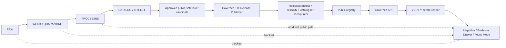
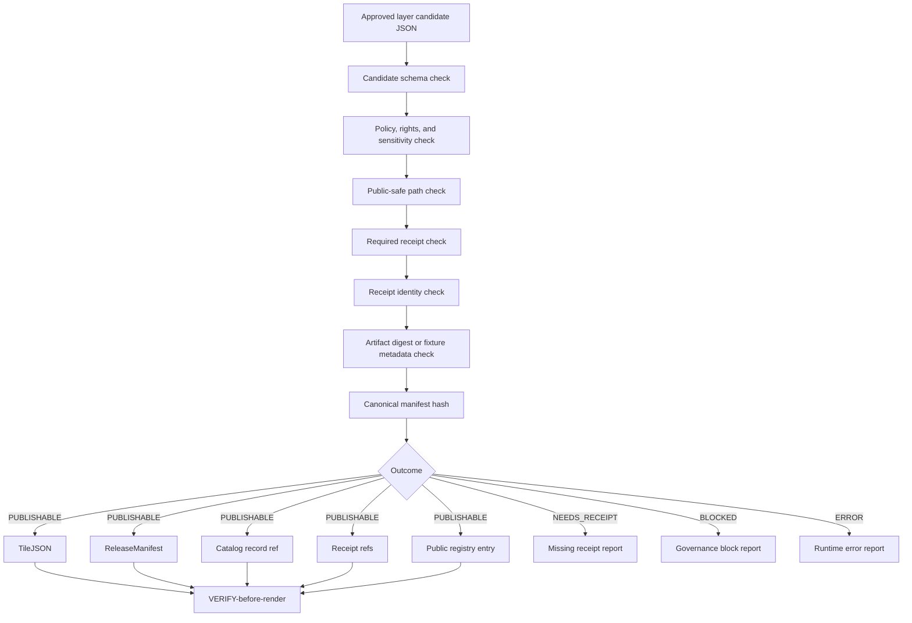

<!-- [KFM_META_BLOCK_V2]
doc_id: kfm://doc/NEEDS-VERIFICATION-governed-tile-release-publisher
title: Governed Tile Release Publisher
type: standard
version: v1
status: draft
owners: OWNER_TBD
created: TODO(date): confirm original document creation date
updated: 2026-05-03
policy_label: public
related: [docs/architecture/NEEDS_VERIFICATION, scripts/publish_kfm_tile_layer.mjs, tests/fixtures/tile_release/valid/veg.layer.json]
tags: [kfm, tiles, release, publication, governance, map, tilejson, pmtiles]
notes: [Doc ID, owner, target repo path, related doc path, script path, fixture path, schema home, public registry home, signing policy, and implementation status require mounted-repo verification; revised from supplied draft with KFM doctrine preserved.]
[/KFM_META_BLOCK_V2] -->

# Governed Tile Release Publisher

Deterministic, no-network publication slice for approved map-layer candidates that emits governed release references without turning TileJSON, MVT, PMTiles, map tiles, screenshots, or rendered pixels into truth sources.

<p>
  
  
  
  
  
</p>

> [!IMPORTANT]
> **Status:** PROPOSED implementation / NEEDS VERIFICATION repo placement  
> **Owner:** OWNER_TBD  
> **Likely path:** `docs/architecture/governed-tile-release-publisher.md`  
> **Truth posture:** CONFIRMED KFM doctrine from project corpus / PROPOSED publisher contract / UNKNOWN mounted-repo implementation depth

## Quick navigation

- [Purpose](#purpose)
- [Evidence boundary](#evidence-boundary)
- [Repo fit](#repo-fit)
- [Doctrine lock](#doctrine-lock)
- [Trust boundary](#trust-boundary)
- [Release flow](#release-flow)
- [Accepted inputs](#accepted-inputs)
- [Exclusions](#exclusions)
- [Object separation](#object-separation)
- [Deterministic hashing](#deterministic-hashing)
- [Receipt requirements](#receipt-requirements)
- [Public-safe path policy](#public-safe-path-policy)
- [Outputs](#outputs)
- [Failure outcomes](#failure-outcomes)
- [VERIFY-before-render relationship](#verify-before-render-relationship)
- [Implementation hooks](#implementation-hooks)
- [Validation checklist](#validation-checklist)
- [Rollback and correction](#rollback-and-correction)
- [Open verification items](#open-verification-items)
- [Appendix: supplied source meta snapshot](#appendix-supplied-source-meta-snapshot)

---

## Purpose

The **Governed Tile Release Publisher** validates an already approved, public-safe map-layer release candidate and emits the governed references needed for public rendering and later verification:

- `TileJSON`
- `ReleaseManifest`
- catalog record reference
- receipt references
- proof references where supplied
- public registry entry

The publisher is intentionally narrow. It does **not** ingest raw sources, decide source authority, approve evidence, generate canonical truth, perform steward review, produce AI claims, or bypass promotion. Its job is to turn a release-ready candidate into a small set of separately inspectable release objects.

> [!IMPORTANT]
> `spec_hash` remains the deterministic identity anchor for the candidate. Render artifacts are downstream carriers. They are not evidence, policy, review, catalog, proof, receipt, or publication authority.

---

## Evidence boundary

This revision preserves the supplied draft’s core architecture while tightening uncertainty and repo-fit language.

| Evidence item | Status | Supports | Does not prove |
|---|---:|---|---|
| Supplied Markdown draft | `CONFIRMED` | Document title, current structure, named script and fixture paths, candidate sketch, outcomes, path policy, object separation, validation checklist | Current repo path, script existence, fixture existence, schema home, runtime behavior |
| KFM doctrine corpus | `CONFIRMED doctrine` | Trust membrane, cite-or-abstain posture, renderer-not-truth rule, EvidenceBundle priority, object-family separation, governed promotion | That this publisher is already implemented |
| Current mounted repo checkout | `UNKNOWN` | Nothing in this document depends on claiming mounted implementation evidence | File presence, tests, routes, CI, registry shape, package manager, release behavior |
| Script and fixture names from source draft | `NEEDS VERIFICATION` | Candidate implementation targets to inspect | That `scripts/publish_kfm_tile_layer.mjs` or `tests/fixtures/tile_release/valid/veg.layer.json` exist |

> [!NOTE]
> This document is a repo-useful draft. It is suitable for adaptation into a repository doc after maintainers verify the target path, owners, schema home, script path, fixture path, and release-object conventions.

---

## Repo fit

| Field | Status | Value |
|---|---:|---|
| Likely document path | `PROPOSED` | `docs/architecture/governed-tile-release-publisher.md` |
| Publisher script named by source draft | `NEEDS VERIFICATION` | `scripts/publish_kfm_tile_layer.mjs` |
| Valid fixture named by source draft | `NEEDS VERIFICATION` | `tests/fixtures/tile_release/valid/veg.layer.json` |
| Candidate schema home | `NEEDS VERIFICATION` | `schemas/contracts/v1/tile_release/` or repo-native equivalent |
| Upstream | `PROPOSED` | promotion decision, policy decision, source/candidate validation, artifact digest, catalog/proof preparation |
| Downstream | `PROPOSED` | public registry, governed API, MapLibre layer loading, Evidence Drawer, VERIFY-before-render gates |
| Runtime posture | `PROPOSED` | deterministic, no-network default, fail-closed |
| Public posture | `REQUIRED` | public policy, public sensitivity, approved review state, released governed artifact refs only |

### Placement rule

If the mounted repo already has a tile, release, layer-registry, or publication-doc convention, that convention should win. Do not create parallel authority for schemas, contracts, registries, or release objects without an ADR.

---

## Doctrine lock

| Doctrine | Publisher rule |
|---|---|
| `spec_hash_is_deterministic_identity` | The release candidate must declare a `spec_hash`. Manifest hashing uses canonical JSON and excludes runtime-only fields such as `published_at`. |
| `render_artifacts_are_not_truth_sources` | PMTiles, MVT, TileJSON, style fragments, screenshots, and map tiles are render artifacts only. They may point to evidence but do not replace it. |
| `receipts_proofs_manifests_catalog_records_remain_separate` | The publisher emits or references each object family separately. A receipt cannot become a proof. A manifest cannot become a catalog record. |
| `public_ui_uses_released_governed_artifacts_only` | Public clients receive governed release references and public registry entries, not RAW, WORK, QUARANTINE, canonical-private, draft, staging, or direct model outputs. |
| `cite_or_abstain` | If a consequential layer claim cannot resolve to evidence, the UI or API must abstain rather than present unsupported authority. |
| `promotion_is_governed_state_transition` | The publisher consumes promotion-ready candidates; it does not turn file movement, layer toggles, or registry writes into approval. |

---

## Trust boundary

The publisher sits after validation and promotion preparation, but before public discovery and rendering.



The publisher must fail closed when an input tries to cross the trust membrane without the expected review, receipt, policy, and release support.

---

## Release flow



The publisher is upstream of rendering. Renderers and client VERIFY gates consume release references only after this slice finishes successfully.

---

## Accepted inputs

A release candidate belongs here only when it is already promotion-ready and public-safe.

| Input | Required posture | Notes |
|---|---:|---|
| Layer candidate JSON | `REQUIRED` | Must include `layer_id`, `spec_hash`, public policy/sensitivity, artifact refs, and receipt requirements. |
| Promotion decision reference | `REQUIRED` | Confirms this candidate is entering publication as a governed state transition, not as an unreviewed file move. |
| Policy decision reference | `REQUIRED` | Confirms public policy posture and deny/abstain obligations. |
| Rights posture | `REQUIRED` | Must be public-release compatible or explicitly allow the referenced artifact to be exposed. |
| Receipt declarations | `REQUIRED` | `receipts.required_types` defines the receipt types that must be present before release. |
| Receipt references | `REQUIRED WHEN DECLARED` | Each required receipt must resolve to the same `layer_id` and `spec_hash` as the candidate. |
| Render artifact metadata | `REQUIRED` | PMTiles/MVT/TileJSON metadata or fixture byte hash for no-network tests. |
| Catalog/proof references | `RECOMMENDED` | The publisher can reference prepared catalog/proof objects; it must not collapse them into the manifest. |
| Public registry target | `REQUIRED` | The registry entry is public-facing release memory, not canonical truth. |

### Candidate field sketch

The exact schema home is `NEEDS VERIFICATION`. This sketch documents expected contract shape without claiming an implemented schema file.

```json
{
  "schema_version": "v1",
  "object_type": "TileReleaseCandidate",
  "layer_id": "kfm.layer.vegetation.public",
  "spec_hash": "sha256:...",
  "review_state": "approved",
  "promotion_decision_ref": "kfm://promotion-decision/...",
  "policy_decision_ref": "kfm://policy-decision/...",
  "policy_label": "public",
  "sensitivity": "public",
  "rights": {
    "rights_class": "public_release_allowed",
    "attribution_required": true,
    "attribution_text": "SOURCE_ATTRIBUTION_TBD"
  },
  "source_paths": ["data/published/..."],
  "render_artifacts": [
    {
      "artifact_type": "pmtiles",
      "uri": "public://tiles/vegetation.pmtiles",
      "sha256": "sha256:...",
      "media_type": "application/vnd.pmtiles"
    }
  ],
  "tilejson": {
    "scheme": "xyz",
    "minzoom": 6,
    "maxzoom": 12,
    "bounds": [-102.1, 36.9, -94.5, 40.1]
  },
  "receipts": {
    "required_types": ["candidate_validation", "policy_decision", "artifact_digest"],
    "refs": ["kfm://receipt/tile-release/example"]
  },
  "evidence_bundle_ref": "kfm://evidence/...",
  "catalog_record_ref": "kfm://catalog/...",
  "proof_ref": "kfm://proof/..."
}
```

> [!NOTE]
> The example uses a vegetation layer only as an illustrative candidate. Replace with a repo fixture after `tests/fixtures/tile_release/valid/veg.layer.json` is verified.

---

## Exclusions

The publisher must reject or ignore anything that tries to make the release slice do upstream trust work.

| Exclusion | Outcome | Where it belongs instead |
|---|---:|---|
| RAW, WORK, QUARANTINE, private, restricted, draft, staging, or unreleased source paths | `BLOCKED` | lifecycle pipeline, quarantine review, or promotion gate |
| Non-public `policy_label` or `sensitivity` | `BLOCKED` | restricted-access lane or steward review |
| Missing rights posture or rights that do not allow public release | `BLOCKED` | source registry, rights review, or restricted lane |
| Missing required receipt references | `NEEDS_RECEIPT` | receipt generation / validation lane |
| Receipt identity mismatch on `layer_id` or `spec_hash` | `BLOCKED` | correction flow before release |
| Direct canonical/private store references in public registry entries | `BLOCKED` | governed API reference or public release artifact |
| AI-generated claims without EvidenceBundle support | `BLOCKED` | governed AI citation validation and review |
| Treating PMTiles/MVT/TileJSON as evidence truth | `BLOCKED` | EvidenceBundle / catalog / proof surfaces |
| Runtime-only timestamps used as identity material | `BLOCKED` | manifest hashing correction |
| Client-side policy decisions | `BLOCKED` | backend policy and release gate |

---

## Object separation

The object families below stay separate even when one publisher run emits several of them.

| Object family | Role | Not allowed to do |
|---|---|---|
| `TileJSON` | Render descriptor for clients | Prove evidence, rights, review, or release state |
| PMTiles / MVT | Render payloads | Become canonical truth or policy authority |
| `ReleaseManifest` | Declares released artifacts, hashes, refs, and release identity | Replace catalog, proof, receipt, or review records |
| Catalog record | Discovery and metadata closure | Prove that the release process happened |
| Receipts | Process memory for validation, policy, artifact checks, and publish steps | Substitute for proof or EvidenceBundle |
| Proof references | Release-significant attestations | Become the public UI payload by themselves |
| Public registry entry | Public pointer to governed release refs | Point to raw/private/canonical stores |
| EvidenceBundle ref | Evidence support path for consequential claims | Become a tile payload or style expression |
| PolicyDecision ref | Policy outcome and reason memory | Become a UI-only toggle |

---

## Deterministic hashing

The publisher uses deterministic identity rules so the same semantic release input yields the same release identity.

### Canonical JSON rule

- Serialize JSON with lexicographic key ordering.
- Normalize primitive values consistently.
- Exclude runtime-only or event-time fields from deterministic hash inputs.
- Hash canonical bytes with SHA-256.
- Preserve `spec_hash` as candidate identity; do not recompute it from rendered artifacts.

### Manifest hash material

| Included in deterministic manifest hash | Excluded from deterministic manifest hash |
|---|---|
| `layer_id` | `published_at` |
| `spec_hash` | local temp paths |
| artifact IDs, URIs, media types, and digests | CI job URL unless declared as identity material |
| TileJSON identity fields | runner ID / worker hostname |
| catalog/proof/evidence/receipt refs | human-only summary text |
| policy decision ref | transient log paths |
| promotion decision ref | wall-clock runtime duration |

> [!NOTE]
> PMTiles metadata fixture hashing may use fixture bytes when the no-network test path explicitly declares fixture mode. Fixture hashing is a test support mechanism, not permission to skip artifact integrity checks in release mode.

---

## Receipt requirements

The candidate controls its receipt burden through `receipts.required_types`.

| Case | Outcome | Reason |
|---|---:|---|
| Every required receipt is present and identity-matched | Continue | The candidate has enough process memory to attempt publication. |
| One or more required receipt types are absent | `NEEDS_RECEIPT` | The publisher must not invent receipts. |
| Receipt `layer_id` differs from candidate `layer_id` | `BLOCKED` | The receipt belongs to another layer. |
| Receipt `spec_hash` differs from candidate `spec_hash` | `BLOCKED` | The receipt belongs to another candidate identity. |
| Receipt exists but points to private or unreleased objects | `BLOCKED` | Release memory would leak or normalize unsafe paths. |
| Receipt claims unsupported success state | `BLOCKED` | Process memory is inconsistent and requires correction. |

Receipts remain process memory. A successful receipt check does not prove source truth; it proves that named required checks were performed for the same candidate identity.

---

## Public-safe path policy

The publisher must fail closed on path markers that indicate unpublished, internal, or restricted lifecycle stages.

### Blocked path markers

```text
RAW
WORK
QUARANTINE
canonical-private
private
restricted
draft
staging
unreleased
```

The check should apply case-insensitively to source paths, artifact paths, registry targets, and any URI written into public-facing release objects.

Use a segment-aware check where practical so governance markers are caught without creating noisy false positives from unrelated substrings.

### Required public posture

| Field | Required value |
|---|---|
| `policy_label` | `public` |
| `sensitivity` | `public` |
| `review_state` | `approved` |
| `rights.rights_class` | `public_release_allowed` or repo-approved equivalent |
| `provisional` | `false` or absent |
| `promotion_decision_ref` | present |
| `policy_decision_ref` | present |
| public registry path | released governed artifact refs only |

---

## Outputs

When the outcome is `PUBLISHABLE`, the publisher emits a coherent release set.

| Output | Status | Purpose |
|---|---:|---|
| `release_manifest.json` | `REQUIRED` | Release artifact identity, artifact digests, and governed refs. |
| `tilejson.json` | `REQUIRED` | Public render descriptor derived from the candidate. |
| catalog record ref | `REQUIRED` | Public discovery/metadata closure where policy allows. |
| receipt reference list | `REQUIRED` | Declares which process-memory objects support this release action. |
| public registry entry | `REQUIRED` | Public pointer that clients and APIs use to discover released governed artifacts. |
| proof refs | `WHEN SUPPLIED` | Keeps release-significant attestations available without merging them into receipts or TileJSON. |
| publisher result envelope | `REQUIRED` | Records outcome, refs, reason codes, and rollback target. |

### Output envelope sketch

```json
{
  "schema_version": "v1",
  "object_type": "TileReleasePublisherResult",
  "outcome": "PUBLISHABLE",
  "layer_id": "kfm.layer.vegetation.public",
  "spec_hash": "sha256:...",
  "release_manifest_ref": "kfm://release-manifest/...",
  "tilejson_ref": "kfm://tilejson/...",
  "catalog_record_ref": "kfm://catalog/...",
  "receipt_refs": ["kfm://receipt/..."],
  "policy_decision_ref": "kfm://policy-decision/...",
  "promotion_decision_ref": "kfm://promotion-decision/...",
  "public_registry_ref": "kfm://registry/public/layers/...",
  "rollback_ref": "kfm://rollback/tile-release/..."
}
```

---

## Failure outcomes

| Outcome | Meaning | Public release allowed? |
|---|---|---:|
| `PUBLISHABLE` | All publisher checks passed and output objects were generated. | Yes, through governed release refs only. |
| `NEEDS_RECEIPT` | Required receipt references are missing. | No. |
| `BLOCKED` | Governance policy failed, identity mismatched, path was unsafe, rights were unresolved, or public posture was invalid. | No. |
| `ERROR` | Unexpected runtime failure. | No. |

> [!WARNING]
> `ERROR` is not a weaker form of approval. Any unexpected runtime failure denies publication until rerun or review resolves it.

### Suggested reason codes

| Reason code | Outcome | Meaning |
|---|---:|---|
| `candidate_schema_invalid` | `BLOCKED` | Candidate does not match the expected contract. |
| `not_approved` | `BLOCKED` | `review_state` is not `approved`. |
| `not_public_policy` | `BLOCKED` | `policy_label` is not `public`. |
| `not_public_sensitivity` | `BLOCKED` | `sensitivity` is not `public`. |
| `rights_not_public` | `BLOCKED` | Rights posture is missing or not public-release compatible. |
| `unsafe_path_marker` | `BLOCKED` | A public-facing path contains blocked lifecycle/internal markers. |
| `missing_required_receipt` | `NEEDS_RECEIPT` | A required receipt type is absent. |
| `receipt_identity_mismatch` | `BLOCKED` | Receipt does not match candidate `layer_id` or `spec_hash`. |
| `artifact_digest_mismatch` | `BLOCKED` | Artifact digest or fixture hash does not match expectation. |
| `manifest_hash_unstable` | `BLOCKED` | Deterministic manifest hash includes runtime-only fields or unstable material. |
| `unexpected_runtime_error` | `ERROR` | Runtime failed before a governed decision could be completed. |

---

## VERIFY-before-render relationship

This publisher is **upstream** from client and API VERIFY gates.

The intended relationship is:

1. The publisher emits release references for a public-safe layer.
2. A governed API or registry exposes those references to the UI.
3. VERIFY-before-render checks release state, manifest identity, artifact digest expectations, catalog/evidence availability, rights posture, and policy posture.
4. Only then may MapLibre or another renderer load the released artifact.

Render clients must not bypass the registry to fetch raw PMTiles, MVT, or TileJSON from ungoverned source paths.

> [!IMPORTANT]
> VERIFY-before-render is not a cosmetic loading screen. It is the final public-surface check that prevents a renderer from normalizing unsupported, unreleased, stale, restricted, or policy-blocked artifacts.

---

## Implementation hooks

These hooks are PROPOSED until repo conventions are verified.

| Hook | Status | Purpose |
|---|---:|---|
| `scripts/publish_kfm_tile_layer.mjs` | `NEEDS VERIFICATION` | Candidate publisher script named by the source draft. |
| `tests/fixtures/tile_release/valid/veg.layer.json` | `NEEDS VERIFICATION` | Valid fixture named by the source draft. |
| `tests/fixtures/tile_release/invalid/` | `PROPOSED` | Fixture family for missing receipt, unsafe path, identity mismatch, non-public sensitivity, digest mismatch. |
| `schemas/contracts/v1/tile_release/TileReleaseCandidate.schema.json` | `PROPOSED` | Machine-readable candidate contract if repo schema convention allows this home. |
| `schemas/contracts/v1/tile_release/TileReleasePublisherResult.schema.json` | `PROPOSED` | Machine-readable result envelope contract. |
| `docs/adr/ADR-tile-release-schema-home.md` | `PROPOSED WHEN NEEDED` | Resolve schema-home ambiguity before creating parallel authority. |
| `data/registry/public/layers/` | `NEEDS VERIFICATION` | Candidate public layer registry home or API-backed equivalent. |
| `data/releases/tile_layers/` | `NEEDS VERIFICATION` | Candidate release-manifest home or repo-native equivalent. |

### Minimal test fixture matrix

| Fixture | Expected outcome |
|---|---:|
| valid public candidate with all receipts | `PUBLISHABLE` |
| missing required receipt | `NEEDS_RECEIPT` |
| receipt `spec_hash` mismatch | `BLOCKED` |
| receipt `layer_id` mismatch | `BLOCKED` |
| non-public sensitivity | `BLOCKED` |
| unsafe source path marker | `BLOCKED` |
| direct canonical/private registry target | `BLOCKED` |
| artifact digest mismatch | `BLOCKED` |
| manifest hash includes `published_at` | `BLOCKED` |
| malformed JSON | `ERROR` |

---

## Validation checklist

Use this as the pre-publish gate checklist for the script or test fixture.

| Check | Required result | Failure outcome |
|---|---:|---:|
| Candidate JSON parses | pass | `ERROR` |
| Candidate schema validates | pass | `BLOCKED` |
| `review_state` is approved | pass | `BLOCKED` |
| `promotion_decision_ref` is present | pass | `BLOCKED` |
| `policy_decision_ref` is present | pass | `BLOCKED` |
| `policy_label` is public | pass | `BLOCKED` |
| `sensitivity` is public | pass | `BLOCKED` |
| Rights posture allows public release | pass | `BLOCKED` |
| Source and artifact paths are public-safe | pass | `BLOCKED` |
| `spec_hash` is present and well-formed | pass | `BLOCKED` |
| Required receipts are present | pass | `NEEDS_RECEIPT` |
| Receipt `layer_id` matches | pass | `BLOCKED` |
| Receipt `spec_hash` matches | pass | `BLOCKED` |
| Render artifact digest or fixture hash validates | pass | `BLOCKED` |
| Manifest canonical hash excludes `published_at` | pass | `BLOCKED` |
| Output object families remain separate | pass | `BLOCKED` |
| Public registry points only to governed release refs | pass | `BLOCKED` |
| Result envelope includes rollback ref or rollback target | pass | `BLOCKED` |
| No output points to RAW, WORK, QUARANTINE, draft, staging, restricted, or canonical-private paths | pass | `BLOCKED` |

---

## Rollback and correction

Rollback is required when a release output weakens source integrity, leaks unsafe paths, breaks object-family separation, uses unstable identity material, publishes unsupported claims, or causes public clients to bypass governed APIs.

| Trigger | Required action |
|---|---|
| Unsafe path escaped into public registry | Withdraw registry entry; emit correction notice; preserve receipt and error evidence. |
| Artifact digest mismatch discovered after publish | Withdraw or supersede release; regenerate manifest from corrected artifact; link old release to correction. |
| Receipt identity mismatch discovered after publish | Mark release blocked/withdrawn; require candidate correction and receipt regeneration. |
| Rights or sensitivity posture changes | Move to restricted/generalized access or withdraw public entry; record reason and transform. |
| Manifest hash instability found | Freeze affected release; remove unstable fields from hash material; regenerate release candidate. |
| Renderer bypass discovered | Disable direct path; route through governed API/registry; add regression test. |

Rollback target: `ROLLBACK_TARGET_TBD_AFTER_REPO_INSPECTION`

Correction output should preserve lineage rather than silently replacing the public pointer.

---

## Open verification items

| Item | Status | Why it remains open |
|---|---:|---|
| Confirm final repo path for this document | `NEEDS VERIFICATION` | No mounted repository was available for this revision. |
| Confirm document owner | `NEEDS VERIFICATION` | Owner was not present in the supplied draft. |
| Confirm document UUID / `doc_id` | `NEEDS VERIFICATION` | A real ID should be assigned by repo/document registry conventions. |
| Confirm script existence and CLI flags | `NEEDS VERIFICATION` | `scripts/publish_kfm_tile_layer.mjs` was named in the supplied draft but not inspected. |
| Confirm fixture existence and exact schema | `NEEDS VERIFICATION` | `tests/fixtures/tile_release/valid/veg.layer.json` was named in the supplied draft but not inspected. |
| Confirm schema home | `NEEDS VERIFICATION` | The broader KFM corpus frequently marks schema-home authority as unresolved without repo evidence. |
| Confirm public registry file/API home | `NEEDS VERIFICATION` | Registry implementation was not available for inspection. |
| Confirm signing/proof policy | `NEEDS VERIFICATION` | This slice preserves proof refs but does not define signing implementation. |
| Confirm whether `rights.rights_class` naming matches repo convention | `NEEDS VERIFICATION` | Rights posture is required, but field names must match existing contracts if present. |
| Confirm no-network behavior and release-mode behavior | `NEEDS VERIFICATION` | Draft posture is no-network default; production artifact verification may have repo-specific constraints. |
| Confirm VERIFY-before-render contract | `NEEDS VERIFICATION` | UI/API contract names and layer registry behavior require repo inspection. |

---

## Appendix: supplied source meta snapshot

<details>
<summary>Preserved source meta from the supplied draft</summary>

The following source meta was supplied with the draft and preserved here as source context. The repo-standard meta block at the top of this file remains the active document metadata wrapper.

```yaml
kfm_meta:
  block_version: 2
  artifact_type: architecture_doc
  title: Governed Tile Release Publisher
  doctrine:
    - spec_hash_is_deterministic_identity
    - render_artifacts_are_not_truth_sources
    - receipts_proofs_manifests_catalog_records_remain_separate
    - public_ui_uses_released_governed_artifacts_only
  review_state: draft
  sensitivity: public
```

</details>
