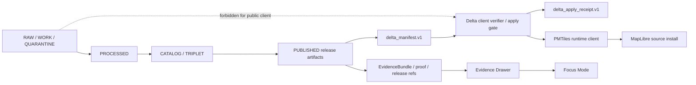
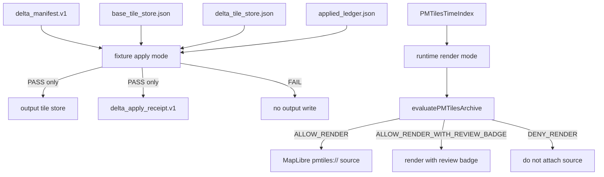
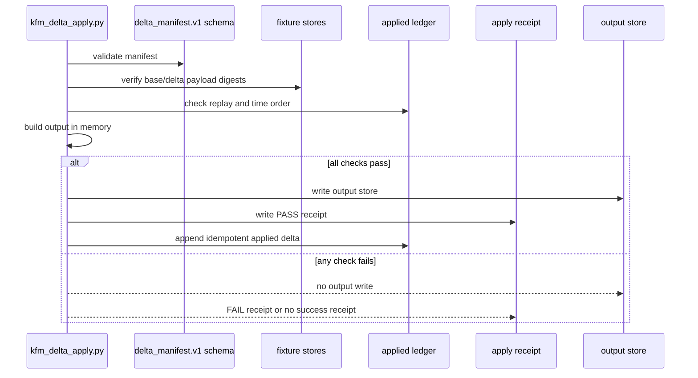

<!-- [KFM_META_BLOCK_V2]
doc_id: kfm://doc/NEEDS-VERIFICATION/pmtiles-delta-client-verifier
title: PMTiles Delta Client Verifier
type: standard
version: v1
status: draft
owners: OWNER_TBD
created: NEEDS VERIFICATION: original repository creation date not confirmed
updated: 2026-05-03
policy_label: NEEDS VERIFICATION: confirm public/restricted label
related: [./PMTILES_DELTA_MANIFEST.md, ./PMTILES_RUNTIME_CLIENT.md, ./PMTILES_GOVERNANCE.md, ../../tiles/delta_apply.md, ../../../contracts/kfm/delta_manifest.v1.json, ../../../tools/tiles/kfm_delta_apply.py, ../../../tests/test_kfm_delta_apply.py, ../../../policy/tiles/delta_apply.rego, ../../../.github/workflows/tiles-ci.yml]
tags: [kfm, pmtiles, tiles, delta, verifier, maplibre, receipts, policy, rollback]
notes: [Revised from existing terse draft; object_family delta_apply.v1 retained; current GitHub repo evidence inspected; local mounted repo unavailable; CI/runtime/deployment execution not verified in this session.]
[/KFM_META_BLOCK_V2] -->

# PMTiles Delta Client Verifier

Fail-closed verification and fixture apply behavior for PMTiles delta manifests before public tile rendering, release use, or rollback-sensitive reuse.


> [!IMPORTANT]
> **Status:** draft  
> **Owner:** `OWNER_TBD`  
> **Path:** `docs/architecture/tiles/PMTILES_DELTA_CLIENT_VERIFIER.md`  
> **Object family:** `delta_apply.v1`  
> **Truth posture:** CONFIRMED GitHub-visible files and KFM doctrine / PROPOSED architecture hardening / UNKNOWN current CI pass status, branch protection, deployed runtime behavior, emitted receipts, and real PMTiles binary bridge.

> [!NOTE]
> This document is written from current GitHub-visible repository evidence plus KFM doctrine. The local `/mnt/data` workspace for this authoring session was not a mounted Git checkout, so local test execution, workflow status, deployment behavior, dashboards, logs, and production proof objects were not verified.

---

## Quick navigation

- [Purpose](#purpose)
- [Repo fit](#repo-fit)
- [No-loss preservation from the existing draft](#no-loss-preservation-from-the-existing-draft)
- [Evidence boundary](#evidence-boundary)
- [Operating law](#operating-law)
- [Two verifier modes](#two-verifier-modes)
- [Accepted inputs](#accepted-inputs)
- [Exclusions](#exclusions)
- [Digest and canonicalization rules](#digest-and-canonicalization-rules)
- [Verification gates](#verification-gates)
- [Apply behavior](#apply-behavior)
- [Runtime render behavior](#runtime-render-behavior)
- [Outcome vocabulary bridge](#outcome-vocabulary-bridge)
- [Evidence Drawer contract](#evidence-drawer-contract)
- [Security and trust membrane rules](#security-and-trust-membrane-rules)
- [Validation and CI expectations](#validation-and-ci-expectations)
- [Rollback](#rollback)
- [Open verification backlog](#open-verification-backlog)

---

## Purpose

`PMTILES_DELTA_CLIENT_VERIFIER.md` defines how KFM verifies PMTiles delta manifests and fixture-mode tile changes before they can be applied, rendered, surfaced in the Evidence Drawer, or used as release-supporting runtime state.

The verifier exists to answer one narrow question:

> Is this PMTiles delta release candidate safe enough to apply or render under KFM’s trust rules?

It does **not** decide whether the underlying geographic claim is true. It only verifies that the downstream tile artifact is bound to the expected manifest, base archive, digests, receipts, lifecycle state, policy posture, replay context, and rollback semantics.

---

## Repo fit

| Surface | Path | Status in this session | Role |
| --- | --- | --- | --- |
| This architecture doc | `docs/architecture/tiles/PMTILES_DELTA_CLIENT_VERIFIER.md` | CONFIRMED existing file; revised here | Human-facing architecture and review guide. |
| Delta manifest architecture | [`./PMTILES_DELTA_MANIFEST.md`](./PMTILES_DELTA_MANIFEST.md) | CONFIRMED | Governs `delta_manifest.v1`. |
| Runtime client architecture | [`./PMTILES_RUNTIME_CLIENT.md`](./PMTILES_RUNTIME_CLIENT.md) | CONFIRMED | Describes fail-closed MapLibre runtime loading. |
| PMTiles governance | [`./PMTILES_GOVERNANCE.md`](./PMTILES_GOVERNANCE.md) | CONFIRMED | Governs PMTiles public release posture. |
| Delta apply working doc | [`../../tiles/delta_apply.md`](../../tiles/delta_apply.md) | CONFIRMED | Lower-level apply-engine notes and fixture semantics. |
| Delta schema | [`../../../contracts/kfm/delta_manifest.v1.json`](../../../contracts/kfm/delta_manifest.v1.json) | CONFIRMED | Machine schema for delta manifests. |
| Manifest validator | [`../../../tools/validators/tiles/validate_delta_manifest.py`](../../../tools/validators/tiles/validate_delta_manifest.py) | CONFIRMED | Schema + semantic validation for `delta_manifest.v1`. |
| Apply CLI | [`../../../tools/tiles/kfm_delta_apply.py`](../../../tools/tiles/kfm_delta_apply.py) | CONFIRMED | Fixture-mode verify/apply tool. |
| Apply tests | [`../../../tests/test_kfm_delta_apply.py`](../../../tests/test_kfm_delta_apply.py) | CONFIRMED | Pytest coverage for verify/apply behavior. |
| Apply policy | [`../../../policy/tiles/delta_apply.rego`](../../../policy/tiles/delta_apply.rego) | CONFIRMED | Receipt/policy denial rules. |
| Tiles CI workflow | [`../../../.github/workflows/tiles-ci.yml`](../../../.github/workflows/tiles-ci.yml) | CONFIRMED file presence | Workflow declaration; current run status not verified here. |

[Back to top](#pmtiles-delta-client-verifier)

---

## No-loss preservation from the existing draft

The existing file was short but strong. This revision keeps the substantive claims and makes the evidence, boundaries, and reviewer path visible.

| Existing element | Disposition | Where preserved |
| --- | --- | --- |
| `object_family: delta_apply.v1` | KEEP | Meta block, status badge, purpose, outcome model. |
| Fail-closed client verification and apply engine | KEEP + CLARIFY | [Purpose](#purpose), [Two verifier modes](#two-verifier-modes), [Verification gates](#verification-gates). |
| Use of `delta_manifest.v1` schema and validator | KEEP + GROUND | [Repo fit](#repo-fit), [Verification gates](#verification-gates). |
| JSON tile-store fixture model | KEEP | [Accepted inputs](#accepted-inputs), [Apply behavior](#apply-behavior). |
| Added/modified payload digest rule | KEEP | [Digest and canonicalization rules](#digest-and-canonicalization-rules). |
| Removed-tile tombstone digest rule | KEEP + WARN | [Digest and canonicalization rules](#digest-and-canonicalization-rules). |
| Forbidden RAW / WORK / QUARANTINE references | KEEP + ELEVATE | [Security and trust membrane rules](#security-and-trust-membrane-rules). |
| Produced count parity, unique tile keys, masked threshold, replay mismatch | KEEP | [Verification gates](#verification-gates). |
| Atomic in-memory apply and receipt-after-success behavior | KEEP | [Apply behavior](#apply-behavior). |
| Idempotent ledger append for same `delta_id + manifest_hash` | KEEP | [Apply behavior](#apply-behavior), [Rollback](#rollback). |
| Real PMTiles extraction bridge deferred | KEEP + MAKE VISIBLE | [Open verification backlog](#open-verification-backlog). |

---

## Evidence boundary

| Claim | Label | Evidence / limit |
| --- | --- | --- |
| Target file exists in the GitHub repo | CONFIRMED | File content was inspected via GitHub connector. |
| Adjacent PMTiles architecture docs exist | CONFIRMED | `PMTILES_DELTA_MANIFEST.md`, `PMTILES_RUNTIME_CLIENT.md`, and `PMTILES_GOVERNANCE.md` were inspected. |
| `delta_manifest.v1` schema exists | CONFIRMED | `contracts/kfm/delta_manifest.v1.json` was inspected. |
| Fixture apply CLI exists | CONFIRMED | `tools/tiles/kfm_delta_apply.py` was inspected. |
| Apply tests exist | CONFIRMED | `tests/test_kfm_delta_apply.py` was inspected. |
| Tiles CI workflow exists | CONFIRMED | `.github/workflows/tiles-ci.yml` was inspected. |
| CI currently passes | UNKNOWN | Workflow file was inspected; no live workflow run was verified in this session. |
| Branch protection requires tile checks | UNKNOWN | Not inspected. |
| Runtime deployment behavior | UNKNOWN | No browser session, logs, dashboards, or deployed app were inspected. |
| Real PMTiles binary delta extraction/apply bridge | DEFERRED / UNKNOWN | Current apply engine is fixture-mode JSON tile-store based. |
| Cryptographic signature verification in browser | NEEDS VERIFICATION | Current runtime docs and code distinguish references/status from full cryptographic proof. |

---

## Operating law

KFM’s tile verifier is downstream of the canonical data lifecycle:

```text
RAW -> WORK / QUARANTINE -> PROCESSED -> CATALOG / TRIPLET -> PUBLISHED
```

PMTiles archives, PMTiles deltas, MapLibre sources, runtime badges, and rendered tiles are delivery surfaces. They are not canonical truth, not evidence authority, not policy authority, and not publication approval.



> [!WARNING]
> A verified PMTiles delta is still only a verified delivery artifact. Consequential claims must resolve through governed evidence, policy, review, release state, and correction lineage.

[Back to top](#pmtiles-delta-client-verifier)

---

## Two verifier modes

The repo currently exposes two related but distinct verifier concerns.

| Mode | Current surface | What it verifies | Output | Boundary |
| --- | --- | --- | --- | --- |
| Fixture apply mode | `tools/tiles/kfm_delta_apply.py` | `delta_manifest.v1`, JSON fixture stores, digest semantics, replay/time-order, forbidden refs, policy-shaped receipt posture | Output JSON store + governed apply receipt after successful verification | Does not mutate real PMTiles binaries. |
| Runtime render mode | `apps/web/src/map/pmtiles/*` | Released archive references, digest format, lifecycle stage, completeness, masking, rights posture, proof/signature refs, verification status | MapLibre source install report or denial | Does not prove archive bytes unless verification status is genuinely backed by proof. |
| Real PMTiles bridge | `PATH_TBD_AFTER_IMPLEMENTATION` | PMTiles extraction, range/header checks, byte-level patching or rebuild, full archive digest | TBD | DEFERRED / NEEDS VERIFICATION. |

### Mode relationship



---

## Accepted inputs

### Fixture apply mode

| Input | Required posture |
| --- | --- |
| `delta_manifest.v1` | Schema-valid; semantically valid; spec-hash-bound; no forbidden lifecycle refs. |
| `base_tile_store.json` | JSON fixture store with deterministic `z/x/y` keys and base64 payloads. |
| `delta_tile_store.json` | JSON fixture store containing payloads for added and modified tiles. |
| `applied_ledger.json` | Replay and time-order context. |
| Policy input refs | Must not point at RAW, WORK, or QUARANTINE. |

### Runtime render mode

| Input | Required posture |
| --- | --- |
| `PMTilesTimeIndex` | Has a base archive and optional deltas. |
| `PMTilesArchiveRef` | Includes `archive_id`, `href`, lifecycle stage, public-safety posture, digest, rights/release posture, and verification status. |
| `proof_ref` or `signature_ref` | Required for released public artifacts. |
| `geoprivacy_receipt_ref` or `redaction_receipt_ref` | Required for public-safe exact-sensitive geometry cases. |
| `verification_status` | Must be `verified` for render eligibility under current runtime policy. |

---

## Exclusions

The verifier must not accept or normalize these as ordinary public behavior:

| Excluded behavior | Why it is denied or deferred |
| --- | --- |
| Direct browser/client access to RAW, WORK, or QUARANTINE | Bypasses lifecycle, review, and promotion state. |
| Treating PMTiles bytes as EvidenceBundle | Tiles are downstream delivery artifacts. |
| Real PMTiles binary mutation in current thin slice | Existing apply surface is JSON-fixture based. |
| Silent source replacement on digest/spec mismatch | Creates unreviewed public artifact drift. |
| Public render with unknown rights/license | Violates release posture. |
| Public render with `verification_status: not_implemented` or `unknown` | Falsely implies trust that has not been earned. |
| Signature references treated as signature verification | A reference is not proof of successful verification. |
| Generated language used as verification evidence | AI is interpretive only. |

---

## Digest and canonicalization rules

### Current fixture digest rules

The existing apply-engine draft and CLI preserve three digest rules:

| Tile change | Digest input | Expected behavior |
| --- | --- | --- |
| `added` | SHA-256 of decoded base64 delta payload | `prior_digest` must be absent/null; digest must match payload. |
| `modified` | SHA-256 of decoded base64 delta payload | `prior_digest` must match the base store; digest must match replacement payload. |
| `removed` | SHA-256 of canonical tombstone JSON | `prior_digest` must match the base store; tombstone digest must match the manifest. |

### Current compact JSON hash rule

The current Python verifier uses compact sorted-key JSON for manifest and tombstone hashing.

```text
json.dumps(obj, sort_keys=True, separators=(",", ":"), ensure_ascii=False)
sha256(utf8_bytes)
```

### RFC 8785 / JCS posture

`NEEDS VERIFICATION`: the current helper is deterministic compact sorted-key JSON, but it is not yet documented here as a full RFC 8785 JSON Canonicalization Scheme implementation. A future ADR should decide whether KFM standardizes all JSON signing/hashing on RFC 8785/JCS or preserves a narrower repo-native canonical JSON helper for this object family.

> [!CAUTION]
> Do not change canonicalization rules casually. Manifest hashes, replay checks, receipt hashes, proof bundles, and rollback lineage depend on byte-stable canonicalization.

[Back to top](#pmtiles-delta-client-verifier)

---

## Verification gates

The verifier fails closed. A failed gate prevents output writes, successful receipts, successful ledger append, and public runtime source attachment.

| Gate | Fixture apply mode | Runtime render mode |
| --- | --- | --- |
| Schema | Validate `delta_manifest.v1` with JSON Schema 2020-12. | Validate time-index/archive-ref shape before evaluation. |
| Manifest hash | Compute deterministic manifest hash. | Require digest-bearing archive refs and release refs where applicable. |
| Base identity | Require and compare `base_pmtiles.spec_hash`. | Require digest/spec/release posture for base archive. |
| Forbidden refs | Deny RAW, WORK, QUARANTINE refs. | Deny public artifact refs from internal lifecycle stages. |
| Count parity | Require produced count equals manifest tile count. | Recompute completeness where tile count and expected count are present. |
| Unique keys | Require unique `z/x/y` tile keys. | Require deterministic archive/source IDs. |
| Tile fields | Require tile ID, coordinates, quadkey, receipt URL. | Require archive ID and href. |
| Masking threshold | Deny/review according to manifest threshold. | Deny above max; require attestation in review band. |
| Change semantics | Enforce added/modified/removed prior and payload semantics. | Select only render-eligible base/delta archives. |
| Replay | Deny same `delta_id` with different manifest hash. | NE​EDS VERIFICATION for browser-visible replay state. |
| Time order | Deny older `time_end` by default. | Sort deltas deterministically; latest eligible delta only. |
| Rights/license | Policy input only in apply receipt today. | Deny unknown rights/license posture. |
| Verification status | Receipt/policy-shaped today. | Deny unless `verification_status === "verified"`. |

---

## Apply behavior

The fixture apply engine should remain atomic:

1. Load manifest, base store, delta store, and ledger.
2. Validate schema.
3. Compute manifest hash.
4. Reject forbidden lifecycle refs.
5. Validate base spec hash.
6. Validate tile count and unique key semantics.
7. Validate change-type-specific digest rules.
8. Validate replay and time ordering.
9. Build the output store entirely in memory.
10. Write output store only after all checks pass.
11. Write governed receipt only after verification succeeds.
12. Append ledger idempotently for the same `delta_id + manifest_hash`.
13. Fail same `delta_id` with different `manifest_hash`.



> [!IMPORTANT]
> Partial output is a failure. A failed verification must not leave a public-looking tile store, success receipt, or ambiguous ledger state.

---

## Runtime render behavior

The runtime PMTiles client evaluates archive references before adding MapLibre sources.

Current repo-visible runtime behavior includes:

- a `PMTilesArchiveRef` type with lifecycle, digest, proof/signature, spec hash, completeness, masking, coverage, rights, sensitivity, geoprivacy, release, promotion, and verification-status fields;
- an evaluation function that denies missing/invalid digests, forbidden public lifecycle stage, low completeness, high masking, unknown rights/license, missing geoprivacy/redaction receipt for public exact-sensitive output, missing proof/signature for released public artifact, and non-`verified` verification status;
- a loader that adds the PMTiles protocol and attaches allowed sources using `pmtiles://`;
- tests that exercise valid archives, review-band masking, denial thresholds, denied sources, and Evidence Drawer-safe rows.

### Runtime decision rule

```text
Attach only archives whose evaluation is ALLOW_RENDER or ALLOW_RENDER_WITH_REVIEW_BADGE.
Never attach DENY_RENDER archives.
```

### Source collision posture

`NEEDS VERIFICATION`: the runtime architecture doc calls for collision denial when a source ID matches but digest or spec hash differs. Current inspected installer evidence confirms duplicate source IDs are skipped when `map.getSource(sourceId)` already exists, but it does not prove full digest/spec collision denial in the installer. Treat source-ID collision hardening as an open implementation check.

---

## Outcome vocabulary bridge

KFM currently uses several outcome vocabularies across release gates, runtime render decisions, and apply receipts. This document keeps them distinct rather than flattening them.

| Surface | Outcomes | Notes |
| --- | --- | --- |
| Manifest / release validation | `PASS`, `REVIEW`, `DENY`, `ERROR` | Release and policy gate language. |
| Runtime render | `ALLOW_RENDER`, `ALLOW_RENDER_WITH_REVIEW_BADGE`, `DENY_RENDER` | MapLibre source installation language. |
| Apply CLI | process exit `0` / non-zero and printed `PASS` / `FAIL` | Fixture tool behavior. |
| Apply receipt | `PASS` / `FAIL` | Receipt result language. |
| Focus / AI runtime | `ANSWER`, `ABSTAIN`, `DENY`, `ERROR` | AI/runtime answer language; not used to approve tile application. |

> [!NOTE]
> A future outcome-grammar ADR should decide whether these vocabularies remain separate or map into a shared envelope. Do not silently replace one with another in code or docs.

---

## Evidence Drawer contract

The client verifier should expose enough non-sensitive fields for the Evidence Drawer and review console.

| Field | Source | Purpose |
| --- | --- | --- |
| `href` | archive ref | Public artifact location. |
| `digest` | archive ref | Integrity posture. |
| `spec_hash` | archive ref / manifest | Base/release identity. |
| `generated_at` | archive ref / manifest | Freshness and delta ordering. |
| `promotion_or_release_ref` | release or promotion ref | Release state. |
| `completeness_pct` | manifest/runtime ref | Coverage quality. |
| `masked_pct` | manifest/runtime ref | Public-safety masking. |
| `coverage_pct` | manifest/runtime ref | Coverage after transforms. |
| `signature_ref` | archive ref | Signature reference; not proof by itself. |
| `proof_ref` | archive ref | Proof pack / validation support. |
| `geoprivacy_receipt_ref` | archive ref | Public-safe geometry support. |
| `redaction_receipt_ref` | archive ref | Redaction support. |
| `runtime_decision` | runtime evaluator | Render/deny result. |
| `deny_reasons` | runtime evaluator | User-visible negative state. |
| `review_badge_reason` | runtime evaluator | Review-badge explanation. |

The Evidence Drawer must not include raw exact sensitive geometry, RAW/WORK/QUARANTINE references, secrets, private keys, or unreviewed source payloads.

[Back to top](#pmtiles-delta-client-verifier)

---

## Security and trust membrane rules

| Rule | Required behavior |
| --- | --- |
| No forbidden lifecycle refs | Deny RAW, WORK, QUARANTINE refs before apply or render. |
| No direct canonical access | Runtime must consume released manifests/artifacts, not canonical/internal stores. |
| No silent fallback | Failed verification must produce a visible negative state, not an unbadged render. |
| No private keys in browser | Browser verifier may use public verification material only. |
| No proof-by-badge | UI badges summarize verification state; they are not signatures. |
| No full-truth claim from tiles | Tiles remain delivery artifacts; claims require EvidenceBundle resolution. |
| Cache-aware rollback | Mutable aliases need short cache posture and rollback-safe invalidation. |
| Sensitive geometry fails closed | Public exact-sensitive surfaces require geoprivacy/redaction receipts or denial. |

---

## Validation and CI expectations

The repo contains a `tiles-ci` workflow declaration with jobs for delta manifest validation, delta apply tests, verified tile release artifacts, and tile runtime governance.

Current authoring session did not execute that workflow. Treat these commands as repo-confirmed workflow intent, not as proof of current passing status.

### Fixture apply tests

```bash
pytest -q tests/test_kfm_delta_apply.py
```

### Fixture apply verification

```bash
python tools/tiles/kfm_delta_apply.py verify \
  --manifest tests/fixtures/tiles/delta_apply/valid/delta_manifest.json \
  --base-store tests/fixtures/tiles/delta_apply/valid/base_tile_store.json \
  --delta-store tests/fixtures/tiles/delta_apply/valid/delta_tile_store.json \
  --ledger tests/fixtures/tiles/delta_apply/valid/applied_ledger.json
```

### Delta manifest validator

```bash
python tools/validators/tiles/validate_delta_manifest.py \
  tests/fixtures/tiles/delta_manifest/valid/delta_manifest.valid.json
```

### Policy tests

```bash
opa test policy/tiles -v
```

> [!CAUTION]
> Run these in the real checkout before claiming implementation readiness. This document confirms file presence and declared workflow intent, not live CI status.

---

## Rollback

Rollback is required when a verifier change:

- permits RAW, WORK, or QUARANTINE references into public or success states;
- weakens digest checks;
- weakens base `spec_hash` checks;
- permits duplicate `delta_id` with a different manifest hash;
- writes output before verification succeeds;
- writes a success receipt after failed verification;
- removes replay or time-order protections;
- treats signature references as verified signatures without a real verifier;
- renders public PMTiles with unknown rights, unknown license, missing proof, or missing geoprivacy posture;
- breaks Evidence Drawer negative-state visibility.

### Rollback target

```text
ROLLBACK_TARGET_NEEDS_VERIFICATION: prior commit containing last known-good delta verifier doc, tool, policy, and tests.
```

### Rollback sequence

1. Revert the doc/tool/policy/test PR or restore the last known-good release branch.
2. Preserve failed receipts and validation reports for audit.
3. Do not delete correction history.
4. Disable public runtime use of affected PMTiles layer manifests if release impact is suspected.
5. Re-run `tiles-ci` and record the result.
6. If public output was affected, emit a correction notice or withdrawal record through the repo-native release process.

---

## Open verification backlog

| Item | Status | Required check |
| --- | --- | --- |
| Owner | `OWNER_TBD` | Assign steward or team. |
| Original creation date | NEEDS VERIFICATION | Confirm from Git history if needed. |
| Local test execution | NEEDS VERIFICATION | Run tests in a mounted checkout. |
| CI pass status | UNKNOWN | Inspect latest workflow runs. |
| Branch protection | UNKNOWN | Confirm whether `tiles-ci` is required before merge. |
| Real PMTiles extraction bridge | DEFERRED | Define bridge from real PMTiles archive to fixture/verifier semantics. |
| Real PMTiles binary mutation | DEFERRED | Do not implement until bridge, digest, and receipt semantics are stable. |
| Runtime source collision denial | NEEDS VERIFICATION | Confirm installer compares existing source digest/spec hash before skipping. |
| Cryptographic verification | NEEDS VERIFICATION | Implement or confirm WebCrypto/Sigstore/Cosign verification rather than relying on `verification_status`. |
| JCS / RFC 8785 adoption | NEEDS VERIFICATION | Decide canonicalization standard by ADR. |
| Tombstone contract | NEEDS VERIFICATION | Lock exact tombstone JSON fields and canonicalization. |
| Apply receipt schema | PROPOSED / NEEDS VERIFICATION | Confirm or add `delta_apply_receipt.v1` schema. |
| Ledger schema | PROPOSED / NEEDS VERIFICATION | Confirm applied-ledger object family and fields. |
| Production PMTiles Range/CORS | NEEDS VERIFICATION | Verify public hosting supports required range reads, CORS, and cache behavior. |
| EvidenceBundle linkage | NEEDS VERIFICATION | Confirm drawer/focus paths resolve evidence refs for PMTiles-backed claims. |
| Policy outcome vocabulary | NEEDS VERIFICATION | Decide whether `PASS/REVIEW/DENY/ERROR` and `ALLOW_RENDER/*` remain separate. |

---

## Acceptance checklist

- [ ] Existing terse draft requirements preserved.
- [ ] `KFM_META_BLOCK_V2` present.
- [ ] Exactly one H1.
- [ ] Adjacent PMTiles docs linked.
- [ ] Confirmed repo paths are linked with correct relative paths.
- [ ] Unknown runtime/CI/deployment claims are not overstated.
- [ ] Fixture apply and runtime render modes are separated.
- [ ] RAW / WORK / QUARANTINE denial is visible.
- [ ] Digest and tombstone semantics are visible.
- [ ] Atomic apply behavior is explicit.
- [ ] Evidence Drawer fields avoid sensitive/raw payload leakage.
- [ ] Rollback path is explicit.
- [ ] Real PMTiles bridge remains deferred until verified.

---

## Final posture

```text
CONFIRMED:
  - target file exists
  - adjacent PMTiles docs exist
  - delta manifest schema exists
  - fixture apply CLI exists
  - apply tests exist
  - policy file exists
  - tiles CI workflow file exists

PROPOSED:
  - architecture hardening
  - evidence drawer expectations
  - source collision hardening
  - outcome vocabulary ADR

UNKNOWN:
  - current CI pass status
  - branch protection
  - deployed runtime behavior
  - emitted production receipts/proofs
  - public PMTiles hosting behavior

DEFERRED:
  - real PMTiles extraction/apply bridge
  - binary PMTiles mutation
```

[Back to top](#pmtiles-delta-client-verifier)
