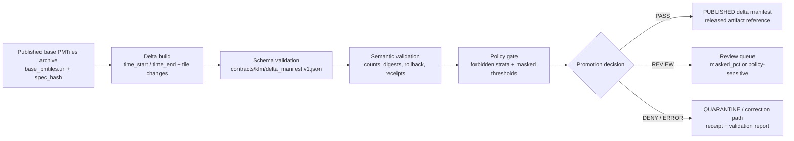
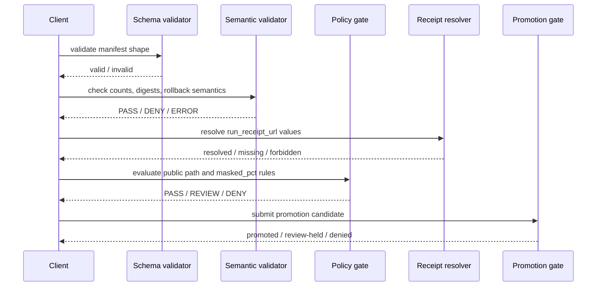

<!-- [KFM_META_BLOCK_V2]
doc_id: kfm://doc/pmtiles/delta-manifest-v1
title: PMTiles Delta Manifest
type: standard
version: v1
status: draft
owners: OWNER_TBD
created: TODO(date): original creation date not provided
updated: 2026-05-01
policy_label: NEEDS VERIFICATION: document access label not confirmed
object_family: delta_manifest.v1
scope: PMTiles time-sliced delta publication control slice
related:
  - PROPOSED: contracts/kfm/delta_manifest.v1.json
  - PROPOSED: tools/validators/tiles/validate_delta_manifest.py
  - PROPOSED: policy/tiles/delta_manifest.rego
  - PROPOSED: policy/tiles/delta_manifest_test.rego
  - PROPOSED: tests/fixtures/tiles/delta_manifest/
  - PROPOSED: .github/workflows/tiles-ci.yml
tags:
  - kfm
  - pmtiles
  - tiles
  - delta
  - manifest
  - publication
  - rollback
  - receipts
  - policy
notes:
  - PROPOSED PMTiles time-sliced delta publication-control slice.
  - Implementation, CI wiring, branch protection, signature execution, and production release behavior remain NEEDS VERIFICATION.
[/KFM_META_BLOCK_V2] -->

# PMTiles Delta Manifest

[](#status)
[](#truth-posture)
[](#manifest-contract)
[](#fail-closed-rules)
[](#operating-law)

A governed manifest contract for PMTiles delta slices, tile-level integrity checks, rollback posture, and receipt-linked publication control.

> [!IMPORTANT]
> **Status:** PROPOSED / draft  
> **Object family:** `delta_manifest.v1`  
> **Scope:** PMTiles time-sliced delta publication control slice  
> **Implementation depth:** UNKNOWN until the target repo, schema, validator, policy, tests, CI workflow, receipts, release manifests, and emitted artifacts are inspected.

---

## Quick navigation

- [At a glance](#at-a-glance)
- [Status](#status)
- [Purpose](#purpose)
- [Operating law](#operating-law)
- [Lifecycle placement](#lifecycle-placement)
- [Manifest contract](#manifest-contract)
- [Client verification behavior](#client-verification-behavior)
- [Fail-closed rules](#fail-closed-rules)
- [Rollback posture](#rollback-posture)
- [Implementation references](#implementation-references)
- [Illustrative manifest](#illustrative-manifest)
- [Fixture matrix](#fixture-matrix)
- [Verification checklist](#verification-checklist)
- [Open verification backlog](#open-verification-backlog)

---

## At a glance

| Item | Value |
| --- | --- |
| **Manifest version** | `v1` |
| **Primary use** | Governed PMTiles delta publication control |
| **Release posture** | Fail closed before public use |
| **Canonical truth?** | No. This is a downstream publication-control artifact. |
| **Requires receipts?** | Yes. Every tile change requires `run_receipt_url`. |
| **Rollback safe by default?** | Only when rollback digests and receipts validate. |
| **Public forbidden strata** | `RAW`, `WORK`, `QUARANTINE` |
| **Primary outcomes** | `PASS`, `REVIEW`, `DENY`, `ERROR` |
| **Current implementation status** | `UNKNOWN` until repo evidence confirms it |

---

## Status

| Dimension | Label | Notes |
| --- | --- | --- |
| Source draft | CONFIRMED | This document is based on the supplied PMTiles delta-manifest draft. |
| Manifest design | PROPOSED | The contract is design-ready, not implementation-confirmed. |
| Schema path | PROPOSED / NEEDS VERIFICATION | `contracts/kfm/delta_manifest.v1.json` |
| Validator path | PROPOSED / NEEDS VERIFICATION | `tools/validators/tiles/validate_delta_manifest.py` |
| Rego policy path | PROPOSED / NEEDS VERIFICATION | `policy/tiles/delta_manifest.rego` |
| Fixtures path | PROPOSED / NEEDS VERIFICATION | `tests/fixtures/tiles/delta_manifest/` |
| CI workflow | PROPOSED / NEEDS VERIFICATION | `.github/workflows/tiles-ci.yml` |
| Production enforcement | UNKNOWN | No branch protection, workflow run, release gate, or runtime evidence is asserted here. |

---

## Purpose

`delta_manifest.v1` defines a governed manifest for PMTiles delta slices so clients, validators, policy gates, and promotion workflows can verify:

- which base PMTiles archive the delta is tied to;
- which time interval the delta represents;
- which tiles were added, modified, or removed;
- whether rollback digests exist where rollback requires them;
- whether every tile change resolves to a run receipt;
- whether public references stay out of `RAW`, `WORK`, and `QUARANTINE`;
- whether masked-area thresholds require review or denial before promotion.

The manifest is a **publication-control object**, not the canonical spatial truth. PMTiles remains a map-delivery artifact downstream of source evidence, transforms, receipts, proof objects, catalog records, review state, and promotion decisions.

---

## What this file is and is not

| This file is | This file is not |
| --- | --- |
| A proposed manifest contract for PMTiles deltas. | A claim that the manifest is already enforced in production. |
| A publication and rollback control surface. | A replacement for EvidenceBundles, source descriptors, or release manifests. |
| A fail-closed validation target. | A permissive client-side convenience format. |
| A way to bind tile changes to receipts. | A way to publish uncited or unreviewed spatial claims. |
| A downstream delivery artifact contract. | Canonical truth, policy authority, or source authority. |

---

## Operating law

This manifest preserves the KFM trust membrane:

```text
RAW -> WORK / QUARANTINE -> PROCESSED -> CATALOG / TRIPLET -> PUBLISHED
```

The delta manifest may support publication, rollback, and client verification, but it does not replace:

- source descriptors;
- EvidenceBundles;
- transform receipts;
- validation reports;
- policy decisions;
- catalog/proof objects;
- release manifests;
- review records;
- correction notices;
- rollback cards.

> [!WARNING]
> A PMTiles delta that cannot prove its base archive, tile digests, receipt linkage, path boundaries, masked-percentage posture, and rollback semantics must not be promoted for public use.

---

## Lifecycle placement



---

## Verification sequence



---

## Definitions

| Term | Meaning |
| --- | --- |
| `base_pmtiles` | The already-published PMTiles archive that the delta is calculated against. |
| `spec_hash` | Deterministic identity for the base archive specification or content contract. Exact cross-family hash rules remain `NEEDS VERIFICATION`. |
| `delta_id` | Stable identifier for this delta manifest. It should be deterministic where practical. |
| `time_start` / `time_end` | ISO date-time interval covered by the tile delta. |
| `tile` | A changed PMTiles tile entry identified by tile coordinate and action. |
| `prior_digest` | Digest of the tile state before the delta. Required for rollback when a tile is modified or removed. |
| `new_digest` | Digest of the tile state after the delta. Required when a tile is added or modified. |
| `run_receipt_url` | Link or governed artifact reference to the run receipt that explains how this tile change was produced. |
| `masked_pct` | Percentage of the tile masked, generalized, redacted, or otherwise withheld for policy/sensitivity reasons. |
| `signature` | Optional signature metadata. `cosign` is permitted as a manifest entry method, but execution policy remains `NEEDS VERIFICATION`. |

---

## Manifest contract

### Top-level fields

| Field | Required | Rule |
| --- | ---: | --- |
| `manifest_version` | Yes | Must equal `v1`. |
| `delta_id` | Yes | Non-empty stable identifier. |
| `base_pmtiles.url` | Yes | Must point to the published base archive, not raw/work/quarantine storage. |
| `base_pmtiles.spec_hash` | Yes | Non-empty deterministic base identity. |
| `base_pmtiles.etag` | No | Optional upstream or storage ETag. |
| `time_start` | Yes | ISO date-time. Must be earlier than `time_end`. |
| `time_end` | Yes | ISO date-time. Must be later than `time_start`. |
| `expected_tile_count` | Yes | Expected number of tile changes. |
| `produced_tile_count` | Yes | Produced number of tile changes; must match the number of entries in `tiles[]`. |
| `tiles[]` | Yes | Tile-level change entries. Empty deltas are not accepted unless a future ADR explicitly permits no-op manifests. |
| `qc.masked_pct_pass_threshold` | Yes | Tile entries at or below this threshold may pass masked-percentage QC if all other gates pass. |
| `qc.masked_pct_review_threshold` | Yes | Tile entries above this threshold fail promotion or require review according to policy. |
| `signatures[]` | No | Optional signature records. `method=cosign` is allowed, but verification execution policy is not standardized in this document. |

### Tile entry fields

| Field | Required | Rule |
| --- | ---: | --- |
| `z` | Yes | Integer zoom level. |
| `x` | Yes | Integer tile x coordinate. |
| `y` | Yes | Integer tile y coordinate. |
| `action` | Yes | One of `added`, `modified`, `removed`. |
| `new_digest` | Conditional | Required for `added` and `modified`; must be null for `removed`. |
| `prior_digest` | Conditional | Required for `modified` and `removed`; must be null for `added`. |
| `masked_pct` | Yes | Number from 0 to 100. |
| `run_receipt_url` | Yes | Non-empty governed receipt reference. Must not reference `RAW`, `WORK`, or `QUARANTINE`. |

Recommended digest form for v1 is:

```text
sha256:<64 lowercase hex characters>
```

unless an existing KFM digest convention requires a different canonical digest format.

---

## Tile action semantics

| Action | `prior_digest` | `new_digest` | Rollback meaning |
| --- | --- | --- | --- |
| `added` | Must be null | Required | Remove or ignore the added tile in the rollback target. |
| `modified` | Required | Required | Restore the previous tile state identified by `prior_digest`. |
| `removed` | Required | Must be null | Restore the removed tile state identified by `prior_digest`. |

> [!CAUTION]
> `modified` and `removed` are not rollback-safe without `prior_digest`.

---

## Canonical manifest hash

Clients and validators should recompute the canonical manifest hash from sorted-key canonical JSON.

The hash should be computed over the manifest content using the repository’s approved canonicalization rule. Until cross-object-family standardization is confirmed, this document treats hash embedding as `NEEDS VERIFICATION`.

Recommended interim behavior:

1. Normalize the manifest to canonical JSON with sorted object keys.
2. Encode as UTF-8.
3. Hash the canonical bytes.
4. Store the resulting hash in the validation report, run receipt, proof pack, or promotion decision.
5. Do not add an embedded self-referential hash field unless an ADR defines whether that field is excluded from the hash input.

<details>
<summary>Open question: should the manifest contain its own hash?</summary>

A self-hash field is useful for client inspection, but dangerous without a formal exclusion rule. If `manifest_hash` is embedded in the same JSON object being hashed, the hash input must either exclude that field or use a two-pass convention. This requires an ADR before standardization.

</details>

---

## Client verification behavior

Clients and policy gates should verify the manifest before public use.

Minimum behavior:

1. Validate the manifest against `contracts/kfm/delta_manifest.v1.json`.
2. Recompute canonical manifest hash from sorted-key canonical JSON.
3. Confirm `base_pmtiles.spec_hash` is present and well-formed.
4. Confirm `produced_tile_count == len(tiles[])`.
5. Confirm `expected_tile_count == produced_tile_count`.
6. Confirm tile coordinate identities are unique within the manifest.
7. Enforce rollback-safety semantics:
   - `modified` and `removed` require non-null `prior_digest`;
   - `added` requires null `prior_digest`;
   - `added` and `modified` require non-null `new_digest`;
   - `removed` requires null `new_digest`.
8. Enforce receipt linkage:
   - every tile requires non-empty `run_receipt_url`.
9. Enforce public path boundaries:
   - public references to `RAW`, `WORK`, or `QUARANTINE` are denied.
10. Enforce masked-percentage QC:
   - values above the review threshold fail promotion or require review according to policy.
11. Return a finite validation result: `PASS`, `REVIEW`, `DENY`, or `ERROR`.

---

## Validation outcome model

| Outcome | Meaning | Public promotion allowed? |
| --- | --- | ---: |
| `PASS` | Schema, semantic, receipt, and policy checks passed. | Yes, if release gate also passes. |
| `REVIEW` | Manifest is structurally valid but needs human or steward review. | No, not until review resolves. |
| `DENY` | Manifest violates a hard rule. | No. |
| `ERROR` | Validator, resolver, or policy gate could not complete safely. | No. |

---

## Fail-closed rules

Validation fails closed when any of the following is true:

| Rule | Outcome |
| --- | --- |
| Any digest is malformed. | `DENY` |
| `base_pmtiles.spec_hash` is missing or empty. | `DENY` |
| `produced_tile_count` does not match `tiles.length`. | `DENY` |
| `expected_tile_count` does not match `produced_tile_count`. | `DENY` |
| `time_start >= time_end`. | `DENY` |
| Any tile action is outside `added`, `modified`, `removed`. | `DENY` |
| A rollback-required tile lacks `prior_digest`. | `DENY` |
| An `added` tile has non-null `prior_digest`. | `DENY` |
| A `removed` tile has non-null `new_digest`. | `DENY` |
| Any tile lacks `run_receipt_url`. | `DENY` |
| A public reference points to `RAW`, `WORK`, or `QUARANTINE`. | `DENY` |
| `masked_pct` exceeds `qc.masked_pct_review_threshold`. | `REVIEW` or `DENY`, depending on policy. |
| Optional `cosign` signature metadata exists but required signature verification policy is enabled and cannot verify it. | `DENY` or `ERROR`, depending on failure type. |

---

## Policy boundary

The Rego policy should evaluate at least:

- manifest version;
- base archive identity;
- tile count consistency;
- digest format;
- rollback digest semantics;
- receipt URL presence;
- forbidden storage strata;
- masked percentage thresholds;
- optional signature metadata shape;
- public-release eligibility.

Policy must treat forbidden storage strata as a hard denial for public output. A manifest may be useful for internal debugging and still be denied for publication.

### Storage-strata deny pattern

```text
DENY public references containing:
- /RAW/
- /raw/
- /WORK/
- /work/
- /QUARANTINE/
- /quarantine/
```

> [!NOTE]
> Exact path normalization is `NEEDS VERIFICATION`. Policy should handle casing, URL encoding, path traversal, query strings, and object-store aliases before this rule is considered complete.

---

## Rollback posture

Rollback is only safe when tile-level rollback information is present and receipt-linked.

| Action | Rollback requirement |
| --- | --- |
| `added` | Remove or ignore the added tile in the rollback target; `prior_digest` must be null. |
| `modified` | Restore the tile state identified by `prior_digest`. |
| `removed` | Restore the tile state identified by `prior_digest`. |

Rollback should emit a separate rollback receipt or rollback card that references:

- `delta_id`;
- canonical manifest hash;
- affected tile count;
- base PMTiles `spec_hash`;
- rollback target archive or release alias;
- operator or automation identity;
- policy decision;
- validation report;
- timestamp;
- reason for rollback.

---

## Implementation references

These paths are from the source draft and remain `PROPOSED / NEEDS VERIFICATION` until the target repo is inspected.

| Surface | Proposed path | Status |
| --- | --- | --- |
| Schema | `contracts/kfm/delta_manifest.v1.json` | PROPOSED / NEEDS VERIFICATION |
| Validator | `tools/validators/tiles/validate_delta_manifest.py` | PROPOSED / NEEDS VERIFICATION |
| Policy | `policy/tiles/delta_manifest.rego` | PROPOSED / NEEDS VERIFICATION |
| Policy tests | `policy/tiles/delta_manifest_test.rego` | PROPOSED / NEEDS VERIFICATION |
| Fixtures | `tests/fixtures/tiles/delta_manifest/` | PROPOSED / NEEDS VERIFICATION |
| CI workflow | `.github/workflows/tiles-ci.yml` | PROPOSED / NEEDS VERIFICATION |

> [!NOTE]
> If the mounted repository proves that `schemas/` rather than `contracts/` is the canonical machine-schema home, do not create parallel authority. Resolve through an ADR and a compatibility note before landing machine-readable files.

---

## Proposed repository slice

```text
contracts/
  kfm/
    delta_manifest.v1.json

policy/
  tiles/
    delta_manifest.rego
    delta_manifest_test.rego

tools/
  validators/
    tiles/
      validate_delta_manifest.py

tests/
  fixtures/
    tiles/
      delta_manifest/
        valid.modified.json
        deny.missing-spec-hash.json
        deny.bad-digest.json
        deny.count-mismatch.json
        deny.rollback-missing-prior-digest.json
        deny.added-has-prior-digest.json
        deny.removed-has-new-digest.json
        deny.missing-receipt.json
        deny.raw-path-reference.json
        review.masked-pct-threshold.json

.github/
  workflows/
    tiles-ci.yml
```

> [!TIP]
> Start with fixtures before public release wiring. Fixtures make the contract inspectable before runtime assumptions harden.

---

## Illustrative manifest

This example is illustrative. It is not evidence that a fixture exists in the repo.

```json
{
  "manifest_version": "v1",
  "delta_id": "delta-2026-05-01-example",
  "base_pmtiles": {
    "url": "published/tiles/kansas/base.pmtiles",
    "spec_hash": "sha256:1111111111111111111111111111111111111111111111111111111111111111",
    "etag": "example-etag"
  },
  "time_start": "2026-05-01T00:00:00Z",
  "time_end": "2026-05-01T06:00:00Z",
  "expected_tile_count": 1,
  "produced_tile_count": 1,
  "qc": {
    "masked_pct_pass_threshold": 5,
    "masked_pct_review_threshold": 20
  },
  "tiles": [
    {
      "z": 8,
      "x": 56,
      "y": 105,
      "action": "modified",
      "prior_digest": "sha256:aaaaaaaaaaaaaaaaaaaaaaaaaaaaaaaaaaaaaaaaaaaaaaaaaaaaaaaaaaaaaaaa",
      "new_digest": "sha256:bbbbbbbbbbbbbbbbbbbbbbbbbbbbbbbbbbbbbbbbbbbbbbbbbbbbbbbbbbbbbbbb",
      "masked_pct": 0.25,
      "run_receipt_url": "published/receipts/tiles/delta-2026-05-01-example.run_receipt.json"
    }
  ],
  "signatures": [
    {
      "method": "cosign",
      "sig_url": "published/proofs/tiles/delta-2026-05-01-example.cosign.bundle"
    }
  ]
}
```

---

## Fixture matrix

| Fixture | Expected result | Purpose |
| --- | --- | --- |
| `valid.modified.json` | `PASS` | Valid modified tile with prior and new digest. |
| `deny.missing-spec-hash.json` | `DENY` | Confirms base archive identity is required. |
| `deny.bad-digest.json` | `DENY` | Confirms digest format validation. |
| `deny.count-mismatch.json` | `DENY` | Confirms tile count consistency. |
| `deny.rollback-missing-prior-digest.json` | `DENY` | Confirms rollback digest is required for `modified` and `removed`. |
| `deny.added-has-prior-digest.json` | `DENY` | Confirms `added` tiles cannot carry prior state. |
| `deny.removed-has-new-digest.json` | `DENY` | Confirms removed tiles cannot carry new tile digest. |
| `deny.missing-receipt.json` | `DENY` | Confirms receipt linkage is required. |
| `deny.raw-path-reference.json` | `DENY` | Confirms forbidden storage strata are blocked. |
| `review.masked-pct-threshold.json` | `REVIEW` | Confirms masked-percentage review routing. |

---

## CI expectations

The proposed CI workflow should run, at minimum:

```bash
python tools/validators/tiles/validate_delta_manifest.py \
  tests/fixtures/tiles/delta_manifest/valid.modified.json

python tools/validators/tiles/validate_delta_manifest.py \
  tests/fixtures/tiles/delta_manifest/deny.bad-digest.json \
  --expect DENY
```

Policy tests should run through the repo-native Rego toolchain, if present.

```bash
opa test policy/tiles
```

> [!CAUTION]
> These commands are PROPOSED. Do not claim they pass until the actual repo, dependencies, validator, policy engine, and fixtures are inspected or created and executed.

---

## Compatibility and versioning

`manifest_version = v1` is the only version defined by this document.

Breaking changes require one of:

- a new manifest version such as `v2`;
- an ADR defining compatibility behavior;
- a migration note and fixture set;
- validator support for old and new versions during a defined transition period.

Non-breaking changes may include optional fields when they do not weaken rollback safety, path-boundary checks, receipt linkage, policy posture, or canonical hash behavior.

---

## ADR hooks

| ADR topic | Why it matters |
| --- | --- |
| Schema home | Prevents divergent authority between `contracts/` and `schemas/`. |
| Canonical hash embedding | Defines whether manifest hash is embedded, receipt-stored, proof-pack-stored, or all three. |
| Digest format | Defines accepted algorithms, casing, prefixes, and future algorithm agility. |
| Empty deltas | Decides whether no-op delta manifests are valid. |
| Cosign verification | Defines signature verification execution, failure outcomes, and required tooling. |
| Public path normalization | Defines how forbidden strata are detected across URLs, paths, object stores, and aliases. |

---

## Verification checklist

- [ ] Confirm target document path or create ADR-backed placement.
- [ ] Confirm schema home: `contracts/` vs `schemas/`.
- [ ] Confirm `contracts/kfm/delta_manifest.v1.json` exists or is created.
- [ ] Confirm digest format and canonical JSON rule.
- [ ] Confirm whether canonical manifest hash is embedded, receipt-stored, proof-pack-stored, or all three.
- [ ] Confirm validator rejects malformed digests.
- [ ] Confirm validator rejects missing `base_pmtiles.spec_hash`.
- [ ] Confirm validator rejects count mismatches.
- [ ] Confirm validator rejects invalid rollback digest semantics.
- [ ] Confirm policy denies public references to `RAW`, `WORK`, and `QUARANTINE`.
- [ ] Confirm masked percentage thresholds produce `PASS`, `REVIEW`, or `DENY`.
- [ ] Confirm every tile requires a non-empty `run_receipt_url`.
- [ ] Confirm optional `cosign` entries have a defined verification execution policy before promotion depends on them.
- [ ] Confirm fixtures cover valid, review, deny, and error cases.
- [ ] Confirm CI workflow runs schema, semantic validator, and policy tests.
- [ ] Confirm rollback receipt or rollback card behavior.
- [ ] Confirm no client treats PMTiles as canonical evidence.

---

## Rollback

Rollback is required when a promoted or candidate delta:

- fails digest validation;
- fails receipt resolution;
- points to forbidden storage strata;
- weakens masked/sensitive-location controls;
- loses rollback digests for modified or removed tiles;
- conflicts with the base archive `spec_hash`;
- cannot prove signature state when signature verification is required;
- causes public output to outrun review, policy, or release state.

Rollback target:

```text
ROLLBACK_TARGET_TBD_AFTER_RELEASE_MANIFEST_INSPECTION
```

---

## Open verification backlog

| Item | Status | Required check |
| --- | --- | --- |
| Production deployment wiring | NEEDS VERIFICATION | Confirm `.github/workflows/tiles-ci.yml` is wired into branch protection or release gates. |
| Canonical hash embedding field | NEEDS VERIFICATION | Decide whether hash is embedded, receipt-stored, proof-pack-stored, or all three. |
| Signature verification execution | NEEDS VERIFICATION | Define how `cosign` entries are verified and what failure mode they produce. |
| Schema authority | NEEDS VERIFICATION | Confirm `contracts/` vs `schemas/` canonical machine-contract home. |
| Public path normalization | NEEDS VERIFICATION | Confirm how URL/path normalization detects forbidden `RAW`, `WORK`, and `QUARANTINE` references. |
| Masked percentage semantics | NEEDS VERIFICATION | Confirm whether `masked_pct` is per tile, per feature contribution, or per rendered tile payload. |
| Empty deltas | NEEDS VERIFICATION | Decide whether no-op delta manifests are valid or denied. |
| Tile coordinate bounds | NEEDS VERIFICATION | Confirm zoom/x/y coordinate constraints for supported PMTiles scheme. |
| Branch protection | NEEDS VERIFICATION | Confirm whether tile CI is required before merge. |
| Release manifest linkage | NEEDS VERIFICATION | Confirm how `delta_id` and manifest hash appear in release objects. |

---

## Maintainer notes

<details>
<summary>Suggested first implementation PR</summary>

Smallest useful PR:

1. Add schema.
2. Add valid and deny fixtures.
3. Add semantic validator.
4. Add Rego policy and tests.
5. Add CI workflow in dry-run or non-branch-protected mode.
6. Add ADR for schema home and canonical hash handling.
7. Add a rollback-card fixture.

Do not wire public promotion until fixtures, validator, policy, receipts, and release-manifest linkage pass together.

</details>

<details>
<summary>Suggested review questions</summary>

- Does every public tile reference stay downstream of release state?
- Can every changed tile resolve a receipt?
- Can every rollback-required tile be restored?
- Does the validator abstain or deny when base identity is missing?
- Are masked/sensitive areas treated as policy-bearing, not cosmetic?
- Can a client recompute a stable manifest hash?
- Is signature metadata decorative, optional, or promotion-required?
- Are PMTiles being treated as delivery artifacts rather than canonical truth?

</details>

---

## Final posture

This document is ready as a GitHub Markdown working draft, but it remains bounded:

```text
CONFIRMED: source draft content and KFM doctrine alignment
PROPOSED: manifest contract, paths, validators, policy, fixtures, CI
UNKNOWN: current repo implementation, production enforcement, runtime behavior
NEEDS VERIFICATION: schema home, canonical hash rule, cosign execution, branch protection, release linkage
```
