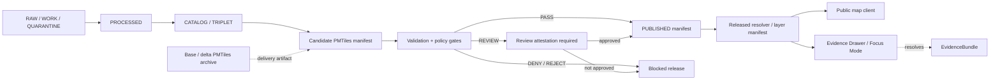

<!-- [KFM_META_BLOCK_V2]
doc_id: kfm://doc/NEEDS-VERIFICATION/pmtiles-governance
title: PMTiles Governance
type: standard
version: v1
status: draft
owners: OWNER_TBD
created: 2026-05-03
updated: 2026-05-03
policy_label: NEEDS VERIFICATION: confirm public/restricted label
related: [docs/adr/ADR-pmtiles-schema-home.md, docs/standards/NEEDS-VERIFICATION]
tags: [kfm, pmtiles, manifests, map-publication, governance, validation, promotion, geoprivacy]
notes: [PROPOSED path; README-like impact block included because this doc is used as an orientation standard; UNKNOWN repo implementation depth]
[/KFM_META_BLOCK_V2] -->

# PMTiles Governance

PMTiles manifests are governed publication objects for base and delta tile artifacts; rendered tiles are delivery surfaces, not KFM truth.


> [!IMPORTANT]
> **Status:** `experimental` / `draft`  
> **Owner:** `OWNER_TBD`  
> **Proposed path:** `docs/standards/pmtiles-governance.md`  
> **Document type:** standard + README-like orientation doc  
> **Truth posture:** CONFIRMED PMTiles doctrine from current source note / PROPOSED implementation contract / UNKNOWN repo implementation depth  
> **Badge posture:** static placeholder badges only; no CI, release, coverage, deployment, or policy automation status is implied.

> [!NOTE]
> This document states KFM PMTiles governance requirements and proposed manifest contracts. It does **not** confirm that the current repository already contains these schemas, validators, workflows, resolver routes, cache rules, proof packs, signature checks, or public-client behavior.

## Quick links

- [Scope](#scope)
- [Repo fit](#repo-fit)
- [Accepted inputs](#accepted-inputs)
- [Exclusions](#exclusions)
- [Operating law](#operating-law)
- [Artifact classes](#artifact-classes)
- [Manifest governance block](#manifest-governance-block)
- [Base and delta binding](#base-and-delta-binding)
- [Completeness, masking, and coverage](#completeness-masking-and-coverage)
- [Cache-Control policy](#cache-control-policy)
- [Rights, license, and geoprivacy](#rights-license-and-geoprivacy)
- [Proof and signature posture](#proof-and-signature-posture)
- [Promotion and CI gates](#promotion-and-ci-gates)
- [Public client resolution](#public-client-resolution)
- [Validation matrix](#validation-matrix)
- [Rollback](#rollback)
- [Open verification backlog](#open-verification-backlog)

---

## Scope

This standard governs PMTiles publication artifacts in KFM.

It applies to:

- base PMTiles archives;
- delta PMTiles archives;
- base manifests;
- delta manifests;
- layer manifests that reference PMTiles;
- resolver aliases such as `latest` or `current`;
- Evidence Drawer and Focus Mode payloads for PMTiles-backed layers;
- public map clients consuming released PMTiles artifacts.

This document is intentionally about **governed delivery**, not canonical truth storage.

## Repo fit

| Item | Status | Notes |
| --- | --- | --- |
| Proposed file | `docs/standards/pmtiles-governance.md` | PROPOSED until repo path is verified. |
| Document role | PMTiles standard / publication-governance orientation doc | Uses `KFM_META_BLOCK_V2` and README-like top block. |
| Upstream doctrine | KFM lifecycle, publication, evidence, policy, and rollback doctrine | CONFIRMED from current PMTiles note and KFM corpus. |
| Adjacent ADR | `docs/adr/ADR-pmtiles-schema-home.md` | PROPOSED if schema-home authority is unresolved. |
| Schema home | `schemas/contracts/v1/pmtiles/` or repo-native equivalent | CONFLICTED / NEEDS VERIFICATION until actual repo convention is inspected. |
| Validator home | `tools/validators/pmtiles/` or repo-native equivalent | PROPOSED. |
| Policy home | `policy/pmtiles/` or repo-native equivalent | PROPOSED. |
| Public UI dependency | MapLibre or governed renderer shell | Renderer remains downstream of released manifests and evidence. |

> [!WARNING]
> Do not create parallel schema authority. If the mounted repo shows both `contracts/` and `schemas/`, settle PMTiles schema placement with an ADR before adding machine-readable manifest schemas.

[Back to top](#pmtiles-governance)

---

## Accepted inputs

The following inputs belong in PMTiles governance work:

| Input | Accepted when | Required posture |
| --- | --- | --- |
| Base PMTiles archive | Immutable, digestable, release-addressed, and bound to a released manifest | Digest + release ref + proof posture |
| Delta PMTiles archive | Bound to exactly one base archive | Base digest + delta digest + zoom/bbox + completeness |
| Base manifest | Describes immutable base archive | `KFM_META_BLOCK_V2` equivalent manifest block |
| Delta manifest | Describes delta overlay and base binding | Completeness, masking, coverage, rights, geoprivacy, proof/signature refs |
| Layer manifest | Public-facing map-layer contract | Released PMTiles manifest refs only |
| Resolver alias | Mutable pointer to released manifest | Short TTL + release-only resolution |
| Validation report | Independent check of manifest claims | Required before public/released state |
| Geoprivacy receipt | Records masking/generalization/suppression transform | Required when public geometry exposure is possible |
| Proof/signature refs | Integrity and release-supporting artifacts | Required for public/released artifacts |

## Exclusions

The following do **not** belong in PMTiles public resolution paths:

| Excluded item | Reason | Safer handling |
| --- | --- | --- |
| RAW, WORK, or QUARANTINE references | Bypasses KFM lifecycle and review state | Block at policy gate |
| Unpublished builder output | Not a released artifact | Keep in WORK or PROCESSED until promoted |
| Local filesystem paths | Not a governed public interface | Resolve through released manifests |
| Direct canonical/internal store access | Bypasses public trust membrane | Use governed API and released artifacts |
| Unsigned or unknown-signature public artifacts | Fails integrity posture | Deny or route to internal-only review |
| Missing geoprivacy receipt | Public exposure risk | Deny until receipt exists |
| Rendered tiles as evidence bundles | Tiles are delivery artifacts, not evidence | Resolve `EvidenceRef -> EvidenceBundle` |

[Back to top](#pmtiles-governance)

---

## Operating law

KFM PMTiles governance preserves the canonical trust membrane:

```text
RAW -> WORK / QUARANTINE -> PROCESSED -> CATALOG / TRIPLET -> PUBLISHED
```

Promotion is a governed state transition. It is not a file move.

A PMTiles archive may be copied, cached, mirrored, or stored at an object URL. Public release still depends on manifest state, evidence closure, policy posture, digest posture, geoprivacy posture, review state, and rollback lineage.



**Rule:** public clients and normal UI surfaces resolve released or published manifests. They do not treat tile archives, local files, renderer state, generated summaries, or unpublished builder output as sovereign truth.

[Back to top](#pmtiles-governance)

---

## Artifact classes

| Artifact | Role | Mutability | Public posture |
| --- | --- | --- | --- |
| Base PMTiles archive | Stable tile archive for a release or source snapshot | Immutable after release | Public only through released manifest |
| Delta PMTiles archive | Short-lived overlay bound to one base archive | New deltas may supersede older deltas | Public only through released delta manifest |
| Base manifest | Governance object describing a base archive | Versioned | Long-lived when release-addressed |
| Delta manifest | Governance object describing a delta archive and base binding | Versioned | Short-lived or rapidly refreshable |
| Layer manifest | Public layer contract that references PMTiles manifests | Versioned | Public only after release gates pass |
| Resolver alias | Mutable pointer such as `latest` or `current` | Mutable | Short TTL; must resolve only to released manifests |

---

## Manifest governance block

`KFM_META_BLOCK_V2` for this Markdown file appears at the top of this document.

For PMTiles base and delta manifests, the PMTiles governance block should appear as a top-level manifest object. The preferred manifest field is `kfm_meta`.

### Required manifest posture

A PMTiles manifest is a governance object. It must include:

- `version`;
- `spec_hash`;
- `generated_at`;
- lifecycle state;
- release reference;
- promotion reference;
- validation or proof references;
- policy and geoprivacy references where public release is possible.

Archive-embedded PMTiles metadata may mirror safe display fields, but the manifest remains the governed publication object. If archive metadata and manifest metadata conflict, public clients must trust the released manifest and emit a reviewable conflict signal.

<details>
<summary>Illustrative manifest governance block</summary>

```json
{
  "version": "pmtiles_manifest.v1",
  "manifest_kind": "delta",
  "generated_at": "2026-05-03T00:00:00Z",
  "kfm_meta": {
    "meta_block_version": "KFM_META_BLOCK_V2",
    "spec_hash": "sha256:SPEC_HASH_NEEDS_VERIFICATION",
    "lifecycle_state": "PUBLISHED",
    "release_ref": "kfm://release/NEEDS-VERIFICATION",
    "promotion_ref": "kfm://promotion/NEEDS-VERIFICATION",
    "run_receipt_ref": "kfm://receipt/NEEDS-VERIFICATION",
    "evidence_bundle_refs": [
      "kfm://evidence-bundle/NEEDS-VERIFICATION"
    ],
    "policy_decision_refs": [
      "kfm://policy-decision/NEEDS-VERIFICATION"
    ]
  }
}
```

</details>

[Back to top](#pmtiles-governance)

---

## Base and delta binding

A delta manifest must bind to exactly one base archive.

| Field group | Required fields | Gate behavior |
| --- | --- | --- |
| `base_ref` | `href`, `digest`, `minzoom`, `maxzoom`, `bbox` | Missing or mismatched base reference denies release. |
| `delta_ref` | `href`, `digest`, `minzoom`, `maxzoom`, `bbox` | Missing digest or spatial/zoom scope denies release. |
| Release binding | `release_ref`, `promotion_ref` | Missing release or promotion reference denies public state. |
| Evidence binding | `evidence_bundle_refs`, proof refs, validation refs | Missing proof posture denies public state. |

<details>
<summary>Illustrative base / delta reference shape</summary>

```json
{
  "base_ref": {
    "href": "https://tiles.example.invalid/kfm/base/BASE_ID.pmtiles",
    "digest": "sha256:BASE_DIGEST_NEEDS_VERIFICATION",
    "minzoom": 0,
    "maxzoom": 14,
    "bbox": [-102.1, 36.9, -94.5, 40.1]
  },
  "delta_ref": {
    "href": "https://tiles.example.invalid/kfm/delta/DELTA_ID.pmtiles",
    "digest": "sha256:DELTA_DIGEST_NEEDS_VERIFICATION",
    "minzoom": 0,
    "maxzoom": 14,
    "bbox": [-102.1, 36.9, -94.5, 40.1]
  }
}
```

</details>

### Invalid public release conditions

A PMTiles manifest is invalid for public release when any of the following are true:

- base digest is missing;
- base digest does not match the released base manifest;
- delta digest is missing;
- zoom or bounding-box fields are missing;
- manifest references RAW, WORK, or QUARANTINE state;
- manifest lacks release or promotion references;
- manifest lacks geoprivacy receipt when public geometry exposure is possible;
- manifest has unknown digest, proof, or signature posture.

[Back to top](#pmtiles-governance)

---

## Completeness, masking, and coverage

Delta manifests must include independently recomputable completeness and public-safety coverage fields.

| Field | Meaning | Rule |
| --- | --- | --- |
| `tile_count` | Actual emitted tile count | Producer-supplied, validator-checked. |
| `expected_tile_count` | Expected tile count for declared zoom and bbox | Recomputed by validator. |
| `completeness_pct` | `tile_count / expected_tile_count` | Must be recomputed; required threshold is `>= 0.95`. |
| `masked_pct` | Share withheld, masked, redacted, generalized, or suppressed | Controls PASS / REVIEW / REJECT. |
| `coverage_pct` | Public-safe coverage after masking and transforms | Must be present for released deltas. |

Percent fields are represented as ratios from `0.0` to `1.0`.

```json
{
  "tile_count": 9500,
  "expected_tile_count": 10000,
  "completeness_pct": 0.95,
  "masked_pct": 0.12,
  "coverage_pct": 0.88
}
```

> [!IMPORTANT]
> Validators must recompute completeness. Producer-supplied `completeness_pct` is not sufficient evidence for promotion.

---

## Cache-Control policy

PMTiles delivery uses different cache posture for immutable base artifacts, fast-moving deltas, and mutable resolver aliases.

| Surface | Cache posture | Example header | Notes |
| --- | --- | --- | --- |
| Release-addressed base archive | Long-lived | `Cache-Control: public, max-age=31536000, immutable` | Only for immutable, digest-addressed artifacts. |
| Release-addressed base manifest | Long-lived | `Cache-Control: public, max-age=31536000, immutable` | Safe when manifest is immutable and release-addressed. |
| Released delta archive | Shorter-lived | `Cache-Control: public, max-age=300` | Supports rapid overlay updates. |
| Released delta manifest | Shorter-lived | `Cache-Control: public, max-age=300` | Refreshable without weakening release state. |
| Resolver alias | Very short-lived | `Cache-Control: public, max-age=60` | Alias must resolve only to released manifests. |

> [!CAUTION]
> Do not apply immutable cache headers to mutable resolver aliases. A stale alias can preserve an invalid or superseded public route after correction.

[Back to top](#pmtiles-governance)

---

## Rights, license, and geoprivacy

Released public PMTiles manifests require rights and geoprivacy posture.

| Field group | Required fields | Fail-closed behavior |
| --- | --- | --- |
| `rights` | `license`, `attribution`, `public_release_allowed`, `rights_review_ref` | `NOASSERTION` blocks public release unless explicitly reviewed. |
| `geoprivacy` | `envelope_ref`, `receipt_ref`, `transform`, `public_precision` | Missing receipt denies public release. |
| `sensitivity` | policy label, masking reason, steward review where applicable | Sensitive exact-location exposure denies release unless explicitly permitted. |

<details>
<summary>Illustrative rights and geoprivacy shape</summary>

```json
{
  "rights": {
    "license": "NOASSERTION",
    "attribution": [],
    "public_release_allowed": false,
    "rights_review_ref": "kfm://rights-review/NEEDS-VERIFICATION"
  },
  "geoprivacy": {
    "envelope_ref": "kfm://geoprivacy-envelope/NEEDS-VERIFICATION",
    "receipt_ref": "kfm://geoprivacy-receipt/NEEDS-VERIFICATION",
    "transform": "generalized",
    "public_precision": "regional"
  }
}
```

</details>

---

## Proof and signature posture

Released public manifests require digest, proof, and signature posture.

| Field group | Required fields | Release rule |
| --- | --- | --- |
| `integrity` | `manifest_digest`, `base_digest`, `delta_digest` | Missing digest denies public release. |
| `proofs` | `proof_pack_ref`, `validation_report_ref` | Missing proof posture denies public release. |
| `signatures` | `signature_ref`, `signature_type`, `verified` | Unknown or unverified signature posture denies public release unless a release-class exception exists. |

```json
{
  "integrity": {
    "manifest_digest": "sha256:MANIFEST_DIGEST_NEEDS_VERIFICATION",
    "base_digest": "sha256:BASE_DIGEST_NEEDS_VERIFICATION",
    "delta_digest": "sha256:DELTA_DIGEST_NEEDS_VERIFICATION"
  },
  "proofs": {
    "proof_pack_ref": "kfm://proof-pack/NEEDS-VERIFICATION",
    "validation_report_ref": "kfm://validation-report/NEEDS-VERIFICATION"
  },
  "signatures": {
    "signature_ref": "kfm://signature/NEEDS-VERIFICATION",
    "signature_type": "DSSE",
    "verified": true
  }
}
```

Follow-on validator work should verify DSSE/Cosign signatures rather than treating signature references as sufficient.

[Back to top](#pmtiles-governance)

---

## Promotion and CI gates

CI and promotion checks fail closed.

### Completeness gate

| Condition | Outcome |
| --- | --- |
| `completeness_pct >= 0.95` | PASS |
| `completeness_pct < 0.95` | DENY |

### Masking gate

| Condition | Outcome | Required action |
| --- | --- | --- |
| `masked_pct <= 0.15` | PASS | Continue if all other gates pass. |
| `masked_pct > 0.15 && masked_pct <= 0.30` | REVIEW | Require attestation before release. |
| `masked_pct > 0.30` | REJECT | Block release. |

### Public release gate

Public or released PMTiles manifests require:

- [ ] base and delta refs with `href`, `digest`, `minzoom`, `maxzoom`, and `bbox`;
- [ ] recomputed completeness above threshold;
- [ ] acceptable masking outcome;
- [ ] proof pack reference;
- [ ] validation report reference;
- [ ] signature reference and verified posture, or approved release-class exception;
- [ ] rights posture;
- [ ] geoprivacy envelope;
- [ ] geoprivacy receipt;
- [ ] release reference;
- [ ] promotion reference;
- [ ] no RAW, WORK, or QUARANTINE references.

### Lifecycle denial gate

Policy denies public release if a manifest references or depends on:

```text
RAW
WORK
QUARANTINE
unreviewed candidate data
unreleased generated tiles
unresolved rights
missing geoprivacy receipt
missing digest
missing proof posture
unknown signature posture
```

---

## Public client resolution

Public clients must resolve PMTiles through governed manifests.

### Allowed public path

```text
released layer manifest
  -> released PMTiles manifest
  -> immutable base and/or released delta archive URL
```

### Denied normal public paths

```text
client -> raw PMTiles file
client -> internal object store
client -> RAW / WORK / QUARANTINE candidate
client -> unpublished builder output
client -> local filesystem path
client -> direct canonical/internal store
```

Map renderers may display PMTiles, but they do not determine release state, evidence state, policy state, or truth state.

[Back to top](#pmtiles-governance)

---

## Evidence Drawer and Focus Mode

Any PMTiles-backed layer that supports a public claim must expose enough manifest metadata for trust-visible UI surfaces.

| Surface | Must show or resolve |
| --- | --- |
| Evidence Drawer | source role, release state, promotion state, EvidenceBundle reference, policy decision, rights posture, geoprivacy posture |
| Layer detail panel | completeness, masking, coverage, cache posture, digest posture |
| Focus Mode | bounded answer over admissible released evidence, or `ABSTAIN` / `DENY` / `ERROR` |
| Review console | validation report, proof pack, signature posture, rollback lineage |

Focus Mode may summarize released layer evidence. It must not treat rendered tiles as the EvidenceBundle.

---

## Contract and schema impact

> [!WARNING]
> The following paths are PROPOSED. Confirm actual repo conventions before creating files.

| Proposed object | Proposed path | Notes |
| --- | --- | --- |
| PMTiles manifest schema | `schemas/contracts/v1/pmtiles/pmtiles_manifest.schema.json` | NEEDS VERIFICATION against repo schema-home ADR. |
| Base manifest fixture | `tests/fixtures/pmtiles/base_manifest.pass.json` | PROPOSED. |
| Delta PASS fixture | `tests/fixtures/pmtiles/delta_manifest.pass.json` | PROPOSED. |
| Delta REVIEW fixture | `tests/fixtures/pmtiles/delta_manifest.review.json` | PROPOSED; requires attestation fixture. |
| Delta REJECT fixture | `tests/fixtures/pmtiles/delta_manifest.reject.json` | PROPOSED. |
| Delta DENY fixture | `tests/fixtures/pmtiles/delta_manifest.deny.json` | PROPOSED. |
| Policy rules | `policy/pmtiles/release.rego` | PROPOSED; toolchain NEEDS VERIFICATION. |
| Validator | `tools/validators/pmtiles/validate_manifest.py` | PROPOSED; language and test runner NEEDS VERIFICATION. |
| ADR | `docs/adr/ADR-pmtiles-schema-home.md` | PROPOSED if schema authority is unresolved. |

---

## Validation matrix

| Validator | Required outcome |
| --- | --- |
| Manifest schema validation | PASS before release |
| Digest verification | PASS before release |
| Base/delta binding check | PASS before delta release |
| Completeness recomputation | PASS if `>= 0.95` |
| Masking threshold check | PASS / REVIEW / REJECT |
| Rights check | PASS or DENY |
| Geoprivacy receipt check | PASS or DENY |
| Lifecycle reference check | PASS only if no RAW, WORK, or QUARANTINE public refs |
| Proof/signature posture check | PASS or DENY |
| Release/promotion reference check | PASS or DENY |
| Cache header check | WARN or DENY depending on release class |

### Validator outcomes

| Outcome | Meaning |
| --- | --- |
| `PASS` | Manifest satisfies schema, digest, proof, rights, geoprivacy, lifecycle, and threshold gates. |
| `REVIEW` | Manifest may proceed only with explicit attestation and review decision. |
| `DENY` | Manifest cannot be released because required posture is missing or unsafe. |
| `REJECT` | Manifest exceeds hard threshold or violates non-negotiable policy. |
| `ERROR` | Validator could not evaluate; release must fail closed. |

Validator errors are not release approvals.

[Back to top](#pmtiles-governance)

---

## Rollback

Rollback is a governed state transition.

Rollback is required when a released PMTiles manifest:

- points to an invalid archive digest;
- exposes sensitive or unreviewed geometry;
- has incorrect rights posture;
- lacks required proof, signature, or geoprivacy posture;
- was promoted from the wrong lifecycle state;
- resolves through a mutable alias to the wrong release.

### Rollback procedure

1. Mark the affected manifest or resolver alias as withdrawn, superseded, or revoked.
2. Emit `CorrectionNotice` or repo-native equivalent.
3. Preserve immutable released artifacts for audit unless policy requires restricted access.
4. Repoint public resolver alias only after a new valid release decision.
5. Record rollback target, reason, actor, timestamp, validation report, and affected public surfaces.
6. Invalidate or shorten cache for mutable resolver aliases.
7. Publish new corrected base or delta artifacts rather than mutating released objects.

Rollback target: `ROLLBACK_TARGET_NEEDS_VERIFICATION`

---

## Implementation sequence

This is the smallest safe implementation order after repo inspection.

| Step | Change | Why it comes first |
| --- | --- | --- |
| 0 | Confirm repo path, owner, schema home, and adjacent docs | Prevents invented placement and parallel authority. |
| 1 | Add ADR if schema-home is unresolved | Keeps `contracts/` and `schemas/` from drifting. |
| 2 | Add schema and PASS / REVIEW / REJECT / DENY fixtures | Makes governance testable before runtime coupling. |
| 3 | Add offline validator for manifest fields and thresholds | Proves fail-closed behavior without live publication. |
| 4 | Add policy checks for lifecycle, rights, geoprivacy, digest, proof, and signature posture | Blocks unsafe public release. |
| 5 | Add resolver tests proving public clients resolve released manifests only | Protects the trust membrane. |
| 6 | Wire cache-header checks | Prevents mutable alias and immutable artifact confusion. |
| 7 | Add Evidence Drawer / Focus Mode payload contract | Keeps renderer downstream of evidence. |
| 8 | Add DSSE/Cosign verification | Turns signature refs into verified signature posture. |

---

## Source ledger

| Source | Status | Supports | Limits |
| --- | --- | --- | --- |
| Current PMTiles governance note | CONFIRMED source note | Base/delta lifecycle, manifest fields, thresholds, TTL split, fail-closed public posture, DSSE/Cosign TODO | Does not prove repo implementation. |
| KFM doctrine corpus | CONFIRMED doctrine / LINEAGE for prior reports | Lifecycle, promotion-as-state-transition, cite-or-abstain, EvidenceBundle priority, governed renderer boundary | Does not prove current routes, schemas, validators, or CI. |
| Current repo implementation evidence | UNKNOWN | No implementation claim made from repo files in this document | Repo tree, tests, workflows, manifests, dashboards, logs, and runtime behavior were not inspected here. |
| This document | PROPOSED standard | Repo-ready governance draft after verification | Not authoritative until reviewed, owned, and merged. |

---

## Open verification backlog

| Item | Status | Required check |
| --- | --- | --- |
| Target file path | NEEDS VERIFICATION | Confirm repo convention for standards docs. |
| Owner | `OWNER_TBD` | Assign maintainer or team. |
| Badge targets | `BADGE_TARGET_TBD` | Replace static badges with real workflow/status links only after evidence exists. |
| Policy label | NEEDS VERIFICATION | Confirm public/restricted/internal label. |
| Schema home | CONFLICTED / NEEDS VERIFICATION | Confirm whether `schemas/`, `contracts/`, or another registry is canonical. |
| PMTiles builder output | UNKNOWN | Confirm emitted archive metadata and manifest generation flow. |
| Cache implementation | UNKNOWN | Confirm where headers are set: object store, CDN, reverse proxy, API, or static host. |
| Release object family | UNKNOWN | Confirm field names for release and promotion references. |
| EvidenceBundle cross-check | TODO | Add register-linked release EvidenceBundle validation once release object family is extended. |
| DSSE/Cosign verification | TODO | Wire signature verification in validator rather than accepting references only. |
| Public resolver behavior | UNKNOWN | Confirm public clients resolve released/published manifests only. |
| Geoprivacy receipts | UNKNOWN | Confirm receipt schema, transform vocabulary, and public precision vocabulary. |
| Rights posture | UNKNOWN | Confirm license and attribution policy for each released layer. |

---

## Acceptance criteria

This PMTiles governance standard is ready for review when:

- [ ] the document path and owner are confirmed;
- [ ] static placeholder badges are replaced or deliberately retained with `BADGE_TARGET_TBD`;
- [ ] schema-home ambiguity is resolved or explicitly ADR-tracked;
- [ ] required manifest fields are represented in machine-readable schema;
- [ ] validators recompute completeness;
- [ ] masking thresholds produce PASS / REVIEW / REJECT outcomes;
- [ ] public release denies missing digest, proof, signature, rights, or geoprivacy posture;
- [ ] public resolver tests deny RAW, WORK, QUARANTINE, and unpublished artifacts;
- [ ] cache rules distinguish immutable release-addressed artifacts from mutable aliases;
- [ ] Evidence Drawer and Focus Mode payloads resolve EvidenceBundle references rather than rendered tiles;
- [ ] rollback path is tested with at least one withdrawn resolver alias fixture.

---

## Markdown maintenance checklist

- [ ] Exactly one H1.
- [ ] `KFM_META_BLOCK_V2` present and synchronized with visible title.
- [ ] Badges present and not overstating implementation status.
- [ ] README-like impact block present.
- [ ] Repo fit, accepted inputs, and exclusions present.
- [ ] Mermaid diagram is meaningful and lifecycle-grounded.
- [ ] Code fences are closed and language-tagged.
- [ ] Long examples use `<details>`.
- [ ] Tables remain readable in GitHub.
- [ ] Implementation claims remain PROPOSED or UNKNOWN where repo evidence is unavailable.
- [ ] Rollback and verification gaps remain visible.

[Back to top](#pmtiles-governance)
