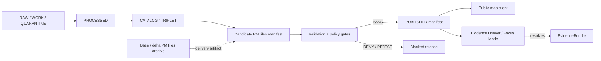

<!-- [KFM_META_BLOCK_V2]
doc_id: kfm://doc/NEEDS-VERIFICATION
title: PMTiles Governance
type: standard
version: v1
status: draft
owners: OWNER_TBD
created: 2026-05-03
updated: 2026-05-03
policy_label: "NEEDS VERIFICATION: confirm documentation access label"
related: [kfm://doc/NEEDS-VERIFICATION, docs/adr/NEEDS-VERIFICATION]
tags: [kfm, pmtiles, manifests, map-publication, governance, validation, promotion]
notes: [PROPOSED path; UNKNOWN repo implementation depth; derived from current PMTiles governance note]
[/KFM_META_BLOCK_V2] -->

# PMTiles Governance

PMTiles manifests are governed publication objects for base and delta tile artifacts; rendered tiles are delivery surfaces, not KFM truth.

> [!IMPORTANT]
> **Status:** PROPOSED documentation contract  
> **Proposed path:** `docs/standards/pmtiles-governance.md`  
> **Owner:** `OWNER_TBD`  
> **Truth posture:** CONFIRMED doctrine from current PMTiles note / PROPOSED implementation contract / UNKNOWN repo implementation depth

> [!NOTE]
> This document defines the governance posture for PMTiles manifests and public map delivery. It does **not** confirm that the current repository already contains these schemas, validators, workflows, routes, cache rules, proof packs, or signature checks.

## Quick links

- [Operating law](#operating-law)
- [Repo fit](#repo-fit)
- [Scope](#scope)
- [Artifact classes](#artifact-classes)
- [Manifest governance block](#manifest-governance-block)
- [Base and delta binding](#base-and-delta-binding)
- [Completeness, masking, and coverage](#completeness-masking-and-coverage)
- [Cache-Control policy](#cache-control-policy)
- [Promotion and CI gates](#promotion-and-ci-gates)
- [Public client resolution](#public-client-resolution)
- [Validation checklist](#validation-checklist)
- [Rollback](#rollback)
- [Open verification backlog](#open-verification-backlog)

---

## Operating law

KFM PMTiles governance preserves the canonical trust membrane:

```text
RAW -> WORK / QUARANTINE -> PROCESSED -> CATALOG / TRIPLET -> PUBLISHED
```

Promotion is a governed state transition. It is not a file move.

A PMTiles archive may be copied, cached, mirrored, or stored at an object URL. Public release depends on a valid manifest state, evidence closure, policy posture, digest posture, geoprivacy posture, review state, and rollback lineage.



**Rule:** public clients and normal UI surfaces resolve released or published manifests. They do not treat tile archives, local files, renderer state, generated summaries, or unpublished builder output as sovereign truth.

---

## Repo fit

| Item | Status | Notes |
| --- | --- | --- |
| Target document | `docs/standards/pmtiles-governance.md` | PROPOSED until repo path is confirmed. |
| Document type | Standard governance / policy-adjacent architecture doc | Uses `KFM_META_BLOCK_V2`. |
| Adjacent docs | `docs/standards/*`, `docs/architecture/*`, `docs/adr/*` | NEEDS VERIFICATION. Do not invent links until repo inspection. |
| Schema home | `schemas/contracts/v1/pmtiles/*` or repo-native equivalent | CONFLICTED / NEEDS VERIFICATION if repo uses both `contracts/` and `schemas/`. |
| Policy home | `policy/pmtiles/*` or repo-native equivalent | PROPOSED. |
| Validator home | `tools/validators/pmtiles/*` or repo-native equivalent | PROPOSED. |
| Public UI dependency | MapLibre or other governed renderer shell | Renderer remains downstream of released manifests and evidence. |

> [!WARNING]
> Do not create parallel schema authority. If the mounted repo shows both `contracts/` and `schemas/`, settle PMTiles schema placement with an ADR before adding machine-readable manifest schemas.

---

## Scope

### Applies to

This document applies to:

- base PMTiles archives;
- delta PMTiles archives;
- base manifests;
- delta manifests;
- layer manifests that reference PMTiles;
- resolver aliases such as `latest` or `current`;
- public map clients consuming released PMTiles artifacts;
- Evidence Drawer and Focus Mode payloads that explain PMTiles-backed layers.

### Exclusions

This document does not define:

- canonical source-of-truth storage;
- RAW, WORK, or QUARANTINE source handling;
- tile-builder internals;
- emergency or real-time alerting behavior;
- full DSSE/Cosign implementation details;
- final schema-home decision for the repository.

Those items require repo inspection, ADRs, or follow-on validator work.

---

## Artifact classes

| Artifact | Role | Mutability | Public posture |
| --- | --- | --- | --- |
| Base PMTiles archive | Stable tile archive for a release or source snapshot | Immutable after release | Public only through released manifest |
| Delta PMTiles archive | Short-lived overlay bound to one base archive | New deltas may supersede older deltas | Public only through released delta manifest |
| Base manifest | Governance object describing a base archive | Versioned | Long-lived when release-addressed |
| Delta manifest | Governance object describing a delta archive and base binding | Versioned | Short-lived or rapidly refreshable |
| Layer manifest | Public layer contract that references released PMTiles manifests | Versioned | Public only after release gates pass |
| Resolver alias | Mutable pointer such as `latest` or `current` | Mutable | Short TTL; must resolve only to released manifests |

---

## Manifest governance block

`KFM_META_BLOCK_V2` for this Markdown file appears at the top of this document.

For PMTiles base and delta manifests, the PMTiles governance block should appear as a top-level manifest object. The preferred manifest field is `kfm_meta`.

### Required posture

A PMTiles manifest is a governance object. It must include:

- `version`;
- `spec_hash`;
- `generated_at`;
- lifecycle state;
- release reference;
- promotion reference;
- validation or proof references;
- policy and geoprivacy references where public release is possible.

Archive-embedded PMTiles metadata may mirror safe display fields, but the manifest remains the governed publication object. If archive metadata and manifest metadata conflict, public clients must trust the released manifest and emit a reviewable conflict signal.

<details>
<summary>Illustrative manifest governance block</summary>

```json
{
  "version": "pmtiles_manifest.v1",
  "manifest_kind": "delta",
  "generated_at": "2026-05-03T00:00:00Z",
  "kfm_meta": {
    "meta_block_version": "KFM_META_BLOCK_V2",
    "spec_hash": "sha256:SPEC_HASH_NEEDS_VERIFICATION",
    "lifecycle_state": "PUBLISHED",
    "release_ref": "kfm://release/NEEDS-VERIFICATION",
    "promotion_ref": "kfm://promotion/NEEDS-VERIFICATION",
    "run_receipt_ref": "kfm://receipt/NEEDS-VERIFICATION",
    "evidence_bundle_refs": ["kfm://evidence-bundle/NEEDS-VERIFICATION"],
    "policy_decision_refs": ["kfm://policy-decision/NEEDS-VERIFICATION"]
  }
}
```

</details>

---

## Base and delta binding

A delta manifest must bind to exactly one base archive.

| Field group | Required fields | Gate behavior |
| --- | --- | --- |
| `base_ref` | `href`, `digest`, `minzoom`, `maxzoom`, `bbox` | Missing or mismatched base reference denies release. |
| `delta_ref` | `href`, `digest`, `minzoom`, `maxzoom`, `bbox` | Missing digest or spatial/zoom scope denies release. |
| Release binding | `release_ref`, `promotion_ref` | Missing release or promotion reference denies public state. |
| Evidence binding | `evidence_bundle_refs`, proof refs, validation refs | Missing proof posture denies public state. |

<details>
<summary>Illustrative base / delta reference shape</summary>

```json
{
  "base_ref": {
    "href": "https://tiles.example.invalid/kfm/base/BASE_ID.pmtiles",
    "digest": "sha256:BASE_DIGEST_NEEDS_VERIFICATION",
    "minzoom": 0,
    "maxzoom": 14,
    "bbox": [-102.1, 36.9, -94.5, 40.1]
  },
  "delta_ref": {
    "href": "https://tiles.example.invalid/kfm/delta/DELTA_ID.pmtiles",
    "digest": "sha256:DELTA_DIGEST_NEEDS_VERIFICATION",
    "minzoom": 0,
    "maxzoom": 14,
    "bbox": [-102.1, 36.9, -94.5, 40.1]
  }
}
```

</details>

### Invalid public release conditions

A PMTiles manifest is invalid for public release when any of the following are true:

- base digest is missing;
- base digest does not match the released base manifest;
- delta digest is missing;
- zoom or bounding-box fields are missing;
- manifest references RAW, WORK, or QUARANTINE state;
- manifest lacks release or promotion references;
- manifest lacks geoprivacy receipt when public geometry exposure is possible;
- manifest has unknown proof, digest, or signature posture.

---

## Completeness, masking, and coverage

Delta manifests must include independently recomputable completeness and public-safety coverage fields.

| Field | Meaning | Rule |
| --- | --- | --- |
| `tile_count` | Actual emitted tile count | Producer-supplied, validator-checked. |
| `expected_tile_count` | Expected tile count for declared zoom and bbox | Recomputed by validator. |
| `completeness_pct` | `tile_count / expected_tile_count` | Must be recomputed; required threshold is `>= 0.95`. |
| `masked_pct` | Share withheld, masked, redacted, generalized, or suppressed | Controls PASS / REVIEW / REJECT. |
| `coverage_pct` | Public-safe coverage after masking and transforms | Must be present for released deltas. |

Percent fields are represented as ratios from `0.0` to `1.0`.

```json
{
  "tile_count": 9500,
  "expected_tile_count": 10000,
  "completeness_pct": 0.95,
  "masked_pct": 0.12,
  "coverage_pct": 0.88
}
```

> [!IMPORTANT]
> Validators must recompute completeness. Producer-supplied `completeness_pct` is not sufficient evidence for promotion.

---

## Cache-Control policy

PMTiles delivery uses different cache posture for immutable base artifacts, fast-moving deltas, and mutable resolver aliases.

| Surface | Cache posture | Example header | Notes |
| --- | --- | --- | --- |
| Release-addressed base archive | Long-lived | `Cache-Control: public, max-age=31536000, immutable` | Only for immutable, digest-addressed artifacts. |
| Release-addressed base manifest | Long-lived | `Cache-Control: public, max-age=31536000, immutable` | Safe when manifest is immutable and release-addressed. |
| Released delta archive | Shorter-lived | `Cache-Control: public, max-age=300` | Supports rapid overlay updates. |
| Released delta manifest | Shorter-lived | `Cache-Control: public, max-age=300` | Refreshable without weakening release state. |
| Resolver alias | Very short-lived | `Cache-Control: public, max-age=60` | Alias must resolve only to released manifests. |

> [!CAUTION]
> Do not apply immutable cache headers to mutable resolver aliases. A stale alias can preserve an invalid or superseded public route after correction.

---

## Rights, license, and geoprivacy

Released public PMTiles manifests require rights and geoprivacy posture.

| Field group | Required fields | Fail-closed behavior |
| --- | --- | --- |
| `rights` | `license`, `attribution`, `public_release_allowed`, `rights_review_ref` | `NOASSERTION` blocks public release unless explicitly reviewed. |
| `geoprivacy` | `envelope_ref`, `receipt_ref`, `transform`, `public_precision` | Missing receipt denies public release. |
| `sensitivity` | policy label, masking reason, steward review where applicable | Sensitive exact-location exposure denies release unless explicitly permitted. |

<details>
<summary>Illustrative rights and geoprivacy shape</summary>

```json
{
  "rights": {
    "license": "NOASSERTION",
    "attribution": [],
    "public_release_allowed": false,
    "rights_review_ref": "kfm://rights-review/NEEDS-VERIFICATION"
  },
  "geoprivacy": {
    "envelope_ref": "kfm://geoprivacy-envelope/NEEDS-VERIFICATION",
    "receipt_ref": "kfm://geoprivacy-receipt/NEEDS-VERIFICATION",
    "transform": "generalized",
    "public_precision": "regional"
  }
}
```

</details>

---

## Proof and signature posture

Released public manifests require digest, proof, and signature posture.

| Field group | Required fields | Release rule |
| --- | --- | --- |
| `integrity` | `manifest_digest`, `base_digest`, `delta_digest` | Missing digest denies public release. |
| `proofs` | `proof_pack_ref`, `validation_report_ref` | Missing proof posture denies public release. |
| `signatures` | `signature_ref`, `signature_type`, `verified` | Unknown or unverified signature posture denies public release unless a release-class exception exists. |

```json
{
  "integrity": {
    "manifest_digest": "sha256:MANIFEST_DIGEST_NEEDS_VERIFICATION",
    "base_digest": "sha256:BASE_DIGEST_NEEDS_VERIFICATION",
    "delta_digest": "sha256:DELTA_DIGEST_NEEDS_VERIFICATION"
  },
  "proofs": {
    "proof_pack_ref": "kfm://proof-pack/NEEDS-VERIFICATION",
    "validation_report_ref": "kfm://validation-report/NEEDS-VERIFICATION"
  },
  "signatures": {
    "signature_ref": "kfm://signature/NEEDS-VERIFICATION",
    "signature_type": "DSSE",
    "verified": true
  }
}
```

Follow-on validator work should verify DSSE/Cosign signatures rather than treating signature references as sufficient.

---

## Promotion and CI gates

CI and promotion checks fail closed.

### Completeness gate

| Condition | Outcome |
| --- | --- |
| `completeness_pct >= 0.95` | PASS |
| `completeness_pct < 0.95` | DENY |

### Masking gate

| Condition | Outcome | Required action |
| --- | --- | --- |
| `masked_pct <= 0.15` | PASS | Continue if all other gates pass. |
| `masked_pct > 0.15 && masked_pct <= 0.30` | REVIEW | Require attestation before release. |
| `masked_pct > 0.30` | REJECT | Block release. |

### Public release gate

Public or released PMTiles manifests require:

- [ ] base and delta refs with `href`, `digest`, `minzoom`, `maxzoom`, and `bbox`;
- [ ] recomputed completeness above threshold;
- [ ] acceptable masking outcome;
- [ ] proof pack reference;
- [ ] validation report reference;
- [ ] signature reference and verified posture, or approved release-class exception;
- [ ] rights posture;
- [ ] geoprivacy envelope;
- [ ] geoprivacy receipt;
- [ ] release reference;
- [ ] promotion reference;
- [ ] no RAW, WORK, or QUARANTINE references.

### Lifecycle denial gate

Policy denies public release if a manifest references or depends on:

```text
RAW
WORK
QUARANTINE
unreviewed candidate data
unreleased generated tiles
unresolved rights
missing geoprivacy receipt
missing digest
missing proof posture
unknown signature posture
```

---

## Public client resolution

Public clients must resolve PMTiles through governed manifests.

### Allowed public path

```text
released layer manifest
  -> released PMTiles manifest
  -> immutable base and/or released delta archive URL
```

### Denied normal public paths

```text
client -> raw PMTiles file
client -> internal object store
client -> RAW / WORK / QUARANTINE candidate
client -> unpublished builder output
client -> local filesystem path
client -> direct canonical/internal store
```

Map renderers may display PMTiles, but they do not determine release state, evidence state, policy state, or truth state.

---

## Evidence Drawer and Focus Mode

Any PMTiles-backed layer that supports a public claim must expose enough manifest metadata for trust-visible UI surfaces.

| Surface | Must show or resolve |
| --- | --- |
| Evidence Drawer | source role, release state, promotion state, EvidenceBundle reference, policy decision, rights posture, geoprivacy posture |
| Layer detail panel | completeness, masking, coverage, cache posture, digest posture |
| Focus Mode | bounded answer over admissible released evidence, or ABSTAIN / DENY / ERROR |
| Review console | validation report, proof pack, signature posture, rollback lineage |

Focus Mode may summarize released layer evidence. It must not treat rendered tiles as the evidence bundle.

---

## Contract and schema impact

> [!WARNING]
> The following paths are PROPOSED. Confirm actual repo conventions before creating files.

| Proposed object | Proposed path | Notes |
| --- | --- | --- |
| PMTiles manifest schema | `schemas/contracts/v1/pmtiles/pmtiles_manifest.schema.json` | NEEDS VERIFICATION against repo schema-home ADR. |
| Base manifest fixture | `tests/fixtures/pmtiles/base_manifest.pass.json` | PROPOSED. |
| Delta PASS fixture | `tests/fixtures/pmtiles/delta_manifest.pass.json` | PROPOSED. |
| Delta REVIEW fixture | `tests/fixtures/pmtiles/delta_manifest.review.json` | PROPOSED; requires attestation fixture. |
| Delta REJECT fixture | `tests/fixtures/pmtiles/delta_manifest.reject.json` | PROPOSED. |
| Policy rules | `policy/pmtiles/release.rego` | PROPOSED; toolchain NEEDS VERIFICATION. |
| Validator | `tools/validators/pmtiles/validate_manifest.py` | PROPOSED; language and test runner NEEDS VERIFICATION. |
| ADR | `docs/adr/ADR-pmtiles-schema-home.md` | PROPOSED if schema authority is unresolved. |

---

## Validator outcomes

| Outcome | Meaning |
| --- | --- |
| `PASS` | Manifest satisfies schema, digest, proof, rights, geoprivacy, lifecycle, and threshold gates. |
| `REVIEW` | Manifest may proceed only with explicit attestation and review decision. |
| `DENY` | Manifest cannot be released because required posture is missing or unsafe. |
| `REJECT` | Manifest exceeds hard threshold or violates non-negotiable policy. |
| `ERROR` | Validator could not evaluate; release must fail closed. |

Validator errors are not release approvals.

---

## Validation checklist

Before merging this document into the repo:

- [ ] Confirm target path or adjust to repo convention.
- [ ] Confirm owner and document policy label.
- [ ] Confirm schema home and avoid parallel contract authority.
- [ ] Confirm PMTiles manifest object names and enum names.
- [ ] Confirm validator language, package manager, and test runner.
- [ ] Confirm cache header implementation location.
- [ ] Confirm release and promotion object family names.
- [ ] Confirm EvidenceBundle and proof-pack reference format.
- [ ] Confirm geoprivacy receipt format.
- [ ] Confirm DSSE/Cosign verification plan.
- [ ] Confirm public client resolver cannot serve RAW, WORK, QUARANTINE, or unpublished manifests.
- [ ] Add PASS / REVIEW / REJECT / DENY fixtures.
- [ ] Add rollback drill for resolver alias withdrawal.

---

## Rollback

Rollback is a governed state transition.

Rollback is required when a released PMTiles manifest:

- points to an invalid archive digest;
- exposes sensitive or unreviewed geometry;
- has incorrect rights posture;
- lacks required proof, signature, or geoprivacy posture;
- was promoted from the wrong lifecycle state;
- resolves through a mutable alias to the wrong release.

### Rollback procedure

1. Mark the affected manifest or resolver alias as withdrawn, superseded, or revoked.
2. Emit `CorrectionNotice` or repo-native equivalent.
3. Preserve immutable released artifacts for audit unless policy requires restricted access.
4. Repoint public resolver alias only after a new valid release decision.
5. Record rollback target, reason, actor, timestamp, validation report, and affected public surfaces.
6. Invalidate or shorten cache for mutable resolver aliases.
7. Publish new corrected base or delta artifacts rather than mutating released objects.

Rollback target: `ROLLBACK_TARGET_NEEDS_VERIFICATION`

---

## Open verification backlog

| Item | Status | Required check |
| --- | --- | --- |
| Target file path | NEEDS VERIFICATION | Confirm repo convention for standards docs. |
| Schema home | CONFLICTED / NEEDS VERIFICATION | Confirm whether `schemas/`, `contracts/`, or another registry is canonical. |
| PMTiles builder output | UNKNOWN | Confirm emitted archive metadata and manifest generation flow. |
| Cache implementation | UNKNOWN | Confirm where headers are set: object store, CDN, reverse proxy, API, or static host. |
| Release object family | UNKNOWN | Confirm field names for release and promotion references. |
| EvidenceBundle cross-check | TODO | Add register-linked release evidence bundle validation once release object family is extended. |
| DSSE/Cosign verification | TODO | Wire signature verification in validator rather than accepting references only. |
| Public resolver behavior | UNKNOWN | Confirm public clients resolve released/published manifests only. |
| Geoprivacy receipts | UNKNOWN | Confirm receipt schema, transform vocabulary, and public precision vocabulary. |
| Rights posture | UNKNOWN | Confirm license and attribution policy for each released layer. |

---

## Acceptance criteria

This PMTiles governance standard is ready for review when:

- [ ] the document path and owner are confirmed;
- [ ] schema-home ambiguity is resolved or explicitly ADR-tracked;
- [ ] required manifest fields are represented in machine-readable schema;
- [ ] validators recompute completeness;
- [ ] masking thresholds produce PASS / REVIEW / REJECT outcomes;
- [ ] public release denies missing digest, proof, signature, rights, or geoprivacy posture;
- [ ] public resolver tests deny RAW, WORK, QUARANTINE, and unpublished artifacts;
- [ ] cache rules distinguish immutable release-addressed artifacts from mutable aliases;
- [ ] rollback path is tested with at least one withdrawn resolver alias fixture.
