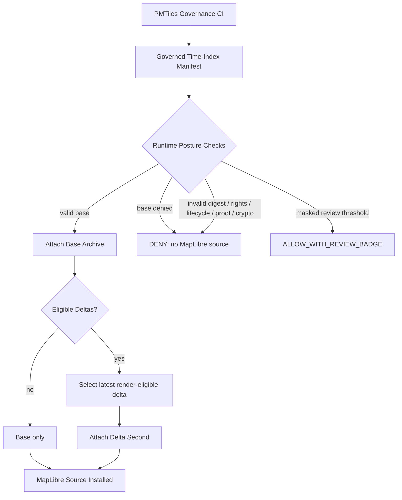

# PMTiles Runtime Client Loader


> [!IMPORTANT]
> This loader is a downstream runtime adapter. It does **not** establish canonical truth, publication authority, evidence sufficiency, policy authority, rights posture, or cryptographic proof.

> [!CAUTION]
> Badges in this document are documentation affordances only. Real enforcement must come from manifest validation, governed CI, runtime decisions, backend policy, proof objects, review state, and release gates.

---

## KFM Meta Block v2.2

```yaml
object_family: pmtiles_runtime_client.v1
status: draft
updated_at: 2026-05-02
change_type: markdown-polish-and-runtime-hardening
lifecycle_placement: apps/web runtime adapter
truth_posture:
  doctrine: CONFIRMED
  runtime_contract: PROPOSED
  repo_implementation: UNKNOWN
  crypto_verification: NEEDS_VERIFICATION
```

---

## Contents

- [Purpose](#purpose)
- [At-a-Glance](#at-a-glance)
- [Lifecycle Placement](#lifecycle-placement)
- [Runtime Flow](#runtime-flow)
- [Base + Delta Layering](#base--delta-layering)
- [Fail-Closed Rules](#fail-closed-rules)
- [Runtime Decisions](#runtime-decisions)
- [Evidence Drawer Contract](#evidence-drawer-contract)
- [Mobile Defaults](#mobile-defaults)
- [Acceptance Tests](#acceptance-tests)
- [Known Limitations](#known-limitations)
- [NEEDS_VERIFICATION](#needs_verification)

---

## Purpose

Runtime PMTiles client loader that consumes governed PMTiles time-index manifests and fails closed for public rendering.

The loader runs after PMTiles governance CI has validated or produced manifests and before MapLibre adds sources. It may install released, public-safe PMTiles sources. It must deny anything that lacks required integrity, evidence, rights, lifecycle, release, or verification posture.

---

## At-a-Glance

| Surface | Posture | Notes |
|---|---:|---|
| Runtime path | `PROPOSED` | `apps/web`, pending repo verification |
| Public rendering | fail-closed | deny unless all required checks pass |
| Base archive | required | base denial blocks the full layer |
| Delta archive | optional | latest render-eligible delta only |
| RAW / WORK / QUARANTINE refs | deny | public path must not expose internal lifecycle states |
| Unknown rights/license | deny | no public rendering without known release posture |
| Crypto verification | not implemented | public rendering denies when `verification_status: not_implemented` |
| Evidence Drawer | required | surfaces runtime decision and traceability fields |
| Duplicate source IDs | guarded | exact duplicates skipped; collisions denied |

---

## Lifecycle Placement

```text
RAW -> WORK / QUARANTINE -> PROCESSED -> CATALOG / TRIPLET -> PUBLISHED
                                                              |
                                                              v
                                          governed PMTiles manifest
                                                              |
                                                              v
                                             apps/web runtime loader
                                                              |
                                                              v
                                                MapLibre source install
```

> [!NOTE]
> Public clients and ordinary UI surfaces should consume governed APIs, released artifacts, catalog records, tile services, and EvidenceBundle-resolved trust payloads. They should not use canonical/internal stores as the normal public path.

---

## Runtime Flow



---

## Base + Delta Layering

| Step | Rule |
|---:|---|
| 1 | Evaluate the base archive first. |
| 2 | Deny the whole layer if the base archive is denied. |
| 3 | Evaluate deltas independently. |
| 4 | Attach only render-eligible deltas. |
| 5 | Add the latest render-eligible delta second. |
| 6 | Denied deltas are never attached to MapLibre. |

Latest delta selection is deterministic:

```text
generated_at DESC
delta_id ASC
digest ASC
```

Deltas with unknown or missing `generated_at` are denied for public runtime attachment.

---

## Fail-Closed Rules

| Check | Public runtime result |
|---|---:|
| Missing digest | `DENY` |
| Invalid digest format | `DENY` |
| Unsupported manifest schema version | `DENY` |
| Missing proof ref | `DENY` |
| Missing signature ref | `DENY` |
| `verification_status: not_implemented` | `DENY` |
| `verification_status: unknown` | `DENY` |
| `verification_status: failed` | `DENY` |
| `completeness_pct < 0.95` | `DENY` |
| `masked_pct > 0.30` | `DENY` |
| `0.15 < masked_pct <= 0.30` without attestation | `DENY` |
| `0.15 < masked_pct <= 0.30` with steward/reviewer attestation | `ALLOW_WITH_REVIEW_BADGE` |
| Public ref to RAW / WORK / QUARANTINE | `DENY` |
| Unknown rights | `DENY` |
| Unknown license | `DENY` |
| Unknown release stage | `DENY` |

Accepted digest format:

```text
sha256:<64 lowercase hex characters>
```

---

## Runtime Decisions

Allowed runtime decisions:

| Decision | Meaning |
|---|---|
| `ALLOW` | Source may be attached to MapLibre. |
| `ALLOW_WITH_REVIEW_BADGE` | Source may render, but UI must show review badge. |
| `DENY` | Source must not be attached. |
| `ERROR` | Runtime failed unexpectedly; default user-facing result is no source attached. |

Allowed reason code families:

```text
DIGEST_INVALID
MANIFEST_SCHEMA_UNSUPPORTED
PROOF_REF_MISSING
SIGNATURE_REF_MISSING
VERIFICATION_NOT_IMPLEMENTED
VERIFICATION_FAILED
COMPLETENESS_BELOW_THRESHOLD
MASKING_ABOVE_THRESHOLD
MASKING_ATTESTATION_REQUIRED
RAW_WORK_QUARANTINE_REF
RIGHTS_UNKNOWN
LICENSE_UNKNOWN
RELEASE_STAGE_NOT_PUBLIC
SOURCE_ID_COLLISION
DELTA_NOT_RENDER_ELIGIBLE
BASE_ARCHIVE_DENIED
MANIFEST_URL_UNVERIFIED
```

Example denial payload:

```json
{
  "runtime_decision": "DENY",
  "decision_id": "pmtiles-runtime-decision-2026-05-02T00:00:00Z-example",
  "reason_codes": ["VERIFICATION_NOT_IMPLEMENTED"],
  "attached_to_maplibre": false
}
```

---

## Evidence Drawer Contract

<details>
<summary><strong>Required Evidence Drawer fields</strong></summary>

- `manifest_id`
- `manifest_schema_version`
- `runtime_policy_version`
- `archive_id`
- `source_id`
- `href`
- `digest`
- `spec_hash`
- `generated_at`
- `base_or_delta`
- `release_stage`
- `promotion_ref`
- `release_manifest_ref`
- `proof_ref`
- `signature_ref`
- `verification_status`
- `completeness_pct`
- `masked_pct`
- `coverage_pct`
- `rights_class`
- `license_id`
- `attribution`
- `source_lifecycle_stage`
- `artifact_lifecycle_stage`
- `geoprivacy_receipt_ref`
- `redaction_receipt_ref`
- `runtime_decision`
- `decision_id`
- `reason_codes`
- `review_badge_required`
- `review_badge_reason`
- `installed_source_ids`
- `collision_status`

</details>

---

## Review Badge Behavior

A review badge is required when all of these are true:

```text
0.15 < masked_pct <= 0.30
steward_attestation_ref exists
reviewer_attestation_ref exists
artifact is otherwise render-eligible
release_stage permits public rendering
verification posture permits public rendering
rights/license posture is known
evidence/proof refs are present
```

Review badge payload must include:

| Field | Required |
|---|---:|
| `badge_reason` | yes |
| `steward_attestation_ref` | yes |
| `reviewer_attestation_ref` | yes |
| `attested_at` | yes |
| `masking_policy_version` | yes |
| `redaction_receipt_ref` | yes |

---

## Mobile Defaults

The installer uses deterministic source IDs:

```text
pmtiles-<archive_id>
```

Deduplication rules:

| Condition | Result |
|---|---|
| `source_id`, `archive_id`, `href`, `digest`, and `spec_hash` all match an installed source | skip duplicate install |
| `source_id` matches but `digest` differs | `DENY`, `SOURCE_ID_COLLISION` |
| `source_id` matches but `spec_hash` differs | `DENY`, `SOURCE_ID_COLLISION` |
| source is denied | never attach to MapLibre |
| source is collided | never attach to MapLibre |

> [!WARNING]
> Do not silently replace an installed PMTiles source in public runtime.

---

## Acceptance Tests

| Test | Expected result |
|---|---|
| Missing digest | `DENY`, `DIGEST_INVALID` |
| Digest not `sha256:<64 lowercase hex>` | `DENY`, `DIGEST_INVALID` |
| Public artifact missing proof ref | `DENY`, `PROOF_REF_MISSING` |
| Public artifact missing signature ref | `DENY`, `SIGNATURE_REF_MISSING` |
| Public artifact with `verification_status: not_implemented` | `DENY`, `VERIFICATION_NOT_IMPLEMENTED` |
| `completeness_pct = 0.949` | `DENY`, `COMPLETENESS_BELOW_THRESHOLD` |
| `masked_pct = 0.31` | `DENY`, `MASKING_ABOVE_THRESHOLD` |
| `masked_pct = 0.20` without attestation | `DENY`, `MASKING_ATTESTATION_REQUIRED` |
| `masked_pct = 0.20` with attestation | `ALLOW_WITH_REVIEW_BADGE` |
| Any public href/ref to RAW, WORK, or QUARANTINE | `DENY`, `RAW_WORK_QUARANTINE_REF` |
| Unknown rights | `DENY`, `RIGHTS_UNKNOWN` |
| Unknown license | `DENY`, `LICENSE_UNKNOWN` |
| Same `source_id` and same digest/spec hash | skip duplicate install |
| Same `source_id` but different digest/spec hash | `DENY`, `SOURCE_ID_COLLISION` |
| Base denied but delta valid | no source attached; base denial controls |
| Multiple eligible deltas | attach deterministic latest by timestamp and tie-breakers |

---

## Maintainer Checklist

- [ ] Confirm actual repo path for runtime loader.
- [ ] Confirm production manifest URL wiring.
- [ ] Confirm PMTiles hosting supports required HTTP Range behavior.
- [ ] Confirm CORS posture for public and trusted-third-party access.
- [ ] Confirm cache invalidation strategy.
- [ ] Add no-network fixture manifests.
- [ ] Add digest-format tests.
- [ ] Add duplicate/collision tests.
- [ ] Add review-badge tests.
- [ ] Add RAW / WORK / QUARANTINE denial tests.
- [ ] Add Evidence Drawer payload snapshot tests.
- [ ] Replace `verification_status: not_implemented` posture with real cryptographic verification before public rendering.

---

## Known Limitations

> [!IMPORTANT]
> Real Cosign/DSSE verification is not implemented here.

Current runtime posture relies on:

- `proof_ref_present`
- digest format checks
- manifest fields
- declared `verification_status`

This is not sufficient for public cryptographic assurance. Public rendering must deny `verification_status: not_implemented`.

---

## NEEDS_VERIFICATION

| Item | Status |
|---|---:|
| Real Cosign/DSSE verification | `NEEDS_VERIFICATION` |
| Production manifest URL wiring | `NEEDS_VERIFICATION` |
| PMTiles Range hosting behavior | `NEEDS_VERIFICATION` |
| CORS/cache invalidation posture | `NEEDS_VERIFICATION` |
| Evidence Drawer schema compatibility | `NEEDS_VERIFICATION` |
| `apps/web` adapter path | `NEEDS_VERIFICATION` |
| CI proof/signature refs | `NEEDS_VERIFICATION` |
| Redaction receipt emission | `NEEDS_VERIFICATION` |
| Release manifest emission | `NEEDS_VERIFICATION` |

---

## Anti-Patterns

| Anti-pattern | Why it is denied |
|---|---|
| Attach PMTiles before posture checks | bypasses runtime fail-closed rule |
| Treat tile archive as canonical truth | collapses derivative surface into truth source |
| Treat badge as proof | badges are documentation/UI affordances, not signatures |
| Silently replace same source ID with different digest | creates unreviewed public artifact drift |
| Render unknown rights/license data | violates public release posture |
| Allow `not_implemented` crypto status for public release | falsely implies verification happened |

---

## Status Summary

| Label | Current posture |
|---|---|
| `CONFIRMED` | KFM doctrine fit and runtime fail-closed intent |
| `PROPOSED` | PMTiles runtime contract, decision enum, field list, test matrix |
| `UNKNOWN` | exact repo path, current implementation depth, production URL wiring |
| `NEEDS_VERIFICATION` | real cryptographic verification, hosting, CORS, cache, CI proof emission |
