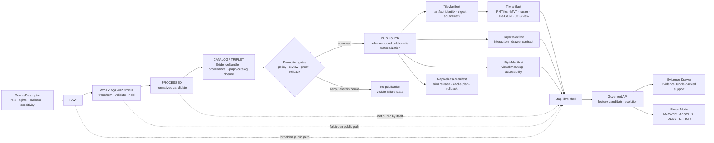
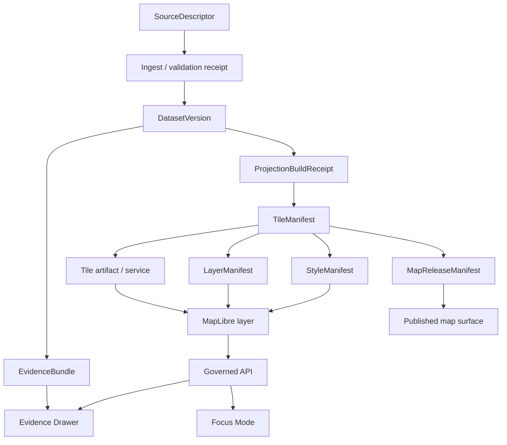
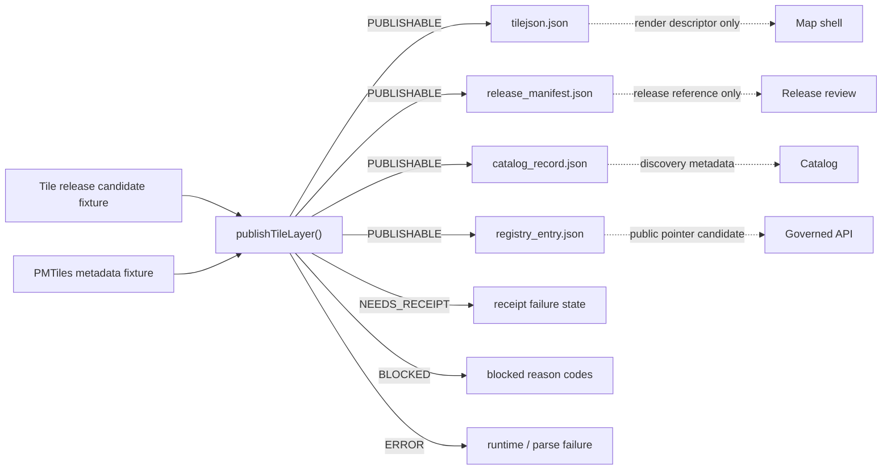

<!-- [KFM_META_BLOCK_V2]
doc_id: kfm://doc/NEEDS-VERIFICATION-tiles-readme
title: KFM Tile Delivery Architecture
type: standard
version: v1
status: draft
owners: OWNER_TBD_NEEDS_VERIFICATION
created: NEEDS VERIFICATION
updated: 2026-05-06
policy_label: POLICY_LABEL_TBD_NEEDS_VERIFICATION
related: [../README.md, ./TILE_MANIFEST_SPEC.md, ./DELTA_UPDATE_MODEL.md, ./GOVERNED_TILE_RELEASE_PUBLISHER.md, ../../adr/ADR-0001-schema-home.md, ../../../apps/web/package.json, ../../../scripts/publish_kfm_tile_layer.mjs]
tags: [kfm, tiles, maplibre, pmtiles, mvt, release, evidence, publication, rollback]
notes: [Target path confirmed through accessible GitHub repository inspection; local mounted checkout unavailable during this revision. Owners, stable doc_id, created date, policy label, CODEOWNERS routing, active branch state, workflow status, production release maturity, signing posture, and emitted proof artifacts require verification.]
[/KFM_META_BLOCK_V2] -->

<a id="top"></a>

# KFM Tile Delivery Architecture

Tile delivery in KFM turns released, public-safe spatial artifacts into map-ready surfaces without letting rendered pixels become truth.

<p>
  
  
  
  
  
  
</p>

> [!IMPORTANT]
> **Status:** `active` architecture surface / `draft` README  
> **Owners:** `OWNER_TBD_NEEDS_VERIFICATION`  
> **Path:** `docs/architecture/tiles/README.md`  
> **Current evidence posture:** `CONFIRMED` target path and selected adjacent tile docs through accessible GitHub repository inspection; `UNKNOWN` local checkout state, workflow success, branch protections, production release maturity, dashboards, logs, and emitted proof objects.  
> **Primary rule:** Tiles are rebuildable delivery artifacts. They are not canonical truth, policy authority, review approval, or evidence by themselves.

**Quick jumps:** [Scope](#scope) · [Repo fit](#repo-fit) · [Accepted inputs](#accepted-inputs) · [Exclusions](#exclusions) · [Evidence boundary](#evidence-boundary) · [Directory map](#directory-map) · [Lifecycle](#tile-lifecycle) · [Delivery posture](#delivery-posture) · [Object families](#object-family-map) · [Current publisher slice](#current-publisher-slice) · [Validation gates](#validation-gates) · [Quickstart](#quickstart) · [Rollback](#rollback-and-correction) · [Done](#definition-of-done) · [Open verification](#open-verification-backlog)

---

## Scope

`docs/architecture/tiles/` documents the cross-cutting architecture for KFM map-delivery artifacts: PMTiles, MVT, raster tiles, COG-backed raster views, TileJSON descriptors, layer/style bindings, tile manifests, release manifests, cache behavior, and rollback.

This directory explains how tile-backed map surfaces remain downstream of:

- source descriptors;
- processed and cataloged evidence;
- `EvidenceBundle` resolution;
- policy and sensitivity decisions;
- review state;
- promotion decisions;
- release manifests;
- correction notices;
- rollback cards;
- governed APIs and Evidence Drawer payloads.

It does not define canonical domain truth. Canonical truth and claim support live upstream in source, evidence, catalog, policy, review, and release systems.

> [!NOTE]
> A tile may be fast, beautiful, signed, cached, and renderable while still being unsafe to publish if source rights, evidence support, sensitivity, review, correction, release identity, or rollback are unresolved.

[Back to top](#top)

---

## Repo fit

| Relationship | Path | Status | Purpose |
|---|---|---:|---|
| This file | `docs/architecture/tiles/README.md` | `CONFIRMED path` / revised here | Directory README and architecture landing page for governed tile delivery. |
| Architecture landing page | [`../README.md`](../README.md) | `CONFIRMED path` | Places tile delivery under cross-domain architecture, not a domain root. |
| Tile manifest spec | [`./TILE_MANIFEST_SPEC.md`](./TILE_MANIFEST_SPEC.md) | `CONFIRMED path` | Defines governed sidecar contracts for tile artifacts and service snapshots. |
| Delta update model | [`./DELTA_UPDATE_MODEL.md`](./DELTA_UPDATE_MODEL.md) | `CONFIRMED path` | Defines tile deltas as update proposals inside the release process. |
| Governed tile release publisher | [`./GOVERNED_TILE_RELEASE_PUBLISHER.md`](./GOVERNED_TILE_RELEASE_PUBLISHER.md) | `CONFIRMED path` | Documents the fixture-backed no-network publication guardrail slice. |
| Schema-home ADR | [`../../adr/ADR-0001-schema-home.md`](../../adr/ADR-0001-schema-home.md) | `CONFIRMED path` / `draft proposed decision` | Proposes `schemas/contracts/v1/` as the canonical machine-schema home. |
| Web package | [`../../../apps/web/package.json`](../../../apps/web/package.json) | `CONFIRMED path` | Confirms the web package surface, package manager, tile publish script, MapLibre, PMTiles, Vite, and Vitest dependencies. |
| Tile publish CLI | [`../../../scripts/publish_kfm_tile_layer.mjs`](../../../scripts/publish_kfm_tile_layer.mjs) | `CONFIRMED path` | CLI wrapper for fixture-backed tile publication checks. |
| Tile publisher module | [`../../../apps/web/src/map/pmtiles/tileReleasePublisher.js`](../../../apps/web/src/map/pmtiles/tileReleasePublisher.js) | `CONFIRMED path` | Implements finite publication outcomes for a public-safe tile candidate. |

### Directory Rules basis

This file belongs under `docs/architecture/tiles/` because tile delivery is a cross-cutting system architecture surface. It governs how map artifacts are released, verified, rendered, inspected, invalidated, corrected, and rolled back across domains.

It should not become:

- a root-level `tiles/` folder;
- a domain-specific lane;
- a schema authority;
- a policy engine;
- a release-object store;
- a proof-pack store;
- a tile generator;
- a runtime service.

[Back to top](#top)

---

## Accepted inputs

The following belong in this directory when they are described as tile-delivery architecture, not as live source data or canonical truth.

| Input family | What belongs here | Minimum posture |
|---|---|---|
| Tile architecture notes | Cross-cutting rules for PMTiles, MVT, TileJSON, COG-backed tile views, cache policy, invalidation, verification, and renderer boundaries. | Must keep tiles downstream of evidence and release. |
| Tile manifest contracts | Sidecar semantics for artifact identity, digests, source refs, release refs, policy refs, catalog closure, and rollback. | Must not replace `EvidenceBundle`, `ReleaseManifest`, or `PolicyDecision`. |
| Delta-update architecture | Rules for incremental updates, cache churn, release ownership, correction, withdrawal, and rollback. | Must preserve complete release identity. |
| Layer and style bindings | How `LayerManifest`, `StyleManifest`, TileJSON, MapLibre sources/layers, and UI trust cues relate. | Must avoid style or popup text as evidence authority. |
| Release-publisher documentation | Design and usage notes for no-network, fixture-backed publication guardrails. | Must clearly separate dry-run/reference generation from production release. |
| Validation gates | Manifest, digest, source, evidence, policy, UI, accessibility, and rollback gates. | Must fail closed on unresolved evidence, rights, sensitivity, integrity, or release state. |
| Negative-state examples | Missing evidence, stale source, denied policy, invalid digest, unsafe path, exact sensitive geometry, withdrawn release, missing rollback. | Must be visible and testable. |
| Quickstart inspection commands | Safe commands for maintainers to inspect the tile surface in a verified checkout. | Must not claim tests passed unless actually run. |

---

## Exclusions

| Excluded item | Why it is excluded | Correct home or path type |
|---|---|---|
| RAW, WORK, QUARANTINE, or unpublished candidate data | Tiles must not bypass the governed lifecycle. | `data/raw/`, `data/work/`, `data/quarantine/`, or repo-native lifecycle homes with access controls. |
| Canonical domain records | Tiles are derived delivery artifacts, not record-of-record truth. | Domain stores, `EvidenceBundle` producers, source registries, and catalog/triplet systems. |
| Live source credentials or secrets | Public docs must not expose tokens, service accounts, private endpoints, or `.env` values. | Secret manager or ignored local deployment config. |
| Tiler implementation code | Architecture explains seams; tools implement them. | `tools/`, `scripts/`, `pipelines/`, `packages/`, or `apps/` after repo verification. |
| Machine schemas | Architecture can describe shape, but schema authority belongs elsewhere. | `schemas/contracts/v1/` after ADR acceptance or repo-native schema home. |
| Policy-as-code | Architecture can describe policy gates; policy decides admissibility. | `policy/` or repo-native policy home. |
| Release instances and proof packs | Live release objects are emitted artifacts, not architecture prose. | `release/`, `data/proofs/`, `data/receipts/`, `data/published/`, or repo-native equivalents. |
| Direct browser access to canonical stores | Violates KFM’s public-client boundary. | Governed APIs and released artifacts only. |
| Direct model-runtime calls | AI is evidence-subordinate and must stay behind governed runtime envelopes. | Governed AI adapter and Focus Mode surfaces. |
| Exact restricted geometry | Sensitive locations fail closed unless a reviewed restricted-access path permits them. | Restricted/steward delivery with policy, transform receipts, and withheld accounting. |
| Emergency or life-safety instructions | KFM may show contextual evidence; it is not an official alerting system. | Official emergency and alerting systems. |

[Back to top](#top)

---

## Evidence boundary

This README separates current repository evidence from doctrine, implementation guidance, and unresolved operational claims.

| Evidence area | Status | What it supports | What remains unresolved |
|---|---:|---|---|
| Target directory README | `CONFIRMED path` | `docs/architecture/tiles/README.md` exists in accessible GitHub repository evidence. | Local branch state, inbound anchor compatibility, and maintainer ownership. |
| Sibling tile docs | `CONFIRMED paths` | `TILE_MANIFEST_SPEC.md`, `DELTA_UPDATE_MODEL.md`, and `GOVERNED_TILE_RELEASE_PUBLISHER.md` exist and should be linked. | Whether all sibling docs are accepted, fully consistent, or production-enforced. |
| Web package | `CONFIRMED file` | `apps/web/package.json` exposes `npm@10`, MapLibre GL, PMTiles, Vite, Vitest, and `kfm:publish-tile-layer`. | Install state, successful tests, CI status, deployment maturity, and branch protection. |
| Tile publisher script/module | `CONFIRMED files` | A fixture-backed publisher slice exists with finite outcomes and generated release-facing objects. | Production signing, proof-pack closure, rollback-card generation, and API/UI VERIFY-before-render. |
| Directory Rules | `CONFIRMED doctrine` | `docs/architecture/tiles/` is appropriate because it is cross-cutting architecture under `docs/`; domain names should not become root folders. | Active repository owner routing and policy labels. |
| KFM lifecycle doctrine | `CONFIRMED doctrine` | Tiles remain downstream of `RAW -> WORK / QUARANTINE -> PROCESSED -> CATALOG / TRIPLET -> PUBLISHED`. | Exact active enforcement in CI or runtime. |
| MapLibre operating doctrine | `CONFIRMED doctrine` | MapLibre is a disciplined downstream renderer, not the truth store or policy authority. | Runtime wiring, adapter implementation, and deployment behavior. |
| Local mounted checkout | `CONFIRMED unavailable in this session` | No local tests or branch-state claims are made here. | All local execution and workflow checks. |

> [!WARNING]
> Current GitHub repository evidence confirms paths and selected file contents. It does not prove successful CI, protected-branch enforcement, production publication, runtime logs, dashboard state, or released public artifacts.

[Back to top](#top)

---

## Directory map

### Confirmed tile architecture directory

```text
docs/
└── architecture/
    └── tiles/
        ├── README.md
        ├── TILE_MANIFEST_SPEC.md
        ├── DELTA_UPDATE_MODEL.md
        └── GOVERNED_TILE_RELEASE_PUBLISHER.md
```

### Related implementation and validation surfaces to verify

```text
apps/
└── web/
    ├── package.json
    └── src/
        └── map/
            └── pmtiles/
                └── tileReleasePublisher.js

scripts/
└── publish_kfm_tile_layer.mjs

tests/
└── fixtures/
    └── tile_release/
        └── valid/
            ├── veg.layer.json
            └── veg.pmtiles-metadata.json

schemas/
└── contracts/
    └── v1/
        └── tiles/              # PROPOSED / depends on ADR acceptance

policy/
└── tiles/                      # PROPOSED or repo-native policy home

release/
data/
├── published/
├── proofs/
└── receipts/
```

> [!IMPORTANT]
> Do not create a second schema, fixture, release, policy, proof, or receipt authority if the active checkout proves an existing canonical convention. Resolve placement conflicts through ADRs or migration notes.

[Back to top](#top)

---

## Tile lifecycle

KFM tile delivery is a derived-artifact branch inside the governed publication lifecycle.



### Operating law

| Rule | Meaning for tiles |
|---|---|
| Public-client rule | Public and ordinary UI clients consume released tile artifacts, governed APIs, catalog records, and Evidence Drawer payloads only. |
| Derived-artifact rule | PMTiles, MVT, raster tiles, TileJSON, screenshots, popups, and style JSON are carriers, not canonical evidence. |
| Cite-or-abstain rule | A tile-backed claim must resolve to admissible evidence or show a visible abstention state. |
| Promotion rule | Publication is a governed transition with review, policy, proof, correction, release identity, and rollback. |
| Fail-closed rule | Missing evidence, unresolved rights, unknown sensitivity, invalid digest, missing rollback, or unsafe path blocks public release. |
| Thin-browser rule | Browser logic may display trust state and request governed resolution; it must not decide truth from tile attributes alone. |

[Back to top](#top)

---

## Delivery posture

Choose delivery form by evidence burden, audience, scale, cache behavior, sensitivity, and rollback need.

| Delivery form | Best use | Default KFM posture | Guardrails |
|---|---|---|---|
| `GeoJSON` | Tiny fixtures, review overlays, local demos, low-volume selection layers. | `selective` | Avoid large public cartography; stable feature IDs and evidence refs required for consequential use. |
| `MVT` | Dense public-safe vector layers and normal production vector cartography. | `production candidate` | Manifest-bound source refs, release identity, and feature-evidence resolution. |
| `MLT` | Benchmark or future pilot path. | `pilot / NEEDS VERIFICATION` | Do not make production default until repo tooling, browser support, parity, and validator evidence are proven. |
| `PMTiles` | Immutable public-safe snapshots, offline bundles, static hosting, CDN/object-store-like delivery. | `recommended for stable release bundles` | Hash, source refs, release ID, attribution, stale posture, cache behavior, and rollback target required. |
| `MBTiles` | Server-local packaging intermediate or local/offline review artifact. | `situational` | Do not expose restricted archives through public browser paths. |
| Server-mediated MVT / Martin-like serving | Dynamic, steward-mediated, access-controlled, or freshness-sensitive serving. | `situational` | Use when backend policy mediation or PostGIS-backed slicing matters. |
| `COG`-backed raster view | Large raster/imagery/EO/climate/hydrology products. | `recommended for large raster source or delivery artifacts` | COG/source object remains stronger than display facade; render profile and source version must be manifest-bound. |
| Raster tile bundle | Low-latency display of pixel-dominant public-safe products. | `selective` | Style/colormap changes can change meaning and may require review. |
| External WMS/TileJSON reference | Contextual overlays or transitional provider surfaces. | `contextual` | External provider labels are not KFM evidence claims unless resolved through KFM evidence flow. |

> [!TIP]
> The safest production pattern is hybrid: static released tile artifacts for map speed, plus governed APIs for Evidence Drawer, claim resolution, review, correction, Focus Mode, exports, and rollback.

---

## Object-family map

Tiles become KFM-grade only when their object families stay separate.

| Object family | Owns | Must not own |
|---|---|---|
| `TileManifest` / `TileArtifactManifest` | Delivery artifact identity, media type, digest, source refs, build refs, bounds, zoom/time scope, release refs. | Evidence truth, review approval, policy law, or canonical dataset semantics. |
| `LayerManifest` | Stable layer ID, tile refs, feature identity contract, interaction posture, drawer payload contract, trust badges. | Artifact integrity or source rights by itself. |
| `StyleManifest` | Style JSON, sprites, glyphs, fonts, visual meaning, accessibility notes, meaning-change review needs. | Evidence support, release approval, or sensitivity decisions. |
| `MapReleaseManifest` | Release identity, promoted map artifacts, prior release, cache invalidation, correction state, rollback. | Raw data storage or hidden reviewer-only state. |
| `EvidenceBundle` | Evidence support, source roles, citations, temporal/spatial support, provenance, policy context. | Tile byte identity. |
| `DecisionEnvelope` / `PolicyDecision` | Allow, deny, restrict, abstain, hold, generalize, or release reason codes. | Schema shape or visual style. |
| `RunReceipt` / `ProjectionBuildReceipt` | Process memory for tiling, transformation, validation, and materialization. | Canonical truth or promotion approval. |
| `CatalogMatrix` | Closure across STAC/DCAT/PROV/catalog/checksum surfaces where used. | Public truth by itself. |
| `CorrectionNotice` | Correction, withdrawal, supersession, affected claims/layers/releases. | Silent replacement of old public meaning. |
| `RollbackCard` | Restore path for prior safe release without deleting lineage. | History deletion. |



[Back to top](#top)

---

## Current publisher slice

The accessible repository includes a small, fixture-backed tile publication guardrail. Treat it as a thin release-reference generator, not as production publication maturity.

### Confirmed behavior surface

| Surface | Current repo signal | Caution |
|---|---|---|
| Web package | `apps/web/package.json` declares `npm@10`, `maplibre-gl`, `pmtiles`, `vite`, `vitest`, and `kfm:publish-tile-layer`. | Dependencies and scripts are confirmed as file content; install state and test success were not run here. |
| CLI wrapper | `scripts/publish_kfm_tile_layer.mjs` reads a candidate, optional PMTiles metadata, and output directory. | Writes outputs only when module result is `PUBLISHABLE`; local execution not performed here. |
| Publisher module | `publishTileLayer()` returns finite outcomes: `PUBLISHABLE`, `BLOCKED`, `NEEDS_RECEIPT`, `ERROR`. | Production proof/signing/rollback hardening still needs verification. |
| Generated objects | Successful publication writes TileJSON, release manifest, catalog record, and registry entry. | These are release-facing references, not evidence authority. |
| Guardrails | Checks public policy/sensitivity, review/release state, blocked path markers, receipt presence/identity, spec-hash match, and exact-geometry catalog flag. | Current path marker checks should be hardened before production. |

### Thin-slice flow



> [!IMPORTANT]
> This slice is useful because it turns tile-publication readiness into finite outcomes and generated references. It does not prove production release, signing, policy enforcement, public deployment, branch protection, or dashboard health.

[Back to top](#top)

---

## Validation gates

A tile-delivery change should pass these gates before public or semi-public use.

| Gate | Required checks | Failure posture |
|---|---|---|
| T0 — Repo context | Current checkout, owners, branch, package runner, adjacent docs, schema home, and affected files inspected. | `ABSTAIN` on implementation claims. |
| T1 — Source closure | Source descriptors, source roles, rights, cadence, caveats, and sensitivity support the tile artifact. | `DENY` or `QUARANTINE`. |
| T2 — Schema and fixture closure | Tile/layer/style/release/result payloads validate against accepted schemas or explicitly deferred contracts. | `ERROR` for implementation defect. |
| T3 — Artifact integrity | Digests, media types, bounds, zooms, time scope, build refs, and artifact identity are coherent. | `DENY`. |
| T4 — Evidence closure | Consequential layer or feature claims resolve to `EvidenceBundle` or visible negative state. | `ABSTAIN`. |
| T5 — Policy and sensitivity | Rights, exact geometry, stale state, role restrictions, access class, and review state permit exposure. | `DENY`, generalize, or restrict. |
| T6 — Release closure | Promotion decision, release manifest, previous release, cache invalidation plan, correction path, and rollback target exist. | No publication. |
| T7 — UI trust closure | Evidence Drawer, trust badges, stale/denied/generalized/withdrawn states, and Focus Mode outcomes are visible. | Block public shell exposure. |
| T8 — Public-boundary check | Public clients cannot fetch RAW, WORK, QUARANTINE, canonical-private, restricted, draft, staging, unreleased, or model-runtime paths. | `DENY`. |
| T9 — Accessibility closure | Keyboard access, focus order, contrast, non-color trust cues, screen-readable state, and reduced-motion behavior are checked. | Block public release. |
| T10 — Rollback drill | Prior release can be restored without deleting receipts, proof objects, correction notices, or release lineage. | Block publication. |

### Finite outcomes

| Outcome | Meaning |
|---|---|
| `PUBLISHABLE` | The current release-publisher slice can generate release-facing references for the candidate. |
| `BLOCKED` | The candidate violates policy, path, integrity, release, geometry, fallback, or identity checks. |
| `NEEDS_RECEIPT` | Required receipt burden is declared but not satisfied. |
| `ANSWER` | Focus Mode may answer only after governed evidence resolution and citation validation. |
| `ABSTAIN` | Evidence, freshness, review, release, or support cannot be proven. |
| `DENY` | Policy blocks the requested exposure or detail. |
| `ERROR` | Runtime, validator, environment, or schema failure prevents reliable evaluation. |

[Back to top](#top)

---

## Quickstart

Run these from a real checkout after dependencies and repo state are verified.

### Inspect repository state

```bash
git status --short
git branch --show-current
git rev-parse --show-toplevel
```

### Inspect the tile architecture surface

```bash
find docs/architecture/tiles docs/adr apps/web scripts tests/fixtures/tile_release \
  -maxdepth 4 -type f 2>/dev/null | sort
```

### Inspect tile-related vocabulary

```bash
grep -RInE "TileManifest|TileArtifactManifest|LayerManifest|StyleManifest|MapReleaseManifest|PMTiles|MVT|TileJSON|EvidenceBundle|publishTileLayer|PUBLISHABLE|NEEDS_RECEIPT|BLOCKED" \
  docs/architecture/tiles apps/web scripts tests/fixtures schemas contracts policy 2>/dev/null | head -160
```

### Run the fixture-backed tile publisher dry run

```bash
cd apps/web

npm run kfm:publish-tile-layer -- \
  --candidate ../../tests/fixtures/tile_release/valid/veg.layer.json \
  --pmtiles-metadata ../../tests/fixtures/tile_release/valid/veg.pmtiles-metadata.json \
  --out /tmp/kfm-tile-release-demo
```

Expected successful dry-run outputs:

```text
/tmp/kfm-tile-release-demo/tilejson.json
/tmp/kfm-tile-release-demo/release_manifest.json
/tmp/kfm-tile-release-demo/catalog_record.json
/tmp/kfm-tile-release-demo/registry_entry.json
```

### Run repo-native web checks

```bash
cd apps/web

npm test -- --run tileReleasePublisher
npm run doctor
```

> [!CAUTION]
> Do not report tests, workflow gates, signing, release, or production publication as passing unless they ran on the current checkout and the results are captured.

[Back to top](#top)

---

## Usage rules

### Public map shell

Public map surfaces may load only release-bound, public-safe artifacts and governed API responses.

They must not:

- fetch RAW, WORK, QUARANTINE, canonical-private, restricted, draft, staging, unreleased, proof-pack-internal, steward-only, or direct model-runtime paths;
- treat tile properties as citation authority;
- expose exact restricted geometry;
- hide stale, denied, restricted, generalized, withdrawn, corrected, or digest-mismatch states;
- export map artifacts without release ID, evidence support, policy state, and correction lineage.

### Review / steward shell

Role-gated review surfaces may inspect more detail only through governed APIs and reviewer/steward authorization.

They still must:

- log review state changes;
- preserve separation between candidate, reviewed, promoted, published, withdrawn, corrected, and rolled-back states;
- retain source role, evidence support, and sensitivity posture;
- avoid upgrading tile previews, derived geometry, or model summaries into canonical truth.

### Focus Mode

Focus Mode may explain tile-selected context only after the selected feature, layer, or release resolves through governed evidence.

| State | Focus behavior |
|---|---|
| `ANSWER` | Bounded, cited answer with scope, time, layer, release, and caveats. |
| `ABSTAIN` | Missing, stale, conflicted, incomplete, or unsupported evidence. |
| `DENY` | Policy-safe denial reason without leaking restricted detail. |
| `ERROR` | Runtime or validation failure with preserved map context. |

[Back to top](#top)

---

## Rollback and correction

Rollback is required when a tile change weakens source integrity, breaks stable identity, leaks sensitive geometry, bypasses governed APIs, creates schema-authority conflict, publishes unsupported claims, hides correction state, or prevents safe restoration.

### Rollback sequence

1. Freeze the affected `MapReleaseManifest` or release-facing reference.
2. Restore the previous release pointer or immutable release URL.
3. Invalidate public caches named by the release or cache plan.
4. Preserve the failed manifest, catalog record, registry entry, receipts, proof objects, and evaluation output.
5. Emit or update a `CorrectionNotice` when public interpretation changed.
6. Add or update a regression fixture for the failure.
7. Re-run publisher, manifest, policy, Evidence Drawer, Focus Mode, accessibility, and no-public-raw-path checks.
8. Record the rollback target and reason before reopening publication.

> [!IMPORTANT]
> Rollback restores safe public behavior. It must not delete release history, receipts, proof objects, correction lineage, failed outputs, or review evidence.

[Back to top](#top)

---

## Definition of done

A tile-delivery change is not done until every applicable item is satisfied.

- [ ] Current checkout state, target path, owners, and adjacent docs were inspected.
- [ ] Directory Rules basis is recorded.
- [ ] Schema-home and contract-home ambiguity is resolved by ADR or explicitly deferred.
- [ ] Source descriptors exist for every source family used by the tile artifact.
- [ ] Tile artifacts have manifest identity, digest, media type, bounds, zoom/time scope, source refs, policy posture, and rollback target.
- [ ] Layer and style manifests bind visual delivery without becoming evidence or policy authority.
- [ ] Evidence Drawer payload resolves consequential selections to `EvidenceBundle` or visible negative state.
- [ ] Public clients cannot reach RAW, WORK, QUARANTINE, canonical-private, restricted, draft, staging, unreleased, or direct model-runtime paths.
- [ ] Sensitive geometry policy fails closed, generalizes, withholds, or restricts before browser delivery.
- [ ] Release manifest includes previous release and cache invalidation plan.
- [ ] Rollback restores a prior safe release without erasing correction history.
- [ ] Accessibility checks cover keyboard access, focus order, contrast, non-color cues, screen-readable trust state, and reduced motion.
- [ ] Documentation, fixtures, implementation, policy, schemas, and tests update together when behavior changes.
- [ ] Validation output is captured in PR notes, release receipts, proof objects, or repo-native artifacts.

---

## Open verification backlog

| Item | Status | How to close |
|---|---:|---|
| Stable `doc_id` | `NEEDS VERIFICATION` | Assign through document registry or accepted doc ID process. |
| Owners / CODEOWNERS routing | `NEEDS VERIFICATION` | Confirm owner routing and update meta block. |
| Created date | `NEEDS VERIFICATION` | Confirm through git history or document registry. |
| Policy label | `NEEDS VERIFICATION` | Confirm public/restricted status through policy/document registry. |
| Local checkout state | `UNKNOWN` | Run `git status`, branch, and tree inspection in the active checkout. |
| CI and workflow status | `UNKNOWN` | Inspect `.github/workflows/` and successful run evidence. |
| Branch protections | `UNKNOWN` | Inspect repository settings or governance record. |
| Schema-home acceptance | `draft / NEEDS VERIFICATION` | Confirm ADR-0001 acceptance or keep schema claims proposed. |
| Tile release schemas | `NEEDS VERIFICATION` | Locate or create accepted schemas for tile candidate, generated outputs, manifests, and validation reports. |
| Production proof/signing | `NEEDS VERIFICATION` | Confirm proof-pack, signature, attestation, or release-integrity policy. |
| Rollback-card generation | `NEEDS IMPLEMENTATION / VERIFICATION` | Require rollback target for production release path. |
| Segment-aware path policy | `PROPOSED` | Replace substring-only path checks with repo-approved public-path policy. |
| EvidenceBundle binding | `NEEDS VERIFICATION` | Confirm feature/layer evidence refs and drawer payload contracts. |
| API/UI VERIFY-before-render | `NEEDS VERIFICATION` | Confirm runtime checks before public render. |
| Accessibility checks | `NEEDS VERIFICATION` | Add or verify tests for trust-state visibility and keyboard/screen-reader behavior. |
| Cache invalidation strategy | `NEEDS VERIFICATION` | Confirm immutable URL, pointer, purge, or service-snapshot pattern. |

[Back to top](#top)

---

## FAQ

### Are tiles authoritative?

No. Tiles are delivery artifacts. Consequential claims resolve through governed APIs to `EvidenceBundle`, source roles, policy state, review state, release state, and correction lineage.

### Can a popup show claims?

Only non-authoritative summaries should appear directly in simple popups. Consequential claims should open or resolve through the Evidence Drawer.

### Is PMTiles the default?

PMTiles is recommended for stable, public-safe, immutable release bundles. It still needs manifest identity, digest, source refs, release ID, cache behavior, and rollback.

### Is MVT still valid?

Yes. MVT remains a practical production vector-tile path. MLT should stay a pilot or benchmark path until KFM validates toolchain maturity and parity.

### Can client-side filters enforce sensitivity policy?

No. Policy-sensitive material must be withheld, generalized, restricted, or denied before public browser delivery.

### Does the current publisher prove production readiness?

No. It is a fixture-backed guardrail slice. Production maturity still requires schema acceptance, policy closure, evidence binding, proof/signing posture, release/rollback records, CI evidence, and deployment verification.

---

<details>
<summary>Appendix A — Anti-patterns to reject</summary>

- Treating PMTiles, MVT, raster tiles, TileJSON, or style JSON as canonical truth.
- Letting MapLibre feature properties become citation authority.
- Publishing from RAW, WORK, QUARANTINE, draft, staging, restricted, private, canonical-private, or unreleased paths.
- Accepting public release with unresolved rights, sensitivity, review, evidence, or rollback.
- Hiding stale, denied, withdrawn, generalized, corrected, or digest-mismatch states for visual polish.
- Using browser-only filters to protect sensitive data.
- Creating parallel schema, fixture, policy, proof, or release homes without ADR or migration note.
- Treating fixture-backed publication success as production signing/proof-pack completion.
- Publishing a registry entry without rollback target and correction path.
- Letting Focus Mode answer from tile attributes alone.
- Making style changes that alter meaning without `StyleManifest` review.
- Deleting failed outputs, receipts, or correction history during rollback.

</details>

<details>
<summary>Appendix B — Maintainer review card</summary>

```markdown
## Tile architecture review card

Goal:

Target path:

Owning roots:
- [ ] docs/architecture/tiles
- [ ] apps/web
- [ ] scripts
- [ ] tests/fixtures
- [ ] schemas
- [ ] policy
- [ ] release
- [ ] data/proofs / data/receipts / data/published
- [ ] other:

Directory Rules basis:

Repo evidence checked:
- [ ] current checkout state
- [ ] adjacent docs
- [ ] schemas/contracts
- [ ] policy
- [ ] tests/fixtures
- [ ] scripts/tools
- [ ] apps/web package and implementation
- [ ] workflows
- [ ] release/proof/receipt artifacts

Truth labels:
- CONFIRMED:
- PROPOSED:
- UNKNOWN:
- NEEDS VERIFICATION:

Object families affected:
- [ ] TileManifest / TileArtifactManifest
- [ ] LayerManifest
- [ ] StyleManifest
- [ ] MapReleaseManifest
- [ ] TileJSON
- [ ] Catalog record
- [ ] Registry entry
- [ ] EvidenceBundle / EvidenceDrawerPayload
- [ ] DecisionEnvelope / PolicyDecision
- [ ] RunReceipt / ProjectionBuildReceipt
- [ ] CorrectionNotice / RollbackCard

Public exposure possible?
- [ ] yes
- [ ] no

EvidenceRef / EvidenceBundle impact:

Rights / sensitivity impact:

Release / correction / rollback impact:

Validation commands run:

Results captured where:

Remaining gaps:

Rollback plan:
```

</details>

<details>
<summary>Appendix C — Glossary</summary>

| Term | KFM meaning |
|---|---|
| Tile artifact | Rebuildable delivery artifact such as PMTiles, MVT, raster tiles, TileJSON, MBTiles, or a COG-backed tile view. |
| TileManifest | Sidecar record describing tile artifact identity, digests, source refs, release refs, policy refs, and verification posture. |
| LayerManifest | Binding between released artifacts and map-layer interaction behavior, trust cues, evidence routes, and drawer payloads. |
| StyleManifest | Record of style JSON, sprites, glyphs, visual semantics, accessibility notes, and meaning-changing style decisions. |
| MapReleaseManifest | Map release closure object tying tile/layer/style artifacts to release state, prior release, cache plan, correction, and rollback. |
| EvidenceBundle | Inspectable support object for claims; stronger than rendered pixels or generated language. |
| Evidence Drawer | Mandatory trust surface for evidence, citations, policy, transforms, withheld counts, freshness, correction, and lineage. |
| Focus Mode | Evidence-bounded synthesis surface with finite outcomes: `ANSWER`, `ABSTAIN`, `DENY`, `ERROR`. |
| Public-safe | Passed rights, sensitivity, source-role, geometry, review, release, and rollback checks for the intended audience. |
| Withheld accounting | Public-safe count or explanation of restricted/suppressed detail without revealing sensitive information. |
| Derived artifact | Rebuildable downstream carrier such as tiles, graph projections, search views, summaries, scenes, screenshots, and exports. |

</details>

<p align="right"><a href="#top">Back to top ↑</a></p>
