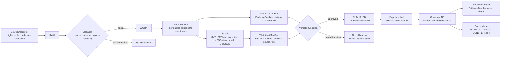

<!-- [KFM_META_BLOCK_V2]
doc_id: kfm://doc/NEEDS-VERIFICATION
title: KFM Tile Delivery Architecture
type: standard
version: v1
status: draft
owners: OWNER_TBD
created: NEEDS VERIFICATION
updated: 2026-05-03
policy_label: NEEDS VERIFICATION
related: [NEEDS-VERIFICATION-adjacent-doc-links]
tags: [kfm, tiles, maplibre, delivery, governance, evidence, publication]
notes: [Directory README and architecture draft. Target path, adjacent links, owners, doc_id, created date, policy label, schema homes, package manager, test runner, and implementation depth require direct repository inspection before publication.]
[/KFM_META_BLOCK_V2] -->

# KFM Tile Delivery Architecture

Purpose: define how Kansas Frontier Matrix tile artifacts are produced, governed, released, rendered, inspected, rolled back, and kept subordinate to evidence.

## Impact block


| Field | Value |
|---|---|
| **Status** | `experimental` |
| **Document lifecycle status** | `draft` |
| **Owners** | `OWNER_TBD` |
| **Proposed target path** | `docs/architecture/tiles/README.md` |
| **Primary audience** | Maintainers building tile delivery, release manifests, governed map APIs, MapLibre UI surfaces, fixtures, validators, and promotion gates. |
| **Repository evidence posture** | `UNKNOWN repo implementation depth` — this draft is doctrine-grounded, but direct repo files, tests, workflows, dashboards, logs, emitted artifacts, and runtime behavior were not inspected in this revision pass. |
| **Primary rule** | Tiles are rebuildable delivery artifacts, not canonical truth. |

**Quick jumps:** [Scope](#scope) · [Repo fit](#repo-fit) · [Accepted inputs](#accepted-inputs) · [Exclusions](#exclusions) · [Tile lifecycle](#tile-lifecycle) · [Delivery posture](#delivery-posture) · [Promotion gates](#promotion-and-validation-gates) · [Quickstart](#quickstart) · [Rollback](#rollback) · [Definition of done](#definition-of-done) · [Verification backlog](#verification-backlog)

> [!IMPORTANT]
> KFM tiles are downstream of source descriptors, EvidenceBundles, policy decisions, review state, promotion, release manifests, and rollback targets. A tile may be fast, beautiful, and globally cached while still being unsafe to publish if rights, sensitivity, evidence support, provenance, release identity, correction lineage, or rollback are unresolved.

> [!NOTE]
> This document states KFM doctrine and proposes tile-delivery architecture. It does **not** prove that the target repository already contains these paths, schemas, policies, tests, commands, API routes, release objects, or runtime behavior.

---

## Evidence boundary and source ledger

| Source | Status | Supports | Limits |
|---|---|---|---|
| Attached Markdown baseline for this file | `CONFIRMED baseline` | Existing title, target-path assumption, KFM Meta Block, impact block, lifecycle diagram, delivery table, promotion gates, quickstart, FAQ, and appendices. | Does not prove target repo path, owners, implementation, tests, or adjacent links. |
| KFM pipeline / lifecycle doctrine | `CONFIRMED doctrine / UNKNOWN implementation` | `RAW -> WORK / QUARANTINE -> PROCESSED -> CATALOG / TRIPLET -> PUBLISHED`; promotion as governed state transition; public clients use governed interfaces. | Does not prove repo paths or commands in this document. |
| KFM MapLibre operating doctrine | `CONFIRMED doctrine / PROPOSED implementation` | MapLibre as disciplined downstream 2D renderer and interaction runtime, not truth authority. | Does not prove MapLibre package pin, app path, or runtime wiring. |
| KFM governed AI doctrine | `CONFIRMED doctrine / PROPOSED implementation` | AI and Focus Mode are evidence-subordinate and must use finite outcomes. | Does not prove any model adapter, endpoint, or UI implementation exists. |
| Prior repo/public implementation references | `LINEAGE / NEEDS VERIFICATION` | Suggests likely repo families such as docs, schemas, contracts, policies, tests, data lifecycle stores, and release objects. | Not direct current checkout evidence for this revision. |

**Current truth posture:** `CONFIRMED doctrine` / `PROPOSED document path and implementation guidance` / `UNKNOWN repo implementation depth`.

[Back to top](#kfm-tile-delivery-architecture)

---

## Companion document candidates

These are intentionally listed as **candidates**, not confirmed adjacent links.

| Candidate | Proposed path | Status | Purpose |
|---|---|---|---|
| PMTiles delta apply engine | `docs/architecture/tiles/delta_apply.md` | `NEEDS VERIFICATION` | Describes controlled tile-delta application if the repo adopts such a pattern. |
| Verified tile release | `docs/architecture/tiles/verified-tile-release.md` | `NEEDS VERIFICATION` | Describes release-manifest-backed tile publication if present or planned. |
| MapLibre operating architecture | `docs/architecture/maplibre/README.md` or repo-native equivalent | `NEEDS VERIFICATION` | Renderer boundary, shell behavior, interaction state, Evidence Drawer, and Focus Mode posture. |
| Pipeline lifecycle architecture | `docs/architecture/pipeline/README.md` or repo-native equivalent | `NEEDS VERIFICATION` | Canonical lifecycle, promotion, receipts, proofs, catalogs, and rollback. |
| Schema-home ADR | `docs/adr/ADR-tiles-schema-home.md` or repo-native equivalent | `PROPOSED` | Resolves whether machine contracts live under `schemas/`, `contracts/`, `jsonschema/`, or another existing convention. |

> [!WARNING]
> Do not add these as clickable links until the mounted repository confirms the paths. Avoid creating parallel authority when a repo-native home already exists.

---

## Scope

This directory documents the **tile delivery architecture** for KFM’s governed, map-first publication system.

It covers:

- vector-tile, raster-tile, PMTiles, MBTiles, COG-backed raster, and small GeoJSON delivery posture;
- tile artifact identity, manifests, checksums, source references, stale state, cache invalidation, and rollback targets;
- how released tile artifacts connect to `LayerManifest`, `StyleManifest`, `TileArtifactManifest`, `MapReleaseManifest`, and `EvidenceDrawerPayload`;
- how MapLibre receives tile artifacts without becoming a truth store;
- what must be validated before a tile artifact can appear on a public or semi-public surface;
- how tile-selected features resolve through governed APIs to EvidenceBundles, policy state, review state, and correction lineage.

It does **not** define canonical domain truth. Canonical evidence belongs upstream.

> [!NOTE]
> This README is intentionally architecture-first. Build scripts, source connectors, live source credentials, tiler commands, package-specific implementation details, and deployment configuration belong in repo-native tool, pipeline, runbook, or infrastructure homes after those homes are verified.

[Back to top](#kfm-tile-delivery-architecture)

---

## Repo fit

| Relationship | Path or target | Status | Notes |
|---|---|---|---|
| **This document** | `docs/architecture/tiles/README.md` | `PROPOSED / NEEDS VERIFICATION` | Inferred from the attached baseline. Verify before committing. |
| **Upstream doctrine** | `docs/architecture/maplibre/` or repo-native equivalent | `NEEDS VERIFICATION` | Expected home for MapLibre shell law and renderer boundary. |
| **Upstream lifecycle doctrine** | `docs/architecture/pipeline/` or repo-native equivalent | `NEEDS VERIFICATION` | Expected home for the governed lifecycle and promotion doctrine. |
| **Architecture decisions** | `docs/adr/` or repo-native equivalent | `NEEDS VERIFICATION` | Should contain tile schema-home, PMTiles/Martin split, MVT/MLT posture, and release-manifest decisions. |
| **Machine contracts** | `schemas/contracts/v1/maplibre/`, `contracts/`, `jsonschema/`, or repo-native equivalent | `CONFLICTED / NEEDS VERIFICATION` | Do not create duplicate contract authority. Resolve by ADR if repo convention is ambiguous. |
| **API contracts** | `contracts/api/maplibre/` or repo-native equivalent | `NEEDS VERIFICATION` | Should define click resolution, layer catalog, release lookup, Evidence Drawer payloads, and Focus Mode envelopes. |
| **Policy gates** | `policy/maplibre/`, `policies/`, or repo-native equivalent | `NEEDS VERIFICATION` | Should enforce no public raw path, no direct model client, sensitive-geometry denial, stale abstention, and rights blocks. |
| **Fixtures and tests** | `tests/fixtures/maplibre/`, `fixtures/`, or repo-native equivalent | `NEEDS VERIFICATION` | Should include public-safe valid fixtures plus stale, denied, withdrawn, generalized, and sensitive examples. |
| **Published delivery artifacts** | `data/published/`, `release/`, or repo-native equivalent | `NEEDS VERIFICATION` | Should contain only released artifacts and manifests, never raw, work, or quarantine material. |

Relative links are intentionally avoided in this section until maintainers verify the real repository tree.

---

<a id="inputs"></a>

## Accepted inputs

The following belong in this architecture area when they are documented, validated, or referenced as tile-delivery surfaces.

| Input family | What belongs here | Minimum posture |
|---|---|---|
| **Source descriptors** | Source owner, role, rights, cadence, access method, update signal, sensitivity, expected checks, and citation behavior. | Required before source-derived tile generation. |
| **Processed public-safe artifacts** | Normalized vector/raster products eligible for tile generation. | Must already pass source, rights, policy, validation, and sensitivity checks. |
| **Tile artifact manifests** | Tile format, hash, build recipe reference, source refs, bounds, zooms, time scope, stale policy, and rollback target. | Required for every release candidate. |
| **Layer manifests** | Layer ID, domain, feature identity contract, release ID, artifact refs, geometry policy, Evidence Drawer contract, and interaction posture. | Required before public UI exposure. |
| **Style manifests** | Style spec version, style hash, sprite/glyph/font policy, layer bindings, accessibility notes, and meaning-changing style decisions. | Required when visual meaning is shipped. |
| **Release manifests** | Release ID, previous release, promoted artifacts, cache invalidation plan, review state, correction state, and rollback reference. | Required for published map surfaces. |
| **Evidence payload contracts** | EvidenceBundle refs, citations, source roles, policy badges, transforms, withheld counts, correction state, and temporal scope. | Required for consequential feature inspection. |
| **Negative-state fixtures** | Stale source, denied policy, missing evidence, restricted access, withdrawn release, generalized geometry, unresolved rights, and missing rollback examples. | Required so failures are visible and testable. |

---

## Exclusions

These do **not** belong in `docs/architecture/tiles/` as authoritative content.

| Excluded item | Why it is excluded | Where it should go instead |
|---|---|---|
| RAW, WORK, or QUARANTINE data | Tiles must not become a bypass around governed lifecycle stages. | Lifecycle data homes after repo verification. |
| Canonical domain records | Tiles are derived delivery artifacts, not canonical truth. | Domain canonical stores and EvidenceBundle-producing pipelines. |
| Live source credentials or secrets | Public docs must not expose credentials, tokens, service accounts, or private endpoints. | Secret manager / deployment configuration outside repo-visible docs. |
| Tiler-specific business logic | Tool choice must not define KFM truth. | Repo-native tools, pipelines, and runbooks. |
| Direct browser access to canonical stores | Violates the trust membrane and public-client boundary. | Governed API only. |
| Direct model-runtime calls | AI is interpretive and evidence-bounded, not a tile or browser authority. | Governed AI adapter behind policy and citation validation. |
| Exact sensitive location delivery | Rare species, archaeology, cultural, critical infrastructure, private land, living-person, and steward-restricted contexts fail closed. | Restricted access path with policy, review, transform receipts, and withheld accounting. |
| Emergency or life-safety instructions | KFM may provide contextual hazard evidence, not official alerting or emergency guidance. | Official alerting and emergency management sources. |

---

## Directory tree

### Proposed target

```text
docs/
└── architecture/
    └── tiles/
        └── README.md
```

### Adjacent homes to verify

```text
docs/
├── adr/
├── architecture/
│   ├── maplibre/
│   ├── pipeline/
│   └── tiles/
schemas/
└── contracts/
    └── v1/
        └── maplibre/
contracts/
└── api/
    └── maplibre/
policy/
└── maplibre/
tests/
└── fixtures/
    └── maplibre/
data/
└── published/
release/
```

> [!WARNING]
> The adjacent tree is `NEEDS VERIFICATION`. Do not create parallel schema, contract, release, policy, fixture, or proof homes if the mounted repository already has canonical conventions. Resolve conflicts through an ADR first.

[Back to top](#kfm-tile-delivery-architecture)

---

## Tile lifecycle

KFM tile delivery follows the same governed lifecycle as other public artifacts. The tile pipeline is a **derived artifact branch** from processed, policy-safe material.



### Operating rule

The renderer sees released artifacts and candidate feature identity. It does not decide evidence support, rights, sensitivity, review state, release state, correction state, or citation validity.

---

## Delivery posture

KFM should choose delivery format by evidence burden, scale, public-surface constraints, steward access, cache behavior, rollback needs, and source-rights posture.

| Delivery form | Best use | Default posture | Guardrails |
|---|---|---|---|
| **GeoJSON** | Small fixtures, temporary review overlays, selection-driven layers. | `selective` | Avoid large public cartography; stable feature IDs required. |
| **MVT** | Dense production vector layers. | `candidate production default for dense public-safe vector slices` | Must be manifest-bound and evidence-resolvable. |
| **MLT** | Future benchmark or pilot path. | `pilot / NEEDS VERIFICATION` | Do not make production default until repo toolchain, parity, browser support, and validator evidence are confirmed. |
| **PMTiles** | Immutable public-safe snapshots, object-store/CDN-like delivery, offline packages. | `recommended for stable released bundles` | Require hash, source refs, release ID, cache invalidation, and rollback target. |
| **MBTiles** | Server-side packaging intermediate or local/offline workstation artifact. | `situational` | Do not expose restricted content through public archive paths. |
| **Martin/PostGIS tile serving** | Dynamic, steward-mediated, access-controlled, or freshness-sensitive slices. | `situational` | Prefer where server policy mediation matters. |
| **COG-backed raster** | Large raster masters, DEM, imagery, climate anomaly, flood-depth, or remote-sensing products. | `recommended for large raster source/delivery` | Keep COG/source artifact stronger than derived display tiles. |
| **Raster tiles** | Public low-latency display of pixel-dominant products. | `selective` | Manifest visual meaning and avoid overclaiming pixel interpretation. |
| **WMS-like overlays** | Transitional or reference layers from external providers. | `contextual` | Do not treat external overlay labels as KFM evidence claims. |

> [!TIP]
> A hybrid pattern is usually safest: released static tile artifacts for fast map display, plus governed APIs for Evidence Drawer, dossiers, review, precision overlays, Focus Mode, exports, and correction state.

---

## Source, layer, style, release, and evidence separation

KFM keeps these concerns separate even when a map library can blur them.

| Plane | Owns | Must not own |
|---|---|---|
| **Source plane** | Data location, delivery format, attribution, bounds, min/max zoom, source role, source rights, source cadence. | Claim truth, policy approval, visual meaning. |
| **Layer plane** | Visual layer ID, filter/rendering bindings, interaction affordance, trust badges, feature candidate identity. | Source rights, canonical feature semantics, publication approval. |
| **Style plane** | Paint/layout expression, sprites, glyphs, fonts, basemap composition, accessibility notes. | Evidence authority, sensitivity decision, correction state. |
| **Release plane** | Manifest closure, artifact hashes, promotion result, prior release, rollback, cache invalidation. | Raw data storage or hidden reviewer-only state. |
| **Evidence plane** | EvidenceBundle, citations, source roles, temporal scope, transforms, withheld counts. | Browser-only popup text or client-only filtering. |

### Practical consequences

- A style change that changes meaning requires a `StyleManifest` update and release consideration.
- A layer toggle is not publication approval.
- A client-side filter must not hide policy-sensitive features in a way that leaks restricted information.
- A tile feature is a delivery representation; it is not automatically equal to one canonical record.
- Popups remain lightweight unless backed by an Evidence Drawer payload.

[Back to top](#kfm-tile-delivery-architecture)

---

## Identity and manifest minimums

Every published tile artifact should be traceable without making the tile itself sovereign truth.

| Object | Minimum identity fields | Minimum trust fields |
|---|---|---|
| `TileArtifactManifest` | `tile_artifact_id`, `format`, `artifact_uri`, `sha256`, `bounds`, `minzoom`, `maxzoom`, `release_candidate_id` | `source_refs`, `evidence_bundle_refs`, `policy.public_safe`, `sensitive_exact_geometry_allowed`, `stale_policy`, `rollback.previous_release_id` |
| `LayerManifest` | `layer_id`, `domain`, `release_id`, `tile_artifact_refs`, `feature_identity_contract` | `geometry_policy`, `interaction_policy`, `evidence_drawer_contract_ref`, `withheld_accounting_required` |
| `StyleManifest` | `style_id`, `style_hash`, `style_spec_version`, `layer_bindings` | `accessibility_notes`, `meaning_change_review_required`, `external_asset_policy` |
| `MapReleaseManifest` | `map_release_id`, `previous_release_id`, `promoted_artifacts`, `created_at`, `release_scope` | `PromotionDecision`, `review_state`, `cache_invalidation_plan`, `rollback_target`, `correction_state` |
| `EvidenceDrawerPayload` | `feature_candidate_id`, `release_id`, `layer_id`, `evidence_bundle_refs` | `citations`, `source_roles`, `policy_state`, `review_state`, `withheld_counts`, `transforms`, `correction_lineage` |

---

## Promotion and validation gates

| Gate | Required evidence | Failure outcome |
|---|---|---|
| **Source gate** | `SourceDescriptor` with owner, official status, rights, cadence, access, update signal, sensitivity, source role, validation checks. | `DENY` tile build or keep in `QUARANTINE`. |
| **Schema gate** | Valid `LayerManifest`, `StyleManifest`, `TileArtifactManifest`, release payload fixtures, and negative-state fixtures. | `ERROR` for implementation defect. |
| **Policy gate** | Rights, sensitivity, stale state, role restriction, public geometry, and no-forbidden-path checks. | `DENY` or `ABSTAIN`. |
| **Evidence gate** | Every consequential public feature resolves to `EvidenceBundle` or a visible negative state. | `ABSTAIN`. |
| **Artifact gate** | Hashes, bounds, zoom ranges, source refs, build recipe refs, attribution, stale policy. | `DENY` release. |
| **Release gate** | `PromotionDecision`, `MapReleaseManifest`, prior release, rollback target, cache invalidation plan. | No publication. |
| **UI gate** | Evidence Drawer payload, trust badges, withheld counts, negative states, correction state. | No public shell exposure. |
| **AI / Focus gate** | Released evidence context only; finite outcome; citation validation; receipt. | `ABSTAIN`, `DENY`, or `ERROR`. |
| **Accessibility gate** | Keyboard navigation, focus order, non-color cues, contrast, reduced-motion behavior. | Block public release. |
| **Rollback gate** | Previous release can be restored without deleting correction history. | Block publication. |

---

## Quickstart

Use this after mounting the real repository. These commands are discovery and verification steps, not proof that any path exists.

```bash
# 1. Confirm repository state.
git status --short
git branch --show-current

# 2. Inventory likely architecture, schema, policy, test, release, and data homes.
find docs schemas contracts jsonschema policy policies tests fixtures data release .github \
  -maxdepth 4 -type f 2>/dev/null | sort

# 3. Look for existing tile, MapLibre, manifest, evidence, and release vocabulary.
grep -RInE "TileArtifactManifest|LayerManifest|StyleManifest|MapReleaseManifest|PMTiles|MVT|MLT|MapLibre|EvidenceDrawerPayload|EvidenceBundle|PromotionDecision" \
  docs schemas contracts jsonschema policy policies tests fixtures data release 2>/dev/null || true

# 4. Verify whether schema authority is already established.
find schemas contracts jsonschema -maxdepth 5 -type f 2>/dev/null | sort

# 5. Inspect repo-native validation conventions before running tests.
find .github tools scripts package.json pnpm-lock.yaml package-lock.json pyproject.toml Makefile \
  -maxdepth 3 -type f 2>/dev/null | sort

# 6. Run repo-native validation only after package manager and test runner are confirmed.
# The examples below are placeholders; replace with repo-native commands.
# npm test
# pnpm test
# pytest
# make test
```

> [!CAUTION]
> Do not generate, publish, or expose tiles from live sources until source descriptors, rights checks, sensitivity policy, schema validation, negative-state fixtures, and promotion dry-runs exist.

---

## Illustrative contract sketch

This is a shape sketch, not a production schema.

```json
{
  "schema": "kfm.map.tile_artifact_manifest.v1",
  "tile_artifact_id": "tileartifact_huc12_pmtiles_v1",
  "format": "PMTiles",
  "release_candidate_id": "maprelease_candidate_2026_04_huc12_demo",
  "source_refs": ["source_usgs_wbd_huc12_demo"],
  "evidence_bundle_refs": ["bundle_huc12_fixture_001"],
  "artifact_uri": "published/map/hydrology/huc12/demo.pmtiles",
  "sha256": "sha256:<hash>",
  "bounds": [-102.1, 36.9, -94.5, 40.1],
  "minzoom": 0,
  "maxzoom": 12,
  "time_scope": {
    "valid_time": "2024-01-01/..",
    "source_publication_time": "TODO(date): confirm source publication timestamp from SourceDescriptor or source metadata",
    "release_time": "TODO(date): confirm release timestamp from MapReleaseManifest"
  },
  "policy": {
    "public_safe": true,
    "sensitive_exact_geometry_allowed": false,
    "withheld_accounting_required": true,
    "stale_policy": "visible_badge_and_focus_abstain"
  },
  "build": {
    "recipe_ref": "NEEDS VERIFICATION: repo-native build recipe path",
    "tool_versions": [],
    "input_hashes": []
  },
  "rollback": {
    "previous_release_id": "NEEDS VERIFICATION: previous map release ID",
    "cache_invalidation_required": true
  }
}
```

---

## Usage rules

### Public shell

Public map surfaces may load only released, manifest-bound tile artifacts and supporting style assets.

They must not:

- request RAW, WORK, QUARANTINE, canonical, proof-pack, review-only, steward-only, or model-runtime stores directly;
- treat tile properties as citation authority;
- expose exact restricted geometry;
- hide stale, denied, restricted, generalized, or withdrawn states;
- detach exports from release ID, citations, policy state, and correction lineage.

### Review shell

Reviewer and steward surfaces may inspect more context only through role-gated governed APIs.

They must still:

- log review state changes;
- preserve separation between review state and public release state;
- carry source role, evidence support, and sensitivity posture;
- avoid silently upgrading candidate geometry, derived tiles, or model output into truth.

### Focus Mode

Focus Mode may explain tile-selected features only after the selected candidate resolves to admissible evidence.

Allowed finite outcomes:

| Outcome | Meaning |
|---|---|
| `ANSWER` | Evidence and policy support a bounded cited answer. |
| `ABSTAIN` | Evidence is missing, stale, conflicted, incomplete, or not release-eligible. |
| `DENY` | Policy blocks the request or output. |
| `ERROR` | Runtime or validation failure occurred and must be visible. |

---

## Rollback

Rollback is required when a tile-delivery change weakens source integrity, breaks stable feature identity, leaks sensitive geometry, bypasses governed APIs, creates schema-authority conflict, publishes unsupported claims, or prevents the prior release from being restored.

Rollback target: `ROLLBACK_TARGET_TBD_AFTER_REPO_INSPECTION`

Recommended rollback sequence:

1. Freeze the affected `MapReleaseManifest`.
2. Restore the previous release reference without deleting the failed release record.
3. Invalidate public cache paths named in the release manifest.
4. Emit or update a correction notice when public interpretation changed.
5. Preserve receipts, proof objects, review state, and failure evidence.
6. Re-run fixture, policy, Evidence Drawer, Focus Mode, accessibility, and no-public-raw-path checks.
7. Record the rollback in the release lineage.

> [!IMPORTANT]
> Rollback must not erase correction history. KFM rollback restores safe public behavior while preserving the audit trail.

---

## Definition of done

A tile-delivery change is not done until every applicable item passes.

- [ ] Repo conventions inspected and recorded.
- [ ] Schema-home and contract-home ambiguity resolved or explicitly deferred by ADR.
- [ ] Source descriptors exist for every source family used by the tile artifact.
- [ ] Tile artifact has manifest identity, hash, bounds, zoom range, source refs, policy posture, and rollback target.
- [ ] Layer and style manifests bind the artifact without turning style expressions into truth claims.
- [ ] Evidence Drawer payload resolves every consequential selected feature to `EvidenceBundle` or visible negative state.
- [ ] Sensitive geometry policy fails closed.
- [ ] Stale source policy is visible in UI and causes Focus Mode abstention where required.
- [ ] Public clients cannot reach raw, work, quarantine, canonical, proof-pack, steward-only, or model-runtime paths directly.
- [ ] Release manifest includes prior release and cache invalidation plan.
- [ ] Rollback restores the previous release without erasing correction history.
- [ ] Accessibility smoke checks pass for keyboard, focus order, contrast, non-color cues, and reduced motion.
- [ ] Documentation, schemas, fixtures, policies, and tests update in the same PR as behavior changes.

[Back to top](#kfm-tile-delivery-architecture)

---

## Verification backlog

| Item | Label | Why it matters |
|---|---|---|
| Confirm whether `docs/architecture/tiles/README.md` already exists | `NEEDS VERIFICATION` | Prevents overwriting stable anchors or strong existing substance. |
| Confirm owners / CODEOWNERS | `NEEDS VERIFICATION` | Required for governance and review routing. |
| Confirm schema authority: `schemas/` vs `contracts/` vs `jsonschema/` vs another home | `CONFLICTED / NEEDS VERIFICATION` | Avoids parallel machine-contract definitions. |
| Confirm package manager and test runner | `UNKNOWN` | Validation commands must be repo-native. |
| Confirm MapLibre architecture doc path | `UNKNOWN` | This README should link to the real renderer-boundary doc. |
| Confirm policy engine and path | `UNKNOWN` | Rego/OPA, Conftest, or repo-native policy tooling must be known before policy claims. |
| Confirm release artifact storage | `UNKNOWN` | Tile manifest paths and rollback records depend on repo convention. |
| Confirm current source-rights vocabulary | `NEEDS VERIFICATION` | Public release must fail closed on unresolved rights. |
| Confirm sensitive geometry categories and transforms | `NEEDS VERIFICATION` | Public tiles must not leak restricted locations. |
| Confirm whether PMTiles, Martin, COG, MVT, or MLT tooling is already adopted | `UNKNOWN` | Prevents tool duplication and undocumented dependency drift. |
| Confirm Evidence Drawer and Focus Mode payload names | `UNKNOWN` | Prevents this document from inventing UI/API DTO authority. |
| Confirm release cache-invalidation pattern | `UNKNOWN` | Required for rollback and stale-state handling. |

---

## FAQ

### Are tiles authoritative?

No. Tiles are delivery artifacts. They can carry feature IDs and public-safe attributes, but consequential claims resolve through governed APIs to EvidenceBundles, citations, source roles, policy state, review state, and release state.

### Can a public popup show claims?

Only lightweight, non-authoritative summaries should appear directly in popups. Consequential text should open or resolve through the Evidence Drawer.

### Why not use one format for everything?

KFM has different evidence burdens. Dense public vector cartography, immutable snapshots, dynamic steward-mediated tiles, large rasters, and small fixture overlays have different risks and operational needs.

### Can client-side filters enforce policy?

Not for consequential or sensitive data. Backend policy and released artifact design must prevent leakage before the browser receives data.

### When is PMTiles appropriate?

Use PMTiles for stable, public-safe, immutable or offline bundles when a manifest records hash, source refs, release ID, attribution, stale posture, and rollback target.

### When is Martin or another server-mediated path appropriate?

Use server-mediated serving when freshness, role-based access, steward review, or PostGIS-backed slicing requires backend control.

---

<details>
<summary>Appendix A — Glossary</summary>

| Term | KFM meaning |
|---|---|
| **Tile artifact** | Rebuildable map-delivery product such as MVT, PMTiles, raster tiles, MBTiles, or a COG-backed view. |
| **TileArtifactManifest** | Machine-readable record describing tile artifact identity, source refs, hashes, bounds, zooms, policy posture, and rollback. |
| **LayerManifest** | Record binding a layer ID to domain, release, tile artifacts, geometry policy, interaction posture, and Evidence Drawer contract. |
| **StyleManifest** | Record binding style JSON, sprites, glyphs, fonts, accessibility notes, and layer meaning to a release-aware artifact. |
| **MapReleaseManifest** | Release record for map artifacts, including promoted layers/styles/tiles, previous release, cache invalidation, and rollback. |
| **EvidenceBundle** | Evidence-resolving object that outranks generated language and rendered pixels. |
| **Evidence Drawer** | Trust surface that exposes evidence, citations, policy state, transforms, withheld counts, and correction lineage. |
| **Focus Mode** | Evidence-bounded AI surface with finite outcomes: `ANSWER`, `ABSTAIN`, `DENY`, `ERROR`. |
| **Public-safe** | Passed rights, sensitivity, review, source-role, geometry, and release checks for intended audience. |
| **Withheld accounting** | Count or explanation of restricted/suppressed features without exposing sensitive details. |
| **Derived artifact** | Rebuildable product downstream of canonical evidence, such as tiles, search views, graph projections, summaries, and scenes. |

</details>

<details>
<summary>Appendix B — Anti-patterns to reject</summary>

- Treating PMTiles, MVT, raster tiles, or style JSON as canonical truth.
- Letting MapLibre feature properties become citation authority.
- Shipping a public tile bundle before source rights and sensitivity posture are known.
- Using browser-only filtering to hide restricted features.
- Building live connectors before source descriptors and validation fixtures.
- Publishing tiles without a prior release and rollback target.
- Making style edits that change meaning without manifest and release review.
- Letting Focus Mode answer from tile attributes alone.
- Using unpinned sprites, glyphs, fonts, plugins, or external URLs in production.
- Creating duplicate schema homes because the existing repo convention was not inspected.
- Treating proof packs, receipts, or release manifests as interchangeable object families.

</details>

<details>
<summary>Appendix C — Maintainer pre-publish checklist</summary>

- [ ] Badges present.
- [ ] Owners field reviewed.
- [ ] Status reviewed.
- [ ] Quick jumps work.
- [ ] Required README minimums included: title, purpose, repo fit, accepted inputs, exclusions.
- [ ] Directory tree included.
- [ ] Mermaid diagram renders in GitHub.
- [ ] Tables clarify object families, gates, and delivery posture.
- [ ] Code fences are language-tagged.
- [ ] Long reference material wrapped in `<details>`.
- [ ] Adjacent relative links verified or intentionally left as path placeholders.
- [ ] KFM Meta Block v2 values reviewed and synchronized with title and role.
- [ ] No claim implies current implementation depth without repo evidence.
- [ ] No public tile path bypasses governed APIs, release manifests, or EvidenceBundle resolution.

</details>

[Back to top](#kfm-tile-delivery-architecture)
