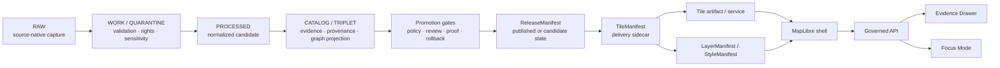
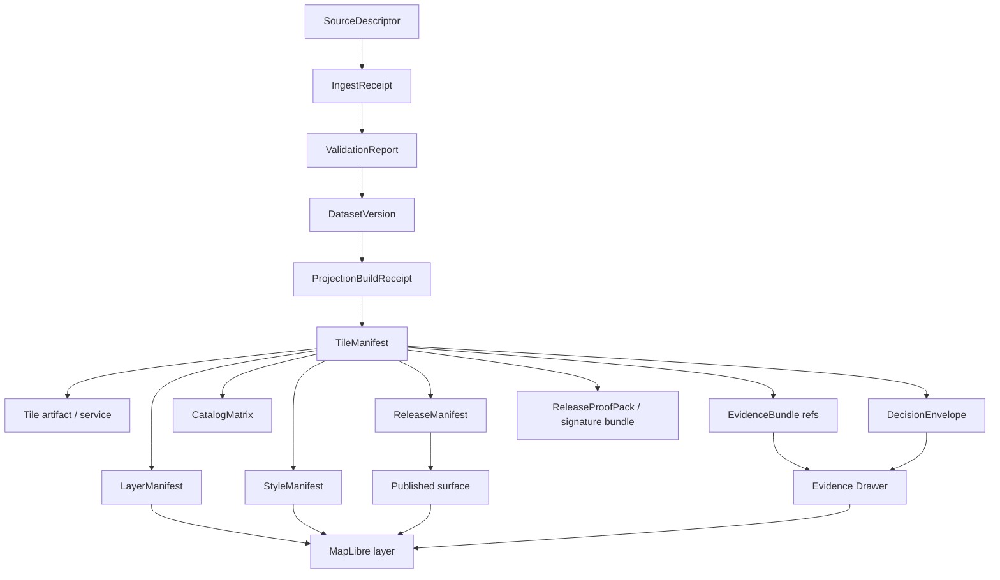

<!-- [KFM_META_BLOCK_V2]
doc_id: kfm://doc/NEEDS-VERIFICATION-tile-manifest-spec
title: Tile Manifest Specification
type: standard
version: v1
status: draft
owners: OWNER_TBD_NEEDS_VERIFICATION
created: 2026-04-30
updated: 2026-05-06
policy_label: POLICY_LABEL_TBD_NEEDS_VERIFICATION
related: [docs/architecture/tiles/README.md, docs/architecture/tiles/DELTA_UPDATE_MODEL.md, docs/architecture/tiles/GOVERNED_TILE_RELEASE_PUBLISHER.md, docs/adr/ADR-0001-schema-home.md, schemas/contracts/v1/tiles/NEEDS_VERIFICATION]
tags: [kfm, tiles, manifests, maplibre, evidence, publication, release]
notes: [Target path confirmed through accessible GitHub repository evidence; local mounted checkout unavailable during this revision. Owners, policy_label, doc_id, schema home acceptance, validator home, CODEOWNERS routing, workflow enforcement, and emitted runtime artifacts need verification.]
[/KFM_META_BLOCK_V2] -->

<a id="top"></a>

# Tile Manifest Specification

Defines the governed manifest contract for KFM tile delivery artifacts so rendered map surfaces remain traceable to release state, evidence, policy, provenance, integrity checks, correction lineage, and rollback targets.

<p>
  
  
  
  
  
</p>

> [!IMPORTANT]
> **Status:** `draft`  
> **Owners:** `OWNER_TBD_NEEDS_VERIFICATION`  
> **Path:** `docs/architecture/tiles/TILE_MANIFEST_SPEC.md`  
> **Current evidence posture:** `CONFIRMED` target path and selected adjacent docs through accessible GitHub repository inspection; `UNKNOWN` active local checkout, workflow enforcement, branch protection, emitted proof objects, dashboards, runtime behavior, and production tile-manifest validation.  
> **Primary rule:** A tile manifest makes a delivery artifact inspectable. It does **not** make tiles authoritative.

**Quick jumps:** [Scope](#scope) · [Repo fit](#repo-fit) · [Accepted inputs](#accepted-inputs) · [Exclusions](#exclusions) · [Operating law](#operating-law) · [Object-family map](#object-family-map) · [Manifest contract](#manifest-contract) · [Digest rules](#canonicalization-and-digest-rules) · [Validation gates](#validation-gates) · [UI behavior](#ui-and-evidence-drawer-behavior) · [Examples](#examples) · [Implementation sequence](#implementation-sequence) · [Definition of done](#definition-of-done) · [Open verification](#open-verification-backlog)

---

## Scope

A `TileManifest` is a small, reviewable, machine-checkable sidecar object for one governed tile delivery artifact or one coherent tile delivery bundle.

It answers five questions before a tile-backed layer can be trusted on a public, steward, review, export, or Focus Mode surface:

1. **What bytes, service snapshot, or delivery descriptor are being rendered?**
2. **Which release, source descriptors, receipts, dataset versions, transforms, and evidence support that delivery artifact?**
3. **What policy, sensitivity, rights, review, promotion, correction, and rollback decisions govern it?**
4. **Can the artifact and manifest be verified deterministically?**
5. **How must the UI display trust, staleness, generalization, correction, withdrawal, denial, abstention, and digest failure states?**

> [!NOTE]
> The manifest binds a map-delivery artifact to KFM’s proof spine. It does not replace `EvidenceBundle`, `DecisionEnvelope`, `ReleaseManifest`, `CatalogMatrix`, `ReviewRecord`, `PromotionDecision`, `CorrectionNotice`, or `RollbackCard`.

### Delivery forms covered

| Delivery form | KFM use | Minimum posture |
|---|---|---|
| `pmtiles` | Stable public-safe or steward-safe immutable tile archives. | Strong candidate for digest-addressed release bundles. |
| `mvt_service` | Server-mediated vector tile service. | Requires service snapshot/version identity and policy-mediated access. |
| `raster_tile_service` | Server-mediated raster tile delivery. | Requires source raster version, render profile, freshness, and policy state. |
| `cog_backed_tile_service` | Tile facade over a stronger COG source artifact. | COG/source object remains stronger than the display facade. |
| `mbtiles` | Local/server archive or packaging intermediate. | Public browser exposure requires approved serving adapter and access posture. |
| `tilejson` | Source adapter metadata for a tile source. | Useful descriptor, not a proof object by itself. |

[Back to top](#top)

---

## Repo fit

| Relationship | Path or object | Status | Notes |
|---|---|---:|---|
| This specification | `docs/architecture/tiles/TILE_MANIFEST_SPEC.md` | `CONFIRMED path` / `draft content` | Target path exists in the accessible GitHub repository. |
| Tile directory landing page | [`./README.md`](./README.md) | `CONFIRMED path` | Defines tile delivery architecture, accepted inputs, exclusions, lifecycle, and delivery posture. |
| Tile delta companion | [`./DELTA_UPDATE_MODEL.md`](./DELTA_UPDATE_MODEL.md) | `CONFIRMED path` | Defines incremental update posture without bypassing release or rollback. |
| Tile release companion | [`./GOVERNED_TILE_RELEASE_PUBLISHER.md`](./GOVERNED_TILE_RELEASE_PUBLISHER.md) | `CONFIRMED path` | Defines deterministic no-network publication-slice posture for tile release candidates. |
| Architecture landing page | [`../README.md`](../README.md) | `CONFIRMED path` | Places tiles under cross-cutting architecture rather than a domain root. |
| Schema-home ADR | [`../../adr/ADR-0001-schema-home.md`](../../adr/ADR-0001-schema-home.md) | `CONFIRMED path` / `draft proposed decision` | Proposes `schemas/contracts/v1/` as machine-schema home while `contracts/` preserves semantic meaning. |
| Machine schema | `../../../schemas/contracts/v1/tiles/tile_manifest.schema.json` | `PROPOSED / NEEDS VERIFICATION` | Target schema home only after ADR acceptance and repo-native convention verification. |
| Fixtures | `../../../tests/fixtures/tiles/tile_manifest/` or repo-native equivalent | `PROPOSED / NEEDS VERIFICATION` | Valid, invalid, stale, denied, generalized, rollback, digest-mismatch, and missing-evidence fixtures. |
| Validator | `../../../tools/validators/tiles/` or repo-native equivalent | `PROPOSED / NEEDS VERIFICATION` | Should emit finite outcomes and/or `DecisionEnvelope` references. |
| Release instances | `../../../release/`, `../../../data/published/`, `../../../data/proofs/`, `../../../data/receipts/` or repo-native equivalents | `NEEDS VERIFICATION` | Instance artifacts must remain separate from schema and contract definitions. |

> [!WARNING]
> If the active checkout proves a different canonical schema, validator, fixture, or release-artifact convention, preserve the semantics here and adapt file homes through an ADR or migration note. Do **not** create a second tile-manifest dialect.

---

## Accepted inputs

| Input | Required posture |
|---|---|
| Released or candidate tile artifact | Must identify artifact role, delivery form, URI, media type, extent, zoom/time scope, and digest subject where applicable. |
| Service snapshot descriptor | Required when the delivery artifact is a dynamic or server-mediated service rather than immutable bytes. |
| `SourceDescriptor` references | Must identify source role, rights, cadence, authority, access method, caveats, and sensitivity implications. |
| Dataset and projection build references | Must identify source-normalized dataset versions and tile/materialization build receipts. |
| Evidence references | Required when the layer or artifact supports consequential public or steward-facing claims. |
| Policy and review references | Must carry rights, sensitivity, access class, review state, and promotion/publication decision references. |
| Catalog closure references | Should connect STAC/DCAT/PROV/checksum closure where those surfaces are used. |
| Release references | Must identify the owning release, prior release when applicable, rollback target, correction notices, and publication state. |
| UI trust contract | Must identify layer binding, Evidence Drawer behavior, negative states, and Focus Mode eligibility. |

---

## Exclusions

| Excluded item | Why excluded | Home or surface instead |
|---|---|---|
| Canonical source or domain records | Tiles are rebuildable delivery artifacts, not canonical truth. | Domain stores, dataset versions, source registries, and evidence-producing pipelines. |
| RAW, WORK, QUARANTINE, unpublished candidates | Public tile surfaces must not bypass KFM lifecycle gates. | Lifecycle data homes with proper access controls. |
| Map style paint/layout semantics | Style is related but distinct from tile artifact identity. | `StyleManifest` and style assets. |
| Layer ordering and interaction contract | Layer binding is distinct from artifact integrity. | `LayerManifest` or layer registry. |
| Feature claim support | Tile attributes can carry handles but do not prove claims. | `EvidenceBundle` and Evidence Drawer payloads. |
| Full release assembly | A manifest can be part of a release; it is not the release itself. | `ReleaseManifest`, `ReleaseProofPack`, and release registry. |
| Human approval | Approval is a governed review/promotion act, not a manifest field alone. | `ReviewRecord` and `PromotionDecision`. |
| Policy rules | The manifest records policy refs and outcomes; it does not own policy law. | `policy/` and `DecisionEnvelope`. |
| Runtime AI response shape | Focus Mode must resolve evidence through governed services. | `RuntimeResponseEnvelope`, Focus Mode contracts, and AI receipts. |
| Emergency or life-safety alerting | KFM may provide contextual evidence, not official emergency instructions. | Official alerting and emergency systems. |

[Back to top](#top)

---

## Operating law

KFM tile manifests sit downstream of source validation, catalog closure, policy, review, and release state. They sit upstream of map rendering, layer selection, Evidence Drawer inspection, exports, and Focus Mode context.



### Rules

1. **Public-client rule**  
   Public and normal UI clients must use governed APIs, released artifacts, catalog records, tile services, and `EvidenceBundle` resolution. They must not read `RAW`, `WORK`, `QUARANTINE`, unpublished candidates, canonical/internal stores, proof-pack internals, review-only stores, or direct model output.

2. **Derived-layer rule**  
   Tiles, PMTiles, MVT services, TileJSON, raster tiles, graph projections, search views, summaries, screenshots, and scenes are downstream carriers. They are not sovereign truth.

3. **Cite-or-abstain rule**  
   If a tile-facing claim cannot resolve to admissible evidence, the UI must show an abstention or unavailable-evidence state rather than imply support.

4. **Promotion rule**  
   Publication is a governed state transition. A tile manifest may be referenced by release outputs, but it must not bypass review, policy, rights, sensitivity, catalog closure, proof, rollback, or correction handling.

5. **Fail-closed rule**  
   Missing manifest, digest mismatch, invalid signature, unresolved source descriptor, missing `EvidenceBundle`, unknown rights, unresolved sensitivity, missing rollback target, or public exposure of internal paths blocks public promotion.

6. **Thin-browser rule**  
   Browser logic may display trust state, request governed resolution, and show evidence payloads. It must not assemble consequential truth from tiles, style expressions, graph projections, or summaries alone.

[Back to top](#top)

---

## Object-family map

A `TileManifest` is a bridge object. It connects delivery bytes or service descriptors to the proof spine without replacing the proof spine.



| Object | Owns | Must not silently own |
|---|---|---|
| `TileManifest` | Delivery artifact identity, integrity refs, provenance refs, catalog refs, release refs, UI trust hints. | Canonical dataset truth, policy law, review approval, or EvidenceBundle content. |
| `LayerManifest` | Map layer binding, layer/source IDs, interaction behavior, drawer payload refs. | Tile artifact proof or canonical data semantics. |
| `StyleManifest` | Style JSON, sprites, glyphs, icons, visual versioning, meaning-change review needs. | Evidence, rights, sensitivity, or correction state. |
| `ReleaseManifest` | Release set, publication state, promoted artifacts, proof refs, rollback posture. | Individual tile bytes alone. |
| `EvidenceBundle` | Support for claim, feature, story, export, or Focus answer. | Tile archive metadata. |
| `DecisionEnvelope` | Machine-readable policy outcome and reason codes. | Human-readable badge text alone. |
| `ProjectionBuildReceipt` | Proof that a derived layer was built from known release/materialization inputs. | Public release approval. |
| `CatalogMatrix` | Cross-surface closure across catalog records, digests, release IDs, and proof refs. | A metadata catalog alone. |
| `CorrectionNotice` | Public or steward-visible correction, supersession, withdrawal, and affected claim/layer context. | Silent file replacement. |
| `RollbackCard` | Planned and auditable safe restoration path. | Deletion of history. |

---

## Manifest contract

The following v1 shape is the proposed contract for `TileManifest`. Exact schema IDs, enum vocabulary, path IDs, URI schemes, and validator behavior remain `NEEDS VERIFICATION` until reconciled with repo-native schema and validator conventions.

### Top-level fields

| Field | Required | Type | Purpose |
|---|---:|---|---|
| `schema_version` | Yes | string | Must be `kfm.tile_manifest.v1` for this spec. |
| `manifest_id` | Yes | string | Stable KFM manifest ID. Should include release or artifact identity. |
| `manifest_role` | Yes | enum | Must be `tile_manifest`. |
| `status` | Yes | enum | `draft`, `candidate`, `published`, `withdrawn`, or `superseded`. |
| `release_ref` | Yes | object | Links to release, promotion, and publication state. |
| `artifact` | Yes | object | Describes tile bytes, service snapshot, or governed tile service. |
| `spec_identity` | Yes | object | Declares deterministic identity and materialization inputs. |
| `provenance` | Yes | object | Connects source, dataset, receipt, validation, and derivation refs. |
| `governance` | Yes | object | Carries policy, review, sensitivity, rights, access, and decision refs. |
| `catalog_closure` | Yes | object | Links STAC/DCAT/PROV/checksum closure surfaces when present. |
| `verification` | Yes | object | Carries manifest digest, artifact digest, signature/bundle refs, and gate results. |
| `ui` | Yes | object | Provides safe UI binding and trust-badge behavior. |
| `lineage` | Yes | object | Supports supersession, rollback, withdrawal, and correction. |

### `release_ref`

| Field | Required | Notes |
|---|---:|---|
| `release_id` | Yes | Stable release identifier. |
| `release_manifest_ref` | Yes | Reference to `ReleaseManifest`; exact URI scheme needs verification. |
| `promotion_id` | Yes | Promotion transition or candidate ID. |
| `publication_state` | Yes | `candidate`, `published`, `withdrawn`, `superseded`, or `rollback_candidate`. |
| `published_at` | Conditional | Required when `publication_state` is `published`. |
| `previous_release_id` | Conditional | Required when a prior public/steward release exists. |

### `artifact`

| Field | Required | Notes |
|---|---:|---|
| `artifact_id` | Yes | Stable artifact identity within the release. |
| `artifact_role` | Yes | `map_delivery`, `preview`, `offline_bundle`, `steward_restricted_delivery`, or `proof_attachment`. |
| `delivery_form` | Yes | `pmtiles`, `mvt_service`, `raster_tile_service`, `cog_backed_tile_service`, `mbtiles`, or `tilejson`. |
| `uri` | Yes | Public manifests must not expose RAW/WORK/QUARANTINE/internal URIs. |
| `media_type` | Yes | Must match an approved media-type registry or documented repo convention. |
| `byte_size` | Conditional | Required for immutable file artifacts; optional for dynamic services. |
| `artifact_digest` | Conditional | Required for immutable artifacts; required for service snapshot descriptors when feasible. |
| `digest_subject` | Conditional | Required when `artifact_digest` is present: `bytes`, `service_snapshot_descriptor`, or `tilejson_descriptor`. |
| `service_snapshot_ref` | Conditional | Required for service-mediated artifacts unless the digest covers an immutable snapshot descriptor. |
| `tilejson_ref` | Optional | Reference to adapter metadata. |
| `minzoom` | Conditional | Required for tiled map delivery. |
| `maxzoom` | Conditional | Required for tiled map delivery. |
| `bounds_wgs84` | Conditional | Required when geographic extent is known. |
| `center_wgs84` | Optional | UI hint only. |
| `crs` | Yes | Coordinate reference system or tile matrix CRS. |
| `tile_matrix_set` | Conditional | Required if non-default or service-mediated. |
| `time_range` | Conditional | Required for time-aware, epoch-specific, or freshness-sensitive layers. |
| `generated_at` | Yes | Build timestamp. |
| `stale_after` | Conditional | Required for time-sensitive or operational-context layers. |

### `spec_identity`

| Field | Required | Notes |
|---|---:|---|
| `spec_hash` | Yes | Deterministic identity anchor for materialization inputs. |
| `spec_hash_algorithm` | Yes | Proposed: `sha256:kfm.jcs.detached_manifest_digest.v1`; exact profile needs verification. |
| `spec_inputs` | Yes | Array of input refs used to compute `spec_hash`. |
| `materialization_reason` | Yes | Human-readable reason for this tile build. |
| `materialization_profile` | Yes | Build profile name, such as `public_vector_tiles_v1`. |
| `profile_version` | Yes | Version of materialization profile. |

### `provenance`

| Field | Required | Notes |
|---|---:|---|
| `source_descriptor_refs` | Yes | Must reference source descriptors, not raw files alone. |
| `dataset_version_refs` | Yes | Released or candidate dataset versions used. |
| `projection_build_receipt_ref` | Yes | Receipt for derived tile build. |
| `run_receipt_refs` | Yes | Build, fetch, transform, and validation process receipts. |
| `validation_report_refs` | Yes | Validation evidence for this artifact. |
| `transform_receipt_refs` | Conditional | Required when redaction, generalization, interpolation, rasterization, aggregation, masking, or sensitivity transforms occurred. |
| `evidence_bundle_refs` | Conditional | Required for consequential layer claims. |
| `lineage_summary` | Yes | Short, non-authoritative summary for reviewers and UI. |

### `governance`

| Field | Required | Notes |
|---|---:|---|
| `policy_label` | Yes | Public/restricted/steward/etc.; exact vocabulary needs verification. |
| `rights_state` | Yes | `cleared`, `restricted`, `unknown`, `no_public_release`, or repo-approved equivalent. |
| `sensitivity_state` | Yes | Must reflect exact-location, cultural, ecological, infrastructure, living-person, and steward constraints where relevant. |
| `review_state` | Yes | `unreviewed`, `reviewed`, `approved`, `denied`, `escalated`, or `withdrawn`. |
| `promotion_decision_ref` | Conditional | Required before publication. |
| `decision_envelope_ref` | Yes | Machine-readable policy result. |
| `public_release_allowed` | Yes | Boolean gate; `false` blocks public use. |
| `access_class` | Yes | `public`, `steward`, `restricted`, `offline`, or `internal`. |
| `obligations` | Optional | Required attribution, masking, access, retention, or display obligations. |

### `catalog_closure`

| Field | Required | Notes |
|---|---:|---|
| `stac_refs` | Conditional | Required when artifact is cataloged through STAC. |
| `dcat_refs` | Conditional | Required when artifact has DCAT dataset/distribution metadata. |
| `prov_refs` | Conditional | Required when PROV closure is emitted. |
| `catalog_matrix_ref` | Yes | Closure record comparing IDs/checksums across catalog surfaces. |
| `checksum_closure` | Yes | `closed`, `open`, `mismatch`, or `not_applicable`. |
| `closure_notes` | Optional | Required when closure is not `closed`. |

### `verification`

| Field | Required | Notes |
|---|---:|---|
| `manifest_digest` | Yes | Digest of canonicalized manifest subject. |
| `artifact_digest` | Conditional | Must match `artifact.artifact_digest` when present. |
| `signature_ref` | Conditional | Required for published public artifacts unless policy explicitly exempts. |
| `dsse_bundle_ref` | Conditional | Required when signature bundle is used. |
| `attestation_refs` | Optional | Additional provenance, SLSA, or in-toto-style refs if supported. |
| `verification_status` | Yes | `unverified`, `verified`, `invalid`, `missing_bundle`, `digest_mismatch`, or `error`. |
| `verified_at` | Conditional | Required when `verification_status` is `verified` or `invalid`. |
| `verifier` | Conditional | Tool or service that produced verification. |
| `gate_h_integrity_ref` | Conditional | Required if broader promotion gates use Gate H naming. |

### `ui`

| Field | Required | Notes |
|---|---:|---|
| `layer_id` | Yes | Stable KFM layer ID. |
| `map_source_id` | Yes | MapLibre source ID or source binding. |
| `map_layer_ids` | Yes | MapLibre layer IDs using this artifact. |
| `evidence_binding_mode` | Yes | `layer`, `feature`, `tile`, `pixel_aggregate`, or `none`. |
| `feature_evidence_ref_property` | Conditional | Required when `evidence_binding_mode` is `feature`. |
| `evidence_drawer_payload_ref` | Conditional | Required for consequential public layers. |
| `trust_badge_policy` | Yes | Defines badge display and failure behavior. |
| `popup_claims_allowed` | Yes | `false` unless per-feature or layer `EvidenceBundle` support is available. |
| `focus_mode_allowed` | Yes | `false` unless Focus can resolve scope and evidence through governed API. |
| `negative_states` | Yes | UI states for missing evidence, stale data, policy denial, invalid signature, digest mismatch, withdrawal, and abstention. |

### `lineage`

| Field | Required | Notes |
|---|---:|---|
| `supersedes` | Yes | Array; empty for first release. |
| `superseded_by` | Yes | Array; empty unless superseded. |
| `rollback_target_ref` | Conditional | Required before public release unless explicitly exempted by policy. |
| `correction_notice_refs` | Yes | Array; empty if no corrections. |
| `withdrawal_reason` | Conditional | Required when `status` is `withdrawn`. |

[Back to top](#top)

---

## Canonicalization and digest rules

Manifest digests are trust-critical and easy to get wrong.

### Required digest posture

1. `artifact.artifact_digest` must be computed over tile artifact bytes or over an approved immutable service snapshot descriptor.
2. `verification.manifest_digest` must be computed over a deterministic canonical manifest subject.
3. The canonical manifest subject must exclude the digest value being computed, or normalize it to `null`, according to a named digest profile.
4. Signature fields must not alter the manifest digest subject unless the profile explicitly includes detached signature metadata.
5. `spec_identity.spec_hash` must identify materialization specification and inputs, not merely the final tile bytes.
6. Validators must reject ambiguous digest profiles.
7. `content_spec_hash`, `run_hash`, and `artifact_digest` should remain distinct when the repository supports all three:
   - `content_spec_hash` identifies declared content inputs.
   - `run_hash` identifies a process execution.
   - `artifact_digest` identifies produced bytes or an immutable service descriptor.

### Proposed digest profiles

| Profile | Use | Status |
|---|---|---|
| `kfm.jcs.detached_manifest_digest.v1` | Compute digest over canonical manifest with `verification.manifest_digest`, `verification.signature_ref`, `verification.dsse_bundle_ref`, and `verification.attestation_refs` omitted. | `PROPOSED` |
| `kfm.jcs.null_manifest_digest.v1` | Compute digest over canonical manifest with `verification.manifest_digest` set to `null`. | `PROPOSED` |
| `kfm.external_signed_envelope.v1` | Keep digest/signature in a detached proof object rather than embedding self-referential values. | `PROPOSED` |

> [!WARNING]
> A manifest that contains its own digest can become recursively unstable unless the emitting pipeline and validator use the exact same canonicalization profile. Do not treat ad hoc `json.dumps(sort_keys=True)` behavior as final KFM law without a repo-approved canonicalization profile.

### Digest subject guidance

| Delivery form | Preferred digest subject | Notes |
|---|---|---|
| `pmtiles` | Artifact bytes | Strongest and simplest for immutable public releases. |
| `mbtiles` | Artifact bytes | Public serving adapter still requires approval. |
| `mvt_service` | Immutable service snapshot descriptor | Must include service version, query/profile, source release, cache behavior, and access class. |
| `raster_tile_service` | Immutable service snapshot descriptor | Must include source raster version, tile matrix, resampling rules, and freshness. |
| `cog_backed_tile_service` | COG digest plus facade descriptor | COG remains stronger source object; tile facade is delivery. |
| `tilejson` | TileJSON descriptor and referenced delivery artifact | TileJSON alone is insufficient for proof. |

[Back to top](#top)

---

## Validation gates

A tile manifest should be validated before promotion and revalidated before public rendering.

| Gate | Name | Required checks | Outcome |
|---:|---|---|---|
| T0 | Schema and required fields | Valid JSON, schema version, required fields, enum values, URI shape, media type. | `PASS` / `ERROR` |
| T1 | Artifact integrity | Artifact digest present and matches bytes or immutable snapshot descriptor. | `PASS` / `DENY` / `ABSTAIN` |
| T2 | Manifest integrity | Manifest digest matches canonicalization profile. | `PASS` / `DENY` / `ERROR` |
| T3 | Signature and bundle | Signature/bundle present where required; signature verifies. | `PASS` / `DENY` / `ABSTAIN` |
| T4 | Provenance closure | Source descriptors, receipts, validation reports, dataset versions, and derivation refs resolve. | `PASS` / `ABSTAIN` / `DENY` |
| T5 | Catalog closure | STAC/DCAT/PROV/checksum refs align through `CatalogMatrix`. | `PASS` / `ABSTAIN` / `DENY` |
| T6 | Policy and sensitivity | Rights/sensitivity/review/promotion states permit requested access class. | `PASS` / `DENY` |
| T7 | UI trust contract | Evidence Drawer and negative states exist for consequential surfaces. | `PASS` / `ABSTAIN` |
| T8 | Public-boundary check | Public manifest does not expose RAW/WORK/QUARANTINE/internal URIs. | `PASS` / `DENY` |
| T9 | Rollback and correction readiness | Supersession/correction/rollback references are coherent. | `PASS` / `ABSTAIN` |

### Gate H alignment

Some KFM planning materials call the artifact-integrity gate **Gate H — Artifact Integrity & Signature**. This spec maps that concept to `T1`, `T2`, and `T3`, and records the combined result as `verification.gate_h_integrity_ref` when the broader promotion system uses Gate H naming.

### Finite validator outcomes

| Result | Meaning |
|---|---|
| `PASS` | Checks succeeded for the requested action and access class. |
| `ABSTAIN` | The validator cannot prove safety, completeness, freshness, review state, or release eligibility. |
| `DENY` | Policy, integrity, sensitivity, rights, or boundary rule failed. |
| `ERROR` | Validator, schema, environment, or artifact access failed in a way that prevents evaluation. |

Validator reports should emit or reference a `DecisionEnvelope`.

---

## UI and Evidence Drawer behavior

A tile manifest is not only a CI artifact. It becomes part of the visible trust surface.

### Trust badges

| Badge state | Meaning | Public behavior |
|---|---|---|
| `verified` | Manifest digest, artifact digest, signature, provenance, catalog closure, and policy checks passed for this access class. | Layer may render with verified trust cue. |
| `unverified` | Verification has not run. | Public layer should not render as trusted; steward/debug view may show warning. |
| `missing_bundle` | Required signature or verification bundle is missing. | Public promotion blocked unless policy explicitly exempts. |
| `invalid_signature` | Signature check failed. | Public render blocked; show denial state. |
| `digest_mismatch` | Artifact or manifest digest mismatch. | Public render blocked; show drift/tamper state. |
| `evidence_unavailable` | `EvidenceBundle` or drawer payload does not resolve. | Claim UI must abstain; consequential layer rendering may be blocked. |
| `policy_denied` | Policy prohibits requested access or display. | Do not render restricted details. |
| `stale` | `stale_after` exceeded or source freshness unknown. | Show stale badge; consequential claims require freshness note or abstention. |
| `withdrawn` | Release is no longer valid for the requested surface. | Public render blocked or redirected to safe rollback/correction state. |
| `generalized` | Public geometry or attributes were transformed for safety. | Show transform/withheld-accounting cue. |

### Evidence Drawer minimum payload

When a user opens layer evidence, the UI should show:

| Drawer section | Required content |
|---|---|
| Identity | `manifest_id`, `artifact_id`, `artifact_digest`, `manifest_digest`, `spec_hash`, release ID. |
| Provenance | Source descriptors, dataset versions, derivation receipt, run receipts, build timestamp. |
| Verification | Signature status, bundle status, digest status, validator result, offline-verifiable flag. |
| Governance | Policy label, rights state, sensitivity state, review state, promotion decision. |
| Catalog | STAC/DCAT/PROV refs and closure state. |
| Lineage | Supersession, correction notices, withdrawal state, rollback target. |
| Limits | Evidence-binding mode, stale-after, support/resolution caveats. |

### Per-feature claims

If a tile contains clickable features and the UI presents consequential claims:

- `ui.evidence_binding_mode` must be `feature`, `layer`, or `pixel_aggregate`.
- For `feature`, each feature must carry a resolvable property named by `ui.feature_evidence_ref_property`.
- Popups must not infer claim support from rendered geometry alone.
- Focus Mode must use governed API resolution, not raw tile attributes, as its evidence source.

### Focus Mode behavior

Focus Mode may use a tile manifest as context, but it must resolve evidence through governed services before answering.

| Outcome | Required behavior |
|---|---|
| `ANSWER` | Cite resolved evidence and echo scope/time. |
| `ABSTAIN` | State that support is insufficient, stale, unresolved, conflicted, or out of scope. |
| `DENY` | State policy-safe denial category without leaking restricted detail. |
| `ERROR` | State runtime or validation error category and preserve map context. |

[Back to top](#top)

---

## Examples

The examples below are illustrative target shapes. They are not proof that these files, IDs, validators, or paths currently exist.

<details>
<summary><strong>Example: candidate PMTiles TileManifest awaiting public verification</strong></summary>

```json
{
  "schema_version": "kfm.tile_manifest.v1",
  "manifest_id": "kfm://tile-manifest/hydrology/huc12-demo/sha256-1111111111111111111111111111111111111111111111111111111111111111",
  "manifest_role": "tile_manifest",
  "status": "candidate",
  "release_ref": {
    "release_id": "kfm://release/hydrology/huc12-demo/2026-05-06",
    "release_manifest_ref": "kfm://release-manifest/hydrology/huc12-demo/2026-05-06",
    "promotion_id": "kfm://promotion/hydrology/huc12-demo/2026-05-06",
    "publication_state": "candidate",
    "previous_release_id": "kfm://release/hydrology/huc12-demo/previous"
  },
  "artifact": {
    "artifact_id": "kfm://artifact/tiles/hydrology/huc12-demo.pmtiles",
    "artifact_role": "map_delivery",
    "delivery_form": "pmtiles",
    "uri": "published/tiles/hydrology/huc12-demo.pmtiles",
    "media_type": "application/vnd.pmtiles",
    "byte_size": 1234567,
    "artifact_digest": "sha256:2222222222222222222222222222222222222222222222222222222222222222",
    "digest_subject": "bytes",
    "minzoom": 0,
    "maxzoom": 12,
    "bounds_wgs84": [-102.1, 36.9, -94.5, 40.1],
    "center_wgs84": [-98.4, 38.5],
    "crs": "EPSG:3857",
    "tile_matrix_set": "WebMercatorQuad",
    "time_range": {
      "valid_time": "2024-01-01/..",
      "release_time": "2026-05-06T00:00:00Z"
    },
    "generated_at": "2026-05-06T00:00:00Z",
    "stale_after": "2026-11-06T00:00:00Z"
  },
  "spec_identity": {
    "spec_hash": "sha256:3333333333333333333333333333333333333333333333333333333333333333",
    "spec_hash_algorithm": "sha256:kfm.jcs.detached_manifest_digest.v1",
    "spec_inputs": [
      "kfm://dataset-version/hydrology/huc12-demo/2026-05-06",
      "kfm://materialization-profile/public_vector_tiles_v1"
    ],
    "materialization_reason": "Public-safe HUC12 demonstration tile build.",
    "materialization_profile": "public_vector_tiles_v1",
    "profile_version": "v1"
  },
  "provenance": {
    "source_descriptor_refs": ["kfm://source/usgs-wbd-huc12-demo"],
    "dataset_version_refs": ["kfm://dataset-version/hydrology/huc12-demo/2026-05-06"],
    "projection_build_receipt_ref": "kfm://receipt/projection-build/huc12-demo/2026-05-06",
    "run_receipt_refs": ["kfm://receipt/run/huc12-demo/2026-05-06"],
    "validation_report_refs": ["kfm://validation-report/huc12-demo/2026-05-06"],
    "transform_receipt_refs": [],
    "evidence_bundle_refs": ["kfm://evidence-bundle/huc12-demo/layer"],
    "lineage_summary": "Illustrative public-safe HUC12 tile artifact built from governed fixture data."
  },
  "governance": {
    "policy_label": "public",
    "rights_state": "cleared",
    "sensitivity_state": "public_safe",
    "review_state": "approved",
    "promotion_decision_ref": "kfm://promotion-decision/huc12-demo/2026-05-06",
    "decision_envelope_ref": "kfm://decision-envelope/huc12-demo/2026-05-06",
    "public_release_allowed": true,
    "access_class": "public",
    "obligations": ["show_attribution", "show_evidence_drawer"]
  },
  "catalog_closure": {
    "stac_refs": ["kfm://stac/item/huc12-demo/2026-05-06"],
    "dcat_refs": ["kfm://dcat/distribution/huc12-demo/2026-05-06"],
    "prov_refs": ["kfm://prov/activity/huc12-demo/2026-05-06"],
    "catalog_matrix_ref": "kfm://catalog-matrix/huc12-demo/2026-05-06",
    "checksum_closure": "closed",
    "closure_notes": []
  },
  "verification": {
    "manifest_digest": "sha256:4444444444444444444444444444444444444444444444444444444444444444",
    "artifact_digest": "sha256:2222222222222222222222222222222222222222222222222222222222222222",
    "signature_ref": "kfm://signature/huc12-demo/2026-05-06",
    "dsse_bundle_ref": "kfm://dsse/huc12-demo/2026-05-06",
    "attestation_refs": [],
    "verification_status": "verified",
    "verified_at": "2026-05-06T00:00:00Z",
    "verifier": "tile_manifest_validator",
    "gate_h_integrity_ref": "kfm://gate-h/huc12-demo/2026-05-06"
  },
  "ui": {
    "layer_id": "hydrology.huc12.demo.public.v1",
    "map_source_id": "src-hydrology-huc12-demo",
    "map_layer_ids": ["lyr-hydrology-huc12-fill", "lyr-hydrology-huc12-outline"],
    "evidence_binding_mode": "layer",
    "feature_evidence_ref_property": null,
    "evidence_drawer_payload_ref": "kfm://drawer-payload/huc12-demo/layer",
    "trust_badge_policy": "show_verified_or_block",
    "popup_claims_allowed": false,
    "focus_mode_allowed": true,
    "negative_states": [
      "evidence_unavailable",
      "policy_denied",
      "stale",
      "digest_mismatch",
      "invalid_signature",
      "withdrawn"
    ]
  },
  "lineage": {
    "supersedes": [],
    "superseded_by": [],
    "rollback_target_ref": "kfm://release/hydrology/huc12-demo/previous",
    "correction_notice_refs": [],
    "withdrawal_reason": null
  }
}
```

</details>

<details>
<summary><strong>Example: denial case for unsafe public path</strong></summary>

```json
{
  "schema_version": "kfm.tile_manifest.validation_result.v1",
  "manifest_id": "kfm://tile-manifest/example/unsafe-path",
  "outcome": "DENY",
  "reason_codes": [
    "public_manifest_contains_internal_lifecycle_path",
    "release_boundary_violation"
  ],
  "failed_gates": ["T8"],
  "unsafe_paths": [
    "data/work/example/internal.pmtiles",
    "data/quarantine/example/rejected.pmtiles"
  ],
  "public_release_allowed": false,
  "decision_envelope_ref": "kfm://decision-envelope/example/unsafe-path",
  "required_action": "Replace public URI with release-bound artifact ref or keep candidate out of public release."
}
```

</details>

---

## Implementation sequence

This sequence is `PROPOSED` and should be adapted to repo-native conventions after active-checkout inspection.

| Step | Change | Output |
|---:|---|---|
| 0 | Inspect active checkout, branch, owners, adjacent docs, schema home, validator home, release storage, package runner, and workflow state. | Verification notes and updated placeholders. |
| 1 | Confirm or create schema-home decision for tiles. | ADR update or schema-home decision reference. |
| 2 | Add machine schema after ADR alignment. | `tile_manifest.schema.json` or repo-native equivalent. |
| 3 | Add no-network fixtures. | Valid PMTiles manifest, service descriptor manifest, digest mismatch, missing evidence, denied policy, stale source, withdrawn release, unsafe path. |
| 4 | Add validator. | Finite `PASS` / `ABSTAIN` / `DENY` / `ERROR` outcome report. |
| 5 | Wire policy checks. | Rights, sensitivity, review, public-release, stale, and no-public-raw-path checks. |
| 6 | Add catalog/proof closure checks. | STAC/DCAT/PROV/checksum and release-manifest consistency. |
| 7 | Add UI payload fixture. | Map click or layer inspect resolves to Evidence Drawer payload and trust badges. |
| 8 | Add Focus Mode fixture. | `ANSWER`, `ABSTAIN`, `DENY`, and `ERROR` cases over tile-backed context. |
| 9 | Add rollback drill. | Prior release restored without deleting correction or failure lineage. |
| 10 | Update docs together. | Tile README, delta model, release publisher, ADRs, schema docs, validator docs, and test docs stay synchronized. |

---

## Definition of done

A tile-manifest change is not done until every applicable item is checked.

- [ ] Target path and adjacent docs inspected in the active checkout.
- [ ] Owners or reviewer roles verified.
- [ ] Policy label verified.
- [ ] Schema-home and contract-home ambiguity resolved or explicitly deferred by ADR.
- [ ] Machine schema exists or this doc remains clearly `PROPOSED`.
- [ ] Valid and invalid fixtures cover immutable artifact, service descriptor, missing evidence, stale, denied, unsafe path, digest mismatch, invalid signature, generalized, withdrawn, and rollback cases.
- [ ] Validator emits finite outcomes.
- [ ] Manifest digest profile is deterministic and documented.
- [ ] Artifact digest subject is explicit.
- [ ] Source descriptors, dataset versions, receipts, validation reports, and transform receipts resolve.
- [ ] Catalog closure is present or the absence is explicitly justified.
- [ ] Policy, rights, sensitivity, review, promotion, correction, and rollback refs are present for public release.
- [ ] Public clients cannot reach RAW, WORK, QUARANTINE, canonical, proof-pack, steward-only, review-only, or direct model-runtime paths.
- [ ] Evidence Drawer payload resolves or shows a visible negative state.
- [ ] Focus Mode is evidence-bounded and returns finite outcomes only.
- [ ] Rollback restores the previous safe release without erasing correction history.
- [ ] Documentation, schemas, fixtures, policies, validators, and tests update together when behavior changes.

[Back to top](#top)

---

## Anti-patterns to reject

- Treating `PMTiles`, `MVT`, raster tiles, `TileJSON`, or style JSON as canonical truth.
- Letting MapLibre feature properties become citation authority.
- Shipping a public tile bundle before rights, sensitivity, evidence support, and release state are known.
- Using browser-only filters to hide restricted features.
- Publishing tiles without a prior release and rollback target.
- Embedding policy logic only in style expressions or popup templates.
- Letting Focus Mode answer from tile attributes alone.
- Using unmanifested sprites, glyphs, fonts, plugins, or external URLs in production.
- Creating duplicate schema homes because repository convention was not inspected.
- Treating receipts, proofs, catalogs, release manifests, and correction notices as interchangeable object families.
- Silently overwriting a public tile artifact without supersession, digest, cache, and correction lineage.

---

## Open verification backlog

| Item | Status | How to close |
|---|---:|---|
| Owner / CODEOWNERS routing for this file | `NEEDS VERIFICATION` | Inspect `CODEOWNERS`, document registry, or maintainer assignment. |
| Document `doc_id` | `NEEDS VERIFICATION` | Assign through repo/document registry convention. |
| Policy label | `NEEDS VERIFICATION` | Confirm from document registry or policy-label standard. |
| Schema home acceptance | `NEEDS VERIFICATION` | Confirm ADR-0001 status and schema consumers. |
| Tile manifest schema file | `UNKNOWN / NEEDS VERIFICATION` | Add or locate `tile_manifest.schema.json` under accepted schema home. |
| Validator implementation | `UNKNOWN / NEEDS VERIFICATION` | Add or locate repo-native tile manifest validator. |
| Fixture home | `NEEDS VERIFICATION` | Confirm where tile-manifest valid/invalid fixtures should live. |
| Release artifact storage | `NEEDS VERIFICATION` | Confirm `release/`, `data/published/`, `data/proofs/`, `data/receipts/`, or repo-native equivalent. |
| Workflow enforcement | `UNKNOWN` | Inspect workflow run evidence, branch protection, and validator output. |
| Runtime/API binding | `UNKNOWN` | Inspect governed API, web shell, layer registry, Evidence Drawer, and Focus Mode code/tests. |
| Media-type registry | `NEEDS VERIFICATION` | Confirm approved media types for PMTiles, MVT, TileJSON, MBTiles, and raster services. |
| Signature/attestation policy | `NEEDS VERIFICATION` | Confirm DSSE/Sigstore/Cosign or repo-native signing requirements. |
| Cache invalidation / immutable URL strategy | `NEEDS VERIFICATION` | Confirm release publisher and delta-update conventions. |
| Sensitive-geometry categories | `NEEDS VERIFICATION` | Confirm cross-domain policy and transform receipts for exact-location safety. |

---

<details>
<summary>Appendix A — Maintainer review card</summary>

Use this in PRs that create, modify, or consume a `TileManifest`.

```markdown
## TileManifest review card

Target path:

Owning root:
- [ ] docs/architecture
- [ ] schemas/contracts/v1
- [ ] policy
- [ ] tests/fixtures
- [ ] tools/validators
- [ ] release / data published
- [ ] apps / packages

Directory Rules basis:

Upstream evidence:
- SourceDescriptor refs:
- DatasetVersion refs:
- Receipts:
- Validation reports:
- EvidenceBundle refs:
- Policy / DecisionEnvelope refs:
- Review / Promotion refs:
- Release refs:

Truth labels:
- CONFIRMED:
- PROPOSED:
- UNKNOWN:
- NEEDS VERIFICATION:

Artifact identity:
- artifact_id:
- delivery_form:
- URI:
- artifact_digest:
- digest_subject:
- manifest_digest profile:

Public exposure:
- [ ] public
- [ ] steward
- [ ] restricted
- [ ] offline
- [ ] internal

Policy/sensitivity:
- rights_state:
- sensitivity_state:
- access_class:
- public_release_allowed:

UI behavior:
- Evidence Drawer payload:
- Trust badges:
- Negative states:
- Focus Mode outcomes:

Validation run:

Rollback target:

Correction or supersession impact:
```

</details>

<details>
<summary>Appendix B — Glossary</summary>

| Term | KFM meaning |
|---|---|
| `TileManifest` | Governed sidecar for a tile delivery artifact or delivery bundle. |
| `TileArtifactManifest` | Possible repo alias or implementation name for tile artifact manifest semantics; must be reconciled if present. |
| `LayerManifest` | Layer binding, source/layer IDs, interaction contract, and Evidence Drawer references. |
| `StyleManifest` | Style JSON, sprite/glyph/font assets, visual versioning, and meaning-change review posture. |
| `MapReleaseManifest` / `ReleaseManifest` | Release identity, promoted artifacts, proof refs, prior release, rollback, correction state. |
| `EvidenceBundle` | Evidence-resolving object that outranks generated language and rendered pixels. |
| `Evidence Drawer` | UI trust surface that exposes evidence, citations, policy state, transforms, withheld counts, and correction lineage. |
| `Focus Mode` | Evidence-bounded AI surface with finite outcomes: `ANSWER`, `ABSTAIN`, `DENY`, `ERROR`. |
| `Public-safe` | Passed rights, sensitivity, review, source-role, geometry, and release checks for intended audience. |
| `Withheld accounting` | Count or explanation of restricted/suppressed features without exposing sensitive details. |
| `Derived artifact` | Rebuildable product downstream of canonical evidence, such as tiles, search views, graph projections, summaries, scenes, and exports. |

</details>

[Back to top](#top)
