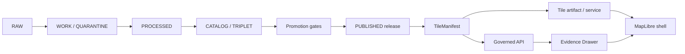
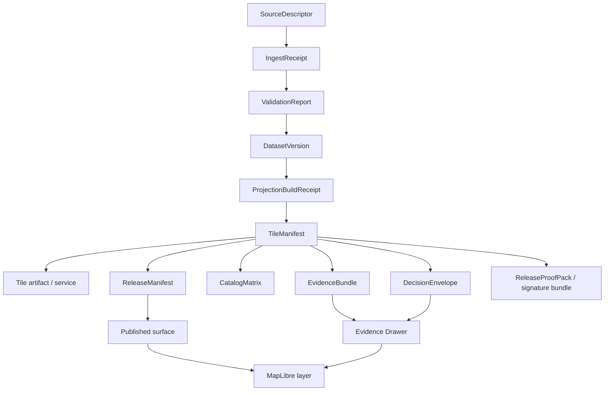

<!-- [KFM_META_BLOCK_V2]
doc_id: kfm://doc/TODO-ASSIGN-UUID
title: Tile Manifest Specification
type: standard
version: v1
status: draft
owners: TODO-VERIFY
created: 2026-04-30
updated: 2026-04-30
policy_label: TODO-VERIFY
related: [TODO-VERIFY]
tags: [kfm, tiles, manifests, maplibre, evidence, publication]
notes: [Draft generated from attached KFM corpus; doc_id, owners, policy_label, related paths, schema home, and validator home need repository confirmation.]
[/KFM_META_BLOCK_V2] -->

# Tile Manifest Specification

Defines the governed manifest contract for KFM tile delivery artifacts so rendered map surfaces remain traceable to release state, evidence, policy, provenance, integrity checks, and rollback lineage.


<a id="top"></a>

## Quick navigation

- [Purpose](#purpose)
- [Truth posture](#truth-posture)
- [Repo fit](#repo-fit)
- [Scope](#scope)
- [Operating law](#operating-law)
- [Tile manifest in the KFM object family](#tile-manifest-in-the-kfm-object-family)
- [Required manifest shape](#required-manifest-shape)
- [Canonicalization and digest rules](#canonicalization-and-digest-rules)
- [Validation gates](#validation-gates)
- [UI and Evidence Drawer behavior](#ui-and-evidence-drawer-behavior)
- [Examples](#examples)
- [Anti-patterns](#anti-patterns)
- [Acceptance checklist](#acceptance-checklist)
- [Open verification backlog](#open-verification-backlog)

---

## Purpose

A `TileManifest` is a small, reviewable, machine-checkable sidecar object for a released or candidate tile delivery artifact.

It answers five questions before a tile layer can become a trusted KFM public or steward-facing surface:

1. **What bytes are being rendered?**
2. **Which release, source descriptors, receipts, and evidence support those bytes?**
3. **What policy, sensitivity, rights, review, and promotion decisions govern them?**
4. **Can the artifact and manifest be verified deterministically?**
5. **How does the UI show trust, staleness, correction, rollback, and abstention states?**

> [!IMPORTANT]
> A tile manifest does **not** make tiles authoritative. Tiles, PMTiles, raster tiles, search views, graph projections, summaries, and scenes are downstream carriers. KFM truth remains upstream in governed evidence, catalog, policy, review, and release objects.

---

## Truth posture

| Claim area | Status | Meaning for this file |
|---|---:|---|
| Target path | CONFIRMED | The requested file path is `docs/architecture/tiles/TILE_MANIFEST_SPEC.md`. |
| KFM doctrine | CONFIRMED | The attached corpus consistently requires governed lifecycle, evidence-first posture, public-client boundaries, derived-layer caution, and traceable publication. |
| Machine schema home | UNKNOWN | The current repository schema convention was not directly visible. This spec proposes a schema location but does not claim it exists. |
| Validator implementation | PROPOSED | Validator names, commands, reports, and fixtures below are target contracts, not verified current repo behavior. |
| Runtime behavior | UNKNOWN | No mounted runtime, route tree, CI workflow, dashboards, logs, emitted proof objects, or MapLibre integration were directly inspected. |
| Field names in this spec | PROPOSED | Names are intended to stabilize KFM tile-manifest semantics and should be reconciled with any existing repo convention before commit. |

This spec uses `MUST`, `SHOULD`, and `MAY` as requirement keywords.

---

## Repo fit

| Item | Determination |
|---|---|
| Standard doc path | `docs/architecture/tiles/TILE_MANIFEST_SPEC.md` |
| Machine schema home | PROPOSED: `schemas/contracts/v1/tiles/tile_manifest.schema.json` after schema-home verification |
| Valid fixtures | PROPOSED: `tests/fixtures/tiles/tile_manifest/valid/` |
| Invalid fixtures | PROPOSED: `tests/fixtures/tiles/tile_manifest/invalid/` |
| Validator | PROPOSED: `tools/validators/tile_manifest_validator.*` or repo-native equivalent |
| Related object families | `ReleaseManifest`, `ReleaseProofPack`, `ProjectionBuildReceipt`, `EvidenceBundle`, `DecisionEnvelope`, `SourceDescriptor`, `CatalogMatrix`, `CorrectionNotice` |
| Public UI consumer | PROPOSED: governed MapLibre shell, Evidence Drawer, Review Console, Focus Mode |
| Current implementation proof | NEEDS VERIFICATION |

> [!NOTE]
> If the mounted repository later proves a different schema or validator convention, preserve the semantics here and adapt the file homes through an ADR rather than creating parallel tile-manifest dialects.

---

## Scope

### Accepted inputs

A `TileManifest` may describe one governed tile delivery artifact or one coherent tile delivery bundle:

| Delivery form | Use in KFM | Notes |
|---|---|---|
| `pmtiles` | Released semistatic vector/raster tile archive, offline package, object-store/CDN-style delivery | Good first target for immutable, digest-addressed tile releases. |
| `mvt_service` | Server-mediated vector tile service | Requires service snapshot/version identity and policy-mediated access. |
| `raster_tile_service` | Server-mediated raster tile service | Requires source raster, derivation, freshness, and support metadata. |
| `cog_backed_tile_service` | Tile facade over a stronger COG raster source | The COG remains the stronger raster object; the tile service is delivery. |
| `mbtiles` | Local or server-side archive | Public browser exposure depends on an approved serving adapter. |
| `tilejson` | Adapter metadata for a tile source | TileJSON can be referenced, but it is not a trust object by itself. |

### Exclusions

This spec does **not** define:

| Excluded thing | Where it belongs instead |
|---|---|
| Canonical datasets | Domain schemas, dataset versions, source registries, and governed stores |
| Map style paint/layout rules | Style manifests and MapLibre style assets |
| Feature claim evidence | `EvidenceBundle` and Evidence Drawer payload contracts |
| Full release assembly | `ReleaseManifest` / `ReleaseProofPack` |
| Human approval | `ReviewRecord` and `PromotionDecision` |
| Policy rules | Policy bundles and `DecisionEnvelope` outputs |
| Runtime AI response shape | `RuntimeResponseEnvelope` and governed Focus Mode contracts |
| Emergency, life-safety, or operational alerting | Official source systems and KFM contextual-not-alerting posture |

---

## Operating law

KFM tile manifests sit downstream of the canonical evidence path and upstream of map rendering.



### Rules

1. **Public-client rule**  
   Public and normal UI clients MUST use released artifacts, governed APIs, catalog records, tile services, and EvidenceBundle resolution. They MUST NOT read `RAW`, `WORK`, `QUARANTINE`, unpublished candidates, canonical/internal stores, or direct model output.

2. **Derived-layer rule**  
   A tile artifact is a delivery surface. It MUST NOT become the source of truth for a claim unless a separate EvidenceBundle and release chain support that claim.

3. **Cite-or-abstain rule**  
   If a tile-facing claim cannot resolve to admissible evidence, the UI MUST show an abstention or unavailable evidence state rather than imply support.

4. **Promotion rule**  
   Publication is a governed state transition. A tile manifest may be referenced by promotion outputs, but it MUST NOT bypass review, policy, rights, sensitivity, catalog closure, proof, rollback, or correction handling.

5. **Fail-closed rule**  
   Missing manifest, digest mismatch, invalid signature, unresolved source descriptor, missing EvidenceBundle, unknown rights, or unresolved sensitivity MUST block public promotion. Steward/debug surfaces MAY show the failure state with explicit labeling.

---

## Tile manifest in the KFM object family

A `TileManifest` is a bridge object. It connects delivery bytes to the proof spine without replacing the proof spine.



### Boundary distinctions

| Object | Governs | Must not be confused with |
|---|---|---|
| `TileManifest` | Delivery artifact identity, integrity, provenance refs, catalog refs, UI trust hints | Canonical dataset, policy decision, EvidenceBundle |
| `LayerManifest` | Map layer binding, source/layer IDs, display metadata, drawer payload refs | Tile artifact proof |
| `StyleManifest` | Style JSON, sprites, glyphs, icons, visual versioning | Evidence, rights, or review state |
| `ReleaseManifest` | Release set, publication state, proof refs, rollback posture | Individual tile bytes only |
| `EvidenceBundle` | Support for claim, feature, export, story, or Focus answer | Tile archive metadata |
| `DecisionEnvelope` | Machine-readable policy result | Human-readable badge text |
| `ProjectionBuildReceipt` | Proof that a derived layer was built from a known release scope | Public release proof |

---

## Required manifest shape

### Top-level object

| Field | Required | Type | Purpose |
|---|---:|---|---|
| `schema_version` | Yes | string | MUST be `kfm.tile_manifest.v1` for this spec. |
| `manifest_id` | Yes | string | Stable KFM ID. SHOULD include release or artifact identity. |
| `manifest_role` | Yes | string | MUST be `tile_manifest`. |
| `status` | Yes | enum | `draft`, `candidate`, `published`, `withdrawn`, or `superseded`. |
| `release_ref` | Yes | object | Links to release and promotion state. |
| `artifact` | Yes | object | Describes the tile bytes or governed tile service. |
| `spec_identity` | Yes | object | Declares deterministic identity and materialization inputs. |
| `provenance` | Yes | object | Connects source, dataset, receipt, and derivation references. |
| `governance` | Yes | object | Carries policy, review, sensitivity, rights, and decision refs. |
| `catalog_closure` | Yes | object | Links STAC/DCAT/PROV/checksum closure surfaces. |
| `verification` | Yes | object | Carries manifest digest, artifact digest, signature, and gate results. |
| `ui` | Yes | object | Provides safe UI binding and trust-badge behavior. |
| `lineage` | Yes | object | Supports supersession, rollback, and correction. |

### `release_ref`

| Field | Required | Notes |
|---|---:|---|
| `release_id` | Yes | Stable release identifier. |
| `release_manifest_ref` | Yes | Reference to `ReleaseManifest`; exact URI scheme NEEDS VERIFICATION. |
| `promotion_id` | Yes | Promotion transition or candidate ID. |
| `publication_state` | Yes | `candidate`, `published`, `withdrawn`, `superseded`, or `rollback`. |
| `published_at` | Conditional | Required when `publication_state` is `published`. |

### `artifact`

| Field | Required | Notes |
|---|---:|---|
| `artifact_id` | Yes | Stable artifact identity within the release. |
| `artifact_role` | Yes | `map_delivery`, `preview`, `offline_bundle`, `steward_restricted_delivery`, or `proof_attachment`. |
| `delivery_form` | Yes | `pmtiles`, `mvt_service`, `raster_tile_service`, `cog_backed_tile_service`, `mbtiles`, or `tilejson`. |
| `uri` | Yes | Public manifests MUST NOT expose internal raw/work/quarantine URIs. |
| `media_type` | Yes | Must match approved media-type registry. |
| `byte_size` | Conditional | Required for immutable file artifacts; optional for dynamic services. |
| `artifact_digest` | Conditional | Required for immutable file artifacts; required for service snapshot descriptors when feasible. |
| `tilejson_ref` | Optional | Reference to adapter metadata. |
| `minzoom` | Conditional | Required for tiled map delivery. |
| `maxzoom` | Conditional | Required for tiled map delivery. |
| `bounds_wgs84` | Conditional | Required when geographic extent is known. |
| `center_wgs84` | Optional | UI hint only. |
| `crs` | Yes | Coordinate reference system or tile matrix CRS. |
| `tile_matrix_set` | Conditional | Required if non-default or service-mediated. |
| `time_range` | Conditional | Required for time-aware or epoch-specific layers. |
| `generated_at` | Yes | Build timestamp. |
| `stale_after` | Conditional | Required for time-sensitive or operational-context layers. |

### `spec_identity`

| Field | Required | Notes |
|---|---:|---|
| `spec_hash` | Yes | Deterministic identity anchor for materialization inputs. |
| `spec_hash_algorithm` | Yes | PROPOSED: `sha256:jcs-compatible-json`. Exact profile NEEDS VERIFICATION. |
| `spec_inputs` | Yes | Array of input references used to compute `spec_hash`. |
| `materialization_reason` | Yes | Human-readable reason for this tile build. |
| `materialization_profile` | Yes | Build profile name, such as `public_vector_tiles_v1`. |
| `profile_version` | Yes | Version of materialization profile. |

### `provenance`

| Field | Required | Notes |
|---|---:|---|
| `source_descriptor_refs` | Yes | MUST reference source descriptors, not raw files alone. |
| `dataset_version_refs` | Yes | Released or candidate dataset versions used. |
| `projection_build_receipt_ref` | Yes | Receipt for derived tile build. |
| `run_receipt_refs` | Yes | Build/fetch/transform receipts. |
| `validation_report_refs` | Yes | Validation evidence for this artifact. |
| `transform_receipt_refs` | Conditional | Required when redaction, generalization, interpolation, rasterization, or aggregation occurred. |
| `evidence_bundle_refs` | Conditional | Required for consequential layer claims. |
| `lineage_summary` | Yes | Short, non-authoritative summary for reviewers and UI. |

### `governance`

| Field | Required | Notes |
|---|---:|---|
| `policy_label` | Yes | Public/restricted/steward/etc.; exact vocabulary NEEDS VERIFICATION. |
| `rights_state` | Yes | `cleared`, `restricted`, `unknown`, `no_public_release`, or repo-approved equivalent. |
| `sensitivity_state` | Yes | MUST reflect exact-location, cultural, ecological, infrastructure, living-person, and steward constraints where relevant. |
| `review_state` | Yes | `unreviewed`, `reviewed`, `approved`, `denied`, `escalated`, or `withdrawn`. |
| `promotion_decision_ref` | Conditional | Required before publication. |
| `decision_envelope_ref` | Yes | Machine-readable policy result. |
| `public_release_allowed` | Yes | Boolean gate; false blocks public use. |
| `access_class` | Yes | `public`, `steward`, `restricted`, `offline`, or `internal`. |
| `obligations` | Optional | Required attribution, masking, access, or display obligations. |

### `catalog_closure`

| Field | Required | Notes |
|---|---:|---|
| `stac_refs` | Conditional | Required when artifact is cataloged through STAC. |
| `dcat_refs` | Conditional | Required when artifact has DCAT dataset/distribution metadata. |
| `prov_refs` | Conditional | Required when PROV closure is emitted. |
| `catalog_matrix_ref` | Yes | Closure record comparing IDs/checksums across catalog surfaces. |
| `checksum_closure` | Yes | `closed`, `open`, `mismatch`, or `not_applicable`. |
| `closure_notes` | Optional | Required when closure is not `closed`. |

### `verification`

| Field | Required | Notes |
|---|---:|---|
| `manifest_digest` | Yes | Digest of canonicalized manifest subject. See [canonicalization](#canonicalization-and-digest-rules). |
| `artifact_digest` | Conditional | Must match `artifact.artifact_digest` when present. |
| `signature_ref` | Conditional | Required for published public artifacts unless policy explicitly exempts. |
| `dsse_bundle_ref` | Conditional | Required when signature bundle is used. |
| `attestation_refs` | Optional | Additional provenance or SLSA/in-toto-style references if supported. |
| `verification_status` | Yes | `unverified`, `verified`, `invalid`, `missing_bundle`, `digest_mismatch`, or `error`. |
| `verified_at` | Conditional | Required when `verification_status` is `verified` or `invalid`. |
| `verifier` | Conditional | Tool or service that produced verification. |
| `gate_h_integrity_ref` | Conditional | Required if artifact integrity gate is implemented. |

### `ui`

| Field | Required | Notes |
|---|---:|---|
| `layer_id` | Yes | Stable KFM layer ID. |
| `map_source_id` | Yes | MapLibre source ID or source binding. |
| `map_layer_ids` | Yes | MapLibre layer IDs using this artifact. |
| `evidence_binding_mode` | Yes | `layer`, `feature`, `tile`, `pixel_aggregate`, or `none`. |
| `feature_evidence_ref_property` | Conditional | Required when `evidence_binding_mode` is `feature`. |
| `evidence_drawer_payload_ref` | Conditional | Required for consequential public layers. |
| `trust_badge_policy` | Yes | Defines badge display and failure behavior. |
| `popup_claims_allowed` | Yes | False unless per-feature or layer EvidenceBundle support is available. |
| `focus_mode_allowed` | Yes | False unless Focus can resolve scope and evidence through governed API. |
| `negative_states` | Yes | UI states for missing evidence, stale data, policy denial, invalid signature, and abstention. |

### `lineage`

| Field | Required | Notes |
|---|---:|---|
| `supersedes` | Yes | Array; empty for first release. |
| `superseded_by` | Yes | Array; empty unless superseded. |
| `rollback_target_ref` | Optional | Prior verified manifest/release ref. |
| `correction_notice_refs` | Yes | Array; empty if no corrections. |
| `withdrawal_reason` | Conditional | Required when `status` is `withdrawn`. |

[Back to top](#top)

---

## Canonicalization and digest rules

Manifest digests are trust-critical and easy to get wrong.

### Required digest posture

1. `artifact.artifact_digest` MUST be computed over the tile artifact bytes or over an approved immutable service snapshot descriptor.
2. `verification.manifest_digest` MUST be computed over a deterministic canonical manifest subject.
3. The canonical manifest subject MUST exclude the digest value being computed, or normalize it to `null`, according to a named digest profile.
4. Signature fields MUST NOT alter the manifest digest subject unless the profile explicitly includes detached signature metadata.
5. `spec_identity.spec_hash` MUST identify the materialization specification and inputs, not merely the final tile bytes.
6. Validators MUST reject ambiguous digest profiles.

### PROPOSED digest profiles

| Profile | Use | Status |
|---|---|---|
| `kfm.jcs.detached_manifest_digest.v1` | Compute digest over canonical manifest with `verification.manifest_digest`, `verification.signature_ref`, `verification.dsse_bundle_ref`, and `verification.attestation_refs` omitted. | PROPOSED |
| `kfm.jcs.null_manifest_digest.v1` | Compute digest over canonical manifest with `verification.manifest_digest` set to `null`. | PROPOSED |
| `kfm.external_signed_envelope.v1` | Keep digest/signature in a detached proof object rather than embedding self-referential values. | PROPOSED |

> [!WARNING]
> A manifest that contains its own digest can become recursively unstable unless the emitting pipeline and validator use the exact same canonicalization profile. Do not treat ad hoc `json.dumps(sort_keys=True)` behavior as final KFM law without a repo-approved canonicalization profile.

---

## Validation gates

A tile manifest should be validated before promotion and revalidated before public rendering.

| Gate | Name | Required checks | Outcome |
|---:|---|---|---|
| T0 | Schema and required fields | Valid JSON, schema version, required fields, enum values, URI shape, media type | `PASS` / `ERROR` |
| T1 | Artifact integrity | Artifact digest present and matches bytes or immutable snapshot descriptor | `PASS` / `DENY` / `ABSTAIN` |
| T2 | Manifest integrity | Manifest digest matches canonicalization profile | `PASS` / `DENY` / `ERROR` |
| T3 | Signature and bundle | Signature/bundle present where required; signature verifies | `PASS` / `DENY` / `ABSTAIN` |
| T4 | Provenance closure | Source descriptors, receipts, validation reports, dataset versions, and derivation refs resolve | `PASS` / `ABSTAIN` / `DENY` |
| T5 | Catalog closure | STAC/DCAT/PROV/checksum refs align through `CatalogMatrix` | `PASS` / `ABSTAIN` / `DENY` |
| T6 | Policy and sensitivity | Rights/sensitivity/review/promotion states permit requested access class | `PASS` / `DENY` |
| T7 | UI trust contract | Evidence Drawer and negative states exist for consequential surfaces | `PASS` / `ABSTAIN` |
| T8 | Public-boundary check | Public manifest does not expose RAW/WORK/QUARANTINE/internal URIs | `PASS` / `DENY` |
| T9 | Rollback and correction readiness | Supersession/correction/rollback references are coherent | `PASS` / `ABSTAIN` |

### Gate H alignment

KFM packet lineage calls the artifact-integrity gate **Gate H — Artifact Integrity & Signature**. This spec maps that concept to `T1`, `T2`, and `T3`, and records the combined result as `verification.gate_h_integrity_ref` when the broader promotion system uses Gate H naming.

### Finite validator outcomes

| Result | Meaning |
|---|---|
| `PASS` | Checks succeeded for the requested action and access class. |
| `ABSTAIN` | The validator cannot prove safety or completeness; do not publish or claim verification. |
| `DENY` | Policy, integrity, sensitivity, rights, or boundary rule failed. |
| `ERROR` | Validator, schema, environment, or artifact access failed in a way that prevents evaluation. |

Validator reports SHOULD emit or reference a `DecisionEnvelope`.

---

## UI and Evidence Drawer behavior

A tile manifest is not only a CI artifact. It becomes part of the visible trust surface.

### Trust badges

| Badge state | Meaning | Public behavior |
|---|---|---|
| `verified` | Manifest digest, artifact digest, signature, provenance, catalog closure, and policy checks passed for this access class. | Layer may render with verified trust cue. |
| `unverified` | Verification has not run. | Public layer SHOULD NOT render as trusted; steward/debug view may show warning. |
| `missing_bundle` | Required signature or verification bundle is missing. | Public promotion blocked unless policy explicitly exempts. |
| `invalid_signature` | Signature check failed. | Public render blocked; show denial state. |
| `digest_mismatch` | Artifact or manifest digest mismatch. | Public render blocked; show drift/tamper state. |
| `evidence_unavailable` | EvidenceBundle or drawer payload does not resolve. | Render may be blocked for consequential layers; claim UI must abstain. |
| `policy_denied` | Policy prohibits requested access or display. | Do not render restricted details. |
| `stale` | `stale_after` exceeded or source freshness unknown. | Show stale badge; consequential claims require freshness note or abstention. |

### Evidence Drawer minimum payload

When a user opens layer evidence, the UI SHOULD show:

| Drawer section | Required content |
|---|---|
| Identity | `manifest_id`, `artifact_id`, `artifact_digest`, `manifest_digest`, `spec_hash`, release ID |
| Provenance | source descriptors, dataset versions, derivation receipt, run receipts, build timestamp |
| Verification | signature status, bundle status, digest status, validator result, offline-verifiable flag |
| Governance | policy label, rights state, sensitivity state, review state, promotion decision |
| Catalog | STAC/DCAT/PROV refs and closure state |
| Lineage | supersession, correction notices, rollback target |
| Limits | evidence-binding mode, stale-after, support/resolution caveats |

### Per-feature claims

If a tile contains clickable features and the UI presents consequential claims:

- `ui.evidence_binding_mode` MUST be `feature`, `layer`, or `pixel_aggregate`.
- For `feature`, each feature MUST carry a resolvable property named by `ui.feature_evidence_ref_property`.
- The popup MUST NOT infer claim support from rendered geometry alone.
- Focus Mode MUST use governed API resolution, not raw tile attributes, as its evidence source.

---

## Examples

The examples below are illustrative target shapes. They are not proof that these files, IDs, validators, or paths currently exist.

<details>
<summary><strong>Example: public PMTiles tile manifest</strong></summary>

```json
{
  "schema_version": "kfm.tile_manifest.v1",
  "manifest_id": "kfm://tile-manifest/hydrology/huc12-streamflow/sha256-1111111111111111111111111111111111111111111111111111111111111111",
  "manifest_role": "tile_manifest",
  "status": "candidate",
  "release_ref": {
    "release_id": "kfm://release/hydrology/huc12-streamflow/2026-04-30",
    "release_manifest_ref": "kfm://release-manifest/hydrology/huc12-streamflow/2026-04-30",
    "promotion_id": "promo-2026-04-30-huc12-streamflow",
    "publication_state": "candidate",
    "published_at": null
  },
  "artifact": {
    "artifact_id": "kfm://artifact/hydrology/huc12-streamflow.pmtiles",
    "artifact_role": "map_delivery",
    "delivery_form": "pmtiles",
    "uri": "https://example.invalid/kfm/published/hydrology/huc12-streamflow/huc12-streamflow.pmtiles",
    "media_type": "application/vnd.pmtiles",
    "byte_size": 48293423,
    "artifact_digest": "sha256:aaaaaaaaaaaaaaaaaaaaaaaaaaaaaaaaaaaaaaaaaaaaaaaaaaaaaaaaaaaaaaaa",
    "tilejson_ref": "https://example.invalid/kfm/published/hydrology/huc12-streamflow/tilejson.json",
    "minzoom": 0,
    "maxzoom": 12,
    "bounds_wgs84": [-102.1, 36.9, -94.6, 40.1],
    "center_wgs84": [-98.4, 38.5],
    "crs": "EPSG:3857",
    "tile_matrix_set": "WebMercatorQuad",
    "time_range": {
      "valid_start": "2026-04-01T00:00:00Z",
      "valid_end": "2026-04-30T23:59:59Z"
    },
    "generated_at": "2026-04-30T18:00:00Z",
    "stale_after": "2026-05-31T23:59:59Z"
  },
  "spec_identity": {
    "spec_hash": "sha256:1111111111111111111111111111111111111111111111111111111111111111",
    "spec_hash_algorithm": "sha256:kfm.jcs.detached_manifest_digest.v1",
    "spec_inputs": [
      "kfm://source-descriptor/usgs-waterdata",
      "kfm://dataset-version/hydrology/huc12/2026-04-30",
      "kfm://policy-bundle/public-hydrology-v1",
      "kfm://materialization-profile/public-vector-tiles-v1"
    ],
    "materialization_reason": "Public-safe hydrology map delivery for reviewed HUC12 streamflow context.",
    "materialization_profile": "public-vector-tiles-v1",
    "profile_version": "v1"
  },
  "provenance": {
    "source_descriptor_refs": [
      "kfm://source-descriptor/usgs-waterdata",
      "kfm://source-descriptor/usgs-wbd"
    ],
    "dataset_version_refs": [
      "kfm://dataset-version/hydrology/huc12/2026-04-30"
    ],
    "projection_build_receipt_ref": "kfm://receipt/projection-build/hydrology/huc12-streamflow/2026-04-30",
    "run_receipt_refs": [
      "kfm://receipt/run/hydrology/huc12-streamflow/build-2026-04-30"
    ],
    "validation_report_refs": [
      "kfm://validation-report/hydrology/huc12-streamflow/2026-04-30"
    ],
    "transform_receipt_refs": [],
    "evidence_bundle_refs": [
      "kfm://evidence-bundle/hydrology/huc12-streamflow/layer"
    ],
    "lineage_summary": "Derived public PMTiles layer built from reviewed hydrology release inputs."
  },
  "governance": {
    "policy_label": "public",
    "rights_state": "cleared",
    "sensitivity_state": "public_safe_generalized",
    "review_state": "reviewed",
    "promotion_decision_ref": "kfm://promotion-decision/promo-2026-04-30-huc12-streamflow",
    "decision_envelope_ref": "kfm://decision-envelope/promo-2026-04-30-huc12-streamflow/public-release",
    "public_release_allowed": true,
    "access_class": "public",
    "obligations": [
      "show_source_attribution",
      "show_stale_after"
    ]
  },
  "catalog_closure": {
    "stac_refs": [
      "kfm://stac-item/hydrology/huc12-streamflow/2026-04-30"
    ],
    "dcat_refs": [
      "kfm://dcat-distribution/hydrology/huc12-streamflow/2026-04-30"
    ],
    "prov_refs": [
      "kfm://prov-entity/hydrology/huc12-streamflow.pmtiles"
    ],
    "catalog_matrix_ref": "kfm://catalog-matrix/hydrology/huc12-streamflow/2026-04-30",
    "checksum_closure": "closed",
    "closure_notes": []
  },
  "verification": {
    "manifest_digest": "sha256:bbbbbbbbbbbbbbbbbbbbbbbbbbbbbbbbbbbbbbbbbbbbbbbbbbbbbbbbbbbbbbbb",
    "artifact_digest": "sha256:aaaaaaaaaaaaaaaaaaaaaaaaaaaaaaaaaaaaaaaaaaaaaaaaaaaaaaaaaaaaaaaa",
    "signature_ref": "https://example.invalid/kfm/published/hydrology/huc12-streamflow/tile_manifest.sig",
    "dsse_bundle_ref": "https://example.invalid/kfm/published/hydrology/huc12-streamflow/tile_manifest.bundle",
    "attestation_refs": [],
    "verification_status": "unverified",
    "verified_at": null,
    "verifier": null,
    "gate_h_integrity_ref": null
  },
  "ui": {
    "layer_id": "hydrology.huc12_streamflow",
    "map_source_id": "src-hydrology-huc12-streamflow",
    "map_layer_ids": [
      "lyr-hydrology-huc12-streamflow-fill",
      "lyr-hydrology-huc12-streamflow-line"
    ],
    "evidence_binding_mode": "layer",
    "feature_evidence_ref_property": null,
    "evidence_drawer_payload_ref": "kfm://drawer-payload/hydrology/huc12-streamflow/layer",
    "trust_badge_policy": "require_verified_for_public",
    "popup_claims_allowed": false,
    "focus_mode_allowed": true,
    "negative_states": [
      "missing_manifest",
      "invalid_signature",
      "digest_mismatch",
      "evidence_unavailable",
      "policy_denied",
      "stale"
    ]
  },
  "lineage": {
    "supersedes": [],
    "superseded_by": [],
    "rollback_target_ref": null,
    "correction_notice_refs": [],
    "withdrawal_reason": null
  }
}
```

</details>

<details>
<summary><strong>Example: validation report shape</strong></summary>

```json
{
  "schema_version": "kfm.tile_manifest_validation_report.v1",
  "report_id": "kfm://validation-report/tile-manifest/hydrology/huc12-streamflow/2026-04-30",
  "manifest_id": "kfm://tile-manifest/hydrology/huc12-streamflow/sha256-1111111111111111111111111111111111111111111111111111111111111111",
  "checked_at": "2026-04-30T18:10:00Z",
  "requested_action": "public_publish",
  "result": "ABSTAIN",
  "reason_codes": [
    "SIGNATURE_NOT_VERIFIED",
    "GATE_H_NOT_EMITTED"
  ],
  "checks": [
    {
      "gate": "T0",
      "name": "schema",
      "result": "PASS",
      "details": "Manifest conforms to kfm.tile_manifest.v1 target shape."
    },
    {
      "gate": "T1",
      "name": "artifact_digest",
      "result": "PASS",
      "details": "Artifact digest matched declared sha256."
    },
    {
      "gate": "T3",
      "name": "signature_bundle",
      "result": "ABSTAIN",
      "details": "Bundle reference present but verification was not executed."
    }
  ],
  "decision_envelope_ref": "kfm://decision-envelope/tile-manifest/hydrology/huc12-streamflow/2026-04-30",
  "obligations": [
    "verify_signature_before_publication",
    "emit_gate_h_integrity_result"
  ]
}
```

</details>

---

## Proposed validator behavior

Validator implementations should be repo-native after conventions are verified.

```bash
# PROPOSED only — adapt to actual repo tooling.
python -m tools.validators.tile_manifest_validator \
  --manifest data/published/hydrology/huc12-streamflow/tile_manifest.json \
  --schema schemas/contracts/v1/tiles/tile_manifest.schema.json \
  --report out/tile_manifest.validation.json
```

```python
# Pseudocode: not an implementation claim.
def validate_tile_manifest(manifest, artifact_resolver, policy_engine, catalog_resolver):
    schema_result = validate_schema(manifest, "kfm.tile_manifest.v1")
    if schema_result.error:
        return decision("ERROR", ["SCHEMA_ERROR"])

    if exposes_raw_or_work_uri(manifest):
        return decision("DENY", ["PUBLIC_BOUNDARY_VIOLATION"])

    if immutable_artifact(manifest):
        digest_result = verify_artifact_digest(manifest, artifact_resolver)
        if not digest_result.ok:
            return decision("DENY", ["ARTIFACT_DIGEST_MISMATCH"])

    manifest_digest_result = verify_manifest_digest_profile(manifest)
    if not manifest_digest_result.ok:
        return decision("DENY", ["MANIFEST_DIGEST_MISMATCH"])

    signature_result = verify_signature_if_required(manifest)
    if signature_result.required and not signature_result.ok:
        return decision("ABSTAIN", ["SIGNATURE_NOT_VERIFIED"])

    provenance_result = resolve_provenance(manifest)
    if not provenance_result.closed:
        return decision("ABSTAIN", ["PROVENANCE_NOT_CLOSED"])

    catalog_result = catalog_resolver.check_closure(manifest["catalog_closure"])
    if not catalog_result.closed:
        return decision("ABSTAIN", ["CATALOG_NOT_CLOSED"])

    policy_result = policy_engine.evaluate(manifest)
    if policy_result.deny:
        return decision("DENY", policy_result.reason_codes)

    return decision("PASS", [])
```

[Back to top](#top)

---

## Anti-patterns

| Anti-pattern | Why it fails KFM |
|---|---|
| Treating PMTiles as canonical truth | PMTiles are delivery artifacts; they do not replace source descriptors, dataset versions, evidence, or proof. |
| Hiding evidence semantics in MapLibre paint expressions | Business meaning belongs in contracts and metadata registries, not visual styling alone. |
| Publishing tiles without a manifest | Public users cannot inspect integrity, provenance, policy, or review state. |
| Signing bytes but skipping rights/sensitivity review | Signature proves identity/integrity, not permission or safety. |
| Missing source descriptors | Provenance cannot resolve to admissible source roles. |
| Hashing large artifacts on the main UI thread | Degrades the map surface and mixes rendering with trust-bearing work. |
| Silent fallback to unverified tiles | Converts uncertainty into false confidence. |
| Tag-only artifact references | Tags can support UX, but immutable truth needs digests. |
| Public manifest exposes internal storage paths | Breaks the public-client boundary. |
| Per-feature popups with no EvidenceRef | Encourages unsupported feature claims. |
| Catalog metadata checksums diverge from manifest checksums | Breaks catalog closure and should produce `DENY` or `ABSTAIN`. |

---

## Acceptance checklist

Use this before treating the spec, schema, or implementation slice as ready for review.

### Documentation

- [ ] KFM Meta Block v2 values are verified or intentionally marked as placeholders.
- [ ] Related docs and ADRs are linked after repo paths are confirmed.
- [ ] This spec is referenced from the relevant architecture index or directory README.
- [ ] Any local naming convention conflict is resolved through an ADR.

### Schema and fixtures

- [ ] Machine schema home is verified.
- [ ] `tile_manifest.schema.json` exists or this doc remains clearly PROPOSED.
- [ ] At least one valid PMTiles fixture exists.
- [ ] Invalid fixtures cover missing manifest digest, mismatched artifact digest, missing source descriptor, unknown rights, policy denial, raw URI exposure, catalog mismatch, and missing EvidenceBundle.
- [ ] Canonicalization profile is implemented consistently in emitter and validator.

### Validation and CI

- [ ] Validator emits finite outcomes: `PASS`, `ABSTAIN`, `DENY`, `ERROR`.
- [ ] Validator report can reference or emit a `DecisionEnvelope`.
- [ ] Gate H / artifact-integrity result is emitted where promotion uses Gate H naming.
- [ ] No public publication proceeds with missing signature where signature is required.
- [ ] No public publication proceeds with unknown rights or unresolved sensitivity.
- [ ] No public manifest exposes `RAW`, `WORK`, `QUARANTINE`, or internal-only URIs.

### UI

- [ ] MapLibre layer IDs are stable and manifest-bound.
- [ ] Evidence Drawer payload resolves for consequential layers.
- [ ] Trust badge states include verified, unverified, invalid signature, digest mismatch, evidence unavailable, policy denied, and stale.
- [ ] Focus Mode uses governed API evidence resolution, not raw tile attributes.
- [ ] Large-artifact verification is worker/background-safe.

### Release and rollback

- [ ] Tile manifest is referenced from the release manifest.
- [ ] CatalogMatrix closes STAC/DCAT/PROV/checksum references.
- [ ] CorrectionNotice path is defined for withdrawn or superseded tile releases.
- [ ] Rollback target is a previously verified manifest/release, not an unverified alias.
- [ ] Current aliases point to immutable digest-addressed releases.

---

## Open verification backlog

| Item | Status | Why it matters |
|---|---:|---|
| Actual schema home | UNKNOWN | Prevents `contracts/` vs `schemas/` split. |
| Actual validator language/toolchain | UNKNOWN | Avoids inventing Python/Node/Go conventions. |
| Exact media-type registry | NEEDS VERIFICATION | Prevents lane-specific packaging dialects. |
| Canonicalization profile | NEEDS VERIFICATION | Required for stable manifest digests. |
| Signature tooling and version pins | NEEDS VERIFICATION | Required before claiming offline verification. |
| Public/steward access vocabulary | NEEDS VERIFICATION | Required for access-class policy. |
| Evidence Drawer payload contract | PROPOSED | Required for trust-visible UI. |
| MapLibre adapter path | UNKNOWN | Required to bind layer IDs safely. |
| CatalogMatrix schema | PROPOSED | Required for STAC/DCAT/PROV/checksum closure. |
| Gate H naming and placement | PROPOSED | Must align with existing promotion gate names if present. |
| Owners/CODEOWNERS | UNKNOWN | Needed for durable maintenance and review. |
| Related doc paths | UNKNOWN | Meta block and cross-links need repo confirmation. |

---

## Review-ready decision

This document is ready to use as a **draft standard** for KFM tile manifests.

It is not yet proof that the target repository contains the schema, validators, fixtures, CI gates, release objects, or UI runtime described here. The next smallest safe implementation step is a schema-home ADR plus one offline PMTiles fixture with a valid manifest, invalid manifest cases, and a validator that emits a finite `DecisionEnvelope`-compatible report.

[Back to top](#top)
