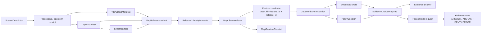
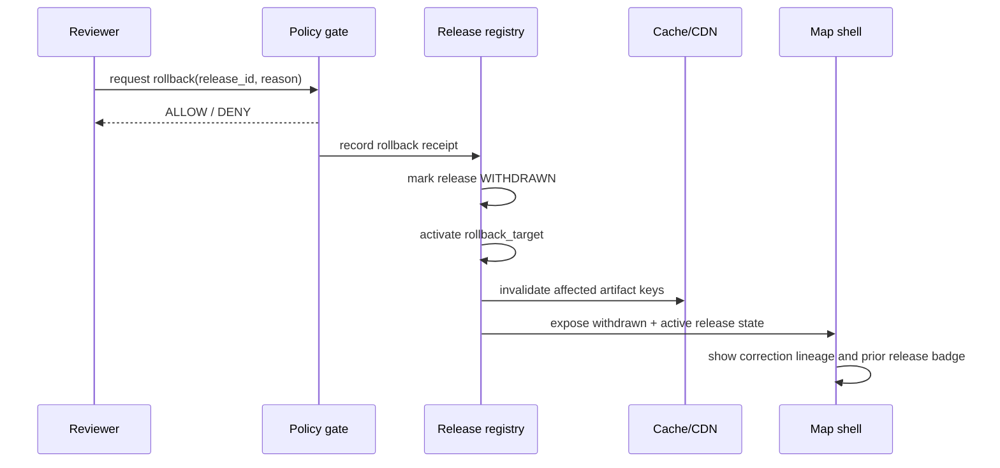

<!-- [KFM_META_BLOCK_V2]
doc_id: kfm://doc/REVIEW_REQUIRED_UUID
title: Verifiable Tile Rendering
type: standard
version: v1
status: draft
owners: REVIEW_REQUIRED_OWNER
created: 2026-04-30
updated: 2026-04-30
policy_label: REVIEW_REQUIRED_POLICY_LABEL
related: [REVIEW_REQUIRED_RELATED_PATHS]
tags: [kfm, architecture, tiles, maplibre, pmtiles, evidence, governance]
notes: [Created from attached KFM MapLibre, pipeline, and artifactization doctrine in a no-mounted-repo session; doc_id, owners, policy_label, related links, schema homes, and implementation status require repo verification before publication.]
[/KFM_META_BLOCK_V2] -->

<a id="top"></a>

# Verifiable Tile Rendering

Make map tiles inspectable, manifest-bound, evidence-resolving, policy-safe, and reversible before they become public KFM rendering surfaces.

<div align="left">


</div>

> [!IMPORTANT]
> A rendered tile is never KFM truth by itself. It is a downstream delivery artifact that becomes usable only when its source, transform, style, release, evidence support, policy posture, and rollback target are reviewable.

## Quick jumps

[Scope](#scope) · [Repo fit](#repo-fit) · [Rendering law](#rendering-law) · [Trust flow](#trust-flow) · [Object families](#object-families) · [Verification gates](#verification-gates) · [Runtime rules](#runtime-rules) · [Failure states](#failure-states) · [Examples](#examples) · [Validation](#validation) · [Rollback](#rollback) · [Open verification](#open-verification)

---

## Scope

This document defines the KFM architecture standard for **verifiable tile rendering**: the minimum conditions under which tile-backed map layers may be rendered in a public or semi-public KFM shell.

It covers:

- vector and raster tile delivery artifacts, including `MVT`, `PMTiles`, `MLT` pilot artifacts, raster tiles, and `COG`-backed raster overlays
- `LayerManifest`, `StyleManifest`, `TileArtifactManifest`, and `MapReleaseManifest` closure
- click-to-evidence behavior from rendered feature candidate to `EvidenceBundle`
- runtime receipt, cache, rollback, accessibility, and negative-state expectations
- tests that prove the renderer remains downstream of the KFM trust membrane

It does **not** define tile generation internals for every domain lane. Domain-specific tile production still belongs in the relevant lane architecture, source registry, pipeline, and validator docs.

<p align="right"><a href="#top">Back to top ↑</a></p>

---

## Repo fit

| Field | Value |
|---|---|
| **Target path** | `docs/architecture/tiles/VERIFIABLE_TILE_RENDERING.md` |
| **Doc type** | Standard architecture doc |
| **Implementation status** | `NEEDS VERIFICATION` — no mounted repo was available in the current authoring session |
| **Upstream doctrine** | KFM lifecycle law, MapLibre operating law, artifactization/proof-object doctrine, governed AI boundary |
| **Downstream consumers** | MapLibre shell docs, tile artifact schemas, release manifests, Evidence Drawer contracts, Focus Mode contracts, policy gates, CI smoke tests |
| **Adjacent docs to verify** | `../maplibre/README.md`, `../maplibre/DELIVERY.md`, `../maplibre/TEST_PLAN.md`, `../../adr/ADR-maplibre-mvt-mlt-posture.md`, `../../adr/ADR-maplibre-schema-home.md` |
| **Machine homes to verify** | `schemas/contracts/v1/maplibre/`, `contracts/api/maplibre/`, `policy/maplibre/`, `tests/fixtures/maplibre/`, `data/published/`, `data/receipts/`, `data/proofs/` |

> [!NOTE]
> Paths beyond this file are **PROPOSED** until the real repository tree, schema home, contracts home, workflows, and package conventions are inspected.

### Accepted inputs

This architecture accepts tile-rendering inputs only when they are tied to governed artifacts:

| Input | Belongs here when… |
|---|---|
| `TileArtifactManifest` | It identifies format, encoding, bounds, zoom range, artifact digest, source manifests, generator, and cache policy. |
| `LayerManifest` | It states what the layer means, what it may show, what it must withhold, its release identity, time model, sensitivity posture, and evidence requirement. |
| `StyleManifest` | It pins style JSON, sprites, glyphs, fonts, accessibility notes, and layer bindings. |
| `MapReleaseManifest` | It closes over artifacts, layers, styles, proof pack, previous release, rollback target, and public scope. |
| `EvidenceBundle` | It resolves the support behind a clicked feature or tile-backed claim. |
| `PolicyDecision` | It records whether rendering, interaction, export, or Focus use is allowed, denied, generalized, or forced to abstain. |
| `MapRuntimeReceipt` | It records runtime selection, release IDs, layer IDs, resolution outcomes, errors, and timing without becoming truth. |

### Exclusions

| Excluded item | Goes elsewhere |
|---|---|
| Raw source scraping or source activation | Source registry, lane ingestion docs, connector ADRs |
| Domain-specific normalization rules | Domain lane architecture and validators |
| Canonical evidence storage | Evidence/data architecture, not tile rendering |
| Review-state mutation | Governed API and review-console contracts |
| AI answer generation | Governed AI / Focus Mode contracts |
| Emergency or life-safety alerting | Out of KFM scope; link to official authorities only |
| Public rendering of exact restricted geometry | Denied unless a steward-approved public-safe transform exists |

<p align="right"><a href="#top">Back to top ↑</a></p>

---

## Rendering law

### One-sentence rule

**A tile is renderable only after KFM can prove what it is, where it came from, what it may show, what it withholds, which release it belongs to, how it resolves to evidence, and how it can be rolled back.**

### Non-negotiable invariants

| Invariant | Rendering consequence |
|---|---|
| `RAW → WORK / QUARANTINE → PROCESSED → CATALOG / TRIPLET → PUBLISHED` | Tile artifacts come from published or explicitly released delivery artifacts, not raw/work/quarantine stores. |
| Public clients use governed surfaces | The browser may load released tiles/styles and call governed APIs; it must not fetch canonical/internal stores. |
| Cite-or-abstain | A map-facing claim that cannot resolve to admissible evidence shows `ABSTAIN`, `MISSING_EVIDENCE`, or another explicit failure state. |
| Promotion is a governed state transition | A layer toggle, file move, CDN upload, or style edit is not publication approval. |
| Derived layers are not sovereign truth | Tiles, PMTiles, search indexes, graph projections, scenes, and summaries are carriers, not authorities. |
| Policy fails closed | Unknown rights, sensitivity, steward authority, source role, or release state blocks public rendering or forces generalization. |
| AI is interpretive only | Focus Mode may synthesize over released evidence, but it cannot turn tile properties or rendered pixels into root truth. |

<p align="right"><a href="#top">Back to top ↑</a></p>

---

## Trust flow



The renderer may expose a **candidate**. The governed API decides whether that candidate may become a claim-bearing interaction.

### Trust membrane test

A rendered-feature click is acceptable only when it can be explained as:

```text
visual candidate
→ governed lookup
→ EvidenceBundle
→ EvidenceDrawerPayload
→ optional Focus response
→ receipt / audit reference
```

The trust membrane is bypassed if a popup, Drawer, Focus response, export, or review action pulls consequential meaning directly from:

- raw feature properties
- unpublished candidate records
- browser-local hidden filters
- direct model output
- canonical/internal stores
- review-only or steward-only paths

<p align="right"><a href="#top">Back to top ↑</a></p>

---

## Object families

Field names below are **PROPOSED** until the schema home and actual repo conventions are verified.

| Object | Minimum role | Must include |
|---|---|---|
| `SourceDescriptor` | Establishes source authority and admissibility. | `source_id`, `source_role`, `rights`, `access_class`, `update_cadence`, `citation_policy`, `sensitivity_notes`, `verification_status` |
| `TileArtifactManifest` | Makes a tile derivative rebuildable and auditable. | `artifact_id`, `format`, `encoding`, `bounds`, `minzoom`, `maxzoom`, `source_manifest_ids`, `content_hash`, `spec_hash`, `cache_policy`, `generated_by` |
| `LayerManifest` | Tells the UI what a layer may show and what it must withhold. | `layer_id`, `domain`, `release_id`, `source_artifacts`, `geometry_policy`, `time_model`, `sensitivity_class`, `support_level`, `stale_policy` |
| `StyleManifest` | Separates visual design from unreviewed style edits. | `style_id`, `style_spec_version`, `style_json_hash`, `sprite_hash`, `glyph_hash`, `font_policy`, `layer_bindings`, `accessibility_notes` |
| `MapReleaseManifest` | Turns map publication into a governed release state. | `release_id`, `artifacts`, `layer_manifests`, `style_manifests`, `proof_pack_id`, `previous_release_id`, `rollback_target`, `public_scope` |
| `EvidenceRef` | Provides stable evidence pointer from feature/claim to support. | `evidence_ref_id`, `source_id`, `locator`, `spatial_scope`, `temporal_scope`, `claim_role`, `hash` or `spec_hash` |
| `EvidenceBundle` | Resolves support for Drawer and Focus. | `bundle_id`, `evidence_refs`, `source_roles`, `citations`, `review_state`, `policy_state`, `release_state`, `correction_lineage` |
| `EvidenceDrawerPayload` | Makes trust visible at the point of use. | `selection_id`, `claim_summary`, `evidence_bundle_id`, `citations`, `time_scope`, `policy_badges`, `transforms`, `withheld_counts`, `correction_state` |
| `PolicyDecision` | Makes allow/deny/generalize/abstain visible and testable. | `decision_id`, `subject_ref`, `policy_label`, `input_summary`, `outcome`, `reason_codes`, `review_state` |
| `MapRuntimeReceipt` | Records runtime behavior without becoming evidence authority. | `session_id`, `release_ids`, `layer_ids`, `interaction_type`, `resolution_outcome`, `timing`, `errors` |

> [!WARNING]
> A style JSON file, tile archive, or MapLibre popup must not become the only place where layer meaning, policy status, or source support is encoded.

<p align="right"><a href="#top">Back to top ↑</a></p>

---

## Verification gates

### Gate summary

| Gate | Purpose | Blocks when… | Minimum evidence |
|---|---|---|---|
| `T0_REPO_CONTEXT` | Prevent false implementation claims. | Repo tree, schema home, workflows, package markers, or app paths are unverified. | Repo scan transcript, branch state, package markers, adjacent docs inventory |
| `T1_SOURCE_CLOSURE` | Prevent authority and rights collapse. | Source role, rights, citation policy, or verification status is missing. | `SourceDescriptor` and source-role policy |
| `T2_ARTIFACT_INTEGRITY` | Prove artifact identity. | Artifact digest, byte size, spec hash, source refs, or generator receipt is missing/mismatched. | `TileArtifactManifest`, digest report, transform receipt |
| `T3_LAYER_STYLE_BINDING` | Prove rendering meaning. | Layer/style bindings are ad hoc, unhashed, inaccessible, or unreleaseable. | `LayerManifest`, `StyleManifest`, style hash, accessibility notes |
| `T4_POLICY_SENSITIVITY` | Fail closed before public exposure. | Rights unknown, source stale, restricted role, exact sensitive geometry, or release class mismatch. | `PolicyDecision`, transform receipt, withheld-feature accounting |
| `T5_RELEASE_CLOSURE` | Turn rendering into governed publication. | No proof pack, previous release, rollback target, or cache invalidation plan. | `MapReleaseManifest`, proof refs, rollback target |
| `T6_RUNTIME_BOUNDARY` | Keep browser downstream of trust. | Browser can fetch raw/work/quarantine/canonical stores or model runtime. | `no_public_raw_path`, `no_direct_model_client`, `no_unreleased_tile_load` |
| `T7_INTERACTION_EVIDENCE` | Make clicks inspectable. | Clicked feature cannot resolve to `EvidenceBundle` or visible failure state. | `EvidenceDrawerPayload`, citation validation, runtime receipt |
| `T8_ROLLBACK_CORRECTION` | Preserve reversibility. | Bad release cannot be withdrawn/restored or correction lineage is lost. | rollback receipt, previous manifest, cache invalidation record |

### Gate H placement

`Gate H` is a **PROPOSED** geospatial artifact-integrity gate for release candidates such as `PMTiles`, `COG`, and `GeoParquet`.

For tile rendering, Gate H should verify at least:

- artifact digest matches manifest
- manifest digest matches computed canonical form
- artifact media type is allowed for the release class
- source descriptor refs are present
- `spec_hash` is present and stable
- promotion candidate state is explicit
- policy label is present
- signature or proof bundle is present when required
- missing signature blocks promotion when signing is required

<p align="right"><a href="#top">Back to top ↑</a></p>

---

## Runtime rules

### Renderer permissions

MapLibre, or any future renderer, may:

- render released style, layer, sprite, glyph, terrain, projection, tile, and raster artifacts
- expose candidate feature identifiers, layer IDs, viewport, camera state, active time, and interaction state
- apply safe UI-only emphasis such as feature-state highlights
- collect timing and error receipts
- send candidate selections to governed APIs for resolution

It must not:

- read RAW, WORK, QUARANTINE, canonical, steward-only, proof-pack, review-only, or model-runtime stores directly
- treat rendered pixels, feature properties, style visibility, or popup text as evidence authority
- hide exact restricted geometry with client-side filters
- publish, approve, redact, generalize, cite, or correct claims without backend policy/review state
- silently suppress stale source, denied source, generalized geometry, or citation failure states

### Delivery decision matrix

| Choice | KFM default | Deviation rule |
|---|---|---|
| `MapLibre GL JS` vs native/mobile | GL JS first for the governed 2D shell. | Native/mobile only after parity, accessibility, and manifest-management burden are proven. |
| `MVT` vs `MLT` | MVT first for production thin slices. | MLT is pilot/bench until KFM validates tooling, parity, and release behavior. |
| `PMTiles` vs `Martin/PostGIS` | PMTiles for stable, public-safe, immutable bundles. | Martin/PostGIS when freshness, steward access, access control, or dynamic slicing matters. |
| `COG` vs raster tiles | COG for large raster or remote-sensing overlays. | Precomputed raster tiles for low-latency public display when artifacts are manifested. |
| `GeoJSON` vs vector tiles | Vector tiles for dense production layers. | GeoJSON for small fixtures, no-network tests, temporary review overlays, or low-risk debug surfaces. |
| Hand-edited style JSON | Development/review only. | Production style JSON must be hashed and bound through `StyleManifest`. |
| Basemaps | Contextual support only. | Basemap labels do not become KFM evidence claims. |

<p align="right"><a href="#top">Back to top ↑</a></p>

---

## Failure states

KFM should render trust failure explicitly. Empty panels and polished copy are not enough.

| State | Meaning | Required UI behavior |
|---|---|---|
| `TILE_ARTIFACT_MISSING` | Manifest references an unavailable artifact. | Hide or disable layer; show release diagnostic. |
| `TILE_DIGEST_MISMATCH` | Loaded artifact does not match manifest digest. | Block rendering; create review/incident record. |
| `STYLE_HASH_MISMATCH` | Style JSON, sprite, glyph, or font asset differs from manifest. | Block production load; fall back to prior release when available. |
| `LAYER_RELEASE_MISMATCH` | Layer points to a different release than active map context. | Disable claim interactions; show mismatch badge. |
| `UNRELEASED_TILE_LOAD` | Browser tries to load a tile not listed in release manifest. | Block request and record forbidden-path event. |
| `SOURCE_STALE` | Source freshness exceeds allowed policy. | Show stale badge; Focus must abstain or qualify. |
| `DENIED_BY_POLICY` | Rights, role, sensitivity, or release class blocks use. | Show denial reason code; do not render exact sensitive detail. |
| `GENERALIZED_GEOMETRY` | Geometry has been redacted/generalized for public safety. | Show transform badge and transform receipt link. |
| `MISSING_EVIDENCE` | Feature cannot resolve to admissible support. | Show abstain state; suppress authoritative popup language. |
| `CITATION_FAILED` | Claim or Focus answer citation validation failed. | Suppress answer; show citation failure. |
| `RELEASE_WITHDRAWN` | Active release has been withdrawn. | Fall back to prior release or show withdrawn state. |
| `RUNTIME_ERROR` | Renderer or governed API failure. | Preserve failure state; never substitute uncited prose. |

<p align="right"><a href="#top">Back to top ↑</a></p>

---

## Examples

The examples are illustrative contract shapes, not production schemas.

### Tile artifact manifest

```json
{
  "schema": "kfm.map.tile_artifact_manifest.v1",
  "artifact_id": "tileartifact_huc12_pmtiles_v1",
  "format": "pmtiles",
  "encoding": "mvt",
  "media_type": "application/vnd.pmtiles",
  "uri": "data/published/hydrology/huc12/huc12.pmtiles",
  "bounds": [-102.1, 36.9, -94.5, 40.1],
  "minzoom": 4,
  "maxzoom": 12,
  "source_manifest_ids": ["source_usgs_wbd_huc12_kansas_v1"],
  "content_hash": "sha256:REVIEW_REQUIRED_ARTIFACT_DIGEST",
  "spec_hash": "sha256:REVIEW_REQUIRED_SPEC_HASH",
  "byte_size": 0,
  "cache_policy": {
    "immutable": true,
    "cache_key": "release_id+artifact_id+content_hash",
    "invalidation_ref": "REVIEW_REQUIRED_CACHE_INVALIDATION_REF"
  },
  "generated_by": {
    "derivation_id": "derive_huc12_pmtiles_v1",
    "build_run_id": "REVIEW_REQUIRED_RUN_ID",
    "receipt_ref": "data/receipts/REVIEW_REQUIRED_RECEIPT.json"
  }
}
```

### Layer manifest

```json
{
  "schema": "kfm.map.layer_manifest.v1",
  "layer_id": "hydrology.huc12.public.v1",
  "domain": "hydrology",
  "release_id": "maprelease_hydrology_huc12_demo_v1",
  "source_artifacts": ["tileartifact_huc12_pmtiles_v1"],
  "geometry_policy": {
    "public_precision": "released_public_safe",
    "withheld_feature_accounting": true,
    "exact_sensitive_geometry_allowed": false
  },
  "time_model": {
    "source_time": "REVIEW_REQUIRED_SOURCE_TIME",
    "processing_time": "REVIEW_REQUIRED_PROCESSING_TIME",
    "release_time": "REVIEW_REQUIRED_RELEASE_TIME"
  },
  "evidence_policy": {
    "requires_evidence_bundle": true,
    "supports_popup_claims": false,
    "drawer_payload_contract": "kfm.map.evidence_drawer_payload.v1"
  },
  "sensitivity_class": "public_safe",
  "support_level": "evidence_resolving",
  "stale_policy": {
    "on_stale": "ABSTAIN_OR_BADGE",
    "max_age": "REVIEW_REQUIRED"
  }
}
```

### Runtime receipt

```json
{
  "schema": "kfm.map.runtime_receipt.v1",
  "session_id": "REVIEW_REQUIRED_SESSION_OR_TRACE_ID",
  "release_ids": ["maprelease_hydrology_huc12_demo_v1"],
  "layer_ids": ["hydrology.huc12.public.v1"],
  "interaction_type": "click",
  "selected_feature": {
    "layer_id": "hydrology.huc12.public.v1",
    "feature_id": "REVIEW_REQUIRED_FEATURE_ID"
  },
  "resolution_outcome": "EVIDENCE_BUNDLE_RESOLVED",
  "evidence_bundle_id": "REVIEW_REQUIRED_BUNDLE_ID",
  "timing": {
    "tile_load_ms": 0,
    "click_to_drawer_ms": 0
  },
  "errors": []
}
```

<p align="right"><a href="#top">Back to top ↑</a></p>

---

## Validation

Exact commands depend on the real repo stack and are **NEEDS VERIFICATION**. The command names below are proposed review targets, not confirmed scripts.

```bash
# PROPOSED — adapt to repo-native task runner.
make validate-tile-artifact-manifests
make validate-layer-manifests
make validate-style-manifests
make validate-map-release-manifests
make policy-maplibre-public-paths
make test-map-click-evidence-resolution
make test-maplibre-accessibility-smoke
make test-map-release-rollback
```

### Minimum test matrix

| Test | Expected result |
|---|---|
| `tile_artifact_manifest_valid` | Valid manifest passes schema. |
| `tile_artifact_digest_mismatch_blocks` | Mismatched artifact digest blocks rendering/promotion. |
| `style_hash_mismatch_blocks` | Unmanifested style edit is rejected. |
| `layer_release_id_check` | Layer and release identity align. |
| `clicked_feature_resolves_bundle` | Public-safe feature resolves to `EvidenceBundle`. |
| `missing_evidence_abstain` | Feature without support shows visible abstention. |
| `sensitive_geometry_deny` | Exact restricted geometry is blocked from public tile artifacts. |
| `source_rights_unknown_blocks_release` | Unknown rights deny promotion. |
| `no_public_raw_path` | Browser cannot reach raw/work/quarantine/canonical endpoints. |
| `no_direct_model_client` | Browser cannot call model runtimes directly. |
| `no_unreleased_tile_load` | Unmanifested tile URL is blocked. |
| `runtime_receipt_emitted` | Click/render path emits receipt without sensitive content. |
| `rollback_restores_prior_manifest` | Prior manifest can be restored and cache invalidation recorded. |
| `correction_lineage_visible` | Correction or withdrawal state remains visible after rollback. |
| `keyboard_focus_order_trust_states` | Trust chips, Drawer, and layer controls remain keyboard-accessible. |
| `non_color_trust_cues` | Policy/freshness/sensitivity state is not color-only. |

### Definition of done

A verifiable tile-rendering slice is done only when:

- [ ] repo context and schema home have been verified
- [ ] every renderable layer has a `LayerManifest`
- [ ] every style used in production has a `StyleManifest`
- [ ] every tile artifact has a `TileArtifactManifest`
- [ ] every public map release has a `MapReleaseManifest`
- [ ] every click that makes or implies a claim resolves to `EvidenceBundle` or a visible failure state
- [ ] policy denial, stale source, generalized geometry, and missing evidence are visible in the UI
- [ ] browser access to raw/work/quarantine/canonical/model-runtime paths is blocked and tested
- [ ] rollback restores the previous release without erasing correction history
- [ ] accessibility smoke tests cover trust states, Drawer access, and reduced-motion behavior
- [ ] docs, ADRs, schemas, fixtures, validators, and release notes update in the same PR as behavior

<p align="right"><a href="#top">Back to top ↑</a></p>

---

## Rollback

Rollback is a governed state transition, not a silent replacement of assets.

### Rollback must preserve

| Preserve | Reason |
|---|---|
| withdrawn release manifest | Maintainers need to know what was withdrawn and why. |
| previous release manifest | Restores public-safe rendering target. |
| rollback receipt | Records who/what initiated rollback, when, and under which policy. |
| correction notice | Prevents history erasure. |
| cache invalidation record | Proves clients should stop serving the bad artifact. |
| affected layer/style/artifact IDs | Enables targeted invalidation and review. |
| Evidence Drawer state | Users can see withdrawn/corrected support rather than stale authority. |

### Rollback flow



<p align="right"><a href="#top">Back to top ↑</a></p>

---

## Anti-patterns

Reject these even if the map appears to work:

| Anti-pattern | Why it fails KFM |
|---|---|
| Popup text copied from tile feature properties | Bypasses evidence resolution and citation validation. |
| Hidden client-side filters for sensitive features | Can leak counts, locations, or source presence. |
| Style-only publication | Treats visual change as release approval. |
| Unpinned sprite/glyph/style URLs | Breaks reproducibility and reviewability. |
| Live connector directly feeding public tiles | Bypasses lifecycle, source rights, and promotion gates. |
| AI reading tile properties as evidence | Converts derived data into generated truth. |
| Basemap label cited as KFM fact | Confuses context with evidence. |
| CDN upload without release manifest | Makes rollback and provenance unverifiable. |
| MLT default before KFM validation | Introduces parity/toolchain risk before proof. |
| 3D/terrain default for tile slice | Adds burden before 2D evidence continuity is proven. |

<p align="right"><a href="#top">Back to top ↑</a></p>

---

## Open verification

These items remain unresolved until the real repo is mounted and inspected.

| Item | Status | Verification action |
|---|---|---|
| Existing `docs/architecture/tiles/` convention | `UNKNOWN` | Inspect neighboring docs and naming patterns. |
| Owner/CODEOWNERS | `UNKNOWN` | Verify `.github/CODEOWNERS` or documented owner registry. |
| Policy label | `UNKNOWN` | Verify KFM policy label taxonomy. |
| Schema home | `NEEDS VERIFICATION` | Resolve `schemas/contracts/v1/` vs `contracts/` through ADR or existing repo convention. |
| Existing MapLibre docs | `UNKNOWN` | Check whether `docs/architecture/maplibre/` already exists. |
| Existing tile schemas | `UNKNOWN` | Search for `LayerManifest`, `StyleManifest`, `TileArtifactManifest`, `MapReleaseManifest`, `GeoManifest`. |
| Existing validators | `UNKNOWN` | Search `tools/validators/`, `policy/`, CI workflows, Makefile tasks. |
| Package manager/test runner | `UNKNOWN` | Inspect `package.json`, `pyproject.toml`, `Makefile`, lockfiles, workflow YAML. |
| Runtime route names | `UNKNOWN` | Inspect governed API route tree before naming endpoints. |
| Tile hosting model | `UNKNOWN` | Verify PMTiles/Martin/CDN/object storage/reverse proxy conventions. |
| Signing/toolchain | `UNKNOWN` | Verify Cosign/Sigstore/OPA/Conftest availability or repo-native equivalents. |
| Accessibility baseline | `UNKNOWN` | Verify current UI test tooling and design-system requirements. |

<p align="right"><a href="#top">Back to top ↑</a></p>
